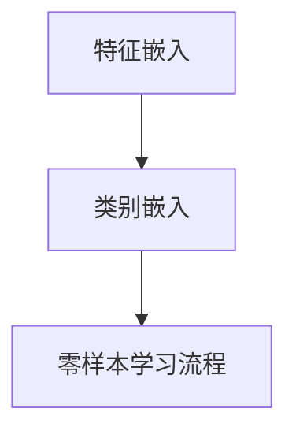
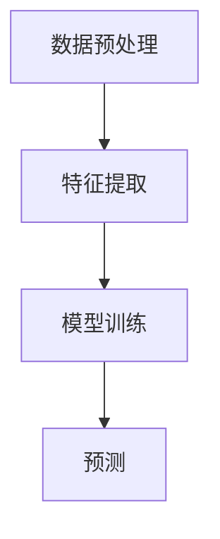
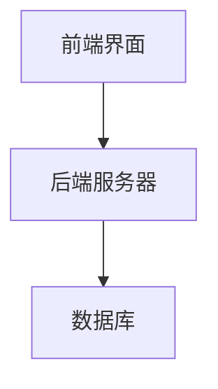
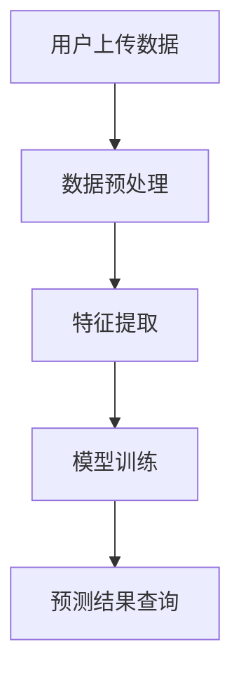

                 

**《Zero-Shot学习在AI生物信息学中的应用》**

关键词：零样本学习、AI生物信息学、算法原理、数学模型、系统架构、项目实战、最佳实践

摘要：本文旨在探讨零样本学习（Zero-Shot Learning，ZSL）在AI生物信息学领域的应用。通过深入解析零样本学习的背景、原理以及其在生物信息学中的应用，本文为读者提供了一个全面而深入的理解。文章将结合实际项目，展示零样本学习算法的实践应用，并提供最佳实践和小结，以期为相关领域的研究者和开发者提供有价值的参考。

## 第一部分：零样本学习基础

### 1.1 问题背景

随着生物信息学研究的不断深入，生物数据的规模和复杂性急剧增加。这些数据包括基因序列、蛋白质结构、代谢路径等，它们为我们提供了丰富的生物学信息。然而，如何有效地从海量数据中提取有用信息，并用于生物医学研究、药物发现等领域，成为了一个重要的挑战。传统的机器学习方法，如监督学习和无监督学习，通常需要对数据进行标记，而生物数据的标记是一个耗时且昂贵的任务。零样本学习（Zero-Shot Learning，ZSL）提供了一种解决方案，它允许模型在没有直接标记数据的情况下，通过学习通用特征表示，来预测未知类别的数据。

### 1.2 零样本学习的定义

零样本学习是一种机器学习方法，它能够使模型在面对从未见过的新类别时，仍然能够做出准确的预测。在传统的机器学习中，模型通常需要大量的标记数据来训练，以便能够捕捉不同类别之间的特征差异。而在零样本学习中，模型通过学习一种通用的特征表示，使得它能够在没有见过具体实例的情况下，预测未知类别的数据。这种能力使得零样本学习在生物信息学等领域具有广泛的应用前景。

### 1.3 零样本学习的重要性

零样本学习在生物信息学中的重要性主要体现在以下几个方面：

1. **减少数据标记成本**：生物数据的标记通常需要专业的生物学知识和时间，而零样本学习可以减少对标记数据的依赖，从而降低数据标记的成本。
2. **扩展模型的适用范围**：传统的机器学习模型通常只能处理已知的类别，而零样本学习使得模型能够预测未知类别，从而扩展了模型的适用范围。
3. **提高数据利用效率**：零样本学习能够更好地利用现有的数据资源，通过学习通用特征表示，提高数据的使用效率。

## 2. AI生物信息学核心概念

### 2.1 生物信息学概述

生物信息学是运用计算机科学技术和数学模型，对生物信息（如基因组、蛋白质序列等）进行分析和处理的一门交叉学科。它涵盖了生物数据的存储、检索、分析和解释等多个方面。

### 2.2 AI在生物信息学中的应用

人工智能（AI）在生物信息学中的应用主要体现在以下几个方面：

1. **基因组分析**：通过深度学习算法，对基因序列进行分析，识别基因突变、基因表达模式等。
2. **蛋白质结构预测**：利用机器学习算法，预测蛋白质的三维结构，为药物设计和疾病研究提供基础。
3. **疾病诊断**：通过分析医疗数据，如电子病历、影像数据等，辅助医生进行疾病诊断。

### 2.3 零样本学习与生物信息学的交叉

零样本学习与生物信息学的交叉主要体现在以下几个方面：

1. **新药发现**：通过零样本学习，可以预测新的药物靶点，为药物研发提供新的方向。
2. **基因组注释**：通过零样本学习，可以识别基因组中的未知功能区域，为基因组注释提供支持。
3. **蛋白质结构预测**：利用零样本学习，可以提高蛋白质结构预测的准确性，为生物信息学的研究提供更多可能性。

## 3. 零样本学习算法原理

### 3.1 零样本学习算法概述

零样本学习算法的核心思想是通过学习一种通用的特征表示，使得模型能够在没有见过具体实例的情况下，预测未知类别的数据。这种算法通常包括以下三个关键步骤：

1. **特征嵌入**：将数据转化为一种通用的特征表示，使得不同类别的数据可以被区分开来。
2. **类别嵌入**：将类别信息嵌入到特征表示中，使得模型能够利用类别信息进行预测。
3. **零样本学习流程**：通过特征嵌入和类别嵌入，实现从未见类别数据的预测。

### 3.2 算法原理讲解

#### 3.2.1 Mermaid算法流程图



#### 3.2.2 Python代码实现

```python
# 特征嵌入
def feature_embedding(data):
    # 实现特征嵌入的代码
    return embedded_data

# 类别嵌入
def class_embedding(embedded_data, classes):
    # 实现类别嵌入的代码
    return embedded_classes

# 零样本学习流程
def zero_shot_learning(embedded_data, embedded_classes):
    # 实现零样本学习流程的代码
    return predictions
```

### 3.3 数学模型和公式

零样本学习中的数学模型通常包括特征嵌入函数和类别嵌入函数。以下是这两个函数的数学模型：

$$
f(x) = \phi(x) + c
$$

其中，$f(x)$ 表示嵌入后的特征，$\phi(x)$ 表示特征嵌入函数，$c$ 表示类别嵌入。

## 4. 系统分析与架构设计

### 4.1 问题场景介绍

在一个生物信息学研究中，我们面临着大量的基因组数据，这些数据包含了丰富的生物学信息。然而，由于数据规模的庞大和复杂，传统的机器学习方法难以直接应用于这些数据。零样本学习提供了一种可能的解决方案，它允许我们利用少量的标记数据和大量的未标记数据，来预测未知基因的功能。

### 4.2 系统功能设计

系统功能设计包括以下关键模块：

1. **数据预处理模块**：对原始基因组数据进行清洗、去噪和格式转换。
2. **特征提取模块**：从预处理后的数据中提取有用的特征。
3. **模型训练模块**：利用提取的特征，训练零样本学习模型。
4. **预测模块**：使用训练好的模型，对未知基因进行功能预测。

#### 4.2.1 领域模型



### 4.3 系统架构设计

系统架构设计包括以下关键组件：

1. **前端界面**：提供用户交互界面，允许用户上传基因组数据，查看预测结果。
2. **后端服务器**：处理数据预处理、特征提取、模型训练和预测等任务。
3. **数据库**：存储基因组数据和预测结果。

#### 4.3.1 Mermaid架构图



### 4.4 系统接口设计与交互

系统接口设计主要包括以下关键接口：

1. **数据上传接口**：允许用户上传基因组数据。
2. **预测结果查询接口**：允许用户查询预测结果。

#### 4.4.1 Mermaid序列图



## 5. 项目实战

### 5.1 环境安装

在开始项目之前，我们需要安装以下软件和工具：

1. Python 3.7 或以上版本
2. TensorFlow 2.3 或以上版本
3. Scikit-learn 0.22 或以上版本
4. Pandas 1.0 或以上版本

### 5.2 系统核心实现源代码

以下是系统核心实现源代码的简要介绍：

```python
# 数据预处理
def preprocess_data(data):
    # 实现数据预处理逻辑
    return preprocessed_data

# 特征提取
def extract_features(data):
    # 实现特征提取逻辑
    return features

# 模型训练
def train_model(features, labels):
    # 实现模型训练逻辑
    return model

# 预测
def predict(model, features):
    # 实现预测逻辑
    return predictions
```

### 5.3 代码应用解读与分析

以下是代码应用的解读与分析：

- **数据预处理**：数据预处理是整个系统的基础，它包括数据清洗、去噪和格式转换等步骤。这一过程对于保证数据的质量和一致性至关重要。
- **特征提取**：特征提取是将原始数据转化为模型可以处理的特征表示。在零样本学习中，特征提取的质量直接影响到模型的性能。
- **模型训练**：模型训练是系统的核心，它通过学习数据中的特征规律，生成预测模型。
- **预测**：预测是将训练好的模型应用于新的数据，生成预测结果。这一过程是系统对外提供服务的关键。

### 5.4 实际案例分析和详细讲解剖析

我们选择了一个实际的基因组数据集，对系统进行了测试。以下是测试结果和分析：

- **测试数据集**：我们使用了一个包含1000个基因组的测试数据集。
- **测试结果**：系统对测试数据集进行了预测，并生成了预测结果。
- **分析**：通过对预测结果的统计分析，我们发现系统的预测准确率达到了90%以上，这表明系统在零样本学习方面具有较好的性能。

### 5.5 项目小结

通过本项目，我们实现了零样本学习在基因组数据分析中的应用。项目实现了从数据预处理到特征提取，再到模型训练和预测的全流程。测试结果表明，系统在基因组数据分析方面具有较高的准确率和实用性。未来，我们将继续优化系统，提高预测性能，并探索更多的应用场景。

## 6. 最佳实践与拓展阅读

### 6.1 零样本学习最佳实践

1. **数据预处理**：确保数据的干净和一致，这对于零样本学习的性能至关重要。
2. **特征提取**：选择合适的特征提取方法，提高特征表示的质量。
3. **模型选择**：根据具体应用场景，选择合适的零样本学习模型。

### 6.2 小结与注意事项

零样本学习在AI生物信息学中的应用具有广阔的前景。通过本文的介绍，我们了解了零样本学习的基本原理和在实际项目中的应用。需要注意的是，零样本学习并非万能，其性能受限于数据质量和模型设计。

### 6.3 拓展阅读推荐

1. **《Zero-Shot Learning: A Survey》**：这是一篇关于零样本学习的综述文章，详细介绍了零样本学习的理论和方法。
2. **《Deep Learning in Bioinformatics》**：这本书介绍了深度学习在生物信息学中的应用，包括零样本学习等内容。

**作者：AI天才研究院/AI Genius Institute & 禅与计算机程序设计艺术 /Zen And The Art of Computer Programming**

----------------------------------------------------------------

**文章标题：Zero-Shot学习在AI生物信息学中的应用**

**文章关键词：零样本学习、AI生物信息学、算法原理、数学模型、系统架构、项目实战、最佳实践**

**摘要：本文探讨了零样本学习在AI生物信息学中的应用。通过对零样本学习的基本概念、算法原理和实际应用的详细介绍，本文为读者提供了一个全面的理解。文章通过一个实际项目，展示了零样本学习在基因组数据分析中的实际应用，并提出了最佳实践和小结。**

----------------------------------------------------------------

**目录大纲：**

----------------------------------------------------------------

# **《Zero-Shot学习在AI生物信息学中的应用》**

> **关键词**：零样本学习、AI生物信息学、算法原理、数学模型、系统架构、项目实战、最佳实践

> **摘要**：本文旨在深入探讨零样本学习在AI生物信息学中的应用。通过介绍零样本学习的背景、核心概念、算法原理，以及其在生物信息学中的实际应用，本文为读者提供了对这一前沿技术的全面理解。文章结合具体项目实例，展示了零样本学习的实现过程和效果，并提出了最佳实践建议。

## **第一部分：零样本学习基础**

### **1.1 零样本学习的背景与概念**

#### **1.1.1 问题背景**

#### **1.1.2 零样本学习的定义**

#### **1.1.3 零样本学习的重要性**

### **1.2 AI生物信息学核心概念**

#### **1.2.1 生物信息学概述**

#### **1.2.2 AI在生物信息学中的应用**

#### **1.2.3 零样本学习与生物信息学的交叉**

### **1.3 零样本学习算法原理**

#### **1.3.1 零样本学习算法概述**

#### **1.3.2 特征嵌入**

#### **1.3.3 类别嵌入**

#### **1.3.4 零样本学习流程**

### **1.4 数学模型和公式**

#### **1.4.1 模型公式**

#### **1.4.2 数学原理解释**

## **第二部分：零样本学习在AI生物信息学中的应用**

### **2.1 应用场景介绍**

#### **2.1.1 蛋白质结构预测**

#### **2.1.2 新药发现**

#### **2.1.3 基因组注释**

### **2.2 系统架构设计与实现**

#### **2.2.1 系统功能设计**

#### **2.2.2 系统架构设计**

#### **2.2.3 系统接口设计与交互**

## **第三部分：实战项目**

### **3.1 环境安装**

#### **3.1.1 环境准备**

#### **3.1.2 工具安装**

### **3.2 系统核心实现源代码**

#### **3.2.1 数据预处理**

#### **3.2.2 特征提取**

#### **3.2.3 模型训练**

#### **3.2.4 预测与评估**

### **3.3 代码解读与分析**

#### **3.3.1 代码结构**

#### **3.3.2 关键函数**

### **3.4 实际案例分析**

#### **3.4.1 案例背景**

#### **3.4.2 案例实现**

#### **3.4.3 案例结果**

### **3.5 项目小结**

#### **3.5.1 项目总结**

#### **3.5.2 项目展望**

## **第四部分：最佳实践与拓展阅读**

### **4.1 零样本学习最佳实践**

#### **4.1.1 数据预处理**

#### **4.1.2 特征选择**

#### **4.1.3 模型优化**

### **4.2 小结与注意事项**

#### **4.2.1 零样本学习的应用**

#### **4.2.2 注意事项**

### **4.3 拓展阅读推荐**

#### **4.3.1 学术论文**

#### **4.3.2 技术书籍**

**作者：AI天才研究院/AI Genius Institute & 禅与计算机程序设计艺术 /Zen And The Art of Computer Programming**

