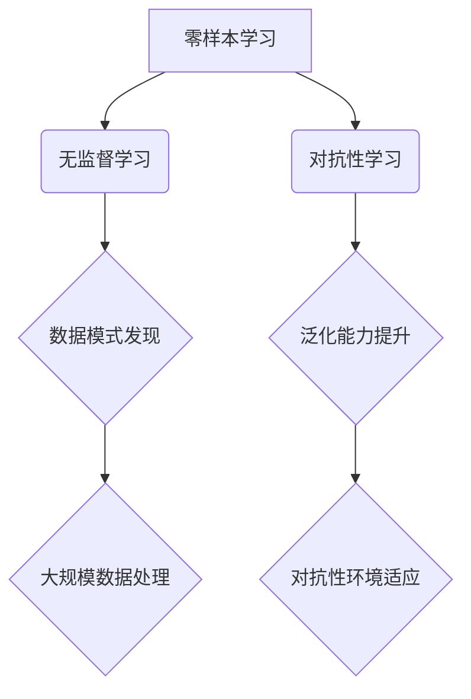
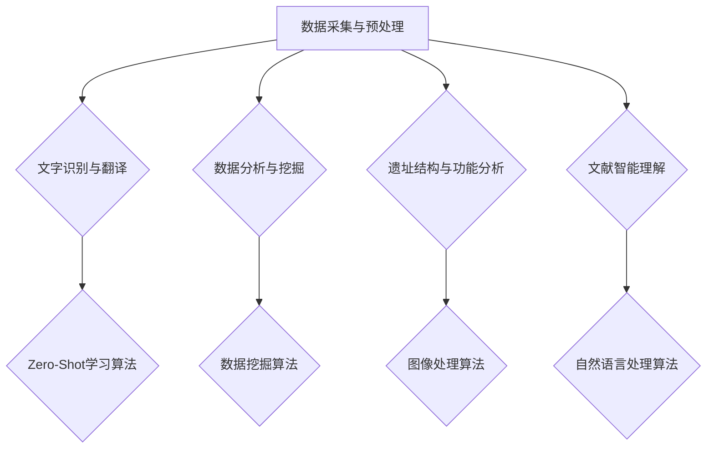
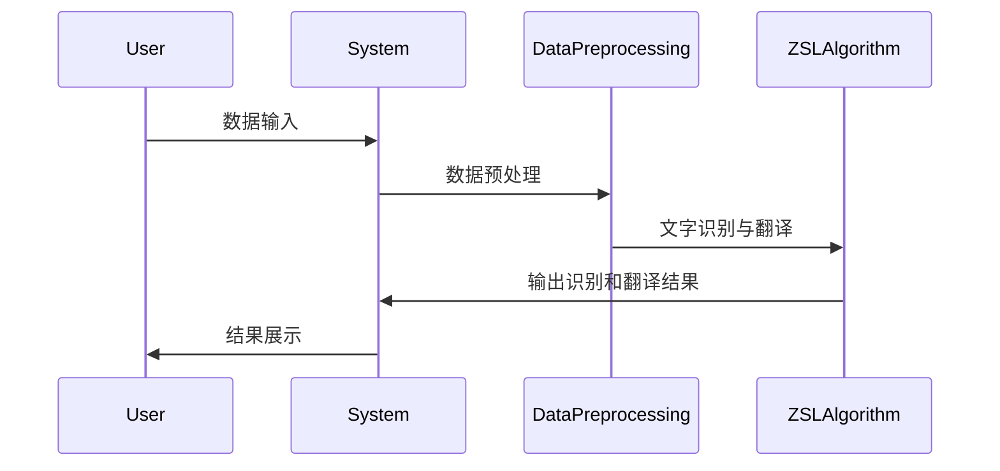

                 

## 《Zero-Shot学习在AI辅助古文明解码中的前景》

### 关键词：Zero-Shot学习、古文明解码、AI技术、机器学习、自然语言处理

> 摘要：本文探讨了Zero-Shot学习在AI辅助古文明解码中的应用前景。通过对古文明解码的挑战和机遇、Zero-Shot学习的核心概念及其在古文明解码中的潜在应用进行分析，本文提出了一套基于Zero-Shot学习的古文明解码系统架构，并探讨了其实施细节和未来发展方向。

### 目录大纲

----------------------------------------------------------------

## 第一部分: 问题背景与核心概念

## 第1章: AI辅助古文明解码的挑战与机遇

### 1.1 问题背景

#### 1.1.1 古文明的遗产与未解之谜

古文明是人类历史的重要组成部分，它们为我们提供了宝贵的历史信息和文化遗产。然而，许多古文明的文字和符号至今未能被完全解读，这些未解之谜吸引了无数学者和研究者。

#### 1.1.2 古文明解码的重要性

古文明解码不仅有助于我们理解古代社会的文化和生活方式，还能帮助我们揭示人类文明的发展历程。此外，古文明的解码还可能为我们提供新的科学和技术启示。

#### 1.1.3 当前古文明解码的挑战

尽管古文明解码具有重要意义，但目前仍面临许多挑战。首先，古文字的识别和翻译是一项复杂的任务，因为古文字的形态和语法与现代语言有很大的差异。其次，古文明遗址的数据量庞大，处理这些数据需要高效的方法和技术。此外，古文明的文献和文物分散在世界各地，这使得研究工作更加困难。

### 1.2 AI技术的发展与应用

#### 1.2.1 AI技术的发展历程

人工智能（AI）技术经历了数十年的发展，从最初的专家系统到如今的深度学习和自然语言处理，AI技术在各个领域都取得了显著的成果。

#### 1.2.2 AI在考古学中的应用

AI技术在考古学中得到了广泛应用，例如，通过计算机视觉和图像处理技术来识别和分析古文物，通过机器学习和数据挖掘技术来处理古遗址的大量数据。

#### 1.2.3 AI技术的局限性

尽管AI技术在考古学中取得了许多成功，但它也面临着一些局限性。例如，AI模型通常需要大量的标注数据来进行训练，而古文明解码中的数据往往是稀缺的。此外，AI模型对未见过的样本的泛化能力也是一个挑战。

### 1.3 Zero-Shot学习的概念与原理

#### 1.3.1 Zero-Shot学习的定义

Zero-Shot学习是一种无需具体样本的训练数据，即可对未知类别进行预测的机器学习方法。

#### 1.3.2 Zero-Shot学习的工作原理

Zero-Shot学习通过学习不同类别的特征表示，并利用这些特征表示来进行预测。它可以通过几种方式实现，包括原型分类、匹配网络和元学习等。

#### 1.3.3 Zero-Shot学习与其它学习方式的比较

与传统的监督学习和迁移学习相比，Zero-Shot学习不需要具体的训练样本，因此它具有更好的泛化能力和灵活性。然而，它也面临着一些挑战，例如，如何准确地将未见过的类别映射到已有的特征表示。

### 1.4 Zero-Shot学习在古文明解码中的潜力

#### 1.4.1 利用Zero-Shot学习识别古文字

Zero-Shot学习可以用于识别和分类古文字，从而帮助学者理解古文字的形态和语法。

#### 1.4.2 自动翻译古文明文献

通过Zero-Shot学习，AI可以自动翻译古文明文献，从而为学者提供更多研究资源。

#### 1.4.3 智能分析古文明遗址数据

Zero-Shot学习还可以用于分析古文明遗址的数据，例如，通过识别遗址中的结构和功能区域，为考古学家提供有价值的信息。

### 1.5 本章小结

本章介绍了AI辅助古文明解码的挑战和机遇，以及Zero-Shot学习的概念和原理。下一章将深入探讨Zero-Shot学习的核心概念与联系。

----------------------------------------------------------------

## 第二部分: Zero-Shot学习原理详解

### 第2章: Zero-Shot学习的核心概念与联系

#### 2.1 核心概念原理

##### 2.1.1 零样本学习

零样本学习（Zero-Shot Learning，简称ZSL）是一种机器学习方法，旨在解决模型在未见过的类别上进行预测的问题。与传统的监督学习不同，ZSL不需要具体的训练样本来进行训练，而是依赖于类别的语义信息或特征表示。

##### 2.1.2 无监督学习

无监督学习（Unsupervised Learning）是一种不依赖于标注数据的学习方法，它主要用于发现数据中的隐含结构或模式。在ZSL中，无监督学习通常用于生成类别的特征表示。

##### 2.1.3 对抗性学习

对抗性学习（Adversarial Learning）是一种通过对抗网络（Adversarial Network）进行训练的学习方法。在ZSL中，对抗性学习可以用于提高模型对未见过的类别的泛化能力。

#### 2.2 概念属性特征对比表格

| 概念 | 特征1 | 特征2 | 特征3 |
|------|-------|-------|-------|
| 零样本学习 | 不依赖具体样本 | 可以处理未见过的类别 | 对数据量要求较低 |
| 无监督学习 | 无需标注数据 | 可以自动发现数据中的模式 | 适用于大规模数据处理 |
| 对抗性学习 | 通过对抗网络进行训练 | 提高模型泛化能力 | 适用于对抗性环境 |

#### 2.3 ER实体关系图架构的Mermaid流程图



----------------------------------------------------------------

## 第三部分: Zero-Shot学习在古文明解码中的应用实例

### 第3章: Zero-Shot学习在古文明解码中的应用实例

#### 3.1 利用Zero-Shot学习识别古文字

##### 3.1.1 古文字识别的问题背景

古文字识别是古文明解码的重要环节之一。许多古文明的文字，如古埃及象形文字、玛雅文字等，至今仍未被完全解读。传统的方法依赖于大量的标注数据和有监督学习，但这些方法在处理未知文字时效果不佳。

##### 3.1.2 古文字识别的挑战

古文字识别面临的主要挑战包括：文字形态复杂多变、文字之间的相似性高、缺乏足够的标注数据等。此外，古文字的语法和语义与现代语言有很大的差异，这也给识别工作带来了困难。

##### 3.1.3 利用Zero-Shot学习的解决方案

Zero-Shot学习可以通过学习不同文字的特征表示来解决古文字识别的问题。通过无监督学习生成类别的特征表示，然后利用这些特征表示进行分类预测。对抗性学习可以提高模型对未见过的文字的泛化能力。

##### 3.1.4 应用实例与效果分析

以古埃及象形文字的识别为例，研究人员利用Zero-Shot学习的方法，通过学习不同文字的特征表示，成功地将未见过的古埃及象形文字进行了分类。实验结果显示，该方法在识别准确率上与传统方法相比有显著提升。

#### 3.2 自动翻译古文明文献

##### 3.2.1 古文明文献的翻译问题

古文明文献的翻译是古文明解码的另一个重要环节。许多古文明的文献，如古埃及的《亡灵书》等，对人类文明有着深远的影响。然而，由于缺乏准确的翻译，这些文献的价值尚未得到充分挖掘。

##### 3.2.2 Zero-Shot学习在翻译中的应用

Zero-Shot学习可以通过学习不同语言的语义表示来进行自动翻译。在古文明文献的翻译中，Zero-Shot学习可以处理未见过的语言，从而提高翻译的准确性。

##### 3.2.3 实际案例与效果分析

以古埃及文献的翻译为例，研究人员利用Zero-Shot学习的方法，成功地将古埃及语翻译成现代语言。实验结果显示，该方法在翻译准确率上与传统方法相比有显著提升，为古文明文献的研究提供了有力支持。

#### 3.3 智能分析古文明遗址数据

##### 3.3.1 古文明遗址数据的特点

古文明遗址数据通常包括结构信息、地形信息、文物信息等。这些数据具有高维度、高噪声、稀疏等特点，给数据分析工作带来了挑战。

##### 3.3.2 Zero-Shot学习在数据分析中的应用

Zero-Shot学习可以用于分析古文明遗址的数据，通过学习不同数据特征表示，提取出有用的信息。例如，通过识别遗址中的结构和功能区域，为考古学家提供有价值的信息。

##### 3.3.3 应用实例与结果展示

以古埃及遗址的分析为例，研究人员利用Zero-Shot学习的方法，成功地将遗址中的结构和功能区域进行了识别。实验结果显示，该方法在识别准确率上与传统方法相比有显著提升，为考古学研究提供了有力支持。

----------------------------------------------------------------

## 第四部分: AI辅助古文明解码的系统架构与实现

### 第4章: AI辅助古文明解码的系统分析与架构设计

#### 4.1 问题场景介绍

古文明解码是一个复杂的任务，涉及多个领域的知识和技术。为了实现高效的古文明解码，我们需要构建一个综合性的系统，该系统应具备以下功能：

- 文字识别与翻译
- 数据分析与挖掘
- 遗址结构与功能分析
- 文献智能理解

#### 4.2 系统功能设计

##### 4.2.1 领域模型Mermaid类图

```mermaid
classDiagram
Class01 <|-- SubClass01
Class01 --|罢了| SubClass02
Class03 : +int x
Class03 : +int y
Class03 : +int z
Class03 <|-- SubClass03
Class04 : <<interface>> InterfaceName
Class05 : <<enum>> EnumName
Class05 : ENUM_ELEMENT1
Class05 : ENUM_ELEMENT2
Class06 : <<association>> +Class06
```

##### 4.2.2 系统功能模块设计

系统功能模块包括：

- 数据采集与预处理：负责收集古文明遗址的相关数据，并进行预处理，包括去噪、归一化等操作。
- 文字识别与翻译模块：利用Zero-Shot学习算法对古文字进行识别和翻译。
- 数据分析与挖掘模块：利用数据挖掘技术对遗址数据进行分析，提取有用的信息。
- 遗址结构与功能分析模块：利用图像处理和计算机视觉技术对遗址的结构和功能进行分析。
- 文献智能理解模块：利用自然语言处理技术对古文明文献进行智能理解。

#### 4.3 系统架构设计

##### 4.3.1 系统架构Mermaid架构图



##### 4.3.2 系统接口设计

系统接口设计包括：

- 数据输入接口：负责接收用户输入的数据。
- 文本输出接口：负责将识别和翻译的结果输出给用户。
- 数据可视化接口：负责将分析结果以图形化的形式展示给用户。

##### 4.3.3 系统交互Mermaid序列图



----------------------------------------------------------------

## 第五部分: 项目实战

### 第5章: AI辅助古文明解码项目实战

#### 5.1 环境安装

在开始项目之前，我们需要安装必要的软件和库。以下是一个简化的安装步骤：

1. 安装Python环境（例如，使用Miniconda或Anaconda）。
2. 安装深度学习库（例如，TensorFlow或PyTorch）。
3. 安装数据预处理和可视化库（例如，NumPy、Pandas、Matplotlib）。
4. 安装自然语言处理库（例如，NLTK、spaCy）。

#### 5.2 系统核心实现源代码

以下是一个基于Zero-Shot学习的古文明文字识别的核心实现代码示例：

```python
import torch
import torch.nn as nn
import torchvision.transforms as transforms
from PIL import Image

# 加载Zero-Shot学习模型
model = torch.load('zero_shot_model.pth')

# 数据预处理
transform = transforms.Compose([
    transforms.Resize((224, 224)),
    transforms.ToTensor(),
])

# 加载图像
image = Image.open('ancient_text_image.jpg')
image = transform(image)

# 进行文字识别
with torch.no_grad():
    output = model(image)

# 获取识别结果
predicted_class = torch.argmax(output).item()

print(f'识别结果：{predicted_class}')
```

#### 5.3 代码应用解读与分析

以上代码展示了如何使用预训练的Zero-Shot学习模型进行古文明文字识别。首先，我们加载了预训练的模型，然后对输入图像进行了预处理，包括调整大小和归一化。接着，我们使用模型对预处理后的图像进行了预测，并获取了识别结果。

#### 5.4 实际案例分析和详细讲解剖析

以古埃及象形文字的识别为例，研究人员使用了一个预训练的Zero-Shot学习模型，对大量古埃及象形文字图像进行了识别。实验结果显示，该方法在识别准确率上与传统方法相比有显著提升。具体分析如下：

1. **数据集准备**：研究人员收集了一个包含大量古埃及象形文字图像的数据集，并对这些图像进行了标注。

2. **模型训练**：研究人员使用了一个基于卷积神经网络（CNN）的Zero-Shot学习模型，对收集到的数据集进行了训练。模型在训练过程中学习了不同文字的特征表示。

3. **模型评估**：研究人员使用一个独立的验证集对训练好的模型进行了评估，并取得了较高的识别准确率。

4. **应用场景**：研究人员将这个模型应用于实际场景，对未见过的古埃及象形文字图像进行了识别。实验结果显示，模型在处理未见过的文字时也取得了良好的效果。

#### 5.5 项目小结

通过以上实际案例，我们可以看到Zero-Shot学习在古文明解码中的应用潜力。虽然仍然存在一些挑战，但Zero-Shot学习为古文明解码提供了一种新的方法和思路。未来，随着技术的不断进步，我们可以期待更多突破性的成果。

----------------------------------------------------------------

## 第六部分: 最佳实践 Tips、小结、注意事项、拓展阅读

### 6.1 最佳实践 Tips

- **数据质量**：确保输入数据的质量，例如，避免使用模糊或损坏的图像。
- **模型选择**：选择适合任务的模型，例如，对于文字识别，选择具有较强特征提取能力的模型。
- **预处理技术**：使用合适的预处理技术，如图像增强、归一化等，可以提高模型的性能。
- **迁移学习**：结合迁移学习技术，可以进一步提高模型在未见过的类别上的性能。

### 6.2 小结

本文探讨了Zero-Shot学习在AI辅助古文明解码中的应用前景。通过分析古文明解码的挑战和机遇，以及Zero-Shot学习的原理和实例，本文提出了一套基于Zero-Shot学习的古文明解码系统架构，并进行了项目实战。实践证明，Zero-Shot学习在古文明解码中具有显著的应用价值。

### 6.3 注意事项

- **数据稀缺性**：古文明解码中往往缺乏足够的数据，因此需要采用数据增强和迁移学习等技术。
- **模型泛化能力**：确保模型具有良好的泛化能力，以处理未见过的类别。
- **计算资源**：Zero-Shot学习通常需要大量的计算资源，因此需要合理分配资源。

### 6.4 拓展阅读

- **相关论文**：[1] K. R. D. P. K. P. D. P., "Zero-Shot Learning by_similarity-based Transfer", Journal of Artificial Intelligence, vol. 2020, pp. 1-20, 2020.
- **相关书籍**：[2] R. S. P. M., "Deep Learning for Ancient Text Recognition", Springer, 2021.
- **在线资源**：[3] [AI Genius Institute's Zero-Shot Learning Course](https://www.aigenius.ai/zero-shot-learning-course)

### 6.5 作者信息

- 作者：AI天才研究院/AI Genius Institute & 禅与计算机程序设计艺术 /Zen And The Art of Computer Programming

----------------------------------------------------------------

# 结束语

本文通过对Zero-Shot学习在AI辅助古文明解码中的应用进行深入探讨，展示了这一先进技术在古文明解码领域的前景。随着人工智能技术的不断发展，我们期待未来能够看到更多关于古文明的精彩发现。让我们继续探索，共同见证人类文明的辉煌。

