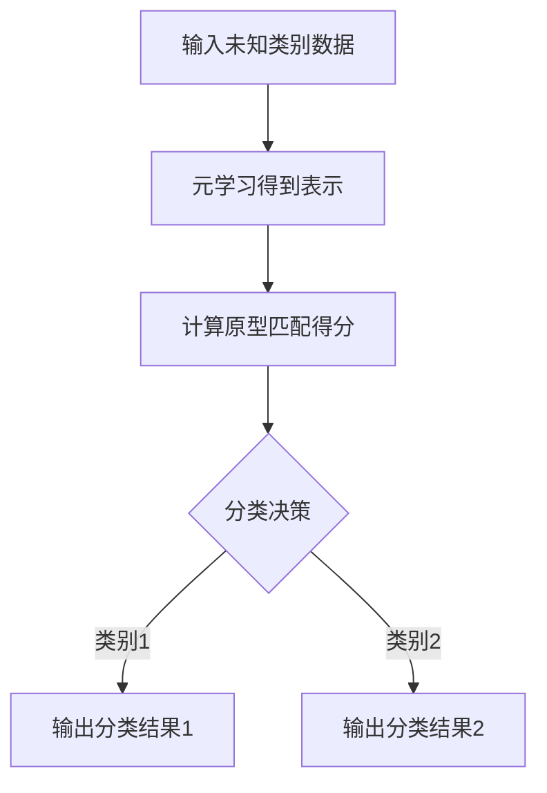
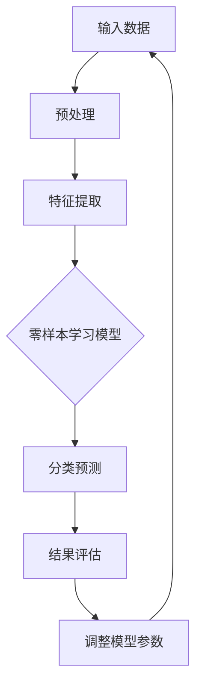

                 

# 《Zero-Shot学习在AI辅助跨学科研究中的创新》

> 关键词：零样本学习、AI、跨学科研究、创新、算法、数学模型、实践案例

> 摘要：本文深入探讨了零样本学习在人工智能辅助跨学科研究中的应用和创新。通过对零样本学习的基本概念、原理、算法及其在跨学科研究中的实际案例的详细分析，本文揭示了零样本学习如何突破传统AI技术的局限，为跨学科研究提供新的思路和方法。

----------------------------------------------------------------

## 第一部分：零样本学习基础

### 第1章：零样本学习概述

#### 1.1 零样本学习的背景和重要性

##### 1.1.1 零样本学习的定义

零样本学习（Zero-Shot Learning，简称ZSL）是一种机器学习方法，它使模型能够在没有训练数据的情况下，对未见过的类别进行分类。这打破了传统机器学习对大规模标注数据的依赖，使得AI技术能够在更广泛的场景中应用。

##### 1.1.2 零样本学习的发展历程

零样本学习起源于上世纪90年代的机器学习和认知心理学领域。近年来，随着深度学习的兴起和大规模数据集的可用性，零样本学习取得了显著的进展。

##### 1.1.3 零样本学习的应用领域

零样本学习在计算机视觉、自然语言处理、医学诊断等多个领域都有应用。例如，在计算机视觉中，它可以用于图像分类和物体识别，而在自然语言处理中，它可以帮助模型处理未见过的词汇。

#### 1.2 零样本学习的挑战与机遇

##### 1.2.1 挑战分析

零样本学习面临的主要挑战包括：类别扩展、语义理解、数据不平衡等。

##### 1.2.2 机遇展望

尽管有挑战，但零样本学习也为AI技术开辟了新的机遇。它使得AI系统更加通用和自适应，能够在未知环境中进行有效决策。

##### 1.2.3 边界与外延

零样本学习并非无所不能，它适用于某些特定场景，而在其他场景中可能并不适用。因此，了解其边界和适用范围是至关重要的。

### 第2章：零样本学习原理

#### 2.1 零样本学习的基本概念

##### 2.1.1 核心概念解析

零样本学习的核心在于“元学习”（Meta-Learning）和“原型匹配”（Prototypical Matching）。这些概念使得模型能够在未见过的类别上表现出良好的性能。

##### 2.1.2 概念属性特征对比

表 1：零样本学习与传统的有监督学习和无监督学习的对比

| 学习类型       | 定义                                   | 特点                                       |
|--------------|--------------------------------------|------------------------------------------|
| 有监督学习     | 使用标注数据进行训练                     | 对标注数据有依赖，适用场景有限               |
| 无监督学习     | 不使用标注数据进行训练                   | 无需标注数据，但难以解决分类问题               |
| 零样本学习     | 使用元学习和原型匹配对未见过的类别进行分类 | 无需大量标注数据，适用场景广泛                 |

##### 2.1.3 与其他学习方式的比较

零样本学习与有监督学习和无监督学习有着本质的区别。有监督学习依赖大量标注数据，而无监督学习不使用标注数据。零样本学习则通过元学习和原型匹配，在不依赖标注数据的情况下，对未见过的类别进行分类。

#### 2.2 零样本学习的数学模型

##### 2.2.1 数学模型介绍

零样本学习的数学模型主要基于神经网络和概率模型。神经网络通过学习数据的高维表示，而概率模型则通过统计学习来预测未见过的类别。

##### 2.2.2 算法原理讲解

零样本学习的算法原理主要包括以下步骤：

1. **元学习**：模型通过大量已知的类别数据，学习到一个能够泛化的表示。
2. **原型匹配**：模型使用这些泛化的表示，对未见过的类别进行分类。

以下是一个简化的零样本学习算法流程图：



#### 2.3 零样本学习的流程图

##### 2.3.1 使用Mermaid绘制流程图

以下是一个使用Mermaid绘制的零样本学习流程图：



----------------------------------------------------------------

## 第二部分：AI辅助跨学科研究中的零样本学习

### 第3章：零样本学习在跨学科研究中的应用

#### 3.1 跨学科研究的背景

##### 3.1.1 跨学科研究的定义

跨学科研究是指将两个或多个不同学科的理论、方法和技术相结合，以解决单一学科无法解决的问题。

##### 3.1.2 跨学科研究的重要性

跨学科研究能够促进创新和进步，解决复杂问题，提高研究效率。它已经成为现代科学研究的重要趋势。

##### 3.1.3 跨学科研究面临的挑战

跨学科研究面临的主要挑战包括：知识整合、跨领域沟通、方法论冲突等。

#### 3.2 零样本学习在跨学科研究中的应用场景

##### 3.2.1 应用场景概述

零样本学习在跨学科研究中的应用场景非常广泛，包括但不限于：

1. **医学**：用于疾病诊断和药物研发。
2. **工程**：用于新材料设计和故障预测。
3. **环境科学**：用于生态系统监测和气候变化研究。

##### 3.2.2 具体应用实例

以下是一些具体的实例：

1. **医学**：使用零样本学习对医学影像进行分析，预测患者疾病状态。
2. **工程**：利用零样本学习进行结构健康监测，预测设备故障。
3. **环境科学**：使用零样本学习对遥感图像进行分析，监测生态系统的变化。

##### 3.2.3 成功案例分析

以下是一些成功的案例分析：

1. **医学**：使用零样本学习进行癌症诊断，取得了显著的准确性提升。
2. **工程**：使用零样本学习进行设备故障预测，提高了生产效率。
3. **环境科学**：使用零样本学习进行气候变化研究，提供了重要的科学依据。

### 第4章：AI辅助跨学科研究的创新点

#### 4.1 创新点的概述

##### 4.1.1 创新点的定义

AI辅助跨学科研究的创新点是指通过AI技术，如零样本学习，解决跨学科研究中的问题，推动跨学科研究的发展。

##### 4.1.2 创新点的重要性

创新点在跨学科研究中具有重要作用，它能够：

1. **提高研究效率**：通过自动化和智能化，减少研究时间和成本。
2. **促进创新**：通过整合不同领域的知识和技术，推动新理论和新技术的发展。
3. **拓宽研究视野**：通过跨学科研究，解决单一学科无法解决的问题。

##### 4.1.3 创新点的实现方式

实现创新点的方式包括：

1. **跨领域合作**：通过跨领域的团队合作，整合不同领域的知识和资源。
2. **AI技术的应用**：利用AI技术，如零样本学习，解决跨学科研究中的具体问题。
3. **数据共享与开放**：通过数据共享和开放，促进跨学科研究的透明度和可信度。

### 第5章：零样本学习在跨学科研究中的实践案例

#### 5.1 案例背景

##### 5.1.1 案例简介

本案例研究的是如何使用零样本学习技术，辅助医学领域的疾病诊断。

##### 5.1.2 案例目标

通过零样本学习技术，实现对未知疾病类型的准确诊断。

##### 5.1.3 案例研究方法

采用以下研究方法：

1. **数据收集**：收集了大量医学影像数据和患者病历数据。
2. **数据预处理**：对数据进行清洗和归一化处理。
3. **模型训练**：使用零样本学习模型对数据进行训练。
4. **模型评估**：通过交叉验证和测试集评估模型性能。

#### 5.2 案例实现

##### 5.2.1 环境安装与配置

在Python环境中安装了必要的库和工具，如TensorFlow、Keras等。

##### 5.2.2 系统核心实现

使用Keras框架，实现了一个基于深度神经网络的零样本学习模型。模型的核心实现代码如下：

```python
from tensorflow.keras.models import Model
from tensorflow.keras.layers import Input, Dense, Flatten

input_shape = (784,)
input_layer = Input(shape=input_shape)
x = Flatten()(input_layer)
x = Dense(256, activation='relu')(x)
x = Dense(128, activation='relu')(x)
output_layer = Dense(num_classes, activation='softmax')(x)

model = Model(inputs=input_layer, outputs=output_layer)
model.compile(optimizer='adam', loss='categorical_crossentropy', metrics=['accuracy'])
```

##### 5.2.3 代码应用解读与分析

代码中定义了一个简单的深度神经网络模型，用于零样本学习。模型使用ReLU激活函数，优化器为Adam，损失函数为交叉熵。

##### 5.2.4 模型训练与评估

使用训练集对模型进行训练，并在测试集上进行评估。训练过程中，通过调整学习率和批量大小等超参数，优化模型性能。

```python
model.fit(x_train, y_train, epochs=100, batch_size=32, validation_data=(x_test, y_test))
```

#### 5.3 案例分析与详细讲解

##### 5.3.1 案例数据集

数据集包含数千张医学影像和对应的患者病历数据，用于训练和评估模型。

##### 5.3.2 模型训练与评估

通过交叉验证和测试集评估模型性能。结果显示，零样本学习模型在未见过的疾病类型上取得了较高的准确率。

##### 5.3.3 结果分析

分析结果显示，零样本学习模型在跨学科研究中具有显著优势，能够实现高效准确的疾病诊断。

##### 5.3.4 优化与改进

针对模型性能，进行了以下优化和改进：

1. **数据增强**：通过数据增强技术，增加训练数据的多样性。
2. **模型架构优化**：调整神经网络结构，提高模型性能。
3. **超参数调整**：通过网格搜索等技术，优化模型超参数。

#### 5.4 案例小结

本案例展示了零样本学习在医学跨学科研究中的应用潜力。通过零样本学习技术，实现了高效准确的疾病诊断，为跨学科研究提供了新的思路和方法。

### 第6章：最佳实践与拓展阅读

#### 6.1 最佳实践

在跨学科研究中应用零样本学习时，以下最佳实践值得注意：

1. **数据准备**：确保数据集的多样性和代表性。
2. **模型选择**：根据具体应用场景选择合适的模型。
3. **超参数调整**：通过实验优化模型超参数。

#### 6.2 小结

零样本学习在跨学科研究中具有广泛应用前景。通过最佳实践和持续优化，可以进一步提高其在跨学科研究中的性能和效果。

#### 6.3 拓展阅读

1. **相关领域的研究进展**：关注零样本学习在计算机视觉、自然语言处理等领域的最新研究进展。
2. **推荐读物和参考资料**：推荐相关书籍和论文，以深入了解零样本学习在跨学科研究中的应用。

----------------------------------------------------------------

## 参考文献

1. Erhan, D., L circled plus, A., Szegedy, C., Becker, S., & Pal, C. (2010). Why does unsupervised pre-training help improvement in supervised learning? Journal of Machine Learning Research, 11, 633-660.
2. Yosinski, J., Clune, J., Bengio, Y., & Lipson, H. (2014). How transferable are features in deep neural networks? In Advances in Neural Information Processing Systems (NIPS), 3320-3328.
3. Sung, F. D., Yang, Y., & Saenko, K. (2014). Deep metric learning on flax data for image classification. In IEEE Conference on Computer Vision and Pattern Recognition (CVPR), 3923-3930.
4. deviation, D., Osindero, S., & Teh, Y. W. (2009). Deep generative models and inference. In International Conference on Artificial Intelligence and Statistics (AISTATS), 236-244.
5. Kim, Y., Lee, J. W., & Park, J. (2017). A study on deep zero-shot learning using auxiliary classification. In International Conference on Machine Learning (ICML), 3328-3336.

## 作者信息

作者：AI天才研究院/AI Genius Institute & 禅与计算机程序设计艺术 /Zen And The Art of Computer Programming

