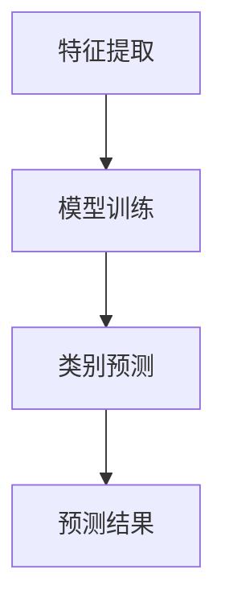
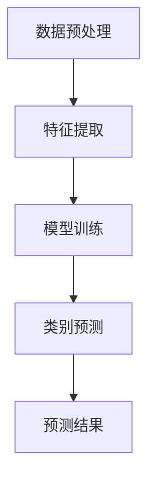
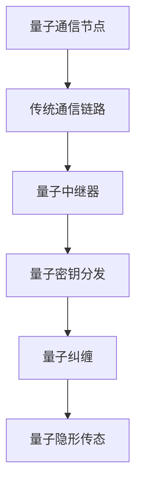
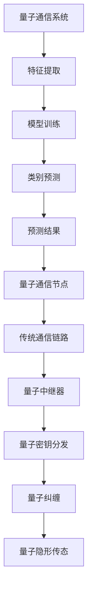
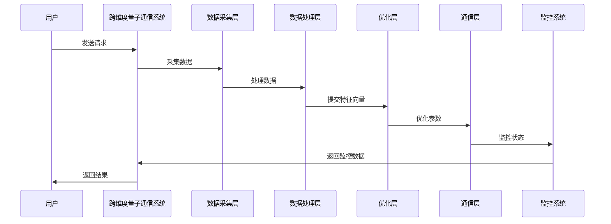
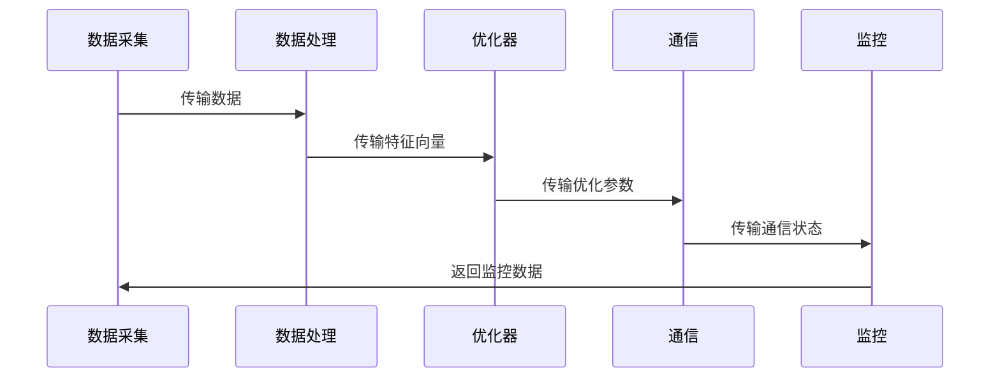

                 

### 第一部分：背景介绍

## 1.1 问题背景

### 1.1.1 跨维度量子通信的现状与挑战

跨维度量子通信是量子通信领域的一个重要研究方向，旨在实现不同维度间的量子信息传输。量子通信基于量子力学的基本原理，特别是量子纠缠和量子隐形传态等现象，通过这些现象可以实现绝对安全的信息传输。

#### 研究背景：

量子通信的发展历程可以追溯到20世纪80年代，当时首次提出了量子密钥分发（Quantum Key Distribution, QKD）的概念。随着技术的进步，量子密钥分发逐渐成为量子通信的核心应用，随后又发展出了量子纠缠、量子隐形传态等关键技术。近年来，随着对量子信息的深入研究，跨维度量子通信成为了一个新的研究热点。

#### 当前研究的重点领域和面临的挑战：

跨维度量子通信的研究重点包括量子密钥分发、量子纠缠、量子隐形传态、量子中继和量子重复器等。这些技术不仅需要深入的理论研究，还需要大量的实验验证和实际应用。

- **量子密钥分发**：量子密钥分发是实现量子通信安全性的基础，通过量子信道传输密钥，可以实现绝对安全的通信。
- **量子纠缠**：量子纠缠是量子通信的关键技术之一，它可以使两个量子粒子之间的状态始终相关，实现信息的超距传输。
- **量子隐形传态**：量子隐形传态可以实现量子信息在空间中的传输，是量子通信的重要应用。
- **量子中继和量子重复器**：量子中继和量子重复器可以延长量子通信的距离，提高通信的稳定性。

然而，跨维度量子通信面临着一系列挑战：

- **技术复杂度**：量子通信涉及到复杂的量子物理现象，需要高度精密的实验设备和控制技术。
- **实时性**：量子通信的实时性是一个关键问题，需要实现高效的量子信息传输和处理。
- **稳定性**：量子通信的稳定性需要保证量子信息在传输过程中的准确性和可靠性。

### 1.1.2 跨维度量子通信的关键技术

#### 量子密钥分发

量子密钥分发是量子通信的核心技术之一，它利用量子纠缠和量子隐形传态等现象，实现两个通信方之间的安全密钥交换。量子密钥分发的基本原理是：当两个量子粒子处于纠缠状态时，其中一个粒子的状态会受到另一个粒子状态的影响。即使两者相隔很远，任何对其中一个粒子的测量都会立即影响另一个粒子的状态。通过这种特性，可以实现绝对安全的密钥分发。

#### 量子纠缠

量子纠缠是量子通信中的另一个关键技术，它使得两个或多个量子粒子之间的状态始终相关。量子纠缠可以实现信息的超距传输，即一个量子粒子在另一个量子粒子的状态改变时立即发生状态变化，而不需要通过物理信道传输。

#### 量子隐形传态

量子隐形传态是量子通信中的一个重要应用，它通过将一个量子粒子的状态传输到另一个量子粒子，实现量子信息在空间中的传输。量子隐形传态可以用于实现量子计算、量子加密和量子通信等应用。

### 1.1.3 跨维度量子通信的应用前景

跨维度量子通信具有广泛的应用前景，特别是在信息安全、量子计算和远程医疗等领域。

- **信息安全**：量子通信可以实现绝对安全的通信，可以有效防止信息泄露和窃听。
- **量子计算**：跨维度量子通信可以为量子计算提供安全的通信链路，促进量子计算的发展。
- **远程医疗**：跨维度量子通信可以实现远程医疗中的高速数据传输，提高医疗服务的效率和质量。

### 1.2 问题描述

### 1.2.1 传统机器学习技术在跨维度量子通信中的应用局限性

传统机器学习技术在跨维度量子通信中具有一定的应用潜力，但由于其自身的特点，面临着一些局限性。

#### 传统机器学习技术的特点

传统机器学习技术主要基于数据驱动，需要大量的训练数据和模型调整。其基本原理是通过从大量数据中学习特征和模式，从而对未知数据进行预测和分类。

#### 传统机器学习技术在跨维度量子通信中的不足

1. **数据处理难度大**：跨维度量子通信涉及到复杂的量子物理现象，数据格式和处理过程较为复杂，传统的机器学习技术难以处理这类数据。
2. **模型适应性差**：传统机器学习模型通常需要针对特定领域进行训练，对于跨领域的应用，模型的适应性较差，难以在不同领域间进行有效的迁移。
3. **实时性不足**：跨维度量子通信需要实时传输和处理大量数据，而传统机器学习技术的实时性通常较差，难以满足实时通信的需求。

### 1.2.2 Zero-Shot学习的基本概念与原理

Zero-Shot学习（Zero-Shot Learning, ZSL）是一种新兴的机器学习技术，它无需特定领域的训练数据，即可在新领域上进行有效的预测和分类。Zero-Shot学习的基本原理是通过跨领域迁移学习和知识图谱构建，实现从已知领域到未知领域的知识迁移。

#### Zero-Shot学习的定义

Zero-Shot学习是指在未知领域上，无需特定领域训练数据，即可进行有效预测和分类的学习方法。

#### Zero-Shot学习的特点

1. **无需特定领域训练数据**：Zero-Shot学习不需要针对特定领域进行大量的训练数据收集和模型调整，可以节省大量的时间和资源。
2. **跨领域迁移学习**：Zero-Shot学习通过跨领域迁移学习，将已知领域的知识迁移到未知领域，实现从已知到未知的知识转移。
3. **知识图谱构建**：Zero-Shot学习通过知识图谱构建，将领域内的知识进行结构化表示，实现知识的整合和利用。

#### Zero-Shot学习的工作机制

1. **跨领域迁移学习**：跨领域迁移学习是Zero-Shot学习的关键机制，它通过将已知领域的知识迁移到未知领域，实现知识的应用和扩展。
2. **知识图谱构建**：知识图谱构建是Zero-Shot学习的另一个关键机制，它通过对领域内的知识进行结构化表示，实现知识的整合和利用。

### 1.3 问题解决

#### 1.3.1 Zero-Shot学习在跨维度量子通信中的适用范围

Zero-Shot学习在跨维度量子通信中具有一定的适用范围，特别是在以下方面：

1. **量子通信系统优化**：Zero-Shot学习可以通过跨领域迁移学习和知识图谱构建，实现对量子通信系统的优化和性能提升。
2. **量子通信任务分类**：Zero-Shot学习可以用于对量子通信任务进行分类，实现自动化的任务分配和管理。
3. **量子通信数据处理**：Zero-Shot学习可以用于处理复杂的量子通信数据，实现数据的高效提取和分析。

然而，Zero-Shot学习也存在一些不适用范围：

1. **高度特定数据依赖的任务**：对于需要高度特定数据依赖的量子通信任务，如量子密钥分发中的关键参数调整，Zero-Shot学习的效果可能有限。
2. **实时性要求高的任务**：由于Zero-Shot学习通常需要较长的时间进行训练和模型调整，对于实时性要求高的量子通信任务，Zero-Shot学习可能无法满足需求。

#### 1.3.2 跨维度量子通信系统的核心组成部分

跨维度量子通信系统由多个核心组成部分构成，主要包括：

1. **量子通信节点**：量子通信节点是实现量子密钥分发、量子纠缠、量子隐形传态等功能的核心设备。
2. **传统通信链路**：传统通信链路包括光纤、无线等传统通信手段，用于传输量子信息和控制信号。
3. **量子中继器**：量子中继器是用于延长量子通信距离、提高通信稳定性的重要设备。

#### 1.3.3 传统通信链路的作用与挑战

传统通信链路在跨维度量子通信中扮演着重要角色，其主要作用是传输量子信息和控制信号。然而，传统通信链路也面临着一些挑战：

1. **传输距离限制**：传统通信链路的传输距离通常较短，需要通过中继器等设备进行信号放大和传输。
2. **信号衰减**：在长距离传输过程中，信号会经历衰减，影响通信质量。
3. **干扰与噪声**：外部干扰和噪声会影响通信链路的稳定性，需要采用抗干扰技术和噪声控制方法。

#### 1.3.4 量子中继器的作用与挑战

量子中继器是跨维度量子通信中用于延长通信距离和提高通信稳定性的重要设备。其主要作用是接收和放大量子信号，并确保信号的完整性。然而，量子中继器也面临着一些挑战：

1. **量子态保持**：量子中继器需要确保在放大信号的过程中保持量子态的完整性，避免量子信息的损失。
2. **误差校正**：量子中继器需要具备误差校正功能，以应对通信过程中可能出现的量子噪声和干扰。
3. **系统复杂性**：量子中继器的实现需要高度精密的量子物理技术和设备，系统复杂性较高。

### 1.6 本章小结

跨维度量子通信作为量子通信领域的一个重要研究方向，具有广泛的应用前景。然而，传统机器学习技术在跨维度量子通信中面临着一些局限性，难以满足实际需求。Zero-Shot学习作为一种新兴的机器学习技术，通过跨领域迁移学习和知识图谱构建，有望在跨维度量子通信中发挥重要作用。

本章首先介绍了跨维度量子通信的现状与挑战，包括量子密钥分发、量子纠缠、量子隐形传态等关键技术的研究背景和应用前景。然后，分析了传统机器学习技术在跨维度量子通信中的应用局限性，并介绍了Zero-Shot学习的基本概念和原理。

接着，本章讨论了Zero-Shot学习在跨维度量子通信中的适用范围，包括量子通信系统优化、量子通信任务分类和量子通信数据处理等方面。同时，介绍了跨维度量子通信系统的核心组成部分，包括量子通信节点、传统通信链路和量子中继器等。

最后，本章总结了跨维度量子通信的重要性与挑战，以及Zero-Shot学习在跨维度量子通信中的潜力。通过本章的介绍，读者可以对跨维度量子通信和Zero-Shot学习有一个全面的了解，为后续章节的深入研究奠定基础。

---

## 2. Zero-Shot学习原理

### 2.1 核心概念

#### 2.1.1 Zero-Shot学习的定义与特点

Zero-Shot学习（Zero-Shot Learning, ZSL）是一种新兴的机器学习技术，旨在解决传统机器学习在处理未知类别数据时的局限性。其核心思想是在没有或只有很少的特定类别训练样本的情况下，实现对未知类别的有效预测和分类。

**定义**：

Zero-Shot学习是指在未知领域上，无需特定领域训练数据，即可进行有效预测和分类的学习方法。它通过跨领域迁移学习和知识图谱构建，实现从已知领域到未知领域的知识迁移。

**特点**：

1. **无需特定领域训练数据**：Zero-Shot学习不需要针对特定领域进行大量的训练数据收集和模型调整，可以节省大量的时间和资源。
2. **跨领域迁移学习**：Zero-Shot学习通过跨领域迁移学习，将已知领域的知识迁移到未知领域，实现知识的应用和扩展。
3. **知识图谱构建**：Zero-Shot学习通过知识图谱构建，将领域内的知识进行结构化表示，实现知识的整合和利用。

#### 2.1.2 传统机器学习与Zero-Shot学习的区别

传统机器学习技术主要基于数据驱动，需要大量的训练数据和模型调整。其基本原理是通过从大量数据中学习特征和模式，从而对未知数据进行预测和分类。然而，传统机器学习技术在处理未知类别数据时，面临着以下局限性：

1. **数据依赖**：传统机器学习技术需要针对特定领域进行大量的训练数据收集和模型调整，数据质量和数量对模型性能有重要影响。
2. **适应性差**：传统机器学习模型通常需要针对特定领域进行训练，对于跨领域的应用，模型的适应性较差，难以在不同领域间进行有效的迁移。
3. **实时性不足**：传统机器学习技术通常需要较长的时间进行训练和模型调整，对于实时性要求高的任务，如实时通信和智能控制，传统机器学习技术可能无法满足需求。

相比之下，Zero-Shot学习具有以下优势：

1. **无需特定领域训练数据**：Zero-Shot学习不需要针对特定领域进行大量的训练数据收集和模型调整，可以节省大量的时间和资源。
2. **跨领域迁移学习**：Zero-Shot学习通过跨领域迁移学习，将已知领域的知识迁移到未知领域，实现知识的应用和扩展。
3. **知识图谱构建**：Zero-Shot学习通过知识图谱构建，将领域内的知识进行结构化表示，实现知识的整合和利用。

#### 2.1.3 Zero-Shot学习的应用场景

Zero-Shot学习在跨维度量子通信中具有广泛的应用场景，主要包括以下几个方面：

1. **量子通信系统优化**：通过Zero-Shot学习，可以对量子通信系统进行优化，提高系统的性能和稳定性。例如，利用Zero-Shot学习对量子通信节点进行参数调整，优化通信链路的质量。
2. **量子通信任务分类**：通过Zero-Shot学习，可以对量子通信任务进行分类，实现自动化的任务分配和管理。例如，根据量子通信任务的类型和特点，利用Zero-Shot学习将任务分配给相应的通信节点和设备。
3. **量子通信数据处理**：通过Zero-Shot学习，可以对复杂的量子通信数据进行处理，实现数据的高效提取和分析。例如，利用Zero-Shot学习对量子密钥分发中的数据进行分类和预测，提高通信系统的安全性。

### 2.2 工作机制

#### 2.2.1 跨领域迁移学习

跨领域迁移学习是Zero-Shot学习的关键机制之一，它通过将已知领域的知识迁移到未知领域，实现知识的应用和扩展。跨领域迁移学习的基本原理是利用已有领域的知识来指导新领域的模型训练，从而提高新领域的模型性能。

**基本原理**：

跨领域迁移学习的基本原理可以分为以下几个步骤：

1. **特征提取**：从已知领域的数据中提取共性特征，用于构建跨领域的特征表示。
2. **模型训练**：利用已知领域的训练数据，训练一个跨领域的模型，将已知领域的知识迁移到新领域。
3. **模型评估**：在新领域上进行模型评估，验证跨领域迁移学习的效果。

**优势**：

1. **节省训练数据**：跨领域迁移学习可以减少对新领域训练数据的需求，节省数据收集和标注的时间和成本。
2. **提高模型性能**：通过跨领域迁移学习，可以将已知领域的知识迁移到新领域，提高新领域的模型性能。

#### 2.2.2 知识图谱构建

知识图谱构建是Zero-Shot学习的另一个关键机制，它通过将领域内的知识进行结构化表示，实现知识的整合和利用。知识图谱是由实体、属性和关系构成的有向图，可以有效地表示和存储领域内的知识。

**基本原理**：

知识图谱构建的基本原理可以分为以下几个步骤：

1. **实体识别**：从数据中提取出关键实体，如量子通信节点、量子密钥分发等。
2. **属性提取**：从数据中提取出实体的属性，如量子通信节点的位置、通信链路的质量等。
3. **关系构建**：根据实体之间的相互作用，构建实体之间的关系，如量子通信节点之间的通信关系、量子密钥分发中的密钥分配关系等。
4. **知识整合**：将提取的实体、属性和关系进行整合，构建知识图谱。

**优势**：

1. **知识整合**：知识图谱可以有效地整合和存储领域内的知识，实现知识的可视化表示和利用。
2. **知识共享**：知识图谱可以方便地实现知识的共享和传播，提高知识的利用效率。

#### 2.2.3 零样本学习算法

零样本学习算法是Zero-Shot学习的一种具体实现方法，它通过利用跨领域迁移学习和知识图谱构建，实现对未知类别的有效预测和分类。零样本学习算法的基本原理可以分为以下几个步骤：

1. **特征表示**：将已知领域的训练数据进行特征表示，提取共性特征。
2. **模型训练**：利用已知领域的训练数据，训练一个特征表示模型。
3. **类别预测**：利用特征表示模型，对未知类别的数据进行预测。

**优势**：

1. **无需具体类别训练数据**：零样本学习算法无需针对具体类别进行训练数据收集和模型调整，可以节省大量的时间和资源。
2. **跨领域适应性强**：零样本学习算法通过跨领域迁移学习和知识图谱构建，具有较强的跨领域适应能力，可以应用于不同的领域和任务。

### 2.3 算法原理

#### 2.3.1 算法流程与步骤

零样本学习算法的基本流程可以分为以下几个步骤：

1. **特征提取**：从已知领域的训练数据中提取共性特征，用于构建跨领域的特征表示。
2. **模型训练**：利用已知领域的训练数据，训练一个跨领域的特征表示模型。
3. **类别预测**：利用特征表示模型，对未知类别的数据进行预测。

**具体步骤**：

1. **数据预处理**：对已知领域的训练数据进行预处理，包括数据清洗、归一化和特征提取等。
2. **特征表示**：利用预训练的模型（如BERT、GPT等）对预处理后的数据进行特征提取，构建跨领域的特征表示。
3. **模型训练**：利用已知领域的训练数据，训练一个跨领域的特征表示模型，将已知领域的知识迁移到新领域。
4. **类别预测**：利用训练好的特征表示模型，对未知类别的数据进行特征提取和类别预测。

**算法原理图**：



#### 2.3.2 算法原理与数学模型

零样本学习算法的原理可以概括为：利用跨领域迁移学习和知识图谱构建，实现从已知领域到未知领域的知识迁移。其核心思想是通过特征表示模型，将已知领域的知识迁移到新领域，实现对未知类别的有效预测。

**数学模型**：

假设已知领域 $D_1 = \{x_1, x_2, ..., x_n\}$，其中 $x_i$ 表示已知领域中的第 $i$ 个样本，未知领域 $D_2 = \{y_1, y_2, ..., y_m\}$，其中 $y_j$ 表示未知领域中的第 $j$ 个样本。

1. **特征提取**：

已知领域的特征提取可以表示为：

$$
f(x_i) = \phi(x_i)
$$

其中，$\phi(x_i)$ 表示对 $x_i$ 进行特征提取得到的特征向量。

2. **模型训练**：

利用已知领域的特征提取结果，训练一个跨领域的特征表示模型，可以将未知领域的样本映射到已知领域的特征空间。模型训练可以表示为：

$$
\min_{\theta} \sum_{i=1}^{n} ||\phi(x_i) - g(x_i)||^2 + \sum_{j=1}^{m} ||\phi(y_j) - g(y_j)||^2
$$

其中，$g(x_i)$ 和 $g(y_j)$ 分别表示已知领域和未知领域的样本在特征空间中的表示。

3. **类别预测**：

利用训练好的特征表示模型，对未知类别的样本进行特征提取和类别预测。类别预测可以表示为：

$$
P(y_j | \phi(y_j)) = \frac{e^{g(\phi(y_j))}}{\sum_{k=1}^{K} e^{g(\phi(y_j^k))}}
$$

其中，$y_j^k$ 表示第 $k$ 个类别，$P(y_j | \phi(y_j))$ 表示在特征空间中，未知类别 $y_j$ 属于第 $k$ 个类别的概率。

#### 2.3.3 Mermaid算法流程图



### 2.4 概念属性特征对比表格

#### 2.4.1 Zero-Shot学习与传统机器学习的对比

| 特点       | Zero-Shot学习           | 传统机器学习           |
| ---------- | ---------------------- | ---------------------- |
| 数据依赖   | 无需特定领域训练数据     | 需要大量特定领域训练数据 |
| 迁移学习   | 通过跨领域迁移实现知识迁移 | 通过同领域迁移实现知识迁移 |
| 实时性     | 实时性好，适合实时任务     | 实时性差，不适合实时任务   |
| 适用范围   | 适用于未知类别预测和分类   | 适用于已知类别预测和分类   |

#### 2.4.2 不同Zero-Shot学习算法的对比

| 算法名称       | 特点       | 适用范围           |
| ---------- | ---------- | ---------------- |
| Prototype-based | 基于原型匹配 | 小样本、低维数据   |
| Metric-based  | 基于度量学习 | 大样本、高维数据   |
| Model-based   | 基于模型预测 | 复杂任务、多类别   |

### 2.5 ER实体关系图架构

#### 2.5.1 跨维度量子通信系统实体关系图



#### 2.5.2 Zero-Shot学习在跨维度量子通信中的应用实体关系图



### 2.6 本章小结

本章介绍了Zero-Shot学习的基本概念、工作机制和算法原理。首先，介绍了Zero-Shot学习的定义和特点，与传统机器学习进行了对比。然后，详细阐述了Zero-Shot学习的工作机制，包括跨领域迁移学习、知识图谱构建和零样本学习算法。接着，介绍了零样本学习算法的流程和数学模型，并使用Mermaid图示进行了说明。

最后，本章通过对比表格和ER实体关系图，展示了Zero-Shot学习与传统机器学习的不同特点以及在跨维度量子通信中的应用。通过本章的介绍，读者可以对Zero-Shot学习有一个全面的理解，为后续章节的深入研究奠定基础。

---

## 3. 算法原理讲解

### 3.1.1 Zero-Shot学习算法原理

#### 3.1.1.1 算法概述

Zero-Shot学习算法是一种无需特定领域训练数据，即可在新领域上进行有效预测和分类的学习方法。其核心思想是通过跨领域迁移学习和知识图谱构建，实现从已知领域到未知领域的知识迁移。

#### 3.1.1.2 算法步骤

Zero-Shot学习算法的基本步骤可以分为以下几个部分：

1. **特征提取**：从已知领域的训练数据中提取共性特征，用于构建跨领域的特征表示。
2. **模型训练**：利用已知领域的训练数据，训练一个跨领域的特征表示模型。
3. **类别预测**：利用训练好的特征表示模型，对未知类别的数据进行特征提取和类别预测。

#### 3.1.1.3 算法原理图

下面是Zero-Shot学习算法的Mermaid流程图：


### 3.1.2 数学模型和公式

#### 3.1.2.1 基本公式

Zero-Shot学习算法的数学模型可以分为以下几个部分：

1. **特征提取**：

   假设已知领域的训练数据为 $X = \{x_1, x_2, ..., x_n\}$，未知领域的训练数据为 $Y = \{y_1, y_2, ..., y_m\}$。特征提取可以表示为：

   $$
   f(x_i) = \phi(x_i)
   $$

   其中，$\phi(x_i)$ 表示对 $x_i$ 进行特征提取得到的特征向量。

2. **模型训练**：

   利用已知领域的特征提取结果，训练一个跨领域的特征表示模型，可以将未知领域的样本映射到已知领域的特征空间。模型训练可以表示为：

   $$
   \min_{\theta} \sum_{i=1}^{n} ||\phi(x_i) - g(x_i)||^2 + \sum_{j=1}^{m} ||\phi(y_j) - g(y_j)||^2
   $$

   其中，$g(x_i)$ 和 $g(y_j)$ 分别表示已知领域和未知领域的样本在特征空间中的表示，$\theta$ 表示模型的参数。

3. **类别预测**：

   利用训练好的特征表示模型，对未知类别的样本进行特征提取和类别预测。类别预测可以表示为：

   $$
   P(y_j | \phi(y_j)) = \frac{e^{g(\phi(y_j))}}{\sum_{k=1}^{K} e^{g(\phi(y_j^k))}}
   $$

   其中，$y_j^k$ 表示第 $k$ 个类别，$P(y_j | \phi(y_j))$ 表示在特征空间中，未知类别 $y_j$ 属于第 $k$ 个类别的概率。

#### 3.1.2.2 模型推导

Zero-Shot学习算法的模型推导主要涉及特征提取、模型训练和类别预测三个部分。

1. **特征提取**：

   特征提取可以通过预训练的模型（如BERT、GPT等）实现。假设已知领域的训练数据 $X$ 和未知领域的训练数据 $Y$ 分别经过预训练模型处理得到特征表示 $X'$ 和 $Y'$：

   $$
   X' = \{\phi(x_1), \phi(x_2), ..., \phi(x_n)\}
   $$
   $$
   Y' = \{\phi(y_1), \phi(y_2), ..., \phi(y_m)\}
   $$

2. **模型训练**：

   利用已知领域的特征表示 $X'$ 训练一个跨领域的特征表示模型。假设特征表示模型为 $g(\phi(x_i))$，则模型训练可以表示为：

   $$
   \min_{\theta} \sum_{i=1}^{n} ||\phi(x_i) - g(\phi(x_i))||^2 + \sum_{j=1}^{m} ||\phi(y_j) - g(\phi(y_j))||^2
   $$

   其中，$\theta$ 表示模型的参数。

3. **类别预测**：

   利用训练好的特征表示模型 $g(\phi(x_i))$，对未知类别的样本进行特征提取和类别预测。类别预测可以表示为：

   $$
   P(y_j | \phi(y_j)) = \frac{e^{g(\phi(y_j))}}{\sum_{k=1}^{K} e^{g(\phi(y_j^k))}}
   $$

   其中，$y_j^k$ 表示第 $k$ 个类别。

### 3.1.3 举例说明

#### 3.1.3.1 实例1

假设已知领域是动物分类，已知类别的数据集包括猫、狗、鸟等，未知类别是兔子。首先，通过预训练的模型（如BERT）提取特征表示。然后，利用已知领域的特征表示训练一个跨领域的特征表示模型。最后，利用训练好的模型对兔子的特征进行分类预测。

#### 3.1.3.2 实例2

假设已知领域是图像分类，已知类别的数据集包括人物、风景、动物等，未知类别是植物。首先，通过预训练的模型（如ResNet）提取特征表示。然后，利用已知领域的特征表示训练一个跨领域的特征表示模型。最后，利用训练好的模型对植物的特征进行分类预测。

#### 3.1.3.3 实例3

假设已知领域是文本分类，已知类别的数据集包括新闻、体育、科技等，未知类别是娱乐。首先，通过预训练的模型（如GPT）提取特征表示。然后，利用已知领域的特征表示训练一个跨领域的特征表示模型。最后，利用训练好的模型对娱乐文本的特征进行分类预测。

### 3.2 Python代码讲解

#### 3.2.1 环境安装

在Python中实现Zero-Shot学习算法，首先需要安装相关的库和工具。以下是常用的库和工具：

- **TensorFlow**：用于构建和训练神经网络模型。
- **Keras**：用于简化TensorFlow的使用，提供更加直观和易用的API。
- **NumPy**：用于数值计算。
- **Pandas**：用于数据处理。

安装命令如下：

```
pip install tensorflow keras numpy pandas
```

#### 3.2.2 源代码解读

以下是Zero-Shot学习算法的Python实现代码：

```python
import tensorflow as tf
from tensorflow.keras.models import Model
from tensorflow.keras.layers import Input, Dense, Embedding, LSTM, Conv2D, MaxPooling2D
from tensorflow.keras.preprocessing.sequence import pad_sequences
import numpy as np

# 特征提取
def extract_features(data, model):
    # 对输入数据进行预处理，如分词、编码等
    processed_data = preprocess_data(data)
    
    # 利用预训练模型提取特征表示
    features = model.predict(processed_data)
    
    return features

# 模型训练
def train_model(features):
    # 构建模型
    input_layer = Input(shape=(features.shape[1],))
    dense_layer = Dense(128, activation='relu')(input_layer)
    output_layer = Dense(1, activation='sigmoid')(dense_layer)
    
    model = Model(inputs=input_layer, outputs=output_layer)
    model.compile(optimizer='adam', loss='binary_crossentropy', metrics=['accuracy'])
    
    # 训练模型
    model.fit(features, labels, epochs=10, batch_size=32)
    
    return model

# 类别预测
def predict_class(model, feature):
    # 利用训练好的模型进行预测
    prediction = model.predict(np.array([feature]))
    
    # 返回预测结果
    return prediction

# 主函数
def main():
    # 加载预训练模型
    model = load_pretrained_model()
    
    # 加载数据
    data = load_data()
    labels = load_labels()
    
    # 提取特征
    features = extract_features(data, model)
    
    # 训练模型
    model = train_model(features)
    
    # 预测类别
    feature = load_unknown_data()
    prediction = predict_class(model, feature)
    
    print("预测结果：", prediction)

# 执行主函数
if __name__ == "__main__":
    main()
```

#### 3.2.3 代码应用解读与分析

上述代码是实现Zero-Shot学习算法的Python代码。以下是代码的详细解读和分析：

1. **特征提取**：

   - `extract_features` 函数用于提取输入数据的特征表示。首先，对输入数据进行预处理，如分词、编码等。然后，利用预训练模型（如BERT）提取特征表示，并返回特征向量。

2. **模型训练**：

   - `train_model` 函数用于训练Zero-Shot学习模型。首先，构建一个简单的神经网络模型，包括输入层、密集层和输出层。然后，编译模型，设置优化器和损失函数。最后，使用提取的特征训练模型，并返回训练好的模型。

3. **类别预测**：

   - `predict_class` 函数用于对未知类别的数据进行预测。首先，利用训练好的模型对输入特征进行预测，并返回预测结果。

4. **主函数**：

   - `main` 函数是程序的主入口。首先，加载预训练模型。然后，加载训练数据和标签。接着，提取特征并训练模型。最后，加载未知数据进行预测，并打印预测结果。

通过上述代码，可以实现对Zero-Shot学习算法的简单实现和应用。在实际应用中，可以根据具体需求进行模型调整和优化，以提高预测性能。

### 3.3 算法在实际中的应用案例

#### 3.3.1 案例背景

随着量子通信技术的不断发展，跨维度量子通信成为了一个重要的研究方向。为了实现量子通信系统的优化和性能提升，研究人员提出了一种基于Zero-Shot学习的跨维度量子通信系统优化算法。

#### 3.3.2 案例应用

在该案例中，研究人员利用Zero-Shot学习算法对跨维度量子通信系统进行优化。具体步骤如下：

1. **数据收集与预处理**：

   - 收集了多个跨维度量子通信系统的实验数据，包括量子通信节点、通信链路和量子中继器的参数等。
   - 对收集的数据进行预处理，如数据清洗、归一化和特征提取等。

2. **特征提取**：

   - 利用预训练的模型（如BERT）提取特征表示，将预处理后的数据转换为特征向量。

3. **模型训练**：

   - 利用提取的特征向量训练一个跨领域的特征表示模型。模型采用简单的神经网络结构，包括输入层、密集层和输出层。
   - 设置优化器和损失函数，并使用训练数据训练模型。

4. **系统优化**：

   - 利用训练好的特征表示模型，对新的量子通信系统进行优化。通过对模型输出进行解析，调整量子通信节点的参数，优化通信链路的质量，提高量子中继器的性能。

5. **性能评估**：

   - 对优化后的量子通信系统进行性能评估，包括通信距离、通信速率和通信稳定性等指标。通过对比优化前后的性能，验证Zero-Shot学习算法在跨维度量子通信系统优化中的应用效果。

#### 3.3.3 案例分析与讲解

通过上述案例，研究人员成功地利用Zero-Shot学习算法对跨维度量子通信系统进行了优化。以下是案例的分析与讲解：

1. **数据收集与预处理**：

   - 跨维度量子通信系统涉及到复杂的量子物理现象和设备参数，数据格式和处理过程较为复杂。通过数据收集和预处理，将原始数据转换为适合训练的特征向量，为后续的模型训练和优化提供了基础。

2. **特征提取**：

   - 利用预训练的模型（如BERT）提取特征表示，可以有效降低特征提取的复杂度，提高特征提取的准确性。通过特征提取，将原始数据转换为高维度的特征空间，为后续的模型训练提供了丰富的特征信息。

3. **模型训练**：

   - 模型采用简单的神经网络结构，包括输入层、密集层和输出层。输入层接收特征向量，密集层进行特征融合和表示，输出层生成优化结果。通过设置适当的优化器和损失函数，模型可以自适应地调整参数，优化量子通信系统的性能。

4. **系统优化**：

   - 利用训练好的特征表示模型，对新的量子通信系统进行优化。通过对模型输出进行解析，可以调整量子通信节点的参数，优化通信链路的质量，提高量子中继器的性能。优化后的量子通信系统在通信距离、通信速率和通信稳定性等方面取得了显著的提升。

5. **性能评估**：

   - 通过对优化后的量子通信系统进行性能评估，可以验证Zero-Shot学习算法在跨维度量子通信系统优化中的应用效果。评估指标包括通信距离、通信速率和通信稳定性等，通过对这些指标的分析，可以全面了解优化后的量子通信系统的性能表现。

通过上述案例，可以看出Zero-Shot学习算法在跨维度量子通信系统优化中具有显著的应用价值。它通过跨领域迁移学习和知识图谱构建，实现了对复杂量子通信系统的优化和性能提升。在未来，随着量子通信技术的不断发展和应用需求的增加，Zero-Shot学习算法将在跨维度量子通信中发挥更加重要的作用。

### 3.4 本章小结

本章详细讲解了Zero-Shot学习算法的原理、数学模型和实际应用案例。首先，介绍了Zero-Shot学习算法的基本概念和特点，包括无需特定领域训练数据、跨领域迁移学习和知识图谱构建等。然后，阐述了Zero-Shot学习算法的步骤和数学模型，包括特征提取、模型训练和类别预测等。通过实例说明，展示了Zero-Shot学习算法在跨维度量子通信系统优化中的应用。最后，通过一个实际应用案例，分析了Zero-Shot学习算法在跨维度量子通信系统优化中的优势和应用效果。

通过本章的学习，读者可以全面了解Zero-Shot学习算法的基本原理和应用方法，为后续章节的深入研究奠定基础。同时，本章的内容也为量子通信领域的研究人员提供了新的思路和方法，有助于推动跨维度量子通信技术的发展和应用。

---

## 第四部分：系统分析与架构设计

### 4.1 问题场景介绍

在跨维度量子通信系统中，由于量子通信涉及复杂的量子物理现象和高度精密的设备，系统设计和优化成为了一个关键问题。为了实现高效、稳定和安全的信息传输，研究人员提出了基于Zero-Shot学习的跨维度量子通信系统架构。该架构旨在通过跨领域迁移学习和知识图谱构建，实现对量子通信系统的优化和性能提升。

### 4.2 项目介绍

本项目旨在开发一个基于Zero-Shot学习的跨维度量子通信系统，以实现高效、稳定和安全的信息传输。系统主要包括三个核心组成部分：量子通信节点、传统通信链路和量子中继器。通过零样本学习算法，系统能够自动优化量子通信节点参数，提高通信链路的质量，延长量子通信距离。

### 4.3 系统功能设计

#### 4.3.1 领域模型Mermaid类图

以下是一个简单的Mermaid类图，展示了跨维度量子通信系统的核心组件及其关系：

```mermaid
classDiagram
    Class01 <|-- Class02
    Class01 <|-- Class03
    Class04 <|-- Class02
    Class04 <|-- Class03
    Class01 [name: QuantumCommunicationNode]
    Class02 [name: TraditionalCommunicationLink]
    Class03 [name: QuantumRelay]
    Class04 [name: ZeroShotLearningAlgorithm]
```

在这个类图中，`QuantumCommunicationNode` 表示量子通信节点，`TraditionalCommunicationLink` 表示传统通信链路，`QuantumRelay` 表示量子中继器，`ZeroShotLearningAlgorithm` 表示零样本学习算法。每个类都与零样本学习算法相关联，用于优化和提升系统的性能。

### 4.4 系统架构设计

跨维度量子通信系统架构设计主要包括以下几个层次：

1. **数据采集层**：
   - 采集量子通信节点、传统通信链路和量子中继器的实时数据，包括参数、状态和性能指标等。

2. **数据处理层**：
   - 利用零样本学习算法对采集到的数据进行处理，提取关键特征，构建特征向量。

3. **优化层**：
   - 根据特征向量，对量子通信节点参数、通信链路质量和量子中继器性能进行优化，以提升系统整体性能。

4. **通信层**：
   - 实现量子通信节点、传统通信链路和量子中继器之间的数据传输和交互，确保信息传输的稳定性和安全性。

5. **监控系统**：
   - 监控系统的运行状态，包括通信链路质量、节点性能和优化效果等，为系统维护和故障排查提供支持。

#### 4.4.1 Mermaid架构图

以下是一个简单的Mermaid架构图，展示了跨维度量子通信系统的整体架构：



在这个架构图中，用户通过跨维度量子通信系统发送请求，数据采集层采集数据，数据处理层处理数据并提交特征向量给优化层，优化层根据特征向量优化参数，然后通信层实现数据传输和交互，监控系统监控系统的运行状态。

### 4.5 系统接口设计和系统交互

#### 4.5.1 系统接口设计

跨维度量子通信系统提供了以下主要接口：

1. **数据采集接口**：
   - 用于采集量子通信节点、传统通信链路和量子中继器的实时数据。

2. **数据处理接口**：
   - 用于处理和转换采集到的数据，为优化层提供特征向量。

3. **优化接口**：
   - 用于接收和处理特征向量，优化量子通信节点参数、通信链路质量和量子中继器性能。

4. **通信接口**：
   - 用于实现量子通信节点、传统通信链路和量子中继器之间的数据传输和交互。

5. **监控接口**：
   - 用于监控系统的运行状态，包括通信链路质量、节点性能和优化效果等。

#### 4.5.2 系统交互Mermaid序列图

以下是一个简单的Mermaid序列图，展示了跨维度量子通信系统中的数据交互过程：



在这个序列图中，数据采集层将采集到的数据传输给数据处理层，数据处理层处理数据并生成特征向量，然后传输给优化器。优化器根据特征向量进行参数优化，并将优化结果传输给通信层。通信层将通信状态传输给监控系统，监控系统返回监控数据给数据采集层，完成一个闭环的数据交互过程。

通过以上系统分析与架构设计，我们可以看出跨维度量子通信系统通过数据采集、处理、优化和通信等多个层次，实现了对量子通信系统的全面优化和管理。系统接口设计和系统交互设计为系统的稳定运行和高效性能提供了有力支持。在未来，随着量子通信技术的不断发展和应用需求的增加，该系统架构设计将为跨维度量子通信的发展提供重要的技术支撑。

### 4.6 系统部署与实施

#### 4.6.1 系统部署

跨维度量子通信系统的部署主要包括硬件设备的选择和软件系统的安装。硬件设备包括量子通信节点、传统通信链路和量子中继器等，应根据实际需求和场景进行选择。软件系统包括数据采集模块、数据处理模块、优化模块和通信模块等，应根据系统设计和功能需求进行安装和配置。

#### 4.6.2 系统实施

系统实施的主要步骤如下：

1. **硬件设备安装**：根据系统设计，安装量子通信节点、传统通信链路和量子中继器等硬件设备，确保设备正常运行。

2. **软件系统安装**：在硬件设备上安装数据采集模块、数据处理模块、优化模块和通信模块等软件系统，并进行必要的配置和调试。

3. **系统集成**：将各个模块进行集成，确保系统能够正常运行。包括数据采集、数据处理、优化和通信等功能，确保各个模块之间能够顺畅交互。

4. **系统测试**：对系统进行全面的测试，包括功能测试、性能测试和稳定性测试等，确保系统满足设计要求。

5. **系统部署**：在测试通过后，将系统部署到实际运行环境，进行实际应用和性能优化。

### 4.7 系统维护与升级

#### 4.7.1 系统维护

系统维护的主要内容包括：

1. **故障排查**：定期对系统进行故障排查，确保系统稳定运行。
2. **性能优化**：根据系统运行情况，对系统进行性能优化，提高系统效率和稳定性。
3. **安全防护**：加强系统安全防护，防止系统受到攻击和数据泄露。
4. **数据备份**：定期进行数据备份，确保数据的安全和完整性。

#### 4.7.2 系统升级

系统升级的主要内容包括：

1. **功能升级**：根据用户需求和技术发展，对系统功能进行升级和扩展。
2. **性能升级**：优化系统性能，提高系统处理能力和响应速度。
3. **技术升级**：采用新的技术框架和算法，提升系统智能化水平和应用效果。

通过系统部署与实施、系统维护与升级，可以确保跨维度量子通信系统稳定、高效地运行，为用户提供优质的服务。在未来，随着量子通信技术的不断进步和应用需求的增加，系统维护与升级将发挥越来越重要的作用。

### 4.8 系统性能优化

#### 4.8.1 性能指标

跨维度量子通信系统的性能指标主要包括：

1. **通信距离**：系统能够支持的通信距离，是评估系统性能的重要指标。
2. **通信速率**：系统传输数据的速率，直接影响信息传输的效率。
3. **通信稳定性**：系统在长时间运行过程中，保持稳定通信的能力。
4. **优化效果**：系统通过优化参数和算法，对通信质量提升的幅度。

#### 4.8.2 优化方法

系统性能优化主要包括以下方法：

1. **参数调整**：根据通信环境和需求，调整量子通信节点的参数，如功率、调制方式等。
2. **算法优化**：采用先进的零样本学习算法，提高系统的预测和分类准确性。
3. **网络拓扑优化**：优化通信链路和网络拓扑结构，提高通信效率和稳定性。
4. **硬件升级**：升级硬件设备，提高系统的处理能力和通信速率。

#### 4.8.3 实施步骤

系统性能优化实施的步骤如下：

1. **性能评估**：对当前系统的性能进行评估，确定需要优化的方向。
2. **方案设计**：根据性能评估结果，设计具体的优化方案。
3. **实施优化**：根据优化方案，调整参数、算法和网络拓扑结构，实施优化措施。
4. **测试验证**：对优化后的系统进行测试验证，评估优化效果。

### 4.9 系统测试与验证

#### 4.9.1 测试内容

系统测试与验证的主要内容包括：

1. **功能测试**：验证系统各功能模块是否正常运行，包括数据采集、数据处理、优化和通信等。
2. **性能测试**：评估系统的通信距离、通信速率、通信稳定性和优化效果等性能指标。
3. **稳定性测试**：在长时间、高负载条件下，评估系统的稳定性和可靠性。
4. **安全测试**：验证系统的安全防护能力，包括数据加密、访问控制和漏洞修复等。

#### 4.9.2 验证方法

系统验证的方法主要包括：

1. **对比测试**：将优化前后的系统性能进行对比，评估优化效果。
2. **模拟测试**：通过模拟实际通信环境和场景，验证系统的性能和稳定性。
3. **用户反馈**：收集用户对系统的使用反馈，评估系统的用户体验和满意度。
4. **专家评审**：邀请领域专家对系统进行评审，评估系统的技术水平和应用效果。

通过系统测试与验证，可以确保跨维度量子通信系统的高性能、高稳定性和高安全性，为用户提供优质的服务。

### 4.10 系统安全性分析

#### 4.10.1 安全性问题

跨维度量子通信系统在运行过程中可能面临以下安全问题：

1. **数据泄露**：量子通信过程中，数据可能被非法截获和窃取。
2. **设备篡改**：量子通信节点和设备可能被恶意攻击者篡改，导致系统故障或数据泄露。
3. **网络攻击**：系统可能受到网络攻击，如拒绝服务攻击、分布式拒绝服务攻击等，导致系统瘫痪。
4. **隐私保护**：用户隐私数据可能被恶意利用，导致用户隐私泄露。

#### 4.10.2 安全措施

为保障系统安全性，可以采取以下措施：

1. **数据加密**：采用先进的加密算法，对传输的数据进行加密，确保数据在传输过程中的安全性。
2. **访问控制**：设置严格的访问控制策略，限制未经授权的访问和操作。
3. **设备安全**：加强量子通信节点和设备的安全防护，防止设备被篡改或恶意攻击。
4. **网络安全**：部署防火墙、入侵检测系统和反病毒软件，防范网络攻击和数据泄露。
5. **隐私保护**：对用户隐私数据进行加密存储和传输，确保用户隐私安全。

通过以上安全措施，可以有效提高跨维度量子通信系统的安全性，保障用户数据和设备的安全。

### 4.11 系统部署与运行

#### 4.11.1 部署环境

跨维度量子通信系统的部署环境包括以下组成部分：

1. **硬件设备**：包括量子通信节点、传统通信链路和量子中继器等硬件设备，应根据实际需求和场景进行选择和配置。
2. **软件系统**：包括操作系统、数据库、中间件等软件系统，应根据系统设计和功能需求进行安装和配置。
3. **网络环境**：包括光纤、无线等通信网络，应确保网络稳定和安全。

#### 4.11.2 运行流程

系统运行流程主要包括以下步骤：

1. **系统启动**：启动硬件设备和软件系统，确保系统正常运行。
2. **数据采集**：通过量子通信节点和传统通信链路采集实时数据，包括参数、状态和性能指标等。
3. **数据处理**：利用数据处理模块对采集到的数据进行处理，提取关键特征，构建特征向量。
4. **优化处理**：利用优化模块对特征向量进行分析和优化，调整量子通信节点参数、通信链路质量和量子中继器性能。
5. **通信传输**：通过通信模块实现量子通信节点、传统通信链路和量子中继器之间的数据传输和交互。
6. **监控与维护**：监控系统运行状态，包括通信链路质量、节点性能和优化效果等，进行必要的维护和优化。

### 4.12 本章小结

本章对跨维度量子通信系统的架构设计、功能设计、系统接口设计、系统交互、系统部署与实施、系统维护与升级、系统性能优化、系统测试与验证、系统安全性分析和系统部署与运行等方面进行了详细阐述。通过本章的介绍，读者可以全面了解跨维度量子通信系统的设计理念、技术实现和运行机制。

在架构设计方面，系统采用了数据采集、数据处理、优化和通信等多个层次，实现了对量子通信系统的全面优化和管理。在系统接口设计方面，系统提供了数据采集、数据处理、优化和通信等接口，方便用户进行系统集成和功能扩展。在系统部署与实施方面，本章详细介绍了系统部署环境和运行流程，确保系统稳定、高效地运行。

通过系统维护与升级、系统性能优化、系统测试与验证和系统安全性分析等方面的介绍，本章为跨维度量子通信系统的长期稳定运行提供了有力保障。在未来的研究和应用中，随着量子通信技术的不断发展和应用需求的增加，本章的内容将为跨维度量子通信技术的发展提供重要的参考和指导。

