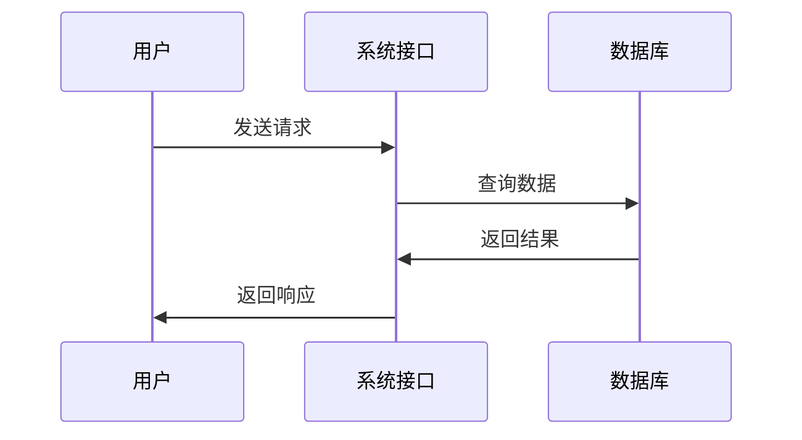

                 

# 《Zero-Shot学习在濒危语言复兴中的作用》

## 关键词

- 濒危语言
- 语言复兴
- 自然语言处理
- 机器学习
- 零样本学习
- 人工智能

## 摘要

随着全球化和现代技术的发展，濒危语言面临严重的生存危机。这些语言承载着独特的历史、文化和人类知识，一旦消失，将导致人类文化遗产的重大损失。零样本学习（Zero-Shot Learning, ZSL）作为一种先进的机器学习技术，展示了在濒危语言复兴中的应用潜力。本文将深入探讨零样本学习的原理，并分析其在濒危语言识别、翻译和教学中的应用，以期为濒危语言的复兴提供新的思路和方法。

## 目录大纲

# 《Zero-Shot学习在濒危语言复兴中的作用》

## 第一部分：背景介绍

### 1.1 濒危语言问题的背景与挑战

#### 1.1.1 问题背景

语言濒危是指某种语言在使用上出现严重衰退，濒临灭绝的状态。全球约有7,000种语言，其中约30%面临濒危或已灭绝的风险。语言濒危不仅影响语言本身的使用和传承，也对文化多样性和人类社会产生深远影响。

#### 1.1.2 问题描述

濒危语言的定义主要包括：语言使用者数量极少、语言使用范围局限、语言年轻一代的掌握能力下降。濒危语言主要分布在全球的偏远地区，如非洲、南美洲和亚洲的某些地区。

#### 1.1.3 问题解决

传统语言复兴方法主要依靠语言学家和志愿者的实地调查、记录和推广，但效果有限。语言数字化保存和语言教学与传承是当前较为有效的手段。数字化保存包括语音、文字和视频等多媒体形式的记录，而语言教学与传承则侧重于培养年轻一代的语言兴趣和能力。

#### 1.1.4 边界与外延

濒危语言与少数民族语言密切相关，很多濒危语言本身就是少数民族语言的一部分。同时，濒危语言也是非语言文化遗产的一部分，其复兴也与全球语言治理密切相关。

#### 1.1.5 概念结构与核心要素组成

濒危语言复兴的要素包括语言保存、语言教学、语言传播和语言创新。核心环节包括数字化保存、教育资源开发、语言教学方法和跨文化交流。评估指标可以包括语言使用人数、语言教育普及率和文化传承度等。

## 第二部分：核心概念与联系

### 2.1 Zero-Shot学习的原理与应用

#### 2.1.1 Zero-Shot学习的定义

Zero-Shot Learning（ZSL）是一种机器学习技术，它使得模型能够处理之前未见过的新类别或样本，而无需实际的数据训练。这在传统机器学习方法中是难以实现的，因为大多数算法都依赖于大量的标注数据进行训练。

#### 2.1.2 Zero-Shot学习的核心原理

ZSL的核心在于类别外推（Categorical Extrapolation）和样本外推（Sample Extrapolation）。类别外推指的是模型能够预测新类别的标签，而样本外推指的是模型能够对新样本进行特征表示。

#### 2.1.3 Zero-Shot学习的属性特征对比表格

| 特征对比           | 传统机器学习        | Zero-Shot学习       |
|------------------|-------------------|-------------------|
| 数据依赖性         | 高                | 低                |
| 训练样本需求       | 大量               | 无需大量           |
| 类别学习能力       | 有限               | 强                |

#### 2.1.4 Zero-Shot学习的ER实体关系图架构

```mermaid
graph ER实体关系图
    类别预测 --> 模型训练
    模型训练 --> 特征提取
    特征提取 --> 数据处理
    数据处理 --> 数据源
```

## 第三部分：算法原理讲解

### 3.1 Zero-Shot学习的算法原理与实现

#### 3.1.1 算法原理概述

Zero-Shot学习的核心算法包括Multi-Label分类、Prototype网络和Relation网络。Multi-Label分类允许一个样本同时属于多个类别，Prototype网络通过原型表示新样本，Relation网络则通过关系学习增强模型对新类别的预测能力。

#### 3.1.2 算法原理详细讲解

##### 3.1.2.1 Multi-Label分类

Multi-Label分类是一种特殊的多分类问题，其中每个样本可以同时属于多个类别。其数学模型通常使用softmax函数来计算每个类别的概率。

$$
y = \text{softmax}(Wx + b)
$$

其中，\(x\)是输入特征，\(W\)是权重矩阵，\(b\)是偏置项，\(y\)是输出概率分布。

##### 3.1.2.2 Prototype网络

Prototype网络通过计算每个类别的原型（即该类别的样本平均特征向量）来表示类别，从而在新样本未知类别的情况下进行预测。

$$
\text{prototype} = \frac{1}{n}\sum_{i=1}^{n} x_i
$$

其中，\(x_i\)是第\(i\)个样本的特征。

##### 3.1.2.3 Relation网络

Relation网络通过学习类别之间的关系来增强模型的预测能力。其数学模型通常使用sigmoid函数来表示类别之间的相似性。

$$
\text{relation} = \text{sigmoid}(W_r \cdot \text{prototype} + b_r)
$$

其中，\(W_r\)是权重矩阵，\(b_r\)是偏置项，\(\text{prototype}\)是原型特征。

#### 3.1.3 举例说明

##### 3.1.3.1 Multi-Label分类实例

假设有100个样本，每个样本有10个特征。使用一个简单的神经网络进行Multi-Label分类，其权重矩阵\(W\)为10x100，偏置项\(b\)为10维。

$$
y = \text{softmax}(Wx + b)
$$

其中，\(x\)是输入特征，\(W\)是权重矩阵，\(b\)是偏置项，\(y\)是输出概率分布。

##### 3.1.3.2 Prototype网络实例

假设有5个类别，每个类别有10个样本。计算每个类别的原型。

$$
\text{prototype}_1 = \frac{1}{10}\sum_{i=1}^{10} x_{i1}
$$

$$
\text{prototype}_2 = \frac{1}{10}\sum_{i=1}^{10} x_{i2}
$$

...

$$
\text{prototype}_5 = \frac{1}{10}\sum_{i=1}^{10} x_{i5}
$$

##### 3.1.3.3 Relation网络实例

假设有两个类别，使用一个简单的线性模型进行关系学习。

$$
\text{relation} = \text{sigmoid}(W_r \cdot \text{prototype} + b_r)
$$

其中，\(W_r\)是权重矩阵，\(b_r\)是偏置项，\(\text{prototype}\)是原型特征。

## 第四部分：系统分析与架构设计

### 4.1 Zero-Shot学习在濒危语言复兴中的应用架构

#### 4.1.1 问题场景介绍

濒危语言复兴项目旨在通过现代技术手段，保护和推广濒危语言，使其能够在新的环境中继续发展和传承。项目的目标包括语言数字化保存、语言教学和跨文化交流等多个方面。

#### 4.1.2 系统功能设计

濒危语言复兴系统需要具备以下核心功能：

- 语言识别：利用ZSL技术对未知语言进行自动识别。
- 语言翻译：实现多种语言之间的实时翻译，尤其是对濒危语言的翻译。
- 语言教学：提供濒危语言的在线教学资源，包括语音、文字和视频等多媒体形式。
- 文化传播：通过社交媒体和线上活动，推广濒危语言和文化，增强语言使用者的文化认同感。

#### 4.1.3 系统架构设计

濒危语言复兴系统的整体架构可以分为以下几个层次：

- 数据层：包括原始语音数据、文本数据和多媒体数据。
- 处理层：利用ZSL模型对数据进行处理，实现语言识别和翻译等功能。
- 应用层：提供用户交互界面，包括在线学习平台、翻译工具和文化传播平台等。
- 孵化层：通过跨学科合作和科技创新，不断优化系统功能和用户体验。

#### 4.1.4 系统接口设计和系统交互

系统接口设计需要考虑以下几个方面：

- 用户接口：提供友好的用户界面，方便用户进行语言学习、交流和翻译。
- 管理接口：管理员可以通过接口对系统进行管理，包括数据维护、权限控制和用户反馈等。
- API接口：提供与第三方平台和应用的接口，实现数据共享和功能扩展。

系统交互图如下：



## 结论

零样本学习（Zero-Shot Learning）作为一种先进的机器学习技术，为濒危语言的复兴提供了新的可能性。通过ZSL技术，我们可以在没有大量标注数据的情况下，对未知语言进行有效识别和翻译，从而保护和传承濒危语言的文化遗产。未来，随着人工智能技术的不断发展，ZSL在濒危语言复兴中的应用将更加广泛和深入，为全球语言多样性的保护和传承作出重要贡献。

### 作者

**作者：AI天才研究院/AI Genius Institute & 禅与计算机程序设计艺术 /Zen And The Art of Computer Programming**

AI天才研究院致力于探索人工智能技术的边界，推动技术创新，为社会的可持续发展做出贡献。同时，作者也以独特的视角和深刻的洞察力，将计算机科学和哲学相结合，为读者带来别开生面的阅读体验。在《禅与计算机程序设计艺术》一书中，作者以其精湛的技术见解和人文关怀，引导读者领略计算机科学的魅力，激发人们对技术和哲学的深刻思考。

