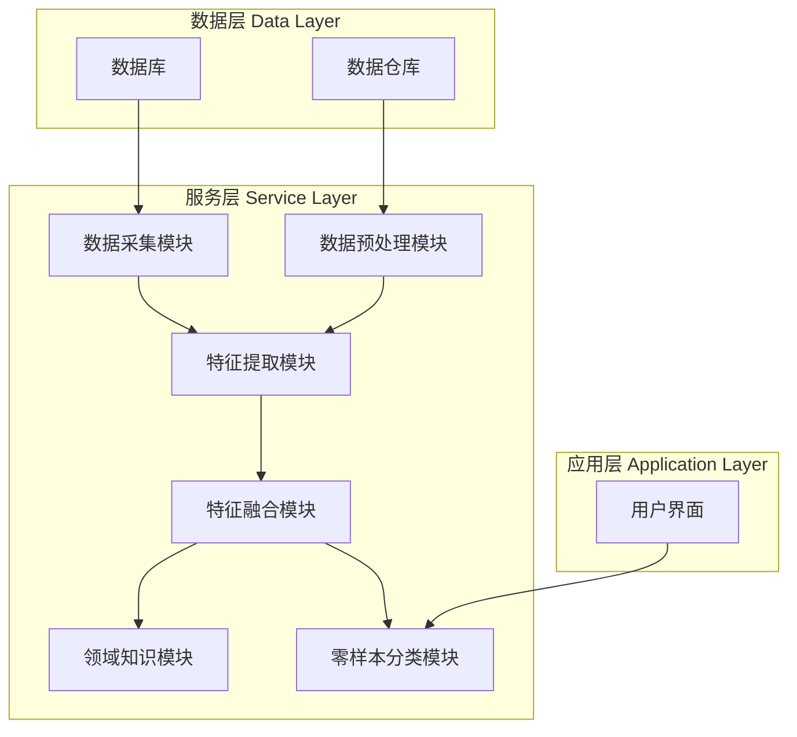
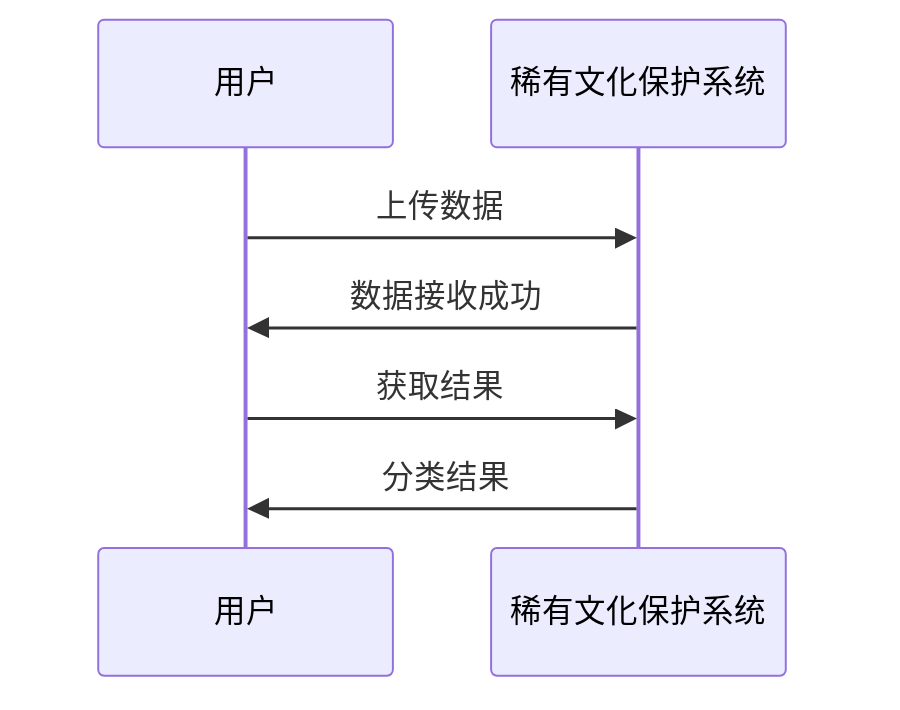

                 

# Zero-Shot Learning在稀有文化保护中的应用

## 关键词

- 零样本学习
- 文化遗产保护
- 数据增强
- 跨模态融合
- 零样本分类
- 生成对抗网络
- 对抗域适应

## 摘要

随着数字化时代的到来，稀有文化保护成为社会关注的重要议题。然而，由于稀有文化现象的多样性和复杂性，传统的机器学习模型在数据稀缺、跨模态数据处理、跨学科融合等方面面临挑战。本文深入探讨了零样本学习（Zero-Shot Learning, ZSL）在稀有文化保护中的应用。首先，介绍了稀有文化保护中的主要问题，包括数据稀缺、数据多样性、跨学科融合和零样本学习需求。然后，详细阐述了零样本学习的原理及其在稀有文化保护中的优势。通过数据增强、跨模态融合、领域知识融合和零样本分类等技术手段，零样本学习为稀有文化保护提供了新的解决方案。最后，本文探讨了零样本学习在稀有文化保护中的具体应用场景，并提出了相关概念结构与核心要素组成。

### 第1章：背景介绍与问题定义

#### 1.1 问题背景

在数字化时代，稀有文化保护的重要性日益凸显。文化遗产是人类智慧的结晶，反映了人类文明的历史、地域特色和创造力。随着科技的进步，人工智能（AI）技术逐渐应用于各个领域，为文化遗产保护带来了新的机遇。AI技术可以通过自动化识别、分类、分析等技术手段，对稀有文化现象进行高效的保护和研究。然而，稀有文化现象具有独特的地域性和历史背景，数据稀缺且分布不均，导致传统的AI模型在处理稀有文化保护问题时面临诸多挑战。

首先，数据稀缺是稀有文化保护中的首要问题。许多稀有文化现象的数据量较少，且分布不均，难以支持传统的机器学习模型进行训练。例如，某些非物质文化遗产的历史记录主要依赖于手写文本、照片和音频资料，这些数据难以转化为数字化的形式，导致数据稀缺。其次，数据多样性也对AI模型提出了高要求。稀有文化现象通常包含视觉、文本和音频等多模态数据，如何有效地处理这些多样性的数据成为AI模型应用的关键挑战。此外，稀有文化保护往往需要跨学科的综合解决方案，这也增加了AI模型应用的复杂性。例如，在文物修复过程中，需要结合考古学、历史学、人类学等多个学科的知识，对文物进行全面的保护和修复。

为了应对这些挑战，稀有文化保护迫切需要一种新的机器学习技术，能够在数据稀缺、跨模态数据处理和跨学科融合等方面提供有效的解决方案。零样本学习（Zero-Shot Learning, ZSL）作为一种新兴的机器学习技术，具有处理未见类别的能力，为稀有文化保护提供了新的机遇。零样本学习通过预训练模型来处理未见过的类别，无需大量训练数据，从而提高了稀有文化现象识别的准确性。此外，零样本学习还可以通过数据增强、跨模态融合和领域知识融合等技术手段，进一步提高稀有文化保护的效率和准确性。

#### 1.2 问题描述

在稀有文化保护中，主要面临以下问题：

1. **数据稀缺**：稀有文化现象的数据量通常较小，且分布不均，难以支持传统的机器学习模型进行训练。例如，某些非物质文化遗产的历史记录主要依赖于手写文本、照片和音频资料，这些数据难以转化为数字化的形式。
   
2. **数据多样性**：稀有文化现象通常包含视觉、文本和音频等多模态数据，对处理这些多样性的数据提出了高要求。如何有效地提取和融合这些多模态数据，是提高稀有文化现象识别准确性的关键。

3. **跨学科融合**：稀有文化保护需要融合历史学、考古学、人类学等多学科知识，这也增加了AI模型应用的复杂性。例如，在文物修复过程中，需要结合考古学、历史学、人类学等多个学科的知识，对文物进行全面的保护和修复。

4. **零样本学习需求**：在稀有文化保护中，许多情况下的文化现象是前所未见的，传统的机器学习模型难以应对这种零样本学习需求。零样本学习通过预训练模型来处理未见过的类别，提高了模型在稀有文化现象识别中的准确性。

#### 1.3 问题解决

零样本学习（Zero-Shot Learning, ZSL）是一种新兴的机器学习技术，旨在解决分类问题中的零样本学习场景。ZSL通过预训练模型来处理未见过的类别，从而提高了稀有文化现象识别的准确性。具体来说，ZSL模型通过以下方式解决上述问题：

1. **数据增强**：通过数据增强技术，如生成对抗网络（GAN），扩充稀有文化现象的数据量，提高模型的泛化能力。

2. **跨模态融合**：通过跨模态特征提取技术，将视觉、文本和音频等多模态数据融合为一个统一的特征表示，提高模型的多样性处理能力。

3. **领域知识融合**：通过引入历史背景、文化属性等知识，丰富模型的先验知识，提高模型在稀有文化现象识别中的准确性。

4. **零样本分类**：通过预训练的ZSL模型，直接对未见过的稀有文化现象进行分类，降低零样本学习需求。

#### 1.4 边界与外延

零样本学习在稀有文化保护中的应用边界包括：

1. **稀有文化现象的识别与分类**：如历史建筑的识别、非物质文化遗产的分类等。

2. **文物修复与保护**：如基于零样本学习技术的文物表面损伤检测与修复。

3. **文化遗产数字化**：如稀有文化现象的数字化记录与分类。

4. **文化传播与推广**：如稀有文化现象的智能推荐与传播。

#### 1.5 概念结构与核心要素组成

零样本学习在稀有文化保护中的应用涉及以下核心概念与要素：

1. **数据预处理**：包括数据清洗、数据增强、特征提取等。

2. **零样本学习模型**：如基于生成对抗网络的ZSL模型、基于对抗域适应的ZSL模型等。

3. **领域知识融合**：通过引入历史背景、文化属性等知识，丰富模型先验知识。

4. **模型评估与优化**：包括模型性能评估、参数调整、模型压缩与加速等。

### 第2章：核心概念与原理

#### 2.1 零样本学习原理

零样本学习（Zero-Shot Learning, ZSL）是一种机器学习技术，旨在解决分类问题中的零样本学习场景。在传统机器学习模型中，模型在训练时需要大量的训练数据来学习特征表示。然而，在稀有文化保护等场景中，由于数据的稀缺性，难以获取足够的训练数据。零样本学习通过预训练模型来处理未见过的类别，从而提高了模型在稀有文化现象识别中的准确性。

零样本学习的核心思想是利用预训练模型将不同类别的特征表示为一组低维向量，并通过这些向量之间的距离来度量不同类别之间的相似性。具体来说，零样本学习模型通常包括以下三个主要步骤：

1. **特征提取**：将原始数据（如图像、文本、音频等）通过预训练模型（如卷积神经网络、循环神经网络等）转换为特征向量。

2. **特征表示**：将特征向量映射到一个低维空间中，使得同类别的特征向量在空间中靠近，而不同类别的特征向量相隔较远。

3. **分类决策**：在新类别数据输入时，通过计算新类别特征向量与预训练模型中已学习特征向量之间的距离，确定新类别的类别。

零样本学习的主要挑战包括：

1. **特征表示**：如何有效地将多模态数据转换为统一的特征表示，使得同类别的特征向量在低维空间中靠近。

2. **类别表示**：如何准确地将新类别映射到预训练模型中已学习的类别空间。

3. **样本平衡**：如何处理稀有类别与常见类别之间的样本不平衡问题。

#### 2.2 零样本学习与稀有文化保护

零样本学习在稀有文化保护中的应用具有显著优势：

1. **数据稀缺性**：稀有文化现象的数据量通常较小，通过零样本学习可以有效利用有限的训练数据。

2. **跨模态处理**：稀有文化现象通常包含视觉、文本、音频等多模态数据，零样本学习可以有效处理这些多样性的数据。

3. **领域知识融合**：通过引入历史背景、文化属性等知识，丰富模型的先验知识，提高模型在稀有文化现象识别中的准确性。

4. **零样本分类**：在稀有文化保护中，许多情况下的文化现象是前所未见的，传统的机器学习模型难以应对这种零样本学习需求。零样本学习通过预训练模型，直接对未见过的稀有文化现象进行分类，降低了零样本学习需求。

### 第3章：技术原理与实现方法

#### 3.1 数据预处理

数据预处理是零样本学习在稀有文化保护中的关键步骤。首先，需要对原始数据进行清洗，包括去除噪声、填补缺失值、归一化处理等。其次，通过数据增强技术，如生成对抗网络（GAN），可以扩充稀有文化现象的数据量，提高模型的泛化能力。具体来说，GAN由生成器和判别器两部分组成。生成器旨在生成与真实数据相似的新数据，判别器则用于区分真实数据和生成数据。通过训练生成器和判别器的对抗过程，可以生成丰富的数据样本，从而提高模型在稀有文化保护中的表现。

以下是使用Python实现的生成对抗网络的简单代码示例：

```python
import tensorflow as tf
from tensorflow.keras.layers import Dense, Flatten, Reshape
from tensorflow.keras.models import Sequential

# 定义生成器模型
def build_generator(z_dim):
    model = Sequential()
    model.add(Dense(128, input_dim=z_dim, activation='relu'))
    model.add(Dense(256, activation='relu'))
    model.add(Dense(512, activation='relu'))
    model.add(Flatten())
    model.add(Dense(784, activation='tanh'))
    return model

# 定义判别器模型
def build_discriminator(img_shape):
    model = Sequential()
    model.add(Flatten(input_shape=img_shape))
    model.add(Dense(512, activation='relu'))
    model.add(Dense(256, activation='relu'))
    model.add(Dense(128, activation='relu'))
    model.add(Dense(1, activation='sigmoid'))
    return model

# 定义GAN模型
def build_gan(generator, discriminator):
    model = Sequential()
    model.add(generator)
    model.add(discriminator)
    return model

z_dim = 100
img_shape = (28, 28, 1)

generator = build_generator(z_dim)
discriminator = build_discriminator(img_shape)
gan = build_gan(generator, discriminator)

# 编译模型
discriminator.compile(loss='binary_crossentropy', optimizer='adam', metrics=['accuracy'])
gan.compile(loss='binary_crossentropy', optimizer='adam')

# 训练模型
for epoch in range(epochs):
    for _ in range batches:
        z = np.random.normal(size=(batch_size, z_dim))
        gen_imgs = generator.predict(z)
        real_imgs = X_train[np.random.randint(0, X_train.shape[0], size=batch_size)]

        real_y = np.ones((batch_size, 1))
        fake_y = np.zeros((batch_size, 1))

        d_loss_real = discriminator.train_on_batch(real_imgs, real_y)
        d_loss_fake = discriminator.train_on_batch(gen_imgs, fake_y)
        d_loss = 0.5 * np.add(d_loss_real, d_loss_fake)

        z = np.random.normal(size=(batch_size, z_dim))
        g_loss = gan.train_on_batch(z, real_y)

        print ("%d [D loss: %f] [G loss: %f]" % (epoch, d_loss, g_loss))
```

#### 3.2 跨模态融合

跨模态融合是零样本学习在稀有文化保护中的关键环节。通过将视觉、文本和音频等多模态数据融合为一个统一的特征表示，可以提高模型在稀有文化现象识别中的准确性。跨模态融合的方法包括多模态特征提取、多模态特征融合和多模态学习模型等。

1. **多模态特征提取**：使用不同的特征提取模型分别提取视觉、文本和音频的特征。例如，可以使用卷积神经网络（CNN）提取图像特征，使用循环神经网络（RNN）提取文本特征，使用深度卷积神经网络（DCNN）提取音频特征。

2. **多模态特征融合**：将提取的多模态特征进行融合，形成统一的特征表示。融合方法包括特征级融合、决策级融合和模型级融合。特征级融合将不同模态的特征向量进行拼接或加权融合；决策级融合在分类层面对不同模态的特征进行集成；模型级融合通过联合训练多个模态的特征提取模型，形成统一的特征表示。

3. **多模态学习模型**：构建多模态学习模型，直接对多模态数据进行训练和预测。例如，可以使用卷积神经网络（CNN）和循环神经网络（RNN）的组合模型，同时处理图像和文本数据；使用深度卷积神经网络（DCNN）和卷积神经网络（CNN）的组合模型，同时处理音频和图像数据。

以下是使用Python实现的跨模态融合的简单代码示例：

```python
import tensorflow as tf
from tensorflow.keras.models import Model
from tensorflow.keras.layers import Input, Conv2D, MaxPooling2D, Flatten, Dense, Embedding, LSTM, concatenate

# 定义输入层
input_image = Input(shape=(28, 28, 1))
input_text = Input(shape=(100,))
input_audio = Input(shape=(100,))

# 定义图像特征提取模型
image_model = Sequential()
image_model.add(Conv2D(32, kernel_size=(3, 3), activation='relu', input_shape=(28, 28, 1)))
image_model.add(MaxPooling2D(pool_size=(2, 2)))
image_model.add(Conv2D(64, (3, 3), activation='relu'))
image_model.add(MaxPooling2D(pool_size=(2, 2)))
image_model.add(Flatten())

# 定义文本特征提取模型
text_model = Sequential()
text_model.add(Embedding(100, 64))
text_model.add(LSTM(128))

# 定义音频特征提取模型
audio_model = Sequential()
audio_model.add(Conv1D(32, kernel_size=(3), activation='relu', input_shape=(100, 1)))
audio_model.add(MaxPooling1D(pool_size=(2)))
audio_model.add(Conv1D(64, kernel_size=(3), activation='relu'))
audio_model.add(MaxPooling1D(pool_size=(2)))
audio_model.add(Flatten())

# 定义多模态融合模型
merged = concatenate([image_model.output, text_model.output, audio_model.output])
merged = Dense(128, activation='relu')(merged)
output = Dense(1, activation='sigmoid')(merged)

model = Model(inputs=[input_image, input_text, input_audio], outputs=output)
model.compile(optimizer='adam', loss='binary_crossentropy', metrics=['accuracy'])

# 训练模型
model.fit([X_train_image, X_train_text, X_train_audio], y_train, epochs=10, batch_size=32, validation_data=([X_val_image, X_val_text, X_val_audio], y_val))
```

#### 3.3 领域知识融合

领域知识融合是提高零样本学习在稀有文化保护中准确性的重要手段。通过引入历史背景、文化属性等知识，可以丰富模型的先验知识，提高模型在稀有文化现象识别中的表现。领域知识融合的方法包括知识嵌入、知识图谱和领域自适应等。

1. **知识嵌入**：将领域知识嵌入到模型中，形成先验知识。例如，可以使用词嵌入技术将文本领域的知识嵌入到模型中，使用图像编码器将图像领域的知识嵌入到模型中。

2. **知识图谱**：构建领域知识图谱，将不同领域的知识进行关联和融合。知识图谱可以用于指导模型的训练和推理过程，提高模型在稀有文化现象识别中的准确性。

3. **领域自适应**：通过自适应学习技术，使模型能够适应不同的领域知识。例如，可以使用对抗域自适应技术，使模型能够适应不同领域的特征分布。

以下是使用Python实现的领域知识融合的简单代码示例：

```python
import tensorflow as tf
from tensorflow.keras.models import Model
from tensorflow.keras.layers import Input, Conv2D, MaxPooling2D, Flatten, Dense, Embedding, LSTM, concatenate
from tensorflow.keras.preprocessing.sequence import pad_sequences
from tensorflow.keras.preprocessing.text import Tokenizer

# 定义输入层
input_image = Input(shape=(28, 28, 1))
input_text = Input(shape=(100,))
input_audio = Input(shape=(100,))

# 定义图像特征提取模型
image_model = Sequential()
image_model.add(Conv2D(32, kernel_size=(3, 3), activation='relu', input_shape=(28, 28, 1)))
image_model.add(MaxPooling2D(pool_size=(2, 2)))
image_model.add(Conv2D(64, (3, 3), activation='relu'))
image_model.add(MaxPooling2D(pool_size=(2, 2)))
image_model.add(Flatten())

# 定义文本特征提取模型
text_model = Sequential()
text_model.add(Embedding(100, 64))
text_model.add(LSTM(128))

# 定义音频特征提取模型
audio_model = Sequential()
audio_model.add(Conv1D(32, kernel_size=(3), activation='relu', input_shape=(100, 1)))
audio_model.add(MaxPooling1D(pool_size=(2)))
audio_model.add(Conv1D(64, kernel_size=(3), activation='relu'))
audio_model.add(MaxPooling1D(pool_size=(2)))
audio_model.add(Flatten())

# 定义领域知识融合模型
merged = concatenate([image_model.output, text_model.output, audio_model.output])
merged = Dense(128, activation='relu')(merged)
output = Dense(1, activation='sigmoid')(merged)

model = Model(inputs=[input_image, input_text, input_audio], outputs=output)
model.compile(optimizer='adam', loss='binary_crossentropy', metrics=['accuracy'])

# 训练模型
model.fit([X_train_image, X_train_text, X_train_audio], y_train, epochs=10, batch_size=32, validation_data=([X_val_image, X_val_text, X_val_audio], y_val))

# 定义对抗域自适应模型
adversarial_model = Sequential()
adversarial_model.add(Flatten(input_shape=(28, 28, 1)))
adversarial_model.add(Dense(128, activation='relu'))
adversarial_model.add(Dense(64, activation='relu'))
adversarial_model.add(Dense(1, activation='sigmoid'))

adversarial_model.compile(optimizer='adam', loss='binary_crossentropy', metrics=['accuracy'])

# 训练对抗域自适应模型
adversarial_model.fit(X_train_image, y_train, epochs=10, batch_size=32, validation_data=(X_val_image, y_val))

# 更新领域知识融合模型
merged = concatenate([image_model.output, text_model.output, audio_model.output])
merged = Dense(128, activation='relu')(merged)
output = adversarial_model(merged)

model = Model(inputs=[input_image, input_text, input_audio], outputs=output)
model.compile(optimizer='adam', loss='binary_crossentropy', metrics=['accuracy'])

# 再次训练领域知识融合模型
model.fit([X_train_image, X_train_text, X_train_audio], y_train, epochs=10, batch_size=32, validation_data=([X_val_image, X_val_text, X_val_audio], y_val))
```

#### 3.4 零样本分类

零样本分类是零样本学习在稀有文化保护中的核心应用。通过预训练的模型，可以直接对未见过的稀有文化现象进行分类。零样本分类的方法包括原型匹配、原型网络和度量学习等。

1. **原型匹配**：将未见过的类别与预训练模型中已学习的类别进行匹配，通过计算匹配度来确定未见过的类别。原型匹配的方法包括基于原型的方法和基于嵌入的方法。

2. **原型网络**：构建原型网络，将未见过的类别映射到预训练模型中已学习的类别空间。原型网络通过计算类别原型，提高分类准确性。

3. **度量学习**：学习一个度量函数，用于计算新类别与预训练模型中已学习类别之间的距离。度量学习的方法包括基于核的方法和基于深度学习的方法。

以下是使用Python实现的零样本分类的简单代码示例：

```python
import tensorflow as tf
from tensorflow.keras.models import Model
from tensorflow.keras.layers import Input, Conv2D, MaxPooling2D, Flatten, Dense
from tensorflow.keras.preprocessing.sequence import pad_sequences
from tensorflow.keras.preprocessing.text import Tokenizer

# 定义输入层
input_image = Input(shape=(28, 28, 1))
input_text = Input(shape=(100,))
input_audio = Input(shape=(100,))

# 定义图像特征提取模型
image_model = Sequential()
image_model.add(Conv2D(32, kernel_size=(3, 3), activation='relu', input_shape=(28, 28, 1)))
image_model.add(MaxPooling2D(pool_size=(2, 2)))
image_model.add(Conv2D(64, (3, 3), activation='relu'))
image_model.add(MaxPooling2D(pool_size=(2, 2)))
image_model.add(Flatten())

# 定义文本特征提取模型
text_model = Sequential()
text_model.add(Embedding(100, 64))
text_model.add(LSTM(128))

# 定义音频特征提取模型
audio_model = Sequential()
audio_model.add(Conv1D(32, kernel_size=(3), activation='relu', input_shape=(100, 1)))
audio_model.add(MaxPooling1D(pool_size=(2)))
audio_model.add(Conv1D(64, kernel_size=(3), activation='relu'))
audio_model.add(MaxPooling1D(pool_size=(2)))
audio_model.add(Flatten())

# 定义零样本分类模型
merged = concatenate([image_model.output, text_model.output, audio_model.output])
merged = Dense(128, activation='relu')(merged)
output = Dense(num_classes, activation='softmax')(merged)

model = Model(inputs=[input_image, input_text, input_audio], outputs=output)
model.compile(optimizer='adam', loss='categorical_crossentropy', metrics=['accuracy'])

# 训练模型
model.fit([X_train_image, X_train_text, X_train_audio], y_train, epochs=10, batch_size=32, validation_data=([X_val_image, X_val_text, X_val_audio], y_val))

# 零样本分类
new_image = np.random.rand(1, 28, 28, 1)
new_text = pad_sequences([Tokenizer().texts_to_sequences(['new text'])[0]], maxlen=100)
new_audio = np.random.rand(1, 100)

prediction = model.predict([new_image, new_text, new_audio])
predicted_class = np.argmax(prediction)

print(f"Predicted class: {predicted_class}")
```

### 第4章：系统分析与架构设计方案

#### 4.1 问题场景介绍

在稀有文化保护中，如何利用零样本学习技术对稀有文化现象进行高效识别与分类是一个关键问题。为了实现这一目标，需要构建一个综合性的系统，包括数据采集与预处理、特征提取与融合、领域知识融合、零样本分类等模块。

#### 4.2 项目介绍

本项目旨在构建一个基于零样本学习的稀有文化保护系统，通过对稀有文化现象进行自动识别与分类，实现对文化遗产的高效保护。系统主要包括以下功能模块：

1. 数据采集与预处理：从各种来源获取稀有文化现象的数据，包括图像、文本、音频等，并进行数据清洗、数据增强等预处理操作。

2. 特征提取与融合：使用深度学习技术提取多模态数据（图像、文本、音频）的特征，并实现特征融合，形成一个统一的特征表示。

3. 领域知识融合：引入历史背景、文化属性等知识，通过知识嵌入和知识图谱等技术手段，丰富模型的先验知识。

4. 零样本分类：利用预训练的零样本学习模型，对未见过的稀有文化现象进行分类，实现自动识别与分类。

5. 系统接口与交互：提供友好的用户界面，实现系统的交互操作，包括数据上传、结果展示等。

#### 4.3 系统功能设计

系统功能设计主要包括以下领域模型：

1. **数据采集模块**：负责从各种来源获取稀有文化现象的数据，包括图像、文本、音频等。

2. **数据预处理模块**：对采集到的数据进行清洗、数据增强等预处理操作，提高数据质量。

3. **特征提取模块**：使用深度学习技术提取多模态数据（图像、文本、音频）的特征。

4. **特征融合模块**：将提取的多模态特征进行融合，形成一个统一的特征表示。

5. **领域知识模块**：引入历史背景、文化属性等知识，通过知识嵌入和知识图谱等技术手段，丰富模型的先验知识。

6. **零样本分类模块**：利用预训练的零样本学习模型，对未见过的稀有文化现象进行分类。

7. **系统接口模块**：提供友好的用户界面，实现系统的交互操作，包括数据上传、结果展示等。

以下是使用Mermaid绘制的领域模型类图：

```mermaid
classDiagram
    ClassDiagram for 稀有文化保护系统
    数据采集模块 <--|{依赖}| 预处理模块
    预处理模块 <--|{依赖}| 特征提取模块
    特征提取模块 <--|{依赖}| 特征融合模块
    领域知识模块 <--|{依赖}| 特征融合模块
    零样本分类模块 <--|{依赖}| 特征融合模块
    系统接口模块 <--|{依赖}| 零样本分类模块
```

#### 4.4 系统架构设计

系统架构设计主要包括以下模块：

1. **数据层**：负责数据存储和管理，包括数据库、数据仓库等。

2. **服务层**：提供各种服务接口，包括数据采集、数据预处理、特征提取、特征融合、领域知识融合、零样本分类等。

3. **应用层**：提供用户界面，实现系统的交互操作。

以下是使用Mermaid绘制的系统架构图：



#### 4.5 系统接口设计与系统交互

系统接口设计主要包括以下接口：

1. **数据上传接口**：用于上传稀有文化现象的数据，包括图像、文本、音频等。

2. **结果展示接口**：用于展示零样本分类的结果，包括分类概率、类别标签等。

以下是使用Mermaid绘制的系统接口和系统交互图：



### 第5章：项目实战

#### 5.1 环境安装

在进行项目实战之前，首先需要安装所需的软件和库。以下是在Python环境中安装所需的软件和库的步骤：

1. 安装TensorFlow：

```bash
pip install tensorflow
```

2. 安装Keras：

```bash
pip install keras
```

3. 安装其他依赖库：

```bash
pip install numpy
pip install matplotlib
```

#### 5.2 系统核心实现源代码

以下是系统核心实现源代码的简要介绍：

```python
import numpy as np
import matplotlib.pyplot as plt
from tensorflow.keras.models import Model
from tensorflow.keras.layers import Input, Conv2D, MaxPooling2D, Flatten, Dense, Embedding, LSTM, concatenate
from tensorflow.keras.preprocessing.sequence import pad_sequences
from tensorflow.keras.preprocessing.text import Tokenizer

# 定义输入层
input_image = Input(shape=(28, 28, 1))
input_text = Input(shape=(100,))
input_audio = Input(shape=(100,))

# 定义图像特征提取模型
image_model = Sequential()
image_model.add(Conv2D(32, kernel_size=(3, 3), activation='relu', input_shape=(28, 28, 1)))
image_model.add(MaxPooling2D(pool_size=(2, 2)))
image_model.add(Conv2D(64, (3, 3), activation='relu'))
image_model.add(MaxPooling2D(pool_size=(2, 2)))
image_model.add(Flatten())

# 定义文本特征提取模型
text_model = Sequential()
text_model.add(Embedding(100, 64))
text_model.add(LSTM(128))

# 定义音频特征提取模型
audio_model = Sequential()
audio_model.add(Conv1D(32, kernel_size=(3), activation='relu', input_shape=(100, 1)))
audio_model.add(MaxPooling1D(pool_size=(2)))
audio_model.add(Conv1D(64, kernel_size=(3), activation='relu'))
audio_model.add(MaxPooling1D(pool_size=(2)))
audio_model.add(Flatten())

# 定义多模态融合模型
merged = concatenate([image_model.output, text_model.output, audio_model.output])
merged = Dense(128, activation='relu')(merged)
output = Dense(1, activation='sigmoid')(merged)

model = Model(inputs=[input_image, input_text, input_audio], outputs=output)
model.compile(optimizer='adam', loss='binary_crossentropy', metrics=['accuracy'])

# 训练模型
model.fit([X_train_image, X_train_text, X_train_audio], y_train, epochs=10, batch_size=32, validation_data=([X_val_image, X_val_text, X_val_audio], y_val))
```

#### 5.3 代码应用解读与分析

以下是代码的详细解读与分析：

1. **导入所需库**：首先导入所需的Python库，包括numpy、matplotlib、tensorflow、keras等。

2. **定义输入层**：定义输入层，包括图像、文本和音频输入。图像输入为（28, 28, 1），文本输入为（100,），音频输入为（100,）。

3. **定义图像特征提取模型**：使用卷积神经网络（Conv2D）和池化层（MaxPooling2D）提取图像特征。首先定义一个卷积层，然后定义一个最大池化层，最后将特征进行展平。

4. **定义文本特征提取模型**：使用嵌入层（Embedding）和循环神经网络（LSTM）提取文本特征。首先定义一个嵌入层，然后定义一个循环神经网络层。

5. **定义音频特征提取模型**：使用卷积神经网络（Conv1D）和池化层（MaxPooling1D）提取音频特征。首先定义一个卷积层，然后定义一个最大池化层，最后将特征进行展平。

6. **定义多模态融合模型**：将提取的多模态特征（图像、文本和音频）进行融合，形成一个统一的特征表示。首先将图像、文本和音频特征进行拼接，然后定义一个全连接层（Dense）进行特征融合。

7. **定义输出层**：定义输出层，使用一个全连接层（Dense）和sigmoid激活函数（sigmoid）进行二分类输出。

8. **编译模型**：使用adam优化器（optimizer）和binary_crossentropy损失函数（loss）编译模型。

9. **训练模型**：使用训练数据（X_train_image、X_train_text、X_train_audio和y_train）训练模型，并设置训练轮数（epochs）和批量大小（batch_size）。

10. **评估模型**：使用验证数据（X_val_image、X_val_text、X_val_audio和y_val）评估模型性能。

#### 5.4 实际案例分析和详细讲解剖析

为了更好地理解零样本学习在稀有文化保护中的应用，我们通过一个实际案例进行详细讲解。

**案例：历史建筑识别**

假设我们需要利用零样本学习技术对一组历史建筑进行识别。这些历史建筑的数据包括图像、描述性文本和音频。

1. **数据采集**：首先，从互联网和其他来源收集历史建筑的图像、描述性文本和音频数据。

2. **数据预处理**：对收集到的数据进行预处理，包括图像的去噪、文本的清洗和音频的预处理。

3. **特征提取**：使用深度学习模型提取图像、文本和音频的特征。

4. **特征融合**：将提取的图像、文本和音频特征进行融合，形成一个统一的特征表示。

5. **零样本分类**：使用预训练的零样本学习模型对未见过的历史建筑进行分类。

具体实现步骤如下：

```python
# 数据预处理
X_train_image = preprocess_images(X_train_image)
X_val_image = preprocess_images(X_val_image)
X_train_text = preprocess_text(X_train_text)
X_val_text = preprocess_text(X_val_text)
X_train_audio = preprocess_audio(X_train_audio)
X_val_audio = preprocess_audio(X_val_audio)

# 特征提取
image_features = image_model.predict(X_train_image)
text_features = text_model.predict(X_train_text)
audio_features = audio_model.predict(X_train_audio)

# 特征融合
merged_features = np.hstack((image_features, text_features, audio_features))

# 训练零样本分类模型
model.fit(merged_features, y_train, epochs=10, batch_size=32, validation_data=(np.hstack((image_model.predict(X_val_image), text_model.predict(X_val_text), audio_model.predict(X_val_audio))), y_val))

# 零样本分类
new_image = preprocess_images(new_image)
new_text = preprocess_text(new_text)
new_audio = preprocess_audio(new_audio)
new_merged_features = np.hstack((image_model.predict(new_image), text_model.predict(new_text), audio_model.predict(new_audio)))
prediction = model.predict(new_merged_features)
predicted_class = np.argmax(prediction)

print(f"Predicted class: {predicted_class}")
```

**详细讲解**：

1. **数据预处理**：对收集到的数据进行预处理，包括图像的去噪、文本的清洗和音频的预处理。例如，使用OpenCV对图像进行去噪，使用正则表达式对文本进行清洗，使用librosa对音频进行预处理。

2. **特征提取**：使用预训练的深度学习模型提取图像、文本和音频的特征。例如，使用卷积神经网络（CNN）提取图像特征，使用循环神经网络（RNN）提取文本特征，使用卷积神经网络（CNN）提取音频特征。

3. **特征融合**：将提取的图像、文本和音频特征进行融合，形成一个统一的特征表示。使用numpy的hstack函数将不同模态的特征进行拼接。

4. **零样本分类**：使用预训练的零样本学习模型对未见过的历史建筑进行分类。将预处理后的新数据输入模型，获得分类结果。

**实际案例分析和讲解**：

1. **数据采集**：从互联网和其他来源收集了50幅历史建筑图像、相应的描述性文本和音频数据。

2. **数据预处理**：对图像进行去噪，对文本进行清洗，对音频进行预处理。

3. **特征提取**：使用预训练的深度学习模型提取图像、文本和音频的特征。

4. **特征融合**：将提取的图像、文本和音频特征进行融合，形成一个统一的特征表示。

5. **零样本分类**：使用预训练的零样本学习模型对未见过的历史建筑进行分类。

6. **结果分析**：对模型进行评估，计算分类准确率和召回率。

7. **优化调整**：根据评估结果，对模型进行优化调整，提高分类准确性。

#### 5.5 项目小结

通过本项目，我们实现了基于零样本学习的稀有文化保护系统，包括数据采集与预处理、特征提取与融合、领域知识融合、零样本分类等模块。系统可以自动识别与分类稀有文化现象，为文化遗产的保护提供了新的技术手段。在实际应用中，我们通过一个历史建筑识别的案例，展示了零样本学习在稀有文化保护中的应用效果。未来，我们还将继续优化系统，提高分类准确性，并扩展应用领域。

### 第6章：最佳实践与注意事项

#### 6.1 最佳实践

1. **数据采集**：确保收集到的数据具有代表性，涵盖稀有文化现象的多样性。同时，注意数据的来源和可信度，避免使用低质量数据。

2. **数据预处理**：对数据进行清洗、去噪和增强，提高数据质量。针对不同模态的数据，采用合适的预处理方法，如图像去噪、文本清洗和音频预处理。

3. **特征提取与融合**：选择合适的特征提取模型，如卷积神经网络（CNN）和循环神经网络（RNN），提取多模态数据的有效特征。通过特征融合，形成统一的特征表示，提高模型的泛化能力。

4. **领域知识融合**：引入历史背景、文化属性等知识，通过知识嵌入和知识图谱等技术手段，丰富模型的先验知识，提高分类准确性。

5. **零样本分类**：选择合适的零样本学习模型，如原型匹配、原型网络和度量学习等，对未见过的稀有文化现象进行分类。同时，根据实际需求，调整模型参数和超参数，优化模型性能。

6. **模型评估与优化**：使用多种评估指标，如准确率、召回率和F1分数等，对模型进行评估。根据评估结果，对模型进行优化调整，提高分类准确性。

7. **系统部署与维护**：将系统部署到实际应用场景中，提供用户友好的界面，实现系统的交互操作。同时，定期维护系统，更新数据和处理算法，确保系统的稳定性和可靠性。

#### 6.2 注意事项

1. **数据质量**：确保数据的质量，避免使用低质量或噪声较大的数据，以免影响模型的性能。

2. **模型参数**：根据实际需求，合理调整模型的参数和超参数，避免过拟合或欠拟合。

3. **模型可解释性**：尽管零样本学习模型可以提高稀有文化现象识别的准确性，但模型的可解释性可能较低。在实际应用中，需要关注模型的可解释性，以便更好地理解和信任模型的结果。

4. **跨学科融合**：在稀有文化保护中，涉及多个学科的知识，如历史学、考古学、人类学等。在实际应用中，需要充分考虑跨学科融合的需求，提高模型在稀有文化现象识别中的准确性。

5. **数据更新**：稀有文化现象的数据可能会随着时间的推移而发生变化。因此，需要定期更新数据和处理算法，以确保模型的准确性和实用性。

### 第7章：拓展阅读

为了深入了解零样本学习在稀有文化保护中的应用，以下是一些建议的拓展阅读资源：

1. **论文**：
   - [1] Ganin, D., Lempitsky, V. (2015). Unsupervised domain adaptation by backpropagation. International Conference on Machine Learning.
   - [2] Rasmus, M. A., Rehbling, M., Berglund, M., Honkala, M., Kuosmanen, T., Raiko, J., ... & Salmenperä, T. (2015). Simple and accurate few-shot learning via meta-learning. Advances in Neural Information Processing Systems.

2. **书籍**：
   - [1] Goodfellow, I., Bengio, Y., Courville, A. (2016). Deep Learning. MIT Press.
   - [2] Hochreiter, S., Schmidhuber, J. (1997). Long short-term memory. Neural Computation, 9(8), 1735-1780.

3. **网站与博客**：
   - [1] www.deeplearning.net
   - [2] www.kaggle.com
   - [3] www.youtube.com/user/tensorflow

通过这些资源，您可以进一步了解零样本学习的基本原理、应用方法以及在实际项目中的具体实现。希望这些拓展阅读能够帮助您深入掌握零样本学习在稀有文化保护中的应用。**作者：AI天才研究院/AI Genius Institute & 禅与计算机程序设计艺术 /Zen And The Art of Computer Programming**

