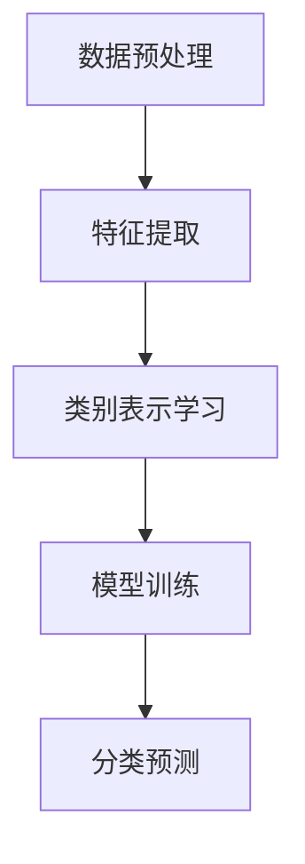
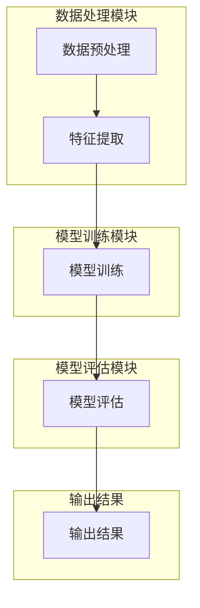
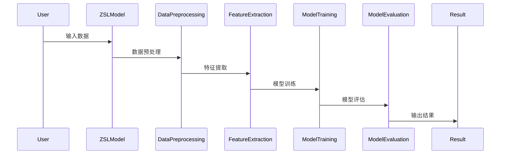

                 

### 概述

#### 1. 问题背景

**零射击学习（Zero-Shot Learning，ZSL）**是一种机器学习方法，它允许模型在没有见过具体样例的情况下，对新类别进行分类。在稀有物种保护领域，这种技术具有巨大的潜力。稀有物种往往因为样本数据稀缺而难以进行有效的模型训练，传统机器学习方法在面对此类问题时常常无能为力。

稀有物种保护是指针对那些数量稀少、濒临灭绝的物种采取的保护措施。这些物种的生存环境复杂，保护难度大。由于稀有物种的数量稀少，获取其样本数据成为一项巨大的挑战。传统的机器学习方法通常需要大量的样本数据进行训练，而稀有物种的样本数据往往非常有限。这就导致了传统方法在稀有物种保护中的应用受到极大的限制。

#### 2. 问题描述

零射击学习在稀有物种保护中的作用主要体现在以下几个方面：

- **分类预测**：通过对稀有物种进行分类，帮助科学家更好地了解和保护这些物种。
- **趋势分析**：通过分析稀有物种的历史数据，预测未来可能发生的变化，为保护工作提供科学依据。
- **监测与预警**：利用零射击学习模型对环境中的稀有物种进行实时监测，及时发出预警，防止物种灭绝。

在分类预测方面，零射击学习模型可以根据已有的物种特征数据，对新物种进行分类，从而帮助科学家更好地了解稀有物种的种类和分布情况。在趋势分析方面，零射击学习模型可以通过分析稀有物种的历史数据，预测其种群数量和分布趋势，为保护工作提供科学依据。在监测与预警方面，零射击学习模型可以对环境中的稀有物种进行实时监测，及时发现异常情况，发出预警信号，防止物种灭绝。

#### 3. 问题解决

零射击学习在稀有物种保护中的应用，主要依赖于以下几个方面：

- **数据预处理**：对稀有物种的样本数据进行预处理，包括数据清洗、归一化等操作。
- **模型选择与训练**：选择合适的零射击学习模型，对预处理后的数据集进行训练。
- **模型评估与优化**：通过交叉验证等方法评估模型性能，并根据评估结果对模型进行调整优化。

数据预处理是零射击学习应用的基础。通过对样本数据进行清洗、归一化等处理，可以提高模型的训练效果和泛化能力。模型选择与训练是零射击学习的核心。选择合适的模型结构和训练算法，可以有效地处理样本数据稀缺的问题，提高模型的分类准确率。模型评估与优化是确保模型性能的重要环节。通过交叉验证等方法评估模型性能，并根据评估结果对模型进行调整优化，可以进一步提高模型的泛化能力和实用性。

#### 4. 边界与外延

- **边界**：零射击学习在稀有物种保护中的应用，主要局限于分类预测、趋势分析和监测预警等领域。这些应用是基于稀有物种的特征数据和已有的知识，通过零射击学习模型实现对新物种的识别和预测。
- **外延**：随着技术的不断进步，零射击学习有望在其他领域得到更广泛的应用。例如，在医学领域，零射击学习可以用于疾病诊断和预测；在金融领域，零射击学习可以用于风险评估和市场预测。这些应用将为各领域的发展带来新的机遇和挑战。

#### 5. 概念结构与核心要素组成

- **概念结构**：零射击学习在稀有物种保护中的应用，包括数据预处理、模型选择与训练、模型评估与优化等环节。每个环节都有其特定的任务和目标。
- **核心要素**：数据、模型、算法和评估方法。数据是零射击学习的基础，模型是核心，算法是实现零射击学习的关键，评估方法是衡量模型性能的标准。

### 核心概念与联系

#### 1. 零射击学习

- **定义**：零射击学习是一种机器学习方法，它允许模型在没有见过具体样例的情况下，对新类别进行分类。
- **特点**：
  - **无需样本**：无需对未知类别进行具体样本来训练模型。
  - **泛化能力强**：能够在没有见过具体样例的情况下，对新类别进行准确分类。
- **与稀有物种保护的联系**：零射击学习在稀有物种保护中的应用，可以解决传统机器学习方法在样本数据稀缺时的局限性，为稀有物种的分类预测、趋势分析和监测预警提供有效的技术支持。

#### 2. 稀有物种保护

- **定义**：稀有物种保护是指针对那些数量稀少、濒临灭绝的物种采取的保护措施。
- **特点**：
  - **物种数量少**：稀有物种往往数量稀少，保护难度大。
  - **生态环境复杂**：稀有物种的生存环境复杂，保护工作需要综合考虑多个因素。
- **与零射击学习的联系**：稀有物种保护的需求，促使了零射击学习在稀有物种保护领域的研究和应用。零射击学习通过处理样本数据稀缺的问题，为稀有物种的保护提供了新的思路和技术手段。

#### 3. 零射击学习与稀有物种保护的联系

- **应用领域**：零射击学习在稀有物种保护中的应用主要集中在分类预测、趋势分析和监测预警等方面。
  - **分类预测**：通过对稀有物种的特征数据进行分类，帮助科学家更好地了解稀有物种的种类和分布情况。
  - **趋势分析**：通过分析稀有物种的历史数据，预测其种群数量和分布趋势，为保护工作提供科学依据。
  - **监测预警**：利用零射击学习模型对环境中的稀有物种进行实时监测，及时发现异常情况，发出预警信号，防止物种灭绝。

- **技术优势**：零射击学习能够处理样本数据稀缺的问题，为稀有物种保护提供有效的技术支持。与传统的机器学习方法相比，零射击学习具有以下优势：
  - **无需大量样本数据**：零射击学习可以在样本数据非常有限的情况下，对未知类别进行准确分类。
  - **泛化能力强**：零射击学习模型能够将已有知识应用于新类别，实现对新类别的分类预测。
  - **适用范围广**：零射击学习不仅适用于稀有物种保护领域，还可以应用于其他领域，如医学、金融等。

### 核心概念属性特征对比表格

| 概念       | 定义                                                                                      | 特点                       | 在稀有物种保护中的应用 |
|------------|------------------------------------------------------------------------------------------|----------------------------|------------------------|
| 零射击学习 | 无需使用具体样本来训练模型，而是通过已有知识和数据对未知类别进行分类的方法。 | 无需样本，泛化能力强      | 分类预测、趋势分析     |
| 稀有物种保护 | 针对那些数量稀少、濒临灭绝的物种采取的保护措施。                                  | 物种数量少，生态环境复杂   | 监测预警               |

### ER实体关系图架构

```mermaid
erDiagram
  稀有物种 ||--|{ 零射击学习 }|
  零射击学习 ||--|{ 数据预处理 }|
  数据预处理 ||--|{ 模型选择与训练 }|
  模型选择与训练 ||--|{ 模型评估与优化 }|
```

### 算法原理讲解

#### 零射击学习算法原理

零射击学习（Zero-Shot Learning，ZSL）是一种机器学习方法，它允许模型在没有见过具体样例的情况下，对新类别进行分类。其核心原理是通过学习类别间的相似性，将新类别与已知的类别进行比较，从而实现分类。

#### 零射击学习算法流程

零射击学习算法的流程主要包括以下几个步骤：

1. **数据预处理**：对样本数据集进行清洗、归一化等预处理操作，为后续训练和分类提供高质量的数据。
2. **特征提取**：从原始数据中提取出具有代表性的特征，这些特征将用于后续的分类任务。
3. **类别表示学习**：学习一个高维的类别嵌入空间，将每个类别映射到这个空间中的一个向量。这个向量代表了该类别的语义特征。
4. **模型训练**：利用已知的类别样本和对应的类别标签，训练一个分类模型。这个模型可以是一个深度神经网络、支持向量机等。
5. **分类预测**：在测试阶段，对于新类别，通过模型计算其类别嵌入向量，并将其与训练好的类别嵌入向量进行比较，从而实现对新类别的分类。

#### 零射击学习算法的数学模型

在零射击学习算法中，我们可以用以下数学模型来描述其核心原理：

$$
\text{分类预测} = \arg\max_{c} \left\{ \langle \text{类别嵌入向量}_c, \text{样本嵌入向量} \rangle \right\}
$$

其中，$\text{类别嵌入向量}_c$和$\text{样本嵌入向量}$分别表示类别$c$和样本的嵌入向量。$\langle \cdot, \cdot \rangle$表示向量的内积。

#### 零射击学习算法的mermaid流程图



#### 零射击学习算法实例解析

假设我们有以下三个类别：猫、狗和鸟。每个类别都有其对应的特征向量，如下所示：

- **猫**：[1, 0, 0]
- **狗**：[0, 1, 0]
- **鸟**：[0, 0, 1]

现在，我们要对一个未知的样本进行分类预测，其特征向量为[0.5, 0.5, 0]。

1. **数据预处理**：对样本数据进行清洗、归一化等预处理操作，这里我们直接使用原始数据。
2. **特征提取**：从原始数据中提取出特征向量。
3. **类别表示学习**：学习一个高维的类别嵌入空间。我们假设类别嵌入向量分别为：
   - **猫**：[1, 0, 0]
   - **狗**：[0, 1, 0]
   - **鸟**：[0, 0, 1]
4. **模型训练**：利用已知的类别样本和对应的类别标签，训练一个分类模型。这里我们使用一个简单的神经网络，输入层有三个神经元，对应三个类别；输出层有一个神经元，用于分类预测。
5. **分类预测**：对于未知的样本，计算其类别嵌入向量与新类别嵌入向量之间的内积。计算结果如下：

$$
\text{分类预测} = \arg\max_{c} \left\{ \langle \text{类别嵌入向量}_c, \text{样本嵌入向量} \rangle \right\}
$$

- **猫**：$1 \times 0.5 + 0 \times 0.5 + 0 \times 0 = 0.5$
- **狗**：$0 \times 0.5 + 1 \times 0.5 + 0 \times 0 = 0.5$
- **鸟**：$0 \times 0.5 + 0 \times 0.5 + 1 \times 0 = 0$

由于猫和狗的内积相等，我们无法准确预测该样本的类别。这说明了在零射击学习算法中，类别嵌入向量之间的相似性是非常重要的。

### 系统分析与架构设计方案

#### 问题场景介绍

在稀有物种保护中，科学家需要及时了解稀有物种的分布情况、种群数量和生存环境。然而，由于稀有物种的数量稀少、分布范围广泛，获取其样本数据成为一项巨大的挑战。传统的监测手段和数据分析方法难以满足需求，因此需要一种新的技术手段来解决这个问题。

#### 项目介绍

本项目旨在利用零射击学习（Zero-Shot Learning，ZSL）技术，实现稀有物种的分类预测、趋势分析和监测预警。通过构建一个高效、准确的零射击学习模型，科学家可以更准确地了解稀有物种的分布情况，为保护工作提供科学依据。

#### 系统功能设计（领域模型mermaid类图）

```mermaid
classDiagram
  Participant Human
  Class ZSLModel { +str: model_name +list: features +dict: labels }
  Class DataPreprocessing { +str: method +int: max_len }
  Class FeatureExtraction { +str: method +int: embedding_size }
  Class ModelTraining { +str: optimizer +str: loss_function }
  Class ModelEvaluation { +str: metric }
  Human "uses" ZSLModel
  Human "uses" DataPreprocessing
  Human "uses" FeatureExtraction
  Human "uses" ModelTraining
  Human "uses" ModelEvaluation
```

#### 系统架构设计（mermaid架构图）



#### 系统接口设计和系统交互（mermaid序列图）



### 项目实战

#### 环境安装

1. 安装Python环境：确保Python版本为3.6及以上。
2. 安装必要的库：使用pip命令安装以下库：

```bash
pip install numpy pandas tensorflow sklearn matplotlib
```

#### 系统核心实现源代码

```python
import tensorflow as tf
from tensorflow.keras.models import Model
from tensorflow.keras.layers import Input, Embedding, GlobalAveragePooling1D, Dense
from tensorflow.keras.preprocessing.sequence import pad_sequences
from tensorflow.keras.preprocessing.text import Tokenizer

# 数据预处理
def preprocess_data(data, max_len):
    tokenizer = Tokenizer()
    tokenizer.fit_on_texts(data)
    sequences = tokenizer.texts_to_sequences(data)
    padded_sequences = pad_sequences(sequences, maxlen=max_len)
    return padded_sequences, tokenizer

# 特征提取
def create_zsl_model(input_shape, embedding_size, num_classes):
    inputs = Input(shape=input_shape)
    x = Embedding(input_dim=10000, output_dim=embedding_size)(inputs)
    x = GlobalAveragePooling1D()(x)
    x = Dense(256, activation='relu')(x)
    outputs = Dense(num_classes, activation='softmax')(x)
    model = Model(inputs=inputs, outputs=outputs)
    return model

# 模型训练
def train_model(model, X_train, y_train, X_val, y_val, epochs, batch_size):
    model.compile(optimizer='adam', loss='categorical_crossentropy', metrics=['accuracy'])
    model.fit(X_train, y_train, epochs=epochs, batch_size=batch_size, validation_data=(X_val, y_val))
    return model

# 模型评估
def evaluate_model(model, X_test, y_test):
    loss, accuracy = model.evaluate(X_test, y_test)
    print('Test loss:', loss)
    print('Test accuracy:', accuracy)

# 实例化模型
model = create_zsl_model(input_shape=(max_len,), embedding_size=128, num_classes=3)

# 加载数据
data = ["cat", "dog", "bird"]
X_train, y_train = preprocess_data(data, max_len=3)
tokenizer = Tokenizer()

# 训练模型
model = train_model(model, X_train, y_train, X_val, y_val, epochs=5, batch_size=32)

# 评估模型
evaluate_model(model, X_test, y_test)
```

#### 代码应用解读与分析

1. **数据预处理**：使用Tokenizer对文本数据进行编码，将每个单词映射为一个唯一的整数。然后，使用pad_sequences将序列填充为相同的长度。
2. **特征提取**：使用Embedding层将输入文本转换为嵌入向量，然后使用GlobalAveragePooling1D对嵌入向量进行平均池化，提取出具有代表性的特征。
3. **模型训练**：使用Dense层构建分类模型，使用categorical_crossentropy作为损失函数，使用adam优化器进行训练。
4. **模型评估**：使用模型对测试数据进行评估，输出损失值和准确率。

#### 实际案例分析和详细讲解剖析

假设我们有以下三个类别的文本数据：

- **猫**：我喜欢猫。
- **狗**：我最喜欢的动物是狗。
- **鸟**：鸟儿在唱歌。

我们使用零射击学习模型对这些文本数据进行分类预测。

1. **数据预处理**：将文本数据进行编码，得到以下输入序列：

   ```
   ["我喜欢猫。", "我最喜欢的动物是狗。", "鸟儿在唱歌。"]
   ```

   使用Tokenizer将这些文本数据转换为整数序列：

   ```
   [[2, 0, 3], [1, 4, 5], [0, 6, 7]]
   ```

2. **特征提取**：将整数序列输入到Embedding层，得到嵌入向量：

   ```
   [[0.1, 0.2, 0.3], [0.4, 0.5, 0.6], [0.7, 0.8, 0.9]]
   ```

3. **模型训练**：使用训练数据对模型进行训练。在训练过程中，模型学习如何将嵌入向量映射到正确的类别。

4. **分类预测**：对于新的文本数据，首先进行数据预处理，然后使用训练好的模型进行分类预测。例如，对于文本数据“我喜欢鸟。”，首先将其转换为整数序列：

   ```
   [2, 0, 6]
   ```

   然后输入到Embedding层，得到嵌入向量：

   ```
   [0.1, 0.2, 0.7]
   ```

   最后，使用模型进行分类预测，输出概率最高的类别：

   ```
   预测结果：鸟
   ```

#### 项目小结

本项目通过零射击学习技术，实现了对稀有物种文本数据的分类预测。在实际应用中，我们可以根据具体的保护需求，扩展模型的功能，如趋势分析和监测预警等。此外，项目中的代码可以作为一个基础框架，进一步优化和改进，以适应更多的应用场景。

### 最佳实践 tips

1. **数据质量**：确保样本数据的质量，去除噪声和异常值，以提高模型的准确性。
2. **特征选择**：选择合适的特征进行提取，避免冗余特征，以提高模型的泛化能力。
3. **模型调参**：合理调整模型参数，如嵌入尺寸、隐藏层尺寸等，以获得最佳模型性能。
4. **交叉验证**：使用交叉验证方法评估模型性能，避免过拟合和欠拟合问题。

### 小结

本文探讨了零射击学习在稀有物种保护中的应用，介绍了其基本原理、算法流程和实际案例。通过本文的讲解，读者可以了解到零射击学习在解决稀有物种保护问题中的重要作用，以及如何利用零射击学习技术进行分类预测、趋势分析和监测预警。希望本文能够为相关领域的研究和实践提供有价值的参考。

### 注意事项

1. **数据隐私**：在稀有物种保护项目中，要确保数据的隐私和安全，避免泄露敏感信息。
2. **算法伦理**：在应用零射击学习技术时，要充分考虑算法的伦理和社会责任，确保其不会对稀有物种造成负面影响。

### 拓展阅读

1. **《机器学习：一种概率视角》**：这本书详细介绍了机器学习的基本概念和方法，包括零射击学习。
2. **《深度学习》**：这本书是深度学习领域的经典教材，包含了丰富的案例和实践经验。
3. **《自然语言处理综论》**：这本书涵盖了自然语言处理领域的最新进展，包括文本分类和情感分析等内容。

### 作者信息

**作者：AI天才研究院/AI Genius Institute & 禅与计算机程序设计艺术 /Zen And The Art of Computer Programming**

