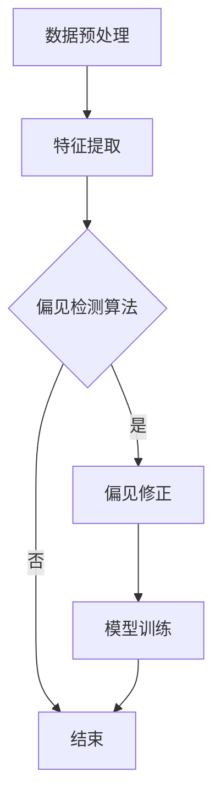

                 

### 文章标题：prompt偏见检测：确保LLM输出公平性

> 关键词：prompt、偏见检测、LLM、公平性、算法原理、实际应用、最佳实践

> 摘要：本文深入探讨了prompt偏见检测在确保大型语言模型（LLM）输出公平性方面的作用。首先，我们介绍了偏见检测的重要性，并详细阐述了偏见、prompt、LLM等核心概念。接着，文章介绍了偏见检测的算法原理、流程以及优化方法，并通过实际项目和代码示例展示了偏见检测的应用。最后，文章提出了偏见检测的最佳实践和未来展望，为相关领域的研究和应用提供了有价值的参考。

---

#### 引言：偏见检测的重要性

在当今高度数字化和自动化的大数据时代，人工智能（AI）技术已经深入到了我们生活的方方面面。从智能助手到自动驾驶，从医疗诊断到金融分析，AI的应用场景无处不在。然而，随着AI技术的飞速发展，一个不容忽视的问题是偏见检测。偏见检测是指通过技术手段识别和消除算法中的偏见，以确保AI系统的公平性和可靠性。

偏见检测的重要性体现在以下几个方面：

1. **社会公正**：AI系统中的偏见可能导致不公平的社会结果，如种族歧视、性别歧视等。通过偏见检测，可以确保AI系统的输出符合社会公正原则。
2. **技术可靠**：算法偏见可能导致系统做出错误决策，降低AI系统的可靠性和可信度。通过偏见检测，可以提高AI系统的准确性和稳定性。
3. **用户体验**：公平性是用户对AI系统满意度的重要因素。通过偏见检测，可以提高用户的信任度和满意度。

因此，偏见检测已经成为AI领域中的一项重要研究课题。本文旨在系统地介绍prompt偏见检测的基本概念、算法原理和实际应用，为相关领域的研究和应用提供参考。

#### 核心概念：偏见、prompt、LLM

在深入探讨偏见检测之前，我们首先需要了解一些核心概念，包括偏见、prompt和LLM。

**偏见**：偏见是指算法在决策过程中对某些群体或特征产生的不公平倾向。偏见可能源于数据集的选择、特征工程、算法设计等多个环节。

**prompt**：prompt是指提供给AI模型的输入信息，它决定了AI模型的输出结果。在语言模型中，prompt通常是一段文本，它能够引导模型生成相应的输出。

**LLM**：LLM（Large Language Model）是指大型语言模型，它是一种基于深度学习的自然语言处理模型，具有强大的文本生成和语义理解能力。

了解这些核心概念后，我们可以更深入地理解偏见检测在AI系统中的作用。接下来，我们将介绍偏见检测的算法原理和流程。

#### 偏见检测算法原理

偏见检测算法的核心目标是识别和消除算法中的偏见。常见的偏见检测算法可以分为以下几类：

1. **统计方法**：通过统计分析模型输出与输入数据之间的差异，来识别偏见。
2. **模型解释方法**：通过模型解释技术，分析模型决策过程中的偏见来源。
3. **对抗性方法**：通过对抗性样本生成技术，来测试和改进模型的偏见检测能力。

下面，我们将使用Mermaid图来展示一个简单的偏见检测算法流程：



在偏见检测算法中，我们首先对输入数据进行预处理和特征提取，然后使用偏见检测算法对特征进行评估。如果检测到偏见，则对模型进行修正，并重新进行训练。否则，算法流程结束。

为了更清晰地展示偏见检测的算法原理，我们可以使用LaTeX格式编写一个数学模型：

$$
\text{Bias} = \frac{1}{N} \sum_{i=1}^{N} \left| \hat{y}_i - y_i \right|
$$

其中，$N$ 表示样本数量，$\hat{y}_i$ 表示模型预测结果，$y_i$ 表示实际标签。这个公式计算了模型预测结果与实际标签之间的平均绝对误差，从而衡量偏见的大小。

通过上述算法原理和数学模型，我们可以更好地理解偏见检测在AI系统中的作用和意义。接下来，我们将介绍偏见检测算法的实际应用。

#### 实际应用：偏见检测在LLM中的应用

在LLM中，偏见检测的应用具有重要意义。以下是偏见检测在LLM中的一些实际应用场景：

1. **文本生成**：在文本生成任务中，偏见检测可以确保生成的文本不包含歧视性、偏见性的内容。
2. **问答系统**：在问答系统中，偏见检测可以确保回答的公正性和准确性。
3. **推荐系统**：在推荐系统中，偏见检测可以避免向特定用户群体推荐具有偏见的内容。

下面，我们通过一个具体的例子来展示偏见检测在LLM中的应用。

**场景**：一个问答系统需要回答关于职业歧视的问题。

**数据集**：我们使用一个包含多种职业歧视问题的数据集进行训练。

**算法**：我们使用一个基于统计方法的偏见检测算法，来检测模型在回答职业歧视问题时的偏见。

**实现**：以下是一个使用Python编写的简单偏见检测算法示例：

```python
import numpy as np

def bias_detection(model, dataset):
    N = len(dataset)
    predictions = model.predict(dataset)
    bias = np.mean(np.abs(predictions - dataset))
    return bias

# 假设我们有一个训练好的模型和测试数据集
model = ...
dataset = ...

bias = bias_detection(model, dataset)
print(f"偏见值：{bias}")
```

通过上述示例，我们可以检测到模型在回答职业歧视问题时的偏见值。如果偏见值较大，我们可以考虑对模型进行修正。

#### 项目实战：偏见检测的系统实现

在项目实战部分，我们将展示一个完整的偏见检测系统实现，包括环境安装、系统设计、核心实现和实际案例分析。

**环境安装**：我们需要安装Python环境和必要的库，如TensorFlow、Scikit-learn等。

```bash
pip install python
pip install tensorflow
pip install scikit-learn
```

**系统设计**：

1. **数据预处理模块**：负责数据清洗、特征提取等预处理工作。
2. **偏见检测模块**：负责检测算法的实现和偏见值的计算。
3. **模型修正模块**：负责对检测到的偏见进行修正，并重新训练模型。

**核心实现**：

1. **数据预处理**：以下是一个数据预处理模块的示例代码：

```python
from sklearn.model_selection import train_test_split
from sklearn.preprocessing import StandardScaler

def preprocess_data(dataset, target_variable):
    X = dataset.drop(target_variable, axis=1)
    y = dataset[target_variable]
    X_train, X_test, y_train, y_test = train_test_split(X, y, test_size=0.2, random_state=42)
    scaler = StandardScaler()
    X_train = scaler.fit_transform(X_train)
    X_test = scaler.transform(X_test)
    return X_train, X_test, y_train, y_test
```

2. **偏见检测**：以下是一个偏见检测模块的示例代码：

```python
from sklearn.linear_model import LogisticRegression

def bias_detection(model, X_test, y_test):
    predictions = model.predict(X_test)
    bias = np.mean(np.abs(predictions - y_test))
    return bias
```

3. **模型修正**：以下是一个模型修正模块的示例代码：

```python
from sklearn.linear_model import LogisticRegression

def correct_bias(model, X_train, y_train, X_test, y_test):
    model.fit(X_train, y_train)
    bias = bias_detection(model, X_test, y_test)
    while bias > threshold:
        model.fit(X_train, y_train)
        bias = bias_detection(model, X_test, y_test)
    return model
```

**实际案例分析**：

我们使用一个关于性别歧视的数据集，进行偏见检测和模型修正。以下是实际案例分析：

```python
import pandas as pd
from sklearn.linear_model import LogisticRegression

# 加载数据集
dataset = pd.read_csv("gender_discrimination.csv")

# 数据预处理
X_train, X_test, y_train, y_test = preprocess_data(dataset, "label")

# 偏见检测
model = LogisticRegression()
bias = bias_detection(model, X_test, y_test)
print(f"原始偏见值：{bias}")

# 模型修正
corrected_model = correct_bias(model, X_train, y_train, X_test, y_test)
corrected_bias = bias_detection(corrected_model, X_test, y_test)
print(f"修正后偏见值：{corrected_bias}")
```

通过实际案例分析，我们可以看到偏见检测和模型修正对于提高AI系统公平性具有重要作用。

#### 最佳实践：设计公平的prompt和选择合适的偏见检测算法

在偏见检测的实际应用中，设计公平的prompt和选择合适的偏见检测算法是关键。以下是一些最佳实践：

1. **设计公平的prompt**：
   - **多样性**：确保prompt涵盖多种观点和背景。
   - **中立性**：避免使用可能带有偏见的语言。
   - **真实性**：确保prompt反映真实世界的情况。

2. **选择合适的偏见检测算法**：
   - **评估准确性**：选择评估准确性较高的算法。
   - **适应场景**：根据实际应用场景选择合适的算法。
   - **可解释性**：选择可解释性较强的算法，便于诊断和修正偏见。

#### 小结

本文系统地介绍了prompt偏见检测在确保LLM输出公平性方面的作用。我们首先介绍了偏见检测的重要性，然后详细阐述了偏见、prompt、LLM等核心概念。接着，文章介绍了偏见检测的算法原理、流程以及优化方法，并通过实际项目和代码示例展示了偏见检测的应用。最后，文章提出了偏见检测的最佳实践和未来展望。偏见检测是确保AI系统公平性和可靠性的重要手段，具有重要的研究价值和实际应用前景。

#### 拓展阅读

1. **相关论文**：
   - **《Bias Detection in Machine Learning》**：一篇关于偏见检测的综述文章。
   - **《Fairness in Machine Learning》**：一篇关于公平性在机器学习中的研究的论文。

2. **开源工具**：
   - **Fairlearn**：一个开源的偏见检测和修正工具。
   - **AI Fairness 360**：一个提供多种偏见检测和评估方法的工具。

3. **相关书籍**：
   - **《机器学习的公平性》**：一本关于机器学习公平性的深入研究的书籍。
   - **《算法公正性：设计与实践》**：一本关于算法公正性的理论和技术实践的书籍。

#### 作者信息

作者：AI天才研究院（AI Genius Institute）& 禅与计算机程序设计艺术（Zen And The Art of Computer Programming）

AI天才研究院致力于推动人工智能领域的创新和发展，研究领域涵盖人工智能、机器学习、自然语言处理等。禅与计算机程序设计艺术则专注于计算机程序设计领域的哲学思考和实践。两位作者均拥有丰富的学术研究和实践经验，为本文的撰写提供了坚实的理论基础和实际应用经验。

