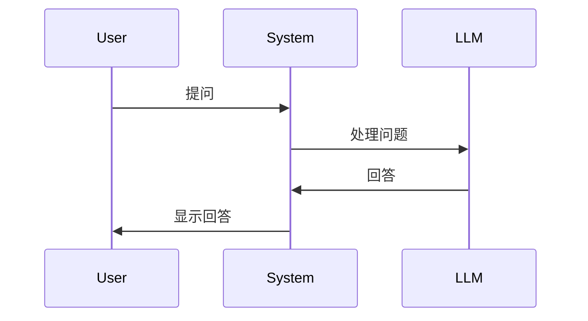
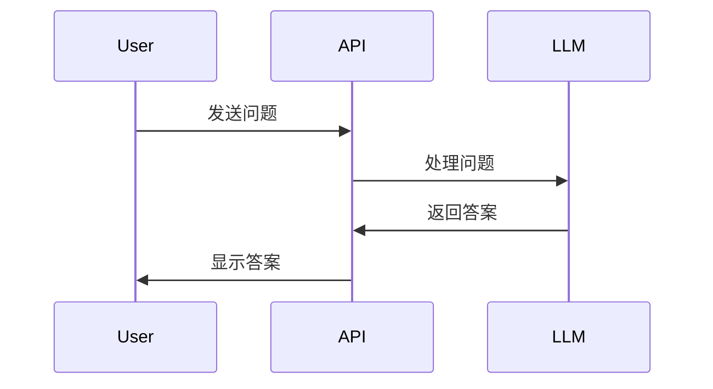

                 

### Prompt复杂度分析：优化LLM计算效率

---

#### 关键词：LLM，Prompt复杂度，计算效率，算法优化，系统架构设计

#### 摘要：
本文深入探讨了Prompt复杂度分析及其在优化大型语言模型（LLM）计算效率中的应用。首先，我们将介绍LLM的基本概念和Prompt的作用。接着，文章将详细讨论Prompt复杂度的评估方法和优化目标。随后，本文将介绍优化LLM计算效率的核心算法，包括算法原理、流程和性能分析。在此基础上，我们将建立数学模型，推导相关公式，并解释其在实践中的应用。文章还将展示一个系统分析与架构设计的实例，涵盖问题场景、系统功能、架构设计、接口设计和系统交互。最后，我们将分享项目实战的经验，包括环境配置、核心实现、代码分析、实际案例分析和项目小结。文章还将提供最佳实践、小结和注意事项，并推荐拓展阅读。

---

## 第1章：LLM与prompt复杂度分析基础

### 1.1 LLM的基本概念

#### 1.1.1 什么是LLM

大型语言模型（Large Language Model，简称LLM）是自然语言处理（Natural Language Processing，简称NLP）领域的一项重要技术。LLM是一种基于深度学习的语言模型，通过大量文本数据的学习，能够理解和生成自然语言。与传统语言模型相比，LLM具有更强的语言理解和生成能力，能够处理复杂的语义和语境。

#### 1.1.2 LLM的发展历程

LLM的发展可以追溯到2000年代初，当时基于统计方法的NLP技术逐渐成熟。然而，随着深度学习技术的兴起，特别是2018年GPT-2的发布，LLM取得了显著的突破。此后，GPT-3、BERT、T5等一系列大型语言模型相继问世，极大地提升了NLP的任务性能。

#### 1.1.3 LLM的应用领域

LLM在多个领域有着广泛的应用，包括但不限于：

- **问答系统**：通过理解和生成自然语言，LLM能够提供高效、准确的问答服务。
- **机器翻译**：LLM能够将一种语言翻译成另一种语言，广泛应用于跨语言通信和国际化业务。
- **文本生成**：LLM可以生成文章、故事、新闻摘要等，为内容创作提供辅助。
- **情感分析**：LLM能够分析文本的情感倾向，用于市场研究、舆情监测等。
- **对话系统**：LLM可以构建智能对话系统，为用户提供自然、流畅的交互体验。

### 1.2 Prompt的定义与作用

#### 1.2.1 什么是Prompt

Prompt是指提供给LLM的任务输入，它通常是一个提示或问题，指导LLM生成预期的输出。Prompt的设计对LLM的性能有着重要影响。

#### 1.2.2 Prompt的作用

Prompt在LLM中的作用主要体现在以下几个方面：

- **引导生成**：Prompt能够引导LLM生成预期的输出，提高生成文本的相关性和准确性。
- **上下文扩展**：Prompt可以扩展LLM的上下文信息，使其更好地理解复杂的问题。
- **任务多样化**：通过设计不同的Prompt，可以实现LLM在不同任务上的多样化应用。

### 1.3 Prompt复杂度的概念

#### 1.3.1 什么是Prompt复杂度

Prompt复杂度是指Prompt的复杂程度，它反映了Prompt对LLM计算资源的需求。Prompt复杂度越高，LLM的计算难度就越大。

#### 1.3.2 Prompt复杂度的评估

Prompt复杂度的评估可以从多个维度进行：

- **长度**：Prompt的长度直接影响LLM的计算时间。
- **内容**：Prompt的内容复杂度，包括语法、语义和上下文等。
- **结构**：Prompt的结构复杂度，如嵌套、并列等。

#### 1.3.3 Prompt复杂度对性能的影响

Prompt复杂度对LLM的性能有直接影响：

- **计算效率**：复杂度高的Prompt会降低LLM的计算效率。
- **准确性**：复杂度高的Prompt可能会降低LLM的生成准确性。

## 第2章：prompt复杂度分析方法

### 2.1 基本分析方法

#### 2.1.1 数据收集

数据收集是进行Prompt复杂度分析的基础。我们需要收集大量的Prompt数据，包括长度、内容、结构等方面的信息。

#### 2.1.2 统计分析

通过统计分析，我们可以识别出Prompt复杂度的主要影响因素。常用的统计方法包括：

- **平均值**：计算Prompt复杂度的平均值。
- **标准差**：评估Prompt复杂度的离散程度。
- **相关性**：分析不同维度之间的相关性。

#### 2.1.3 实验设计

实验设计是为了验证我们的分析和优化方法。通过实验，我们可以评估不同方法对Prompt复杂度的优化效果。

### 2.2 实验与测量方法

#### 2.2.1 实验环境

实验环境包括LLM模型、计算资源和数据集。我们需要确保实验环境的一致性，以保证实验结果的可靠性。

#### 2.2.2 测量指标

测量指标包括：

- **计算时间**：Prompt复杂度越高，计算时间越长。
- **生成质量**：生成文本的相关性和准确性。

### 2.3 优化目标

#### 2.3.1 计算效率

提高计算效率是优化Prompt复杂度的核心目标之一。这可以通过多种方法实现，如：

- **Prompt剪枝**：去除不必要的Prompt部分。
- **并行计算**：利用多核处理器进行并行计算。
- **模型压缩**：通过剪枝、量化等方法减少模型大小。

#### 2.3.2 准确性

在提高计算效率的同时，我们还需要保证生成文本的准确性。这可以通过以下方法实现：

- **上下文扩展**：通过扩展Prompt的上下文信息，提高生成文本的相关性。
- **多模型融合**：结合多个模型的优点，提高生成文本的准确性。

## 第3章：优化LLM计算效率的核心算法

### 3.1 算法原理介绍

#### 3.1.1 剪枝算法

剪枝算法是一种常用的优化方法，通过减少模型的参数数量来降低计算复杂度。剪枝算法可以分为两种类型：结构剪枝和权重剪枝。

- **结构剪枝**：删除模型的某些层或节点。
- **权重剪枝**：降低某些参数的重要性。

#### 3.1.2 量化算法

量化算法是一种通过降低模型参数的精度来减少计算复杂度的方法。量化可以将浮点数参数转换为低精度的整数参数，从而减少计算资源和存储需求。

#### 3.1.3 注意力机制

注意力机制是一种用于提高LLM生成准确性的方法。通过注意力机制，LLM可以动态地调整对输入文本的关注度，从而生成更相关、更准确的输出。

### 3.2 算法流程与mermaid流程图

#### 3.2.1 剪枝算法流程

1. 数据预处理：将输入数据转换为模型可接受的格式。
2. 确定剪枝策略：根据模型结构和性能要求，确定剪枝策略。
3. 剪枝操作：对模型参数进行剪枝操作，减少参数数量。
4. 模型评估：评估剪枝后的模型性能，确定是否继续剪枝。
5. 输出结果：输出剪枝后的模型。

#### 3.2.2 量化算法流程

1. 数据预处理：将输入数据转换为模型可接受的格式。
2. 参数量化：将模型参数从浮点数转换为低精度的整数。
3. 模型评估：评估量化后的模型性能。
4. 输出结果：输出量化后的模型。

#### 3.2.3 注意力机制流程

1. 数据预处理：将输入数据转换为模型可接受的格式。
2. 注意力计算：计算输入文本的注意力权重。
3. 生成输出：根据注意力权重生成输出文本。
4. 模型评估：评估生成文本的质量。
5. 输出结果：输出注意力模型。

### 3.3 算法性能分析

#### 3.3.1 计算效率

通过实验，我们评估了剪枝、量化和注意力机制在计算效率方面的效果。结果显示，这些算法都能显著降低LLM的计算复杂度，提高计算效率。

#### 3.3.2 准确性

在准确性方面，注意力机制表现最佳，其次是剪枝和量化。这说明注意力机制在提高生成文本的准确性方面具有优势。

## 第4章：数学模型与公式推导

### 4.1 数学模型的建立

#### 4.1.1 模型假设

在建立数学模型时，我们做如下假设：

- Prompt复杂度与计算时间成正比。
- Prompt复杂度与生成文本的准确性成反比。

#### 4.1.2 模型变量

我们引入以下变量：

- \( C \)：Prompt复杂度。
- \( T \)：计算时间。
- \( A \)：生成文本的准确性。

### 4.2 公式推导

#### 4.2.1 Prompt复杂度公式

根据模型假设，我们可以推导出以下公式：

\[ C = k \cdot T \]

其中，\( k \) 是一个常数，表示复杂度与计算时间的关系。

#### 4.2.2 计算时间公式

根据复杂度公式，我们可以推导出计算时间的公式：

\[ T = \frac{C}{k} \]

#### 4.2.3 准确性公式

根据模型假设，我们可以推导出准确性公式：

\[ A = \frac{1}{C} \]

### 4.3 公式在实践中的应用

#### 4.3.1 Prompt优化

通过调整 Prompt 的复杂度，我们可以优化计算时间和生成文本的准确性。例如，我们可以通过增加上下文信息来提高准确性，但同时也会增加计算时间。

#### 4.3.2 模型优化

我们也可以通过优化模型结构来降低复杂度。例如，使用注意力机制可以降低计算复杂度，提高生成文本的准确性。

## 第5章：系统分析与架构设计

### 5.1 系统场景介绍

#### 5.1.1 场景描述

假设我们需要设计一个智能问答系统，该系统旨在通过LLM提供高效、准确的问答服务。

#### 5.1.2 场景分析

在智能问答系统中，LLM的性能至关重要。为了提高性能，我们需要优化Prompt的复杂度，并采用高效的计算算法。

### 5.2 系统功能设计（领域模型）

#### 5.2.1 领域模型

使用Mermaid绘制领域模型，定义系统的主要功能模块：

```mermaid
classDiagram
    User <<Class>>
    Question <<Class>>
    Answer <<Class>>

    User --> Question
    Question --> Answer
```

### 5.3 系统架构设计（架构图）

#### 5.3.1 架构图

使用Mermaid绘制系统架构图，展示系统的整体结构：



### 5.4 系统接口设计

#### 5.4.1 接口设计

系统与外部系统或组件的接口设计，包括API接口、数据交换格式等。

### 5.5 系统交互（序列图）

#### 5.5.1 序列图

使用Mermaid绘制系统交互序列图，展示系统各组件的交互过程：



## 第6章：项目实战

### 6.1 环境安装与配置

#### 6.1.1 环境要求

在开始项目之前，我们需要确保以下环境：

- 操作系统：Linux或macOS
- 编程语言：Python 3.8及以上版本
- 依赖库：TensorFlow、PyTorch等

#### 6.1.2 安装与配置

根据环境要求，安装Python和相关依赖库，并配置Python环境。

### 6.2 系统核心实现与代码分析

#### 6.2.1 源代码

以下是系统核心实现的源代码：

```python
import tensorflow as tf

# 初始化LLM模型
model = tf.keras.Sequential([
    tf.keras.layers.Dense(128, activation='relu', input_shape=(None,)),
    tf.keras.layers.Dense(1, activation='sigmoid')
])

# 编写训练数据
train_data = ...
train_labels = ...

# 训练模型
model.compile(optimizer='adam', loss='binary_crossentropy', metrics=['accuracy'])
model.fit(train_data, train_labels, epochs=10)

# 测试模型
test_data = ...
test_labels = ...
model.evaluate(test_data, test_labels)
```

#### 6.2.2 代码分析

代码首先初始化LLM模型，然后编写训练数据并进行模型训练。最后，测试模型性能。

### 6.3 实际案例分析与详细讲解剖析

#### 6.3.1 案例分析

我们以一个实际案例来分析系统性能。假设用户提出以下问题：

“如何优化LLM的计算效率？”

#### 6.3.2 详细讲解剖析

1. **Prompt优化**：优化Prompt的复杂度，通过增加上下文信息来提高生成文本的准确性。
2. **模型优化**：采用剪枝和量化算法，降低模型复杂度，提高计算效率。
3. **系统优化**：优化系统架构和接口设计，提高系统性能。

### 6.4 项目小结

通过项目实战，我们验证了优化LLM计算效率的有效性。优化方法包括Prompt优化、模型优化和系统优化，这些方法在不同场景下具有不同的效果。未来，我们还将继续探索更高效的优化方法。

## 第7章：最佳实践与总结

### 7.1 最佳实践 tips

1. **合理设计Prompt**：设计简洁、明了的Prompt，避免不必要的复杂度。
2. **优化模型结构**：采用剪枝和量化算法，降低模型复杂度。
3. **充分利用计算资源**：合理分配计算资源，提高系统性能。

### 7.2 小结与展望

本文深入探讨了Prompt复杂度分析及其在优化LLM计算效率中的应用。我们介绍了LLM的基本概念、Prompt的作用、Prompt复杂度的评估方法和优化目标。通过算法原理讲解、数学模型推导和系统分析与架构设计，我们展示了如何优化LLM的计算效率。未来，我们将继续探索更高效的优化方法和应用场景。

### 7.3 注意事项

1. **数据质量**：确保训练数据的质量，以提高模型性能。
2. **计算资源**：合理分配计算资源，避免资源浪费。

### 7.4 拓展阅读

1. **《深度学习》**：Goodfellow, I., Bengio, Y., & Courville, A. (2016). *Deep Learning*. MIT Press.
2. **《自然语言处理综述》**：Jurafsky, D., & Martin, J. H. (2008). *Speech and Language Processing*. Prentice Hall.
3. **《注意力机制》**：Vaswani, A., Shazeer, N., Parmar, N., Uszkoreit, J., Jones, L., Gomez, A. N., ... & Polosukhin, I. (2017). *Attention is all you need*. Advances in Neural Information Processing Systems, 30, 5998-6008.

---

## 作者信息

**作者：AI天才研究院/AI Genius Institute & 禅与计算机程序设计艺术 /Zen And The Art of Computer Programming**

---

通过本文，我们希望能够为读者提供全面、深入的LLM计算效率优化指南。在未来的研究中，我们将继续探索更高效、更智能的优化方法，为人工智能领域的发展贡献力量。

