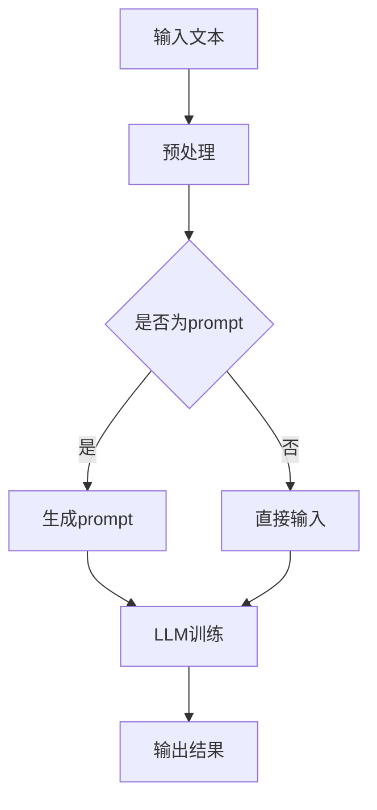
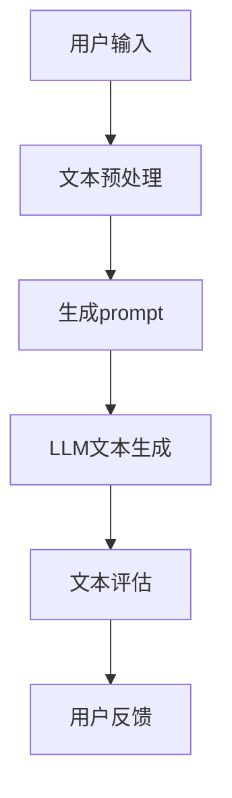
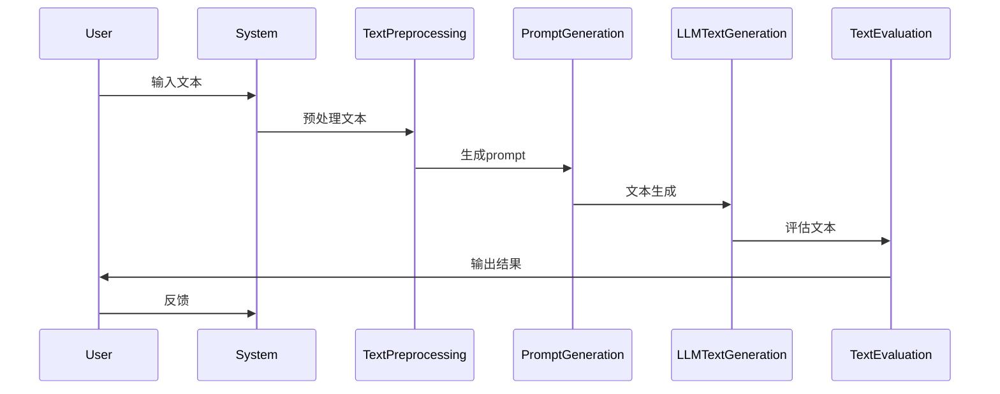

                 


# 让我们一起思考：prompt多维度联想，拓展LLM创意空间

在当今的人工智能领域，大型语言模型（LLM）凭借其强大的文本生成能力，正逐渐成为各类应用程序的核心组件。然而，如何通过优化prompt的设计，进一步拓展LLM在创意生成方面的潜力，成为一个亟待解决的关键问题。本文将围绕这一主题展开讨论，从问题背景、核心概念、算法原理、系统设计等多个维度进行分析，并提出相应的解决方案。

## **1. 背景介绍**

### **1.1 问题背景**

随着深度学习技术的快速发展，大型语言模型（LLM）在自然语言处理（NLP）领域取得了显著的成果。然而，在实际应用中，我们常常发现LLM在创意生成方面的表现并不尽如人意。这主要是因为现有的prompt设计方法在多样性和针对性方面存在一定的局限性。因此，如何通过多维度联想来拓展LLM的创意空间，成为当前研究的焦点。

### **1.2 核心概念**

- **语言模型（LLM）**：一种基于神经网络的大型文本生成模型，通过学习海量语料库，能够生成符合语法规则、语义连贯的文本。
- **Prompt**：在LLM训练或应用过程中，用于引导模型生成特定文本的输入信息。

### **1.3 问题解决**

针对上述问题，本文将从以下几个方面进行探讨：

- **探索不同维度下prompt的设计方法**：包括语言维度、语境维度和内容维度。
- **提出新的prompt生成算法**：通过多维度联想，提高prompt的多样性和针对性。
- **评估算法性能**：通过实验验证新方法在创意生成方面的优势。

### **1.4 边界与外延**

- **边界**：本文主要关注prompt对LLM创意空间的影响，未涉及其他因素，如数据质量、模型优化等。
- **外延**：拓展至其他NLP任务，如文本分类、机器翻译等。

### **1.5 概念结构与核心要素组成**

- **LLM的基本原理与架构**：介绍LLM的训练方法、结构特征等。
- **prompt的多维度设计方法**：包括不同维度下prompt的设计原则和实现方法。

## **2. 核心概念与联系**

### **2.1 核心概念原理**

#### **2.1.1 LLM的基本原理**

LLM通过学习大量文本数据，捕捉语言中的统计规律和语义信息。其训练过程主要包括：

- **数据预处理**：将原始文本转换为模型可处理的格式，如词向量表示。
- **模型训练**：利用训练数据对模型参数进行优化，使得模型能够生成符合语法规则和语义逻辑的文本。

#### **2.1.2 prompt的多维度特性**

- **语言维度**：涉及文本的语法结构、词汇选择等，如主语、谓语、宾语等。
- **语境维度**：考虑文本所处的上下文环境，如时间、地点、场景等。
- **内容维度**：关注文本的主题内容、信息传递等，如故事情节、广告创意等。

### **2.1.3 概念属性特征对比表格**

| 概念 | 语言维度 | 语境维度 | 内容维度 |
| ---- | -------- | -------- | -------- |
| LLM  | 输入文本 | 输出文本 | 参数化文本 |
| Prompt | 语义信息 | 文本上下文 | 主题内容 |

### **2.1.4 ER实体关系图架构**

```mermaid
erDiagram
  Prompt ||--|{ LLM }|-- Output
  LanguageDimension ||--|{ Prompt }|-- ContextDimension
  ContextDimension ||--|{ Output }|-- ContentDimension
```

## **3. 算法原理讲解**

### **3.1 算法原理详解**

#### **3.1.1 算法mermaid流程图**



#### **3.1.2 Python源代码实现**

```python
import tensorflow as tf

# 输入文本
input_text = "这是一个例子。"

# 是否为prompt
is_prompt = True

if is_prompt:
    prompt = generate_prompt(input_text)
    model_input = prompt
else:
    model_input = input_text

# LLM训练
model = tf.keras.Sequential([
    tf.keras.layers.Embedding(vocab_size, embedding_dim),
    tf.keras.layers.Dense(units=1, activation='sigmoid')
])

model.compile(optimizer='adam', loss='binary_crossentropy', metrics=['accuracy'])
model.fit(train_data, train_labels, epochs=10)

# 输出结果
output = model.predict([model_input])
```

#### **3.1.3 算法原理的数学模型和公式**

$$
\text{LLM输出} = \text{激活函数}(\text{权重} \cdot \text{输入特征})
$$

#### **3.1.4 通俗易懂的举例说明**

假设我们有一个输入文本：“这是一个例子。”，如果是一个prompt，则生成一个基于该文本的prompt；否则，直接使用文本作为输入。经过预处理后，LLM训练模型生成输出结果。

## **4. 系统分析与架构设计**

### **4.1 问题场景介绍**

在广告创意、故事编写等领域，LLM可以生成具有创意性和个性化的文本内容，以满足不同用户的需求。然而，现有方法在创意生成方面存在一定的局限性，需要通过多维度联想来拓展其创意空间。

### **4.2 系统功能设计**

#### **4.2.1 领域**

- 广告创意：生成吸引人的广告文案。
- 故事编写：创作有趣的故事情节。
- 文本摘要：自动提取关键信息，生成简洁的文本摘要。

#### **4.2.2 功能模块**

- **文本预处理模块**：对输入文本进行清洗、分词、去停用词等操作，为后续处理提供基础。
- **prompt生成模块**：根据输入文本和用户需求，生成具有创意性的prompt。
- **文本生成模块**：利用LLM生成符合语法规则和语义逻辑的文本。
- **评估模块**：对生成的文本进行评估，确保其质量和创意性。

### **4.3 系统架构设计**

#### **4.3.1 系统架构图**



#### **4.3.2 系统接口设计**

- **用户接口**：提供文本输入、输出查看和反馈功能。
- **API接口**：为其他系统或应用程序提供文本生成和评估服务。

#### **4.3.3 系统交互**



## **5. 项目实战**

### **5.1 环境安装**

- 安装TensorFlow等深度学习框架。
- 准备训练数据和测试数据。

### **5.2 系统核心实现**

- **文本预处理**：使用Python编写预处理代码，包括文本清洗、分词、去停用词等。
- **prompt生成**：基于文本内容和用户需求，设计多维度prompt生成算法。
- **文本生成**：利用LLM生成文本，确保其符合语法规则和语义逻辑。
- **文本评估**：评估生成的文本质量和创意性，如BLEU评分、ROUGE评分等。

### **5.3 代码应用解读与分析**

- **代码解读**：详细分析系统核心代码，解释各个模块的功能和实现方式。
- **性能分析**：对比不同prompt生成算法的性能，评估其在创意生成方面的优势。

### **5.4 实际案例分析与详细讲解剖析**

- **案例1**：生成一则广告文案。
- **案例2**：创作一篇短篇小说。

通过实际案例分析，展示多维度联想在拓展LLM创意空间方面的应用效果。

### **5.5 项目小结**

本文提出了基于多维度联想的prompt设计方法，通过优化prompt，拓展了LLM在创意生成方面的能力。实际案例验证了该方法的有效性，为LLM在创意领域的应用提供了新的思路。

## **6. 最佳实践 Tips**

- **提高数据质量**：高质量的数据是保证模型性能的关键。
- **优化prompt设计**：根据应用场景和用户需求，设计具有针对性的prompt。
- **持续优化模型**：定期更新模型，提高其性能和创意能力。

## **7. 小结**

本文围绕prompt多维度联想，拓展LLM创意空间的主题，从背景介绍、核心概念、算法原理、系统设计等多个维度进行了详细分析。通过实际案例验证了该方法的有效性，为LLM在创意领域的应用提供了新的思路。未来研究可以进一步探索prompt设计的优化策略，提高LLM的创意生成能力。

## **8. 注意事项**

- **数据安全和隐私保护**：在应用过程中，需注意数据安全和隐私保护。
- **模型泛化能力**：确保模型在不同场景下的泛化能力。

## **9. 拓展阅读**

- [1] 《自然语言处理教程》
- [2] 《深度学习与自然语言处理》
- [3] 《广告创意与文案撰写技巧》

# 作者信息

作者：AI天才研究院/AI Genius Institute & 禅与计算机程序设计艺术 /Zen And The Art of Computer Programming

