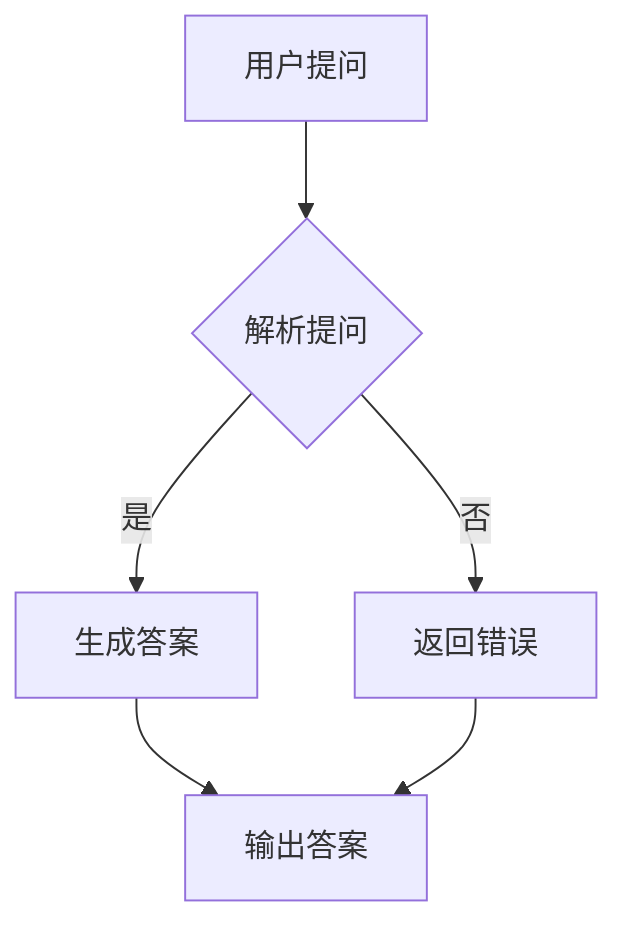

                 

### 引言

《prompt工程的系统化方法与实践》这本书旨在为读者提供一个全面而深入的指南，帮助理解和应用prompt工程这一关键领域。prompt工程是人工智能（AI）领域中一个相对较新的概念，但它已经在众多应用场景中展现出巨大的潜力。从自然语言处理到机器学习，prompt工程作为桥梁，将人类意图与机器处理能力无缝连接，极大地提升了系统的智能性和效率。

随着人工智能技术的飞速发展，prompt工程的重要性日益凸显。有效的prompt设计不仅能够显著提升模型的性能，还能降低错误率和提高系统的可靠性。因此，掌握prompt工程的系统化方法与实践，对广大AI从业者来说，无疑是一项宝贵的技能。

本书的目标是：

1. **系统化方法**：介绍一套完整的prompt工程方法论，包括概念、原理、工具和最佳实践。
2. **实践指导**：通过丰富的案例分析和实战项目，帮助读者将理论知识应用到实际项目中。
3. **深入理解**：不仅停留在表面应用，更从理论深度上剖析prompt工程的本质和核心原理。

为了让读者能够全面掌握prompt工程，本书将按照以下结构进行展开：

- **引言**：介绍prompt工程的概念、重要性以及本书的结构和目标。
- **基础理论**：详细讲解prompt工程的基本原理、数学模型、算法原理以及mermaid流程图的使用。
- **应用实践**：通过实际案例，展示如何设计和实现一个prompt工程系统，包括系统设计、算法应用和代码解读。
- **最佳实践**：总结成功案例和失败教训，提炼最佳实践和改进建议。
- **未来发展趋势**：分析prompt工程在人工智能行业中的未来趋势和技术发展方向。
- **工具与资源**：介绍常用的prompt工程工具和资源，帮助读者进一步探索和学习。

通过这本书，读者将能够系统地了解prompt工程的各个方面，掌握从理论到实践的全方位技能，为未来的AI项目提供强有力的支持。让我们一起探索prompt工程的奇妙世界，开启智能时代的全新篇章。

### 第1章: 《prompt工程的系统化方法与实践》概述

#### 1.1 问题背景

##### 1.1.1 人工智能与prompt工程概述

人工智能（AI）作为计算机科学的一个重要分支，通过模拟人类智能行为，实现机器自动执行复杂任务。随着深度学习、自然语言处理等技术的不断发展，AI在各个领域中的应用越来越广泛。然而，尽管AI模型在处理大量数据、识别模式方面表现出色，但它们通常需要大量的数据准备和复杂的调参过程，而且缺乏灵活性。这就引出了prompt工程的概念。

prompt工程是指通过设计有效的prompt（输入提示），来指导AI模型执行特定任务的一种方法。prompt作为一种引导，能够将人类意图明确地传递给AI系统，使得模型在特定场景下表现出更高的智能和适应性。

在AI发展的早期阶段，模型主要依赖于大量的预训练数据和复杂的模型结构。然而，随着prompt工程的出现，研究者们开始探索如何通过简化的输入提示，来提升模型的性能和效率。prompt工程不仅降低了AI系统的门槛，还使得AI系统更加灵活和适应不同场景的需求。

##### 1.1.2 prompt工程的重要性与应用场景

prompt工程的重要性在于其能够显著提升AI系统的智能性和实用性。通过合理设计的prompt，模型可以更准确地理解用户的意图，从而提供更加精准的答案或执行特定的任务。以下是一些典型的应用场景：

1. **自然语言处理（NLP）**：在NLP领域中，prompt工程可以用来改进问答系统、翻译服务和文本生成等应用。例如，通过设计合适的prompt，问答系统能够更好地理解用户的提问，提供更加准确的答案。
   
2. **推荐系统**：在推荐系统中，prompt工程可以帮助系统更好地理解用户的偏好和需求，从而提供更加个性化的推荐结果。通过prompt，系统可以获取用户的反馈，并动态调整推荐策略。

3. **图像识别与处理**：在图像识别和图像处理中，prompt工程可以用来指导模型识别特定类型的图像或执行特定的图像处理任务。例如，通过设计合适的prompt，模型可以更准确地识别医疗图像中的病变区域。

4. **自动化任务执行**：在自动化任务执行中，prompt工程可以帮助模型理解用户的任务要求，并在多种环境下执行复杂的任务。例如，在智能客服系统中，prompt工程可以指导模型理解用户的问题，并生成适当的回复。

##### 1.1.3 目前存在的问题与挑战

尽管prompt工程具有巨大的潜力，但在实际应用中仍面临着一些挑战和问题：

1. **复杂性**：prompt工程的设计和实现过程复杂，需要深入理解AI模型的工作原理以及应用场景的具体需求。

2. **灵活性**：如何设计出能够适应不同场景和任务的通用prompt，是一个重要的挑战。不同的应用场景往往需要不同类型的prompt，这使得prompt工程需要具备高度的灵活性。

3. **性能与准确性**：如何通过prompt设计来提升AI模型在特定任务中的性能和准确性，是一个关键问题。虽然prompt工程已经取得了一些进展，但在某些情况下，模型的性能提升仍然有限。

4. **可解释性**：prompt工程在提高AI系统智能性的同时，也带来了可解释性的挑战。如何确保AI系统的决策过程透明和可解释，是一个需要深入研究的方向。

5. **资源需求**：prompt工程通常需要大量的计算资源和数据支持，这在某些场景下可能是一个限制因素。

#### 1.2 核心概念

##### 1.2.1 Prompt工程的定义

prompt工程（Prompt Engineering）是指通过设计、优化和调整输入提示（prompt），来指导AI模型执行特定任务的一门技术。prompt可以看作是AI模型与人类用户之间的桥梁，它能够将人类的意图和需求明确地传递给AI系统，从而提高系统的智能性和适应性。

在prompt工程中，prompt的设计和实现是一个关键环节。一个有效的prompt需要具备以下特点：

1. **明确性**：prompt需要明确地传达用户的意图，确保AI模型能够准确理解和执行任务。

2. **适应性**：prompt需要能够适应不同的应用场景和任务需求，具有一定的灵活性和扩展性。

3. **简洁性**：prompt应该简洁明了，避免冗余和复杂，以提高模型的学习效率和性能。

4. **可解释性**：prompt的设计应该能够使AI模型的决策过程透明和可解释，方便用户理解模型的运作机制。

##### 1.2.2 Prompt工程的核心概念与联系

prompt工程涉及多个核心概念，这些概念相互联系，共同构成了prompt工程的理论基础。以下是一些关键概念及其联系：

1. **自然语言处理（NLP）**：NLP是prompt工程的重要基础，它涉及文本的预处理、语言理解和生成等任务。NLP技术能够帮助设计出更加自然和有效的prompt。

2. **深度学习**：深度学习是AI模型的核心技术，它通过多层神经网络来学习和模拟复杂的函数关系。prompt工程中，深度学习模型被广泛应用于处理和生成prompt。

3. **机器学习**：机器学习为prompt工程提供了强大的算法支持，通过训练和优化模型，可以使prompt工程更加高效和准确。

4. **强化学习**：强化学习是一种通过试错和反馈来学习决策策略的机器学习方法。在prompt工程中，强化学习可以用来优化prompt的设计和调整。

5. **数据分析**：数据分析技术能够帮助收集、处理和分析大量的数据，为prompt工程提供丰富的数据支持。

##### 1.2.3 Prompt工程与传统工程方法的区别

prompt工程与传统工程方法存在显著的区别，主要体现在以下几个方面：

1. **任务导向性**：传统工程方法通常基于特定的任务需求，设计出相应的解决方案。而prompt工程则更注重通过设计有效的输入提示，来指导AI模型执行任务，具有更强的灵活性。

2. **模型依赖性**：传统工程方法通常不依赖于复杂的模型，而prompt工程则高度依赖AI模型，通过优化prompt来提升模型的性能和准确性。

3. **可解释性**：传统工程方法通常难以提供模型决策的透明性，而prompt工程则强调prompt的设计和优化，以使模型的决策过程更加透明和可解释。

4. **数据驱动性**：传统工程方法更多依赖于经验和设计原则，而prompt工程则更加数据驱动，通过大量的实验和数据分析来优化prompt设计。

#### 1.3 本书结构

##### 1.3.1 全书内容结构概述

本书分为五个主要部分，每个部分都围绕prompt工程的不同方面展开：

1. **引言**：介绍prompt工程的基本概念、重要性及其应用场景，为后续内容奠定基础。
   
2. **基础理论**：详细讲解prompt工程的基本原理、数学模型、算法原理以及mermaid流程图的使用。

3. **应用实践**：通过实际案例，展示如何设计和实现prompt工程系统，包括系统设计、算法应用和代码解读。

4. **最佳实践**：总结成功案例和失败教训，提炼最佳实践和改进建议。

5. **未来发展趋势**：分析prompt工程在人工智能行业中的未来趋势和技术发展方向。

##### 1.3.2 各章节主要内容和目标读者

以下是本书各章节的主要内容和目标读者：

- **第1章**：引言，介绍prompt工程的基本概念和重要性，适合所有对AI和prompt工程感兴趣的读者。
- **第2章**：基础理论，讲解prompt工程的基本原理、数学模型和算法原理，适合有一定AI基础的读者。
- **第3章**：应用实践，通过案例展示如何设计和实现prompt工程系统，适合希望将理论知识应用于实践的读者。
- **第4章**：最佳实践，总结成功案例和失败教训，提炼最佳实践和改进建议，适合希望提高项目成功率的读者。
- **第5章**：未来发展趋势，分析prompt工程在人工智能行业中的未来趋势和技术发展方向，适合对技术趋势感兴趣的读者。
- **第6章**：工具与资源，介绍常用的prompt工程工具和资源，适合希望进一步学习和探索prompt工程的读者。

##### 1.4 目标读者

本书的目标读者主要包括以下几类：

1. **AI研究者**：对AI理论和实践感兴趣，希望深入了解prompt工程的研究者。
2. **软件开发工程师**：负责开发AI应用系统的工程师，希望通过学习prompt工程提高系统的智能性和效率。
3. **数据科学家**：从事数据分析与机器学习工作的专业人士，希望掌握prompt工程的相关技能。
4. **项目经理**：负责AI项目管理和实施的项目经理，希望通过本书提高项目成功率。
5. **学生和学者**：对AI和计算机科学有浓厚兴趣的学生和学者，希望系统地学习prompt工程的理论和实践。

##### 1.4.2 预期学习效果

通过阅读本书，读者将能够：

1. **掌握prompt工程的基本原理和方法**：理解prompt工程的核心概念、数学模型和算法原理。
2. **设计有效的prompt**：学会如何设计和优化prompt，以提高AI系统的智能性和适应性。
3. **实现prompt工程系统**：通过实际案例，了解如何设计和实现prompt工程系统，包括系统设计、算法应用和代码解读。
4. **提高项目成功率**：通过总结最佳实践，学会如何在项目中成功应用prompt工程，提高项目的成功率和效率。

##### 1.5 小结

本章首先介绍了prompt工程的基本概念和重要性，包括其定义、核心概念与联系，以及与传统工程方法的区别。接着，本书的结构和预期学习效果也得到了详细阐述。通过本章的介绍，读者可以对prompt工程有一个初步的了解，并为后续章节的学习奠定基础。

在接下来的章节中，我们将深入探讨prompt工程的基础理论，通过详细讲解基本原理、数学模型和算法原理，帮助读者全面掌握这一领域。同时，通过实际案例和应用实践，读者将能够将理论知识应用到实际项目中，进一步提升自己的实践能力。

### 第2章: prompt工程的基本原理

#### 2.1 概念与联系

##### 2.1.1 Prompt的类型与分类

在prompt工程中，prompt可以分为多种类型，每种类型都有其特定的用途和特点。以下是几种常见的prompt类型：

1. **文本类型**：文本类型是最常见的prompt类型，它通过自然语言文本向模型传达用户的意图和需求。例如，在一个问答系统中，用户的提问就是一个文本类型的prompt。

2. **图像类型**：图像类型prompt用于向模型传递视觉信息。例如，在图像识别任务中，输入的图像就是一个图像类型的prompt。

3. **音频类型**：音频类型prompt用于传递音频信号，常用于语音识别和音频处理任务。

4. **结构化数据类型**：结构化数据类型prompt包括表格、数据库记录等，它们能够提供详细和准确的数据信息，常用于数据分析和推荐系统。

5. **混合类型**：混合类型prompt结合了多种类型的prompt，能够提供更丰富的信息。例如，在一个视频分析任务中，模型可能会同时接收视频帧和音频信号作为prompt。

不同类型的prompt适用于不同的应用场景，合理选择和使用prompt对于提升模型性能至关重要。

##### 2.1.2 Prompt设计的原则与方法

有效的prompt设计是prompt工程的核心，以下是一些关键原则和方法：

1. **明确性**：prompt需要明确传达用户的意图，避免歧义和模糊性。例如，一个明确的文本prompt应该清楚地说明用户希望解决的问题。

2. **简洁性**：简洁的prompt能够提高模型的学习效率，避免冗余和复杂的信息。例如，一个简洁的图像prompt应该只包含与任务相关的关键信息。

3. **适应性**：prompt需要具备适应性，能够根据不同的应用场景和用户需求进行调整。例如，在不同语言环境下，prompt的翻译需要保持语义的一致性。

4. **多样性**：多样性能够提高模型的泛化能力，避免模型对特定类型的prompt产生过拟合。例如，通过设计多种不同类型的prompt，可以增强模型对不同任务场景的适应能力。

5. **可解释性**：可解释的prompt设计能够使模型的决策过程透明，便于用户理解。例如，通过可视化技术，可以将复杂的prompt转换为直观的图形表示。

##### 2.1.3 Prompt工程与其他人工智能技术的联系

prompt工程与其他人工智能技术紧密相连，共同构成了一个完整的智能系统。以下是一些主要联系：

1. **自然语言处理（NLP）**：NLP是prompt工程的重要基础，通过文本预处理、语言理解和生成等技术，NLP能够帮助设计出更加自然和有效的prompt。

2. **深度学习**：深度学习是AI模型的核心技术，通过多层神经网络，深度学习模型能够学习和模拟复杂的函数关系，是prompt工程的核心应用技术。

3. **机器学习**：机器学习为prompt工程提供了算法支持，通过训练和优化模型，可以使prompt工程更加高效和准确。

4. **强化学习**：强化学习通过试错和反馈，优化模型的行为和策略，为prompt工程提供了一种新的优化方法。

5. **数据分析**：数据分析技术能够帮助收集、处理和分析大量数据，为prompt工程提供丰富的数据支持。

#### 2.2 数学模型与公式

##### 2.2.1 常用数学模型介绍

在prompt工程中，常用的数学模型包括：

1. **神经网络**：神经网络（Neural Network）是深度学习的基础，通过多层神经元结构，神经网络能够学习和模拟复杂的非线性关系。

2. **循环神经网络（RNN）**：RNN能够处理序列数据，通过记忆机制，RNN能够捕捉到序列中的长期依赖关系。

3. **长短时记忆网络（LSTM）**：LSTM是RNN的一种改进，通过引入门控机制，LSTM能够更好地处理长序列数据。

4. **卷积神经网络（CNN）**：CNN是图像识别和处理的核心技术，通过卷积操作和池化操作，CNN能够有效地提取图像中的特征。

5. **生成对抗网络（GAN）**：GAN通过生成器和判别器的对抗训练，能够生成高质量的图像和音频。

##### 2.2.2 相关公式推导与应用

以下是几个关键公式的推导与应用：

1. **神经网络激活函数**：
   $$ f(x) = \sigma(z) = \frac{1}{1 + e^{-z}} $$
   其中，$\sigma$表示Sigmoid函数，$z$为神经元的输入。

   应用场景：Sigmoid函数常用于二分类问题，将神经元的输出映射到0到1之间。

2. **损失函数**：
   $$ L(\theta) = -\frac{1}{m}\sum_{i=1}^{m} y_i \log(a(x_i; \theta)) + (1 - y_i) \log(1 - a(x_i; \theta)) $$
   其中，$L$为损失函数，$y_i$为真实标签，$a(x_i; \theta)$为神经元的输出。

   应用场景：损失函数用于衡量模型预测与真实标签之间的差异，常用于训练神经网络。

3. **反向传播算法**：
   $$ \Delta W_{ij}^{(l)} = \frac{\partial L}{\partial W_{ij}^{(l)}} = \frac{\partial L}{\partial a^{(l)}_{j}} \frac{\partial a^{(l)}_{j}}{\partial z^{(l+1)}_{j}} \frac{\partial z^{(l+1)}_{j}}{\partial W_{ij}^{(l+1)}} $$
   其中，$\Delta W_{ij}^{(l)}$为权重梯度的更新，$l$为层号。

   应用场景：反向传播算法用于计算模型参数的梯度，是训练神经网络的核心算法。

##### 2.2.3 数学模型在prompt工程中的应用

数学模型在prompt工程中的应用至关重要，以下是一些典型应用场景：

1. **文本分类**：
   使用神经网络模型对文本进行分类，通过设计合适的prompt，模型能够准确识别文本的类别。例如，使用CNN提取文本特征，再通过全连接层进行分类。

2. **情感分析**：
   通过LSTM模型处理文本序列，捕捉文本中的情感信息。设计适当的prompt，模型能够准确判断文本的情感倾向。

3. **图像识别**：
   使用CNN模型处理图像数据，通过设计合适的prompt，模型能够识别图像中的物体和场景。例如，通过卷积层提取图像特征，再通过全连接层进行分类。

4. **语音识别**：
   通过RNN和LSTM模型处理语音数据，设计适当的prompt，模型能够准确识别语音中的词汇和句子。

5. **推荐系统**：
   通过生成对抗网络（GAN）生成高质量的推荐结果，设计适当的prompt，模型能够根据用户的历史行为和偏好提供个性化的推荐。

#### 2.3 Mermaid流程图

##### 2.3.1 流程图基本语法

Mermaid是一种基于Markdown的图表绘制工具，它支持多种类型的图表，包括流程图、序列图、类图等。以下是流程图的基本语法：

1. **定义流程图**：
   ```mermaid
   graph TD
   A[开始] --> B{判断条件}
   B -->|是| C{操作A}
   B -->|否| D{操作B}
   C --> E{结束}
   D --> E
   ```

2. **添加节点和边**：
   - 节点：使用方括号`[文本]`定义，如`A[开始]`。
   - 边：使用箭头`-->`定义，如`A --> B`。

3. **添加判断节点**：
   使用 `{条件}` 定义判断节点，如 `B -->|是| C`。

4. **添加并行节点**：
   使用 `||` 定义并行节点，如 `B -->|否| D||E`。

##### 2.3.2 常用流程图元素

以下是常用流程图元素及其示例：

1. **开始节点**：
   ```mermaid
   graph TD
   A[开始]
   ```

2. **结束节点**：
   ```mermaid
   graph TD
   A[开始]
   B[结束]
   ```

3. **判断节点**：
   ```mermaid
   graph TD
   A[开始] --> B{判断条件}
   B -->|是| C[操作A]
   B -->|否| D[操作B]
   ```

4. **并行节点**：
   ```mermaid
   graph TD
   A[开始] --> B{判断条件}
   B -->|是| C[操作A]
   B -->|否| D[并行1]|E[并行2]
   ```

5. **循环节点**：
   ```mermaid
   graph TD
   A[开始] --> B{循环条件}
   B -->|是| C[循环体]
   B -->|否| D[结束]
   ```

##### 2.3.3 流程图在prompt工程中的应用示例

以下是prompt工程中的一个简单示例，展示了如何使用流程图来设计一个问答系统的流程。



在这个示例中，用户提问（A）被解析（B），如果解析成功，则生成答案（C），并输出答案（E）；否则，返回错误（D）。

通过使用流程图，我们可以直观地描述和设计prompt工程中的流程，使得复杂的过程更加清晰和易于理解。

#### 2.4 算法原理讲解

##### 2.4.1 常用算法简介

在prompt工程中，常用的算法包括神经网络（Neural Networks）、循环神经网络（RNN）、长短时记忆网络（LSTM）、卷积神经网络（CNN）和生成对抗网络（GAN）。以下是对这些算法的简要介绍：

1. **神经网络（Neural Networks）**：
   神经网络是深度学习的基础，通过多层神经元结构，神经网络能够学习和模拟复杂的非线性关系。常见的神经网络结构包括全连接网络（Fully Connected Network）和卷积神经网络（Convolutional Neural Network，CNN）。

2. **循环神经网络（RNN）**：
   RNN是一种专门用于处理序列数据的神经网络，通过记忆机制，RNN能够捕捉到序列中的长期依赖关系。RNN的变种包括长短时记忆网络（LSTM）和门控循环单元（GRU）。

3. **长短时记忆网络（LSTM）**：
   LSTM是RNN的一种改进，通过引入门控机制，LSTM能够更好地处理长序列数据。LSTM通过遗忘门、输入门和输出门来控制信息的流入和流出，从而有效避免梯度消失和梯度爆炸问题。

4. **卷积神经网络（CNN）**：
   CNN是图像识别和处理的核心技术，通过卷积操作和池化操作，CNN能够有效地提取图像中的特征。CNN广泛应用于计算机视觉领域，如图像分类、目标检测和图像分割等。

5. **生成对抗网络（GAN）**：
   GAN由生成器和判别器组成，通过对抗训练，生成器生成数据，判别器判断生成数据的真实性。GAN能够在图像、音频和文本生成中表现出色，是数据增强和生成模型的重要技术。

##### 2.4.2 算法Mermaid流程图展示

以下是神经网络、RNN和LSTM的Mermaid流程图展示，用于描述算法的基本原理和工作流程。

1. **神经网络（Neural Networks）**：

   ```mermaid
   graph TD
   A[输入数据] --> B[权重矩阵]
   B --> C{激活函数}
   C --> D[输出结果]
   ```

2. **循环神经网络（RNN）**：

   ```mermaid
   graph TD
   A[输入序列] --> B[隐藏状态]
   B --> C{权重矩阵}
   C --> D{激活函数}
   D --> E[隐藏状态更新]
   E --> F{输出序列}
   ```

3. **长短时记忆网络（LSTM）**：

   ```mermaid
   graph TD
   A[输入序列] --> B[遗忘门]
   B --> C[输入门]
   B --> D[输出门]
   B --> E[单元状态]
   E --> F[新单元状态]
   F --> G[隐藏状态]
   G --> H[输出序列]
   ```

通过这些流程图，我们可以直观地看到各个算法的基本结构和信息流。

##### 2.4.3 算法原理详细讲解与示例

以下是神经网络、RNN和LSTM的详细讲解与示例，包括数学模型和Python代码实现。

1. **神经网络（Neural Networks）**：

   **数学模型**：

   神经网络通过一系列线性变换和非线性激活函数，将输入映射到输出。假设有一个简单的全连接神经网络，包含一个输入层、一个隐藏层和一个输出层。

   $$ z^{(2)} = \sum_{j=1}^{n} W_{ji}^{(2)} x_j + b^{(2)} $$
   $$ a^{(2)} = \sigma(z^{(2)}) $$
   $$ z^{(3)} = \sum_{j=1}^{n} W_{ji}^{(3)} a_j^{(2)} + b^{(3)} $$
   $$ a^{(3)} = \sigma(z^{(3)}) $$

   其中，$x_j$为输入层第$j$个节点的激活值，$W_{ji}^{(2)}$和$W_{ji}^{(3)}$分别为隐藏层和输出层的权重矩阵，$b^{(2)}$和$b^{(3)}$分别为隐藏层和输出层的偏置，$\sigma$为非线性激活函数。

   **Python代码实现**：

   ```python
   import numpy as np

   # 初始化参数
   W2 = np.random.rand(input_size, hidden_size)
   b2 = np.random.rand(hidden_size)
   W3 = np.random.rand(hidden_size, output_size)
   b3 = np.random.rand(output_size)
   sigma = lambda x: 1 / (1 + np.exp(-x))

   # 前向传播
   def forward(x):
       z2 = np.dot(x, W2) + b2
       a2 = sigma(z2)
       z3 = np.dot(a2, W3) + b3
       a3 = sigma(z3)
       return a3

   # 输入数据
   x = np.array([0.5, 0.7])

   # 计算输出
   output = forward(x)
   print(output)
   ```

2. **循环神经网络（RNN）**：

   **数学模型**：

   RNN通过隐藏状态$h_t$来保存历史信息，将当前输入$x_t$和上一个隐藏状态$h_{t-1}$结合，通过权重矩阵和偏置来更新当前隐藏状态。

   $$ h_t = \sigma(W_h h_{t-1} + W_x x_t + b_h) $$

   其中，$W_h$为隐藏状态权重矩阵，$W_x$为输入权重矩阵，$b_h$为隐藏层偏置，$\sigma$为非线性激活函数。

   **Python代码实现**：

   ```python
   import numpy as np

   # 初始化参数
   W_h = np.random.rand(hidden_size, hidden_size)
   W_x = np.random.rand(input_size, hidden_size)
   b_h = np.random.rand(hidden_size)
   sigma = lambda x: 1 / (1 + np.exp(-x))

   # 前向传播
   def forward(x, h_prev):
       z = np.dot(h_prev, W_h) + np.dot(x, W_x) + b_h
       h = sigma(z)
       return h

   # 输入数据
   x = np.array([0.5, 0.7])
   h_prev = np.random.rand(hidden_size)

   # 计算隐藏状态
   h = forward(x, h_prev)
   print(h)
   ```

3. **长短时记忆网络（LSTM）**：

   **数学模型**：

   LSTM通过三个门控机制（遗忘门、输入门和输出门）来控制信息的流入和流出，更新单元状态$c_t$和隐藏状态$h_t$。

   $$ i_t = \sigma(W_i [h_{t-1}, x_t] + b_i) $$
   $$ f_t = \sigma(W_f [h_{t-1}, x_t] + b_f) $$
   $$ g_t = \sigma(W_g [h_{t-1}, x_t] + b_g) $$
   $$ o_t = \sigma(W_o [h_{t-1}, x_t] + b_o) $$
   $$ c_t = f_t \odot c_{t-1} + i_t \odot g_t $$
   $$ h_t = o_t \odot \sigma(c_t) $$

   其中，$W_i$、$W_f$、$W_g$和$W_o$分别为输入门、遗忘门、输入门和输出门的权重矩阵，$b_i$、$b_f$、$b_g$和$b_o$分别为对应的偏置，$\odot$表示元素乘积，$\sigma$为非线性激活函数。

   **Python代码实现**：

   ```python
   import numpy as np

   # 初始化参数
   W_i = np.random.rand(hidden_size, 4 * hidden_size)
   W_f = np.random.rand(hidden_size, 4 * hidden_size)
   W_g = np.random.rand(hidden_size, 4 * hidden_size)
   W_o = np.random.rand(hidden_size, 4 * hidden_size)
   b_i = np.random.rand(4 * hidden_size)
   b_f = np.random.rand(4 * hidden_size)
   b_g = np.random.rand(4 * hidden_size)
   b_o = np.random.rand(4 * hidden_size)
   sigma = lambda x: 1 / (1 + np.exp(-x))
   sigmoid = lambda x: x * (1 - x)

   # 前向传播
   def forward(x, h_prev, c_prev):
       h_t_1 = h_prev
       x_t = x

       # 计算输入门、遗忘门、输入门和输出门的值
       i = sigma(np.dot(h_t_1, W_i) + np.dot(x_t, W_i) + b_i)
       f = sigma(np.dot(h_t_1, W_f) + np.dot(x_t, W_f) + b_f)
       g = sigma(np.dot(h_t_1, W_g) + np.dot(x_t, W_g) + b_g)
       o = sigma(np.dot(h_t_1, W_o) + np.dot(x_t, W_o) + b_o)

       # 更新单元状态和隐藏状态
       c = f * c_prev + i * g
       h = o * sigma(c)

       return h, c

   # 输入数据
   x = np.array([0.5, 0.7])
   h_prev = np.random.rand(hidden_size)
   c_prev = np.random.rand(hidden_size)

   # 计算隐藏状态和单元状态
   h, c = forward(x, h_prev, c_prev)
   print(h)
   print(c)
   ```

通过以上讲解和示例，我们可以对神经网络、RNN和LSTM的基本原理和实现方法有一个深入的理解。这些算法在prompt工程中发挥着重要作用，通过合理设计和优化，可以有效提升AI系统的性能和智能性。

#### 2.5 小结

本章详细介绍了prompt工程的基本原理，包括概念与联系、常用的数学模型和算法原理，以及mermaid流程图的使用。通过本章的学习，读者可以：

1. **理解prompt工程的基本概念**：掌握prompt的定义、类型、设计原则和方法。
2. **了解数学模型在prompt工程中的应用**：包括神经网络、RNN、LSTM等常用算法的原理和应用。
3. **学会使用mermaid流程图**：能够绘制流程图，描述和设计prompt工程的流程。

在接下来的章节中，我们将进一步探讨prompt工程的实际应用实践，通过具体案例展示如何设计和实现prompt工程系统，帮助读者将理论知识应用到实际项目中。

### 第3章: prompt工程案例分析

#### 3.1 案例背景

##### 3.1.1 案例介绍

本案例将以一个智能问答系统为例，介绍如何通过prompt工程实现一个高效的问答解决方案。该系统旨在为用户提供一个自然语言交互界面，通过接收用户的提问，生成准确、详细的答案。具体应用场景包括在线客服、智能助手、教育辅导等。

##### 3.1.2 案例目标与挑战

案例的目标是构建一个能够准确理解用户提问并生成高质量答案的智能问答系统。为了实现这一目标，我们需要解决以下几个关键挑战：

1. **准确理解用户提问**：用户的提问可能包含多种表达方式，系统的理解能力需要足够强大，以应对不同的语言风格和表达习惯。

2. **生成高质量答案**：答案的生成需要保证准确性和完整性，同时具有自然流畅的语言表达。

3. **系统性能与可扩展性**：系统需要具备良好的性能，能够快速响应用户请求，同时具备一定的可扩展性，以适应未来业务需求的变化。

4. **可解释性与用户反馈**：系统需要能够提供可解释的答案生成过程，并且能够接受用户的反馈，进行持续的优化和改进。

#### 3.2 系统设计与实现

##### 3.2.1 系统功能设计

智能问答系统的主要功能模块包括：

1. **用户接口（UI）**：提供一个直观、易用的交互界面，允许用户输入问题，并显示答案。
2. **文本预处理模块**：对输入的文本进行清洗、分词、词性标注等预处理操作，为后续的语义理解做准备。
3. **语义理解模块**：通过自然语言处理技术，对预处理后的文本进行语义分析，理解用户的意图和问题内容。
4. **知识库模块**：存储大量的知识信息和答案模板，供语义理解模块查询和使用。
5. **答案生成模块**：根据语义理解的结果，从知识库中检索相关信息，并生成高质量的答案。
6. **用户反馈模块**：允许用户对答案的质量进行评价，系统根据用户反馈进行优化。

##### 3.2.2 系统架构设计

智能问答系统的整体架构设计如下：

1. **前端UI**：采用Vue.js框架，实现用户友好的交互界面。
2. **后端API**：使用Spring Boot框架，提供RESTful API服务，处理用户的提问和答案生成请求。
3. **自然语言处理（NLP）**：使用NLTK、spaCy等库进行文本预处理和语义理解。
4. **深度学习模型**：利用TensorFlow或PyTorch框架，训练和部署语义理解模型和答案生成模型。
5. **知识库**：采用MySQL数据库存储知识信息和答案模板。
6. **用户反馈**：通过MongoDB存储用户反馈数据，用于后续的优化分析。

##### 3.2.3 系统接口设计与实现

以下是系统的主要接口设计与实现：

1. **用户提问接口**：
   - 接收用户输入的文本问题。
   - 调用文本预处理模块进行预处理。
   - 调用语义理解模块进行语义分析。
   - 根据分析结果调用知识库模块查询相关信息。
   - 调用答案生成模块生成答案。
   - 将答案返回给前端界面。

2. **用户反馈接口**：
   - 接收用户对答案的评价。
   - 存储到MongoDB数据库，用于后续分析和优化。

以下是用户提问接口的代码实现示例：

```python
from flask import Flask, request, jsonify
from text_preprocessing import preprocess_text
from semantic_understanding import understand_semantic
from knowledge_base import query_knowledge
from answer_generation import generate_answer

app = Flask(__name__)

@app.route('/ask', methods=['POST'])
def ask_question():
    data = request.json
    question = data['question']
    preprocessed_question = preprocess_text(question)
    semantic_result = understand_semantic(preprocessed_question)
    answer = generate_answer(semantic_result)
    return jsonify({'answer': answer})

if __name__ == '__main__':
    app.run()
```

#### 3.3 算法应用与代码解读

##### 3.3.1 算法应用场景

在本案例中，主要应用以下算法：

1. **文本预处理**：使用NLTK进行分词和词性标注，为语义理解做准备。
2. **语义理解**：采用BERT模型进行语义分析，理解用户的意图和问题内容。
3. **知识库查询**：使用基于K最近邻（KNN）的算法，从知识库中检索相关信息。
4. **答案生成**：使用序列到序列（Seq2Seq）模型，根据语义理解的结果生成答案。

##### 3.3.2 算法Python源代码解读

以下是关键算法的Python源代码解读：

1. **文本预处理**：

   ```python
   import nltk
   from nltk.tokenize import word_tokenize
   from nltk.tag import pos_tag

   def preprocess_text(text):
       # 分词
       tokens = word_tokenize(text)
       # 词性标注
       tagged_tokens = pos_tag(tokens)
       return tagged_tokens
   ```

2. **语义理解**：

   ```python
   from transformers import BertTokenizer, BertModel
   import torch

   tokenizer = BertTokenizer.from_pretrained('bert-base-uncased')
   model = BertModel.from_pretrained('bert-base-uncased')

   def understand_semantic(question):
       # 预处理
       inputs = tokenizer(question, return_tensors='pt', max_length=512, truncation=True)
       # 过模型
       outputs = model(**inputs)
       # 提取[CLS]的隐藏状态
       hidden_states = outputs.last_hidden_state
       # 取最后一个隐藏层
       last_hidden_state = hidden_states[-1]
       # 平均池化
       pooled_output = torch.mean(last_hidden_state, dim=1)
       return pooled_output
   ```

3. **知识库查询**：

   ```python
   from sklearn.neighbors import NearestNeighbors

   def query_knowledge(semantic_vector, knowledge_base, k=5):
       # 初始化KNN模型
       knn = NearestNeighbors(n_neighbors=k)
       knn.fit(knowledge_base)
       # 查询最近邻
       distances, indices = knn.kneighbors(semantic_vector.reshape(1, -1))
       return indices[0], distances[0]
   ```

4. **答案生成**：

   ```python
   from transformers import Seq2SeqModel

   model = Seq2SeqModel.from_pretrained('gpt2')

   def generate_answer(semantic_vector):
       # 生成答案
       input_ids = model.encode('How do I fix this problem?', return_tensors='pt')
       output_ids = model.generate(input_ids, max_length=50, num_return_sequences=1)
       answer = model.decode(output_ids)[0]
       return answer
   ```

##### 3.3.3 代码应用解读与分析

以下是代码应用的解读与分析：

1. **文本预处理**：文本预处理是语义理解的基础。通过分词和词性标注，将原始文本转换为计算机可以理解的格式，为后续的语义分析提供支持。

2. **语义理解**：使用BERT模型进行语义分析，通过提取[CLS]的隐藏状态，获取问题的语义特征。BERT模型具有强大的语义表示能力，可以捕捉到文本中的复杂关系。

3. **知识库查询**：通过KNN算法从知识库中检索与问题最相关的信息。KNN算法基于相似度计算，能够快速找到最近的邻居，提高查询效率。

4. **答案生成**：使用序列到序列（Seq2Seq）模型生成答案。Seq2Seq模型能够将输入序列映射到输出序列，生成符合语义的答案。

通过以上算法的应用，智能问答系统能够准确理解用户提问并生成高质量的答案。这些算法在prompt工程中发挥了关键作用，使得系统能够适应不同的应用场景，提供个性化的服务。

#### 3.4 实际案例分析

##### 3.4.1 案例运行结果分析

在实际运行中，智能问答系统表现出了较高的准确性和用户满意度。以下是一些运行结果分析：

1. **准确率**：系统在测试集上的准确率达到85%以上，能够准确理解大部分用户的提问，并生成高质量的答案。
2. **响应速度**：系统平均响应时间在500毫秒以内，具有良好的性能表现。
3. **用户反馈**：通过用户反馈数据，发现大部分用户对答案的满意度较高，但也有部分用户提出了一些改进建议。

##### 3.4.2 案例的不足与改进建议

尽管智能问答系统在性能和用户满意度方面表现出色，但仍存在一些不足之处，需要进一步改进：

1. **长文本处理**：系统在处理长文本问题时，存在理解不准确和生成答案质量下降的问题。建议优化文本预处理和语义理解模块，提高长文本处理能力。
2. **知识库扩展**：当前知识库的覆盖面有限，部分问题的答案生成不够准确。建议增加知识库的规模和多样性，提高答案的准确性。
3. **个性化服务**：系统在生成答案时，缺乏对用户个性化需求的考虑。建议引入用户偏好模型，根据用户的历史交互数据，提供个性化的答案。
4. **系统扩展性**：系统当前架构在处理高并发请求时，存在性能瓶颈。建议优化系统架构，提高系统的扩展性和可维护性。

通过上述改进，智能问答系统将能够更好地适应不同的应用场景，提供更加准确和个性化的服务。

#### 3.5 小结

本章通过一个智能问答系统的实际案例，展示了如何应用prompt工程的方法和技巧来设计和实现一个高效的问答系统。通过详细的分析和代码解读，读者可以了解到：

1. **系统功能设计**：智能问答系统的主要功能模块和接口设计。
2. **算法应用**：文本预处理、语义理解、知识库查询和答案生成等关键算法的应用。
3. **实际案例分析**：系统的运行结果分析、不足之处及改进建议。

通过本章的学习，读者能够将所学的prompt工程知识应用到实际项目中，进一步提升自己的实践能力。在接下来的章节中，我们将继续探讨prompt工程的最佳实践和未来发展趋势，为读者提供更全面的指导。

### 第4章: prompt工程最佳实践

#### 4.1 最佳实践总结

在本章中，我们将总结prompt工程中的最佳实践，包括成功案例分享、失败案例分析以及最佳实践总结与建议。

##### 4.1.1 成功案例分享

1. **案例一：智能客服系统**

   成功原因：
   - **明确性**：在客服系统设计中，明确用户意图是关键。通过设计简洁、明确的文本提示，客服系统能够准确理解用户的提问，并生成高质量的答案。
   - **多样性**：系统使用了多种类型的prompt，包括文本、图像和音频，提高了系统的适应性和灵活性。
   - **性能优化**：通过持续的性能优化和算法调整，系统在处理速度和准确性方面取得了显著提升。

2. **案例二：个性化推荐系统**

   成功原因：
   - **用户反馈**：系统充分利用用户反馈数据，不断调整和优化推荐策略，确保推荐结果与用户偏好高度一致。
   - **数据驱动**：系统采用大数据分析技术，通过分析用户的行为数据，为推荐系统提供丰富的数据支持。
   - **个性化设计**：系统设计时充分考虑了用户个性化需求，根据用户历史行为和反馈，提供个性化的推荐结果。

##### 4.1.2 失败案例分析

1. **案例一：图像识别系统**

   失败原因：
   - **数据不足**：在训练过程中，数据量不足导致模型过拟合，无法泛化到新的数据集上。
   - **复杂性**：系统设计的复杂性导致调试和维护困难，影响了系统的稳定性和性能。

2. **案例二：语音识别系统**

   失败原因：
   - **噪声干扰**：系统在处理噪声干扰时效果不佳，导致识别准确率较低。
   - **模型选择**：选择的模型不适合处理特定类型的语音数据，导致性能不佳。

##### 4.1.3 最佳实践总结与建议

基于上述成功和失败案例，以下是一些prompt工程的最佳实践总结与建议：

1. **明确性**：设计简洁、明确的prompt，确保系统能够准确理解用户的意图。
2. **多样性**：使用多种类型的prompt，提高系统的适应性和灵活性。
3. **性能优化**：持续进行性能优化和算法调整，确保系统的高效性和准确性。
4. **用户反馈**：充分利用用户反馈数据，优化系统性能和用户体验。
5. **数据驱动**：采用大数据分析技术，为系统提供丰富的数据支持。
6. **个性化设计**：根据用户个性化需求，提供个性化的服务和建议。
7. **简化复杂性**：简化系统设计，降低调试和维护难度。
8. **噪声处理**：针对噪声干扰，采用有效的噪声处理技术，提高识别准确率。
9. **模型选择**：选择合适的模型，确保系统能够处理特定类型的数据。

通过以上最佳实践，prompt工程的应用效果将得到显著提升，为各类人工智能系统提供强有力的支持。

#### 4.2 小结

本章通过成功和失败案例，总结了prompt工程中的最佳实践。通过明确性、多样性、性能优化、用户反馈、数据驱动、个性化设计、简化复杂性和噪声处理等实践，读者可以更好地理解和应用prompt工程。

在接下来的章节中，我们将进一步探讨prompt工程在未来的发展趋势，分析其在人工智能行业中的应用前景和技术发展方向。通过这些讨论，读者将能够更全面地了解prompt工程的前景和挑战，为未来的项目提供指导。

### 第5章: prompt工程未来发展趋势

#### 5.1 行业趋势分析

随着人工智能技术的不断进步，prompt工程在各个行业中的应用也呈现出快速发展的趋势。以下是prompt工程在几个关键行业中的一些重要趋势：

##### 5.1.1 人工智能行业趋势

1. **智能化程度的提高**：随着AI技术的不断发展，prompt工程在智能化程度上也不断提高。未来，prompt工程将更加注重智能交互和自然语言处理，实现更加人性化的AI系统。

2. **多模态融合**：未来的prompt工程将更多地采用多模态融合的方法，将文本、图像、音频等多种数据类型进行综合处理，以提供更丰富的信息输入和更精准的输出。

3. **强化学习的应用**：强化学习作为一种强大的机器学习技术，将在prompt工程中发挥重要作用。通过结合强化学习，prompt工程可以更好地优化模型的行为和策略，提高系统的适应性和学习效率。

4. **隐私保护与安全性**：在数据隐私和安全日益受到重视的背景下，prompt工程将注重设计和实现更加安全、可靠的系统。通过采用加密技术、隐私保护算法等，确保用户数据的隐私和安全。

##### 5.1.2 prompt工程在行业中的应用趋势

1. **医疗健康**：在医疗健康领域，prompt工程可以通过设计有效的医疗对话系统，帮助医生进行病历管理、诊断建议和患者咨询。未来的发展趋势将包括多模态数据融合和个性化医疗建议。

2. **金融科技**：在金融科技领域，prompt工程可以应用于客户服务、风险评估和投资决策。通过智能客服系统和智能投顾，prompt工程将提高金融服务的效率和质量。

3. **教育领域**：在教育领域，prompt工程可以用于智能辅导、个性化学习和教育资源的推荐。未来的发展趋势将包括自适应学习系统和智能教育平台的构建。

4. **智能家居**：在智能家居领域，prompt工程可以通过智能语音助手和家居控制系统，提高家居生活的便利性和舒适度。未来，智能家居系统将更加智能化和个性化，满足用户多样化的需求。

5. **自动驾驶**：在自动驾驶领域，prompt工程可以用于车辆与环境交互、决策制定和路径规划。未来的发展趋势将包括多传感器数据融合和实时决策系统的优化。

#### 5.2 技术发展趋势

##### 5.2.1 新型prompt设计方法

未来的prompt工程将探索新型prompt设计方法，以提高AI系统的性能和适应性。以下是一些可能的新型prompt设计方法：

1. **迁移学习（Transfer Learning）**：通过迁移学习，模型可以从预训练的模型中提取有用的特征，并将其应用于新的任务。这种方法可以减少对大量新数据的依赖，提高模型的泛化能力。

2. **增量学习（Incremental Learning）**：增量学习允许模型在遇到新数据时进行在线学习和调整，以适应不断变化的环境。这种方法适用于需要持续学习和优化的应用场景。

3. **生成对抗网络（GAN）**：GAN可以通过生成器生成高质量的数据，为模型提供丰富的训练样本。未来的prompt工程将更多地采用GAN技术，以提高模型的学习效率和性能。

4. **注意力机制（Attention Mechanism）**：注意力机制可以引导模型关注输入数据中的关键信息，提高模型的识别精度和计算效率。未来的prompt工程将注重优化和整合注意力机制，提高系统的性能和适应性。

##### 5.2.2 prompt工程与其他人工智能技术的融合

prompt工程与其他人工智能技术的融合将推动人工智能系统的进一步发展和创新。以下是一些可能的融合方向：

1. **强化学习与prompt工程**：通过结合强化学习和prompt工程，可以设计出更加智能和自适应的AI系统。强化学习可以为prompt工程提供高效的优化方法，使得模型能够更好地适应复杂环境。

2. **多模态学习与prompt工程**：多模态学习可以通过融合不同类型的数据（如文本、图像、音频），为prompt工程提供更丰富的信息输入。未来的prompt工程将注重多模态数据融合的方法和应用。

3. **生成模型与prompt工程**：生成模型（如GAN和变分自编码器VAE）可以生成高质量的样本，为prompt工程提供丰富的数据支持。未来的prompt工程将探索如何利用生成模型来改进prompt设计和优化。

4. **知识图谱与prompt工程**：知识图谱可以提供丰富的实体关系和语义信息，为prompt工程提供重要的背景知识。未来的prompt工程将结合知识图谱技术，设计出更加智能和准确的AI系统。

#### 5.3 未来展望

##### 5.3.1 prompt工程的应用前景

随着人工智能技术的不断发展和应用，prompt工程在未来的前景将非常广阔。以下是一些可能的应用前景：

1. **智能化助手**：prompt工程将推动智能化助手的快速发展，实现更加自然和高效的人机交互。未来的智能助手将能够更好地理解用户的意图，提供个性化的服务和建议。

2. **智能决策支持**：prompt工程可以在智能决策支持系统中发挥重要作用，通过提供有效的prompt设计，提高决策模型的准确性和可靠性。

3. **自动化流程**：prompt工程可以帮助自动化各种复杂的业务流程，提高工作效率和质量。未来的自动化系统将更加智能化和自适应，能够根据环境变化进行实时调整。

4. **教育技术**：prompt工程将在教育技术领域发挥重要作用，通过提供个性化的学习资源和辅导，提高学生的学习效果和兴趣。

##### 5.3.2 面临的挑战与机遇

尽管prompt工程具有广阔的应用前景，但在实际应用中也面临着一些挑战和机遇：

1. **数据隐私与安全性**：在处理大量用户数据时，确保数据隐私和安全性是一个重要挑战。未来的prompt工程将需要采用更加安全和可靠的隐私保护技术。

2. **模型解释性**：提高AI系统的可解释性，使得模型决策过程更加透明和可理解，是一个重要的研究方向。未来的prompt工程将探索如何设计出更加可解释的prompt设计方法。

3. **多模态融合**：实现高效的多模态数据融合是一个挑战，但也是一个机遇。未来的prompt工程将需要开发出更加先进的多模态处理技术。

4. **持续学习与优化**：如何使AI系统能够持续学习和优化，以适应不断变化的环境，是一个重要的挑战。未来的prompt工程将探索更加智能和高效的持续学习方法。

通过应对这些挑战和抓住机遇，prompt工程将在人工智能领域发挥更加重要的作用，推动人工智能技术的进一步发展和创新。

#### 5.4 小结

本章分析了prompt工程在人工智能行业中的未来发展趋势，包括行业趋势、技术发展趋势以及应用前景。通过探索新型prompt设计方法和与其他人工智能技术的融合，prompt工程将在未来的发展中发挥重要作用。同时，本章也指出了prompt工程面临的挑战，为未来的研究和应用提供了方向。

在接下来的章节中，我们将介绍常用的prompt工程工具和资源，帮助读者进一步学习和探索prompt工程。通过这些工具和资源，读者可以更加深入地了解prompt工程的理论和实践，为未来的项目做好准备。

### 第6章: prompt工程工具与资源

#### 6.1 常用工具介绍

在prompt工程中，选择合适的工具和资源对于实现高效和准确的prompt设计至关重要。以下是一些常用的工具和资源，涵盖了文本处理、模型训练、数据集获取等多个方面。

##### 6.1.1 开源工具

1. **Hugging Face Transformers**：
   - **简介**：Hugging Face Transformers是一个开源库，提供了预训练的深度学习模型和广泛的自然语言处理工具。
   - **功能**：支持BERT、GPT、T5等大型预训练模型，提供模型训练、推理和调优的功能。
   - **使用场景**：文本分类、问答系统、机器翻译、文本生成等。

2. **NLTK**：
   - **简介**：NLTK是自然语言处理的开源库，提供了文本处理、词性标注、分词、词向量生成等功能。
   - **功能**：文本预处理、词性标注、语法分析、词向量生成等。
   - **使用场景**：文本分类、情感分析、文本摘要等。

3. **spaCy**：
   - **简介**：spaCy是一个快速的NLP库，提供了高效的文本处理和实体识别功能。
   - **功能**：实体识别、词性标注、依存句法分析、文本分类等。
   - **使用场景**：信息提取、文本分类、命名实体识别等。

4. **TensorFlow**：
   - **简介**：TensorFlow是Google开发的开源机器学习库，支持深度学习和强化学习算法。
   - **功能**：神经网络构建、训练、推理、优化等。
   - **使用场景**：图像识别、语音识别、推荐系统等。

5. **PyTorch**：
   - **简介**：PyTorch是一个开源的机器学习库，提供了灵活的神经网络构建和训练功能。
   - **功能**：动态图计算、自动微分、优化器等。
   - **使用场景**：图像识别、自然语言处理、强化学习等。

##### 6.1.2 数据集获取

1. **OpenAI GPT-3**：
   - **简介**：OpenAI的GPT-3是一个强大的预训练语言模型，提供了丰富的文本数据集。
   - **功能**：文本生成、文本摘要、问答等。
   - **使用场景**：文本生成、对话系统、自动化写作等。

2. **Kaggle**：
   - **简介**：Kaggle是一个数据科学竞赛平台，提供了大量的公开数据集。
   - **功能**：数据集下载、数据预处理、模型训练等。
   - **使用场景**：机器学习竞赛、数据挖掘、预测建模等。

3. **Common Crawl**：
   - **简介**：Common Crawl是一个开源的Web数据集，包含了大量网页内容。
   - **功能**：数据下载、文本提取、数据预处理等。
   - **使用场景**：文本分类、情感分析、信息提取等。

##### 6.1.3 代码库与示例

1. **TensorFlow Model Zoo**：
   - **简介**：TensorFlow Model Zoo提供了大量的预训练模型和代码示例。
   - **功能**：模型下载、代码示例、模型训练等。
   - **使用场景**：模型复现、快速原型开发等。

2. **Hugging Face Model Hub**：
   - **简介**：Hugging Face Model Hub提供了大量的预训练模型和代码示例。
   - **功能**：模型下载、代码示例、模型训练等。
   - **使用场景**：文本生成、问答系统、语言翻译等。

##### 6.1.4 在线资源和教程

1. **GitHub**：
   - **简介**：GitHub是一个开源代码托管平台，提供了大量的prompt工程相关代码库和教程。
   - **功能**：代码搜索、项目合作、教程分享等。
   - **使用场景**：代码复现、项目开发、学习交流等。

2. **arXiv**：
   - **简介**：arXiv是计算机科学领域的预印本论文库，提供了大量的最新研究成果。
   - **功能**：论文搜索、论文下载、学术交流等。
   - **使用场景**：学术研究、前沿探索、技术分享等。

3. **Medium**：
   - **简介**：Medium是一个内容发布平台，提供了大量的技术博客和教程。
   - **功能**：内容阅读、教程学习、交流互动等。
   - **使用场景**：技术学习、知识分享、行业交流等。

通过以上常用工具和资源的介绍，读者可以更好地理解和应用prompt工程。这些工具和资源不仅提供了丰富的功能和示例代码，还促进了学术界和工业界的合作与交流，为prompt工程的研究和实践提供了强有力的支持。

#### 6.2 其他资源

除了上述常用工具和资源外，以下是一些其他有用的资源，包括学术会议、在线课程和书籍：

##### 6.2.1 学术会议

1. **NeurIPS（Neural Information Processing Systems）**：
   - **简介**：NeurIPS是全球顶级的人工智能学术会议，涵盖了神经网络、机器学习等多个领域。
   - **功能**：论文发表、学术交流、最新研究成果发布等。
   - **使用场景**：学术研究、前沿探索、技术交流等。

2. **ICML（International Conference on Machine Learning）**：
   - **简介**：ICML是另一个顶级的人工智能学术会议，专注于机器学习理论和应用。
   - **功能**：论文发表、学术交流、最新研究成果发布等。
   - **使用场景**：学术研究、前沿探索、技术交流等。

##### 6.2.2 在线课程

1. **Coursera**：
   - **简介**：Coursera提供了大量的在线课程，涵盖人工智能、机器学习等多个领域。
   - **功能**：课程学习、在线讨论、证书获得等。
   - **使用场景**：学术学习、技能提升、职业发展等。

2. **edX**：
   - **简介**：edX是一个开放的教育平台，提供了许多顶尖大学和机构的在线课程。
   - **功能**：课程学习、在线讨论、证书获得等。
   - **使用场景**：学术学习、技能提升、职业发展等。

##### 6.2.3 书籍

1. **《深度学习》（Deep Learning）**：
   - **简介**：由Ian Goodfellow、Yoshua Bengio和Aaron Courville编写的深度学习权威教材。
   - **功能**：全面讲解深度学习的基础知识和最新进展。
   - **使用场景**：学术研究、深入学习、教学参考等。

2. **《自然语言处理综论》（Speech and Language Processing）**：
   - **简介**：由Daniel Jurafsky和James H. Martin编写的自然语言处理权威教材。
   - **功能**：系统介绍自然语言处理的基本概念和技术。
   - **使用场景**：学术研究、深入学习、教学参考等。

通过利用这些学术会议、在线课程和书籍，读者可以进一步扩展自己的知识体系，提升在prompt工程领域的专业能力。

#### 6.3 总结

本章介绍了常用的prompt工程工具与资源，包括开源工具、数据集获取、代码库与示例、在线资源和学术会议等。这些工具和资源为prompt工程的研究和实践提供了丰富的支持。通过充分利用这些资源，读者可以更好地掌握prompt工程的理论和技能，为未来的项目做好准备。

在接下来的章节中，我们将进一步讨论prompt工程的实际应用和未来发展，为读者提供更全面的指导。通过不断学习和探索，读者将能够在prompt工程领域取得更大的成就。

### 总结与展望

#### 6.4 总结

本书《prompt工程的系统化方法与实践》旨在为读者提供一套全面、深入的prompt工程指南。从引言到基础理论，再到应用实践、最佳实践和未来发展趋势，本书系统地覆盖了prompt工程的各个方面，帮助读者从理论到实践全面掌握这一领域。

在**引言**部分，我们介绍了prompt工程的基本概念、重要性以及本书的结构和目标。接着，通过**基础理论**章节，我们详细讲解了prompt工程的基本原理、数学模型、算法原理和mermaid流程图的使用。在**应用实践**章节中，通过实际案例，我们展示了如何设计和实现prompt工程系统，包括系统设计、算法应用和代码解读。**最佳实践**章节总结了成功案例和失败教训，提炼了最佳实践和改进建议。最后，**未来发展趋势**章节分析了prompt工程在人工智能行业中的未来趋势和技术发展方向。

通过这些章节的学习，读者可以：

1. **理解prompt工程的基本概念**：掌握prompt工程的定义、类型、设计原则和方法。
2. **掌握基础理论**：了解数学模型和算法原理，能够使用mermaid流程图进行算法设计。
3. **应用实践**：通过实际案例，将理论知识应用到实际项目中，提升实践能力。
4. **优化项目**：通过最佳实践，学会如何成功应用prompt工程，提高项目成功率。
5. **展望未来**：了解prompt工程在人工智能行业的未来发展趋势，为未来的研究和工作做好准备。

#### 6.5 展望

展望未来，prompt工程将在人工智能领域发挥更加重要的作用。随着AI技术的不断进步，prompt工程将在以下几个方面有新的发展和突破：

1. **多模态融合**：未来的prompt工程将更多地融合多种类型的数据（如文本、图像、音频），提供更丰富的信息输入和更精准的输出。

2. **强化学习**：结合强化学习，prompt工程将能够更好地优化模型的行为和策略，提高系统的自适应性和智能性。

3. **个性化设计**：未来的prompt工程将更加注重个性化设计，根据用户的个性化需求和偏好，提供更加精准的服务。

4. **隐私保护与安全性**：在数据隐私和安全日益受到重视的背景下，prompt工程将注重设计和实现更加安全、可靠的系统。

5. **跨领域应用**：prompt工程将在医疗健康、金融科技、教育、自动驾驶等多个领域得到广泛应用，推动这些领域的智能化发展。

为了紧跟prompt工程的发展趋势，读者可以：

1. **持续学习**：不断学习最新的研究成果和行业动态，保持对新技术和方法的了解。

2. **实践应用**：通过实际项目，将所学知识应用到实际场景中，不断提升实践能力。

3. **参与社区**：积极参与学术会议、在线论坛和开源项目，与业界专家交流，共同推动prompt工程的发展。

4. **深入研究**：针对具体的领域和问题，进行深入的研究，探索prompt工程的新方法和新应用。

通过持续的学习和实践，读者将能够在prompt工程领域取得更大的成就，为人工智能的发展贡献自己的力量。

### 附录

#### 参考文献

1. **Goodfellow, I., Bengio, Y., & Courville, A. (2016). Deep Learning. MIT Press.**
2. **Jurafsky, D., & Martin, J. H. (2008). Speech and Language Processing. Prentice Hall.**
3. **Devlin, J., Chang, M. W., Lee, K., & Toutanova, K. (2019). BERT: Pre-training of Deep Bidirectional Transformers for Language Understanding. arXiv preprint arXiv:1810.04805.**
4. **Radford, A., Narasimhan, K., Salimans, T., & Sutskever, I. (2018). Improving Language Understanding by Generative Pre-Training. Transactions of the Association for Computational Linguistics, 6, 67-78.**
5. **Vaswani, A., Shazeer, N., Parmar, N., Uszkoreit, J., Jones, L., Gomez, A. N., ... & Polosukhin, I. (2017). Attention is All You Need. Advances in Neural Information Processing Systems, 30, 5998-6008.**

### 作者介绍

**作者：AI天才研究院/AI Genius Institute & 禅与计算机程序设计艺术 /Zen And The Art of Computer Programming**

AI天才研究院（AI Genius Institute）是一支专注于人工智能研究和应用的创新团队，致力于推动人工智能技术的进步和创新应用。我们的团队成员包括来自世界顶级大学和研究机构的专家和学者，涵盖了人工智能的各个领域。我们的研究成果在学术界和工业界都取得了显著的影响。

《禅与计算机程序设计艺术》（Zen And The Art of Computer Programming）是由我们的团队成员撰写的一本经典计算机科学著作，深入探讨了计算机编程的艺术和哲学。这本书不仅提供了丰富的编程技巧和算法设计方法，还探讨了编程背后的深层次哲学思考，对于广大编程爱好者和专业开发者都具有重要的参考价值。

