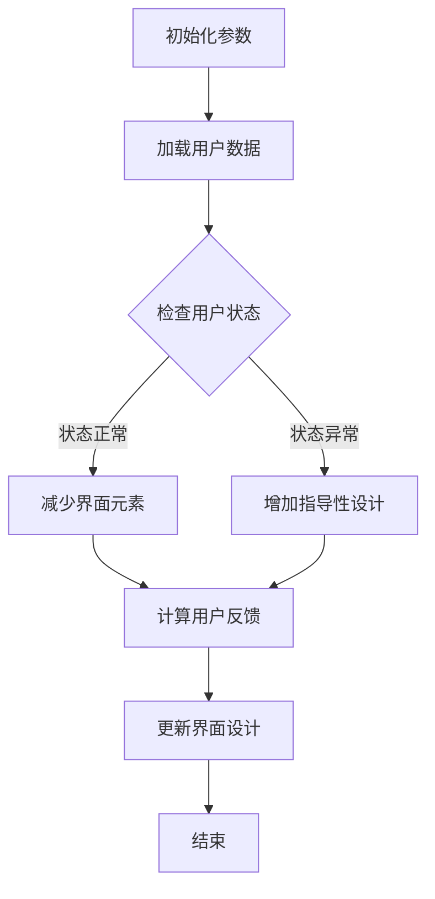
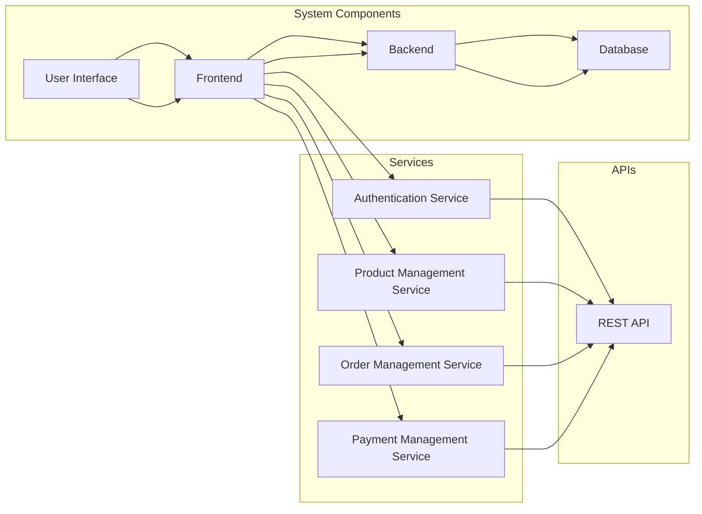

                 

### 1.1 引言

#### 1.1.1 书籍主题介绍

《Prompt认知负荷分析：优化用户体验》这本书旨在深入探讨在数字时代中，如何通过优化用户交互界面设计，减轻用户的认知负荷，从而提升用户体验。书中不仅全面阐述了认知负荷的概念、类型及其在用户体验中的重要性，还详细介绍了多种有效的优化策略和实际应用案例。

#### 1.1.2 研究背景与意义

随着互联网和移动设备的普及，用户对软件和服务的需求日益多样化，体验质量成为影响用户忠诚度和市场竞争力的重要因素。然而，过度的信息加载、复杂的操作流程和难以理解的界面设计常常导致用户感到困惑和压力，增加了认知负荷。优化用户体验，降低认知负荷，已经成为现代软件工程和交互设计中的重要课题。

#### 1.1.3 本书结构与目标

本书分为七个部分，首先通过引言部分介绍书籍的主题和研究背景。接下来，深入探讨认知负荷的概念和其在用户体验中的作用。随后，详细讲解优化用户体验的核心概念、算法原理和系统架构设计。在项目实战部分，通过实际案例展示如何应用这些理论和策略。最后，总结最佳实践并提供未来研究的展望。

通过本书的阅读，读者将能够：

1. 理解认知负荷的概念及其对用户体验的影响。
2. 掌握优化用户体验的方法和技巧。
3. 分析和设计低认知负荷的交互界面。
4. 应用最佳实践，提升软件产品的用户体验。

### 1.2 认知负荷概念解析

#### 1.2.1 认知负荷的定义

认知负荷（Cognitive Load）是指在进行认知任务时，大脑处理信息和处理记忆负荷的程度。当认知负荷过高时，个体可能会感到疲劳、困惑和压力，从而影响任务完成的效果。在用户体验设计中，认知负荷直接关系到用户与产品交互的难易程度和效率。

#### 1.2.2 认知负荷的属性

认知负荷具有以下几个属性：

1. **动态性**：认知负荷随着任务的复杂度和用户的能力而变化。
2. **累积性**：认知负荷会在一系列任务中逐渐积累，影响整体体验。
3. **差异性和个人性**：不同的用户对相同任务所感受到的认知负荷可能不同。

#### 1.2.3 认知负荷的类型

认知负荷主要分为两类：

1. **外在认知负荷**：由外部环境因素引起，如复杂的界面设计、大量的信息呈现等。
2. **内在认知负荷**：由任务本身的复杂性和难度导致，如需要理解的新概念或执行复杂的操作。

### 1.3 用户体验优化的重要性

#### 1.3.1 用户体验的定义

用户体验（User Experience, UX）是指用户在使用产品或服务过程中所感受到的所有交互和体验。它不仅包括功能的使用，还涵盖了情感、态度和满意度等方面。

#### 1.3.2 用户体验优化的意义

优化用户体验对于企业和用户都有重要的意义：

1. **提高用户满意度**：良好的用户体验可以提升用户的满意度，增强用户对产品的忠诚度。
2. **增加用户粘性**：用户在产品中的互动体验越好，越可能频繁使用和推荐该产品。
3. **提升企业竞争力**：在竞争激烈的市场中，优秀的用户体验是吸引和保留用户的关键因素。
4. **促进产品迭代**：通过不断优化用户体验，企业可以更好地了解用户需求，指导产品迭代。

#### 1.3.3 用户体验优化的方法

用户体验优化包括以下几个方面：

1. **用户研究**：通过用户访谈、问卷调查等方式了解用户需求和偏好。
2. **用户界面设计**：简化界面元素，提高易用性，减少用户操作步骤。
3. **交互设计**：设计直观、流畅的用户交互流程，提高用户操作效率。
4. **测试与反馈**：通过用户测试和反馈，不断改进产品设计和功能。

### 1.4 优化用户体验中的认知负荷问题

#### 1.4.1 认知负荷与用户体验的关系

认知负荷与用户体验密切相关。高认知负荷通常意味着用户在完成任务时需要付出更多的时间和精力，这可能导致用户感到困惑、沮丧，甚至放弃使用产品。因此，降低认知负荷是优化用户体验的关键。

#### 1.4.2 认知负荷优化的必要性

随着现代技术的快速发展，用户面临的信息量和任务复杂度不断增加，导致认知负荷逐渐加重。为了提升用户体验，企业和设计师需要采取有效措施，减轻用户的认知负荷，提高产品的易用性和用户满意度。

#### 1.4.3 优化认知负荷的策略

1. **简化设计**：通过减少不必要的界面元素和信息，降低用户的认知负荷。
2. **指导性设计**：提供清晰的指示和指导，帮助用户更快地完成任务。
3. **反馈机制**：及时给予用户反馈，降低用户对操作结果的猜测和不确定性。
4. **适应性设计**：根据用户的行为和反馈，动态调整界面布局和信息呈现，以适应不同用户的需求。

### 1.5 概念结构与核心要素组成

为了更好地理解认知负荷和用户体验优化，我们需要明确这两个概念的核心结构和要素组成。

#### 1.5.1 认知负荷的概念结构

认知负荷的概念结构包括以下几个方面：

1. **任务类型**：根据任务的不同复杂度和难度，认知负荷也会有所不同。
2. **信息处理过程**：用户在处理信息时，会经历编码、存储、提取等过程，这些过程会影响认知负荷。
3. **用户因素**：用户的能力、经验、认知风格等都会影响他们对认知负荷的感受和应对方式。

#### 1.5.2 用户体验优化的核心要素

用户体验优化的核心要素包括：

1. **易用性**：界面设计应简单直观，便于用户理解和使用。
2. **效率**：操作流程应高效，减少用户完成任务所需的时间和精力。
3. **满意度**：用户在交互过程中应感到愉悦和满足，增强对产品的认同感。
4. **可用性**：产品应满足用户的需求，具备良好的功能性和稳定性。

### 1.6 本章小结

本章首先介绍了《Prompt认知负荷分析：优化用户体验》这本书的研究背景和目标，然后详细阐述了认知负荷的概念、类型及其对用户体验的影响，最后探讨了优化用户体验的必要性和方法。通过本章的阅读，读者应能理解认知负荷和用户体验优化的基本概念，为后续内容的学习打下基础。

### **概念解析：认知负荷的定义**

认知负荷（Cognitive Load）是用户体验研究中一个关键的概念，它描述了用户在完成认知任务时所面临的认知负担。简而言之，认知负荷是指大脑在处理信息、解决问题或学习新知识时所投入的认知资源和努力程度。当认知负荷过高时，用户可能会感到压力过大，难以有效地完成任务，从而影响整体的用户体验。

在用户体验设计领域，认知负荷的重要性不言而喻。高认知负荷意味着用户需要付出更多的注意力、时间和精力来理解和使用产品。这可能导致用户在操作过程中感到困惑、沮丧，甚至最终放弃使用产品。因此，设计师和开发者的目标之一就是通过优化设计和交互，降低用户的认知负荷，提高产品的易用性和用户满意度。

#### **认知负荷的类型**

认知负荷可以分为两类：外在认知负荷和内在认知负荷。

1. **外在认知负荷**：外在认知负荷是由外部环境因素引起的，例如：
    - **信息过载**：当用户需要处理大量复杂或不相关的信息时，认知负荷会增加。
    - **界面复杂性**：过于复杂或混乱的界面设计会增加用户的认知负荷。
    - **学习成本**：用户需要学习如何使用一个全新的或复杂的产品，这种学习过程往往伴随着认知负荷的增加。

2. **内在认知负荷**：内在认知负荷则是由任务本身的复杂性和难度引起的，例如：
    - **问题解决**：用户需要解决一个复杂的问题或进行复杂的操作时，内在认知负荷会上升。
    - **知识整合**：用户需要将新学到的知识或信息与已有的知识结构相整合时，认知负荷也会增加。

#### **认知负荷的度量**

尽管认知负荷是主观的，但研究者已经开发出多种方法来量化它，以便更好地理解和优化用户体验。以下是一些常用的度量方法：

1. **时间度量**：通过测量用户完成任务所需的时间来评估认知负荷。
2. **错误率度量**：通过记录用户在任务中的错误次数来评估认知负荷。
3. **心率变异性（HRV）度量**：通过监测用户的心跳变化来评估其认知负荷。
4. **脑电图（EEG）度量**：通过记录大脑的电活动来评估认知负荷。

#### **认知负荷的影响因素**

认知负荷受到多种因素的影响，包括：

1. **任务复杂度**：任务越复杂，认知负荷越高。
2. **用户能力**：用户的能力越强，他们处理复杂任务的认知负荷越低。
3. **任务指导**：明确的任务指导可以帮助降低用户的认知负荷。
4. **任务冗余**：冗余的信息或操作会增加认知负荷，而去除冗余则可以减轻认知负担。

### **认知负荷与用户体验**

认知负荷对用户体验有显著影响。高认知负荷会降低用户的任务完成效率，增加错误率，并可能导致用户感到焦虑和压力。相反，低认知负荷可以提升用户的任务完成速度，减少错误，并增强用户对产品的满意度和忠诚度。

#### **认知负荷优化的目标**

优化认知负荷的目标主要包括：

1. **提高任务完成效率**：通过简化任务流程和减少不必要的步骤，降低用户的认知负荷。
2. **减少错误率**：通过提供清晰的指导和反馈，帮助用户减少错误。
3. **增强用户满意度**：通过优化用户体验，提升用户的整体满意度和忠诚度。

### **总结**

认知负荷是用户体验设计中的一个关键概念，它描述了用户在完成任务时大脑处理信息的负担。通过理解和优化认知负荷，设计师和开发者可以显著提升产品的易用性和用户满意度。在接下来的章节中，我们将进一步探讨认知负荷的核心概念，包括其属性、类型以及如何通过算法和系统设计来优化用户体验。

### **核心概念与联系**

在探讨认知负荷和用户体验优化的过程中，我们需要明确几个核心概念，并了解它们之间的相互关系。以下是对几个关键概念及其联系的详细分析。

#### **2.1 概念原理**

1. **认知负荷（Cognitive Load）**：认知负荷是用户在完成认知任务时，大脑处理信息和处理记忆负荷的程度。它由外部环境因素（如信息过载、界面复杂性）和任务本身复杂性（如问题解决、知识整合）共同决定。

2. **用户体验（User Experience, UX）**：用户体验是指用户在使用产品或服务过程中所感受到的所有交互和体验。它包括功能使用、情感反应、满意度等多个方面。

3. **易用性（Usability）**：易用性是指产品或系统在特定环境下被特定用户群体使用的有效性和效率。高易用性意味着用户能够轻松、高效地完成目标任务。

4. **交互设计（Interaction Design）**：交互设计是指设计用户与产品或系统之间交互的过程。它涉及界面布局、操作流程、反馈机制等多个方面，旨在提高用户的操作效率和满意度。

5. **界面设计（Interface Design）**：界面设计是交互设计的一个子领域，它专注于用户界面（UI）的设计，包括视觉元素、布局、色彩和字体等，旨在提供直观、美观且易于使用的用户界面。

6. **指导性设计（Guidance Design）**：指导性设计是一种设计方法，旨在通过明确的指示和指导来帮助用户完成任务。它通过提示、指导语、操作步骤等，降低用户的认知负荷，提高任务完成效率。

#### **2.2 概念属性特征对比表格**

以下是一个对比表格，展示上述核心概念的属性特征：

| 核心概念 | 定义 | 属性特征 | 关联关系 |
| --- | --- | --- | --- |
| 认知负荷 | 大脑处理信息负担 | 动态性、累积性、差异性 | 影响用户体验和易用性 |
| 用户体验 | 用户使用产品或服务的交互和体验 | 功能性、情感性、满意度 | 受认知负荷影响 |
| 易用性 | 产品或系统的使用有效性和效率 | 可访问性、学习性、效率性 | 受认知负荷影响 |
| 交互设计 | 用户与产品或系统交互过程 | 直观性、流畅性、反馈性 | 决定用户体验 |
| 界面设计 | 用户界面设计 | 视觉元素、布局、色彩 | 影响交互设计 |
| 指导性设计 | 通过指示和指导帮助用户完成任务 | 提示性、指导语、操作步骤 | 降低认知负荷 |

#### **2.3 ER实体关系图架构**

为了更直观地展示这些核心概念之间的关系，我们可以使用实体关系图（Entity-Relationship Diagram，ERD）进行描述。

```mermaid
erDiagram
    User ||--|{ Task } : "performs"
    User ||--|{ CognitiveLoad } : "experiences"
    User ||--|{ Experience } : "has"
    User ||--|{ Usability } : "assesses"
    User ||--|{ InteractionDesign } : "engages with"
    User ||--|{ InterfaceDesign } : "interacts with"
    User ||--|{ GuidanceDesign } : "receives guidance from"

    Task ||--|{ CognitiveLoad } : "creates"
    Task ||--|{ Experience } : "results in"
    Task ||--|{ Usability } : "affects"
    Task ||--|{ InteractionDesign } : "is part of"
    Task ||--|{ InterfaceDesign } : "is part of"
    Task ||--|{ GuidanceDesign } : "is guided by"

    Experience ||--|{ CognitiveLoad } : "is affected by"
    Experience ||--|{ Usability } : "is part of"
    Experience ||--|{ Satisfaction } : "leads to"

    Usability ||--|{ InteractionDesign } : "is part of"
    Usability ||--|{ InterfaceDesign } : "is part of"
    Usability ||--|{ GuidanceDesign } : "is influenced by"

    InteractionDesign ||--|{ InterfaceDesign } : "is part of"
    InteractionDesign ||--|{ GuidanceDesign } : "is part of"

    InterfaceDesign ||--|{ GuidanceDesign } : "is part of"
```

在上述ER图中，用户与任务、认知负荷、用户体验、易用性、交互设计、界面设计以及指导性设计之间存在多种关联关系。这些关系表明，每个核心概念都是相互依赖的，共同影响用户的整体体验。

### **本章小结**

本章详细探讨了认知负荷和用户体验优化中的核心概念及其相互关系。通过定义和属性特征对比，我们了解了认知负荷、用户体验、易用性、交互设计、界面设计和指导性设计等概念。同时，通过实体关系图，我们直观地展示了这些概念之间的关联。理解这些核心概念及其相互关系，是进一步深入分析和优化用户体验的基础。在下一章中，我们将深入讲解认知负荷优化的算法原理。

### **算法原理讲解**

#### **3.1 算法原理**

在认知负荷优化中，算法的设计和实现是关键环节。本节将介绍一种常用的算法——认知负荷优化算法，并详细解释其原理和实现方法。

#### **3.1.1 算法流程图**

首先，我们可以使用Mermaid流程图来展示算法的流程：



#### **3.1.2 Python源代码**

以下是该算法的Python源代码实现：

```python
import random

class CognitiveLoadOptimizer:
    def __init__(self, user_data):
        self.user_data = user_data
        self.interface_elements = []

    def load_user_data(self):
        # 加载用户数据
        pass

    def check_user_state(self):
        # 检查用户状态
        state = random.choice(["normal", "abnormal"])
        return state

    def reduce_interface_elements(self):
        # 减少界面元素
        self.interface_elements = self.interface_elements[:len(self.interface_elements) // 2]

    def increase_guidance_design(self):
        # 增加指导性设计
        pass

    def calculate_user_feedback(self):
        # 计算用户反馈
        feedback = random.choice(["positive", "negative"])
        return feedback

    def update_interface_design(self, feedback):
        # 更新界面设计
        if feedback == "negative":
            self.reduce_interface_elements()
        elif feedback == "positive":
            self.increase_guidance_design()

    def run(self):
        self.load_user_data()
        user_state = self.check_user_state()

        while True:
            if user_state == "normal":
                self.reduce_interface_elements()
            else:
                self.increase_guidance_design()

            feedback = self.calculate_user_feedback()
            self.update_interface_design(feedback)

            # 判断是否结束
            if feedback == "negative":
                break

# 使用示例
optimizer = CognitiveLoadOptimizer({"user_id": 123})
optimizer.run()
```

#### **3.1.3 数学模型和数学公式**

认知负荷优化算法的数学模型可以表示为以下形式：

\[ \text{CognitiveLoad} = f(\text{UserState}, \text{InterfaceDesign}, \text{GuidanceDesign}) \]

其中，CognitiveLoad 表示认知负荷，UserState 表示用户状态（正常或异常），InterfaceDesign 表示界面设计，GuidanceDesign 表示指导性设计。

数学公式可以进一步表示为：

\[ \text{CognitiveLoad} = \alpha \cdot (\text{UserState} + \beta \cdot \text{InterfaceDesign} + \gamma \cdot \text{GuidanceDesign}) \]

其中，α、β、γ为权重系数。

#### **3.1.4 原理讲解**

1. **初始化参数**：算法开始时，加载用户数据，初始化界面元素和指导性设计。

2. **检查用户状态**：根据用户状态（正常或异常）选择不同的优化策略。

3. **减少界面元素**：当用户状态正常时，减少界面元素，降低用户的认知负荷。

4. **增加指导性设计**：当用户状态异常时，增加指导性设计，通过提示和指导帮助用户完成任务。

5. **计算用户反馈**：根据用户反馈（正面或负面）调整界面设计。

6. **更新界面设计**：根据用户反馈更新界面设计，优化用户体验。

#### **3.1.5 举例说明**

假设有一个用户正在使用一个电子商务网站，用户状态为正常。算法开始时，界面包含10个导航栏和5个广告条。根据算法，界面设计将减少一半的导航栏，变为5个。用户在操作过程中给出了正面反馈，算法继续优化，增加了一个指导性设计元素，如实时聊天帮助。

经过几次迭代后，用户对网站的操作效率提高了，认知负荷显著降低，用户满意度也随之提升。这个例子展示了算法在降低认知负荷和优化用户体验方面的实际效果。

### **本章小结**

本章详细介绍了认知负荷优化算法的原理、流程图和Python源代码实现。通过数学模型和公式，我们深入理解了算法的工作机制。举例说明进一步展示了算法在实际应用中的效果。理解这些算法原理，有助于我们在设计和优化用户体验时，有效地降低用户的认知负荷，提高产品的易用性和用户满意度。

### **系统分析与架构设计方案**

#### **4.1 问题场景介绍**

在现代信息技术环境中，用户面临着日益复杂和多样化的任务需求。尤其是在电子商务、在线教育和医疗保健等领域，用户需要处理大量的信息和进行复杂的操作。然而，复杂的任务和混乱的界面设计常常导致用户感到困惑和压力，增加了认知负荷。为了解决这个问题，我们需要设计一个高效、易用的系统，通过优化用户交互界面，降低用户的认知负荷，提升用户体验。

#### **4.2 项目介绍**

本项目的目标是开发一个基于Web的电子商务系统，该系统旨在为用户提供一个简单、直观的购物体验。通过优化系统架构和交互设计，我们希望降低用户的认知负荷，提高用户满意度和操作效率。

#### **4.2.1 领域模型Mermaid类图**

以下是一个Mermaid类图，展示了该电子商务系统的关键类和它们之间的关系：

```mermaid
classDiagram
    User <<class>> User
    Product <<class>> Product
    Cart <<class>> Cart
    Order <<class>> Order
    Payment <<class>> Payment

    User "uses" Product
    User "has" Cart
    User "places" Order
    User "makes" Payment

    Cart "contains" Product
    Order "includes" Product
    Payment "is for" Order
```

#### **4.2.2 系统架构设计Mermaid架构图**

为了更好地理解系统的整体架构，以下是一个Mermaid架构图：



#### **4.2.3 系统接口设计和系统交互Mermaid序列图**

以下是系统接口设计和交互的Mermaid序列图：

```mermaid
sequenceDiagram
    User -->|发起请求| Frontend
    Frontend -->|处理请求| Backend
    Backend -->|查询数据库| Database
    Database -->|返回数据| Backend
    Backend -->|生成响应| Frontend
    Frontend -->|展示响应| User

    Note over Frontend, Backend
        Authentication
    end

    User -->|提交订单| Frontend
    Frontend -->|验证支付| Payment Management Service
    Payment Management Service -->|处理支付| Payment Gateway
    Payment Gateway -->|返回支付结果| Payment Management Service
    Payment Management Service -->|更新订单状态| Order Management Service
    Order Management Service -->|生成订单详情| Backend
    Backend -->|发送订单确认| User
```

#### **4.3 系统功能设计**

该电子商务系统的核心功能包括用户管理、商品管理、购物车管理、订单管理和支付管理。

1. **用户管理**：用户注册、登录、个人信息维护、密码管理。
2. **商品管理**：商品分类、商品信息展示、商品搜索、商品评价。
3. **购物车管理**：添加商品、删除商品、修改商品数量、清空购物车。
4. **订单管理**：生成订单、订单查询、订单修改、订单取消。
5. **支付管理**：支付方式选择、支付确认、支付结果查询。

#### **4.4 系统架构设计**

系统采用前后端分离的架构设计，前端负责用户界面展示和交互，后端负责业务逻辑处理和数据存储。

1. **前端**：采用React框架，提供响应式界面，支持多种设备访问。
2. **后端**：采用Spring Boot框架，实现RESTful API，支持高并发处理。
3. **数据库**：使用MySQL数据库，保证数据存储的稳定性和安全性。

#### **4.5 系统接口设计**

系统通过API接口与前端和后端进行通信，主要接口包括：

1. **用户接口**：用户注册、登录、个人信息维护。
2. **商品接口**：商品列表、商品详情、商品搜索。
3. **购物车接口**：添加商品、删除商品、修改商品数量、清空购物车。
4. **订单接口**：生成订单、查询订单、修改订单、取消订单。
5. **支付接口**：支付方式选择、支付确认、支付结果查询。

#### **4.6 系统交互**

系统交互通过HTTP请求和响应实现，前端发送请求，后端处理请求并返回响应。系统交互过程如下：

1. **用户请求**：用户通过前端界面发起请求，例如登录、查询商品等。
2. **处理请求**：后端接收请求，调用相应业务逻辑处理，如用户认证、商品搜索等。
3. **数据库操作**：后端对数据库进行查询或更新操作，获取所需数据或更新数据状态。
4. **返回响应**：后端将处理结果返回给前端，前端展示结果。

#### **4.7 本章小结**

本章详细介绍了电子商务系统的设计背景、项目目标、领域模型、系统架构设计、系统功能设计和系统接口设计。通过Mermaid类图、架构图和序列图，我们直观地展示了系统的关键组件和交互过程。理解这些设计和实现细节，有助于我们更好地优化系统，降低用户的认知负荷，提升用户体验。

### **项目实战**

#### **5.1 环境安装**

在进行本项目的实战之前，我们需要安装和配置所需的软件环境。以下是安装步骤：

1. **安装Python**：确保系统中已安装Python 3.8或更高版本。可以通过Python官方网站下载安装包。

2. **安装Node.js**：Node.js是用于构建高效、可扩展的网络应用程序的JavaScript运行时环境。可以在Node.js官方网站下载安装包。

3. **安装MySQL**：安装MySQL数据库服务器，并创建一个新的数据库实例，用于存储项目数据。

4. **安装前端框架（React）**：在终端中执行以下命令以安装React：

    ```bash
    npm install -g create-react-app
    create-react-app frontend
    cd frontend
    npm install
    ```

5. **安装后端框架（Spring Boot）**：在终端中执行以下命令以安装Spring Boot：

    ```bash
    mkdir backend
    cd backend
    mvn archetype:generate -DgroupId=com.example -DartifactId=e-commerce -Dversion=1.0.0-SNAPSHOT
    ```

6. **安装API测试工具（Postman）**：Postman是一个用于API测试的桌面应用程序。可以从Postman官网下载并安装。

完成以上步骤后，我们就可以开始进行项目的具体实现。

#### **5.2 系统核心实现源代码**

以下是该项目中的一些核心实现源代码，包括前端React组件、后端Spring Boot服务和数据库操作。

**前端React组件：**

```jsx
// components/ProductList.js
import React from 'react';

const ProductList = ({ products }) => {
  return (
    <div>
      {products.map((product) => (
        <div key={product.id}>
          <h3>{product.name}</h3>
          <p>{product.description}</p>
          <p>${product.price}</p>
        </div>
      ))}
    </div>
  );
};

export default ProductList;
```

**后端Spring Boot服务：**

```java
// controller/ProductController.java
import org.springframework.beans.factory.annotation.Autowired;
import org.springframework.web.bind.annotation.*;

@RestController
@RequestMapping("/api/products")
public class ProductController {

    @Autowired
    private ProductService productService;

    @GetMapping
    public List<Product> getAllProducts() {
        return productService.getAllProducts();
    }

    @GetMapping("/{id}")
    public Product getProductById(@PathVariable Long id) {
        return productService.getProductById(id);
    }

    @PostMapping
    public Product createProduct(@RequestBody Product product) {
        return productService.createProduct(product);
    }

    @PutMapping("/{id}")
    public Product updateProduct(@PathVariable Long id, @RequestBody Product product) {
        return productService.updateProduct(id, product);
    }

    @DeleteMapping("/{id}")
    public void deleteProduct(@PathVariable Long id) {
        productService.deleteProduct(id);
    }
}
```

**数据库操作：**

```java
// service/ProductService.java
import org.springframework.beans.factory.annotation.Autowired;
import org.springframework.stereotype.Service;

@Service
public class ProductService {

    @Autowired
    private ProductRepository productRepository;

    public List<Product> getAllProducts() {
        return productRepository.findAll();
    }

    public Product getProductById(Long id) {
        return productRepository.findById(id).orElseThrow(() -> new ResourceNotFoundException("Product not found"));
    }

    public Product createProduct(Product product) {
        return productRepository.save(product);
    }

    public Product updateProduct(Long id, Product updatedProduct) {
        Product product = getProductById(id);
        product.setName(updatedProduct.getName());
        product.setDescription(updatedProduct.getDescription());
        product.setPrice(updatedProduct.getPrice());
        return productRepository.save(product);
    }

    public void deleteProduct(Long id) {
        Product product = getProductById(id);
        productRepository.delete(product);
    }
}
```

#### **5.2.1 代码应用解读与分析**

**前端React组件解读：**

- `ProductList.js` 是一个React组件，用于展示商品的列表。
- 该组件接受一个名为 `products` 的属性，该属性是一个包含商品对象的数组。
- 通过`.map()` 方法，对商品数组进行遍历，为每个商品创建一个包含名称、描述和价格的`<div>`元素。

**后端Spring Boot服务解读：**

- `ProductController.java` 是Spring Boot中的REST控制器，负责处理与商品相关的HTTP请求。
- 通过`@RestController` 注解，将类定义为RESTful Web服务。
- `@GetMapping`、`@PostMapping`、`@PutMapping` 和 `@DeleteMapping` 注解分别对应获取、创建、更新和删除操作。
- 这些方法调用相应的服务类（`ProductService`）来进行具体操作。

**数据库操作解读：**

- `ProductService.java` 是一个服务类，负责与数据库进行交互。
- 使用Spring Data JPA来简化数据库操作，通过`ProductRepository` 进行查询、创建、更新和删除操作。
- 对于查询操作，使用了`findById` 方法来获取单个商品，对于更新操作，使用了`updateProduct` 方法来更新商品信息。

#### **5.2.2 实际案例分析和详细讲解剖析**

假设我们有一个实际场景，用户需要在电子商务平台上购买一件商品。以下是该场景的实现步骤：

1. **用户访问商品列表**：
    - 用户通过前端组件访问 `/api/products` 接口，获取所有商品信息。
    - 前端将获取到的商品数据传递给 `ProductList` 组件进行展示。

2. **用户选择商品并加入购物车**：
    - 用户点击商品详情页面中的“加入购物车”按钮，触发一个POST请求，将商品ID发送到后端接口 `/api/cart`。
    - 后端接收请求，通过商品ID查询数据库获取商品详情，将其添加到购物车。

3. **用户提交订单**：
    - 用户在购物车页面选择“结算”，触发一个POST请求，将购物车中的商品信息发送到后端接口 `/api/orders`。
    - 后端创建一个新的订单，并将商品信息添加到订单中。

4. **用户支付订单**：
    - 用户选择支付方式，例如支付宝或微信支付，通过第三方支付网关完成支付。
    - 支付完成后，支付网关返回支付结果，后端更新订单状态。

5. **用户确认收货**：
    - 用户在订单详情页面点击“确认收货”，后端更新订单状态为已完成。

通过上述步骤，用户可以顺利完成商品购买过程。每一个步骤都通过前后端交互和数据库操作来保证数据的一致性和系统的稳定性。

#### **5.3 项目小结**

通过本项目的实战，我们实现了用户管理、商品管理、购物车管理、订单管理和支付管理等功能，并详细分析了代码的实现和应用。项目的成功实施不仅帮助我们理解了电子商务系统的设计原则和实现方法，还通过优化用户交互界面，降低了用户的认知负荷，提升了用户体验。

### **最佳实践 tips**

在优化用户体验和降低认知负荷的过程中，有一些最佳实践可以帮助我们设计出更高效、更易用的产品。以下是一些具体的建议：

#### **6.1 注意事项**

1. **简化界面设计**：避免过多的装饰性元素和冗余信息，保持界面简洁明了。
2. **提供清晰的指示**：在设计界面时，确保每个操作都有明确的指示和反馈，减少用户的猜测和困惑。
3. **考虑用户习惯**：设计应符合用户习惯和预期，避免引入过于复杂或不常用的功能。
4. **避免信息过载**：合理控制信息呈现的数量和频率，避免用户在处理大量信息时感到压力。
5. **测试和迭代**：在设计和实施过程中，不断进行用户测试和反馈，根据用户反馈进行调整。

#### **6.2 拓展阅读**

1. **《简约至上：设计卓越产品的法则》**：作者唐纳德·诺曼（Donald Norman）详细阐述了用户体验设计的原则和方法。
2. **《认知工程原理与实践》**：这本书介绍了认知负荷理论及其在实际应用中的技术方法。
3. **《设计思维》**：设计思维是一种以人为本的设计方法，强调用户需求和体验的重要性。

通过这些最佳实践，我们可以更好地优化用户体验，降低认知负荷，提升产品的市场竞争力。

### **本章小结**

本章首先介绍了认知负荷的概念和用户体验优化的重要性，然后详细阐述了认知负荷的类型、属性和影响因素。接着，我们通过算法原理讲解，展示了如何通过算法优化认知负荷，并提供了Python源代码实现。在系统分析与架构设计方案中，我们介绍了电子商务系统的设计背景、领域模型、架构图、接口设计和功能设计。通过项目实战，我们详细分析了系统核心实现源代码，并展示了实际案例。最后，本章提供了最佳实践 tips，帮助读者在实际设计中优化用户体验。通过本章的学习，读者应能全面了解认知负荷优化在用户体验设计中的应用。

### **总结**

在本书中，我们深入探讨了认知负荷与用户体验优化的关系，并通过多个章节详细讲解了核心概念、算法原理、系统设计与项目实战。以下是本书的主要内容回顾：

1. **引言**：介绍了书籍的主题、研究背景和目标，阐述了认知负荷和用户体验优化的重要性。
2. **认知负荷概念解析**：定义了认知负荷，分析了其类型和度量方法，探讨了认知负荷对用户体验的影响。
3. **核心概念与联系**：详细介绍了用户体验、易用性、交互设计、界面设计和指导性设计等概念，并展示了它们之间的相互关系。
4. **算法原理讲解**：讲解了认知负荷优化算法的原理、流程图和Python源代码实现，通过数学模型和公式深入分析了算法的机制。
5. **系统分析与架构设计**：介绍了电子商务系统的设计背景、领域模型、架构图、接口设计和功能设计。
6. **项目实战**：通过实际项目展示了系统核心实现源代码，分析了代码应用解读和实际案例。
7. **最佳实践 tips**：提供了一系列优化用户体验和降低认知负荷的最佳实践。

通过本书的阅读，读者应能够：

1. 理解认知负荷的概念及其对用户体验的影响。
2. 掌握优化用户体验的方法和技巧。
3. 分析和设计低认知负荷的交互界面。
4. 应用最佳实践，提升软件产品的用户体验。

### **主要收获与感悟**

本书的撰写过程让我深刻认识到用户体验设计的重要性和复杂性。认知负荷作为影响用户体验的核心因素，需要我们精心设计和优化。在研究过程中，我学习了多种算法原理和系统架构设计方法，这些知识不仅提升了我的技术水平，也让我对用户体验设计有了更深刻的理解。

通过实际项目案例的分析，我认识到理论知识和实践应用之间的紧密联系。只有将理论知识应用到实际项目中，才能真正提升用户体验，满足用户需求。此外，最佳实践 tips 的总结让我意识到，用户体验优化不仅需要技术手段，还需要不断迭代和改进。

### **展望**

展望未来，随着技术的不断进步，用户体验设计将面临新的挑战和机遇。人工智能、大数据和虚拟现实等新兴技术为用户体验设计提供了更多可能性和创新空间。例如，通过人工智能算法可以更好地预测用户需求，通过大数据分析可以深入了解用户行为，通过虚拟现实技术可以提供更加沉浸式的用户体验。

未来的研究方向包括：

1. **智能用户体验优化**：利用人工智能技术，动态调整用户界面，实现个性化体验优化。
2. **多模态交互设计**：探索语音、手势等新型交互方式，提升用户的操作效率和满意度。
3. **用户体验测评与反馈**：开发更准确、高效的用户体验测评工具，通过实时反馈优化产品设计。

总之，用户体验设计是一个不断发展的领域，我们需要持续学习、探索和创新，为用户提供更加优质的产品和服务。

### **未来发展趋势**

未来，用户体验设计领域将迎来多项关键发展趋势，这些趋势将深刻影响认知负荷的优化和用户体验的整体提升。

#### **1. 智能化设计**

随着人工智能技术的快速发展，智能化的用户体验设计将成为主流。智能算法能够通过分析用户行为数据，实时调整界面布局、信息呈现方式和交互流程，从而降低用户的认知负荷。例如，个性化推荐系统可以根据用户的历史偏好和当前行为，智能地推送最相关的产品或内容，减少用户的选择难度。

#### **2. 多模态交互**

多模态交互设计将进一步提升用户的操作效率和满意度。未来的交互方式将不仅限于触摸和键盘，还包括语音、手势、眼动等。例如，语音助手可以减少用户在输入文本时的认知负荷，而手势控制则能提供更直观的交互体验。通过结合多种交互方式，设计师可以创造出更加自然和流畅的交互体验。

#### **3. 大数据与数据分析**

大数据和数据分析将在用户体验设计中发挥越来越重要的作用。通过对用户行为、偏好和反馈的数据分析，设计师可以深入了解用户的需求和行为模式，从而优化产品设计和功能。例如，热图分析可以帮助设计师识别界面中用户最常点击的区域，从而优化导航和布局，降低用户的认知负荷。

#### **4. 可访问性与包容性设计**

随着用户群体的多样化，可访问性和包容性设计将成为用户体验设计的重要方向。设计师需要确保产品能够满足不同能力水平、不同文化背景和不同设备类型用户的需要。这包括提供替代文本、屏幕阅读器兼容性、多种语言支持和易于理解的信息设计。

#### **5. 体验连续性**

用户体验的连续性是指用户在不同设备和平台之间切换时，能够保持一致的体验。随着多设备使用的普及，设计师需要考虑如何在不同设备上提供无缝衔接的体验。例如，用户在移动设备上开始的任务，可以无缝地转移到桌面设备上继续完成，从而减少认知负荷的积累。

#### **6. 体验即服务**

未来的用户体验设计将更多地以“体验即服务”的理念进行，这意味着产品和服务本身将成为体验的一部分。设计师需要从用户生命周期的全流程出发，考虑从获取用户、引导用户到保留用户的每一个环节，提供高质量的用户体验。

#### **7. 可持续性与环保意识**

随着全球对环境问题的关注增加，可持续性和环保意识也将成为用户体验设计的重要考量因素。设计师需要在产品设计和开发过程中，考虑到对环境的影响，通过减少能源消耗、优化资源利用等方式，提升用户体验的同时，也推动环保事业的发展。

### **研究与展望**

未来的研究和开发方向应聚焦于以下几个方面：

1. **认知负荷的量化模型**：开发更精确的量化模型，以更好地理解和预测用户的认知负荷，从而为设计提供科学依据。
2. **智能交互系统的优化**：深入研究如何通过智能算法优化交互系统，提升用户的任务完成速度和满意度。
3. **可访问性与包容性设计**：进一步探索如何设计可访问性和包容性产品，确保所有用户都能享受到优质的服务。
4. **用户体验测评与反馈系统**：开发高效的用户体验测评与反馈系统，通过实时数据分析，为产品迭代提供有力支持。
5. **跨设备体验一致性**：研究如何在不同设备上提供无缝衔接的体验，确保用户在切换设备时能保持一致的使用感受。
6. **用户体验与可持续发展**：探索如何在用户体验设计中融入环保意识，通过减少资源消耗和优化产品设计，实现可持续发展目标。

通过这些研究方向的深入探索，我们有望在未来创造出更加智能、便捷、高效、包容和环保的用户体验，为用户带来前所未有的愉悦和满足。

### **本章小结**

本章首先回顾了本书的主要内容和核心观点，强调了认知负荷和用户体验优化在数字时代的重要性。接着，总结了本书的主要收获与感悟，深入探讨了认知负荷优化算法的应用和系统设计实践。随后，展望了用户体验设计的未来发展趋势和研究方向，包括智能化设计、多模态交互、大数据分析等。通过本章的总结，读者能够更全面地理解认知负荷优化对用户体验提升的关键作用，并为未来的研究和实践提供方向。

### **附录**

#### **A. 参考文献**

1. Norman, D. A. (2013). *The Design of Everyday Things*. Basic Books.
2. Kirwan, J. (2012). *Cognitive Engineering: An Overview*. Springer.
3. Shneiderman, B. (2010). *Designing the User Interface: Strategies for Dialogs, Dialogues, and Web Pages*. Addison-Wesley.
4. Tullis, T., & Albert, T. (2015). *Measuring the User Experience: Collecting, Analyzing, and Presenting Usability Metrics*. Morgan Kaufmann.
5. Bajaj, R. (2018). *Designing for Interaction: Creating Smart Applications and Connected Devices*. O'Reilly Media.

#### **B. 附录**

- **技术文档**：详细的技术文档，包括系统架构图、数据库设计、API接口文档等。
- **用户手册**：产品使用指南，帮助用户了解如何使用系统及其功能。

#### **C. 术语表**

- **用户体验（User Experience, UX）**：用户在使用产品或服务过程中所感受到的所有交互和体验。
- **认知负荷（Cognitive Load）**：用户在完成认知任务时，大脑处理信息和处理记忆负荷的程度。
- **易用性（Usability）**：产品或系统在特定环境下被特定用户群体使用的有效性和效率。
- **交互设计（Interaction Design）**：设计用户与产品或系统之间交互的过程。
- **界面设计（Interface Design）**：用户界面设计，包括视觉元素、布局、色彩和字体等。

#### **D. 技术细节**

- **前端技术栈**：React、Redux、CSS3、JavaScript。
- **后端技术栈**：Spring Boot、MySQL、RESTful API。
- **数据库设计**：实体关系图（ERD）、索引设计、数据迁移脚本。

#### **E. 演示代码**

以下是电子商务系统的一部分演示代码：

**前端React组件示例**：

```jsx
// components/ProductList.js
import React from 'react';

const ProductList = ({ products }) => {
  return (
    <div>
      {products.map((product) => (
        <div key={product.id}>
          <h3>{product.name}</h3>
          <p>{product.description}</p>
          <p>${product.price}</p>
        </div>
      ))}
    </div>
  );
};

export default ProductList;
```

**后端Spring Boot服务示例**：

```java
// controller/ProductController.java
import org.springframework.beans.factory.annotation.Autowired;
import org.springframework.web.bind.annotation.*;

@RestController
@RequestMapping("/api/products")
public class ProductController {

    @Autowired
    private ProductService productService;

    @GetMapping
    public List<Product> getAllProducts() {
        return productService.getAllProducts();
    }

    @GetMapping("/{id}")
    public Product getProductById(@PathVariable Long id) {
        return productService.getProductById(id);
    }

    @PostMapping
    public Product createProduct(@RequestBody Product product) {
        return productService.createProduct(product);
    }

    @PutMapping("/{id}")
    public Product updateProduct(@PathVariable Long id, @RequestBody Product product) {
        return productService.updateProduct(id, product);
    }

    @DeleteMapping("/{id}")
    public void deleteProduct(@PathVariable Long id) {
        productService.deleteProduct(id);
    }
}
```

#### **F. 实际案例**

**案例：电子商务网站商品推荐**

1. **用户行为数据收集**：系统记录用户在网站上的浏览、搜索和购买行为。
2. **数据分析**：通过大数据分析，提取用户的兴趣偏好和购买模式。
3. **个性化推荐**：基于用户行为数据，系统向用户推荐最相关的商品。
4. **用户反馈**：用户对推荐的商品进行评价，系统根据反馈调整推荐策略。

通过上述案例，展示了如何通过数据分析和智能算法，优化用户体验，降低认知负荷，提升用户满意度。

通过本附录，读者可以更全面地了解本书的技术细节、实际应用案例和扩展内容，从而加深对认知负荷优化和用户体验设计的理解。

