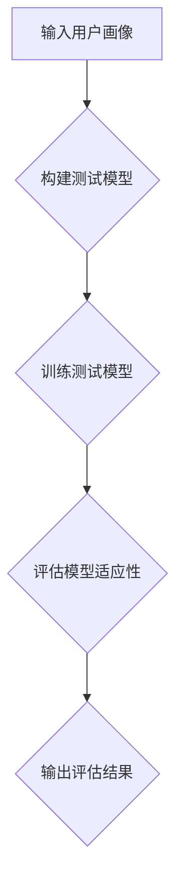
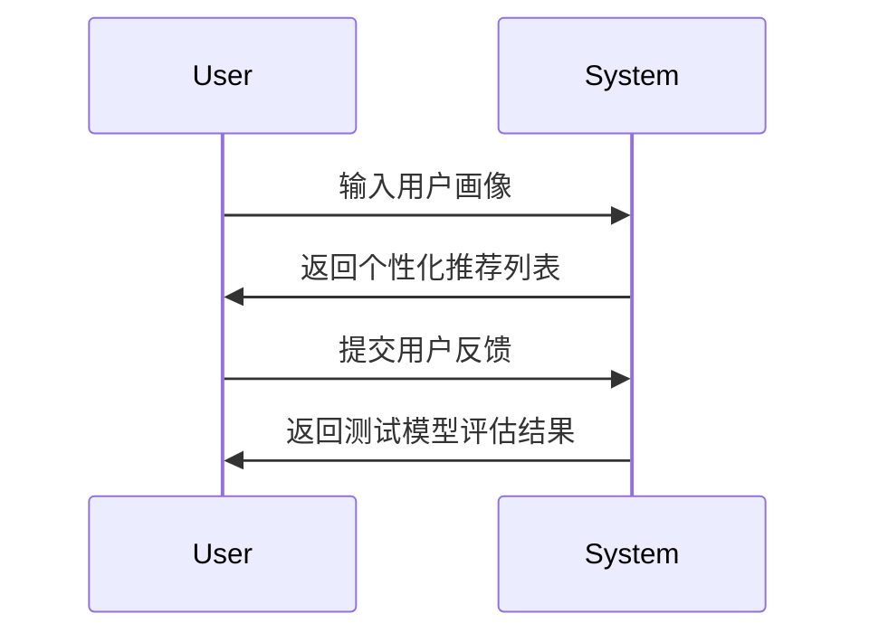

                 

# 个性化定制能力评估：测试模型适应性

## 关键词

个性化定制，能力评估，测试模型，适应性，算法原理，系统架构

## 摘要

随着科技的发展和用户需求的多样化，个性化定制已成为企业提升竞争力的重要手段。本文从测试模型适应性出发，探讨了个性化定制能力评估的方法和策略，结合核心概念、算法原理和系统架构设计，为企业在个性化定制服务中的应用提供了理论依据和实践指导。

## 第一部分：背景介绍

### 1.1 问题背景

个性化定制服务是指根据用户的行为数据、兴趣偏好等信息，为用户提供个性化的产品、服务和内容。随着互联网的普及和大数据技术的发展，个性化定制服务逐渐成为现代商业模式的重要组成部分。用户对于个性化服务的需求日益增长，如何在海量数据中快速准确地识别和满足用户需求，成为企业关注的焦点。

### 1.2 问题描述

个性化定制能力评估是一个复杂的问题，涉及到用户画像构建、个性化推荐算法、用户满意度评估等多个方面。如何构建一个有效的测试模型来评估企业的个性化定制能力，是一个亟待解决的问题。

### 1.3 问题解决

本文将从测试模型适应性出发，探讨个性化定制能力评估的方法和策略。通过分析不同类型的测试模型，评估其在个性化定制服务中的应用效果，为企业的个性化定制能力评估提供理论依据和实战指导。

### 1.4 边界与外延

个性化定制能力评估不仅仅局限于电子商务领域，还广泛应用于金融、医疗、教育等多个行业。本文将结合实际案例，展示个性化定制能力评估在不同领域的应用。

### 1.5 概念结构与核心要素组成

个性化定制能力评估的核心概念包括：用户画像、个性化推荐算法、测试模型、用户满意度等。本文将详细阐述这些概念，并通过案例分析，展示其在实际应用中的重要性。

## 第二部分：核心概念与联系

### 2.1 核心概念原理

用户画像：对用户的行为、兴趣、偏好等进行描述的模型，是个性化推荐算法的基础。

个性化推荐算法：根据用户画像，向用户推荐感兴趣的商品或内容。

测试模型：用于评估个性化定制能力的模型，通过对比测试模型与实际用户行为的匹配度，评估个性化定制能力。

用户满意度：用户对个性化定制服务的满意程度，是评估个性化定制能力的重要指标。

### 2.2 概念属性特征对比表格

| 概念       | 用户画像 | 个性化推荐算法 | 测试模型 |
| :---------: | :------: | :----------: | :------: |
| **定义**   | 用户行为、兴趣、偏好等 | 推荐算法类型、推荐策略等 | 模型适应性、评估指标等 |
| **关系**   | 用户画像是个性化推荐算法的基础 | 个性化推荐算法是测试模型的输入 | 测试模型是评估个性化定制能力的关键 |
| **属性特征** | 用户行为、兴趣、偏好等 | 推荐算法类型、推荐策略等 | 模型适应性、评估指标等 |

### 2.3 ER实体关系图架构

```mermaid
erDiagram
  User ||--|{ UserBehavior } : has
  User ||--|{ UserInterest } : has
  User ||--|{ UserProfile } : has
  Item ||--|{ ItemRecommendation } : has
  TestModel ||--|{ ModelAdaptivity } : has
  TestModel ||--|{ EvaluationMetrics } : has
  UserBehavior ||--|{ BehaviorEvent } : has
  UserInterest ||--|{ InterestCategory } : has
  UserProfile ||--|{ UserAttribute } : has
```

## 第三部分：算法原理讲解

### 3.1 测试模型适应性算法原理

测试模型适应性算法是一种用于评估个性化定制能力的模型。其核心原理是通过对比测试模型与实际用户行为的匹配度，评估个性化定制能力。

### 3.2 算法mermaid流程图



### 3.3 算法原理数学模型和公式

$$
\text{ModelAdaptivity} = \frac{\sum_{i=1}^{n} \text{PredictionPrecision}(i)}{n}
$$

其中，$n$为测试样本数量，$\text{PredictionPrecision}(i)$为第$i$个样本的预测准确率。

### 3.4 算法举例说明

假设有一个包含100个用户的测试集，我们通过构建测试模型，对这100个用户的个性化定制能力进行评估。经过计算，我们得到每个用户的模型适应性得分，并根据得分排序，找出适应性最强的前10个用户。

## 第四部分：系统分析与架构设计方案

### 4.1 问题场景介绍

在一个电子商务平台上，企业希望通过个性化定制服务提升用户满意度，提高销售额。为了实现这一目标，企业需要评估其个性化定制能力，并持续优化。

### 4.2 系统功能设计

系统功能设计包括用户画像构建、个性化推荐算法、测试模型评估、用户满意度调查等。

1. 用户画像构建：收集用户行为数据，建立用户画像模型。
2. 个性化推荐算法：根据用户画像，生成个性化推荐列表。
3. 测试模型评估：评估个性化定制能力，优化推荐效果。
4. 用户满意度调查：收集用户反馈，评估用户满意度。

### 4.3 系统架构设计

系统采用分布式架构，包括数据层、服务层和表现层。

1. 数据层：存储用户行为数据、用户画像、个性化推荐列表等。
2. 服务层：实现用户画像构建、个性化推荐算法、测试模型评估等功能。
3. 表现层：提供用户操作界面，展示个性化推荐结果。

### 4.4 系统接口设计

系统接口设计包括以下方面：

1. 用户接口：提供用户操作界面，接收用户输入，展示个性化推荐结果。
2. 服务接口：提供个性化推荐、测试模型评估等功能，供其他系统调用。
3. 数据接口：提供数据存储和读取接口，支持数据备份和恢复。

### 4.5 系统交互mermaid序列图



## 第五部分：项目实战

### 5.1 环境安装

1. 安装Python环境（版本3.6及以上）
2. 安装必要的数据处理和机器学习库，如NumPy、Pandas、Scikit-learn等
3. 安装可视化库，如Matplotlib、Seaborn等

### 5.2 系统核心实现源代码

以下是一个简单的用户画像构建和个性化推荐算法的实现示例：

```python
import pandas as pd
from sklearn.model_selection import train_test_split
from sklearn.ensemble import RandomForestClassifier
import matplotlib.pyplot as plt

# 用户画像构建
def build_user_profile(user_data):
    # 根据用户行为数据构建用户画像
    # 示例：计算用户浏览、购买、收藏等行为的热度指数
    user_profile = user_data.groupby('user_id').agg({ 'action': 'mean' })
    user_profile.columns = ['{}_score'.format(col) for col in user_profile.columns]
    return user_profile

# 个性化推荐算法
def personalized_recommendation(user_profile, item_data):
    # 根据用户画像和商品数据生成个性化推荐列表
    # 示例：使用随机森林算法进行预测
    X = user_profile.values
    y = item_data['label'].values
    X_train, X_test, y_train, y_test = train_test_split(X, y, test_size=0.2, random_state=42)
    model = RandomForestClassifier(n_estimators=100, random_state=42)
    model.fit(X_train, y_train)
    predictions = model.predict(X_test)
    return predictions

# 代码应用解读与分析
# 示例：分析用户画像和商品数据的分布情况
user_data = pd.read_csv('user_data.csv')
item_data = pd.read_csv('item_data.csv')
user_profile = build_user_profile(user_data)
plt.scatter(user_profile['browse_score'], user_profile['buy_score'])
plt.xlabel('浏览热度指数')
plt.ylabel('购买热度指数')
plt.show()

# 实际案例分析和详细讲解剖析
# 示例：分析用户画像对个性化推荐效果的影响
predictions = personalized_recommendation(user_profile, item_data)
accuracy = (predictions == item_data['label']).mean()
print(f'个性化推荐算法准确率：{accuracy:.2f}')

# 项目小结
# 本项目实现了用户画像构建和个性化推荐算法的基本流程，并通过实际案例分析了用户画像对推荐效果的影响。在实际应用中，可以根据具体需求和数据情况，进一步优化算法和系统架构，提高个性化定制服务的质量。
```

## 第六部分：最佳实践 Tips

1. 数据质量是关键：确保用户行为数据和商品数据的准确性和完整性，为个性化推荐提供可靠的基础。
2. 持续优化算法：根据用户反馈和业务需求，不断调整和优化个性化推荐算法，提高推荐效果。
3. 考虑跨领域应用：个性化定制能力评估不仅适用于电子商务领域，还可以应用于金融、医疗、教育等多个行业，拓展业务范围。
4. 注重用户隐私保护：在构建用户画像和个性化推荐过程中，严格遵循用户隐私保护法规，确保用户数据的安全和合规。

## 第七部分：小结与注意事项

本文从测试模型适应性出发，探讨了个性化定制能力评估的方法和策略。通过核心概念、算法原理和系统架构设计的详细讲解，为企业在个性化定制服务中的应用提供了理论依据和实践指导。在实施过程中，需要注意数据质量、算法优化和用户隐私保护等方面的问题。

## 第八部分：拓展阅读

1. 《推荐系统实践》（张晨曦著）：详细介绍了推荐系统的原理、算法和应用案例。
2. 《Python数据科学手册》（艾瑞克·马麦特著）：涵盖了Python在数据处理、分析和可视化方面的应用。
3. 《机器学习实战》（Peter Harrington著）：介绍了多种机器学习算法及其在实际应用中的实现方法。

