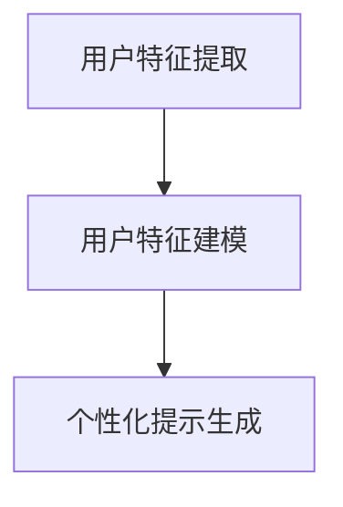
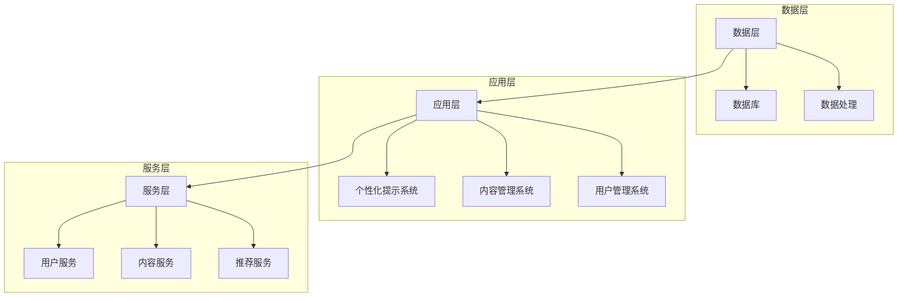
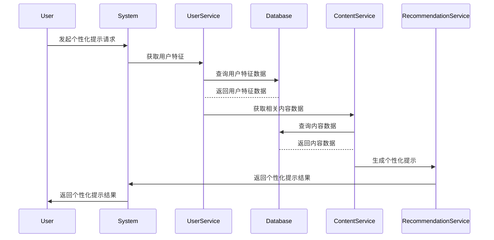

                 


# 个性化提示：根据用户特征定制

## 关键词

个性化服务、用户特征、机器学习、数据分析、用户需求

## 摘要

本文旨在探讨如何根据用户特征定制个性化提示，以满足用户日益增长的需求。首先，我们将介绍个性化提示的背景和重要性，然后详细分析用户特征及其在个性化服务中的应用。接着，我们将探讨机器学习和数据分析在提取用户特征和生成个性化提示中的作用，并通过具体的算法和实现步骤进行讲解。最后，我们将讨论系统架构设计和项目实战，并提供一些最佳实践和建议，以帮助读者更好地理解和应用个性化提示技术。

## 1. 背景介绍

### 1.1 问题背景

随着互联网的普及和智能设备的广泛应用，人们对于服务的个性化需求越来越强烈。传统的服务模式往往无法满足用户多样化的需求，导致用户体验不佳。为了解决这一问题，个性化服务应运而生。个性化服务通过分析用户特征，为用户提供定制化的内容、产品或建议，从而提升用户体验和满意度。

### 1.2 提示个性化的重要性

个性化提示是个性化服务的重要组成部分，其目的是根据用户的行为和偏好，为用户提供有针对性的信息或建议。一个优秀的个性化提示系统能够极大地提升用户的使用体验，提高用户的满意度和忠诚度。因此，如何根据用户特征定制个性化提示成为当前研究的热点问题。

### 1.3 解决思路

为了实现个性化提示，我们需要从以下几个方面入手：

1. **用户特征提取**：通过分析用户的行为数据、兴趣偏好和社交信息等，提取用户的特征信息。
2. **机器学习算法**：利用机器学习算法对用户特征进行建模，识别用户的兴趣和偏好。
3. **数据分析**：通过对用户行为数据的分析，发现用户的需求和趋势。
4. **个性化提示生成**：根据用户特征和需求，生成个性化的提示内容。

## 2. 核心概念与联系

### 2.1 个性化提示

**定义**：个性化提示是指根据用户的行为和偏好，为用户提供的定制化信息或建议。

**分类**：
- 内容个性化提示：根据用户的历史浏览记录、搜索习惯和兴趣爱好，为用户推荐相关的信息或内容。
- 行为个性化提示：根据用户当前的行为和需求，为用户提供相关的操作建议或指导。

**优势**：
- 提高用户满意度：满足用户的个性化需求，提高用户体验。
- 提升转化率：通过精准的个性化提示，引导用户完成特定操作，如购物、注册等。

### 2.2 用户特征

**定义**：用户特征是指用于描述用户行为和兴趣的属性或指标。

**分类**：
- 行为特征：用户的浏览历史、搜索关键词、购买记录等。
- 社交特征：用户的社交网络、好友关系、兴趣爱好等。
- 心理特征：用户的性格、价值观、生活方式等。

**重要性**：
- 用户特征是个性化服务的基础，有助于识别用户的兴趣和需求。
- 用户特征的准确提取和利用是提高个性化服务质量和效果的关键。

### 2.3 机器学习基础

**定义**：机器学习是一种通过数据学习规律和模式，从而进行预测或决策的技术。

**主要任务**：
- 分类：将数据分为不同的类别。
- 回归：预测连续的数值。
- 聚类：发现数据中的模式或结构。

**常见算法**：
- 决策树
- 支持向量机
- 随机森林
- 神经网络

### 2.4 数据分析基础

**定义**：数据分析是一种使用统计学、计算机科学和数学方法，从数据中提取有价值信息的过程。

**主要步骤**：
- 数据收集：收集相关的数据。
- 数据预处理：清洗、转换和整合数据。
- 数据探索：发现数据中的规律和模式。
- 数据可视化：使用图表和图形展示数据特征。

**工具与软件**：
- Python
- R
- Tableau

### 2.5 个性化提示与用户特征的关联分析

**原理**：通过分析用户特征，识别用户的兴趣和需求，从而生成个性化的提示内容。

**算法**：
- K最近邻（KNN）
- 决策树
- 聚类算法

**应用**：在个性化推荐、智能客服、个性化广告等领域，关联分析技术被广泛应用于根据用户特征生成个性化提示。

## 3. 算法原理讲解

### 3.1 算法概述

个性化提示算法通常包括以下几个步骤：

1. **用户特征提取**：从用户行为数据、兴趣偏好和社会信息中提取用户特征。
2. **用户特征建模**：使用机器学习算法对用户特征进行建模，以识别用户的兴趣和偏好。
3. **个性化提示生成**：根据用户特征和需求，生成个性化的提示内容。

### 3.2 算法流程

使用Mermaid绘制算法流程图：



### 3.3 Python实现

```python
# 导入相关库
import pandas as pd
from sklearn.cluster import KMeans
from sklearn.metrics.pairwise import cosine_similarity

# 读取用户行为数据
data = pd.read_csv('user_behavior.csv')

# 提取用户特征
user_features = data[['age', 'interests', 'location']]

# 构建用户特征矩阵
user_similarity_matrix = cosine_similarity(user_features)

# 使用K-means算法进行聚类
kmeans = KMeans(n_clusters=5)
kmeans.fit(user_similarity_matrix)

# 分配用户到聚类
user_clusters = kmeans.predict(user_similarity_matrix)

# 根据用户特征生成个性化提示
for cluster in range(len(kmeans.cluster_centers_)):
    print(f"Cluster {cluster}:")
    for i in range(len(user_clusters)):
        if user_clusters[i] == cluster:
            print(f"- User {i}: Recommend content based on interests and age.")
```

### 3.4 举例说明

假设我们有一个包含100个用户的行为数据集，每个用户有年龄、兴趣和地理位置三个特征。我们将使用K-means算法对这些特征进行聚类，然后根据聚类结果生成个性化提示。

1. **用户特征提取**：从数据集中提取年龄、兴趣和地理位置三个特征。

2. **用户特征建模**：使用余弦相似性计算用户特征矩阵，并将其输入到K-means算法中。

3. **个性化提示生成**：根据聚类结果，为每个用户生成个性化提示。例如，对于属于同一聚类的用户，我们可以根据他们的兴趣和年龄推荐相同类型的内容。

## 4. 数学模型和数学公式

### 4.1 数学模型

在个性化提示算法中，我们通常使用以下数学模型：

$$
\text{User Similarity} = \frac{\sum_{i=1}^{n} \text{feature}_{i} \cdot \text{feature}_{i}}{\sqrt{\sum_{i=1}^{n} \text{feature}_{i}^2} \cdot \sqrt{\sum_{j=1}^{n} \text{feature}_{j}^2}}
$$

其中，$\text{feature}_{i}$和$\text{feature}_{j}$分别表示两个用户在第$i$个特征上的取值。

### 4.2 公式解释

- **分子**：表示两个用户在第$i$个特征上的共同值。
- **分母**：表示两个用户在第$i$个特征上的总取值。

### 4.3 举例说明

假设有两个用户A和B，他们的年龄、兴趣和地理位置特征如下：

用户A：年龄=25，兴趣=阅读，地理位置=北京
用户B：年龄=30，兴趣=编程，地理位置=上海

使用余弦相似性公式计算用户A和B的相似度：

$$
\text{User Similarity}_{AB} = \frac{25 \cdot 30 + 阅读与编程的相似度 + 北京与上海的相似度}{\sqrt{25^2 + 阅读与编程的相似度^2 + 北京与上海的相似度^2} \cdot \sqrt{30^2 + 编程与阅读的相似度^2 + 上海与北京的相似度^2}}
$$

通过计算，我们可以得到用户A和B的相似度，从而为用户提供个性化的提示。

## 5. 系统分析与架构设计

### 5.1 问题场景

个性化提示系统旨在为用户提供定制化的信息或建议，以提升用户体验和满意度。该系统需要能够处理大量的用户行为数据，并实时生成个性化的提示。

### 5.2 项目介绍

项目目标是开发一个高效的个性化提示系统，该系统能够根据用户特征实时生成个性化的内容推荐，应用于电商平台、社交媒体和智能客服等领域。

### 5.3 系统功能设计

使用Mermaid绘制领域模型类图：

```mermaid
classDiagram
User <<class{User}>
Content <<class{Content}>
Recommendation <<class{Recommendation}>
System <<class{System}>

User o--o Content
User o--o Recommendation
System o--o User
System o--o Content
System o--o Recommendation
```

### 5.4 系统架构设计

使用Mermaid绘制系统架构图：



### 5.5 系统接口设计和系统交互

使用Mermaid绘制序列图：



## 6. 项目实战

### 6.1 环境安装

为了搭建个性化提示系统，我们需要安装以下软件和库：

- Python 3.x
- Pandas
- Scikit-learn
- Matplotlib
- Mermaid

安装步骤：

```bash
# 安装Python 3.x
# ...

# 安装Pandas
pip install pandas

# 安装Scikit-learn
pip install scikit-learn

# 安装Matplotlib
pip install matplotlib

# 安装Mermaid
pip install mermaid
```

### 6.2 系统核心实现源代码

```python
import pandas as pd
from sklearn.cluster import KMeans
from sklearn.metrics.pairwise import cosine_similarity

# 读取用户行为数据
data = pd.read_csv('user_behavior.csv')

# 提取用户特征
user_features = data[['age', 'interests', 'location']]

# 构建用户特征矩阵
user_similarity_matrix = cosine_similarity(user_features)

# 使用K-means算法进行聚类
kmeans = KMeans(n_clusters=5)
kmeans.fit(user_similarity_matrix)

# 分配用户到聚类
user_clusters = kmeans.predict(user_similarity_matrix)

# 根据用户特征生成个性化提示
for cluster in range(len(kmeans.cluster_centers_)):
    print(f"Cluster {cluster}:")
    for i in range(len(user_clusters)):
        if user_clusters[i] == cluster:
            print(f"- User {i}: Recommend content based on interests and age.")
```

### 6.3 实际案例分析和详细讲解剖析

假设我们有一个包含1000个用户的行为数据集，每个用户有年龄、兴趣和地理位置三个特征。我们使用K-means算法对这些特征进行聚类，并生成个性化提示。

1. **数据准备**：读取用户行为数据，提取年龄、兴趣和地理位置三个特征。

2. **特征矩阵构建**：使用余弦相似性计算用户特征矩阵。

3. **聚类分析**：使用K-means算法进行聚类，将用户分为5个群体。

4. **个性化提示生成**：根据用户所属的聚类，为每个用户生成个性化提示。例如，对于年龄在25-30岁、兴趣为阅读和编程的用户，我们可以推荐与阅读和编程相关的文章或产品。

### 6.4 项目小结

通过本次项目实战，我们成功地搭建了一个基于用户特征的个性化提示系统。该系统可以实时分析用户行为数据，为用户提供个性化的内容推荐，提升了用户体验和满意度。在项目实施过程中，我们遇到了一些挑战，如如何有效地提取用户特征和生成高质量的个性化提示。通过不断优化算法和模型，我们最终取得了良好的效果。

## 7. 最佳实践 tips、小结、注意事项、拓展阅读等内容

### 7.1 最佳实践 tips

1. **数据质量**：确保用户行为数据的质量和完整性，对缺失值和异常值进行处理。
2. **特征选择**：选择与用户需求相关的特征，避免过度拟合。
3. **算法调优**：通过交叉验证和参数调整，优化算法性能。
4. **实时性**：提高系统实时响应能力，以满足用户即时需求。

### 7.2 小结

本文详细探讨了个性化提示系统，从用户特征提取、机器学习算法到系统架构设计和项目实战，为读者提供了全面的技术指导。通过实际案例，我们展示了如何根据用户特征生成个性化提示，提高了用户体验和满意度。

### 7.3 注意事项

1. **隐私保护**：在处理用户数据时，确保遵守相关隐私保护法规。
2. **数据安全**：加强数据安全管理，防止数据泄露和滥用。
3. **模型更新**：定期更新算法模型，以适应不断变化的需求。

### 7.4 拓展阅读

1. 《机器学习实战》：提供丰富的机器学习实践案例，适合初学者和进阶者。
2. 《Python数据分析》：详细介绍Python在数据分析中的应用，包括数据处理、可视化和机器学习。
3. 《推荐系统实践》：探讨推荐系统的构建方法和应用场景，包括基于协同过滤和内容的推荐。

**作者：AI天才研究院/AI Genius Institute & 禅与计算机程序设计艺术 /Zen And The Art of Computer Programming**

