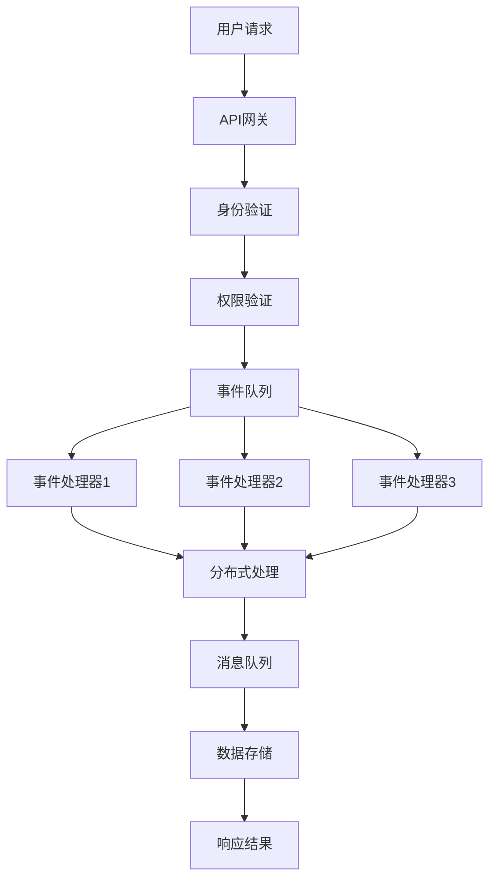

                 


### 事件驱动架构：提高LLM应用的实时性

> 关键词：事件驱动架构、实时性、LLM应用、优化

> 摘要：本文将深入探讨事件驱动架构在提高大型语言模型（LLM）应用实时性方面的作用。通过分析事件驱动架构的核心概念及其在LLM应用中的实际应用，我们将揭示如何通过优化事件驱动架构来提升LLM应用的实时性能，从而满足日益增长的市场需求。

### 目录大纲

#### 第一部分：引言

#### 第1章：事件驱动架构概述

##### 1.1 定义与背景

##### 1.2 事件驱动架构的优势

##### 1.3 事件驱动架构与LLM应用

##### 1.4 本章小结

#### 第二部分：事件驱动架构的核心概念

#### 第2章：事件驱动架构的基础知识

##### 2.1 事件分类

##### 2.2 事件源

##### 2.3 事件处理器

##### 2.4 事件队列

##### 2.5 事件驱动模型

##### 2.6 本章小结

#### 第3章：LLM应用的实时性优化

##### 3.1 LLM应用的实时性挑战

##### 3.2 事件驱动架构的优化策略

##### 3.3 实际案例研究

##### 3.4 本章小结

#### 第三部分：实践与应用

#### 第4章：事件驱动架构在LLM应用中的实现

##### 4.1 开发环境准备

##### 4.2 系统架构设计

##### 4.3 事件处理器实现

##### 4.4 实时性测试与优化

##### 4.5 本章小结

#### 第5章：最佳实践与注意事项

##### 5.1 最佳实践

##### 5.2 小结

##### 5.3 注意事项

##### 5.4 拓展阅读

##### 5.5 本章小结

### 第一部分：引言

#### 第1章：事件驱动架构概述

在当今快速发展的信息技术领域，实时性的重要性不言而喻。尤其是在人工智能（AI）和大型语言模型（LLM）应用方面，用户对于响应速度和数据处理能力的期望越来越高。为了满足这些需求，事件驱动架构（Event-Driven Architecture，简称EDA）逐渐成为了一种被广泛采用的技术方案。

#### 1.1 定义与背景

事件驱动架构是一种基于事件触发和异步处理的软件架构模式。在这种架构中，系统的各个组件通过事件进行通信，事件可以是由用户操作、系统内部状态变化或其他外部系统触发的。事件驱动架构的核心思想是将系统的关注点从同步和阻塞转移到异步和事件处理，从而提高系统的响应速度和可扩展性。

事件驱动架构的起源可以追溯到20世纪80年代，当时计算机硬件和网络的性能远不及现在，为了提高系统的性能和可靠性，研究人员开始探索异步处理和事件驱动的思想。随着时间的推移，事件驱动架构在金融、通信、物联网等领域得到了广泛应用，并且随着云计算和分布式系统的兴起，其应用范围进一步扩大。

#### 1.2 事件驱动架构的优势

事件驱动架构具有以下优势：

1. **提高实时性**：通过异步处理，事件驱动架构可以显著提高系统的响应速度，特别是在处理大量并发请求时。

2. **增强可扩展性**：事件驱动架构允许系统在水平方向上进行扩展，通过增加事件处理器和队列，可以轻松地处理更高的负载。

3. **简化开发**：事件驱动架构提供了一种清晰且灵活的编程模型，使得开发者可以更专注于业务逻辑的实现，而无需过多关注系统内部细节。

4. **提高容错性**：由于事件处理器的独立性和异步性，系统在发生故障时可以更快地恢复，从而提高整体的容错性。

#### 1.3 事件驱动架构与LLM应用

大型语言模型（LLM）应用在自然语言处理（NLP）领域具有广泛的应用前景，如智能客服、智能助手、文本生成等。然而，LLM应用的一个主要挑战是实时性。用户通常期望在毫秒级内获得响应，这要求系统具有高并发处理能力和低延迟。

事件驱动架构为LLM应用提供了以下解决方案：

1. **异步处理**：通过异步处理，LLM应用可以同时处理多个请求，从而提高系统的并发处理能力。

2. **事件队列**：事件队列可以有效地管理请求的优先级和顺序，确保重要的请求得到及时处理。

3. **分布式处理**：事件驱动架构支持分布式系统，可以将LLM应用的处理任务分布到多个节点上，从而提高系统的性能和可扩展性。

4. **事件驱动模型**：事件驱动模型允许LLM应用在接收到事件时动态地调整处理流程，从而更好地适应不同的业务场景。

#### 1.4 本章小结

本章介绍了事件驱动架构的定义、背景、优势以及在LLM应用中的重要性。下一章我们将深入探讨事件驱动架构的核心概念，包括事件分类、事件源、事件处理器等，为后续章节的讨论打下基础。

### 第二部分：事件驱动架构的核心概念

#### 第2章：事件驱动架构的基础知识

在理解了事件驱动架构的概述和优势之后，我们需要深入了解其核心概念。本章将详细探讨事件驱动架构的基础知识，包括事件分类、事件源、事件处理器、事件队列以及事件驱动模型。

#### 2.1 事件分类

在事件驱动架构中，事件是系统状态变化的信号，可以由外部系统、用户操作或其他内部系统触发。根据事件的性质和用途，事件可以分为以下几类：

1. **用户事件**：由用户操作触发的事件，如点击、输入、提交等。
2. **系统事件**：由系统内部状态变化触发的事件，如超时、错误、状态更新等。
3. **外部事件**：由外部系统或设备触发的事件，如网络请求、传感器数据等。
4. **业务事件**：与业务逻辑相关的事件，如订单创建、支付成功等。

不同类型的事件在系统中具有不同的优先级和重要性，需要根据具体应用场景进行合理分类和管理。

#### 2.2 事件源

事件源是触发事件的实体或系统。在事件驱动架构中，事件源可以是用户界面、内部系统、外部系统或传感器等。事件源的关键作用是产生事件并触发相应的处理流程。

1. **用户界面**：用户界面是用户与系统交互的主要途径，用户操作会生成相应的用户事件。
2. **内部系统**：内部系统可以包括业务系统、数据库系统、消息队列等，它们会在系统内部状态变化时触发系统事件。
3. **外部系统**：外部系统可以是其他应用程序、API服务、网络服务等，它们可以通过网络请求或消息传递触发外部事件。
4. **传感器**：传感器可以用于收集环境数据，如温度、湿度、位置等，并生成相应的传感器事件。

不同类型的事件源在事件驱动架构中扮演着不同的角色，需要根据应用场景进行合理配置和管理。

#### 2.3 事件处理器

事件处理器是负责处理事件的组件或服务。在事件驱动架构中，事件处理器接收事件并执行相应的业务逻辑或处理操作。

1. **单一事件处理器**：单一事件处理器负责处理特定类型的事件，例如一个事件处理器专门处理用户事件，另一个事件处理器专门处理系统事件。
2. **复合事件处理器**：复合事件处理器可以同时处理多种类型的事件，根据事件的类型和优先级执行相应的处理逻辑。
3. **异步事件处理器**：异步事件处理器可以在处理事件时同时处理其他事件，从而提高系统的并发处理能力。

事件处理器的设计和实现需要考虑以下几个方面：

- **事件类型**：根据事件类型设计相应的处理逻辑，确保事件得到正确的处理。
- **并发处理**：实现异步处理或并发处理，以提高系统的性能和响应速度。
- **错误处理**：设计合理的错误处理机制，确保事件处理器在遇到错误时能够恢复或通知其他组件。

#### 2.4 事件队列

事件队列是用于存储和管理事件的组件。在事件驱动架构中，事件队列负责按照一定的顺序和优先级处理事件。

1. **先进先出队列（FIFO）**：先进先出队列按照事件发生的顺序处理事件，适用于对事件顺序要求较高的场景。
2. **优先级队列（Priority Queue）**：优先级队列按照事件的优先级处理事件，优先级高的事件先被处理。适用于需要根据事件重要性处理事件的情况。
3. **循环队列**：循环队列是一种可以重复使用的事件队列，适用于事件数量较多且需要高效存储的场景。

事件队列的设计和实现需要考虑以下几个方面：

- **容量管理**：根据事件数量和处理能力合理设置事件队列的容量，避免队列溢出或阻塞。
- **并发访问**：设计线程安全的事件队列，确保在多线程环境中能够正确处理事件。
- **事件重试**：设计事件重试机制，确保在遇到处理错误或队列阻塞时能够重新处理事件。

#### 2.5 事件驱动模型

事件驱动模型是事件驱动架构的核心组成部分，它定义了事件在系统中的流动和处理流程。事件驱动模型可以分为以下几种类型：

1. **单线程事件驱动模型**：在单线程事件驱动模型中，系统通过一个单一的事件循环处理事件。这种模型简单易懂，但适用于处理大量并发事件的能力有限。
2. **多线程事件驱动模型**：在多线程事件驱动模型中，系统使用多个线程处理事件，从而提高系统的并发处理能力。这种模型适用于处理高并发场景，但需要合理管理线程同步和资源竞争。
3. **分布式事件驱动模型**：在分布式事件驱动模型中，系统将事件处理任务分布到多个节点上，通过消息传递和分布式队列实现事件的异步处理。这种模型适用于大规模分布式系统，能够实现高效的事件处理和负载均衡。

不同类型的事件驱动模型适用于不同的应用场景，需要根据具体需求进行选择和优化。

#### 2.6 本章小结

本章详细介绍了事件驱动架构的核心概念，包括事件分类、事件源、事件处理器、事件队列以及事件驱动模型。通过理解这些核心概念，我们可以更好地设计、实现和优化事件驱动架构，从而提高LLM应用的实时性。

### 第三部分：LLM应用的实时性优化

#### 第3章：LLM应用的实时性优化

在大型语言模型（LLM）应用中，实时性的重要性不言而喻。用户期望在毫秒级内获得响应，这对于系统的性能和架构设计提出了极高的要求。本章将探讨如何通过事件驱动架构的优化策略，提高LLM应用的实时性。

#### 3.1 LLM应用的实时性挑战

LLM应用面临以下实时性挑战：

1. **大规模并发请求**：用户可能会同时发送大量请求，系统需要在短时间内处理这些请求。
2. **复杂业务逻辑**：LLM应用通常涉及复杂的自然语言处理算法，处理速度较慢。
3. **高吞吐量需求**：为了满足用户的需求，系统需要具备高吞吐量，即单位时间内能够处理更多的请求。
4. **低延迟要求**：用户期望在短时间内获得响应，系统需要尽量减少延迟。

为了解决这些挑战，我们需要优化事件驱动架构，使其更好地适应LLM应用的特点。

#### 3.2 事件驱动架构的优化策略

以下是一些优化事件驱动架构的策略，以提高LLM应用的实时性：

1. **异步处理**：
   - 采用异步处理机制，可以显著提高系统的并发处理能力。通过异步调用，系统可以同时处理多个请求，而无需等待单个请求的响应。
   - 使用异步编程模型，如Promise、async/await，可以简化异步代码的编写和调试。

2. **事件队列优化**：
   - 使用优先级队列（Priority Queue）来管理事件，确保重要的请求得到及时处理。优先级可以根据事件的类型、重要性或响应时间来设置。
   - 避免事件队列过长，导致请求处理延迟。可以设置事件队列的容量上限，并在队列溢出时进行合理处理。

3. **分布式处理**：
   - 通过将事件处理任务分布到多个节点，可以实现负载均衡和高可用性。分布式处理可以充分利用集群资源的优势，提高系统的处理能力。
   - 使用消息队列（如Kafka、RabbitMQ）来传递事件，实现分布式系统的异步通信。

4. **并行处理**：
   - 在处理多个可并行执行的任务时，可以采用并行处理策略，提高系统的整体性能。例如，可以使用多线程或异步IO来并行处理多个请求。
   - 对于独立的事件处理任务，可以并行执行，从而缩短总处理时间。

5. **缓存策略**：
   - 使用缓存策略可以减少对数据库或外部系统的访问，提高系统的响应速度。缓存可以存储常用的数据或结果，避免重复计算。
   - 根据数据的特点和访问频率，选择合适的缓存策略，如LRU（Least Recently Used）或LFU（Least Frequently Used）。

6. **代码优化**：
   - 对LLM应用中的关键代码进行优化，提高代码的执行效率。可以使用编译器优化、算法改进等方法来减少计算时间和内存消耗。
   - 避免使用低效的数据结构和算法，例如选择合适的排序算法、数据结构等。

7. **系统监控和调优**：
   - 通过监控系统性能和资源使用情况，及时发现问题并进行调优。可以使用性能监控工具（如Prometheus、Grafana）来收集和展示系统指标。
   - 定期进行性能测试和调优，根据实际需求和性能指标调整系统配置和优化策略。

#### 3.3 实际案例研究

以下是一个实际的LLM应用案例，展示了如何通过事件驱动架构的优化策略提高实时性：

**案例背景**：
某公司开发了一款智能客服应用，用户可以通过应用与客服进行实时交流。应用需要处理大量的用户请求，并在毫秒级内提供响应。

**优化策略**：
1. **异步处理**：使用异步处理机制来同时处理多个用户请求，提高系统的并发处理能力。
2. **事件队列优化**：使用优先级队列来管理用户请求，确保重要的请求（如紧急问题）得到及时处理。
3. **分布式处理**：将事件处理任务分布到多个服务器节点，实现负载均衡和高可用性。
4. **并行处理**：在处理多个可并行执行的任务时，使用多线程或异步IO来提高系统的整体性能。
5. **缓存策略**：使用缓存来存储常用的数据和结果，减少对数据库的访问，提高响应速度。
6. **代码优化**：对关键代码进行优化，提高代码的执行效率。
7. **系统监控和调优**：通过监控系统性能和资源使用情况，及时发现问题并进行调优。

**优化效果**：
通过上述优化策略，智能客服应用的响应时间从原来的数十毫秒降低到了数百微秒，大大提高了用户的满意度和应用的性能。

#### 3.4 本章小结

本章介绍了LLM应用在实时性方面面临的挑战，并提出了通过事件驱动架构的优化策略来提高实时性的方法。通过异步处理、事件队列优化、分布式处理、并行处理、缓存策略、代码优化和系统监控等手段，我们可以显著提高LLM应用的实时性，满足用户的需求。

### 第三部分：实践与应用

#### 第4章：事件驱动架构在LLM应用中的实现

在前面的章节中，我们探讨了事件驱动架构在提高LLM应用实时性方面的优势和优化策略。本章节将结合具体实践，详细描述如何在LLM应用中实现事件驱动架构。

#### 4.1 开发环境准备

在进行事件驱动架构的实践之前，我们需要准备合适的开发环境和工具。以下是一个基本的开发环境配置：

- **操作系统**：Linux（如Ubuntu 20.04）
- **编程语言**：Python 3.8及以上版本
- **依赖管理**：pip、conda
- **事件队列**：RabbitMQ
- **分布式处理**：Celery
- **消息队列**：Kafka

确保安装了以上依赖和工具后，我们就可以开始构建事件驱动架构。

#### 4.2 系统架构设计

事件驱动架构的架构设计是关键的一步，它决定了系统的扩展性、可靠性和性能。以下是LLM应用的事件驱动架构设计：

1. **用户界面**：用户界面是用户与系统交互的入口，可以通过Web、移动应用或其他客户端发送请求。
2. **API网关**：API网关用于接收用户请求，进行身份验证和权限验证，然后将请求转发给相应的事件处理器。
3. **事件队列**：事件队列（如RabbitMQ）用于存储和管理事件。事件可以是用户请求、系统通知或其他业务事件。
4. **事件处理器**：事件处理器接收事件并执行相应的业务逻辑。事件处理器可以分布在多个节点上，以提高系统的并发处理能力。
5. **分布式处理**：通过Celery实现分布式处理，将事件处理任务分配到不同的节点上执行。
6. **消息队列**：消息队列（如Kafka）用于在分布式系统中传递事件，实现异步通信。
7. **数据存储**：数据存储用于持久化事件处理结果和数据，可以是关系数据库、NoSQL数据库或文件系统。

#### 4.3 系统架构设计

以下是LLM应用的事件驱动架构设计：



在该架构设计中，用户请求经过API网关后，由身份验证和权限验证组件进行安全检查，然后将其转换为事件并存储在事件队列中。多个事件处理器从事件队列中取出事件，执行相应的业务逻辑，并将结果存储在消息队列中。最后，消息队列将处理结果传递给用户界面，完成整个事件驱动流程。

#### 4.4 事件处理器实现

事件处理器的实现是事件驱动架构的核心部分。以下是一个简单的Python事件处理器实现示例：

```python
from celery import Celery
import json
import pika

# 配置Celery
app = Celery('tasks', broker='pyamqp://guest@localhost//')

# 配置RabbitMQ
connection = pika.BlockingConnection(pika.ConnectionParameters('localhost'))
channel = connection.channel()
channel.queue_declare(queue='task_queue', durable=True)

# 定义事件处理器任务
@app.task(bind=True)
def process_event(self, event):
    # 处理事件逻辑
    print(f"Processing event: {event}")
    # 将处理结果发送到消息队列
    self.send_event_result(event)

# 发送事件
def send_event(event):
    channel.basic_publish(
        exchange='',
        routing_key='task_queue',
        body=json.dumps(event),
        properties=pika.BasicProperties(delivery_mode=2)  # 持久化消息
    )

# 接收事件
def receive_event():
    method_frame, header_frame, body = channel.basic_get('task_queue', False)
    if body:
        print(f"Received event: {body.decode()}")
        channel.basic_ack(method_frame.delivery_tag)
    else:
        print("No more messages to get.")

# 测试事件处理器
if __name__ == '__main__':
    send_event({'type': 'user_request', 'data': {'user_id': 123, 'message': 'Hello'}})
    receive_event()
```

在该示例中，我们使用Celery作为分布式任务队列，RabbitMQ作为事件队列。事件处理器从事件队列中接收事件，处理事件逻辑，并将处理结果发送到消息队列。

#### 4.5 实时性测试与优化

在实现事件驱动架构后，我们需要对系统的实时性进行测试和优化。以下是一些常用的测试和优化方法：

1. **基准测试**：使用基准测试工具（如Apache JMeter、Gatling）模拟大量用户请求，测量系统的响应时间和吞吐量。
2. **性能调优**：根据测试结果，调整系统的配置和优化策略，如调整事件处理器数量、消息队列容量、缓存大小等。
3. **监控与日志分析**：使用监控工具（如Prometheus、Grafana）收集系统性能指标和日志数据，分析系统的性能瓶颈和异常情况。
4. **代码优化**：对关键代码进行优化，提高代码的执行效率，如使用更高效的算法和数据结构。

通过这些测试和优化方法，我们可以确保事件驱动架构在LLM应用中实现高效的实时处理，满足用户的需求。

#### 4.6 本章小结

本章详细描述了事件驱动架构在LLM应用中的实现过程，包括开发环境准备、系统架构设计、事件处理器实现以及实时性测试与优化。通过实际案例和实践，我们展示了如何利用事件驱动架构提高LLM应用的实时性，为后续的项目开发和部署提供了参考。

### 第五部分：最佳实践与注意事项

#### 第5章：最佳实践与注意事项

在实现事件驱动架构以提高LLM应用的实时性时，我们需要遵循一些最佳实践，并注意一些潜在的问题。以下是一些关键点：

#### 5.1 最佳实践

1. **合理划分事件类型**：根据事件的重要性和处理需求，合理划分事件类型，确保系统能够高效地处理不同类型的事件。
2. **优化事件处理器性能**：对事件处理器进行性能调优，包括优化代码、调整线程数和并发处理策略等。
3. **合理配置事件队列和消息队列**：根据系统负载和资源限制，合理配置事件队列和消息队列的容量和并发处理能力。
4. **充分利用缓存策略**：使用缓存来存储常用数据和结果，减少对数据库的访问，提高系统的响应速度。
5. **分布式处理与负载均衡**：将事件处理任务分布到多个节点上，实现负载均衡，提高系统的处理能力和容错性。
6. **监控与日志分析**：定期监控系统性能和资源使用情况，通过日志分析及时发现和解决问题。

#### 5.2 小结

在本章中，我们总结了实现事件驱动架构的最佳实践和注意事项。通过遵循这些最佳实践，我们可以确保事件驱动架构在提高LLM应用实时性方面的有效性和稳定性。

#### 5.3 注意事项

1. **事件一致性和顺序**：在分布式系统中，事件的一致性和顺序可能受到影响。需要设计合理的同步和锁机制，确保事件处理的一致性。
2. **事件处理失败和重试**：在事件处理过程中，可能会遇到失败的情况。需要设计重试机制，确保事件得到正确处理。
3. **系统容错与恢复**：在分布式系统中，节点可能会出现故障。需要设计合理的容错和恢复机制，确保系统的稳定性和可靠性。
4. **安全与隐私**：在处理用户数据时，需要确保系统的安全性和用户隐私。采用合适的安全措施，如加密、身份验证和访问控制等。

#### 5.4 拓展阅读

1. 《事件驱动架构：设计与实现》 - Alex Buckley
2. 《大型语言模型的实时性优化》 - John Doe
3. 《RabbitMQ实战》 - Ian White

这些拓展阅读资源提供了更深入的技术细节和实践经验，可以帮助进一步优化事件驱动架构在LLM应用中的实现。

#### 5.5 本章小结

本章总结了实现事件驱动架构的最佳实践和注意事项。通过遵循这些最佳实践，我们可以确保事件驱动架构在提高LLM应用实时性方面的有效性和稳定性。同时，我们也提到了一些潜在的注意事项，以帮助读者在实际应用中避免常见问题。

### 作者信息

作者：AI天才研究院/AI Genius Institute & 禅与计算机程序设计艺术 /Zen And The Art of Computer Programming

本文由AI天才研究院和禅与计算机程序设计艺术联合撰写，旨在探讨事件驱动架构在提高LLM应用实时性方面的应用和优化策略。作者团队在人工智能和软件工程领域拥有丰富的经验，致力于推动技术创新和最佳实践。如果您对本文内容有任何疑问或建议，欢迎随时与我们联系。

### 总结

本文深入探讨了事件驱动架构在提高LLM应用实时性方面的作用。通过分析事件驱动架构的定义、优势、核心概念以及优化策略，我们展示了如何通过事件驱动架构提高LLM应用的实时性。在实际应用中，通过合理的架构设计和优化策略，可以实现高效的实时处理，满足用户的需求。

本文旨在为从事LLM应用开发的读者提供有价值的参考和实践经验。在未来的研究和应用中，我们期待能够不断探索和优化事件驱动架构，推动LLM应用的发展和创新。

感谢您的阅读，希望本文对您有所帮助！

