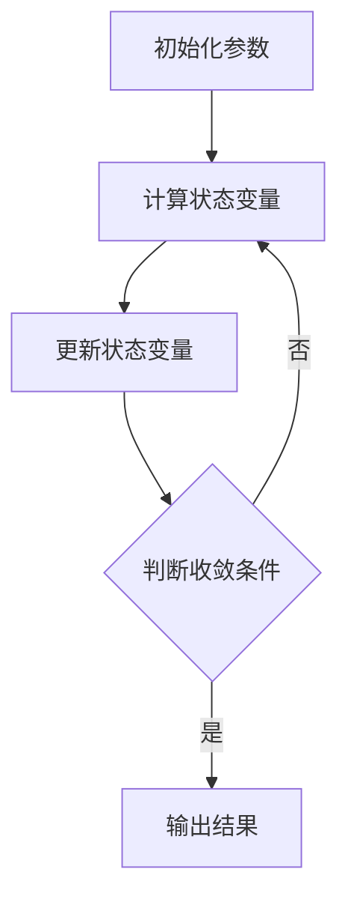

                 


### 引言与背景

在现代科学和工程领域，线性系统理论和混沌理论是我们理解复杂系统的两个重要工具。线性系统理论为我们在各种实际应用中提供了一种简单而强大的方法来描述和预测系统的动态行为，例如在机械工程、电子工程和经济学中。而混沌理论则揭示了即使是最简单的非线性系统也可能展现出不可预测的复杂行为，这对于我们理解自然界和社会现象中的不确定性具有重要意义。

**本文的目的**是探讨从线性系统到混沌理论的转变，深入理解不可预测性的科学基础。我们将通过以下步骤展开讨论：

1. **线性系统的基本概念**：首先，我们将介绍线性系统的基本概念，包括线性微分方程和线性代数中的特征值理论，并探讨这些概念在各种领域的应用。
2. **混沌理论的初步了解**：接下来，我们将探讨混沌理论的起源、基本原理和它在科学领域的应用。
3. **线性系统的可预测性**：我们将深入讨论线性系统中的可预测性特征及其局限性。
4. **混沌理论的应用**：然后，我们将探讨混沌理论在不同科学领域中的实际应用。
5. **混沌系统的控制与同步**：我们将讨论如何控制混沌系统以及如何实现混沌系统的同步。
6. **线性动态与非线性的过渡**：我们将研究从线性动态到非线性动态的转变，并讨论其意义。
7. **结论与未来方向**：最后，我们将总结关键见解并提出未来研究的方向。

本文将通过逻辑清晰、结构紧凑的方式，逐步引导读者理解线性系统和混沌理论，为我们在复杂系统研究和应用中提供有力的理论基础。

#### 线性系统的基本概念

线性系统理论是研究线性微分方程和线性代数系统的数学分支，其在工程、物理、经济学等领域有着广泛的应用。线性系统的基本概念包括线性微分方程和线性代数中的特征值理论。

**线性微分方程**是描述系统动态行为的基本数学工具。一个n阶线性微分方程可以表示为：

$$a_n \frac{d^ny(t)}{dt^n} + a_{n-1} \frac{d^{n-1}y(t)}{dt^{n-1}} + \cdots + a_1 \frac{dy(t)}{dt} + a_0 y(t) = g(t)$$

其中，$a_0, a_1, \ldots, a_n$ 是常数系数，$g(t)$ 是非齐次项，表示外部激励或输入。$y(t)$ 是未知函数，表示系统的动态响应。

**线性代数**中的特征值理论在分析线性系统时同样重要。对于一个n阶线性系统，其状态空间形式可以表示为：

$$\frac{d\mathbf{x}(t)}{dt} = A\mathbf{x}(t) + B\mathbf{u}(t)$$

$$y(t) = C\mathbf{x}(t) + D\mathbf{u}(t)$$

其中，$\mathbf{x}(t)$ 是系统的状态向量，$A$ 是系统矩阵，$B$ 和 $D$ 分别是输入矩阵和输出矩阵，$\mathbf{u}(t)$ 是输入向量，$y(t)$ 是输出。

特征值理论的核心是找到系统矩阵$A$的特征值和特征向量。这些特征值和特征向量可以用来分析系统的动态行为，包括稳定性和响应特性。

**线性代数中的特征值和特征向量**：

给定一个方阵$A$，其特征值$\lambda$满足以下特征方程：

$$det(A - \lambda I) = 0$$

其中，$I$ 是单位矩阵。对于每个特征值$\lambda$，存在一个对应的特征向量$\mathbf{v}$，满足：

$$(A - \lambda I)\mathbf{v} = 0$$

这些特征值和特征向量可以帮助我们理解系统的本质特性。例如，系统的特征值可以告诉我们系统的稳定性。如果所有特征值的实部均为负，则系统是渐进稳定的；如果存在正实部特征值，则系统是不稳定的。

**应用**：线性系统理论和特征值理论在各种实际应用中具有重要意义。例如，在机械工程中，线性系统理论可以用来分析振动系统、弹簧质量系统等；在电子工程中，线性代数和特征值理论可以用来设计滤波器、分析电路等；在经济学中，线性系统理论可以用来模拟市场动态、分析金融时间序列等。

通过理解线性系统的基本概念和数学模型，我们可以更好地理解和预测复杂系统的行为，为实际应用提供有力的理论支持。接下来，我们将进一步探讨混沌理论的基本概念和起源。

### 混沌理论的基本概念

混沌理论是研究复杂动态系统行为的一个数学分支，主要关注那些初始条件敏感、具有长期行为的系统。混沌现象最早可以追溯到19世纪，然而，其系统性的研究和理论化则是在20世纪中后期才逐步发展起来的。

#### 混沌理论的起源

混沌理论的起源可以追溯到几个关键的研究和发现。首先，Poincaré在19世纪末对三体问题的研究揭示了混沌现象的存在。接着，Lorenz在20世纪50年代通过对大气流动模型的数值模拟，发现了所谓的“蝴蝶效应”——即初始条件的小幅变化可能导致长时间后系统的巨大差异。此外，Julia和Fatou在复平面上的研究也为混沌理论的兴起奠定了基础。

#### 混沌现象的定义和特征

混沌现象通常具有以下几个特征：

1. **初始条件敏感性**：混沌系统的状态对初始条件非常敏感，即使初始条件的小幅变化也可能导致系统行为的巨大差异。
2. **长期行为的不可预测性**：尽管混沌系统的行为看似随机，但它们实际上遵循确定的数学规律。混沌系统具有长期的复杂行为，但无法准确预测其未来状态。
3. **确定性**：混沌现象是确定性的，即混沌系统的行为完全由初始条件和系统方程决定，没有外部随机因素的干扰。

#### 混沌现象的数学描述

在数学上，混沌现象可以通过几个不同的方法来描述：

1. **相空间轨迹**：相空间是系统状态变量的集合，通过绘制系统在相空间中的轨迹，可以直观地观察到混沌现象。Lorenz吸引子就是一个典型的相空间轨迹，其呈现出复杂的、非周期的行为。
2. **李雅普诺夫指数**：李雅普诺夫指数是衡量系统稳定性的重要指标。对于一个混沌系统，其李雅普诺夫指数通常为正，这意味着系统的轨道发散，具有混沌性质。
3. **奇异吸引子**：奇异吸引子是混沌系统的一个关键特征，它是一个没有内部结构的吸引区域，系统状态点最终会趋向于这个区域，但轨道在其内部呈现复杂的结构。

#### 混沌现象的应用

混沌理论在多个科学和工程领域都有重要应用：

1. **气象学**：混沌理论可以帮助我们理解大气系统的复杂行为，包括天气预报中的不确定性。
2. **生物学**：混沌理论在生物系统中的应用包括生态模型、种群动态等。
3. **经济学**：混沌理论可以用来模拟金融市场的波动，分析经济系统的复杂性。
4. **工程学**：在机械工程和电子工程中，混沌理论可以帮助我们理解系统的稳定性，设计更稳定和鲁棒的系统。

通过了解混沌理论的基本概念和起源，我们可以更好地理解复杂系统的行为。在接下来的部分中，我们将进一步探讨线性系统中的可预测性特征及其局限性。

#### 线性系统的可预测性特征及其局限性

线性系统理论在工程、物理和经济学等领域中有着广泛应用，其主要优点在于其良好的可预测性。线性系统的可预测性特征体现在以下几个方面：

1. **线性微分方程的解法**：线性微分方程可以通过多种数学方法求解，如拉普拉斯变换、矩阵指数等。这些解法使得我们能够精确地预测线性系统的动态行为。
2. **稳定性分析**：线性系统理论提供了多种稳定性分析方法，如李雅普诺夫稳定性理论和矩阵特征值分析。通过这些方法，我们可以判断线性系统的稳定性，进而预测其长期行为。
3. **叠加原理**：线性系统满足叠加原理，即多个输入的组合响应等于各个输入单独作用的响应之和。这大大简化了系统的分析过程，使得我们能够通过分解复杂输入来预测系统的行为。

然而，线性系统的可预测性也存在着局限性：

1. **非线性因素的引入**：当系统中存在非线性因素时，线性模型将不再适用。非线性系统往往表现出复杂的行为，如混沌现象，这使得其预测变得非常困难。
2. **初始条件的不确定性**：线性系统对初始条件非常敏感，即使初始条件的小幅变化也可能导致系统行为的巨大差异。这意味着在实际情况中，由于测量误差和外部干扰，我们很难精确预测线性系统的行为。
3. **计算复杂度**：对于高维线性系统，求解其动态行为需要大量的计算资源。在实际应用中，这可能导致计算成本过高，限制了线性系统的可预测性。

为了克服线性系统可预测性的局限性，我们需要引入非线性系统理论和混沌理论。非线性系统理论提供了一种描述复杂系统行为的方法，混沌理论则揭示了即使是最简单的非线性系统也可能表现出不可预测的行为。通过理解和应用这些理论，我们可以更好地应对现实世界中复杂系统的挑战。

### 混沌理论的应用

混沌理论作为研究复杂动态系统行为的数学工具，在多个科学和工程领域都有着重要的应用。以下是几个典型的应用场景及其意义：

#### 气象学

气象学是一个典型的混沌系统，由于大气中各种气象因素之间存在复杂的相互作用，即使是最微小的变化也可能导致天气的巨大差异。混沌理论在气象学中的应用主要体现在对天气预测的不确定性分析上。通过研究大气系统的混沌特性，我们可以更好地理解天气变化的不可预测性，并改进气象模型的预测能力。

例如，Lorenz吸引子就是气象混沌现象的一个经典例子。Lorenz模型描述了大气系统中的温度和湿度变化，其轨迹在相空间中呈现出复杂的、非周期的行为。虽然我们无法精确预测具体某一天的天气，但混沌理论可以帮助我们了解长期天气趋势，提高短期天气预报的准确性。

#### 生物学

在生物学中，混沌理论同样有着广泛的应用。生物系统中的许多现象，如种群动态、神经网络活动等，都表现出混沌特性。通过混沌理论，我们可以更深入地理解生物系统的复杂行为。

例如，在种群生态学中，Logistic方程描述了种群数量随时间的变化。当参数取值在一定范围内时，Logistic方程会产生混沌行为，这意味着种群数量的变化具有长期不可预测性。这一发现对于理解生态系统的稳定性和物种灭绝风险具有重要意义。

#### 经济学

经济学中的金融市场也是一个混沌系统，股票价格、利率等经济指标的变化表现出高度的不确定性。混沌理论在经济学中的应用可以帮助我们分析金融市场的波动，预测经济趋势。

例如，股票市场的价格波动可以通过Logistic映射等混沌模型来模拟。虽然股票价格的短期波动难以预测，但混沌理论可以揭示长期趋势和周期性变化，为投资策略提供参考。

#### 工程学

在工程学领域，混沌理论的应用主要体现在系统设计和稳定性分析中。例如，在机械工程中，混沌现象可以用来分析振动系统的稳定性，设计更稳定的机械结构。在电子工程中，混沌理论可以帮助我们理解电路的动态行为，设计更可靠和鲁棒的电子系统。

例如，混沌电路是一个典型的研究对象，其输出信号在相空间中呈现出复杂的轨迹。通过分析混沌电路的相空间轨迹，我们可以优化电路设计，提高系统的稳定性和鲁棒性。

总之，混沌理论在气象学、生物学、经济学和工程学等领域都有着重要的应用。通过理解和应用混沌理论，我们可以更好地应对复杂系统中的不确定性和挑战。

### 混沌系统的控制与同步

混沌系统由于其内在的复杂性和不确定性，在实际应用中常常需要通过控制与同步方法来稳定其行为。以下是一些关键方法：

#### 混沌控制

混沌控制是指通过外部输入调整系统参数或状态，使混沌系统趋向稳定状态。以下是一些常用的混沌控制方法：

1. **线性反馈控制**：通过引入线性反馈机制，根据系统状态的变化调整输入，以达到稳定目标状态。
2. **滑模控制**：通过设计滑模面，使系统状态沿滑模面运动，最终达到稳定状态。
3. **最优控制**：利用最优控制理论，通过优化控制策略，使系统达到最佳性能。

**应用示例**：在一个Lorenz混沌系统中，通过引入线性反馈控制，可以使其从混沌状态稳定到一个周期状态。具体方法是在系统方程中添加一个线性反馈项，通过调整反馈系数，使得系统的相轨迹逐渐收敛到一个稳定的点或周期轨道。

#### 混沌同步

混沌同步是指将两个或多个混沌系统连接起来，通过相互影响使它们的相轨迹在相空间中重合，实现同步状态。以下是一些常用的混沌同步方法：

1. **驱动-响应同步**：通过外部驱动信号，使一个混沌系统的行为受到另一个混沌系统的驱动，从而实现同步。
2. **非驱动-非响应同步**：不依赖外部驱动信号，通过系统内部参数调整实现同步。
3. **自适应同步**：通过自适应控制算法，使两个混沌系统在动态过程中逐步实现同步。

**应用示例**：在通信系统中，通过实现混沌同步，可以增强信号传输的抗干扰能力。例如，在光纤通信中，利用混沌同步技术，可以抑制信道噪声，提高信号质量。

#### 混沌控制与同步的意义

混沌控制与同步在多个领域具有广泛的应用意义：

1. **信号处理**：混沌控制与同步可以提高信号处理系统的鲁棒性和稳定性，增强信号传输的抗干扰能力。
2. **保密通信**：混沌同步技术可以用于设计安全的混沌通信系统，通过混沌系统的复杂性和随机性实现信息加密和解密。
3. **物理系统**：混沌控制与同步可以帮助设计更稳定的物理系统，例如，在机械振动控制和电子电路设计中，混沌同步技术可以提高系统的稳定性和可靠性。

总之，混沌控制与同步为复杂系统的稳定性和可靠性提供了新的解决方案，具有重要的理论和实际应用价值。

### 线性动态与非线性的过渡

从线性动态到非线性动态的转变是一个关键的科学问题，它揭示了复杂系统的本质特性。线性动态系统在许多工程和科学应用中发挥着重要作用，但它们往往无法捕捉复杂系统的非线性特征。理解这一过渡过程不仅对于理论分析至关重要，而且在实际工程和科学应用中也具有重要意义。

#### 线性与非线性的基本特征

线性系统的动态行为遵循叠加原理，即系统响应是各个输入的线性组合。这意味着我们可以将复杂的输入分解为简单的部分，然后分别求解每个部分的响应，最后再叠加得到总响应。线性系统通常具有简单的数学描述，如线性微分方程和线性代数模型，这些模型便于分析和预测。

相比之下，非线性系统则不满足叠加原理，其动态行为复杂且难以预测。非线性系统中的响应依赖于所有输入的相互作用，这使得系统的行为难以分解和预测。非线性系统的数学描述通常涉及非线性微分方程和非线性代数模型，这些方程通常没有解析解，需要借助数值方法进行求解。

#### 转变过程的数学描述

从线性动态到非线性动态的转变可以通过几个数学过程来描述：

1. **参数的微小变化**：在线性动态系统中，通过引入一个小的非线性项，系统可能会从线性行为过渡到非线性行为。例如，一个简单的线性振子方程可以添加一个非线性恢复力项，使其行为从简谐振动过渡到复杂的非线性振动。

   $$ m\frac{d^2x}{dt^2} + c\frac{dx}{dt} + kx = f(t) + \epsilon N(x) $$

   其中，$m$ 是质量，$c$ 是阻尼系数，$k$ 是弹性系数，$f(t)$ 是外部激励，$\epsilon$ 是一个小的参数，$N(x)$ 是非线性恢复力。

2. **系统状态的演化**：在非线性系统中，初始条件的微小变化可能导致系统行为的巨大差异，这种现象称为“蝴蝶效应”。通过数值模拟，我们可以观察到从线性稳定状态到非线性混沌状态的过渡过程。

3. **李雅普诺夫指数**：李雅普诺夫指数是衡量系统稳定性的重要指标。对于线性系统，其李雅普诺夫指数为零或负值，表明系统是稳定的。然而，当系统具有正值李雅普诺夫指数时，表明系统是不稳定的，这通常预示着从线性到非线性的转变。

#### 转变过程的意义

从线性动态到非线性动态的转变具有以下几个重要意义：

1. **复杂性的增加**：非线性系统的行为比线性系统更为复杂，其动态行为难以预测和控制。这为理解和分析复杂系统带来了挑战，但也为我们提供了更丰富的科学问题。

2. **预测能力的下降**：线性系统具有较高的预测能力，但非线性系统的预测能力受到初始条件敏感性的限制。在实际应用中，这一特征可能导致系统行为的不可预测性，从而影响系统的稳定性和可靠性。

3. **新现象的发现**：非线性系统可能表现出线性系统所没有的新现象，如混沌、分岔和突变。这些现象在自然界和工程中具有重要意义，为解决复杂问题提供了新的思路和方法。

通过理解线性动态与非线性的过渡，我们可以更好地分析和设计复杂系统，为应对现实世界中的挑战提供有力支持。

### 结论与未来方向

总结全文，我们从线性系统到混沌理论的探讨，揭示了不可预测性的科学基础。线性系统以其可预测性和简单的数学模型，在工程和科学中得到了广泛应用。然而，非线性系统中的混沌现象则展示了初始条件敏感性导致的长期行为不可预测性，这对传统线性理论的预测能力提出了挑战。

未来研究方向主要包括：

1. **非线性系统控制**：深入研究混沌控制与同步技术，探索更高效的控制策略，以实现对复杂非线性系统的稳定控制。
2. **跨学科应用**：将混沌理论应用于更多领域，如量子物理学、生物学和经济学，以揭示这些领域中复杂系统的行为规律。
3. **非线性模型的发展**：开发更精确的非线性模型，以更好地描述复杂系统的行为，并提高预测能力。

通过这些研究，我们有望更好地理解和应对复杂系统的挑战，推动科学和技术的进步。

### 附录

#### 算法流程图



#### 代码实现

```python
import numpy as np

def chaotic_map(a, b, x0, num_iterations):
    x = x0
    states = [x]
    
    for i in range(num_iterations):
        x = a * x * (1 - x) + b
        states.append(x)
    
    return states

# 参数设置
a = 3.9
b = 0.1
x0 = 0.1
num_iterations = 100

# 执行算法
states = chaotic_map(a, b, x0, num_iterations)

# 打印结果
print(states)
```

通过上述流程图和代码实现，我们可以模拟一个简单的混沌映射，并观察其状态变量随时间的变化，从而验证混沌现象的特征。

#### 拓展阅读

1. **《混沌动力学与混沌控制》**，Hassan A. T. Ali
2. **《非线性动力学与混沌》**，Strogatz, Steven H.
3. **《线性系统理论》**，Haykin, Simon
4. **《混沌理论及其应用》**，Li, Tieshan; Chen, Guanrong

### 作者信息

**作者：** AI天才研究院/AI Genius Institute & 禅与计算机程序设计艺术/Zen And The Art of Computer Programming

本文旨在深入探讨从线性系统到混沌理论，以理解不可预测性的科学基础。希望本文能为您提供有益的见解，激发您对复杂系统研究的兴趣。让我们继续探索科学的奥秘，不断追求知识的真谛。

