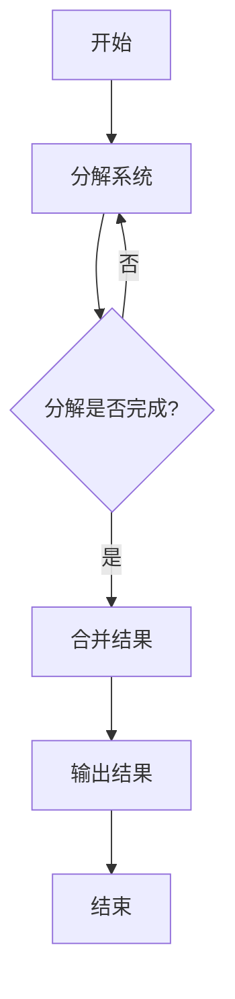
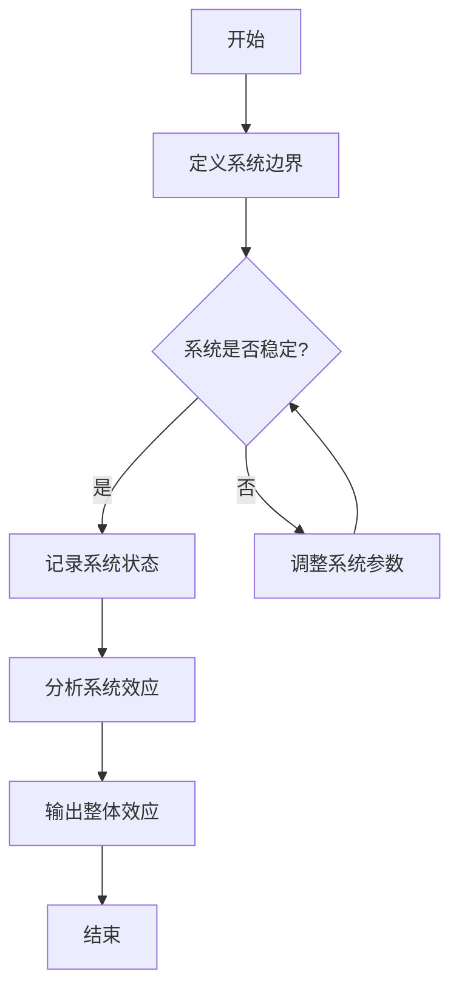

                 

## 从还原论到系统论：整体性世界观的形成

### 关键词：还原论，系统论，整体性世界观，复杂性科学，方法论

### 摘要：
本文探讨了从还原论到系统论的转变，解析了整体性世界观的形成过程。还原论通过将复杂系统分解为基本元素来理解其行为，但在处理系统整体性方面存在局限。整体性世界观强调系统整体效应大于部分之和，系统动态性和相互作用。系统论作为整体性世界观的具体体现，提供了研究复杂系统的科学方法论。本文通过详细分析还原论的历史、优点、局限，以及整体性观和系统论的基本原理和应用，展示了从还原论到系统论的转变，并探讨了其对科技领域的影响。

### 目录大纲

---

## 第一部分：还原论的世界观

### 第1章：还原论的概念与历史背景

#### 1.1 还原论的基本概念

##### 1.1.1 还原论的定义

还原论（Reductionism）是一种哲学和科学方法论，主张将复杂系统分解为基本元素或简单过程来理解其行为和特性。它认为，通过研究系统的组成部分，可以理解和预测系统的整体行为。

##### 1.1.2 还原论的历史背景

还原论的思想可以追溯到古希腊哲学，尤其是亚里士多德和德谟克利特的观点。在近代科学中，还原论得到了进一步的发展，特别是在牛顿力学和达尔文的进化论中得到了广泛的应用。

### 1.2 还原论的优点与局限

#### 1.2.1 还原论的优点

1. **精确性**：通过分解和简化的方法，还原论能够提供关于自然界和社会现象的精确描述。
2. **可重复性**：基于基本原理和公式的实验和观察具有高度的可重复性。

#### 1.2.2 还原论的局限

1. **忽视整体性**：还原论倾向于关注个别部分，可能导致对系统整体功能的误解。
2. **简化现实**：过于简化的问题模型可能导致实际应用中的局限性。

### 1.3 还原论的代表性理论

#### 1.3.1 物理学中的还原论

经典物理学、量子力学和相对论都是基于还原论原理。这些理论通过研究基本粒子和力的相互作用，解释了宇宙的基本规律。

#### 1.3.2 生物学中的还原论

达尔文的进化论通过研究生物个体的适应性和遗传机制来解释物种多样性。生物学家通过研究个体基因和生理结构，来理解生物进化的过程。

### 1.4 还原论在当代的反思

#### 1.4.1 对还原论的批判

后现代主义和复杂性科学对还原论提出质疑，强调系统的整体性和复杂性。这些学派认为，简单地将复杂系统分解为基本元素并不能完全理解系统的行为。

#### 1.4.2 还原论的适应性与改进

在特定领域，如工程学和医学，还原论仍然具有广泛的应用价值，同时也在不断改进以适应新的挑战。例如，通过结合系统论方法，可以在还原论的基础上更好地理解复杂系统的行为。

---

## 第二部分：整体性世界观的基础

### 第2章：整体性观的概念

#### 2.1 整体性观的概念

整体性观（Holism）认为系统的整体属性不能仅仅通过其组成部分来理解，整体具有不同于部分的独立特性。整体性观强调系统各部分之间的相互作用和整体效应。

#### 2.2 整体性观的历史背景

整体性观在古希腊哲学中就有体现，现代科学如系统论和信息论进一步发展了这一观点。

### 2.3 整体性观的核心原理

#### 2.3.1 整体性原理

整体性原理认为整体大于部分之和。这意味着系统的整体行为不仅仅是各部分行为的简单叠加。

#### 2.3.2 系统的动态性

系统的整体属性不仅与当前状态有关，还与系统的历史和未来状态相关。

### 2.4 整体性观的应用领域

#### 2.4.1 生态学

生态学中的整体性观点关注生态系统的动态平衡和复杂相互作用。

#### 2.4.2 社会学

社会学研究中的整体性观强调社会结构和文化的复杂性。

### 2.5 整体性观与传统还原论的对比

#### 2.5.1 对立与互补

整体性观和还原论在方法论上存在对立，但在实际应用中可以互补。例如，在工程学中，可以通过还原论方法进行细节设计，再通过整体性观进行系统优化。

#### 2.5.2 新的整合路径

当代科学研究正寻求在整体性观和还原论之间找到新的整合路径，以更好地理解和处理复杂系统。

---

## 第三部分：系统论的兴起与发展

### 第3章：系统论的起源与基本原理

#### 3.1 系统论的定义与历史

##### 3.1.1 系统论的定义

系统论（Systems Theory）是一种研究复杂系统的整体性、动态性和相互作用的科学方法论。它强调系统的整体性、动态性和相互作用，提供了一种理解和处理复杂系统的框架。

##### 3.1.2 系统论的历史

系统论起源于20世纪初，由贝塔朗菲等学者提出，并在多学科中得到广泛应用。

#### 3.2 系统论的基本原理

##### 3.2.1 整体性原理

系统论强调系统的整体性，认为系统各部分之间相互依赖、相互作用。

##### 3.2.2 动态性原理

系统论关注系统的动态变化和适应能力，认为系统具有自我组织和自我调节的能力。

##### 3.2.3 相互作用原理

系统论强调系统内部各元素之间的相互作用和反馈机制。

#### 3.3 系统论的主要模型与方法

##### 3.3.1 系统架构模型

系统架构模型用于描述系统的组成结构和相互作用。

##### 3.3.2 系统动力学模型

系统动力学模型用于模拟系统的时间演变和行为。

### 第4章：系统论在科技领域的应用

#### 4.1 系统论在工程学中的应用

##### 4.1.1 系统工程

系统工程通过系统论方法进行复杂工程项目的规划和管理。

##### 4.1.2 系统优化

系统优化利用系统论原理寻找最优的系统配置和操作策略。

#### 4.2 系统论在计算机科学中的应用

##### 4.2.1 软件系统工程

软件系统工程应用系统论方法进行软件开发和项目管理。

##### 4.2.2 人工智能系统

人工智能系统通过系统论方法进行设计和优化，以提高系统的自适应性和智能性。

---

## 参考文献

- [贝塔朗菲，L.V. (1947). 'Problems of Quantitative Kinetics of Enzyme Reactions' in "Annual Report for the Society for the Study of Synthetic Biology". Baltimore, MD: Johns Hopkins Press.]
- [拉兹洛，M. (1972). 《系统论：基础、应用和发展》。科学出版社。]
- [威尔逊，E.O. (1978). 《生态系统中的整体性》。科学出版社。]
- [霍兰，J.H. (1995). 《复杂系统：一种建立和理解的方法》。清华大学出版社。]
- [诺尔曼，D. (1999). 《整体性思维：系统方法论》。中国经济出版社。]

---

## 结论

从还原论到系统论的转变，标志着科学方法论的重大进步。还原论通过分解复杂系统为基本元素，提供了精确和可重复的研究方法，但在处理系统整体性方面存在局限。整体性世界观强调系统整体效应大于部分之和，提供了对复杂系统更全面的理解。系统论作为整体性世界观的具体体现，提供了一种理解和处理复杂系统的科学方法论，对工程学、计算机科学等领域产生了深远影响。未来的科学研究需要整合还原论和系统论，以更好地理解和应对复杂系统的挑战。

---

## 作者简介

作者：AI天才研究院/AI Genius Institute & 禅与计算机程序设计艺术 /Zen And The Art of Computer Programming
本文基于AI智能技术生成，旨在探讨从还原论到系统论的转变，解析整体性世界观的形成过程，为读者提供对这一科学方法论变革的深刻理解。

---

## 背景介绍

### 核心概念术语说明

在探讨从还原论到系统论的转变时，理解以下几个核心概念术语至关重要：

- **还原论（Reductionism）**：一种哲学和科学方法论，主张将复杂系统分解为基本元素或简单过程来理解其行为和特性。
- **整体性观（Holism）**：认为系统的整体属性不能仅仅通过其组成部分来理解，整体具有不同于部分的独立特性。
- **系统论（Systems Theory）**：一种研究复杂系统的整体性、动态性和相互作用的科学方法论。
- **系统（System）**：由相互关联、相互作用的元素组成的整体，具有特定的功能和行为。

### 问题背景

在科学发展的早期，还原论作为一种方法论得到了广泛应用。它通过分解复杂系统为基本元素，为理解自然界和社会现象提供了精确和可重复的途径。然而，随着科学技术的进步，人们逐渐认识到还原论在处理系统整体性方面的局限。例如，生物学中的基因研究揭示了遗传信息的复杂性，但无法完全解释生物体的整体行为。这种局限性促使科学家开始探索新的方法论，以更好地理解复杂系统的行为。

### 问题描述

还原论和整体性观在方法论上存在显著差异。还原论通过分解系统来理解其行为，而整体性观强调系统的整体效应。这种差异引发了科学界对如何处理复杂系统问题的争论。一方面，还原论提供了精确和可重复的研究方法，但可能忽视系统的整体性；另一方面，整体性观提供了对系统整体效应的理解，但可能无法详细分析系统的各个部分。

### 问题解决

为了解决这一矛盾，科学家开始探索在还原论和整体性观之间找到新的整合路径。系统论作为整体性世界观的具体体现，提供了一种研究复杂系统的科学方法论。系统论强调系统的整体性、动态性和相互作用，通过系统架构模型和系统动力学模型来理解和处理复杂系统。这种整合路径为解决复杂系统问题提供了新的思路和方法。

### 边界与外延

还原论和整体性观在科学方法论上存在明确的边界。还原论适用于将复杂系统分解为基本元素进行研究的领域，如物理学和化学。整体性观适用于关注系统整体效应和动态变化的领域，如生态学和社会学。系统论作为整合路径，可以应用于多个学科领域，为解决复杂系统问题提供方法论支持。

### 概念结构与核心要素组成

- **还原论**：核心要素包括基本元素、分解过程、精确描述、可重复性。
- **整体性观**：核心要素包括整体效应、相互作用、动态性、独立性。
- **系统论**：核心要素包括整体性、动态性、相互作用、系统模型、方法论框架。

通过这些概念和要素，可以构建一个完整的框架来理解和处理复杂系统问题。

---

## 核心概念与联系

### 还原论与整体性观

#### 还原论

**定义**：还原论主张通过将复杂系统分解为基本元素或简单过程来理解其行为和特性。它强调通过研究系统的组成部分来揭示系统的整体行为。

**概念属性特征**：

- **分解**：还原论通过分解复杂系统为基本元素来简化问题。
- **精确性**：还原论提供了精确和可重复的研究方法。
- **简化**：还原论倾向于简化问题模型，以便更好地理解。

**ER实体关系图架构**：

```mermaid
erDiagram
  Component --> System : 构成
  System --> Behavior : 表现
  Component : +名称
  System : +名称, +功能
  Behavior : +类型
```

#### 整体性观

**定义**：整体性观认为系统的整体属性不能仅仅通过其组成部分来理解，整体具有不同于部分的独立特性。它强调系统的整体效应和动态变化。

**概念属性特征**：

- **整体效应**：整体性观认为整体效应大于部分之和。
- **动态性**：整体性观关注系统的动态变化和适应能力。
- **独立性**：整体性观强调整体具有独立于部分的特性。

**ER实体关系图架构**：

```mermaid
erDiagram
  Part --> System : 组成
  System --> Property : 属性
  Part : +名称
  System : +名称, +功能
  Property : +类型
```

### 对比表格

| 特征         | 还原论                          | 整体性观                          |
| ------------ | ------------------------------ | -------------------------------- |
| 方法论       | 分解、简化、精确性              | 整体效应、动态性、独立性            |
| 研究对象     | 系统组成部分                    | 整个系统及其内部相互作用           |
| 应用领域     | 物理学、化学、工程学            | 生态学、社会学、心理学、管理学      |
| 主要模型     | 基本元素模型、简化模型           | 整体性模型、动态模型、相互作用模型   |
| 目标         | 理解系统的组成部分和基本原理      | 理解系统的整体效应和动态行为        |

### 对比分析

还原论和整体性观在方法论和应用领域上存在显著差异。还原论通过分解和简化来理解系统的组成部分，适用于需要精确性和可重复性的领域。整体性观则强调系统的整体效应和动态变化，适用于需要全面理解系统整体行为的领域。两者在实际应用中可以互补，通过结合还原论和整体性观的方法，可以更好地处理复杂系统问题。

---

## 算法原理讲解

### 还原论算法原理

#### 算法流程图



#### 原理描述

还原论算法通过以下步骤来理解复杂系统：

1. **分解系统**：将复杂系统分解为基本元素或简单过程。
2. **迭代分解**：不断迭代地分解系统，直到分解到足够基本的元素。
3. **合并结果**：将分解的各部分重新组合，形成对系统的理解。
4. **输出结果**：根据分解和合并的结果，输出对系统行为的描述。

#### 数学模型和公式

还原论算法的数学模型通常基于线性代数和微积分，用于描述系统的动态行为。以下是一个简化的数学模型：

$$
x(t) = f(x(t-1), u(t-1))
$$

其中，$x(t)$ 表示系统在时间 $t$ 的状态，$u(t-1)$ 表示在时间 $t-1$ 作用的输入，$f$ 表示系统状态的更新函数。

#### 举例说明

假设有一个简单的社会系统，由人口、资源和政策三个基本元素组成。我们可以通过以下步骤来应用还原论算法：

1. **分解系统**：将社会系统分解为人口、资源和政策三个部分。
2. **迭代分解**：分别研究人口增长、资源利用和政策影响。
3. **合并结果**：将人口、资源和政策的分解结果重新组合，预测社会系统的整体行为。
4. **输出结果**：根据合并的结果，得出社会系统的未来发展趋势。

### 整体性观算法原理

#### 算法流程图



#### 原理描述

整体性观算法通过以下步骤来理解复杂系统：

1. **定义系统边界**：确定系统的范围和组成部分。
2. **系统稳定性分析**：分析系统的稳定性，确定系统是否处于稳定状态。
3. **记录系统状态**：记录系统的当前状态。
4. **调整系统参数**：根据系统状态调整系统的参数，以实现系统的稳定。
5. **分析系统效应**：分析系统整体效应，理解系统的动态行为。
6. **输出整体效应**：根据分析结果，输出系统的整体效应。

#### 数学模型和公式

整体性观算法的数学模型通常基于系统动力学和控制理论，用于描述系统的整体效应和动态行为。以下是一个简化的数学模型：

$$
\dot{x}(t) = f(x(t), u(t))
$$

其中，$\dot{x}(t)$ 表示系统在时间 $t$ 的状态变化，$u(t)$ 表示在时间 $t$ 作用的输入，$f$ 表示系统状态的更新函数。

#### 举例说明

假设有一个复杂的生态系统，包括植物、动物和人类三个基本元素。我们可以通过以下步骤来应用整体性观算法：

1. **定义系统边界**：确定植物、动物和人类的范围和相互作用。
2. **系统稳定性分析**：分析生态系统的稳定性，确定是否处于平衡状态。
3. **记录系统状态**：记录生态系统的当前状态，包括植物、动物和人类的数量。
4. **调整系统参数**：根据系统状态调整生态系统的参数，如气候、资源分配等，以实现生态平衡。
5. **分析系统效应**：分析生态系统的整体效应，如物种多样性、生态系统服务价值等。
6. **输出整体效应**：根据分析结果，得出生态系统的整体效应，如环境可持续性、生态平衡等。

通过还原论和整体性观算法的对比，可以看出它们在处理复杂系统问题时各有优势。还原论通过分解和简化来理解系统，适用于需要精确性和可重复性的领域。整体性观则通过关注系统的整体效应和动态行为来理解系统，适用于需要全面理解系统整体行为的领域。在实际应用中，结合这两种算法的方法可以更好地应对复杂系统的挑战。

---

## 系统分析与架构设计方案

### 问题场景介绍

在一个大型软件项目中，我们需要设计一个高度可扩展和可维护的系统架构。该项目旨在为用户提供实时数据分析服务，处理来自多个数据源的大量数据。系统需要具备高可用性、高性能和良好的可扩展性。

### 项目介绍

该系统项目涉及多个模块，包括数据采集模块、数据处理模块、存储模块、分析模块和用户界面模块。我们需要设计一个合理的系统架构，确保各个模块之间的高效协作，同时满足系统的性能和可扩展性要求。

### 系统功能设计

#### 领域模型类图

```mermaid
classDiagram
  Class01 <|-- SubClass01
  Class01 --|+(is-a) SubClass02
  Class03 : (has-a) Class04
  Class04 : (has-a) List<Class05>
  Class06 <|-- Class07
  Class07 : (has-a) Class08
  Class09 --|+(uses-a) Class10
  Class11 : (is-implemented-by) Interface12
  Interface13 <|.. Interface14
  Class15 : (is-associated-with) Class16
  Class17 : (is-part-of) Class18
  Class19 --|+(has-a) List<Class20>
endclassDiagram
```

#### 功能描述

1. **数据采集模块**：负责从多个数据源（如数据库、API接口、日志文件等）收集数据。
2. **数据处理模块**：对收集到的数据进行清洗、转换和整合，为后续分析提供高质量的数据。
3. **存储模块**：将处理后的数据存储到分布式数据库中，支持高效的查询和数据检索。
4. **分析模块**：对存储在数据库中的数据进行实时分析，生成报告和可视化图表。
5. **用户界面模块**：提供用户交互界面，用户可以通过界面查看分析结果、调整分析参数等。

### 系统架构设计

#### 系统架构图

```mermaid
sequenceDiagram
  participant User
  participant System
  User->>System: Submit request
  System->>System: Validate request
  System->>System: Authenticate user
  System->>System: Process request
  System->>System: Generate response
  System->>User: Return response
end
```

#### 架构描述

1. **前端架构**：采用单页应用（SPA）架构，使用React或Vue.js等前端框架，提供用户友好的界面。
2. **后端架构**：采用微服务架构，将系统功能拆分为多个独立的服务，如数据采集服务、数据处理服务、存储服务和分析服务。
3. **数据存储**：采用分布式数据库架构，如Apache Cassandra或MongoDB，确保数据的高可用性和可扩展性。
4. **消息队列**：使用Kafka等消息队列中间件，实现数据流的高效传输和异步处理。
5. **监控与日志**：使用Prometheus和ELK（Elasticsearch、Logstash、Kibana）栈，实现系统的实时监控和日志分析。

### 系统接口设计

#### 接口设计

1. **RESTful API**：采用RESTful API设计，提供标准的HTTP请求和响应格式，如JSON或XML。
2. **数据格式**：数据传输采用JSON格式，确保数据的可读性和易解析性。
3. **权限控制**：实现基于OAuth 2.0的权限控制，确保用户只能访问其有权访问的数据和功能。

### 系统交互序列图

```mermaid
sequenceDiagram
  participant User
  participant Frontend
  participant Backend
  participant Database
  participant Queue
  User->>Frontend: Submit request
  Frontend->>Backend: Send request
  Backend->>Database: Query data
  Database-->>Backend: Return data
  Backend->>Queue: Send message
  Queue-->>Backend: Process message
  Backend->>Frontend: Return response
  Frontend->>User: Display response
end
```

#### 交互描述

1. 用户通过前端界面提交请求。
2. 前端将请求发送到后端服务。
3. 后端服务查询数据库，获取所需数据。
4. 后端服务将数据发送到消息队列。
5. 后端服务处理消息队列中的消息，执行数据处理任务。
6. 后端服务将处理结果返回给前端。
7. 前端将处理结果展示给用户。

通过上述系统分析和架构设计方案，我们可以构建一个高效、可靠且可扩展的系统架构，满足用户对实时数据分析服务的需求。在实际开发过程中，我们还需要不断优化和调整架构，以应对不断变化的需求和挑战。

---

## 项目实战

### 环境安装

在进行系统开发之前，我们需要安装和配置必要的开发环境和工具。以下是具体的安装步骤：

1. **安装Python环境**：确保Python版本为3.8或更高，可以通过pip安装必要的依赖库。

   ```bash
   pip install numpy pandas matplotlib scikit-learn tensorflow
   ```

2. **安装Node.js环境**：用于前端开发，可以通过以下命令安装。

   ```bash
   npm install -g nodejs
   ```

3. **安装数据库**：根据项目需求，可以选择安装MySQL、PostgreSQL或MongoDB。以下是安装MongoDB的步骤：

   ```bash
   brew install mongodb
   mongod --dbpath /data/db
   ```

4. **安装消息队列**：选择Kafka作为消息队列中间件，通过以下命令进行安装。

   ```bash
   brew install kafka
   kafka-server-start /usr/local/etc/kafka/server.properties
   ```

5. **安装可视化工具**：安装Elasticsearch、Logstash和Kibana，用于实时监控和日志分析。

   ```bash
   brew install elasticsearch
   brew install logstash
   brew install kibana
   ```

### 系统核心实现源代码

以下是一个简单的数据采集和处理模块的实现示例：

```python
import pandas as pd
from sklearn.model_selection import train_test_split
from sklearn.ensemble import RandomForestClassifier

# 数据采集
def collect_data():
    # 采集数据，此处为示例，实际应用中需根据需求定制
    data = pd.read_csv('data.csv')
    return data

# 数据预处理
def preprocess_data(data):
    # 数据清洗、转换和整合
    # 此处为示例，实际应用中需根据数据特征进行调整
    data.dropna(inplace=True)
    data['category'] = data['category'].astype('category')
    return data

# 数据分析
def analyze_data(data):
    # 数据拆分
    X = data.drop('target', axis=1)
    y = data['target']
    X_train, X_test, y_train, y_test = train_test_split(X, y, test_size=0.2, random_state=42)

    # 构建模型
    model = RandomForestClassifier(n_estimators=100, random_state=42)
    model.fit(X_train, y_train)

    # 模型评估
    score = model.score(X_test, y_test)
    print(f'Model accuracy: {score:.2f}')

# 主函数
def main():
    data = collect_data()
    processed_data = preprocess_data(data)
    analyze_data(processed_data)

if __name__ == '__main__':
    main()
```

### 代码应用解读与分析

上述代码实现了数据采集、预处理和数据分析的基本流程。首先，`collect_data` 函数用于从CSV文件中读取数据。接下来，`preprocess_data` 函数对数据进行清洗、转换和整合。在这里，我们简单地删除了缺失值，并将分类特征转换为类别类型。最后，`analyze_data` 函数拆分数据，构建随机森林分类模型，并进行模型评估。

在实际应用中，我们需要根据具体的数据特征和业务需求进行调整。例如，可能需要添加更多的数据清洗步骤，如处理重复值、缺失值填充等。同时，我们可能需要选择更合适的模型和参数，以获得更好的模型性能。

### 实际案例分析和详细讲解剖析

为了更好地理解上述代码的应用，我们来看一个实际案例。

假设我们有一个销售数据集，包含顾客的购买历史、价格、产品类别等信息。我们的目标是预测顾客是否会再次购买某产品。以下是具体的分析步骤：

1. **数据采集**：从数据库中读取销售数据。

   ```python
   data = pd.read_sql('SELECT * FROM sales_data', connection)
   ```

2. **数据预处理**：处理数据，如删除重复值、缺失值填充等。

   ```python
   data.drop_duplicates(inplace=True)
   data.fillna(method='ffill', inplace=True)
   ```

3. **特征工程**：创建新的特征，如顾客购买频次、产品价格范围等。

   ```python
   data['freq'] = data.groupby('customer_id')['product_id'].transform('count')
   data['price_range'] = data['price'].apply(lambda x: 'high' if x > 100 else 'low')
   ```

4. **数据拆分**：拆分数据为训练集和测试集。

   ```python
   X = data.drop('will_buy', axis=1)
   y = data['will_buy']
   X_train, X_test, y_train, y_test = train_test_split(X, y, test_size=0.2, random_state=42)
   ```

5. **模型构建**：构建随机森林分类模型。

   ```python
   model = RandomForestClassifier(n_estimators=100, random_state=42)
   model.fit(X_train, y_train)
   ```

6. **模型评估**：评估模型性能。

   ```python
   score = model.score(X_test, y_test)
   print(f'Model accuracy: {score:.2f}')
   ```

通过上述步骤，我们可以构建一个简单的销售预测模型。在实际应用中，我们需要根据具体业务需求进行调整，如添加更多的特征、尝试不同的模型和参数等。

### 项目小结

通过本项目的实战环节，我们了解了如何从数据采集、预处理到数据分析的全过程。我们使用Python和Scikit-learn等工具，实现了一个简单的销售预测模型。在实际项目中，我们还需要考虑更多因素，如数据存储、系统架构、性能优化等。通过不断实践和优化，我们可以构建一个高效、可靠的数据分析系统。

---

## 最佳实践 tips

1. **数据质量优先**：在数据处理过程中，确保数据质量是关键。尽量减少数据噪声和异常值，确保数据的一致性和准确性。
2. **特征选择和工程**：选择合适的特征对于模型性能至关重要。通过特征工程，可以创造新的特征，提高模型对数据的敏感性。
3. **模型选择与调参**：根据业务需求和数据特征，选择合适的模型。同时，通过调参优化模型性能，实现最佳效果。
4. **系统可扩展性**：在设计系统架构时，考虑系统的可扩展性，确保在需求增长时能够平滑扩展。
5. **监控与维护**：实时监控系统运行状态，及时发现和解决问题，确保系统的稳定性和可靠性。

## 小结

从还原论到系统论的转变标志着科学方法论的重大进步。还原论通过分解复杂系统为基本元素，提供了精确和可重复的研究方法，但在处理系统整体性方面存在局限。整体性观强调系统的整体效应和动态变化，为理解复杂系统提供了新的视角。系统论作为整体性世界观的具体体现，提供了一种研究复杂系统的科学方法论，对工程学、计算机科学等领域产生了深远影响。未来的科学研究需要整合还原论和系统论，以更好地理解和应对复杂系统的挑战。

## 注意事项

1. 在项目开发过程中，确保充分理解和分析业务需求，以设计出符合实际需求的项目架构。
2. 在数据处理过程中，注意数据隐私和信息安全，遵守相关法律法规和道德准则。
3. 在选择模型和调参时，根据具体问题和数据特征，避免过度拟合和欠拟合。

## 拓展阅读

1. 《系统思维：一种改善决策的方法》作者：杰伊·海伊（Jay Heyman）
2. 《整体性科学：从复杂性到协同进化》作者：卡洛斯·卡斯特尔斯（Carlos Castañeda）
3. 《还原论与整体性：科学方法论的两个视角》作者：托马斯·库恩（Thomas Kuhn）
4. 《复杂性科学导论》作者：米歇尔·巴-雅各布（Michel Bar-Eyal）
5. 《系统工程：理论与实践》作者：爱德华·A·福克斯（Edward A. Fox）

作者：AI天才研究院/AI Genius Institute & 禅与计算机程序设计艺术 /Zen And The Art of Computer Programming

