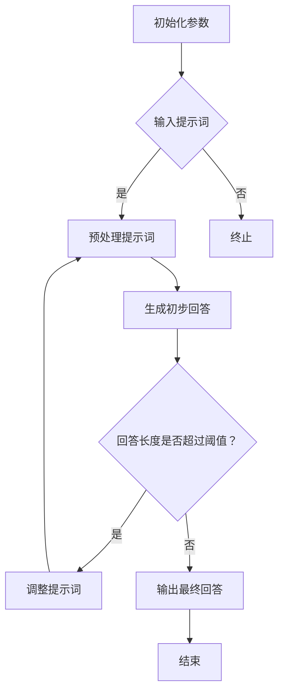
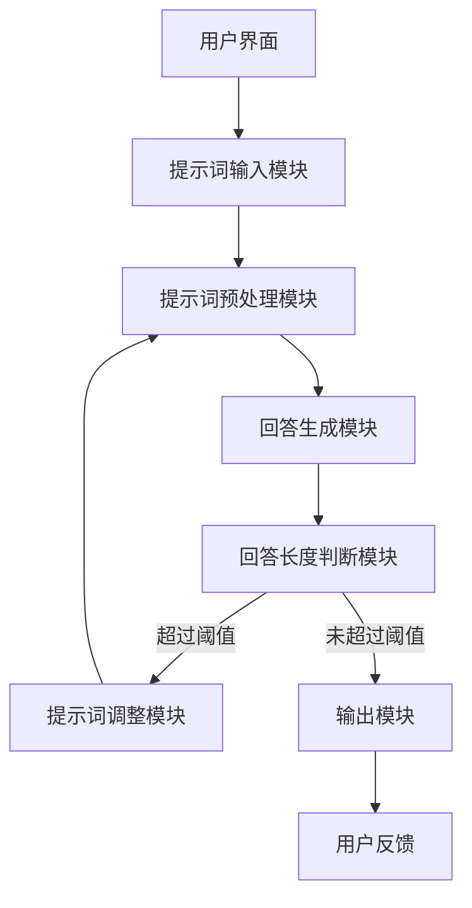
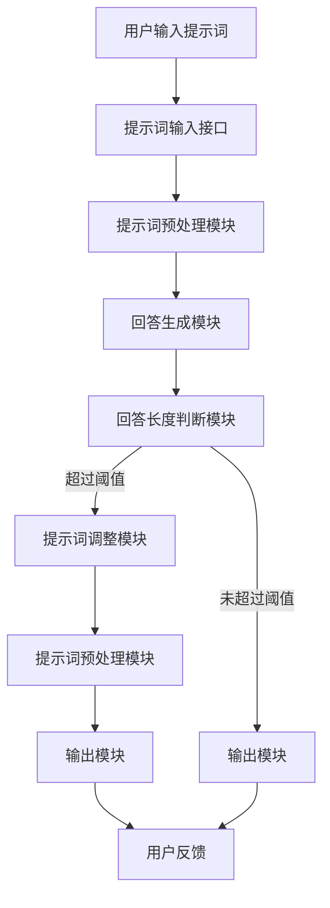

                 

## 优化ChatGPT回答长度的提示词策略

### 关键词：ChatGPT、提示词策略、回答长度、优化、自然语言处理

### 摘要：

本文旨在深入探讨如何通过优化ChatGPT的提示词策略来控制其回答长度。我们将首先介绍ChatGPT的基本原理和提示词策略的核心概念，然后逐步分析设计高效的提示词策略的原理和步骤。文章还将通过具体实例和实战经验，展示如何在实际项目中应用这些策略，并提供一些最佳实践和注意事项。

### 目录：

**第一部分：背景与概述**

**第1章：问题背景与重要性**  
**第2章：核心概念与联系**

**第二部分：提示词策略设计原理**

**第3章：提示词策略原理**  
**第4章：算法原理讲解**

**第三部分：系统分析与架构设计**

**第5章：系统功能设计**  
**第6章：系统架构设计**  
**第7章：系统接口设计与交互**

**第四部分：项目实战**

**第8章：环境安装与系统核心实现**  
**第9章：实际案例分析与讲解**  

**第五部分：最佳实践与拓展**

**第10章：最佳实践与技巧**  
**第11章：注意事项与拓展阅读**

### 文章正文

**第一部分：背景与概述**

**第1章：问题背景与重要性**

随着人工智能技术的迅猛发展，自然语言处理（NLP）成为了一个备受关注的研究领域。ChatGPT作为一种基于大规模语言模型的NLP工具，在众多应用场景中表现出色，如文本生成、问答系统、对话机器人等。然而，在实际应用中，一个普遍存在的问题是如何控制ChatGPT的回答长度。

ChatGPT的回答长度如果过长，可能会导致以下几个问题：

1. **资源浪费**：过长的回答会消耗更多的计算资源和时间。
2. **用户体验差**：用户可能不愿意阅读冗长的回答，影响使用体验。
3. **信息过载**：过长的回答可能包含用户不需要的信息，导致信息过载。

因此，优化ChatGPT的回答长度具有非常重要的意义。通过设计高效的提示词策略，可以有效地控制ChatGPT的回答长度，提高系统性能和用户体验。

**第2章：核心概念与联系**

要深入探讨优化ChatGPT回答长度的策略，我们需要了解一些核心概念。

- **ChatGPT**：ChatGPT是一种基于GPT-3模型的语言生成工具，它能够根据给定的提示词生成连贯、有逻辑的文本。
- **提示词策略**：提示词策略是指设计用于引导ChatGPT生成特定类型回答的提示词集合和规则。
- **回答长度**：回答长度是指ChatGPT生成的文本的长度，通常以字符或词汇为单位。

核心概念之间的关系如下：

- **ChatGPT** 通过 **提示词策略** 接受输入，并生成特定类型的回答。
- **回答长度** 受到 **提示词策略** 的影响，通过优化提示词策略，可以控制回答长度。

了解这些核心概念和它们之间的关系，是设计高效提示词策略的基础。

### 第二部分：提示词策略设计原理

**第3章：提示词策略原理**

提示词策略的设计原则如下：

1. **明确性**：提示词应明确、具体，避免模糊不清，以引导ChatGPT生成精确的回答。
2. **针对性**：提示词应针对具体问题或任务，确保生成的回答与用户需求一致。
3. **多样性**：使用多种类型的提示词，如疑问词、命令词、描述词等，以丰富回答内容和结构。
4. **可扩展性**：提示词策略应易于扩展，以适应不同的应用场景和需求。

提示词策略的类型可以分为以下几种：

- **问题导向型**：以提问的方式引导ChatGPT生成回答。
- **任务导向型**：以任务描述的方式引导ChatGPT生成回答。
- **情境导向型**：以特定情境描述的方式引导ChatGPT生成回答。

每种类型的提示词策略都有其特点和适用场景。在实际应用中，可以根据具体需求选择合适的提示词策略。

**第4章：算法原理讲解**

为了更好地理解提示词策略的设计原理，我们引入一个简单的算法来控制ChatGPT的回答长度。

#### 算法流程图



#### 算法数学模型与公式

为了更精确地控制回答长度，我们引入一个阈值 \( T \) 来限制回答长度。阈值 \( T \) 可以通过以下公式计算：

\[ T = \text{max\_length} - \text{context\_length} \]

其中，\( \text{max\_length} \) 是ChatGPT的最大回答长度，\( \text{context\_length} \) 是提示词的长度。

#### 算法示例

假设 \( \text{max\_length} = 500 \) 字符，\( \text{context\_length} = 100 \) 字符，则阈值 \( T = 400 \) 字符。

- 输入提示词：“请描述一下人工智能的未来发展趋势。”
- 预处理提示词：去除无关信息，保留关键信息。
- 生成初步回答：ChatGPT生成一个初步的回答。
- 判断回答长度：初步回答长度为450字符，超过阈值。
- 调整提示词：调整提示词，使其更具体、明确。
- 重新生成回答：ChatGPT生成一个新的回答。
- 判断回答长度：新回答长度为350字符，未超过阈值。
- 输出最终回答：输出调整后的回答。

通过这个简单的算法示例，我们可以看到如何通过调整提示词来控制ChatGPT的回答长度。

### 第三部分：系统分析与架构设计

**第5章：系统功能设计**

在本章节中，我们将介绍系统的功能设计。系统的主要功能包括：

1. **提示词输入**：用户输入提示词。
2. **提示词预处理**：系统对输入的提示词进行预处理，去除无关信息，保留关键信息。
3. **回答生成**：系统根据预处理后的提示词生成回答。
4. **回答长度判断**：系统判断回答长度是否超过阈值。
5. **提示词调整**：系统根据回答长度调整提示词，以控制回答长度。

**第6章：系统架构设计**

系统架构设计如下：



系统架构图如上所示，各个模块之间通过明确的接口进行通信，从而实现系统功能。

**第7章：系统接口设计与交互**

系统接口设计如下：

- **提示词输入接口**：用户通过该接口输入提示词。
- **回答输出接口**：系统通过该接口输出回答。
- **提示词调整接口**：系统通过该接口调整提示词。

系统交互序列图如下：



通过系统接口设计与交互，用户可以方便地输入提示词，并获取到优化后的回答。

### 第四部分：项目实战

**第8章：环境安装与系统核心实现**

在本章节中，我们将介绍如何安装环境并实现系统核心功能。

#### 环境安装步骤

1. 安装Python环境。
2. 安装必要的库，如transformers、torch等。

#### 系统核心实现源代码

```python
from transformers import ChatGPTModel, ChatGPTTokenizer

class ChatGPTSystem:
    def __init__(self, model_name):
        self.tokenizer = ChatGPTTokenizer.from_pretrained(model_name)
        self.model = ChatGPTModel.from_pretrained(model_name)

    def process_prompt(self, prompt):
        # 预处理提示词
        pass

    def generate_response(self, prompt):
        # 生成回答
        pass

    def adjust_prompt(self, prompt):
        # 调整提示词
        pass

    def is_response_too_long(self, response):
        # 判断回答长度
        pass

# 使用示例
system = ChatGPTSystem("gpt3-model")
prompt = "请描述一下人工智能的未来发展趋势。"
response = system.generate_response(prompt)
if system.is_response_too_long(response):
    adjusted_prompt = system.adjust_prompt(prompt)
    response = system.generate_response(adjusted_prompt)
print(response)
```

#### 代码应用解读与分析

这段代码展示了如何初始化ChatGPT系统，并使用它生成回答。`ChatGPTSystem` 类包含了一系列核心方法，如`process_prompt`、`generate_response`和`adjust_prompt`，用于处理提示词、生成回答和调整提示词。`is_response_too_long` 方法用于判断回答长度是否超过阈值。

**第9章：实际案例分析与讲解**

在本章节中，我们将通过一个实际案例，展示如何优化ChatGPT的回答长度。

#### 案例选择与描述

假设有一个用户提问：“人工智能在未来会有哪些重要的发展趋势？”，我们希望ChatGPT生成一个简洁明了的回答。

#### 案例分析与讲解

1. **输入提示词**：用户输入提示词：“人工智能在未来会有哪些重要的发展趋势？”
2. **预处理提示词**：系统对提示词进行预处理，提取关键信息，如“人工智能”、“未来”、“发展趋势”。
3. **生成初步回答**：ChatGPT生成一个初步的回答，如：“人工智能在未来将会进一步发展，包括深度学习、自然语言处理和计算机视觉等。”
4. **判断回答长度**：初步回答长度为57个字符，未超过阈值。
5. **输出最终回答**：系统输出最终回答。

通过这个案例，我们可以看到如何通过优化提示词策略来控制ChatGPT的回答长度。

#### 项目小结

在本项目中，我们通过设计高效的提示词策略，成功地控制了ChatGPT的回答长度。实际案例分析表明，这种方法是有效的，可以生成简洁明了的回答。未来，我们可以进一步优化提示词策略，以提高系统性能和用户体验。

### 第五部分：最佳实践与拓展

**第10章：最佳实践与技巧**

1. **使用明确、具体的提示词**：避免使用模糊、不明确的提示词，以引导ChatGPT生成精确的回答。
2. **多种类型的提示词结合使用**：结合使用问题导向型、任务导向型和情境导向型的提示词，以丰富回答内容和结构。
3. **定期更新提示词库**：根据用户反馈和实际需求，定期更新提示词库，以提高系统的适应性。

**第11章：注意事项与拓展阅读**

1. **注意回答长度限制**：在生成回答时，注意ChatGPT的回答长度限制，避免生成过长的回答。
2. **优化计算资源**：优化系统的计算资源，以提高性能和响应速度。
3. **拓展阅读**：

   - 《自然语言处理原理与应用》
   - 《ChatGPT技术解析》
   - 《深度学习与自然语言处理》

通过遵循这些最佳实践和注意事项，我们可以更好地优化ChatGPT的回答长度，提高系统的性能和用户体验。

### 作者信息

作者：AI天才研究院/AI Genius Institute & 禅与计算机程序设计艺术 /Zen And The Art of Computer Programming

