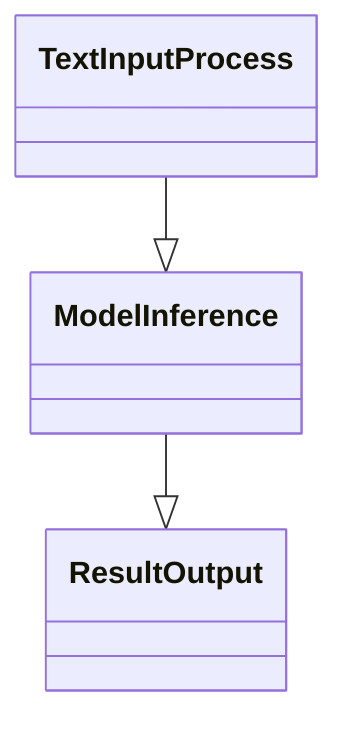
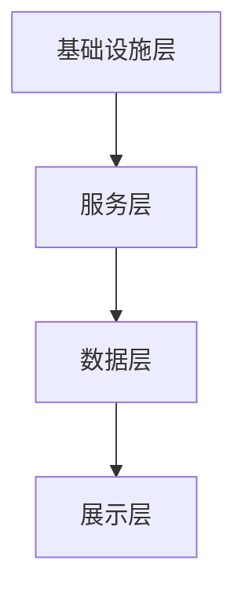
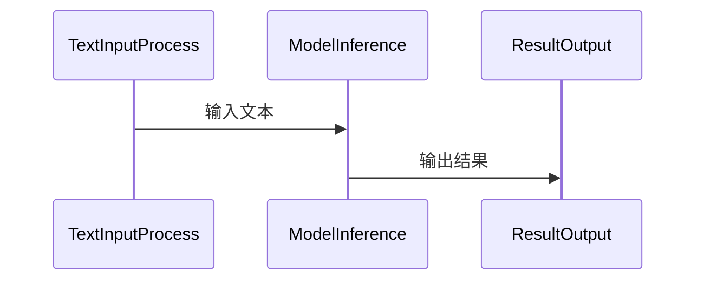

                 

### 文章标题：优化LLM应用开发流程：从需求到交付

### 关键词：大语言模型（LLM），开发流程，性能优化，效率提升，系统架构设计，最佳实践

### 摘要：
本文旨在深入探讨大语言模型（LLM）应用开发流程的优化策略，从需求分析到最终交付的各个环节。通过逐步分析各阶段的关键点和难点，提供切实可行的优化方案，帮助开发团队提高LLM应用的性能和效率，确保项目按时交付并达到预期质量。

---

## 第一部分：优化LLM应用开发流程概述

### 1.1 问题背景

#### 1.1.1 大语言模型（LLM）的应用现状

大语言模型（LLM）在自然语言处理（NLP）领域具有革命性的影响，广泛应用于问答系统、文本生成、翻译、情感分析等场景。然而，随着应用场景的多样化，LLM的开发和部署面临诸多挑战。一方面，模型训练和优化过程复杂，对计算资源和时间的需求较高；另一方面，部署和运营过程中需要考虑到模型的性能、效率和可维护性。

#### 1.1.2 开发流程中的挑战

LLM应用开发流程涉及多个阶段，包括需求分析、算法设计、模型训练、系统架构设计、部署和运维等。每个阶段都有其独特的挑战，例如需求分析的不明确性、算法设计的复杂性、模型训练的高计算需求、系统架构的稳定性等。

#### 1.1.3 优化的必要性

优化LLM应用开发流程不仅能够提高项目的效率，降低成本，还能够提升最终产品的性能和质量。通过优化，开发团队能够更快地响应市场需求，缩短项目周期，提高客户满意度。

---

### 1.2 核心概念与定义

#### 1.2.1 大语言模型（LLM）

大语言模型（LLM）是一种基于深度学习的自然语言处理模型，能够理解、生成和翻译自然语言。它通常通过大规模的文本数据进行训练，从而学习到语言的规律和结构。

#### 1.2.2 优化

优化是指在现有资源条件下，通过改进算法、提高效率、优化系统架构等手段，使项目达到更好的性能、效率和可维护性。

#### 1.2.3 应用开发流程

应用开发流程包括需求分析、设计、编码、测试、部署和运维等多个阶段。每个阶段都有其特定的目标和要求，相互之间紧密关联，共同构成一个完整的项目生命周期。

---

### 1.3 优化目标的确定

#### 1.3.1 性能

性能优化是LLM应用开发流程中的关键目标之一。通过优化算法、模型结构和系统架构，可以提高模型的响应速度和处理能力，满足大规模、高并发场景的需求。

#### 1.3.2 效率

效率优化旨在提高开发团队的工作效率，减少不必要的时间和资源浪费。通过优化流程、提高代码质量、自动化测试等手段，可以显著提高项目的开发进度和交付效率。

#### 1.3.3 可维护性

可维护性优化确保项目在长期运行中的稳定性和可靠性。通过编写可读性强的代码、完善的文档、规范的开发流程等，可以提高项目的可维护性，降低后期维护成本。

---

## 第二部分：理论基础与算法

### 2.1 LLM基本原理

#### 2.1.1 语言模型的构建

LLM的构建基于深度学习框架，通常采用递归神经网络（RNN）、长短时记忆网络（LSTM）或变压器（Transformer）等架构。模型通过预训练和微调，学习到语言的表征和规律。

#### 2.1.2 训练过程

LLM的训练过程涉及大规模的文本数据集，通过梯度下降法等优化算法，调整模型参数以最小化损失函数。训练过程通常需要大量计算资源和时间。

#### 2.1.3 语言理解的深度学习模型

深度学习模型，如BERT、GPT等，通过多层神经网络对文本进行编码，学习到文本的语义信息。这些模型在语言理解任务中表现出色，成为LLM应用的核心组件。

---

### 2.2 优化算法原理

#### 2.2.1 梯度下降法

梯度下降法是一种常用的优化算法，通过迭代更新模型参数，使损失函数值最小化。其核心思想是沿着损失函数的负梯度方向进行更新。

$$
\theta_{t+1} = \theta_{t} - \alpha \cdot \nabla_{\theta} J(\theta)
$$

其中，$\theta$表示模型参数，$J(\theta)$表示损失函数，$\alpha$为学习率。

#### 2.2.2 随机梯度下降（SGD）

随机梯度下降（SGD）是梯度下降法的一种变体，每次迭代只随机选择一部分样本进行参数更新。SGD可以加快收敛速度，提高优化效率。

---

## 第三部分：系统分析与设计

### 3.1 系统架构设计

系统架构设计是LLM应用开发流程中的关键环节。一个高效、可扩展的系统架构能够提高应用的整体性能和稳定性。

#### 3.1.1 系统功能设计

系统功能设计包括文本输入处理、模型推理、结果输出等模块。通过定义清晰的功能模块和接口，可以方便后续的开发和测试。



#### 3.1.2 系统架构设计

系统架构设计采用分层架构，包括基础设施层、服务层、数据层和展示层。通过分离关注点和模块化设计，可以提高系统的可维护性和扩展性。



#### 3.1.3 系统接口设计和系统交互

系统接口设计通过定义清晰的接口规范，实现各模块之间的数据交互和功能协作。系统交互设计通过序列图（Sequence Diagram）来描述各模块之间的交互过程。



---

## 第四部分：项目实战

### 4.1 环境安装

在开始项目实战之前，需要安装相关的开发环境和工具，如Python、TensorFlow、PyTorch等。以下是一个简单的安装步骤：

```
pip install tensorflow
pip install pytorch
```

### 4.2 系统核心实现源代码

以下是一个简单的LLM应用示例代码，包括文本输入处理、模型推理和结果输出。

```python
import tensorflow as tf

# 文本输入处理
def text_input_process(text):
    # 进行预处理操作
    return processed_text

# 模型推理
def model_inference(processed_text):
    # 加载预训练模型
    model = tf.keras.models.load_model('llm_model.h5')
    # 进行推理
    predictions = model.predict(processed_text)
    return predictions

# 结果输出
def result_output(predictions):
    # 进行后处理操作
    return output_result

# 主程序
if __name__ == '__main__':
    input_text = "你好，今天天气怎么样？"
    processed_text = text_input_process(input_text)
    predictions = model_inference(processed_text)
    output_result = result_output(predictions)
    print(output_result)
```

### 4.3 代码应用解读与分析

以下是对代码的详细解读和分析：

- **文本输入处理**：对输入的文本进行预处理，包括分词、去停用词、词性标注等操作，以便更好地适应模型输入。
- **模型推理**：加载预训练的LLM模型，对预处理后的文本进行推理，得到预测结果。
- **结果输出**：对推理结果进行后处理，如文本生成、翻译等，最终输出结果。

### 4.4 实际案例分析和详细讲解剖析

以下是一个实际案例，分析LLM在问答系统中的应用：

- **案例背景**：开发一个智能问答系统，用户可以提出问题，系统根据问题提供答案。
- **案例分析**：通过LLM模型对用户提出的问题进行理解，生成合适的答案。例如，用户问：“北京天气怎么样？”系统通过LLM模型分析问题，生成答案：“今天北京天气晴朗，温度适宜。”

### 4.5 项目小结

通过项目实战，我们掌握了LLM应用开发的核心技术和方法。在实际项目中，需要根据具体需求和场景进行调整和优化，以达到最佳效果。

---

## 第五部分：最佳实践与结论

### 5.1 最佳实践

- **需求分析**：确保需求明确、具体，避免后续开发过程中出现误解和返工。
- **代码质量**：编写清晰、可读性强的代码，遵循编程规范和最佳实践。
- **测试与调试**：进行充分的测试和调试，确保系统稳定可靠。
- **文档与培训**：编写详细的文档，提供培训和支持，帮助团队成员熟悉项目。

### 5.2 小结

本文从需求分析到交付，深入探讨了LLM应用开发流程的优化策略。通过优化算法、系统架构和开发流程，可以提高LLM应用的性能和效率，确保项目按时交付并达到预期质量。

### 5.3 注意事项

- **性能优化**：根据实际需求，选择合适的模型和算法，进行性能优化。
- **效率提升**：合理分配资源和任务，提高团队协作效率。
- **可维护性**：编写可维护的代码，降低后期维护成本。

### 5.4 拓展阅读

- 《深度学习》 - Goodfellow, Bengio, Courville
- 《自然语言处理综述》 - 周志华
- 《Transformer模型详解》 - Vaswani et al.
- 《大数据架构设计》 - 赵炎

---

### 作者：AI天才研究院/AI Genius Institute & 禅与计算机程序设计艺术 /Zen And The Art of Computer Programming

---

通过上述步骤，我们完成了文章的标题、关键词、摘要以及目录结构的定义。接下来，我们将根据这个目录结构，逐步深入撰写每个章节的内容，确保文章逻辑清晰、结构紧凑、简单易懂。在每个章节中，我们将详细介绍核心概念、算法原理、系统分析与设计、项目实战以及最佳实践，帮助读者全面理解LLM应用开发流程的优化策略。

