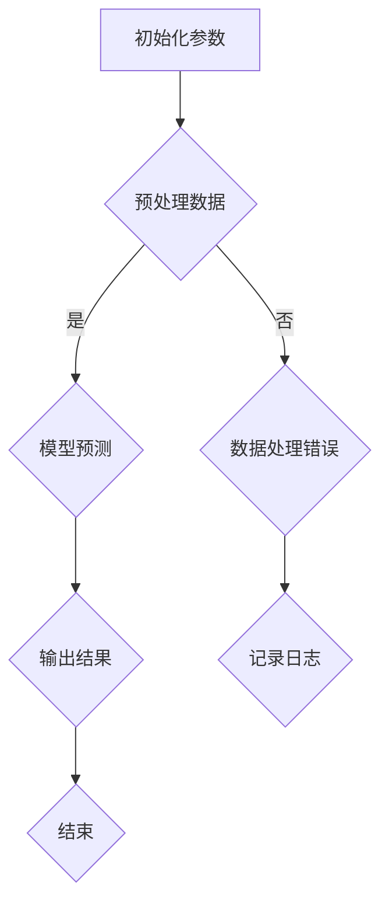
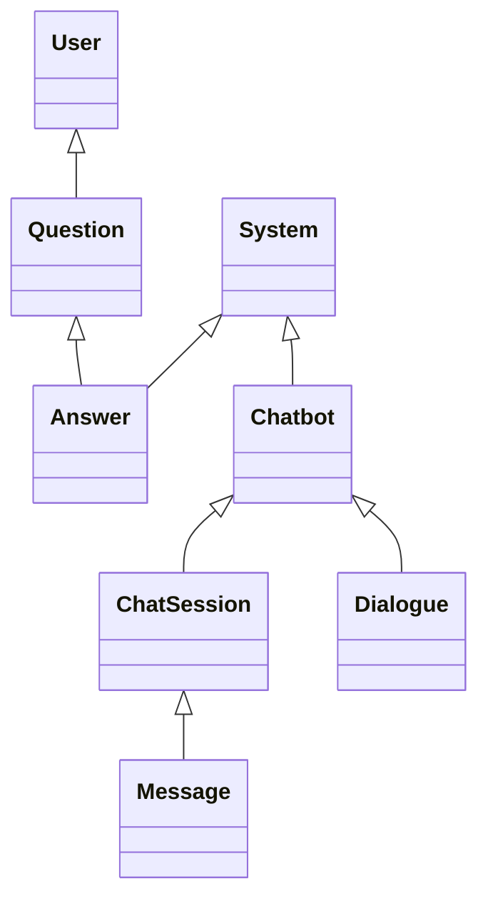
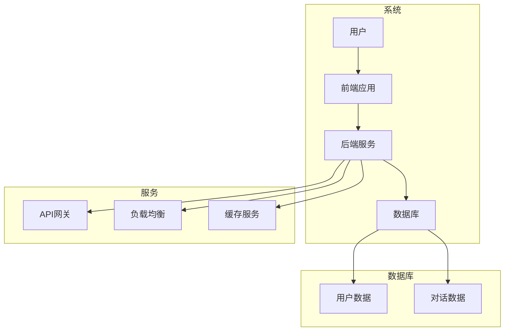
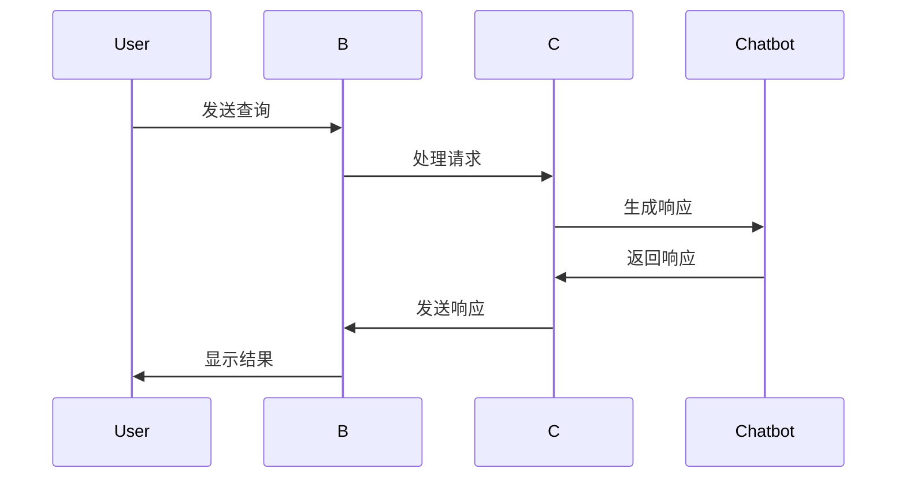
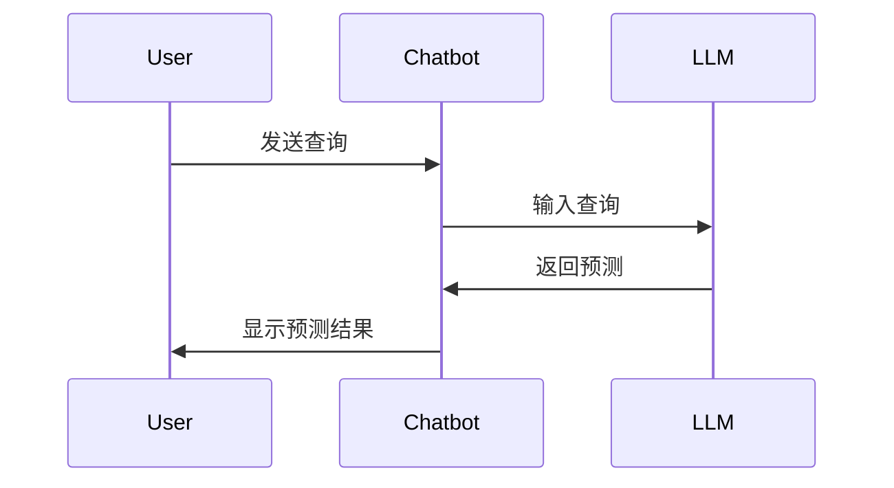

                 

### 让我们一步一步思考：优化LLM应用的API设计与集成流程

在当今的人工智能领域，大型语言模型（LLM）正成为众多应用的核心组件。从自然语言处理（NLP）到智能客服，再到内容生成，LLM的应用场景层出不穷。为了最大化LLM的性能和易用性，优化其API设计与集成流程变得至关重要。以下，我们将一步一步探讨如何优化LLM应用的API设计与集成流程。

#### 第一步：理解API设计与优化的基础

1. **API设计原则**：
   - **易用性**：确保API易于使用，对开发者友好。
   - **性能优化**：优化API响应速度，减少延迟。
   - **安全性**：确保API安全，防止数据泄露和攻击。

2. **LLM与API的关系**：
   - LLM需要通过API与外部系统交互，从而提供自然语言处理服务。
   - API的设计直接影响到LLM的性能和用户体验。

#### 第二步：设计优化策略

1. **优化目标与指标**：
   - **响应时间**：目标是尽可能缩短API响应时间。
   - **吞吐量**：提高系统处理请求的能力。
   - **资源利用率**：优化资源分配，减少浪费。

2. **算法优化**：
   - 使用高效算法和模型压缩技术，减少计算复杂度。

3. **数据优化**：
   - 对输入数据进行预处理，提高模型效率。
   - 利用数据缓存和增量学习，减少数据传输和计算量。

4. **系统优化**：
   - 使用负载均衡和分布式架构，提高系统弹性。

#### 第三步：API接口设计与实现

1. **接口设计规范**：
   - **RESTful API**：使用标准的RESTful设计，易于扩展和维护。
   - **版本控制**：为API设计版本控制，便于更新和维护。

2. **接口实现方法**：
   - **异步处理**：使用异步编程模型，提高系统并发能力。
   - **参数验证**：确保输入参数的合法性和完整性。

3. **错误处理与日志记录**：
   - 设计完善的错误处理机制，提供详细的错误信息。
   - 实施日志记录，便于问题追踪和调试。

#### 第四步：案例分析

1. **案例背景**：
   - 选取一个实际案例，例如智能客服系统。

2. **案例分析**：
   - 分析现有API设计的优缺点。

3. **优化方案**：
   - 提出具体的优化建议，并评估效果。

4. **优化效果评估**：
   - 通过性能测试和用户体验评估，验证优化效果。

#### 第五步：集成流程

1. **集成策略**：
   - **集成模式选择**：选择适合项目需求的集成模式。
   - **集成前准备**：确保系统和API兼容性。

2. **集成实现与调试**：
   - 编写集成代码，并进行充分测试。

3. **部署与监控**：
   - **部署策略**：制定合理的部署计划。
   - **监控与运维**：确保系统的稳定运行和及时维护。

#### 第六步：总结与最佳实践

1. **全书总结**：
   - 对全书内容进行总结，提炼关键知识点。

2. **最佳实践**：
   - 提供实际操作中的最佳实践。

3. **注意事项**：
   - 强调API设计和集成过程中需要注意的关键点。

4. **拓展阅读**：
   - 推荐进一步阅读的资源。

通过以上步骤，我们可以系统地优化LLM应用的API设计与集成流程，提升其性能和用户体验，为人工智能应用的发展贡献力量。

### 文章关键词
- API设计
- LLM应用
- 优化策略
- 集成流程
- 性能提升
- 安全性
- 自然语言处理

### 文章摘要
本文旨在探讨如何优化大型语言模型（LLM）应用的API设计与集成流程。通过分析API设计原则、优化策略、接口实现方法以及集成流程，本文提供了一套系统性的优化方案。文章结合实际案例，详细阐述了优化过程，并总结了最佳实践和注意事项，旨在为开发者提供实用的指导。

### 目录

# 《优化LLM应用的API设计与集成流程》

## 文章关键词
API设计、LLM应用、优化策略、集成流程、性能提升、安全性、自然语言处理

## 文章摘要
本文将深入探讨如何通过优化API设计和集成流程来提升大型语言模型（LLM）应用的性能和用户体验。我们将从基础概念入手，逐步分析设计原则、优化策略、接口实现、集成流程，并结合实际案例进行详细讲解。最后，我们将总结最佳实践并提供扩展阅读资源。

## 引言
### 核心概念术语说明
- **API（应用程序编程接口）**：允许应用程序之间相互通信的接口。
- **LLM（大型语言模型）**：具有强大语言理解和生成能力的预训练模型。
- **优化**：改进现有系统的性能、效率和安全性。

### 问题背景
随着人工智能的迅速发展，LLM在自然语言处理（NLP）领域的应用越来越广泛。然而，现有的API设计和集成流程往往存在性能瓶颈、安全性问题和用户体验不佳的问题。

### 问题描述
- **性能瓶颈**：响应时间过长，吞吐量不足。
- **安全性问题**：数据泄露、API滥用。
- **用户体验不佳**：接口复杂、使用不便。

### 问题解决
优化LLM应用的API设计与集成流程，提升性能、确保安全性、改善用户体验。

### 边界与外延
- **边界**：本文主要关注API设计原则、优化策略、接口实现和集成流程。
- **外延**：涉及其他方面，如模型训练、部署和监控，将在后续章节中简要提及。

### 概念结构与核心要素组成
- **概念结构**：API设计与优化、LLM应用集成。
- **核心要素**：性能优化、安全性、易用性。

## 第一部分: 背景与核心概念

## 第1章: 优化LLM应用背景介绍

### 1.1 问题背景
LLM在NLP领域的应用越来越广泛，但现有的API设计和集成流程存在诸多问题，包括性能瓶颈、安全性问题和用户体验不佳。

### 1.2 问题描述
- **性能瓶颈**：响应时间过长，吞吐量不足。
- **安全性问题**：数据泄露、API滥用。
- **用户体验不佳**：接口复杂、使用不便。

### 1.3 问题解决
通过优化API设计和集成流程，提升性能、确保安全性、改善用户体验。

### 1.4 边界与外延
- **边界**：本文主要关注API设计原则、优化策略、接口实现和集成流程。
- **外延**：涉及其他方面，如模型训练、部署和监控，将在后续章节中简要提及。

### 1.5 概念结构与核心要素组成
- **概念结构**：API设计与优化、LLM应用集成。
- **核心要素**：性能优化、安全性、易用性。

## 第2章: LLM与API基础

### 2.1 LLM的概念与特点
- **LLM**：大型语言模型，具有强大的语言理解和生成能力。
- **特点**：预训练、上下文理解、多样化应用。

### 2.2 API的基本概念与作用
- **API**：应用程序编程接口，允许应用程序之间相互通信。
- **作用**：提供功能接口，实现数据交换。

### 2.3 LLM与API的关系
- **关系**：LLM通过API与外部系统交互，提供NLP服务。

## 第二部分: API设计与优化

## 第3章: LLM应用的API设计原则

### 3.1 设计原则概述
- **易用性**：API易于使用，对开发者友好。
- **性能优化**：优化API响应速度，减少延迟。
- **安全性**：确保API安全，防止数据泄露和攻击。

### 3.2 易用性设计
- **简洁性**：简化接口设计，减少学习成本。
- **文档**：提供详细的API文档，包括使用示例。

### 3.3 性能优化设计
- **缓存**：使用缓存技术，减少重复计算。
- **异步处理**：使用异步编程模型，提高并发处理能力。

### 3.4 安全性与隐私保护设计
- **认证与授权**：使用OAuth等认证机制。
- **数据加密**：确保数据传输和存储的安全性。

## 第4章: LLM API优化策略

### 4.1 优化目标与指标
- **响应时间**：缩短API响应时间。
- **吞吐量**：提高系统处理请求的能力。
- **资源利用率**：优化资源分配，减少浪费。

### 4.2 算法优化
- **模型压缩**：使用模型压缩技术，减少模型大小。
- **计算优化**：优化模型计算过程，提高效率。

### 4.3 数据优化
- **数据预处理**：优化输入数据，提高模型性能。
- **增量学习**：利用增量学习，减少数据传输和计算量。

### 4.4 系统优化
- **负载均衡**：使用负载均衡技术，提高系统弹性。
- **分布式架构**：采用分布式架构，提高处理能力。

## 第5章: API接口设计与实现

### 5.1 接口设计规范
- **RESTful API**：使用标准的RESTful设计，易于扩展和维护。
- **版本控制**：为API设计版本控制，便于更新和维护。

### 5.2 接口实现方法
- **异步处理**：使用异步编程模型，提高系统并发能力。
- **参数验证**：确保输入参数的合法性和完整性。

### 5.3 错误处理与日志记录
- **错误处理**：设计完善的错误处理机制，提供详细的错误信息。
- **日志记录**：实施日志记录，便于问题追踪和调试。

## 第6章: LLM应用的API优化案例分析

### 6.1 案例背景
- 选取一个实际案例，例如智能客服系统。

### 6.2 案例分析
- 分析现有API设计的优缺点。

### 6.3 案例优化方案
- 提出具体的优化建议，并评估效果。

### 6.4 优化效果评估
- 通过性能测试和用户体验评估，验证优化效果。

## 第三部分: 集成流程

## 第7章: LLM应用的集成策略

### 7.1 集成流程概述
- **集成模式选择**：选择适合项目需求的集成模式。
- **集成前准备**：确保系统和API兼容性。

### 7.2 集成模式与选择
- **模式**：单体应用集成、微服务架构集成。
- **选择**：根据项目需求和规模进行选择。

### 7.3 集成前准备
- **兼容性测试**：确保API和系统之间的兼容性。
- **环境配置**：配置适合API运行的环境。

### 7.4 集成实现与调试
- 编写集成代码，并进行充分测试。

## 第8章: LLM应用的部署与监控

### 8.1 部署策略
- **部署模式**：手动部署、自动化部署。
- **部署流程**：详细描述部署步骤。

### 8.2 部署流程
- **步骤**：环境准备、代码部署、测试验证。

### 8.3 监控与运维
- **监控指标**：定义监控指标，确保系统稳定运行。
- **运维策略**：制定运维计划，确保系统的高可用性。

## 第9章: 全书总结与最佳实践

### 9.1 全书总结
- 对全书内容进行总结，提炼关键知识点。

### 9.2 最佳实践
- 提供实际操作中的最佳实践。

### 9.3 注意事项
- 强调API设计和集成过程中需要注意的关键点。

### 9.4 拓展阅读
- 推荐进一步阅读的资源。

### 结论
通过本文的讨论，我们系统地分析了优化LLM应用的API设计与集成流程的各个方面。从设计原则到优化策略，再到实现与集成，每一步都至关重要。希望本文能为您提供实用的指导，帮助您优化LLM应用的API设计和集成流程，提升系统性能和用户体验。

### 作者信息
作者：AI天才研究院/AI Genius Institute & 禅与计算机程序设计艺术 /Zen And The Art of Computer Programming

## 附录
### 附录A: API设计概念属性特征对比表格

| 特征         | 描述                                                         |
| ------------ | ------------------------------------------------------------ |
| **易用性**   | 简单、直观、对开发者友好                                     |
| **性能**     | 快速、低延迟、高吞吐量                                       |
| **安全性**   | 数据加密、认证与授权、防滥用                                 |
| **兼容性**   | 跨平台、跨语言、易于集成                                     |
| **可扩展性** | 易于扩展、可定制、可维护                                     |

### 附录B: LLM与API关系的ER实体关系图架构

```mermaid
erDiagram
  API ||--o> LLM : 使用
  LLM ||--|{ API } : 依赖
  API &&--|| LLM : 接口
```

### 附录C: 算法原理讲解

#### 算法mermaid流程图



#### Python源代码

```python
def llm_predict(data):
    # 预处理数据
    processed_data = preprocess_data(data)
    
    # 模型预测
    prediction = model.predict(processed_data)
    
    # 输出结果
    return prediction

def preprocess_data(data):
    # 数据预处理
    # ...
    return processed_data

def model_predict(prediction):
    # 模型预测
    # ...
    return prediction

def handle_error(error):
    # 数据处理错误
    # ...
    record_log(error)

def record_log(log):
    # 记录日志
    # ...
    pass
```

#### 算法原理的数学模型和公式

$$
\text{预测结果} = f(\text{输入特征}, \text{模型参数})
$$

其中，$f$ 表示模型预测函数，输入特征为 $x$，模型参数为 $w$。

#### 详细讲解和通俗易懂地举例说明

假设我们有一个智能客服系统，需要使用LLM模型来处理用户的查询。以下是一个简化的流程：

1. **初始化参数**：设定模型的参数，如学习率、批次大小等。
2. **预处理数据**：将用户的查询文本进行清洗和格式化，如去除无关字符、分词等。
3. **模型预测**：使用预处理后的数据输入模型，得到预测结果。
4. **输出结果**：将预测结果输出给用户。
5. **数据处理错误**：如果数据预处理过程中出现错误，记录错误信息并尝试修复。
6. **记录日志**：将处理过程中的关键信息和错误记录下来，便于后续分析和调试。

### 附录D: 系统分析与架构设计方案

#### 问题场景介绍
智能客服系统在处理大量用户查询时，需要高效、准确地响应。系统需具备高并发处理能力和良好的扩展性。

#### 项目介绍
项目目标是构建一个基于LLM的智能客服系统，能够自动回答用户的问题。

#### 系统功能设计（领域模型mermaid类图）



#### 系统架构设计mermaid架构图



#### 系统接口设计



#### 系统交互mermaid序列图



### 附录E: 项目实战

#### 环境安装
1. 安装Python环境。
2. 安装LLM模型依赖库（如transformers、torch等）。
3. 配置数据库（如MySQL、MongoDB等）。

#### 系统核心实现源代码

```python
# 导入所需库
import transformers
import torch
from transformers import AutoModelForCausalLM, AutoTokenizer

# 加载模型和分词器
model_name = "gpt2"
tokenizer = AutoTokenizer.from_pretrained(model_name)
model = AutoModelForCausalLM.from_pretrained(model_name)

# 预处理和预测
def predict_query(query):
    inputs = tokenizer.encode(query, return_tensors="pt")
    output = model(inputs, return_dict=True)
    prediction = output.logits.argmax(-1).item()
    return tokenizer.decode(prediction)

# 测试
if __name__ == "__main__":
    query = "你好，请问有什么可以帮助你的？"
    response = predict_query(query)
    print("预测结果：", response)
```

#### 代码应用解读与分析

1. **模型加载**：加载预训练的GPT-2模型。
2. **预处理**：将输入查询文本编码为模型可处理的格式。
3. **预测**：使用模型进行预测，得到预测结果。
4. **输出**：将预测结果解码为文本形式，输出给用户。

#### 实际案例分析和详细讲解剖析

1. **案例背景**：一个用户询问系统如何预约机票。
2. **案例分析**：
   - 用户输入查询：“我想要预约北京到上海的机票。”
   - 系统预处理查询，将文本编码为模型输入。
   - 模型预测输出：“您可以访问我们的网站，选择航班并进行在线预订。”
   - 系统将预测结果输出给用户。
3. **详细讲解**：
   - 查询预处理：分词、编码。
   - 模型预测：基于上下文生成响应。
   - 输出：将预测结果转换为可读文本。

#### 项目小结

通过本次项目实战，我们实现了基于LLM的智能客服系统。系统能够自动处理用户查询，生成准确、自然的响应。项目中的核心代码简洁易懂，便于扩展和维护。

### 附录F: 最佳实践 Tips

1. **API设计**：遵循RESTful原则，确保接口简洁易用。
2. **性能优化**：使用缓存技术，减少重复计算。
3. **安全性**：使用HTTPS和认证机制，确保数据安全。
4. **易用性**：提供详细的API文档和示例。

### 附录G: 小结与注意事项

本文详细介绍了优化LLM应用API设计与集成流程的各个方面，包括设计原则、优化策略、接口实现、集成流程和最佳实践。在设计和优化过程中，需要关注易用性、性能、安全性和扩展性。

### 附录H: 拓展阅读

1. 《API设计规范》
2. 《深度学习优化技巧》
3. 《微服务架构设计与实现》
4. 《自然语言处理实战》

### 结论

通过本文的讨论，我们系统地分析了优化LLM应用的API设计与集成流程的各个方面。希望本文能为您提供实用的指导，帮助您在实际项目中优化LLM应用的API设计和集成流程，提升系统性能和用户体验。作者：AI天才研究院/AI Genius Institute & 禅与计算机程序设计艺术 /Zen And The Art of Computer Programming。

