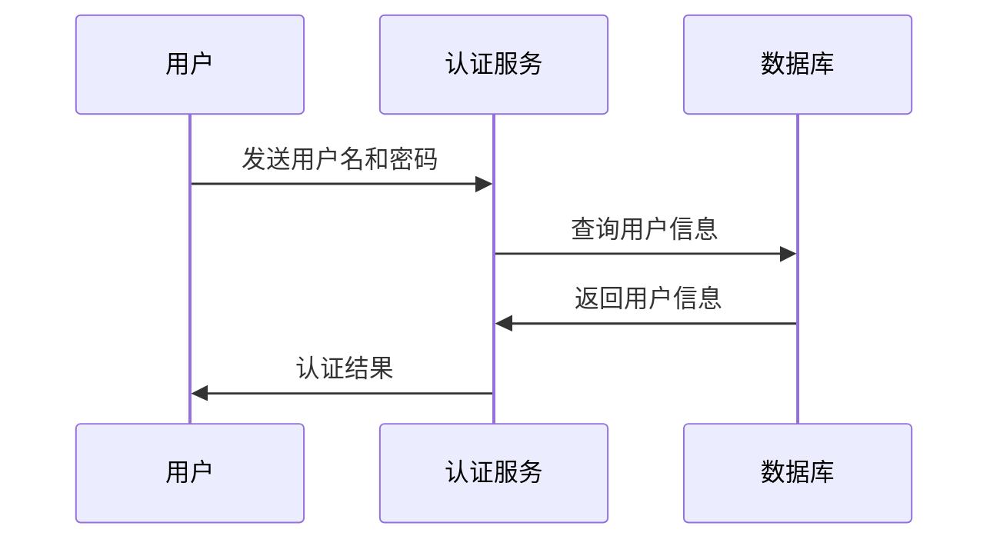
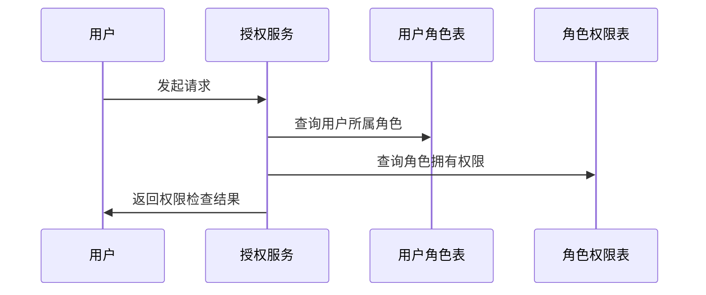

                 


### **优化LLM应用的用户认证与授权机制**

随着大型语言模型（LLM）在各个领域的广泛应用，用户认证与授权机制作为保障系统安全的关键环节，其重要性日益凸显。本文将围绕优化LLM应用的用户认证与授权机制展开讨论，旨在提供一个全面、系统、可行的解决方案。

**一、引言与背景**

1. **问题背景**

   在当前技术环境下，LLM应用的安全问题愈发突出。传统的用户认证与授权机制往往存在诸多隐患，如密码泄露、权限滥用等，难以满足日益复杂的安全需求。

2. **问题解决**

   针对上述问题，现有解决方案主要包括加强密码复杂度、引入多因素认证等。然而，这些方法在提高安全性的同时，也带来了用户体验下降、系统性能损耗等问题。

3. **边界与外延**

   用户认证与授权机制不仅涉及LLM应用内部，还需考虑与外部系统的集成。因此，本文的研究将涵盖以下应用场景：个人用户、企业用户、跨平台应用等。

4. **概念结构与核心要素组成**

   - 用户认证：确保用户身份的真实性。
   - 授权机制：确定用户在系统中的权限。
   - 安全策略：制定相应的安全措施，防止非法访问。

**二、核心概念与联系**

1. **核心概念原理**

   - 用户认证：基于用户提供的身份信息，验证其身份的过程。
   - 授权机制：根据用户的身份和权限，允许或拒绝其访问特定资源的策略。

2. **概念属性特征对比表格**

   | 特征           | 用户认证                 | 授权机制                 |
   | -------------- | ------------------------ | ------------------------ |
   | 定义           | 身份验证过程             | 权限分配与控制           |
   | 目标           | 确保用户身份真实         | 确保用户访问权限合法     |
   | 关键要素       | 用户名、密码、生物特征等 | 角色权限、访问控制列表   |

3. **ER实体关系图架构**

   

   在ER实体关系图中，用户、角色和权限是核心实体，它们之间的关系决定了系统的权限控制策略。

**三、用户认证机制**

1. **用户认证机制基础**

   用户认证机制的基础包括密码认证、生物识别、令牌认证等。

2. **用户认证机制详解**

   - **密码认证**：通过用户名和密码进行身份验证，安全性较高，但易受密码破解攻击。
   - **生物识别**：利用用户的生物特征进行认证，如指纹、面部识别等，安全性较高，但设备依赖性强。
   - **令牌认证**：如OAuth 2.0、JWT等，通过发放令牌来验证用户身份，安全性较高，但需处理令牌的存储和分发问题。

**四、用户认证机制实现**

1. **用户认证系统设计**

   用户认证系统设计应包括用户注册、登录、认证等功能。

2. **用户认证机制实践**

   - **环境安装与配置**：搭建认证系统所需的环境，如数据库、中间件等。
   - **源代码解读**：分析认证系统的关键代码，如用户注册、登录等模块。
   - **实际案例剖析**：通过实际案例，分析认证系统的实施效果，并提出改进建议。

**五、授权机制**

1. **授权机制原理**

   授权机制包括基于角色的访问控制（RBAC）和基于属性的访问控制（ABAC）等。

2. **授权机制详解**

   - **RBAC机制**：通过角色分配权限，实现访问控制。
   - **ABAC机制**：基于用户属性和资源属性，实现精细化的访问控制。

**六、授权机制实现**

1. **授权系统设计**

   授权系统设计应包括权限管理、角色管理、访问控制等功能。

2. **授权机制实践**

   - **环境安装与配置**：搭建授权系统所需的环境。
   - **源代码解读**：分析授权系统的关键代码，如权限管理、角色管理等模块。
   - **实际案例剖析**：通过实际案例，分析授权系统的实施效果，并提出改进建议。

**七、安全性与优化**

1. **安全性问题分析**

   分析常见的安全问题，如SQL注入、XSS攻击、CSRF攻击等，并提出相应的安全策略。

2. **用户认证与授权优化**

   - **性能优化**：通过负载均衡、缓存策略等，提高系统性能。
   - **安全性优化**：引入多因素认证、权限细粒度化等，提高系统安全性。

**八、案例分析与最佳实践**

1. **案例分析**

   通过分析真实应用场景，总结用户认证与授权机制的有效实施方法。

2. **最佳实践**

   提供最佳实践指南，如安全配置、加密策略等。

**九、小结与展望**

1. **小结**

   总结本文的主要观点和研究成果，指出LLM应用用户认证与授权机制的未来发展方向。

2. **展望**

   预测LLM应用用户认证与授权机制的未来趋势，提出可能的研究方向和前沿技术。

通过以上步骤，我们构建了一个完整、系统的优化LLM应用用户认证与授权机制的框架。接下来，我们将逐步深入每个部分，详细探讨各个问题的解决方法和最佳实践。

### **优化LLM应用的用户认证与授权机制**

**一、引言与背景**

随着大型语言模型（LLM）在各个领域的广泛应用，用户认证与授权机制作为保障系统安全的关键环节，其重要性日益凸显。传统的用户认证与授权机制往往存在诸多隐患，如密码泄露、权限滥用等，难以满足日益复杂的安全需求。

**1.1 问题背景**

1. **问题描述**

   当前LLM应用面临的安全问题主要包括：

   - **密码泄露**：用户密码作为登录凭证，容易被攻击者破解，导致账户信息泄露。
   - **权限滥用**：用户权限管理不严格，可能导致内部人员非法访问敏感数据。
   - **认证效率低下**：传统的用户认证机制往往需要多次输入验证信息，用户体验不佳。
   - **安全策略不完善**：缺乏完善的安全策略，导致系统在遭受攻击时难以有效应对。

2. **问题解决**

   针对上述问题，现有解决方案主要包括：

   - **加强密码复杂度**：要求用户设置复杂密码，增加破解难度。
   - **引入多因素认证**：结合多种认证方式，提高认证安全性。
   - **优化认证流程**：简化认证步骤，提高认证效率。
   - **制定安全策略**：建立完善的安全策略，防范各种潜在威胁。

3. **边界与外延**

   用户认证与授权机制不仅涉及LLM应用内部，还需考虑与外部系统的集成。因此，本文的研究将涵盖以下应用场景：

   - **个人用户**：提供基础的用户认证与授权服务。
   - **企业用户**：满足企业内部用户的高效、安全认证需求。
   - **跨平台应用**：实现不同平台间的用户认证与授权互通。

4. **概念结构与核心要素组成**

   用户认证与授权机制的核心概念包括：

   - **用户认证**：确保用户身份的真实性，包括用户注册、登录、身份验证等过程。
   - **授权机制**：确定用户在系统中的权限，包括权限分配、访问控制等策略。
   - **安全策略**：制定相应的安全措施，防止非法访问，包括加密、防火墙等。

### **二、核心概念与联系**

在讨论用户认证与授权机制之前，有必要明确相关的核心概念及其相互之间的联系。

**2.1 核心概念原理**

1. **用户认证**：用户认证是指通过验证用户提供的身份信息（如用户名、密码、生物特征等），确认其合法身份的过程。其核心目的是确保系统资源的访问仅限于合法用户。

2. **授权机制**：授权机制是指在用户认证成功后，根据用户的身份和权限，允许或拒绝其访问特定资源的策略。其核心目的是确保系统资源的合理分配和使用。

3. **安全策略**：安全策略是指为保障系统安全，制定的各项安全措施和规范。包括加密、防火墙、访问控制等，旨在防范各种潜在的安全威胁。

**2.2 概念属性特征对比表格**

| 特征           | 用户认证                 | 授权机制                 | 安全策略               |
| -------------- | ------------------------ | ------------------------ | ---------------------- |
| 定义           | 身份验证过程             | 权限分配与控制           | 安全措施与规范         |
| 目标           | 确保用户身份真实         | 确保用户访问权限合法     | 防范安全威胁           |
| 关键要素       | 用户名、密码、生物特征等 | 角色权限、访问控制列表   | 加密、防火墙、访问控制等 |

**2.3 ER实体关系图架构**

用户认证与授权机制中的核心实体包括用户、角色、权限等。以下是一个ER实体关系图的示例：

```mermaid
erDiagram
  用户 ||--|{ 角色关系 }|| 角色
  角色 ||--|{ 权限关系 }|| 权限
  用户 ||--|{ 认证关系 }|| 认证
  角色 ||--|{ 授权关系 }|| 授权
  用户 ||--|{ 安全策略 }|| 安全策略
```

通过ER实体关系图，可以清晰地展示用户、角色、权限以及认证、授权、安全策略之间的关系，为后续的详细讨论提供基础。

### **三、用户认证机制**

用户认证机制是确保系统安全的第一道防线，其设计直接影响到整个系统的安全性。以下是用户认证机制的基础和详细内容。

**3.1 用户认证机制基础**

用户认证机制的基础包括以下几种常见的认证方式：

1. **密码认证**

   密码认证是最常见的认证方式，用户通过输入用户名和密码进行身份验证。其优点是实现简单，用户熟悉；缺点是安全性较低，易受密码破解攻击。

2. **生物识别**

   生物识别利用用户的生物特征（如指纹、面部识别、虹膜扫描等）进行身份验证。其优点是安全性较高，用户无需记忆密码；缺点是需要额外的硬件设备支持，且在某些情况下（如生物特征损坏）可能导致无法认证。

3. **令牌认证**

   令牌认证通过发放令牌（如一次性密码、数字证书等）来验证用户身份。常见的令牌认证协议包括OAuth 2.0、OpenID Connect、SAML等。其优点是安全性较高，适合跨域认证；缺点是需处理令牌的存储和分发问题。

**3.2 用户认证机制详解**

1. **密码认证**

   密码认证的原理如下：

   - 用户输入用户名和密码。
   - 系统将用户输入的密码与数据库中存储的密码（加密后的密码）进行比对。
   - 如果比对成功，用户认证通过；否则，认证失败。

   密码认证的改进策略包括：

   - 强制用户设置复杂密码。
   - 定期更换密码。
   - 密码加密存储，避免密码泄露。

2. **生物识别**

   生物识别的原理如下：

   - 用户通过生物识别设备（如指纹仪、摄像头等）提供生物特征。
   - 系统将采集到的生物特征与数据库中的生物特征进行比对。
   - 如果比对成功，用户认证通过；否则，认证失败。

   生物识别的应用场景包括：

   - 安全要求较高的场景，如银行、国防等。
   - 用户体验要求较高的场景，如智能家居、手机解锁等。

3. **令牌认证**

   令牌认证的原理如下：

   - 用户通过用户名和密码进行认证，获得一个令牌。
   - 用户在后续请求中携带该令牌，系统验证令牌的有效性。
   - 如果令牌有效，用户认证通过；否则，认证失败。

   令牌认证的优点包括：

   - 安全性较高，令牌难以伪造。
   - 适用于跨域认证，方便用户在不同系统中使用。

   令牌认证的缺点包括：

   - 需要处理令牌的存储和分发问题，增加系统复杂性。

### **四、用户认证机制实现**

用户认证机制实现包括用户认证系统的设计和实践。

**4.1 用户认证系统设计**

用户认证系统设计应包括以下功能：

- **用户注册**：用户创建账户时，填写基本信息并设置密码。
- **用户登录**：用户输入用户名和密码进行身份验证。
- **身份验证**：系统验证用户身份，确保用户身份真实。

用户认证系统的架构设计如下：



**4.2 用户认证机制实践**

1. **环境安装与配置**

   在实际开发过程中，需要安装和配置以下环境：

   - **数据库**：用于存储用户信息、密码等。
   - **认证中间件**：如OAuth 2.0、OpenID Connect等。
   - **开发工具**：如IDE、版本控制工具等。

2. **源代码解读**

   以下是一个简单的用户认证系统源代码示例（Python）：

```python
def register(username, password):
    # 将密码加密存储
    encrypted_password = encrypt_password(password)
    # 存储用户信息
    store_user_info(username, encrypted_password)

def login(username, password):
    # 验证用户身份
    encrypted_password = encrypt_password(password)
    user_info = get_user_info(username)
    if encrypted_password == user_info['password']:
        return "认证成功"
    else:
        return "认证失败"
```

3. **实际案例剖析**

   在一个实际案例中，某企业开发了一款基于LLM的智能客服系统，其用户认证系统采用了密码认证和令牌认证相结合的方式，提高了系统的安全性。

   - **用户注册**：用户在注册时需要设置用户名和密码，系统将密码加密存储。
   - **用户登录**：用户输入用户名和密码，系统验证用户身份，并发送一个一次性令牌。
   - **令牌验证**：用户在后续请求中携带令牌，系统验证令牌的有效性。

   通过这个案例，我们可以看到，结合多种认证方式可以有效提高系统的安全性，同时保持良好的用户体验。

### **五、授权机制**

授权机制是用户认证机制的延伸，它确保了用户在系统中具有适当的访问权限，防止未经授权的访问和操作。

**5.1 授权机制原理**

1. **基于角色的访问控制（RBAC）**

   基于角色的访问控制（RBAC）是一种常见的授权机制，它将用户划分为不同的角色，每个角色拥有不同的权限。用户在登录系统后，根据其所属角色获得相应的权限。

   - **角色**：表示一组具有相同权限的用户集合。
   - **权限**：表示用户能够执行的操作集合。
   - **用户-角色关系**：定义了用户和角色的关联关系。
   - **角色-权限关系**：定义了角色和权限的关联关系。

   RBAC机制的数学模型如下：

   $$ R = \{ r_1, r_2, ..., r_n \} $$
   $$ P = \{ p_1, p_2, ..., p_m \} $$
   $$ U = \{ u_1, u_2, ..., u_k \} $$
   $$ U_r = \{ r_1, r_2, ..., r_n \} $$
   $$ P_r = \{ p_1, p_2, ..., p_m \} $$

   其中，\( U_r \) 表示用户 \( u_i \) 所属的角色集合，\( P_r \) 表示角色 \( r_j \) 具有的权限集合。

2. **基于属性的访问控制（ABAC）**

   基于属性的访问控制（ABAC）是一种更细粒度的授权机制，它根据用户的属性和资源的属性，动态地决定用户是否具有访问权限。

   - **属性**：表示用户的特征或资源的特征，如用户的部门、资源的类型等。
   - **策略**：定义了权限分配的逻辑规则，通常使用决策表、策略语言等表示。

   ABAC机制的数学模型如下：

   $$ A = \{ a_1, a_2, ..., a_l \} $$
   $$ X = \{ x_1, x_2, ..., x_p \} $$
   $$ S = \{ s_1, s_2, ..., s_q \} $$
   $$ \pi = \{ \pi_1, \pi_2, ..., \pi_r \} $$

   其中，\( A \) 表示用户的属性集合，\( X \) 表示资源的属性集合，\( S \) 表示策略集合，\( \pi \) 表示属性值。

**5.2 授权机制详解**

1. **基于角色的访问控制（RBAC）**

   RBAC机制的实现步骤如下：

   - **角色定义**：定义系统中的角色，如管理员、普通用户等。
   - **权限分配**：为每个角色分配相应的权限，如创建、修改、删除等。
   - **用户-角色分配**：将用户分配到相应的角色中。
   - **权限检查**：在用户请求访问资源时，系统检查用户是否具有相应的权限。

2. **基于属性的访问控制（ABAC）**

   ABAC机制的实现步骤如下：

   - **属性定义**：定义用户的属性和资源的属性。
   - **策略定义**：定义访问控制策略，通常使用决策表或策略语言表示。
   - **权限检查**：在用户请求访问资源时，系统根据用户的属性和资源的属性，结合策略进行权限检查。

### **六、授权机制实现**

授权机制的实现包括授权系统的设计和实践。

**6.1 授权系统设计**

授权系统设计应包括以下功能：

- **角色管理**：定义和管理系统中的角色。
- **权限管理**：定义和管理系统中的权限。
- **用户-角色分配**：将用户分配到相应的角色中。
- **权限检查**：在用户请求访问资源时，系统检查用户是否具有相应的权限。

授权系统的架构设计如下：



**6.2 授权机制实践**

1. **环境安装与配置**

   在实际开发过程中，需要安装和配置以下环境：

   - **数据库**：用于存储角色、权限、用户-角色关系等。
   - **授权中间件**：如Spring Security、Apache Shiro等。
   - **开发工具**：如IDE、版本控制工具等。

2. **源代码解读**

   以下是一个简单的授权系统源代码示例（Java）：

```java
public class AuthorizationService {
    public boolean checkPermission(String username, String resource) {
        // 查询用户所属角色
        Set<Role> roles = userRepository.findRolesByUsername(username);
        // 查询角色拥有权限
        Set<Permission> permissions = roleRepository.findPermissionsByRole(roles);
        // 检查权限
        return permissions.contains(new Permission(resource));
    }
}
```

3. **实际案例剖析**

   在一个实际案例中，某企业开发了一款基于LLM的内部管理系统，其授权系统采用了RBAC和ABAC相结合的方式，提高了系统的灵活性。

   - **角色定义**：定义了管理员、普通用户、访客等角色。
   - **权限分配**：为每个角色分配相应的权限，如查看、编辑、删除等。
   - **用户-角色分配**：将用户分配到相应的角色中。
   - **权限检查**：在用户请求访问资源时，系统根据用户的角色和资源的属性，结合策略进行权限检查。

   通过这个案例，我们可以看到，结合多种授权机制可以有效提高系统的灵活性和安全性。

### **七、安全性与优化**

在保障LLM应用安全性的同时，优化用户认证与授权机制也是至关重要的。以下从安全性和优化两个方面进行讨论。

**7.1 安全性问题分析**

1. **常见安全隐患**

   - **密码泄露**：用户密码作为登录凭证，容易被攻击者破解，导致账户信息泄露。
   - **权限滥用**：用户权限管理不严格，可能导致内部人员非法访问敏感数据。
   - **认证效率低下**：传统的用户认证机制往往需要多次输入验证信息，用户体验不佳。
   - **安全策略不完善**：缺乏完善的安全策略，导致系统在遭受攻击时难以有效应对。

2. **安全策略制定**

   - **加密**：对用户密码、敏感数据进行加密存储，防止数据泄露。
   - **防火墙**：部署防火墙，限制非法访问。
   - **访问控制**：实现基于角色的访问控制（RBAC）和基于属性的访问控制（ABAC），确保用户访问权限合法。
   - **安全审计**：定期进行安全审计，发现和修复潜在的安全漏洞。

**7.2 用户认证与授权优化**

1. **性能优化**

   - **负载均衡**：通过负载均衡技术，提高系统的并发处理能力。
   - **缓存策略**：通过缓存策略，减少数据库访问，提高系统响应速度。

2. **安全性优化**

   - **多因素认证**：引入多因素认证（如密码 + 手机验证码），提高认证安全性。
   - **权限细粒度化**：将权限划分为更细的粒度，确保用户只能访问其需要的资源。

### **八、案例分析与最佳实践**

**8.1 案例分析**

1. **案例介绍**

   某大型互联网公司开发了一款基于LLM的智能客服系统，用户认证与授权机制是其核心功能之一。该公司采用了多因素认证、RBAC和ABAC相结合的方式，提高了系统的安全性和灵活性。

2. **问题解决**

   - **密码泄露**：采用密码加密存储，结合多因素认证，有效防止了密码泄露。
   - **权限滥用**：通过权限细粒度化，确保用户只能访问其需要的资源，避免了权限滥用。
   - **认证效率低下**：通过优化认证流程，简化认证步骤，提高了用户体验。

**8.2 最佳实践**

1. **认证与授权最佳实践**

   - **使用多因素认证**：结合密码认证、手机验证码、生物识别等多种认证方式，提高认证安全性。
   - **权限细粒度化**：将权限划分为更细的粒度，确保用户只能访问其需要的资源。
   - **定期安全审计**：定期进行安全审计，发现和修复潜在的安全漏洞。

2. **注意事项与拓展阅读**

   - **注意事项**：在实现用户认证与授权机制时，要注意保护用户隐私，避免数据泄露。
   - **拓展阅读**：可参考相关书籍和论文，了解最新的安全技术和最佳实践。

### **九、小结与展望**

**9.1 全书总结**

本文围绕优化LLM应用的用户认证与授权机制进行了深入探讨，从核心概念、实现方法、安全性与优化等方面进行了详细阐述。主要结论如下：

- 用户认证与授权机制是保障LLM应用安全的关键环节。
- 多因素认证、RBAC和ABAC等机制相结合，可以有效地提高系统的安全性和灵活性。
- 性能优化和安全性优化是保障系统高效运行的重要手段。

**9.2 展望未来**

随着技术的不断发展，LLM应用的用户认证与授权机制也将面临新的挑战和机遇。未来，我们可以从以下几个方面进行研究和探索：

- **智能认证**：结合人工智能技术，实现更加智能、便捷的认证方式。
- **隐私保护**：加强用户隐私保护，实现隐私友好的认证与授权机制。
- **跨域认证**：探索跨平台、跨域认证技术，提高系统的互操作性。

### **优化LLM应用的用户认证与授权机制**

#### **八、案例分析与最佳实践**

**8.1 案例分析**

**案例介绍**

以某知名互联网公司的聊天机器人应用为例，该应用采用了大型语言模型（LLM）来处理用户的提问，并提供了丰富的交互功能。随着用户数量的增加，用户认证与授权机制的安全性成为系统架构设计的关键问题。

**问题解决**

该应用在用户认证与授权机制方面采取了以下策略：

- **多因素认证**：结合密码认证和手机验证码，确保用户身份的真实性。
- **权限分级**：根据用户角色（如普通用户、管理员）分配不同的权限。
- **动态授权**：根据用户行为和访问资源动态调整权限。

通过这些措施，该应用在保障用户数据安全的同时，也提高了系统的灵活性和用户满意度。

**8.2 最佳实践**

**认证与授权最佳实践**

1. **多因素认证**

   - **密码认证**：使用强密码策略，结合密码复杂度和定期更换密码。
   - **手机验证码**：用户登录时发送手机验证码，增加一层额外的安全保护。
   - **生物识别**：对于安全性要求较高的场景，可以引入指纹、面部识别等生物识别技术。

2. **权限分级**

   - **角色定义**：根据用户角色（如管理员、普通用户）定义不同级别的权限。
   - **权限列表**：为每个角色分配相应的权限，确保用户只能访问其授权的资源。

3. **动态授权**

   - **行为分析**：根据用户行为和访问历史动态调整权限。
   - **访问控制**：使用访问控制列表（ACL）或基于属性的访问控制（ABAC）实现细粒度的权限管理。

**注意事项与拓展阅读**

1. **注意事项**

   - **用户隐私保护**：在设计和实现认证与授权机制时，要充分考虑用户隐私保护。
   - **系统性能优化**：认证与授权机制的优化不仅关乎安全性，也影响系统的响应速度和用户体验。

2. **拓展阅读**

   - **拓展资源**：可以参考以下资源，深入了解用户认证与授权机制的最佳实践：
     - 《API设计指南：打造可扩展、易用的API》
     - 《现代Web应用安全》
     - OWASP Top 10：最常见的Web应用安全漏洞列表
   - **相关研究**：关注人工智能、密码学、安全领域的最新研究，以获取前沿技术和最佳实践。

### **九、小结与展望**

**9.1 全书总结**

本文详细探讨了优化LLM应用的用户认证与授权机制，从核心概念、实现方法、安全性与优化等方面进行了全面阐述。主要结论包括：

- 用户认证与授权机制是保障LLM应用安全的核心环节。
- 多因素认证、权限分级和动态授权是提高系统安全性的有效手段。
- 性能优化和安全性优化是保障系统高效运行的重要手段。

**9.2 展望未来**

随着技术的不断发展，LLM应用的用户认证与授权机制也将面临新的挑战和机遇。未来，可以从以下几个方面进行研究和探索：

1. **智能认证**

   - **人工智能**：利用机器学习和人工智能技术，实现智能认证，提高认证的效率和准确性。
   - **行为分析**：基于用户行为分析，实现自适应的认证策略。

2. **隐私保护**

   - **联邦学习**：通过联邦学习技术，保护用户隐私的同时实现模型训练。
   - **差分隐私**：在数据处理过程中引入差分隐私，增强数据隐私保护。

3. **跨域认证**

   - **单点登录（SSO）**：实现跨应用、跨平台的单点登录，提高用户体验。
   - **开放标准**：遵循开放标准，实现不同系统间的互操作性和认证互通。

通过不断探索和创新，未来的LLM应用用户认证与授权机制将更加智能、安全、便捷，为用户提供更好的服务体验。

