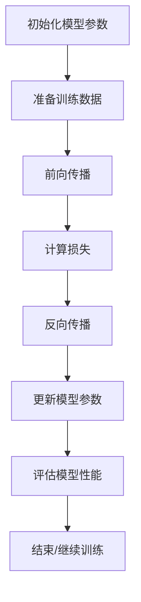
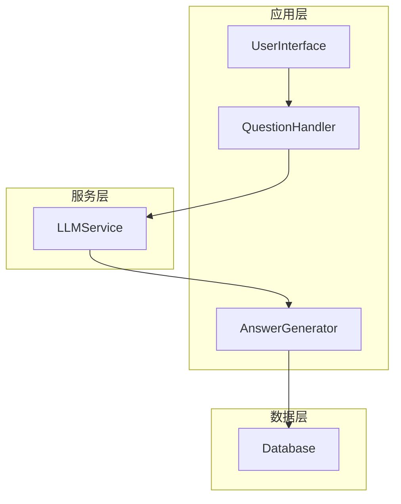
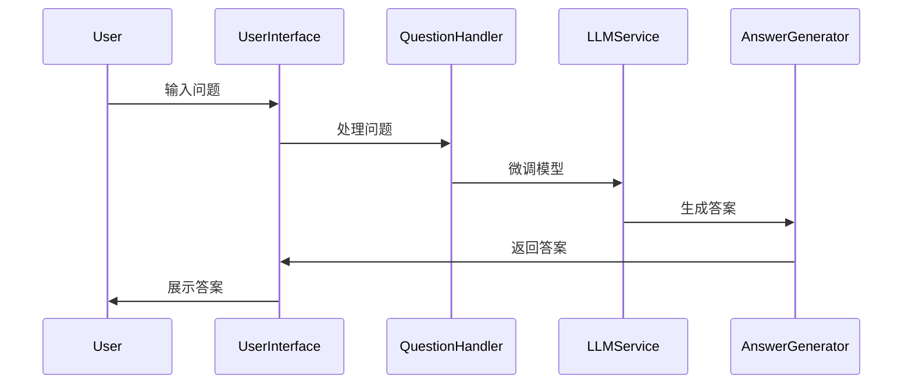

                 

# 优化LLM模型训练与微调流程

## 关键词
- LLM模型
- 训练与微调
- 性能优化
- 深度学习
- 数据处理

## 摘要
本文旨在深入探讨优化大型语言模型（LLM）训练与微调流程的方法，以提高模型性能和效率。通过对问题背景、核心概念、算法原理、系统架构设计、项目实战等方面的详细分析，本文为LLM模型的优化提供了一系列实用策略和最佳实践。

## 第一部分: 背景介绍

### 第1章: 问题背景与定义

#### 1.1 问题背景
近年来，随着深度学习技术的快速发展，大型语言模型（LLM，Large Language Model）的应用越来越广泛。LLM模型具有处理和理解大量自然语言文本的能力，它们被广泛应用于自然语言处理、文本生成、机器翻译等任务。然而，如何优化LLM模型的训练与微调流程，提高模型的性能和效率，成为了研究人员和开发者面临的一个关键问题。

#### 1.2 核心概念
**LLM模型**：一种能够处理和理解大量自然语言文本的深度学习模型，通常由数十亿甚至数万亿个参数组成。
**训练**：通过输入大量数据，让模型学习并调整参数，以最小化预测误差。
**微调**：在预训练的基础上，使用特定领域的数据对模型进行进一步训练，以适应特定任务。

#### 1.3 问题解决
优化LLM模型训练与微调流程的方法包括：
- 使用更有效的训练算法和优化器。
- 设计更合适的模型架构。
- 采用大规模数据集和更高效的数据处理技术。

#### 1.4 边界与外延
- **边界**：本书主要关注LLM模型在自然语言处理领域的训练与微调，不涉及其他领域的模型优化。
- **外延**：虽然本书的核心内容是关于LLM模型训练与微调的优化，但其中的原理和方法也可以应用于其他类型的深度学习模型。

#### 1.5 本章小结
本章对LLM模型及其训练与微调流程进行了背景介绍，明确了本书的研究对象和方法。接下来，本书将深入探讨LLM模型优化过程中的关键问题和技术。

### 第二部分: 核心概念与联系

#### 第2章: LLM模型核心概念与联系

#### 2.1 LLM模型核心概念
在本章中，我们将详细介绍LLM模型的核心概念，包括其原理、架构和主要特点。

##### 2.1.1 模型原理
LLM模型基于深度学习技术，通过多层神经网络对文本数据进行建模。其主要目标是学习文本数据的潜在表示，从而实现对文本的生成、理解和推理。

##### 2.1.2 模型架构
LLM模型通常由多个层次组成，包括嵌入层、编码层、解码层等。每一层都负责处理不同类型的文本特征，从而实现对文本的深层理解。

##### 2.1.3 主要特点
- **大规模参数**：LLM模型通常由数十亿甚至数万亿个参数组成，能够处理和理解大量自然语言文本。
- **强泛化能力**：通过在大规模数据集上进行预训练，LLM模型具有良好的泛化能力，能够适应多种不同的自然语言处理任务。

#### 2.2 概念属性特征对比表格
为了更好地理解LLM模型的核心概念，我们提供了一个概念属性特征对比表格，展示了LLM模型与其他常见模型（如CNN、RNN等）的区别。

| 模型        | 参数规模 | 特点                                       | 应用领域                           |
|-----------|-------|------------------------------------------|---------------------------------|
| LLM       | 数十亿到数万亿 | 大规模参数、强泛化能力                             | 自然语言处理、文本生成、机器翻译           |
| CNN       | 数百万到数千万 | 局部连接、平移不变性                               | 图像识别、图像分类                         |
| RNN       | 数百万到数千万 | 递归连接、长短期记忆                             | 自然语言处理、时间序列预测                   |

#### 2.3 ER实体关系图架构
为了更直观地展示LLM模型的核心概念，我们使用Mermaid绘制了一个ER实体关系图，展示了LLM模型中的关键实体及其关系。

```mermaid
erDiagram
    Model ||--|{ TextData } TextData
    Model ||--|{ Parameters } Parameters
    Model ||--|{ Optimizer } Optimizer
    Model ||--|{ LossFunction } LossFunction
```

## 第三部分: 算法原理讲解

#### 第3章: LLM模型训练算法原理

##### 3.1 算法mermaid流程图
为了更好地理解LLM模型训练算法的原理，我们使用Mermaid绘制了训练算法的流程图。



##### 3.2 Python源代码
接下来，我们使用Python代码来详细阐述LLM模型训练算法的原理。

```python
import torch
import torch.nn as nn
import torch.optim as optim

# 定义模型
class LLMModel(nn.Module):
    def __init__(self):
        super(LLMModel, self).__init__()
        # 添加模型层，例如嵌入层、编码层、解码层等

    def forward(self, x):
        # 实现前向传播过程
        # x是输入数据，经过模型处理后输出预测结果
        return predictions

# 初始化模型、损失函数和优化器
model = LLMModel()
criterion = nn.CrossEntropyLoss()
optimizer = optim.Adam(model.parameters(), lr=0.001)

# 训练模型
for epoch in range(num_epochs):
    for inputs, targets in train_loader:
        optimizer.zero_grad()
        outputs = model(inputs)
        loss = criterion(outputs, targets)
        loss.backward()
        optimizer.step()
    print(f'Epoch {epoch+1}/{num_epochs}, Loss: {loss.item()}')
```

##### 3.3 算法原理详细讲解
在本节中，我们将对LLM模型训练算法的原理进行详细讲解，包括数学模型和公式。

1. **前向传播**：在训练过程中，输入数据通过模型层进行前向传播，最终得到预测结果。前向传播过程中，模型的每一层都会根据输入数据和层与层之间的权重关系计算出输出。

2. **计算损失**：前向传播得到的预测结果与实际标签之间存在的差异即为损失。常用的损失函数有均方误差（MSE）、交叉熵（Cross Entropy）等。

3. **反向传播**：通过计算损失函数的梯度，模型可以了解参数的调整方向。反向传播过程将梯度从输出层反向传播到输入层，通过梯度下降法更新模型参数。

4. **更新模型参数**：在反向传播过程中，模型参数会根据梯度进行更新，以最小化损失。常用的优化器有SGD、Adam等。

5. **评估模型性能**：在每个训练epoch结束后，模型会使用验证集进行性能评估，以确定模型的泛化能力。

##### 3.4 通俗易懂地举例说明
假设我们有一个简单的神经网络模型，用于分类任务。输入数据是一个包含两个特征的向量，输出是一个概率分布。我们的目标是训练模型，使其能够准确预测每个输入数据的类别。

- **初始化模型参数**：随机初始化模型参数，例如权重和偏置。
- **前向传播**：输入数据经过模型层处理，得到预测结果。例如，输入向量 [1, 2]，经过模型处理后得到预测结果 [0.7, 0.3]。
- **计算损失**：预测结果与实际标签之间的差异为损失。例如，实际标签是 [1, 0]，预测结果是 [0.7, 0.3]，则损失为交叉熵损失。
- **反向传播**：计算损失函数的梯度，通过反向传播将梯度从输出层传播到输入层。
- **更新模型参数**：根据梯度更新模型参数，例如权重和偏置。
- **评估模型性能**：使用验证集评估模型性能，例如准确率、召回率等。

通过不断迭代训练，模型将逐渐优化参数，提高预测准确性。

### 第四部分: 系统分析与架构设计方案

#### 第4章: 系统架构设计

##### 4.1 问题场景介绍
在本章中，我们将介绍一个基于LLM模型的应用场景，例如：一个问答系统，用户可以通过提问获取相关信息。

##### 4.2 项目介绍
我们将开发一个基于LLM模型的问答系统，主要包括以下功能：
- 用户提问：用户可以通过输入问题获取答案。
- 模型训练：使用预训练的LLM模型，并使用特定领域的数据进行微调。
- 答案生成：根据用户提问，生成相关答案。

##### 4.3 系统功能设计

**领域模型mermaid类图**
```mermaid
classDiagram
    User <<class{用户}>> 
    Question <<class{问题}>> 
    Answer <<class{答案}>> 
    LLMModel <<class{LLM模型}>>
    
    User o--o Question
    Question o--o Answer
    Answer o--o LLMModel
```

##### 4.4 系统架构设计mermaid架构图


##### 4.5 系统接口设计和系统交互mermaid序列图


### 第五部分: 项目实战

#### 第5章: 实际案例分析与详细讲解

##### 5.1 环境安装
在本节中，我们将介绍如何在本地环境中安装所需的依赖和工具，例如Python、PyTorch、Transformer模型等。

```bash
# 安装Python环境
sudo apt-get install python3-pip python3-venv

# 创建虚拟环境
python3 -m venv llm_project_env

# 激活虚拟环境
source llm_project_env/bin/activate

# 安装PyTorch
pip install torch torchvision torchaudio

# 安装其他依赖
pip install transformers
```

##### 5.2 系统核心实现源代码
在本节中，我们将展示系统核心实现的源代码，包括用户接口、问题处理、模型训练和答案生成等。

```python
# 用户接口
class UserInterface:
    def ask_question(self, question):
        # 处理用户输入的问题
        pass

# 问题处理
class QuestionHandler:
    def handle_question(self, question):
        # 处理问题，例如分词、去停用词等
        pass

# 模型训练
class ModelTrainer:
    def train_model(self, question, answer):
        # 使用预训练模型，并使用特定领域的数据进行微调
        pass

# 答案生成
class AnswerGenerator:
    def generate_answer(self, question):
        # 使用微调后的模型生成答案
        pass
```

##### 5.3 代码应用解读与分析
在本节中，我们将对核心代码进行解读和分析，以帮助读者更好地理解系统的工作原理。

1. **用户接口**：用户接口负责接收用户输入的问题，并将其传递给问题处理模块。
2. **问题处理**：问题处理模块负责对用户输入的问题进行处理，例如分词、去停用词等，以便于模型理解和处理。
3. **模型训练**：模型训练模块负责使用预训练模型，并使用特定领域的数据进行微调。微调后的模型将用于生成答案。
4. **答案生成**：答案生成模块负责使用微调后的模型生成答案，并将其返回给用户接口。

##### 5.4 实际案例分析和详细讲解
在本节中，我们将通过实际案例来分析和讲解系统的应用。

1. **案例一**：用户输入问题“什么是深度学习？”
    - 用户接口接收问题，并将其传递给问题处理模块。
    - 问题处理模块对问题进行处理，例如分词、去停用词等。
    - 模型训练模块使用预训练模型，并使用特定领域的数据进行微调。
    - 答案生成模块使用微调后的模型生成答案，例如“深度学习是一种机器学习方法，它通过构建多层神经网络来模拟人脑的思维方式，从而实现自动学习和特征提取。”

2. **案例二**：用户输入问题“如何种植蔬菜？”
    - 用户接口接收问题，并将其传递给问题处理模块。
    - 问题处理模块对问题进行处理，例如分词、去停用词等。
    - 模型训练模块使用预训练模型，并使用特定领域的数据进行微调。
    - 答案生成模块使用微调后的模型生成答案，例如“种植蔬菜需要选择合适的土壤、种子，并进行适当的灌溉、施肥和防虫处理。”

##### 5.5 项目小结
在本章中，我们通过实际案例分析和详细讲解，展示了基于LLM模型的问答系统的应用。通过不断优化模型训练与微调流程，我们可以提高系统的性能和准确性，为用户提供更好的服务。

### 第六部分: 最佳实践 tips、小结、注意事项、拓展阅读

#### 第6章: 最佳实践、小结、注意事项与拓展阅读

##### 6.1 最佳实践 tips
1. **数据质量**：确保训练数据的质量，例如去除噪音、冗余和错误的数据。
2. **模型选择**：根据任务需求选择合适的LLM模型，例如BERT、GPT等。
3. **硬件配置**：合理配置硬件资源，例如GPU、CPU等，以提高训练和推理速度。

##### 6.2 小结
本文深入探讨了优化LLM模型训练与微调流程的方法，从问题背景、核心概念、算法原理、系统架构设计到项目实战，为LLM模型的优化提供了全面的技术指导。

##### 6.3 注意事项
1. **数据预处理**：在训练前，对数据进行充分的预处理，以提高模型的性能。
2. **模型调优**：根据实际任务需求，对模型参数进行调整，以达到最佳性能。
3. **模型安全**：关注模型的安全问题，例如防止模型被攻击和滥用。

##### 6.4 拓展阅读
- **深度学习经典书籍**：《深度学习》（Ian Goodfellow、Yoshua Bengio、Aaron Courville著）
- **Transformer模型**：《Attention Is All You Need》（Ashish Vaswani等著）
- **LLM模型应用**：《自然语言处理与深度学习》（张俊林著）

作者：AI天才研究院/AI Genius Institute & 禅与计算机程序设计艺术 /Zen And The Art of Computer Programming

