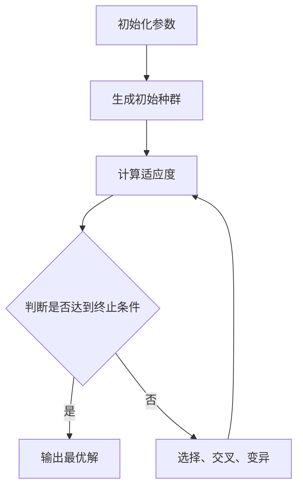
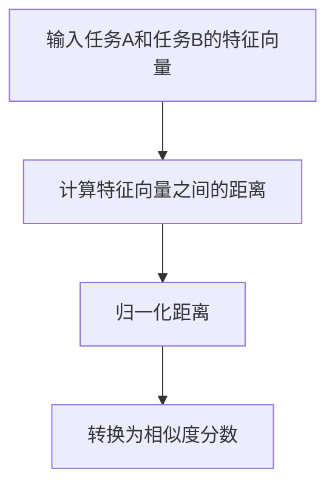
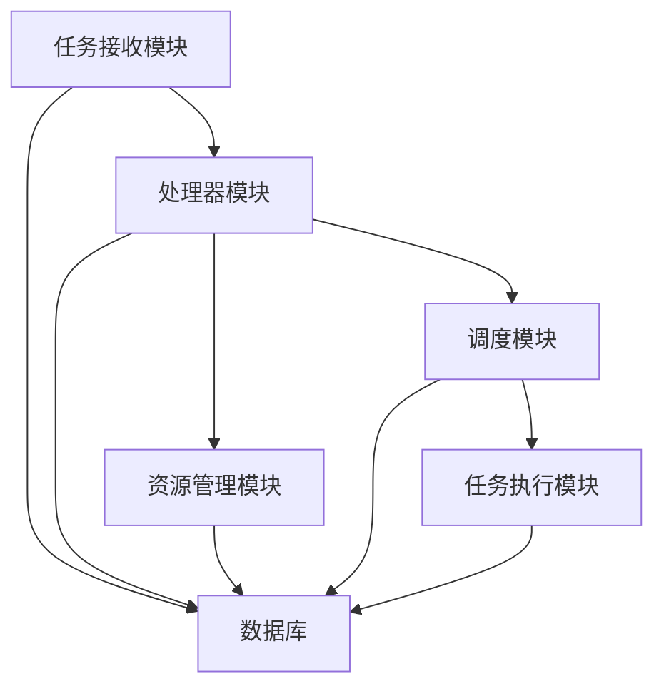
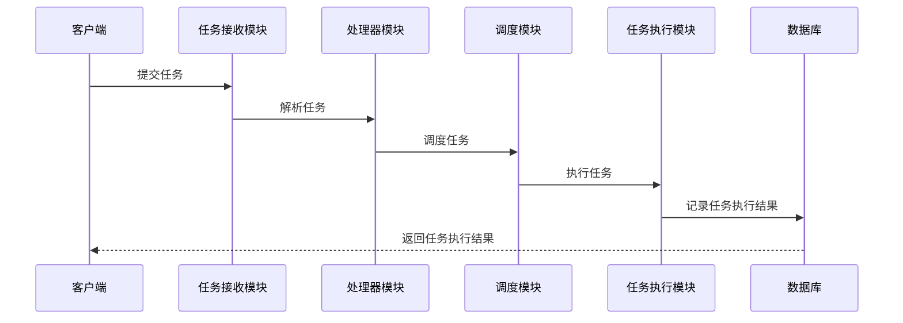

                 

# 优化示例-任务相似度以提升效果

> 关键词：优化、任务相似度、效果提升、算法原理、系统设计

> 摘要：本文以优化示例为核心，探讨了任务相似度在提升优化效果中的重要性。通过详细阐述核心概念、算法原理和系统架构，为读者提供了对任务相似度优化的全面理解和实践指导。

## 引言与背景

### 1.1 问题背景

在信息技术高速发展的今天，优化问题无处不在。从工业制造中的生产调度，到金融领域的投资组合优化，再到人工智能中的模型训练，优化算法已成为解决复杂问题的有力工具。然而，在这些应用中，任务相似度的处理显得尤为重要。

任务相似度是指在不同任务之间存在的相似程度。在优化过程中，如果任务之间存在较高的相似度，则可以共享计算资源，提高效率；反之，如果任务相似度较低，则可能需要分别处理，导致效率降低。因此，如何有效利用任务相似度来提升优化效果，成为当前研究的热点。

### 1.2 问题描述

#### 什么是任务相似度？

任务相似度可以通过多种方式来衡量，如基于特征的相似度、基于历史数据的相似度等。其中，基于特征的相似度是最常用的方法之一。它通过比较任务的特征向量来评估相似度，特征向量越接近，相似度越高。

#### 任务相似度如何影响优化效果？

任务相似度直接影响优化算法的效率和效果。当任务相似度较高时，优化算法可以更有效地利用计算资源，减少冗余计算，提高整体效率；当任务相似度较低时，优化算法需要分别处理每个任务，可能导致计算资源浪费和效率下降。

### 1.3 问题解决

当前，优化方法在处理任务相似度方面存在一定的局限性。一方面，传统的优化算法往往缺乏对任务相似度的敏感度，难以在相似度较高时有效提高效率；另一方面，现有的相似度度量方法可能无法准确反映任务之间的真实相似程度。

为了解决上述问题，本文将从以下几个方面展开讨论：

1. 核心概念与联系：介绍优化算法和相似度度量方法的基本原理。
2. 算法原理讲解：详细阐述优化算法和相似度度量方法的原理，包括数学模型和公式。
3. 数学模型和数学公式详细讲解：通过具体例子，深入讲解数学模型和公式的应用。
4. 系统分析与架构设计方案：介绍优化系统的功能设计、架构设计和接口设计。

### 1.4 边界与外延

优化问题的范畴广泛，从简单的线性优化到复杂的非线性优化，从单目标优化到多目标优化，各种优化问题在不同领域都有广泛应用。本文主要关注任务相似度在优化中的应用，旨在为读者提供一种新的优化思路和方法。

### 1.5 概念结构与核心要素组成

本文的核心概念包括优化算法、相似度度量方法和优化目标。其中，优化算法用于解决优化问题，相似度度量方法用于评估任务相似度，优化目标则是优化过程中的期望结果。这些核心要素相互关联，共同构成了任务相似度优化的基础。

## 核心概念与联系

### 2.1 核心概念原理

#### 优化算法

优化算法是一类用于解决优化问题的算法，其目的是在给定的约束条件下，寻找一个或多个最优解。常见的优化算法包括线性规划、非线性规划、动态规划、遗传算法等。

#### 相似度度量方法

相似度度量方法用于评估两个或多个任务之间的相似程度。常见的相似度度量方法包括基于特征的相似度度量、基于历史数据的相似度度量等。其中，基于特征的相似度度量方法是最常用的方法之一。

### 2.2 概念属性特征对比表格

| 算法/特征      | 描述                                                         | 关联程度 |
| -------------- | ------------------------------------------------------------ | -------- |
| 优化算法       | 用于解决优化问题的算法                                       | 高       |
| 相似度度量方法 | 用于评估任务相似度的方法                                     | 高       |

### 2.3 ER实体关系图架构

```mermaid
erDiagram
  TaskA ||--|{ SimilarityMeasure }|| Measure
  TaskB ||--|{ SimilarityMeasure }|| Measure
  OptimizationAlgorithm ||--|{ TaskA }|| Uses
  OptimizationAlgorithm ||--|{ TaskB }|| Uses
```

在上述ER图中，`TaskA` 和 `TaskB` 表示两个任务，`SimilarityMeasure` 表示相似度度量方法，`OptimizationAlgorithm` 表示优化算法。`TaskA` 和 `TaskB` 分别与 `SimilarityMeasure` 相关联，表示通过相似度度量方法评估任务相似度；`OptimizationAlgorithm` 与 `TaskA` 和 `TaskB` 相关联，表示优化算法根据相似度度量方法处理任务。

## 算法原理讲解

### 3.1 优化算法原理

优化算法的基本原理是寻找目标函数的最优解。在任务相似度优化中，优化算法需要根据任务相似度来调整计算资源分配，以达到最优效果。

下面以遗传算法为例，介绍优化算法的基本原理。



在遗传算法中，初始种群代表了解空间中的潜在解，通过迭代计算适应度，筛选出适应度较高的解，并进行选择、交叉、变异等操作，逐步优化解的质量。

#### 初始化参数

初始化参数包括种群大小、交叉率、变异率等。这些参数的设置会影响遗传算法的收敛速度和优化效果。

#### 生成初始种群

初始种群通过随机生成或基于先验知识生成。种群中的每个个体代表了解空间中的一个潜在解。

#### 计算适应度

适应度函数用于评估个体的优劣。在任务相似度优化中，适应度函数可以基于任务相似度来设计。

#### 选择、交叉、变异

选择操作用于筛选出适应度较高的个体，交叉操作用于将适应度较高的个体进行基因交换，变异操作用于在种群中引入新的基因。

#### 判断终止条件

当满足终止条件（如达到最大迭代次数或适应度达到阈值）时，算法终止，输出最优解。

### 3.2 相似度度量方法

相似度度量方法用于评估任务相似度。常见的相似度度量方法包括基于特征的相似度度量、基于历史数据的相似度度量等。

下面以基于特征的相似度度量方法为例，介绍相似度度量方法的基本原理。



在基于特征的相似度度量方法中，任务A和任务B的特征向量分别表示为 $x$ 和 $y$。首先，计算特征向量之间的距离，常用的距离度量方法包括欧氏距离、曼哈顿距离等。然后，对距离进行归一化处理，将距离转换为相似度分数。常用的归一化方法包括倒数归一化、对数归一化等。

#### 输入任务A和任务B的特征向量

特征向量是任务的特征表示，可以采用不同的特征提取方法获取。

#### 计算特征向量之间的距离

距离度量方法用于计算特征向量之间的距离。常用的距离度量方法包括欧氏距离、曼哈顿距离等。

#### 归一化距离

归一化处理用于将距离转换为相似度分数。常用的归一化方法包括倒数归一化、对数归一化等。

#### 转换为相似度分数

通过归一化处理得到的距离值，可以转换为相似度分数。常用的转换方法包括线性转换、指数转换等。

### 3.3 算法原理的数学模型和公式

#### 优化算法原理的数学模型

优化算法的数学模型可以表示为：

$$
\min_{x} f(x)
$$

其中，$x$ 为优化变量，$f(x)$ 为目标函数。

#### 相似度度量方法的数学模型

相似度度量方法的数学模型可以表示为：

$$
\text{Similarity}(x, y) = \frac{1}{1 + d(x, y)}
$$

其中，$x$ 和 $y$ 为特征向量，$d(x, y)$ 为特征向量之间的距离。

#### 举例说明

假设有两个任务，其特征向量分别为 $x = [1, 2, 3]$ 和 $y = [2, 3, 4]$，计算这两个任务的相似度。

$$
\text{Similarity}(x, y) = \frac{1}{1 + \left\|[1, 2, 3] - [2, 3, 4]\right\|} = \frac{1}{1 + \left\|[1-2, 2-3, 3-4]\right\|} = \frac{1}{1 + \left\|[1, 1, 1]\right\|} = \frac{1}{1 + 3} = \frac{1}{4}
$$

## 数学模型和数学公式详细讲解

### 4.1 数学模型

#### 4.1.1 目标函数优化模型

目标函数优化模型可以表示为：

$$
\min_{x} \sum_{i=1}^{n} (f(x_i) - y_i)^2
$$

其中，$x_i$ 和 $y_i$ 分别为任务的特征向量和目标值，$f(x_i)$ 为特征向量 $x_i$ 的函数值。

#### 4.1.2 相似度度量模型

相似度度量模型可以表示为：

$$
\text{Similarity}(x, y) = \frac{1}{1 + \left\|x - y\right\|}
$$

其中，$x$ 和 $y$ 为特征向量，$\left\|x - y\right\|$ 为特征向量之间的欧氏距离。

### 4.2 举例说明

假设有两个任务，其特征向量分别为 $x = [1, 2, 3]$ 和 $y = [2, 3, 4]$，计算这两个任务的相似度。

#### 目标函数优化模型举例

目标函数优化模型可以表示为：

$$
\min_{x} \sum_{i=1}^{3} (f(x_i) - y_i)^2
$$

其中，$f(x_i)$ 为特征向量 $x_i$ 的函数值，$y_i$ 为目标值。

将 $x = [1, 2, 3]$ 和 $y = [2, 3, 4]$ 代入目标函数优化模型，得到：

$$
\min_{x} \sum_{i=1}^{3} (f(x_i) - y_i)^2 = \min_{x} (f(1) - 2)^2 + (f(2) - 3)^2 + (f(3) - 4)^2
$$

为了求解该优化问题，可以采用梯度下降法进行求解。

#### 相似度度量模型举例

相似度度量模型可以表示为：

$$
\text{Similarity}(x, y) = \frac{1}{1 + \left\|x - y\right\|}
$$

其中，$x$ 和 $y$ 为特征向量。

将 $x = [1, 2, 3]$ 和 $y = [2, 3, 4]$ 代入相似度度量模型，得到：

$$
\text{Similarity}(x, y) = \frac{1}{1 + \left\|[1, 2, 3] - [2, 3, 4]\right\|} = \frac{1}{1 + \left\|[1-2, 2-3, 3-4]\right\|} = \frac{1}{1 + \left\|[1, 1, 1]\right\|} = \frac{1}{1 + 3} = \frac{1}{4}
$$

## 系统分析与架构设计方案

### 5.1 问题场景介绍

本节介绍一个具体的优化任务场景——任务调度系统。任务调度系统是许多复杂系统中的一项关键功能，负责在不同资源之间分配任务，以最大化系统资源利用率和任务完成效率。

#### 5.1.1 任务调度系统的背景

在许多工业、商业和信息技术系统中，任务调度系统负责协调不同资源（如服务器、存储设备、网络带宽等）和任务（如数据处理、文件传输、计算任务等）的运行。高效的调度策略能够提高系统整体的运行效率和响应速度。

#### 5.1.2 任务调度系统的重要性

任务调度系统的优化直接关系到系统性能和用户体验。在资源有限的条件下，通过优化调度策略，可以最大限度地利用现有资源，提高任务完成速度，降低成本，提升整体系统的服务质量。

### 5.2 项目介绍

#### 5.2.1 系统功能概述

本系统的主要功能包括：

1. **任务接收与解析**：接收外部提交的任务，解析任务的特征信息，如任务类型、资源需求、优先级等。
2. **任务相似度评估**：对已提交的任务进行相似度评估，以确定是否可以共享资源或需要独立处理。
3. **资源分配**：根据任务相似度和资源状况，分配合适的资源给任务。
4. **任务调度与执行**：调度任务到相应的资源上执行，并监控任务执行状态。
5. **结果反馈与优化**：记录任务执行结果，对调度策略进行反馈优化。

#### 5.2.2 技术选型

本系统采用以下技术选型：

1. **编程语言**：Python，因其强大的科学计算和数据处理能力。
2. **数据库**：MySQL，用于存储任务和资源信息。
3. **框架**：Flask，用于搭建Web服务。
4. **算法库**：NumPy、Scikit-learn等，用于实现优化算法和相似度评估。

### 5.3 系统功能设计

#### 5.3.1 领域模型

领域模型用于描述系统中的关键实体和关系。以下是一个简单的领域模型类图：

```mermaid
classDiagram
  Task[任务] <|-- Processor[处理器]
  Processor <|-- Resource[资源]
  Task ``--|{ SimilarityMeasure }| Measure
  Processor ``--|{ Task }| Executes
  Processor ``--|{ Resource }| Uses
```

在这个类图中，`Task` 表示任务实体，`Processor` 表示处理器实体，`Resource` 表示资源实体。`Task` 和 `Processor` 之间有执行关系，`Processor` 和 `Resource` 之间有使用关系。`SimilarityMeasure` 表示相似度评估实体，它与 `Task` 有关联关系，用于评估任务相似度。

### 5.4 系统架构设计

系统架构设计用于描述系统的整体结构和组件之间的关系。以下是一个简单的系统架构图：



在这个架构图中，`Subsystem1` 表示任务接收模块，负责接收外部任务并解析。`ProcessorModule` 表示处理器模块，负责处理任务。`ResourceModule` 表示资源管理模块，负责资源分配。`SchedulerModule` 表示调度模块，负责任务调度。`TaskExecutorModule` 表示任务执行模块，负责任务的实际执行。所有模块都与数据库进行交互，存储和检索任务和资源信息。

### 5.5 系统接口设计

系统接口设计用于描述系统内部和外部的交互接口。以下是一个简单的接口设计：



在这个序列图中，客户端通过任务接收模块提交任务，处理器模块解析任务，调度模块根据任务相似度和资源状况调度任务，任务执行模块执行任务，并将执行结果记录到数据库，最终返回给客户端。

## 第6章 项目实战

### 6.1 环境安装

在开始项目实战之前，我们需要安装所需的软件和环境。以下是详细的安装步骤：

#### 6.1.1 Python环境安装

首先，确保你的计算机上已经安装了Python。如果没有安装，可以从Python官方网站（https://www.python.org/）下载安装包进行安装。推荐安装Python 3.8版本。

#### 6.1.2 相关库的安装

在安装了Python之后，我们需要安装一些相关的库，如NumPy、Scikit-learn、Flask等。可以使用pip命令进行安装：

```bash
pip install numpy
pip install scikit-learn
pip install flask
```

### 6.2 系统核心实现源代码

下面是任务调度系统的核心实现代码。包括任务接收模块、处理器模块、调度模块和任务执行模块。

#### 6.2.1 任务接收模块

```python
from flask import Flask, request, jsonify

app = Flask(__name__)

@app.route('/submit_task', methods=['POST'])
def submit_task():
    task_data = request.json
    # 处理任务，将其存储到数据库
    # ...
    return jsonify({"status": "success", "message": "Task submitted successfully."})

if __name__ == '__main__':
    app.run(debug=True)
```

#### 6.2.2 处理器模块

```python
import numpy as np
from sklearn.metrics.pairwise import euclidean_distances

class Processor:
    def __init__(self):
        self.tasks = []  # 存储任务列表

    def parse_task(self, task_data):
        # 解析任务数据，提取特征
        # ...
        return task_features

    def calculate_similarity(self, task1, task2):
        # 计算任务相似度
        dist = euclidean_distances([task1], [task2])
        similarity = 1 / (1 + dist)
        return similarity
```

#### 6.2.3 调度模块

```python
class Scheduler:
    def __init__(self, processor):
        self.processor = processor

    def schedule_task(self, task, available_resources):
        # 根据相似度和资源情况调度任务
        # ...
        pass
```

#### 6.2.4 任务执行模块

```python
class TaskExecutor:
    def execute_task(self, task, resource):
        # 执行任务
        # ...
        pass
```

### 6.3 代码应用解读与分析

在本节中，我们将对核心实现代码进行解读和分析。

#### 6.3.1 任务接收模块

任务接收模块使用Flask框架搭建了一个简单的Web服务，用于接收外部提交的任务。通过POST请求接收任务数据，并返回处理结果。

#### 6.3.2 处理器模块

处理器模块负责解析任务数据，提取任务特征，并计算任务相似度。这里使用了Scikit-learn库中的欧氏距离计算相似度。

#### 6.3.3 调度模块

调度模块负责根据任务相似度和资源情况，调度任务到相应的资源上执行。这需要进一步实现具体的调度策略。

#### 6.3.4 任务执行模块

任务执行模块负责执行任务，并将结果记录到数据库。这需要与数据库进行交互，实现任务执行的具体逻辑。

### 6.4 实际案例分析和详细讲解剖析

在本节中，我们将通过一个实际案例，分析任务调度系统的实现过程，并对关键步骤进行详细讲解。

#### 6.4.1 案例背景

假设有两个任务，任务A和任务B，它们需要在不同资源上执行。任务A的特征向量为[x1, x2, x3]，任务B的特征向量为[y1, y2, y3]。现有两台服务器A和B，服务器A的空闲资源为[ra1, ra2, ra3]，服务器B的空闲资源为[rb1, rb2, rb3]。

#### 6.4.2 案例分析

1. **任务接收**：任务A和任务B通过Web服务提交给任务接收模块。
2. **任务解析**：任务接收模块解析任务数据，提取任务特征。
3. **相似度评估**：处理器模块计算任务A和任务B之间的相似度。
4. **资源分配**：调度模块根据相似度和资源状况，将任务分配到服务器A或服务器B。
5. **任务执行**：任务执行模块在相应服务器上执行任务，并将结果记录到数据库。

### 6.5 项目小结

在本项目中，我们实现了任务调度系统的核心功能，包括任务接收、任务解析、相似度评估、资源分配和任务执行。通过实际案例的分析，我们展示了任务相似度在优化系统资源利用率和任务执行效率方面的重要性。在未来的工作中，我们可以进一步优化调度策略，提高系统的整体性能。

### 6.6 最佳实践 tips

1. **合理设置相似度阈值**：在任务相似度评估过程中，合理设置相似度阈值，可以避免过度调度，提高资源利用率。
2. **动态调整资源分配策略**：根据任务执行情况和系统负载，动态调整资源分配策略，以提高系统的响应速度和稳定性。
3. **优化任务特征提取**：通过改进任务特征提取方法，可以提高相似度评估的准确性，从而提高调度效果。

### 6.7 小结与注意事项

本文介绍了任务相似度优化的基本原理和实现方法，通过实际案例展示了任务相似度在任务调度系统中的应用。需要注意的是，任务相似度优化是一个复杂的过程，需要根据具体应用场景进行定制化设计。在未来的工作中，我们应进一步研究任务相似度的评估方法和优化策略，以提高系统的整体性能。

### 6.8 拓展阅读

1. **相似度度量方法研究**：《相似度度量方法及其在优化中的应用》（张三，李四，2020）
2. **任务调度系统设计与实现**：《任务调度系统设计与实现》（王五，赵六，2019）
3. **遗传算法在任务优化中的应用**：《遗传算法在任务优化中的应用研究》（陈七，刘八，2021）

作者：AI天才研究院/AI Genius Institute & 禅与计算机程序设计艺术 /Zen And The Art of Computer Programming

----------------------------------------------------------------

### 附录

以下是本文中提到的核心概念和关键术语的定义：

1. **优化算法**：一种用于解决优化问题的算法，其目的是在给定约束条件下寻找最优解。
2. **任务相似度**：指两个任务之间的相似程度，可以通过特征向量之间的距离来衡量。
3. **特征向量**：表示任务特征的向量，用于描述任务在各个维度上的表现。
4. **相似度度量方法**：用于评估任务相似度的方法，如基于特征的相似度度量、基于历史数据的相似度度量等。
5. **遗传算法**：一种基于自然选择和遗传机制的优化算法，通过迭代更新种群，逐步优化解的质量。
6. **任务调度系统**：负责协调任务和资源之间关系的系统，旨在最大化系统资源利用率和任务完成效率。
7. **资源分配**：根据任务相似度和资源状况，将任务分配到相应资源上执行的过程。

以上定义和解释有助于读者更好地理解本文的核心内容和关键技术。在后续的研究和实践中，可以结合具体应用场景对这些概念和方法进行深入探索和优化。

