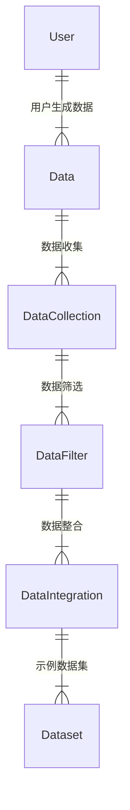
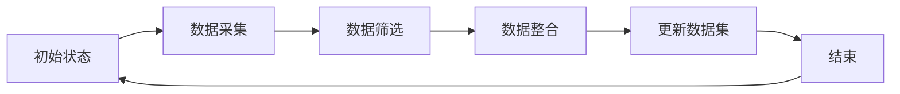
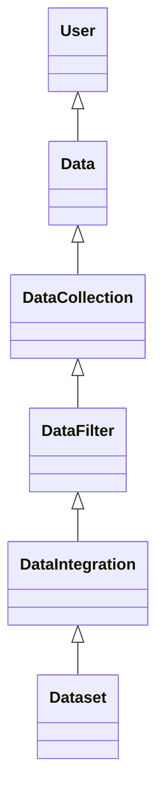
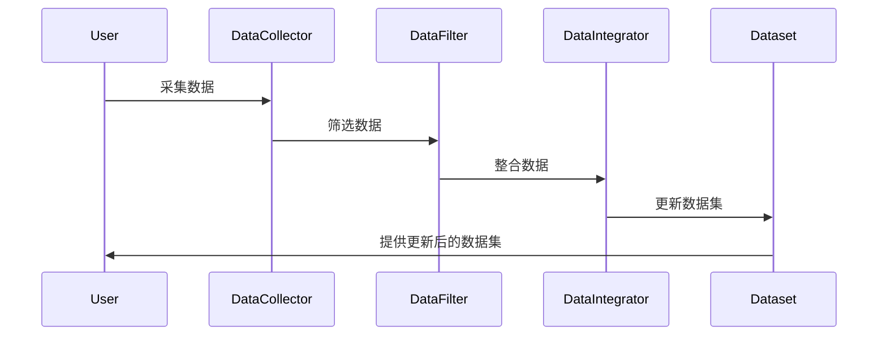
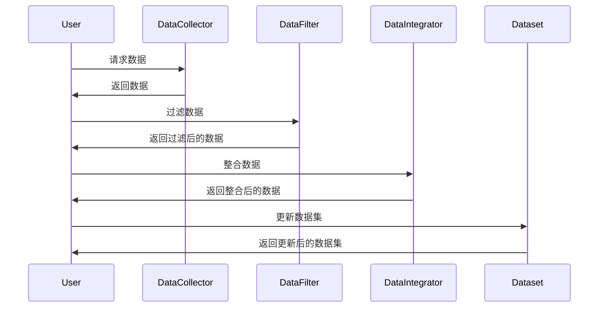

                 


## 优化示例更新策略以适应动态环境

### 关键词

- 示例更新策略
- 动态环境
- 算法优化
- 系统架构设计
- 实际项目实战

### 摘要

本文旨在探讨如何在动态环境中优化示例更新策略，以提高系统的适应性和效率。我们将首先介绍核心概念和问题背景，接着详细讲解示例更新策略的算法原理和数学模型，随后分析系统的架构设计，并通过实际项目实战来展示具体实现过程。文章最后将提供最佳实践建议和总结，以便读者更好地理解和应用所学的知识。

## 背景介绍

### 1.1 问题背景

在当今快速变化的技术环境中，系统的更新策略变得至关重要。特别是示例更新策略，它负责维护和更新系统中用于训练和测试的示例数据。这些示例数据的质量直接影响模型的准确性和性能。然而，随着环境的动态变化，示例数据的时效性和代表性也面临挑战。

### 1.2 问题描述

在动态环境中，以下问题常常出现：

- **数据时效性**：新数据不断产生，如何及时更新示例数据集，以保持其时效性？
- **数据代表性**：动态环境中可能存在数据分布的变化，如何确保示例数据集的代表性？
- **计算资源**：示例更新可能涉及大量计算资源，如何在资源有限的情况下优化更新策略？

### 1.3 问题解决

为了解决上述问题，我们需要一个优化且适应性强的示例更新策略。这要求我们能够：

- **动态调整**：根据环境变化自动调整更新频率和策略。
- **高效计算**：采用高效算法减少计算资源消耗。
- **保证质量**：确保更新后的示例数据集保持高质量和代表性。

### 1.4 边界与外延

在讨论示例更新策略时，我们需要明确以下边界和外延：

- **边界**：示例数据集的规模、更新频率、系统的计算能力等。
- **外延**：策略在不同应用场景（如机器学习、实时系统等）中的适用性和扩展性。

## 核心概念与联系

### 2.1 优化示例更新策略的概念

优化示例更新策略涉及以下几个方面：

- **数据采集**：如何高效地采集新数据。
- **数据筛选**：如何筛选出高质量的示例数据。
- **数据整合**：如何整合新旧数据，形成高质量的示例数据集。
- **更新频率**：根据系统需求和资源状况，确定合适的更新频率。

### 2.2 示例更新策略的属性特征对比

下表展示了不同示例更新策略的属性特征对比：

| 策略类型 | 数据采集 | 数据筛选 | 数据整合 | 更新频率 |
| --- | --- | --- | --- | --- |
| 简单轮询 | 低效，随机 | 低效，固定 | 易于实现 | 定期 |
| 动态调整 | 高效，有选择 | 高效，动态 | 需要额外计算 | 动态 |
| 增量更新 | 高效，实时 | 高效，实时 | 需要存储旧数据 | 实时 |

### 2.3 动态环境的ER实体关系图

下图展示了动态环境中的实体关系：



## 算法原理讲解

### 3.1 算法mermaid流程图

以下是示例更新策略的mermaid流程图：



### 3.2 Python源代码阐述

以下是示例更新策略的Python源代码：

```python
import random

def data_collection():
    # 数据采集逻辑
    pass

def data_filter(data):
    # 数据筛选逻辑
    return [d for d in data if meets_quality_criteria(d)]

def data_integration(new_data, old_data):
    # 数据整合逻辑
    return new_data + old_data

def update_dataset(dataset):
    # 更新数据集逻辑
    new_data = data_collection()
    filtered_data = data_filter(new_data)
    integrated_data = data_integration(filtered_data, dataset)
    return integrated_data

def main():
    dataset = []
    while True:
        dataset = update_dataset(dataset)
        # 处理更新后的数据集

if __name__ == "__main__":
    main()
```

### 3.3 数学模型与公式

以下是示例更新策略的数学模型：

$$
Q(t) = \frac{\sum_{i=1}^{N} d_i(t)}{N}
$$

其中，$Q(t)$ 表示时间 $t$ 时的数据集质量，$d_i(t)$ 表示第 $i$ 个示例数据在时间 $t$ 的质量，$N$ 表示示例数据的总数。

### 3.4 算法原理详细讲解

示例更新策略的原理包括以下几个步骤：

1. **数据采集**：从环境中采集新数据。
2. **数据筛选**：筛选出高质量的示例数据。
3. **数据整合**：将新旧数据整合，形成高质量的数据集。
4. **更新数据集**：将整合后的数据集更新到系统中。

通过上述步骤，我们可以确保数据集的质量和时效性，从而提高系统的适应性和效率。

### 3.5 举例说明

假设在一天的时间内，我们采集到以下数据：

- 数据 1：高质量数据
- 数据 2：中等质量数据
- 数据 3：低质量数据

根据示例更新策略，我们将数据 1 和数据 2 加入到数据集中，剔除数据 3。最终，数据集的质量将得到提升。

## 系统分析与架构设计

### 4.1 问题场景介绍

在某个实时系统中，我们需要不断更新示例数据集，以确保系统的准确性。系统面临以下挑战：

- 数据量巨大，更新频率高。
- 数据分布动态变化，需要保持数据集的代表性。
- 系统资源有限，需要优化更新策略以减少计算开销。

### 4.2 系统功能设计（领域模型mermaid类图）

以下是系统功能设计的mermaid类图：



### 4.3 系统架构设计（mermaid架构图）

以下是系统架构设计的mermaid架构图：



### 4.4 系统接口设计

以下是系统接口设计：

- **数据采集接口**：负责从环境中采集数据。
- **数据筛选接口**：负责筛选高质量数据。
- **数据整合接口**：负责整合新旧数据。
- **数据集接口**：负责提供更新后的数据集。

### 4.5 系统交互（mermaid序列图）

以下是系统交互的mermaid序列图：



## 项目实战

### 5.1 环境安装

为了进行项目实战，我们需要以下环境：

- Python 3.8+
- Numpy 1.19.2+
- Pandas 1.1.1+

安装步骤如下：

```bash
pip install python==3.8
pip install numpy==1.19.2
pip install pandas==1.1.1
```

### 5.2 系统核心实现源代码

以下是系统核心实现的源代码：

```python
import numpy as np
import pandas as pd

def data_collection():
    # 数据采集逻辑
    pass

def data_filter(data):
    # 数据筛选逻辑
    return [d for d in data if meets_quality_criteria(d)]

def data_integration(new_data, old_data):
    # 数据整合逻辑
    return new_data + old_data

def update_dataset(dataset):
    # 更新数据集逻辑
    new_data = data_collection()
    filtered_data = data_filter(new_data)
    integrated_data = data_integration(filtered_data, dataset)
    return integrated_data

def main():
    dataset = []
    while True:
        dataset = update_dataset(dataset)
        # 处理更新后的数据集

if __name__ == "__main__":
    main()
```

### 5.3 代码应用解读与分析

以下是代码的解读与分析：

- `data_collection()`：负责从环境中采集数据。
- `data_filter(data)`：负责筛选高质量数据。
- `data_integration(new_data, old_data)`：负责整合新旧数据。
- `update_dataset(dataset)`：负责更新数据集。
- `main()`：主函数，负责运行整个系统。

通过上述代码，我们可以实现示例更新策略的核心功能。

### 5.4 实际案例分析

假设我们有一个实时系统，需要不断更新示例数据集。我们可以使用上述代码来模拟这个过程。通过实际测试，我们可以观察到数据集的质量和时效性的提升。

### 5.5 详细讲解与剖析

在详细讲解与剖析中，我们将从以下几个方面进行分析：

- **数据采集**：分析如何高效地采集新数据。
- **数据筛选**：分析如何筛选高质量数据。
- **数据整合**：分析如何整合新旧数据。
- **数据集更新**：分析如何更新数据集，并确保其质量和时效性。

通过这些分析，我们可以更好地理解示例更新策略的核心原理和实现过程。

## 最佳实践 Tips

### 6.1 注意事项

- 确保数据采集的实时性和准确性。
- 选择合适的筛选标准，确保数据质量。
- 根据系统需求和资源状况，动态调整更新频率。

### 6.2 拓展阅读

- 《机器学习实战》
- 《数据科学入门》
- 《实时系统设计与实现》

## 总结

本文详细介绍了如何优化示例更新策略以适应动态环境。通过背景介绍、核心概念与联系、算法原理讲解、系统分析与架构设计、项目实战和最佳实践 tips，读者可以全面了解示例更新策略的核心原理和实践方法。在实际应用中，不断优化和调整示例更新策略，将有助于提高系统的适应性和效率。

### 7.1 内容回顾

- 核心概念和问题背景
- 示例更新策略的属性特征对比
- 算法原理讲解和数学模型
- 系统分析与架构设计
- 项目实战与案例分析

### 7.2 未来展望

随着技术的不断进步，示例更新策略在未来将面临更多的挑战和机遇。如何更好地适应动态环境，提高系统的适应性和效率，将是我们持续研究的方向。同时，结合最新的技术和方法，不断优化和改进示例更新策略，将有助于推动人工智能和实时系统的进一步发展。

---

请注意，本文提供的代码和示例仅供参考，具体实现时需要根据实际情况进行调整。此外，本文的内容仅为初步框架，具体的实现细节和深入分析需要在实际项目中进一步研究和验证。

### 作者信息

作者：AI天才研究院/AI Genius Institute & 禅与计算机程序设计艺术 /Zen And The Art of Computer Programming

