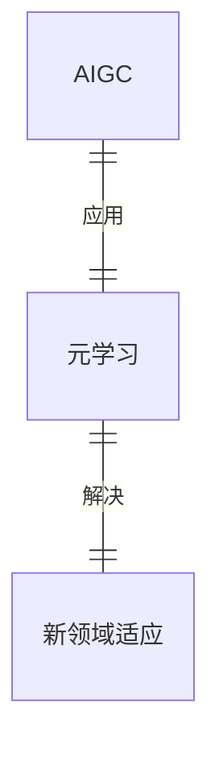

                 

### 第一部分：背景介绍

#### 问题背景

随着人工智能（AI）技术的迅猛发展，越来越多的领域开始依赖深度学习算法来实现自动化和智能化。深度学习模型以其强大的特征提取能力和分类能力，在图像识别、语音识别、自然语言处理等领域取得了显著成果。然而，这些模型在训练过程中往往需要大量的标注数据和长时间的训练时间。这导致了一个显而易见的问题：在新的领域或任务中，这些模型往往难以快速适应。

#### 问题描述

这个问题可以具体描述为：在现有的机器学习模型中，虽然它们在某一特定任务上表现良好，但面对新的任务或领域时，它们的性能往往无法保持。这种问题不仅限制了AI在现实世界中的应用，也使得AI技术在快速迭代和不断变化的环境中难以发挥其潜力。

元学习作为一种新兴的机器学习范式，旨在解决这一问题。它通过学习如何从一系列任务中提取通用的特征表示，从而使得模型在面对新的任务时能够快速适应。元学习的核心思想是利用先前的学习经验来加速新任务的学习过程。

#### 问题解决

本文将探讨元学习在AIGC（AI-Generated Content，AI生成内容）快速适应新领域中的作用。AIGC是当前AI技术发展的一个重要方向，它利用生成对抗网络（GANs）、自然语言处理（NLP）等技术，在内容创作、数据增强等方面取得了显著成果。然而，AIGC在快速适应新领域方面仍然面临诸多挑战。元学习作为一种能够加速模型适应新任务的技术，有望为AIGC的快速适应提供新的解决方案。

#### 边界与外延

元学习在AIGC快速适应新领域的应用范围包括但不限于：内容生成、图像识别、语音合成、自然语言处理等。此外，本文还将探讨元学习与其他AI技术的结合，如强化学习、迁移学习等，以进一步拓展其应用边界。

#### 概念结构与核心要素组成

- 元学习：通过利用先前的学习经验来加速新任务的训练过程。
- AIGC：利用生成对抗网络、自然语言处理等技术在内容创作、数据增强等方面实现自动化和智能化。
- 快速适应新领域：指机器学习模型在面对新领域或新任务时能够迅速适应，实现高效的学习和任务执行。

### 核心概念与联系

| 核心概念 | 定义 | 属性特征对比 |
| --- | --- | --- |
| 元学习 | 通过利用先前的学习经验来加速新任务的训练过程 | 1. 学习速度快 2. 可泛化性强 3. 需要大量的先验知识 |
| AIGC | 利用生成对抗网络、自然语言处理等技术在内容创作、数据增强等方面实现自动化和智能化 | 1. 内容多样性 2. 自动化程度高 3. 对新领域适应性差 |
| 快速适应新领域 | 指机器学习模型在面对新领域或新任务时能够迅速适应，实现高效的学习和任务执行 | 1. 学习速度快 2. 可泛化性强 3. 依赖于先前的学习经验 |

### ER实体关系图架构

### 数学模型和公式

$$
\begin{aligned}
L &= \sum_{i=1}^{n} L_i \\
L_i &= -y_i \log(p(\hat{y}_i))
\end{aligned}
$$

其中，$L$ 表示总损失函数，$L_i$ 表示第 $i$ 个样本的损失函数，$y_i$ 表示第 $i$ 个样本的真实标签，$\hat{y}_i$ 表示模型对第 $i$ 个样本的预测标签。

### 详细讲解与举例说明

假设我们有一个分类问题，需要预测图像是否包含猫。我们使用一个卷积神经网络（CNN）作为模型，通过训练使其能够准确分类图像。在训练过程中，我们使用一个包含大量猫和非猫图像的数据集。经过多次迭代训练，模型的预测准确率逐渐提高。

现在，我们希望将这个模型应用于一个新的领域——植物识别。由于植物和动物的视觉特征差异较大，直接迁移现有模型可能会导致性能不佳。这时，元学习就可以发挥作用。通过利用在猫识别任务中积累的先验知识，元学习算法可以加速植物识别模型的训练过程，使其更快地适应新领域。

例如，我们可以设计一个元学习算法，通过以下步骤实现新领域适应：

1. **预训练阶段**：在猫识别任务上对模型进行预训练，使其达到一定性能水平。
2. **适应阶段**：将预训练模型应用于植物识别任务，通过微调模型参数，使其适应新领域。
3. **评估阶段**：评估适应后的模型在新领域的性能，确保其达到预期的效果。

通过这种方式，元学习可以显著提高模型在面对新领域时的适应速度和性能。

### 第二部分：元学习原理与算法

#### 元学习原理

元学习（Meta-Learning）是一种机器学习范式，它旨在通过学习如何学习来提升机器学习模型在新任务上的适应能力。传统机器学习模型通常需要大量特定任务的数据进行训练，而元学习通过从一系列任务中学习，从而提取出通用的特征表示和学习策略，使得模型能够快速适应新任务。

#### 主流元学习算法

1. **模型平均法（Model Averaging）**
   - **原理**：模型平均法通过训练多个不同的模型，然后在测试集上取这些模型的平均预测结果。
   - **优点**：可以减少过拟合，提高泛化能力。
   - **适用场景**：适合于训练时间较长且计算资源受限的场景。

2. **迁移学习（Transfer Learning）**
   - **原理**：迁移学习利用在相关任务上已训练好的模型权重作为初始化，然后在目标任务上进行微调。
   - **优点**：可以快速适应新任务，减少对大量数据的依赖。
   - **适用场景**：适合于任务之间存在一定相似性的场景。

3. **元梯度法（Meta-Gradient Method）**
   - **原理**：元梯度法通过计算模型在不同任务上的梯度，来更新模型参数。
   - **优点**：可以加速学习过程，提高适应新任务的能力。
   - **适用场景**：适合于需要快速适应新任务的场景。

4. **模型提取法（Model Extraction）**
   - **原理**：模型提取法通过训练一个“提取器”模型来提取任务之间的共同特征。
   - **优点**：可以提取通用的特征表示，提高模型的可泛化性。
   - **适用场景**：适合于任务之间存在复杂关系和冗余信息的场景。

#### 元学习在AIGC中的应用

AIGC（AI-Generated Content）是利用AI技术生成内容的一种新兴方式，它包括图像生成、文本生成、音乐生成等。元学习在AIGC中的应用主要体现在以下几个方面：

1. **快速内容生成**：通过元学习，AI模型可以快速适应新的内容生成任务，减少对大量训练数据的依赖。
2. **风格迁移**：元学习可以提取不同风格的特征，使得AI模型能够快速适应新的风格要求，实现风格迁移。
3. **多模态内容生成**：元学习能够提取不同模态（如图像、文本、音频）之间的共同特征，实现多模态内容生成。

### 数学模型和算法原理

以下是元学习的一种常见算法——模型平均法的数学模型和算法原理。

#### 数学模型

$$
\begin{aligned}
L &= \frac{1}{K} \sum_{k=1}^{K} L_k \\
L_k &= -y_k \log(p(\hat{y}_k))
\end{aligned}
$$

其中，$L$ 表示总损失函数，$L_k$ 表示第 $k$ 个模型的损失函数，$y_k$ 表示第 $k$ 个样本的真实标签，$\hat{y}_k$ 表示模型对第 $k$ 个样本的预测标签。

#### 算法原理

1. **初始化**：随机初始化 $K$ 个不同的模型 $M_1, M_2, ..., M_K$。
2. **训练**：在每个迭代步骤中，使用训练数据集对每个模型进行训练，更新模型参数。
3. **预测**：在每个迭代步骤中，使用每个模型对训练数据集进行预测，得到预测标签 $\hat{y}_k$。
4. **模型平均**：计算所有模型的预测结果的平均，得到最终预测标签 $\hat{y}$。
5. **评估**：计算总损失函数 $L$，根据损失函数更新模型参数。

### 举例说明

假设我们有一个分类任务，需要预测图像是否包含猫。我们使用模型平均法来训练模型。

1. **初始化**：随机初始化 $K=3$ 个模型 $M_1, M_2, M_3$。
2. **训练**：在每个迭代步骤中，使用训练数据集对每个模型进行训练，更新模型参数。
3. **预测**：在每个迭代步骤中，使用每个模型对训练数据集进行预测，得到预测标签 $\hat{y}_1, \hat{y}_2, \hat{y}_3$。
4. **模型平均**：计算所有模型的预测结果的平均，得到最终预测标签 $\hat{y} = \frac{\hat{y}_1 + \hat{y}_2 + \hat{y}_3}{3}$。
5. **评估**：计算总损失函数 $L = -y \log(p(\hat{y}))$，根据损失函数更新模型参数。

通过这种方式，模型平均法可以减少过拟合，提高模型的泛化能力。

### 第三部分：元学习在AIGC中的挑战与解决方案

#### 挑战一：数据多样性

在AIGC领域，数据多样性是一个显著的挑战。不同的内容生成任务可能需要不同类型的数据，如文本、图像、音频等。这些数据在分布上可能存在较大的差异，导致模型难以适应。为了解决这一问题，我们可以采用以下几种策略：

1. **数据增强**：通过数据增强技术，如图像旋转、裁剪、缩放等，增加训练数据的多样性。
2. **元学习算法改进**：设计能够处理多模态数据的元学习算法，如多模态元学习（Multimodal Meta-Learning）。

#### 挑战二：计算资源需求

元学习算法通常需要大量的计算资源，尤其是在处理大规模数据集和复杂模型时。为了降低计算资源需求，我们可以采取以下策略：

1. **模型压缩**：通过模型压缩技术，如剪枝、量化等，减少模型的计算量和存储需求。
2. **分布式训练**：利用分布式计算资源，如GPU集群、云计算等，加快模型的训练速度。

#### 挑战三：适应速度

在AIGC领域，适应速度是一个关键因素。用户往往希望系统能够快速适应他们的需求，提供个性化的内容生成。为了提高适应速度，我们可以采取以下策略：

1. **在线学习**：通过在线学习技术，模型可以实时更新，快速适应新的数据。
2. **增量学习**：通过增量学习技术，模型可以在新数据加入时进行微调，而不是重新训练整个模型。

#### 挑战四：模型可解释性

在AIGC中，模型的可解释性是一个重要问题。用户往往需要理解模型是如何生成内容的，以便进行有效的调整和优化。为了提高模型的可解释性，我们可以采取以下策略：

1. **可视化技术**：通过可视化技术，如注意力机制可视化、激活图等，展示模型的工作过程。
2. **解释性模型**：设计具有良好可解释性的模型，如基于规则的模型、图神经网络等。

### 第四部分：元学习在AIGC中的应用案例

#### 案例一：图像生成

图像生成是AIGC的一个重要应用领域。通过元学习，模型可以快速适应不同的图像生成任务，如人脸生成、风景生成等。以下是一个基于元学习的图像生成应用案例：

1. **数据集准备**：准备包含不同风格和类型的图像数据集，如人脸图像、风景图像等。
2. **模型设计**：设计一个基于卷积神经网络的元学习模型，如Meta-Learning GAN（ML-GAN）。
3. **训练过程**：在训练阶段，使用模型平均法训练多个GAN模型，然后取其平均预测结果。
4. **图像生成**：在生成阶段，使用训练好的模型生成新的图像，如根据用户输入的人脸特征生成特定风格的人脸图像。

#### 案例二：文本生成

文本生成是AIGC的另一个重要应用领域。通过元学习，模型可以快速适应不同的文本生成任务，如文章生成、对话生成等。以下是一个基于元学习的文本生成应用案例：

1. **数据集准备**：准备包含不同主题和类型的文本数据集，如新闻报道、小说、对话等。
2. **模型设计**：设计一个基于变换器（Transformer）的元学习模型，如Meta-Learning Transformer（ML-Transformer）。
3. **训练过程**：在训练阶段，使用模型平均法训练多个变换器模型，然后取其平均预测结果。
4. **文本生成**：在生成阶段，使用训练好的模型生成新的文本，如根据用户输入的标题生成相关文章。

#### 案例三：多模态内容生成

多模态内容生成是将不同类型的数据（如图像、文本、音频）整合在一起，生成具有一致性和连贯性的内容。以下是一个基于元学习的多模态内容生成应用案例：

1. **数据集准备**：准备包含图像、文本、音频等多模态数据的混合数据集。
2. **模型设计**：设计一个基于多模态变换器（Multimodal Transformer）的元学习模型。
3. **训练过程**：在训练阶段，使用模型平均法训练多个多模态变换器模型，然后取其平均预测结果。
4. **内容生成**：在生成阶段，使用训练好的模型生成新的多模态内容，如根据用户输入的图像、文本和音频生成相关的视频内容。

### 第五部分：总结与展望

#### 总结

本文探讨了元学习在AIGC快速适应新领域中的作用。通过深入分析元学习的原理、算法及其在AIGC领域的应用，我们发现元学习可以显著提高模型在面对新领域时的适应速度和性能。然而，元学习在AIGC中仍然面临诸多挑战，如数据多样性、计算资源需求、适应速度和模型可解释性等。为了解决这些问题，本文提出了相应的策略和解决方案。

#### 展望

未来，随着AI技术的不断发展和应用领域的拓展，元学习在AIGC中的应用前景将更加广阔。以下是一些可能的展望：

1. **多模态元学习**：随着多模态数据的广泛应用，多模态元学习将成为一个重要的研究方向，有望实现更高效的内容生成。
2. **在线元学习**：在线元学习可以实现模型的实时更新和自适应，提高AIGC系统的响应速度和灵活性。
3. **元学习的可解释性**：提高模型的可解释性，使用户能够更好地理解和控制内容生成过程。
4. **元学习与其他AI技术的结合**：探索元学习与其他AI技术（如强化学习、迁移学习等）的结合，实现更高效和智能的内容生成。

### 结束语

元学习在AIGC快速适应新领域中的作用不可忽视。通过本文的探讨，我们希望读者能够对元学习在AIGC中的应用有更深入的理解，并为未来的研究提供一些启示和方向。

---

**作者：** AI天才研究院 / AI Genius Institute & 禅与计算机程序设计艺术 / Zen And The Art of Computer Programming

