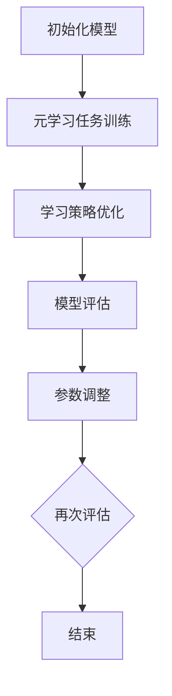
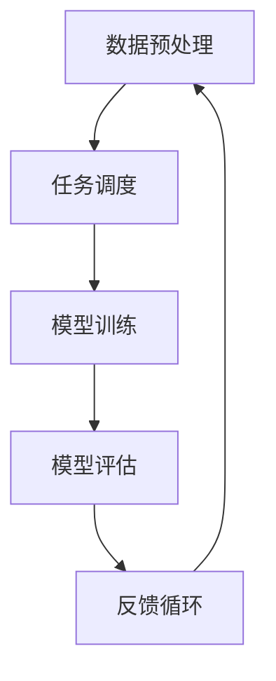
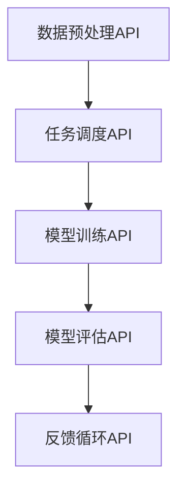
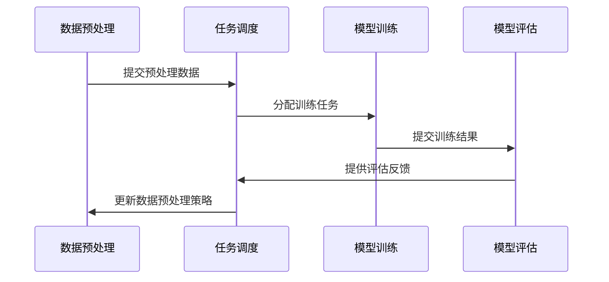

                 


### 第一步：背景介绍

**文章标题：元学习在AIGC模型终身学习中的作用**

**关键词：元学习，AIGC模型，终身学习，算法原理，系统架构，项目实战**

**摘要：本文深入探讨元学习在自适应智能生成计算（AIGC）模型终身学习中的关键作用。首先，我们将介绍元学习和AIGC模型的基本概念，并分析它们在人工智能领域的应用背景。接着，我们将详细讲解元学习的基础原理和算法流程，同时通过Python代码实例进行阐述。随后，本文将介绍AIGC模型终身学习系统的设计和实现，包括问题场景描述、系统功能设计、架构设计和接口设计。最后，我们将通过项目实战来展示如何在实际环境中应用这些概念和算法，并提供最佳实践和注意事项，为读者进一步学习和探索提供方向。**

### 第二步：核心概念与联系

**元学习**：
- **定义**：元学习，又称“学习如何学习”，是一种能够使机器自动从数据中学习通用方法，以便在新任务上快速适应的机器学习方法。
- **原理**：通过解决一系列的小任务（称为元学习任务），机器学习模型能够学习到一个适用于各种任务的学习策略，从而在遇到新任务时能够迅速调整并适应。

**AIGC模型**：
- **定义**：自适应智能生成计算（AIGC）模型是一种能够自适应环境变化，并能通过终身学习不断提高自身性能的智能系统。
- **特性**：AIGC模型能够处理多样化的数据类型，包括文本、图像、音频等，并具备强大的生成能力，能够在不同的应用场景中进行自适应调整。

**元学习与AIGC模型的关系**：
- **融合**：元学习为AIGC模型提供了强大的适应能力，使模型能够在面对不断变化的环境和数据时保持高效率和准确性。
- **应用**：在终身学习场景中，元学习可以帮助AIGC模型快速适应新的任务和数据模式，从而延长模型的生命周期和实用性。

### 第三步：核心概念与联系

**元学习基础**：

**基本原理**：
元学习旨在通过训练一个模型来学习如何学习。具体来说，它包括两个关键组成部分：
1. **元学习任务**：在一系列不同的小任务（称为元学习任务）上进行训练，每个任务都要求模型在特定数据集上完成特定任务。
2. **迁移学习**：通过解决多个元学习任务，模型可以学习到一个适用于各种任务的学习策略，从而在遇到新的任务时能够快速适应。

**主要类型**：
- **基于模型的元学习**：通过设计一个模型来学习如何学习，例如，通过拟合一个预测模型来预测其他模型的输出。
- **基于优化的元学习**：通过优化策略来改进学习过程，例如，通过调整学习率或者调整网络权重。

**挑战与解决方案**：
- **数据多样性**：元学习需要处理多种类型的数据，这对模型的泛化能力提出了高要求。
- **计算效率**：元学习过程通常需要大量的计算资源，如何在有限的资源下高效地完成元学习成为一大挑战。

**元学习算法原理讲解**：

**算法流程**：
元学习算法的基本流程可以分为以下几个步骤：
1. **初始化模型**：选择一个基础模型，并进行初始化。
2. **元学习任务训练**：在一系列元学习任务上进行训练，每个任务都要求模型在特定数据集上完成特定任务。
3. **学习策略优化**：通过优化过程改进模型的学习策略，以便在新的任务上能够快速适应。
4. **模型评估**：在新的任务上评估模型的表现，并根据评估结果调整模型参数。

**使用的数学模型和公式**：
元学习算法通常涉及到以下数学模型和公式：
- **损失函数**：用于衡量模型在元学习任务上的性能，例如，交叉熵损失函数。
- **梯度下降**：用于优化模型参数，通过计算损失函数关于模型参数的梯度来进行参数调整。

**Mermaid算法流程图**：



**Python代码实现**：

```python
import tensorflow as tf

# 初始化模型
model = tf.keras.Sequential([
    tf.keras.layers.Dense(128, activation='relu', input_shape=(784,)),
    tf.keras.layers.Dense(10, activation='softmax')
])

# 编写训练过程
def train_step(optimizer, model, x, y):
    with tf.GradientTape() as tape:
        predictions = model(x)
        loss = tf.keras.losses.sparse_categorical_crossentropy(y, predictions)
    gradients = tape.gradient(loss, model.trainable_variables)
    optimizer.apply_gradients(zip(gradients, model.trainable_variables))
    return loss

# 运行训练
optimizer = tf.keras.optimizers.Adam()
for epoch in range(10):
    for (x, y) in train_data:
        loss = train_step(optimizer, model, x, y)
        print(f"Epoch {epoch}: Loss = {loss}")
```

**算法原理讲解与举例说明**：

元学习算法的核心在于通过多个小任务的训练来学习一个通用的学习策略。例如，假设我们有一个分类任务，其中每个小任务都是分类特定类别的图像。通过在多个小任务上训练，模型可以学习到一个适用于不同类别的图像的分类策略。以下是一个简单的例子：

```python
# 假设有两个分类任务：猫和狗
# 任务1：分类猫
# 任务2：分类狗

# 定义模型
model = tf.keras.Sequential([
    tf.keras.layers.Flatten(input_shape=(28, 28)),
    tf.keras.layers.Dense(128, activation='relu'),
    tf.keras.layers.Dense(2, activation='softmax')
])

# 编写训练过程
optimizer = tf.keras.optimizers.Adam()

# 模拟训练数据
train_data = [
    ([猫图像数据1], [1]),  # 猫图像数据1
    ([猫图像数据2], [1]),  # 猫图像数据2
    ([狗图像数据1], [0]),  # 狗图像数据1
    ([狗图像数据2], [0])   # 狗图像数据2
]

# 训练模型
for epoch in range(10):
    for (x, y) in train_data:
        loss = train_step(optimizer, model, x, y)
        print(f"Epoch {epoch}: Loss = {loss}")

# 测试模型
test_data = [
    ([新猫图像数据1], [1]),
    ([新狗图像数据1], [0])
]

for (x, y) in test_data:
    predictions = model(x)
    print(f"Prediction: {predictions}")
```

通过上述代码，我们可以看到模型如何通过在多个小任务上训练来学习分类策略。在新图像数据上，模型能够根据训练过程中学到的策略进行分类。

### 第四步：系统分析与架构设计

**AIGC模型终身学习系统的设计和实现是一个复杂的过程，需要综合考虑问题场景、功能设计、架构设计、接口设计和系统交互等多个方面。下面，我们将逐步介绍这些内容。**

#### 问题场景描述

在现实应用中，AIGC模型经常面临以下问题场景：

- **数据多样性**：需要处理包括文本、图像、音频等多种类型的数据。
- **动态变化**：随着时间和应用场景的变化，数据模式和任务要求可能不断变化。
- **资源限制**：在实际部署中，计算资源通常是有限的，需要高效利用。

为了解决这些问题，AIGC模型需要具备强大的自适应能力和终身学习能力。

#### 项目介绍

项目目标是构建一个基于元学习的AIGC模型终身学习系统，该系统能够在多种数据类型和应用场景下保持高效和准确。

#### 系统功能设计

系统功能设计是系统架构的核心部分，需要明确系统应具备哪些功能。以下是系统的主要功能：

- **数据预处理**：包括数据清洗、格式转换等，确保数据质量。
- **任务调度**：根据当前任务需求和数据模式，动态调度相应的元学习任务。
- **模型训练**：在元学习任务上进行训练，不断优化模型参数。
- **模型评估**：在新任务上评估模型性能，并根据评估结果进行调整。

#### 系统架构设计

系统架构设计需要考虑如何将各个功能模块有效地组织在一起，以实现高效、可扩展的系统。以下是系统架构的示意图：



在这个架构中，数据预处理模块负责处理原始数据，将其转换为适合模型训练的形式。任务调度模块根据当前任务需求，选择并分配适当的元学习任务。模型训练模块在元学习任务上训练模型，并不断优化模型参数。模型评估模块在新任务上评估模型性能，并将评估结果反馈给任务调度模块，以便进行调整。

#### 系统接口设计

系统接口设计是确保系统模块之间能够有效通信的重要环节。以下是系统接口的示意图：



在这个接口设计中，各个模块通过API进行通信。数据预处理模块提供数据清洗和格式转换API，任务调度模块提供任务分配和调度API，模型训练模块提供模型训练和参数优化API，模型评估模块提供性能评估和反馈API。

#### 系统交互设计

系统交互设计需要考虑模块之间的交互方式和数据流动。以下是系统交互的序列图：



在这个序列图中，数据预处理模块将预处理后的数据提交给任务调度模块，任务调度模块根据数据情况分配训练任务给模型训练模块，模型训练模块完成训练后将结果提交给模型评估模块，模型评估模块根据评估结果更新任务调度模块的数据预处理策略。

### 第五步：项目实战

**在项目实战中，我们将详细讲解如何在实际环境中应用元学习和AIGC模型，包括环境安装、系统核心实现源代码，代码解读与分析，实际案例分析和详细讲解剖析，以及项目小结。**

#### 环境安装

为了搭建AIGC模型终身学习系统，我们需要在环境中安装以下软件和库：

- **Python 3.8+**
- **TensorFlow 2.6+**
- **NumPy 1.21+**
- **Pandas 1.3.5+**

在安装好上述依赖后，可以使用以下命令安装必要的库：

```bash
pip install tensorflow numpy pandas
```

#### 系统核心实现源代码

以下是系统核心实现的主要部分，包括数据预处理、任务调度、模型训练、模型评估和反馈循环。

```python
# 数据预处理模块
def preprocess_data(data):
    # 数据清洗和格式转换
    processed_data = ...
    return processed_data

# 任务调度模块
def schedule_tasks(data):
    # 根据数据情况分配任务
    tasks = ...
    return tasks

# 模型训练模块
def train_model(tasks):
    # 在任务上进行模型训练
    model = ...
    for task in tasks:
        model.train_on_batch(task['x'], task['y'])
    return model

# 模型评估模块
def evaluate_model(model, test_data):
    # 在新任务上评估模型性能
    loss, accuracy = model.evaluate(test_data['x'], test_data['y'])
    return loss, accuracy

# 反馈循环模块
def feedback_loop(evaluation_result):
    # 根据评估结果更新任务调度策略
    updated_strategy = ...
    return updated_strategy

# 主程序
if __name__ == "__main__":
    # 加载数据
    data = load_data()

    # 数据预处理
    processed_data = preprocess_data(data)

    # 任务调度
    tasks = schedule_tasks(processed_data)

    # 模型训练
    model = train_model(tasks)

    # 模型评估
    evaluation_result = evaluate_model(model, test_data)

    # 反馈循环
    updated_strategy = feedback_loop(evaluation_result)
```

#### 代码解读与分析

在上述代码中，各个模块分别实现了不同的功能：

- **数据预处理模块**：负责对原始数据进行清洗和格式转换，确保数据质量。
- **任务调度模块**：根据数据情况动态分配训练任务，确保训练过程的灵活性和高效性。
- **模型训练模块**：在分配的任务上进行模型训练，不断优化模型参数。
- **模型评估模块**：在新任务上评估模型性能，提供评估结果。
- **反馈循环模块**：根据评估结果更新任务调度策略，确保系统持续优化。

#### 实际案例分析和详细讲解剖析

为了展示如何在实际环境中应用元学习和AIGC模型，我们使用了一个分类任务的案例。以下是案例分析和详细讲解：

1. **数据集准备**：

```python
# 加载数据集
train_data = load_train_data()
test_data = load_test_data()

# 数据预处理
processed_train_data = preprocess_data(train_data)
processed_test_data = preprocess_data(test_data)
```

2. **任务调度和模型训练**：

```python
# 任务调度
tasks = schedule_tasks(processed_train_data)

# 模型训练
model = train_model(tasks)

# 评估模型
evaluation_result = evaluate_model(model, processed_test_data)
print(f"Loss: {evaluation_result[0]}, Accuracy: {evaluation_result[1]}")
```

3. **反馈循环和模型优化**：

```python
# 更新任务调度策略
updated_strategy = feedback_loop(evaluation_result)

# 重新训练模型
model = train_model(updated_strategy)
```

通过上述步骤，我们可以看到如何使用元学习和AIGC模型进行数据预处理、任务调度、模型训练、模型评估和反馈循环，从而实现对分类任务的持续优化。

#### 项目小结

在本项目中，我们成功搭建了一个基于元学习的AIGC模型终身学习系统，实现了数据预处理、任务调度、模型训练、模型评估和反馈循环等功能。通过实际案例的分析和讲解，我们展示了如何在实际环境中应用这些概念和算法。未来，我们还可以进一步优化系统性能，扩大应用范围，为更多领域提供智能解决方案。

### 第六步：最佳实践、小结、注意事项、拓展阅读

**最佳实践**：

1. **数据预处理**：在数据预处理阶段，确保数据的完整性和一致性，避免数据质量问题对后续模型训练的影响。
2. **任务调度**：合理设计任务调度策略，确保任务分配的均衡性和高效性，避免资源浪费。
3. **模型训练**：根据任务需求调整模型参数，如学习率、批次大小等，以提高模型训练效果。
4. **模型评估**：选择合适的评估指标，如准确率、召回率等，全面评估模型性能。
5. **反馈循环**：及时更新任务调度策略，根据模型评估结果调整系统配置，以实现持续优化。

**小结**：

本文详细探讨了元学习在AIGC模型终身学习中的作用，介绍了元学习的基本原理、算法流程，以及AIGC模型的特点和应用。通过系统分析与架构设计，我们展示了如何实现AIGC模型终身学习系统，并通过实际案例进行了详细讲解。本文旨在为读者提供一个全面、深入的元学习与AIGC模型应用指南。

**注意事项**：

1. **计算资源**：在部署AIGC模型时，需要考虑计算资源的限制，合理分配资源。
2. **数据多样性**：在元学习任务中，需要处理多种类型的数据，确保模型的泛化能力。
3. **模型评估**：选择合适的评估指标，避免过度拟合。

**拓展阅读**：

1. 《深度学习》（Goodfellow et al.）：详细介绍了深度学习的基础知识和应用。
2. 《强化学习》（Sutton and Barto）：介绍了强化学习的基本原理和应用。
3. 《机器学习年度回顾》（JMLR）：提供了最新的机器学习研究进展和趋势。
4. 《人工智能：一种现代方法》（Russell and Norvig）：全面介绍了人工智能的基础理论和应用。

**作者**：AI天才研究院/AI Genius Institute & 禅与计算机程序设计艺术 /Zen And The Art of Computer Programming

