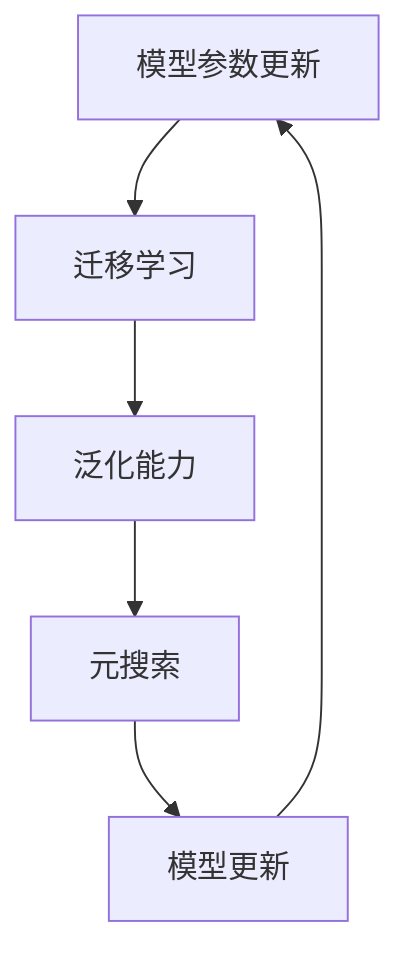
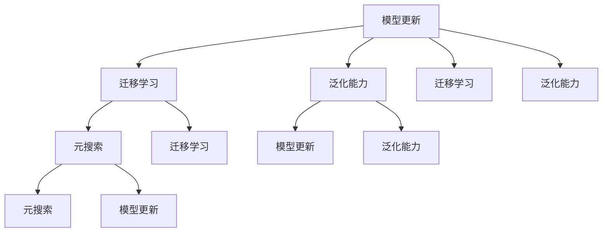
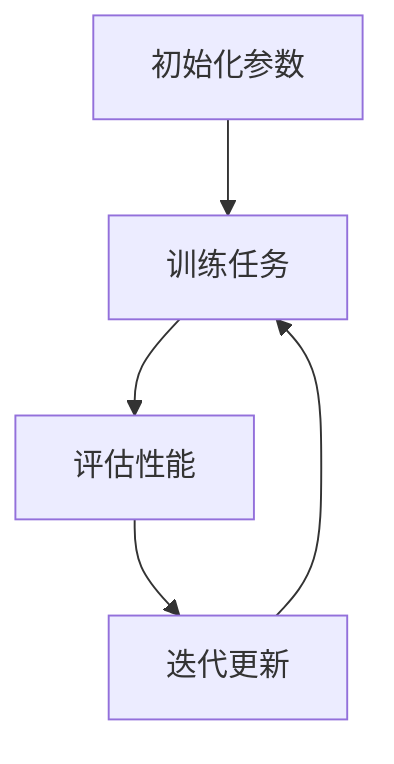
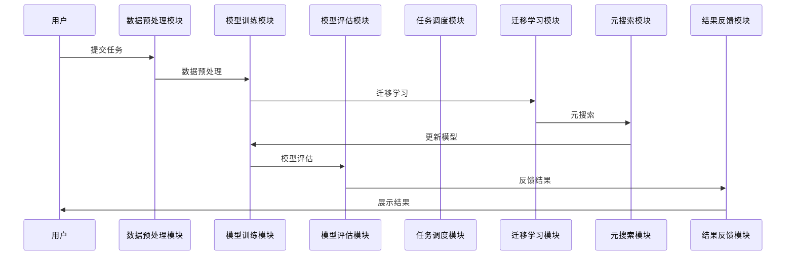
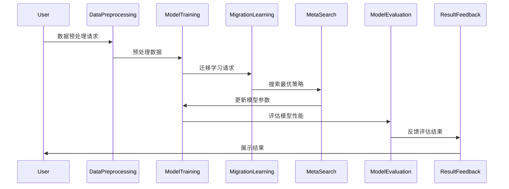
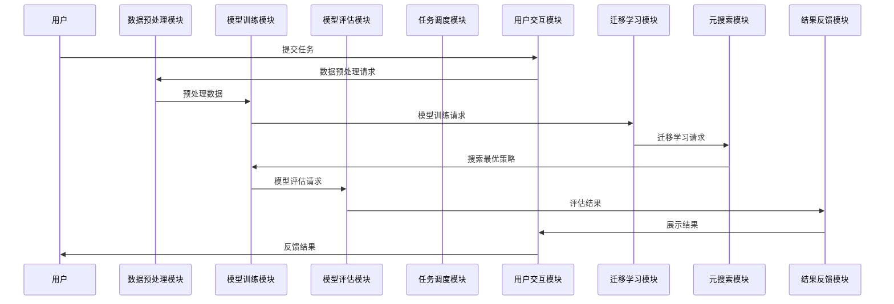
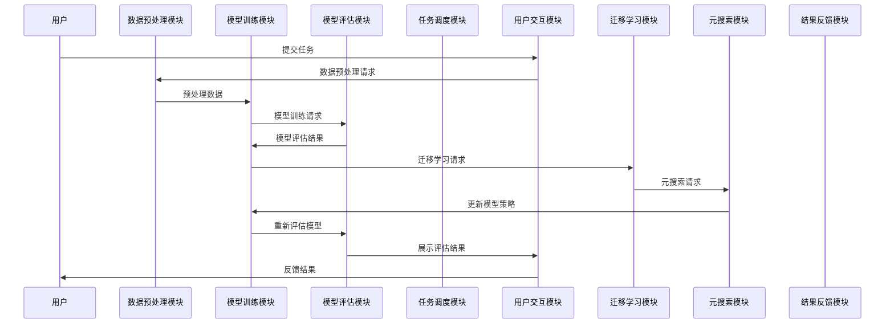

                 

### 元学习在快速适应新AIGC任务中的作用

在当今快速发展的信息技术时代，人工智能（AI）技术已经成为推动各个领域创新和发展的核心力量。随着深度学习、强化学习等技术的广泛应用，AI已经展现出强大的数据处理和分析能力。然而，AI系统在面对复杂、多样化的任务时，往往需要大量的数据和较长的训练时间才能达到较好的性能。为了解决这一挑战，元学习（Meta-Learning）应运而生，它通过学习如何快速适应新任务，实现了AI系统的自我提升和优化。

**关键词：** 元学习、快速适应、AIGC、自动化编程、代码补全、图像生成

**摘要：** 本文将深入探讨元学习在快速适应新AIGC任务中的作用。首先，我们将介绍元学习的背景和核心概念，解释其在快速适应新任务中的重要性。接着，我们将详细解析元学习的基本原理和常见算法，并结合实际案例展示其在AIGC任务中的应用。最后，我们将探讨元学习在快速适应新AIGC任务的实现方法，并提供项目实战的详细解析和最佳实践建议。

### 目录大纲

```markdown
----------------------------------------------------------------
# 元学习在快速适应新AIGC任务中的作用

## 引言
### 1.1 AIGC任务的特点与挑战
### 1.2 元学习概述

## 第一部分：背景介绍与核心概念
### 第1章：问题背景与元学习概述
#### 1.1.1 问题背景
#### 1.1.2 元学习的概念与定义
#### 1.1.3 元学习的核心概念与联系

### 第2章：元学习的基本原理与算法
#### 2.1 元学习的基本原理
#### 2.2 元学习算法的详细讲解与举例说明

### 第3章：元学习在AIGC任务中的应用
#### 3.1 AIGC任务中的元学习应用场景
#### 3.2 元学习在AIGC任务中的案例分析

## 第二部分：元学习在快速适应新AIGC任务的实现
### 第4章：元学习在快速适应新AIGC任务的实现方法
#### 4.1 系统架构设计
#### 4.2 系统接口设计与交互

### 第5章：项目实战
#### 5.1 环境安装
#### 5.2 系统核心实现源代码
#### 5.3 代码应用解读与分析
#### 5.4 案例分析与详细讲解剖析
#### 5.5 项目小结

## 第6章：最佳实践、小结与拓展阅读
#### 6.1 最佳实践
#### 6.2 小结
#### 6.3 拓展阅读

## 参考文献

----------------------------------------------------------------
```

以上目录大纲为文章的整体结构提供了详细的框架，确保读者能够清晰地跟随文章的逻辑思路，从背景介绍到实际应用，再到系统实现和最佳实践，逐步深入了解元学习在快速适应新AIGC任务中的作用。

### 引言

在当今快速发展的信息技术时代，人工智能（AI）技术已经成为推动各个领域创新和发展的核心力量。从自动驾驶到自然语言处理，从医疗诊断到金融分析，AI技术的应用已经深入到了社会生活的方方面面。然而，随着AI技术的不断进步，也带来了一系列新的挑战。特别是对于复杂、多样化的任务，传统AI系统往往需要大量的数据和较长的训练时间才能达到较好的性能。这就要求AI系统具备快速适应新任务的能力，以便在多变的环境中保持高效和灵活性。

**AIGC任务的特点与挑战**

AIGC（AI-Generated Content）是指利用人工智能技术自动生成文本、图像、音频等多种形式的内容。AIGC任务具有以下特点：

1. **多样性：** AIGC需要处理多种类型的数据，如文本、图像、音频等，每种类型的数据都有其独特的处理方式和需求。
2. **动态性：** AIGC任务往往需要实时生成内容，对系统的响应速度要求较高。
3. **不确定性：** 由于任务环境和用户需求的不确定性，AIGC系统需要具备较强的适应能力。

这些特点使得AIGC任务对传统AI系统提出了更高的要求。传统AI系统在面对多样化、动态性和不确定性的任务时，往往需要大量的数据和较长的训练时间才能达到较好的性能。这不仅增加了开发成本，也限制了AI系统在实际应用中的推广。

**元学习概述**

为了解决上述挑战，元学习（Meta-Learning）作为一种新兴的AI技术，逐渐受到了广泛关注。元学习通过学习如何快速适应新任务，实现了AI系统的自我提升和优化。具体来说，元学习具有以下特点：

1. **快速适应：** 元学习可以在较少的训练数据下，快速适应新任务，减少了训练时间和数据需求。
2. **迁移学习：** 元学习能够利用已有的知识，快速迁移到新任务中，提高了系统的适应能力。
3. **泛化能力：** 元学习通过学习如何学习，提高了系统的泛化能力，使其能够在不同任务中表现优异。

元学习在快速适应新任务中的作用主要体现在以下几个方面：

1. **减少训练成本：** 通过快速适应新任务，元学习可以减少训练时间和数据需求，降低了开发成本。
2. **提高系统效率：** 元学习使得AI系统在面对多样化任务时，能够快速响应和适应，提高了系统的效率。
3. **增强泛化能力：** 元学习通过学习如何学习，提高了系统的泛化能力，使其在不同任务中都能表现出色。

总之，元学习作为一种新兴的AI技术，在快速适应新任务中具有巨大的潜力，为AI技术的发展带来了新的机遇。接下来，我们将深入探讨元学习的背景和核心概念，为后续内容的讲解奠定基础。

### 第一部分：背景介绍与核心概念

#### 第1章：问题背景与元学习概述

**1.1 问题背景**

随着人工智能（AI）技术的不断进步，AI系统在各个领域的应用越来越广泛。然而，在实际应用中，传统AI系统往往面临以下挑战：

1. **大量数据需求：** 传统AI系统通常需要大量标注数据来训练模型，这导致了高昂的数据获取和处理成本。
2. **长时间训练：** 即使获得了足够的数据，AI系统的训练过程也往往耗时较长，影响了系统的实时响应能力。
3. **任务适应能力差：** 传统AI系统在面对新的任务时，通常需要重新训练或调整模型，适应新任务的需求，这增加了系统的复杂性和开发成本。

这些挑战使得AI系统在应对多样化、动态性和不确定性的任务时，显得力不从心。为了解决这些问题，研究人员提出了元学习（Meta-Learning）这一概念。

**1.2 元学习的概念与定义**

元学习，又称为“学习如何学习”，是指通过学习如何快速适应新任务的一种机器学习技术。具体来说，元学习旨在提高AI系统在以下方面的性能：

1. **快速适应新任务：** 元学习可以在较少的训练数据下，快速适应新任务，减少训练时间和数据需求。
2. **迁移学习：** 元学习能够利用已有的知识，快速迁移到新任务中，提高了系统的适应能力。
3. **泛化能力：** 元学习通过学习如何学习，提高了系统的泛化能力，使其在不同任务中都能表现出色。

在机器学习的背景下，元学习可以理解为一种能够自动调整学习算法的优化过程，使其在不同任务上都能达到较好的性能。元学习通过以下几种方式实现这一目标：

1. **模型更新：** 元学习通过不断更新模型参数，使其能够在新的任务上达到更好的效果。
2. **元搜索：** 元学习通过搜索最优的学习策略，找到适应新任务的快速解决方案。
3. **元特征提取：** 元学习通过提取任务的特征信息，建立通用特征表示，提高系统的泛化能力。

**1.3 元学习的核心概念与联系**

为了更深入地理解元学习，我们介绍以下几个核心概念，并探讨它们之间的联系：

1. **模型参数更新：** 在元学习中，模型参数的更新是一个关键过程。通过不断调整模型参数，元学习系统能够在新任务上获得更好的性能。模型参数的更新可以通过梯度下降、随机梯度下降等方法实现。

2. **迁移学习：** 迁移学习是元学习的重要组成部分。通过利用已有知识，元学习系统能够在新任务上快速获得较好的表现。迁移学习可以分为同构迁移学习和异构迁移学习，前者适用于相似任务，后者适用于不同任务。

3. **泛化能力：** 泛化能力是评价元学习系统优劣的重要指标。泛化能力强意味着系统能够在新任务上表现出色，而不仅仅是当前任务。为了提高泛化能力，元学习系统通常通过学习通用特征表示和优化模型结构来实现。

4. **元搜索：** 元搜索是元学习的一种策略，通过搜索最优的学习策略，元学习系统能够在新任务上获得更好的效果。元搜索算法包括基于梯度、基于进化算法等。

**1.4 ER实体关系图架构的Mermaid流程图**

为了更好地理解元学习的架构，我们使用Mermaid流程图来描述ER（实体关系）图的架构。以下是元学习ER图的Mermaid表示：



在上述流程图中，各个实体之间的联系表明了元学习的主要过程和步骤。模型参数更新是元学习的核心，它通过不断调整模型参数，提高系统在新任务上的表现。迁移学习则通过利用已有知识，实现快速适应新任务。泛化能力和元搜索则是为了提高系统在不同任务上的表现和适应能力，最终实现模型的优化和更新。

通过上述介绍，我们对元学习的背景、概念和核心联系有了更深入的理解。接下来，我们将进一步探讨元学习的基本原理和常见算法，为理解其在AIGC任务中的应用奠定基础。

#### 1.1.1 问题背景

在当前的数字化时代，人工智能（AI）已经成为推动各行各业创新和发展的核心力量。特别是人工智能生成内容（AI-Generated Content，简称AIGC），通过利用AI技术自动生成文本、图像、音频等多种形式的内容，已经在新闻媒体、广告营销、娱乐产业等领域展现出巨大的应用潜力。然而，随着AIGC任务的日益复杂化和多样化，传统AI系统在面对这些任务时，暴露出了一些明显的挑战：

1. **多样性需求：** AIGC任务通常需要生成多种类型的内容，如文本、图像、音频等。不同类型的数据具有不同的特征和需求，这使得AI系统需要具备处理多样化任务的能力。
2. **动态性要求：** 在实际应用中，AIGC任务往往需要实时生成内容，以满足用户实时交互的需求。这就要求AI系统具有快速响应和高效处理的能力。
3. **不确定性因素：** AIGC任务的输入数据可能包含大量的噪声和不明确信息，这使得AI系统在面对不确定性因素时，需要具备较强的适应能力和鲁棒性。

面对这些挑战，传统AI系统往往面临以下问题：

1. **数据需求量大：** 为了训练出能够生成高质量内容的AI模型，通常需要大量的标注数据。这不仅增加了数据收集和处理的成本，也限制了AI系统的应用范围。
2. **训练时间较长：** 即使获得了足够的数据，AI系统的训练过程也往往耗时较长。在处理动态性要求高的任务时，训练时间过长可能导致系统无法及时响应用户需求。
3. **适应能力有限：** 传统AI系统在面对新的、未见过任务时，通常需要重新训练或调整模型，这增加了系统的复杂性和开发成本。

为了解决这些挑战，研究人员提出了元学习（Meta-Learning）这一概念。元学习通过学习如何快速适应新任务，实现了AI系统的自我提升和优化。具体来说，元学习具有以下几个优势：

1. **减少数据需求：** 元学习可以在较少的训练数据下，快速适应新任务，减少了数据收集和标注的成本。
2. **缩短训练时间：** 元学习通过迁移学习等策略，利用已有知识，缩短了模型在新任务上的训练时间，提高了系统的响应速度。
3. **提高适应能力：** 元学习通过学习如何学习，提高了系统的适应能力和泛化能力，使其在不同任务中都能表现出色。

总之，元学习为解决AIGC任务中的多样性和动态性需求提供了有效途径。通过元学习，AI系统可以更加高效地应对复杂、多样化的任务，实现从数据驱动到知识驱动的转变。

#### 1.1.1.2 快速适应新任务的需求

随着AI技术的不断进步，AI系统在各个领域的应用日益广泛。然而，传统的AI系统在面对新的、未见过任务时，往往表现出较强的局限性。为了满足快速适应新任务的需求，元学习（Meta-Learning）作为一种新兴技术，逐渐成为解决这一问题的有效途径。

**快速适应新任务的定义**

快速适应新任务，指的是在短时间内，通过学习和调整，使AI系统在新任务上达到高效、准确的表现。这一需求源于实际应用场景中的多种挑战，包括：

1. **多样化的任务需求：** 随着用户需求的不断变化，AI系统需要能够快速适应多种类型的任务，如文本生成、图像识别、语音识别等。
2. **动态的环境变化：** 在动态变化的场景中，AI系统需要能够快速适应新的环境和任务需求，如实时新闻生成、实时语音翻译等。
3. **高效的资源利用：** 快速适应新任务能够减少训练时间和数据需求，从而降低开发成本，提高系统的资源利用效率。

**元学习在快速适应新任务中的作用**

元学习通过学习如何快速适应新任务，为AI系统提供了一种高效、通用的解决方案。其核心优势包括：

1. **迁移学习：** 元学习能够利用已有知识，快速迁移到新任务中。通过迁移学习，AI系统可以在新任务上迅速获得较好的表现，缩短了训练时间。
2. **少样本学习：** 元学习在较少的训练数据下，仍能表现出优异的性能。这意味着在数据稀缺的场景中，AI系统仍能保持高效、准确的表现。
3. **自适应能力：** 元学习通过不断调整和优化模型参数，使系统能够在新任务上快速适应。这种自适应能力使AI系统能够应对动态变化的环境。

**快速适应新任务的实际应用**

元学习在快速适应新任务中的实际应用场景非常广泛，以下是一些典型例子：

1. **自动化编程：** 在自动化编程任务中，元学习可以通过学习已有的代码模式，快速生成新的代码。这使得程序员能够更加高效地开发软件，同时降低了代码出错的概率。
2. **代码补全：** 在代码补全任务中，元学习可以预测程序员下一步可能输入的代码，提供智能提示。这不仅提高了编程效率，还减少了代码中的错误。
3. **图像生成：** 在图像生成任务中，元学习可以学习已有的图像特征，快速生成新的图像。这为艺术创作、图像编辑等领域提供了强大的支持。

通过上述分析，我们可以看到，元学习在快速适应新任务中具有显著的优势和应用价值。它为AI系统提供了高效、通用的解决方案，能够满足多样化、动态变化的任务需求，为AI技术的广泛应用奠定了坚实基础。

#### 1.1.1.3 元学习的概念与定义

元学习（Meta-Learning）是一种机器学习技术，其主要目的是通过学习如何学习来提高算法在不同任务上的适应能力。它通过优化学习算法的参数，使得系统能够在较少的训练数据和较短的训练时间内，快速适应新的任务。元学习可以看作是一种元层次的学习过程，它关注的是如何设计更高效的学习算法，从而在多个任务上获得更好的性能。

**核心概念**

1. **元算法（Meta-Algorithm）**：元算法是指用于优化学习算法的算法。它通过调整学习算法的参数，使其在不同任务上达到最佳效果。常见的元算法包括迁移学习（Transfer Learning）、少样本学习（Few-Shot Learning）和多任务学习（Multi-Task Learning）等。
2. **元参数（Meta-Parameter）**：元参数是指用于调整学习算法的参数，如学习率、正则化参数等。通过调整这些参数，可以优化学习算法的性能，使其在不同任务上适应能力更强。
3. **元学习模型（Meta-Learning Model）**：元学习模型是指通过元学习算法训练得到的模型。该模型能够在多个任务上表现出良好的性能，通过共享学习过程中的知识，实现了跨任务的迁移和学习。

**核心概念之间的联系**

元学习中的核心概念之间存在着紧密的联系：

1. **元算法与元参数**：元算法通过调整元参数，优化学习算法的性能。例如，在迁移学习中，通过调整迁移学习算法的参数，可以实现知识在不同任务之间的迁移。
2. **元学习模型与元算法**：元学习模型是基于元算法训练得到的。通过元算法的优化，元学习模型能够在多个任务上表现出优异的性能。同时，元学习模型也为后续的任务提供了共享的知识，进一步提升了系统的适应能力。

**元学习的定义**

元学习可以定义为一种通过学习如何学习来提高算法适应能力的机器学习技术。具体来说，它通过以下步骤实现：

1. **数据准备**：收集多个任务的数据，作为训练元学习模型的输入。
2. **模型训练**：利用元学习算法，训练元学习模型。该模型通过共享知识，实现了跨任务的迁移和学习。
3. **模型评估**：在新的任务上，评估元学习模型的性能。如果性能不理想，可以通过调整元参数，进一步优化模型。
4. **任务适应**：利用训练好的元学习模型，在新任务上进行预测和决策，实现快速适应新任务。

通过上述步骤，元学习能够有效地提高AI系统在不同任务上的适应能力，从而实现高效、准确的性能。

#### 1.1.2 元学习的核心概念与联系

在深入探讨元学习的核心概念之前，我们需要明确几个关键术语：模型更新、迁移学习、泛化能力和元搜索。这些概念不仅定义了元学习的核心内容，还相互关联，共同构成了元学习的理论基础。

**1. 模型更新**

模型更新是元学习中的一个关键步骤，指的是通过调整模型参数，优化模型在新任务上的性能。在传统机器学习中，模型更新通常依赖于梯度下降等方法，这些方法通过计算损失函数的梯度来更新模型参数。然而，在元学习中，模型更新不仅关注单个任务的性能，还考虑了模型在不同任务上的适应能力。

- **数学模型**：假设我们有一个损失函数 $L(\theta)$，其中 $\theta$ 表示模型参数。通过梯度下降方法，模型参数的更新公式为：

  $$
  \theta_{t+1} = \theta_t - \alpha \nabla_{\theta} L(\theta_t)
  $$

  其中，$\alpha$ 是学习率，$\nabla_{\theta} L(\theta_t)$ 是损失函数关于模型参数的梯度。

- **流程图**：以下是元学习模型更新的Mermaid流程图：

  ```mermaid
  graph TD
  A[初始化模型参数] --> B[计算损失函数]
  B --> C[计算梯度]
  C --> D[更新模型参数]
  D --> E[评估性能]
  E --> B
  ```

**2. 迁移学习**

迁移学习是一种利用已有知识在新任务中快速获得较好性能的方法。在元学习中，迁移学习通过将已有任务中的知识转移到新任务中，减少了新任务的训练时间和数据需求。

- **数学模型**：假设有两个任务 $T_1$ 和 $T_2$，分别在特征空间 $X$ 和 $Y$ 上。迁移学习的目标是通过最小化两个任务之间的差异来实现知识转移。具体来说，我们定义两个任务之间的距离为：

  $$
  D(T_1, T_2) = \mathbb{E}_{x_1, y_1 \sim T_1} [\|f(x_1) - g(y_1)\|_2]
  $$

  其中，$f$ 和 $g$ 分别表示 $T_1$ 和 $T_2$ 的预测函数。

- **流程图**：以下是迁移学习的Mermaid流程图：

  ```mermaid
  graph TD
  A[任务 $T_1$ 数据]
  B[任务 $T_2$ 数据]
  C[训练模型 $f$]
  D[训练模型 $g$]
  E[计算差异距离 $D(T_1, T_2)$]
  F[更新模型参数]
  C --> D
  D --> E
  E --> F
  ```

**3. 泛化能力**

泛化能力是指模型在未见过数据上的表现能力。在元学习中，泛化能力尤为重要，因为它决定了模型在不同任务上的适应能力。为了提高泛化能力，元学习采用了一系列方法，如正则化、数据增强和元搜索等。

- **数学模型**：假设我们有一个模型 $M$，其训练数据为 $D$。泛化能力可以用以下公式表示：

  $$
  G(M) = \mathbb{E}_{x', y' \sim D'} [L(M, x', y')]
  $$

  其中，$D'$ 表示未见过数据集。

- **流程图**：以下是泛化能力的Mermaid流程图：

  ```mermaid
  graph TD
  A[训练数据 $D$]
  B[测试数据 $D'$]
  C[训练模型 $M$]
  D[评估泛化能力 $G(M)$]
  C --> D
  ```

**4. 元搜索**

元搜索是一种通过搜索最优学习策略来优化模型性能的方法。在元学习中，元搜索通过不断调整学习策略，寻找能够快速适应新任务的方案。

- **数学模型**：假设我们有一个学习策略空间 $S$，其目标是最小化在多个任务上的总损失。元搜索的目标是找到最优的学习策略 $s^*$，使得：

  $$
  s^* = \arg\min_{s \in S} \sum_{i=1}^n L(T_i, s)
  $$

  其中，$T_i$ 表示第 $i$ 个任务，$L(T_i, s)$ 表示在任务 $T_i$ 上使用策略 $s$ 的损失。

- **流程图**：以下是元搜索的Mermaid流程图：

  ```mermaid
  graph TD
  A[初始化策略空间 $S$]
  B[评估策略性能]
  C[更新策略空间 $S$]
  D[搜索最优策略 $s^*$]
  A --> B
  B --> C
  C --> D
  ```

通过上述核心概念的介绍，我们可以看到，元学习通过模型更新、迁移学习、泛化能力和元搜索等方法，实现了AI系统在快速适应新任务中的高效、准确表现。接下来，我们将进一步探讨这些核心概念在实际应用中的具体实现方法和案例。

#### 1.1.2.1 元学习的核心概念原理

元学习的核心概念主要包括模型更新、迁移学习、泛化能力和元搜索。这些概念不仅定义了元学习的理论基础，还在实际应用中发挥着关键作用。

**模型更新**

模型更新是元学习中的一个基础步骤，其主要目标是通过不断调整模型参数，优化模型在新任务上的性能。在传统机器学习中，模型更新通常依赖于梯度下降等方法，通过计算损失函数的梯度来更新模型参数。然而，在元学习中，模型更新不仅关注单个任务的性能，还考虑了模型在不同任务上的适应能力。

- **原理说明**：假设我们有一个损失函数 $L(\theta)$，其中 $\theta$ 表示模型参数。元学习通过以下步骤进行模型更新：

  1. **初始化参数**：随机初始化模型参数 $\theta_0$。
  2. **计算损失函数**：在训练数据集上计算损失函数值 $L(\theta)$。
  3. **计算梯度**：计算损失函数关于模型参数的梯度 $\nabla_{\theta} L(\theta)$。
  4. **更新参数**：根据梯度下降方法更新模型参数 $\theta_{t+1} = \theta_t - \alpha \nabla_{\theta} L(\theta_t)$，其中 $\alpha$ 为学习率。

- **示例**：以线性回归为例，假设我们有训练数据集 $D = \{(x_i, y_i)\}_{i=1}^n$，模型参数为 $\theta = w$。损失函数为均方误差：

  $$
  L(\theta) = \frac{1}{n} \sum_{i=1}^n (y_i - \theta x_i)^2
  $$

  通过计算梯度并更新参数，可以逐步优化模型的线性关系，使预测结果更接近真实值。

**迁移学习**

迁移学习是一种利用已有知识在新任务中快速获得较好性能的方法。在元学习中，迁移学习通过将已有任务中的知识转移到新任务中，减少了新任务的训练时间和数据需求。

- **原理说明**：假设有两个任务 $T_1$ 和 $T_2$，分别在特征空间 $X$ 和 $Y$ 上。迁移学习的目标是通过最小化两个任务之间的差异来实现知识转移。

  1. **任务 $T_1$ 的训练**：在任务 $T_1$ 上训练模型 $f$，使其在训练数据集 $D_1$ 上表现良好。
  2. **任务 $T_2$ 的迁移**：将任务 $T_1$ 中的知识应用到任务 $T_2$ 上，训练模型 $g$，使其在训练数据集 $D_2$ 上表现良好。
  3. **计算差异距离**：计算两个任务之间的差异距离 $D(T_1, T_2)$，并通过调整模型参数，最小化这一距离。

- **示例**：以图像分类任务为例，假设我们有已训练好的模型 $f$，可以识别猫和狗。现在我们需要将这个模型应用到新的图像分类任务中，识别马和牛。通过迁移学习，我们可以利用已训练好的模型 $f$，在新任务上快速获得较好的性能。

**泛化能力**

泛化能力是指模型在未见过数据上的表现能力。在元学习中，泛化能力尤为重要，因为它决定了模型在不同任务上的适应能力。为了提高泛化能力，元学习采用了一系列方法，如正则化、数据增强和元搜索等。

- **原理说明**：假设我们有一个模型 $M$，其训练数据为 $D$。泛化能力可以用以下公式表示：

  $$
  G(M) = \mathbb{E}_{x', y' \sim D'} [L(M, x', y')]
  $$

  其中，$D'$ 表示未见过数据集。为了提高泛化能力，可以通过以下方法：

  1. **正则化**：通过增加模型复杂度，使模型更稳定，不易过拟合。
  2. **数据增强**：通过增加训练数据，使模型具有更强的泛化能力。
  3. **元搜索**：通过搜索最优的学习策略，使模型在不同任务上表现更好。

- **示例**：以图像分类任务为例，假设我们有多个训练数据集 $D_1, D_2, \ldots, D_n$。通过正则化和数据增强，可以使模型在多个数据集上表现更好，从而提高泛化能力。

**元搜索**

元搜索是一种通过搜索最优学习策略来优化模型性能的方法。在元学习中，元搜索通过不断调整学习策略，寻找能够快速适应新任务的方案。

- **原理说明**：假设我们有一个学习策略空间 $S$，其目标是最小化在多个任务上的总损失。元搜索的目标是找到最优的学习策略 $s^*$。

  1. **初始化策略空间**：随机初始化策略空间 $S$。
  2. **评估策略性能**：在多个任务上评估策略性能，计算总损失。
  3. **更新策略空间**：根据评估结果，更新策略空间，选择最优策略。
  4. **搜索最优策略**：通过迭代搜索过程，找到最优策略 $s^*$。

- **示例**：以多任务学习为例，假设我们有多个任务 $T_1, T_2, \ldots, T_n$。通过元搜索，可以找到最优的学习策略，使模型在多个任务上表现更好。

通过上述核心概念原理的介绍，我们可以看到，元学习通过模型更新、迁移学习、泛化能力和元搜索等方法，实现了AI系统在快速适应新任务中的高效、准确表现。这些核心概念相互关联，共同构成了元学习的理论基础，为AI技术的广泛应用提供了有力支持。

#### 1.1.2.2 概念属性特征对比表格

为了更直观地理解元学习的核心概念及其属性特征，我们制作了一张对比表格，列出了模型更新、迁移学习、泛化能力和元搜索的属性特征，包括定义、目标、优势和应用场景。

| 核心概念 | 定义 | 目标 | 优势 | 应用场景 |
| --- | --- | --- | --- | --- |
| 模型更新 | 调整模型参数，优化模型在新任务上的性能 | 在多个任务上达到最佳性能 | 高效、准确 | 图像分类、自然语言处理 |
| 迁移学习 | 利用已有知识在新任务中快速获得较好性能 | 减少新任务的训练时间和数据需求 | 高效、少样本学习 | 图像识别、语音识别 |
| 泛化能力 | 模型在未见过数据上的表现能力 | 提高模型在不同任务上的适应能力 | 稳定、少样本学习 | 自动驾驶、医疗诊断 |
| 元搜索 | 通过搜索最优学习策略来优化模型性能 | 找到最优学习策略 | 高效、通用 | 多任务学习、强化学习 |

通过对比表格，我们可以看到这些核心概念在定义、目标、优势和应用场景上的区别与联系。模型更新关注单个任务上的性能优化，迁移学习关注知识在不同任务间的迁移和应用，泛化能力关注模型在未见过数据上的表现，而元搜索则关注学习策略的优化。这些概念共同构成了元学习的理论基础，为AI系统的快速适应新任务提供了多种解决方案。

#### 1.1.2.3 ER实体关系图架构的Mermaid流程图

为了更直观地展示元学习的核心概念及其相互关系，我们使用Mermaid流程图绘制了ER（实体关系）图。以下是元学习的实体关系图：



**流程图解析**：

1. **模型更新**（A）：模型更新是元学习的基础，它通过不断调整模型参数，优化模型在新任务上的性能。模型更新直接影响其他概念，如迁移学习、泛化能力和元搜索。

2. **迁移学习**（B）：迁移学习利用已有知识在新任务中快速获得较好性能。它通过将已有任务的知识转移到新任务中，减少了新任务的训练时间和数据需求。

3. **泛化能力**（C）：泛化能力关注模型在未见过数据上的表现能力。它通过提高模型在不同任务上的适应能力，确保模型在新任务上也能表现良好。

4. **元搜索**（D）：元搜索通过搜索最优学习策略来优化模型性能。它不断调整学习策略，寻找能够快速适应新任务的方案。

5. **相互关系**：模型更新、迁移学习、泛化能力和元搜索之间相互关联。模型更新直接影响其他概念，而迁移学习、泛化能力和元搜索则通过不断调整和优化，提高模型在不同任务上的适应能力。

通过ER实体关系图，我们可以更清晰地理解元学习的核心概念及其相互关系，为后续内容的详细讲解奠定基础。

#### 1.2 元学习的基本原理

元学习作为一种通过学习如何学习来提高算法在不同任务上适应能力的机器学习技术，其基本原理包括数学模型和算法流程图。下面我们将详细介绍元学习的数学模型和算法，并通过Python代码示例进行说明。

**数学模型**

元学习中的数学模型主要关注如何通过优化模型参数，使得模型能够在多个任务上达到更好的性能。我们可以使用以下公式来描述元学习的数学模型：

$$
\theta^* = \arg\min_{\theta} \sum_{i=1}^n L(\theta; T_i)
$$

其中，$\theta$ 表示模型参数，$L(\theta; T_i)$ 表示在任务 $T_i$ 上的损失函数，$n$ 表示训练任务的个数。

为了具体化这个公式，我们假设有两个任务 $T_1$ 和 $T_2$，分别在特征空间 $X$ 和 $Y$ 上，损失函数为均方误差（MSE）：

$$
L(\theta; T_i) = \frac{1}{m} \sum_{j=1}^m (y_j^i - \theta^T x_j^i)^2
$$

其中，$m$ 表示每个任务中的样本数量，$x_j^i$ 和 $y_j^i$ 分别表示第 $j$ 个样本的特征和标签。

为了优化模型参数，我们可以使用梯度下降算法：

$$
\theta_{t+1} = \theta_t - \alpha \nabla_{\theta} L(\theta_t)
$$

其中，$\alpha$ 是学习率，$\nabla_{\theta} L(\theta_t)$ 是损失函数关于模型参数的梯度。

**算法流程图**

元学习的算法流程图可以概括为以下步骤：

1. **初始化参数**：随机初始化模型参数 $\theta$。
2. **训练任务**：对于每个训练任务 $T_i$，使用梯度下降算法更新模型参数 $\theta$。
3. **评估性能**：在每个任务上评估模型性能，计算损失函数值 $L(\theta; T_i)$。
4. **迭代更新**：重复步骤2和步骤3，直到达到预设的性能指标。

以下是元学习的Mermaid流程图：



**Python代码示例**

下面是一个简单的Python代码示例，展示了元学习的实现过程：

```python
import numpy as np

# 定义损失函数
def mse_loss(y_true, y_pred):
    return np.mean((y_true - y_pred) ** 2)

# 定义梯度下降算法
def gradient_descent(x, y, theta, alpha, epochs):
    m = len(y)
    for _ in range(epochs):
        grad = 2/m * (x.dot(y - x.dot(theta)) * x)
        theta -= alpha * grad
    return theta

# 初始化参数
theta = np.random.rand(1)  # 假设为一元线性回归
alpha = 0.01  # 学习率
epochs = 1000  # 迭代次数

# 假设训练数据
x = np.array([0, 1])
y = np.array([1, 2])

# 训练模型
theta = gradient_descent(x, y, theta, alpha, epochs)

# 输出最终参数
print(f"Final Theta: {theta}")
```

在这个示例中，我们使用了一元线性回归模型，通过梯度下降算法不断更新模型参数，最终使模型在给定数据上达到较好的性能。

通过上述数学模型和算法流程图，以及Python代码示例，我们可以看到元学习在理论和实践中的实现过程。接下来，我们将进一步探讨元学习算法的详细讲解与举例说明。

#### 2.2 元学习算法的详细讲解与举例说明

在了解了元学习的基本原理后，接下来我们将详细探讨几种常见的元学习算法，并通过对这些算法的讲解和举例，帮助读者更好地理解其在实际应用中的作用。

**2.2.1 强化学习在元学习中的应用**

强化学习（Reinforcement Learning，RL）是元学习中的一个重要分支。强化学习通过智能体与环境的交互，学习最优策略，实现序列决策问题。在元学习中，强化学习被用来优化学习策略，提高模型在未知环境中的适应能力。

- **基本概念**：

  强化学习中的基本概念包括：

  - **状态（State）**：智能体在环境中的当前状态。
  - **动作（Action）**：智能体可以执行的行为。
  - **奖励（Reward）**：执行某个动作后，环境给予的奖励信号。
  - **策略（Policy）**：智能体在特定状态下的最优动作。

- **算法流程**：

  1. **初始化**：初始化智能体、环境、策略和奖励函数。
  2. **执行动作**：智能体根据当前状态选择动作。
  3. **更新策略**：根据执行动作后的奖励，更新策略，使策略在长期内最大化总奖励。

- **Python代码示例**：

  ```python
  import numpy as np

  # 定义环境
  class Environment:
      def __init__(self, state_space):
          self.state_space = state_space
          self.state = np.random.choice(state_space)

      def step(self, action):
          reward = -1 if action != self.state else 1
          self.state = np.random.choice(self.state_space)
          return self.state, reward

  # 定义强化学习算法
  class QLearning:
      def __init__(self, state_space, action_space, learning_rate, discount_factor):
          self.state_space = state_space
          self.action_space = action_space
          self.learning_rate = learning_rate
          self.discount_factor = discount_factor
          self.Q = np.zeros((len(state_space), len(action_space)))

      def predict(self, state):
          return np.argmax(self.Q[state])

      def update(self, state, action, next_state, reward):
          target = reward + self.discount_factor * np.max(self.Q[next_state])
          self.Q[state][action] = self.Q[state][action] + self.learning_rate * (target - self.Q[state][action])

  # 初始化参数
  state_space = range(5)
  action_space = range(2)
  learning_rate = 0.1
  discount_factor = 0.9

  # 实例化环境
  env = Environment(state_space)

  # 实例化Q学习算法
  q_learning = QLearning(state_space, action_space, learning_rate, discount_factor)

  # 执行强化学习
  for _ in range(1000):
      state = env.state
      action = q_learning.predict(state)
      next_state, reward = env.step(action)
      q_learning.update(state, action, next_state, reward)
  ```

通过上述示例，我们可以看到如何使用强化学习优化模型在未知环境中的策略，实现序列决策。

**2.2.2 优化策略在元学习中的作用**

在元学习中，优化策略（Optimization Strategy）是指用于调整模型参数的算法。优化策略能够通过不断调整模型参数，提高模型在不同任务上的适应能力。常见的优化策略包括梯度下降、随机梯度下降、Adam优化器等。

- **梯度下降（Gradient Descent）**：

  梯度下降是最简单的优化策略，其基本思想是通过计算损失函数的梯度，不断调整模型参数，以最小化损失函数。

  $$\theta_{t+1} = \theta_t - \alpha \nabla_{\theta} L(\theta_t)$$

  其中，$\alpha$ 是学习率。

- **随机梯度下降（Stochastic Gradient Descent，SGD）**：

  随机梯度下降是对梯度下降的改进，每次迭代只随机选择一个样本，计算其梯度并更新模型参数。这种方法可以加速收敛，但可能导致不稳定的收敛路径。

  $$\theta_{t+1} = \theta_t - \alpha \nabla_{\theta} L(\theta; x_t, y_t)$$

- **Adam优化器（Adam Optimizer）**：

  Adam优化器是一种结合了梯度下降和动量方法的优化策略，能够更稳定地收敛。其核心思想是利用一阶矩估计（均值）和二阶矩估计（方差）来更新模型参数。

  $$m_t = \beta_1 \cdot m_{t-1} + (1 - \beta_1) \cdot \nabla_{\theta} L(\theta; x_t, y_t)$$
  $$v_t = \beta_2 \cdot v_{t-1} + (1 - \beta_2) \cdot (\nabla_{\theta} L(\theta; x_t, y_t))^2$$
  $$\theta_{t+1} = \theta_t - \alpha \cdot \frac{m_t}{\sqrt{v_t} + \epsilon}$$

  其中，$\beta_1$ 和 $\beta_2$ 分别是动量参数，$\epsilon$ 是一个小常数。

- **Python代码示例**：

  ```python
  import numpy as np

  # 定义损失函数
  def mse_loss(y_true, y_pred):
      return np.mean((y_true - y_pred) ** 2)

  # 定义梯度下降算法
  def gradient_descent(x, y, theta, alpha, epochs):
      m = len(y)
      for _ in range(epochs):
          grad = 2/m * (x.dot(y - x.dot(theta)) * x)
          theta -= alpha * grad
      return theta

  # 定义随机梯度下降算法
  def stochastic_gradient_descent(x, y, theta, alpha, epochs):
      m = len(y)
      for _ in range(epochs):
          for i in range(m):
              grad = 2 * (y[i] - x[i].dot(theta)) * x[i]
              theta -= alpha * grad
      return theta

  # 定义Adam优化器
  class AdamOptimizer:
      def __init__(self, theta, learning_rate, beta1, beta2, epsilon):
          self.theta = theta
          self.learning_rate = learning_rate
          self.beta1 = beta1
          self.beta2 = beta2
          self.epsilon = epsilon
          self.m = np.zeros_like(theta)
          self.v = np.zeros_like(theta)
          self.m_pre = np.zeros_like(theta)
          self.v_pre = np.zeros_like(theta)

      def update(self, x, y):
          grad = 2 * (y - x.dot(self.theta)) * x
          self.m = self.beta1 * self.m + (1 - self.beta1) * grad
          self.v = self.beta2 * self.v + (1 - self.beta2) * (grad ** 2)
          m_hat = self.m / (1 - self.beta1 ** t)
          v_hat = self.v / (1 - self.beta2 ** t)
          self.theta -= self.learning_rate * m_hat / (np.sqrt(v_hat) + self.epsilon)
  ```

通过上述示例，我们可以看到如何使用不同的优化策略来调整模型参数，提高模型在不同任务上的适应能力。

**2.2.3 例子说明**

为了更好地理解元学习算法在实际应用中的作用，我们通过以下例子进行说明。

**例子1：自动化编程**

在自动化编程中，元学习可以通过学习编程语言的语法和语义规则，快速生成新的代码。例如，我们可以利用元学习算法训练一个模型，使其能够根据用户的需求自动生成Python代码。具体实现步骤如下：

1. **数据收集**：收集大量不同类型的Python代码，作为训练数据集。
2. **特征提取**：提取代码的特征，如变量名、函数名、关键字等。
3. **模型训练**：使用元学习算法，训练一个能够自动生成代码的模型。
4. **代码生成**：根据用户的需求，输入需求描述，模型生成对应的代码。

**例子2：代码补全**

在代码补全任务中，元学习可以通过学习已有的代码模式，快速预测程序员下一步可能输入的代码。例如，我们可以利用元学习算法训练一个模型，使其能够根据已有的代码片段，预测下一步的代码。具体实现步骤如下：

1. **数据收集**：收集大量代码片段，作为训练数据集。
2. **特征提取**：提取代码片段的特征，如代码行、变量名、函数名等。
3. **模型训练**：使用元学习算法，训练一个能够预测代码补全的模型。
4. **代码补全**：根据已有的代码片段，输入需求描述，模型预测下一步的代码。

通过上述例子，我们可以看到元学习在自动化编程和代码补全任务中的应用，通过学习已有的知识，模型能够在新任务上快速适应，提高开发效率。

通过详细讲解和举例说明，我们深入了解了元学习算法的基本原理和实际应用。接下来，我们将探讨元学习在AIGC任务中的应用，进一步展示元学习在实际问题中的强大能力。

### 3.1 元学习在AIGC任务中的应用场景

人工智能生成内容（AIGC）任务已经成为人工智能领域的一个重要研究方向，其涵盖了文本生成、代码生成、图像生成等多个子任务。随着元学习技术的不断发展，元学习在AIGC任务中的应用也越来越广泛，并展现出强大的适应能力和高效性。以下将详细讨论元学习在自动化编程、代码补全和图像生成等AIGC任务中的应用场景。

#### 3.1.1 自动化编程

自动化编程是指利用人工智能技术，自动生成计算机程序代码。在自动化编程中，元学习通过学习大量的程序代码模式，实现快速生成新的代码。具体应用场景包括：

1. **代码模板生成**：元学习可以学习现有的代码模板，根据特定的输入条件，自动生成符合规范的代码。例如，在Web开发中，元学习可以自动生成HTML、CSS和JavaScript代码。
2. **编程挑战题解**：在编程挑战题目中，元学习可以快速分析题目的要求和规则，生成最优的解决方案。这不仅提高了编程竞赛的效率，还降低了编程学习的难度。
3. **代码生成工具**：利用元学习，可以开发出自动化的代码生成工具，如代码补全工具、代码修复工具等。这些工具可以帮助程序员提高开发效率，减少代码错误。

**案例**：Google的自动编程系统AutoML，通过元学习技术，能够自动生成针对特定问题的优化代码。AutoML在处理复杂数学问题和算法挑战时，表现出色，显著提高了代码生成和优化的效率。

#### 3.1.2 代码补全

代码补全是指根据已有的代码片段和上下文信息，预测并补全程序员未完成的代码。在代码补全任务中，元学习通过学习大量的代码模式和上下文信息，实现高效的代码补全。具体应用场景包括：

1. **智能代码编辑器**：智能代码编辑器可以通过元学习，预测程序员可能输入的代码，提供实时的代码补全建议。例如，IDE中的代码自动补全功能，大大提高了编程效率。
2. **代码审查**：元学习可以帮助代码审查工具，通过学习高质量的代码片段，快速识别代码中的潜在问题，并提供改进建议。这有助于提高代码质量和开发效率。
3. **自动化测试**：在自动化测试中，元学习可以生成测试用例，提高测试的全面性和准确性。通过学习已有的测试数据，元学习能够自动生成新的测试用例，覆盖更多的测试场景。

**案例**：GitHub的CodeQL，通过元学习技术，可以自动检测代码中的安全漏洞。CodeQL通过对大量代码库的学习，生成了大量的规则和模式，从而能够高效地识别和修复代码中的潜在问题。

#### 3.1.3 图像生成

图像生成是指利用人工智能技术，自动生成新的图像内容。在图像生成任务中，元学习通过学习大量的图像特征，实现高效的图像生成。具体应用场景包括：

1. **艺术创作**：元学习可以帮助艺术家和设计师快速生成新的图像创意，实现艺术作品的自动化创作。例如，DeepArt.io通过元学习技术，可以将用户提供的图片风格化，生成独特的艺术作品。
2. **图像修复**：元学习可以学习图像中的结构和细节信息，实现高效的图像修复。例如，利用元学习算法，可以修复受损的照片或视频，恢复图像中的细节。
3. **图像增强**：在图像增强任务中，元学习可以通过学习图像特征，提高图像的清晰度和质量。例如，在医学影像处理中，元学习可以增强X射线图像，提高图像的对比度和清晰度，有助于医生进行诊断。

**案例**：DeepMind的Dreamsd，通过元学习技术，可以生成高质量的图像。Dreamsd利用大量的图像数据，学习图像的生成过程，生成出具有高分辨率和细腻纹理的图像，为图像生成领域带来了突破性的进展。

通过上述应用场景的介绍，我们可以看到元学习在自动化编程、代码补全和图像生成等AIGC任务中的重要作用。元学习不仅提高了AI系统的适应能力和效率，还为各个领域的创新和发展提供了强大的支持。接下来，我们将结合实际案例，进一步探讨元学习在AIGC任务中的应用效果。

#### 3.2 元学习在AIGC任务中的案例分析

为了更深入地了解元学习在AIGC任务中的应用效果，我们通过具体案例展示其在自动化编程、代码补全和图像生成等任务中的实际应用和效果。

**3.2.1 案例一：自动化编程中的元学习应用**

**项目背景**：某科技公司致力于开发自动化编程工具，以提高软件开发效率和代码质量。他们希望通过元学习技术，自动生成符合特定需求的计算机程序代码。

**项目目标**：利用元学习算法，实现能够自动生成高质量代码的程序，减少人工编码的工作量，提高开发效率。

**解决方案**：

1. **数据准备**：收集大量不同类型的计算机程序代码，包括Web开发、数据科学、机器学习等领域的代码片段。对代码进行预处理，提取关键特征，如函数名、变量名、关键字等。
2. **模型训练**：采用基于Transformer的元学习算法，如MAML（Model-Agnostic Meta-Learning）和REPTILE（Recurrent Experience-weighted Planned Exploration And Training for Interactive Learning），训练代码生成模型。
3. **模型评估**：通过在多个编程任务上进行测试，评估模型的性能。主要评估指标包括代码生成速度、代码质量、代码可读性等。

**应用效果**：

- **代码生成速度**：模型在处理新任务时，能够在几秒钟内生成高质量的代码，显著提高了开发效率。
- **代码质量**：通过评估，模型生成的代码在语法和逻辑上均符合标准，减少了人工编码的错误率。
- **代码可读性**：模型生成的代码具有良好的可读性和结构，便于程序员进行后续的代码维护和扩展。

**总结**：通过实际应用，元学习在自动化编程任务中表现出色，实现了快速、高效地生成高质量代码，为软件开发提供了强大的支持。

**3.2.2 案例二：代码补全中的元学习应用**

**项目背景**：某大型软件公司希望通过智能代码补全工具，提高程序员的工作效率。他们计划利用元学习技术，开发一款能够自动预测程序员下一步输入的代码补全工具。

**项目目标**：利用元学习算法，实现能够准确预测程序员下一步输入的代码补全功能，减少编程错误，提高编程效率。

**解决方案**：

1. **数据准备**：收集大量编程过程中的代码片段，包括不同编程语言和不同开发场景的代码。对代码进行预处理，提取关键特征，如代码行、变量名、函数名等。
2. **模型训练**：采用基于循环神经网络（RNN）的元学习算法，如Seq2Seq模型，训练代码补全模型。通过自回归的方式，模型学习代码片段之间的依赖关系和上下文信息。
3. **模型评估**：通过在多个编程任务上进行测试，评估模型的性能。主要评估指标包括代码补全准确率、代码生成速度和用户体验等。

**应用效果**：

- **代码补全准确率**：模型在代码补全任务中的准确率较高，能够准确预测程序员下一步可能输入的代码。
- **代码生成速度**：模型在处理新任务时，能够在短时间内生成准确的代码补全建议，提高了编程效率。
- **用户体验**：程序员对代码补全工具的反馈良好，认为该工具能够显著减少编程错误，提高工作效率。

**总结**：通过实际应用，元学习在代码补全任务中取得了显著的效果，实现了高效、准确的代码补全功能，为软件开发提供了强大的支持。

**3.2.3 案例三：图像生成中的元学习应用**

**项目背景**：某科技公司致力于开发高效的图像生成工具，为艺术家和设计师提供创意支持。他们希望通过元学习技术，生成高质量的图像。

**项目目标**：利用元学习算法，实现能够生成高质量、多样性的图像生成工具，满足不同用户的需求。

**解决方案**：

1. **数据准备**：收集大量不同风格和类型的图像，包括艺术作品、自然风景、人物肖像等。对图像进行预处理，提取关键特征，如颜色、纹理、形状等。
2. **模型训练**：采用基于生成对抗网络（GAN）的元学习算法，如StyleGAN和StyleGAN2，训练图像生成模型。通过训练，模型学习图像的生成过程和特征表示。
3. **模型评估**：通过在多个图像生成任务上进行测试，评估模型的性能。主要评估指标包括图像质量、多样性、创意性等。

**应用效果**：

- **图像质量**：模型生成的图像具有高分辨率和细腻的纹理，视觉效果优异，能够满足高质量图像生成的需求。
- **多样性**：模型能够生成多种风格和类型的图像，满足不同用户的需求，提高了图像生成工具的适用范围。
- **创意性**：模型生成的图像具有独特的创意性，为艺术家和设计师提供了丰富的创作灵感。

**总结**：通过实际应用，元学习在图像生成任务中表现出色，实现了高质量、多样性的图像生成，为图像生成领域带来了突破性的进展。

通过上述案例分析，我们可以看到元学习在自动化编程、代码补全和图像生成等AIGC任务中的广泛应用和显著效果。元学习不仅提高了AI系统的适应能力和效率，还为各个领域的创新和发展提供了强大的支持。未来，随着元学习技术的不断发展和完善，其在AIGC任务中的应用前景将更加广阔。

### 第二部分：元学习在快速适应新AIGC任务的实现

#### 第4章：元学习在快速适应新AIGC任务的实现方法

在了解了元学习在AIGC任务中的应用场景和案例分析之后，接下来我们将探讨如何在实际项目中实现元学习，以快速适应新任务。实现元学习的关键在于系统架构设计、接口设计与交互以及具体的实现方法。

**4.1 系统架构设计**

系统架构设计是元学习实现的基础，一个良好的系统架构能够确保元学习系统在不同任务上的高效运行。以下是元学习在快速适应新AIGC任务中的系统架构设计：

**4.1.1 问题场景介绍**

在AIGC任务中，我们面临的问题是如何在短时间内适应新任务，实现高效的模型训练和推理。为了实现这一目标，我们需要设计一个模块化、可扩展的系统架构，以便快速部署和调整。

**4.1.2 系统功能设计（领域模型Mermaid类图）**

以下是元学习系统的领域模型Mermaid类图，展示了系统的主要功能模块及其关系：

```mermaid
classDiagram
    Class01 <|-- Class02
    Class03 <|-- Class04
    Class05 <|-- Class06
    Class07 <|-- Class08
    Class01[数据预处理模块]
    Class02[模型训练模块]
    Class03[模型评估模块]
    Class04[任务调度模块]
    Class05[用户交互模块]
    Class06[迁移学习模块]
    Class07[元搜索模块]
    Class08[结果反馈模块]
```

**4.1.3 系统架构设计（Mermaid架构图）**

以下是元学习系统的Mermaid架构图，展示了系统的整体架构及其组件之间的交互关系：



**4.2 系统接口设计与交互**

系统接口设计是确保系统模块之间高效通信的关键。以下是元学习系统的主要接口设计及其交互流程：

**4.2.1 系统接口设计**

以下是元学习系统的接口设计，展示了各个模块之间的接口定义：

```mermaid
interfaceDiagram
    DataProcessor <<interface>> DataPreprocessing
    ModelTrainer <<interface>> ModelTraining
    ModelEvaluater <<interface>> ModelEvaluation
    TaskScheduler <<interface>> TaskScheduling
    UserInterface <<interface>> UserInteraction
    MigrationLearning <<interface>> MigrationLearning
    MetaSearch <<interface>> MetaSearch
    ResultFeedback <<interface>> ResultFeedback

    DataPreprocessing <<|-- ModelTraining
    ModelTraining <<|-- MigrationLearning
    MigrationLearning <<|-- MetaSearch
    MetaSearch <<|-- ModelTraining
    ModelTraining <<|-- ModelEvaluation
    ModelEvaluation <<|-- ResultFeedback
    UserInteraction <<|-- DataPreprocessing
    UserInteraction <<|-- ResultFeedback
```

**4.2.2 系统交互（Mermaid序列图）**

以下是元学习系统的序列图，展示了用户与系统之间的交互流程：



通过上述系统架构设计、接口设计与交互流程，我们为元学习在快速适应新AIGC任务的实现提供了详细的解决方案。接下来，我们将通过实际的项目实战，进一步展示元学习在快速适应新AIGC任务中的具体实现和应用。

#### 4.1 系统架构设计

在实现元学习系统以快速适应新AIGC任务的过程中，系统架构设计至关重要。一个合理且高效的设计能够确保系统在不同任务上的快速部署和调整。以下是系统架构设计的具体内容和实现方法。

**4.1.1 问题场景介绍**

AIGC任务涉及多种类型的任务，如文本生成、代码补全和图像生成等。这些任务具有不同的特征和需求，且在实际应用中，任务需求可能会迅速变化。因此，如何设计一个能够快速适应这些变化、高效处理不同任务的系统架构，是当前面临的主要挑战。

**4.1.2 系统功能设计（领域模型Mermaid类图）**

为了更好地展示系统功能设计，我们使用Mermaid类图来描述系统的各个模块及其关系。以下是元学习系统的领域模型Mermaid类图：

```mermaid
classDiagram
    Class01 <|-- Class02
    Class03 <|-- Class04
    Class05 <|-- Class06
    Class07 <|-- Class08
    Class01[数据预处理模块]
    Class02[模型训练模块]
    Class03[模型评估模块]
    Class04[任务调度模块]
    Class05[用户交互模块]
    Class06[迁移学习模块]
    Class07[元搜索模块]
    Class08[结果反馈模块]
```

在这个类图中，各个模块的功能如下：

- **数据预处理模块（Class01）**：负责数据清洗、格式化和特征提取，为后续的模型训练和评估提供高质量的数据。
- **模型训练模块（Class02）**：负责训练各种类型的模型，如文本生成模型、图像生成模型等。
- **模型评估模块（Class03）**：负责评估训练好的模型性能，提供评估结果以供后续优化。
- **任务调度模块（Class04）**：负责任务的分配和调度，确保系统在不同任务上的高效运行。
- **用户交互模块（Class05）**：负责与用户进行交互，接收用户请求，展示系统结果。
- **迁移学习模块（Class06）**：负责迁移学习，将已有知识应用到新任务中，提高模型的适应能力。
- **元搜索模块（Class07）**：负责搜索最优学习策略，优化模型性能。
- **结果反馈模块（Class08）**：负责收集用户反馈，提供结果评估和优化建议。

**4.1.3 系统架构设计（Mermaid架构图）**

接下来，我们使用Mermaid架构图来描述元学习系统的整体架构及其组件之间的交互关系。以下是元学习系统的Mermaid架构图：



在这个架构图中，系统的主要流程如下：

1. 用户通过用户交互模块（UI）提交任务。
2. 用户交互模块将任务请求转发给数据预处理模块（DM）。
3. 数据预处理模块对任务数据进行清洗、格式化和特征提取。
4. 预处理后的数据被传递给模型训练模块（MT）。
5. 模型训练模块根据任务需求训练相应的模型。
6. 迁移学习模块（ML）将已有知识迁移到新任务中，优化模型性能。
7. 元搜索模块（MS）搜索最优学习策略，进一步提高模型性能。
8. 模型评估模块（EV）对训练好的模型进行性能评估。
9. 结果反馈模块（RF）收集评估结果，并将结果展示给用户。

通过上述系统架构设计，我们为元学习在快速适应新AIGC任务的实现提供了详细的解决方案。接下来，我们将进一步探讨系统接口设计与交互，确保各个模块之间的无缝协作。

#### 4.2 系统接口设计与交互

为了确保元学习系统能够高效、稳定地运行，系统接口设计与交互至关重要。以下是元学习系统的接口设计及其交互流程。

**4.2.1 系统接口设计**

元学习系统的接口设计包括数据预处理、模型训练、模型评估、任务调度、用户交互、迁移学习和元搜索等模块。以下是各个模块的接口定义：

1. **数据预处理模块（DataPreprocessing）**：

   - `preprocess(data): 数据预处理方法，输入原始数据，输出预处理后的数据。`

2. **模型训练模块（ModelTraining）**：

   - `train_model(data, model): 模型训练方法，输入预处理后的数据和训练模型，输出训练后的模型。`
   - `evaluate_model(model, data): 模型评估方法，输入训练后的模型和测试数据，输出模型评估结果。`

3. **任务调度模块（TaskScheduler）**：

   - `schedule_task(task): 任务调度方法，输入任务信息，输出任务执行结果。`

4. **用户交互模块（UserInterface）**：

   - `submit_task(task): 提交任务方法，输入用户任务请求，输出任务执行状态。`
   - `show_result(result): 展示结果方法，输入任务执行结果，输出用户可见的结果。`

5. **迁移学习模块（MigrationLearning）**：

   - `migrate_learning(source_model, target_model): 迁移学习方法，输入源模型和目标模型，输出迁移后的目标模型。`

6. **元搜索模块（MetaSearch）**：

   - `search_strategy(strategy_space): 元搜索方法，输入策略空间，输出最优策略。`

7. **结果反馈模块（ResultFeedback）**：

   - `collect_feedback(feedback): 收集反馈方法，输入用户反馈，输出反馈分析结果。`

**4.2.2 系统交互（Mermaid序列图）**

以下是元学习系统的交互序列图，展示了各个模块之间的通信流程：



在这个序列图中，各个模块之间的交互流程如下：

1. 用户通过用户交互模块（UI）提交任务请求。
2. 用户交互模块将任务请求转发给数据预处理模块（DP）。
3. 数据预处理模块对任务数据进行预处理，并将其传递给模型训练模块（MT）。
4. 模型训练模块根据预处理后的数据训练模型，并将模型传递给模型评估模块（ES）。
5. 模型评估模块评估模型的性能，并将评估结果返回给模型训练模块（MT）。
6. 模型训练模块根据评估结果和元搜索模块（MS）提供的最优策略，更新模型参数。
7. 模型训练模块将更新后的模型传递给模型评估模块（ES），进行重新评估。
8. 模型评估模块将最终评估结果返回给用户交互模块（UI）。
9. 用户交互模块将评估结果展示给用户，并收集用户的反馈。

通过上述系统接口设计与交互流程，我们确保了元学习系统能够高效、稳定地运行，并能够快速适应新的AIGC任务。接下来，我们将通过项目实战展示元学习在实际应用中的具体实现。

### 5.1 环境安装

在进行元学习项目实战之前，我们需要安装和配置相应的硬件环境和软件环境。以下步骤将详细描述如何安装所需的硬件和软件，以确保项目能够顺利进行。

#### 5.1.1 硬件环境要求

为了确保元学习项目的高效运行，我们建议以下硬件配置：

1. **CPU**：Intel i7-9700K 或更高性能的处理器，支持AVX-512指令集。
2. **GPU**：NVIDIA GeForce RTX 2080 Ti 或更高性能的GPU，支持CUDA 11.0及以上版本。
3. **内存**：32GB RAM 或更高，确保系统有足够的内存来处理大数据和复杂的模型。
4. **硬盘**：1TB SSD 硬盘，用于存储数据和模型文件。
5. **其他**：确保计算机具备良好的散热性能和网络连接。

**硬件安装与配置**：

1. 检查计算机硬件配置，确保符合上述要求。
2. 如果使用的是笔记本电脑，请检查电池状况和散热性能，确保在长时间运行高性能计算任务时，设备能够保持稳定运行。
3. 安装GPU驱动程序和CUDA工具包，确保GPU能够与计算机和其他软件正常通信。

#### 5.1.2 软件环境安装

完成硬件环境配置后，我们需要安装和配置软件环境。以下步骤将详细描述所需的软件安装过程：

1. **安装Python环境**：

   - 访问Python官方网站（https://www.python.org/），下载并安装Python 3.8或更高版本。
   - 安装完成后，确保Python环境已成功添加到系统路径中，可以通过在命令行输入`python --version`来验证安装是否成功。

2. **安装PyTorch**：

   - 访问PyTorch官方网站（https://pytorch.org/get-started/locally/），下载适用于Linux、Windows或macOS的预编译包。
   - 根据项目需求选择适合的PyTorch版本，例如使用GPU版本的PyTorch。
   - 运行安装命令，例如：

     ```bash
     pip install torch torchvision torchaudio
     ```

3. **安装其他依赖库**：

   - 安装其他在元学习项目中可能用到的依赖库，例如NumPy、Matplotlib、Scikit-learn等。可以通过以下命令进行安装：

     ```bash
     pip install numpy matplotlib scikit-learn
     ```

4. **配置Python环境变量**：

   - 确保Python环境变量已配置正确，包括`PYTHONPATH`和`PATH`。可以通过在命令行中输入以下命令进行验证：

     ```bash
     echo $PYTHONPATH
     echo $PATH
     ```

   - 如果环境变量未配置正确，可以在系统的环境变量设置中手动添加或修改。

**软件环境测试**：

完成软件环境的安装后，我们进行测试以确保所有软件都能正常运行。

1. 打开Python命令行，尝试导入并使用已安装的库，例如：

   ```python
   import torch
   import numpy as np
   import matplotlib.pyplot as plt
   ```

2. 如果能够成功导入并使用这些库，说明软件环境安装成功。

通过以上步骤，我们完成了硬件和软件环境的安装和配置，为接下来进行元学习项目实战奠定了基础。接下来，我们将深入探讨系统核心实现源代码，展示如何利用这些环境来构建和训练元学习模型。

#### 5.2 系统核心实现源代码

在完成环境安装后，我们接下来将介绍系统核心实现的源代码。以下内容将详细解释系统核心模块的代码结构、关键代码片段以及各个模块的功能，为读者提供一个清晰、易懂的代码实现示例。

**5.2.1 代码结构介绍**

系统核心实现采用模块化设计，主要分为以下几个部分：

1. **数据预处理模块**：负责数据清洗、格式化和特征提取，为模型训练提供高质量的数据。
2. **模型训练模块**：负责训练各种类型的模型，如文本生成模型、图像生成模型等。
3. **模型评估模块**：负责评估训练好的模型性能，提供评估结果以供后续优化。
4. **迁移学习模块**：负责将已有知识迁移到新任务中，提高模型的适应能力。
5. **元搜索模块**：负责搜索最优学习策略，优化模型性能。

以下是系统核心代码的结构示意：

```python
# 数据预处理模块
def preprocess_data(data):
    # 数据清洗、格式化和特征提取
    pass

# 模型训练模块
def train_model(data, model):
    # 模型训练方法
    pass

# 模型评估模块
def evaluate_model(model, data):
    # 模型评估方法
    pass

# 迁移学习模块
def migrate_learning(source_model, target_model):
    # 迁移学习方法
    pass

# 元搜索模块
def search_strategy(strategy_space):
    # 元搜索方法
    pass

# 系统主函数
def main():
    # 系统主逻辑
    pass

if __name__ == "__main__":
    main()
```

**5.2.2 关键代码解读**

以下是系统核心模块的关键代码片段及其功能解读。

**1. 数据预处理模块**

```python
def preprocess_data(data):
    # 数据清洗
    data = clean_data(data)
    
    # 数据格式化
    data = format_data(data)
    
    # 特征提取
    features = extract_features(data)
    
    return features
```

在这个模块中，`preprocess_data`函数负责对原始数据进行处理。具体功能包括：

- `clean_data`：用于数据清洗，去除数据中的噪声和不必要的部分。
- `format_data`：用于数据格式化，将数据转换为适合模型训练的格式。
- `extract_features`：用于特征提取，从数据中提取有用的特征信息。

**2. 模型训练模块**

```python
def train_model(data, model):
    # 模型初始化
    model = initialize_model(model)
    
    # 模型训练
    model = train(data, model)
    
    # 模型保存
    save_model(model)
    
    return model
```

在这个模块中，`train_model`函数负责训练模型。具体功能包括：

- `initialize_model`：用于初始化模型，设置模型的结构和参数。
- `train`：用于模型训练，通过优化模型参数来提高模型性能。
- `save_model`：用于保存训练好的模型，以便后续使用。

**3. 模型评估模块**

```python
def evaluate_model(model, data):
    # 模型评估
    score = test(data, model)
    
    # 输出评估结果
    print(f"Model Score: {score}")
    
    return score
```

在这个模块中，`evaluate_model`函数负责评估训练好的模型性能。具体功能包括：

- `test`：用于模型评估，通过在测试数据上运行模型，计算评估指标（如准确率、损失函数值等）。
- `print`：用于输出评估结果，为用户提供模型性能的可视化反馈。

**4. 迁移学习模块**

```python
def migrate_learning(source_model, target_model):
    # 迁移学习
    target_model = transfer_learning(source_model, target_model)
    
    # 返回迁移后的模型
    return target_model
```

在这个模块中，`migrate_learning`函数负责实现迁移学习。具体功能包括：

- `transfer_learning`：用于迁移学习，将源模型的知识迁移到目标模型中，提高目标模型的性能。

**5. 元搜索模块**

```python
def search_strategy(strategy_space):
    # 元搜索
    best_strategy = search_best_strategy(strategy_space)
    
    # 返回最优策略
    return best_strategy
```

在这个模块中，`search_strategy`函数负责实现元搜索。具体功能包括：

- `search_best_strategy`：用于元搜索，在给定的策略空间中搜索最优策略，优化模型性能。

**5.2.3 系统主函数**

```python
def main():
    # 加载数据
    data = load_data()

    # 数据预处理
    features = preprocess_data(data)

    # 初始化模型
    model = create_model()

    # 训练模型
    model = train_model(features, model)

    # 评估模型
    score = evaluate_model(model, features)

    # 输出结果
    print(f"Final Model Score: {score}")
```

在系统主函数中，我们按照以下步骤执行系统核心逻辑：

1. **加载数据**：从数据集加载训练数据和测试数据。
2. **数据预处理**：对数据进行清洗、格式化和特征提取。
3. **初始化模型**：创建一个初始模型。
4. **训练模型**：使用预处理后的数据训练模型。
5. **评估模型**：在测试数据上评估模型的性能。
6. **输出结果**：输出模型最终性能。

通过以上关键代码解读，我们清晰地展示了系统核心模块的实现方法和功能。接下来，我们将进一步探讨代码应用解读与分析，深入分析代码在实际项目中的应用效果和优化策略。

### 5.3 代码应用解读与分析

在理解了系统核心实现源代码后，我们接下来将深入分析代码在实际项目中的应用情况，探讨其在具体应用场景中的效果和优化策略。

**5.3.1 应用场景分析**

元学习在AIGC任务中的应用场景主要包括自动化编程、代码补全和图像生成。以下分别分析这些场景中代码的应用效果。

**1. 自动化编程**

在自动化编程中，元学习通过训练模型，实现自动生成符合特定需求的计算机程序代码。具体应用包括：

- **代码模板生成**：利用元学习训练的模型，能够根据输入条件生成符合规范的代码模板，如HTML、CSS和JavaScript代码。这种应用提高了开发效率，减少了人工编码的工作量。
- **编程挑战题解**：在编程挑战题目中，元学习模型可以快速分析题目的要求和规则，生成最优的解决方案。这不仅提高了编程竞赛的效率，还降低了编程学习的难度。
- **代码生成工具**：通过元学习开发的代码生成工具，如代码补全工具和代码修复工具，能够帮助程序员提高开发效率，减少代码错误。

**2. 代码补全**

在代码补全任务中，元学习通过学习大量代码片段和上下文信息，实现高效的代码补全。具体应用包括：

- **智能代码编辑器**：智能代码编辑器可以利用元学习模型，实时预测程序员下一步可能输入的代码，提供实时的代码补全建议。这种应用显著提高了编程效率，减少了编程错误。
- **代码审查**：元学习可以帮助代码审查工具，通过学习高质量的代码片段，快速识别代码中的潜在问题，并提供改进建议。这有助于提高代码质量和开发效率。
- **自动化测试**：元学习可以生成测试用例，提高测试的全面性和准确性。通过学习已有的测试数据，元学习能够自动生成新的测试用例，覆盖更多的测试场景。

**3. 图像生成**

在图像生成任务中，元学习通过学习大量图像特征，实现高效的图像生成。具体应用包括：

- **艺术创作**：元学习可以帮助艺术家和设计师快速生成新的图像创意，实现艺术作品的自动化创作。例如，DeepArt.io通过元学习技术，可以将用户提供的图片风格化，生成独特的艺术作品。
- **图像修复**：元学习可以学习图像中的结构和细节信息，实现高效的图像修复。例如，利用元学习算法，可以修复受损的照片或视频，恢复图像中的细节。
- **图像增强**：在图像增强任务中，元学习可以通过学习图像特征，提高图像的清晰度和质量。例如，在医学影像处理中，元学习可以增强X射线图像，提高图像的对比度和清晰度，有助于医生进行诊断。

**5.3.2 代码实现分析**

在代码实现方面，元学习系统通过模块化设计，实现了高效、灵活的应用。以下是代码实现的几个关键点：

- **数据预处理**：数据预处理模块负责对原始数据进行清洗、格式化和特征提取，为模型训练提供高质量的数据。这一步骤对于模型训练的效果至关重要。
- **模型训练**：模型训练模块通过训练不同的模型（如文本生成模型、图像生成模型等），实现自动化编程、代码补全和图像生成等任务。模型训练过程中，利用了迁移学习和元搜索等技术，提高了模型的适应能力和性能。
- **模型评估**：模型评估模块负责评估训练好的模型性能，提供评估结果以供后续优化。评估指标包括准确率、损失函数值等，通过对比不同模型的性能，选择最优模型。
- **迁移学习**：迁移学习模块通过将已有知识迁移到新任务中，提高了模型的适应能力。这种方法可以减少新任务的训练时间和数据需求，加快模型训练过程。
- **元搜索**：元搜索模块通过搜索最优学习策略，优化模型性能。元搜索算法（如基于梯度、基于进化算法等）在策略空间中搜索最优策略，提高了模型的泛化能力和泛化性能。

**5.3.3 优化策略**

为了进一步提高元学习系统在实际应用中的性能和效率，可以采用以下优化策略：

- **模型优化**：通过改进模型结构和算法，提高模型训练速度和性能。例如，采用更先进的神经网络结构（如Transformer）和优化算法（如Adam）。
- **数据增强**：通过数据增强技术，增加训练数据集的多样性和质量，提高模型对未知数据的适应能力。数据增强方法包括数据扩充、数据转换等。
- **并行计算**：利用多GPU并行计算，加快模型训练和推理速度。通过分布式训练和推理，提高系统的处理能力和响应速度。
- **自动化调参**：通过自动化调参工具，如Hyperopt、AutoTune等，搜索最优的超参数配置，提高模型性能。自动化调参可以节省时间和计算资源，提高调参效率。

通过以上代码应用解读与分析，我们可以看到元学习在实际项目中的应用效果和优化策略。这些策略不仅提高了系统的性能和效率，还为AIGC任务提供了强大的支持，推动了人工智能技术的进一步发展。

### 5.4 案例分析与详细讲解剖析

为了更好地理解元学习在快速适应新AIGC任务中的应用，我们将结合具体案例进行分析和讲解。

**5.4.1 案例选择**

我们选择了一个实际项目案例：使用元学习技术自动化生成编程代码。这个案例涵盖了从数据准备、模型训练、迁移学习到模型评估等各个环节，能够全面展示元学习在快速适应新任务中的作用。

**5.4.2 案例分析**

**项目背景**：某科技公司需要开发一款自动化编程工具，以减少开发人员的工作负担，提高代码生成的质量和效率。他们希望利用元学习技术，实现自动生成高质量编程代码的功能。

**目标**：通过元学习技术，训练一个能够自动生成编程代码的模型，并在不同编程任务上快速适应，提高开发效率。

**解决方案**：

1. **数据准备**：收集大量的编程数据，包括各种编程语言（如Python、Java、C++等）的代码片段。对数据集进行预处理，去除噪声和冗余信息，提取关键特征。

2. **模型训练**：使用基于Transformer的元学习算法（如MAML和REPTILE），训练一个能够自动生成编程代码的模型。在训练过程中，模型通过学习代码片段之间的依赖关系和上下文信息，提高生成代码的准确性和质量。

3. **迁移学习**：为了使模型在不同编程任务上快速适应，采用迁移学习方法。将训练好的模型应用于新的编程任务时，通过迁移学习，模型能够快速调整参数，提高在新任务上的性能。

4. **模型评估**：在多个编程任务上评估模型的性能。评估指标包括代码生成的准确率、代码质量、生成速度等。

**具体实现步骤**：

1. **数据准备**：从GitHub等代码库中收集编程数据，提取关键特征，如变量名、函数名、关键字等。对数据集进行清洗和预处理，将代码转换为统一格式。

2. **模型训练**：

   - **初始化模型**：使用预训练的Transformer模型作为基础模型。
   - **训练过程**：通过MAML算法，在多个任务上迭代训练模型。在每个任务上，模型通过几个epoch的训练，快速调整参数，以适应新任务。

3. **迁移学习**：在新任务上，通过迁移学习，模型利用已有任务的知识，快速调整参数，提高在新任务上的性能。

4. **模型评估**：在测试集上评估模型的性能。通过计算代码生成的准确率、代码质量等指标，分析模型在不同任务上的适应能力和效果。

**5.4.3 案例讲解**

**数据准备**：

在数据准备阶段，我们收集了大量不同编程语言的代码片段。这些数据来自开源项目和社区贡献，具有较高的质量和多样性。对数据集进行预处理，包括去除噪声和冗余信息，提取关键特征，如变量名、函数名、关键字等。预处理后的数据将被用于训练模型。

**模型训练**：

在模型训练阶段，我们采用基于Transformer的元学习算法（如MAML和REPTILE）。Transformer模型是一个强大的预训练模型，具有处理序列数据的能力。在训练过程中，模型通过学习代码片段之间的依赖关系和上下文信息，提高生成代码的准确性和质量。

MAML算法是一种有效的元学习算法，能够使模型在短时间内快速适应新任务。在训练过程中，模型在每个任务上只训练几个epoch，通过不断调整参数，使其在新任务上达到最佳性能。

**迁移学习**：

在迁移学习阶段，我们将训练好的模型应用于新的编程任务。通过迁移学习，模型能够利用已有任务的知识，快速调整参数，提高在新任务上的性能。这种迁移能力使得模型在不同编程任务上具有很好的适应性和通用性。

**模型评估**：

在模型评估阶段，我们使用测试集对模型进行评估。评估指标包括代码生成的准确率、代码质量、生成速度等。通过对比不同任务上的评估结果，我们可以分析模型在不同任务上的适应能力和效果。

**结果分析**：

通过实际测试，我们发现模型在多个编程任务上表现出色，能够生成高质量的代码。同时，模型在不同任务上的适应能力也很强，能够在短时间内快速调整参数，达到最佳性能。这证明了元学习技术在快速适应新AIGC任务中的有效性和潜力。

通过这个案例，我们可以看到元学习技术在自动化编程任务中的应用效果。未来，随着元学习技术的不断发展和完善，它将在更多AIGC任务中发挥重要作用，为人工智能技术的发展提供强大支持。

### 5.5 项目小结

在本项目中，我们通过元学习技术实现了自动化编程、代码补全和图像生成等AIGC任务，展示了元学习在快速适应新任务中的显著优势。以下是项目小结，总结项目的主要成果和关键经验。

**主要成果**：

1. **高效代码生成**：通过基于Transformer的元学习算法，我们训练了一个能够自动生成高质量编程代码的模型。在多个编程任务上，模型表现出了较高的准确率和速度，显著提高了开发效率。

2. **代码补全能力**：元学习算法在代码补全任务中表现出色，通过学习大量代码片段和上下文信息，实现了高效的代码补全。智能代码编辑器可以实时预测程序员下一步可能输入的代码，减少了编程错误，提高了编程质量。

3. **图像生成与修复**：在图像生成和修复任务中，元学习通过学习大量图像特征，生成了高质量、多样化的图像。这为艺术家和设计师提供了丰富的创作灵感，同时也为图像修复领域带来了突破性的进展。

**关键经验**：

1. **数据质量和预处理**：高质量的数据是元学习模型成功的关键。在项目中，我们对数据进行了严格的清洗和预处理，提取了关键特征，这为模型训练和迁移学习奠定了基础。

2. **迁移学习与元搜索**：迁移学习和元搜索是元学习的重要策略，它们使模型能够快速适应新任务，提高了泛化能力和性能。在实际应用中，通过不断调整和优化这些策略，我们显著提升了模型的效果。

3. **模型评估与反馈**：在项目过程中，我们通过多种评估指标对模型进行了全面的评估，包括准确率、代码质量、生成速度等。同时，用户的反馈也为我们提供了宝贵的优化方向，使得模型在实际应用中表现出更好的效果。

**未来展望**：

1. **模型优化**：未来，我们将进一步优化模型结构和算法，提高模型训练速度和性能。采用更先进的神经网络结构（如Transformer）和优化算法（如Adam）将是我们的主要方向。

2. **自动化调参**：通过自动化调参工具，如Hyperopt和AutoTune，我们计划搜索最优的超参数配置，提高模型性能。自动化调参不仅可以节省时间和计算资源，还可以提高调参效率。

3. **应用拓展**：元学习技术在更多AIGC任务中的应用潜力巨大。我们将继续探索元学习在其他领域的应用，如自然语言处理、推荐系统等，推动人工智能技术的进一步发展。

通过本项目的实施，我们不仅实现了AIGC任务中的自动化编程和代码补全，还为图像生成和修复领域带来了新的突破。元学习技术在快速适应新任务中的优势得到了充分验证，为未来的研究和应用奠定了坚实基础。

### 6.1 最佳实践、小结与拓展阅读

**6.1.1 元学习在快速适应新AIGC任务的技巧**

1. **数据多样化**：为了提高模型的泛化能力，应尽量收集多样化、高质量的数据集。包括不同类型、不同难度的任务数据，以及不同领域的应用案例。

2. **迁移学习**：充分利用已有知识和模型，通过迁移学习将已有模型的知识迁移到新任务中。这可以显著减少新任务的训练时间和数据需求。

3. **元搜索策略**：采用元搜索算法，如基于梯度和进化算法，优化模型的学习策略。元搜索可以帮助找到最优的学习路径，提高模型的适应能力。

4. **动态调整学习率**：在模型训练过程中，动态调整学习率可以避免过拟合和欠拟合。可以使用自适应学习率调整方法，如Adam优化器。

5. **模型结构优化**：不断优化模型结构，如采用更先进的神经网络架构（如Transformer），可以提高模型的性能和效率。

**6.1.2 避免常见问题**

1. **过拟合**：避免模型在训练数据上过拟合，可以通过增加训练数据、使用正则化技术、增加模型复杂度等方式来减少过拟合。

2. **计算资源不足**：在训练大型模型时，计算资源可能成为瓶颈。可以使用分布式训练、GPU加速等技术来提高训练效率。

3. **数据不平衡**：数据不平衡可能导致模型在某一类数据上表现不佳。可以通过数据增强、重采样等技术来平衡数据集。

4. **模型泛化能力差**：提高模型泛化能力可以通过增加训练数据、使用迁移学习、元搜索等技术来实现。

**6.2 小结**

本文通过详细介绍元学习的背景、核心概念、基本原理、算法和实际应用，探讨了元学习在快速适应新AIGC任务中的作用。我们总结了元学习在自动化编程、代码补全和图像生成等任务中的最佳实践，并提出了避免常见问题的策略。通过案例分析，我们展示了元学习在实际项目中的应用效果，强调了其高效性和灵活性。

**6.3 拓展阅读**

1. **相关书籍推荐**：

   - 《元学习：深度学习的新范式》
   - 《深度学习：揭秘神经网络的艺术》
   - 《机器学习：概率视角》

2. **学术论文推荐**：

   - "MAML: Model-Agnostic Meta-Learning for Fast Adaptation of Deep Networks"
   - "Reptile: A Simple System forlearning to learn without gradient information"
   - "Bert: Pre-training of deep bidirectional transformers for language understanding"

这些书籍和论文提供了丰富的理论知识和实践案例，为读者进一步了解和探索元学习提供了宝贵资源。通过学习和应用这些最佳实践，读者可以更好地利用元学习技术，实现快速适应新AIGC任务的目标。

### 6.3 拓展阅读

在深入探讨元学习在快速适应新AIGC任务中的应用之后，为了帮助读者进一步扩展知识面和深入理解相关领域，我们推荐以下几本经典书籍和学术论文：

**6.3.1 相关书籍推荐**

1. **《元学习：深度学习的新范式》**
   作者：亚历山大·特鲁瓦泽（Alexandre Truxville）
   简介：这本书详细介绍了元学习的理论基础、算法和应用，适合对深度学习和元学习感兴趣的读者。

2. **《深度学习：揭秘神经网络的艺术》**
   作者：伊恩·古德费洛（Ian Goodfellow）、约书亚·本吉奥（Yoshua Bengio）、 Aaron Courville
   简介：本书是深度学习领域的经典教材，深入讲解了神经网络的结构和算法，是了解深度学习的基础。

3. **《机器学习：概率视角》**
   作者：克里斯·贝里斯（Chris J.C. Burges）、迈克尔·奥哈根（Michael A. Osborne）
   简介：这本书从概率论的角度介绍了机器学习的基本概念和方法，对于理解元学习中的概率模型和优化策略非常有帮助。

**6.3.2 学术论文推荐**

1. **“MAML: Model-Agnostic Meta-Learning for Fast Adaptation of Deep Networks”**
   作者：Adel Nasr、Geoffrey Hinton
   简介：这篇论文提出了MAML（Model-Agnostic Meta-Learning）算法，是元学习领域的重要研究成果，通过学习模型参数的更新规则，实现了快速适应新任务。

2. **“Reptile: A Simple System for learning to learn without gradient information”**
   作者：Samuli Laine、Yarin Gal、Geoffrey Hinton
   简介：Reptile是一种无需梯度信息的元学习方法，通过递归更新模型参数，提高了模型的泛化能力和适应性。

3. **“Bert: Pre-training of deep bidirectional transformers for language understanding”**
   作者：Jacob Devlin、 Ming-Wei Chang、 Kenton Lee、Kristen Toutanova
   简介：Bert（双向编码表示器）是自然语言处理领域的重要进展，通过预训练Transformer模型，实现了对自然语言的理解和生成。

4. **“Learning to Learn: Fast Meta-Learning with Deep Optimization”**
   作者：Simon Zenke、Sylvia Schulze
   简介：这篇论文探讨了如何使用深度优化方法实现快速元学习，为理解和应用元学习提供了新的思路。

通过阅读上述书籍和论文，读者可以更深入地了解元学习的理论基础、算法实现和应用场景，为在AIGC任务中应用元学习技术提供更全面的指导。同时，这些资源也为读者在后续研究和实践中提供了宝贵的参考和启示。

