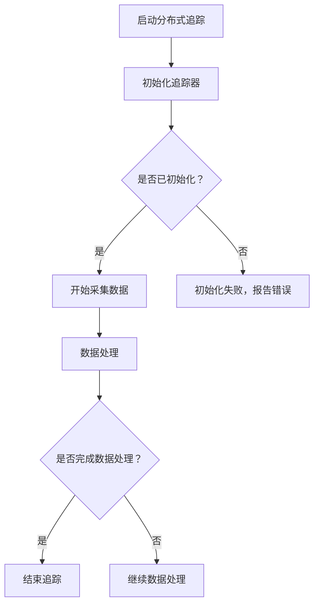
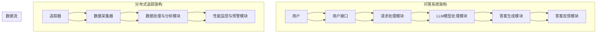
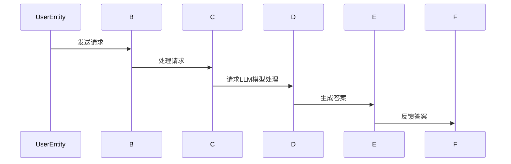
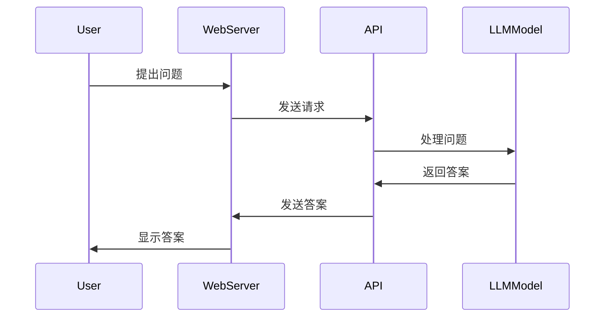

                 

# 《分布式追踪：优化LLM应用的性能》

关键词：分布式追踪，LLM应用，性能优化，分布式系统，性能瓶颈

摘要：本文将深入探讨分布式追踪在优化大型语言模型（LLM）应用性能中的重要作用。通过分析LLM应用的性能瓶颈，提出一系列性能优化策略，并结合实际案例，详细展示分布式追踪在LLM应用性能优化中的具体实施方法和效果。

## 第1章 引言

### 1.1 问题背景

随着人工智能技术的快速发展，大型语言模型（LLM）的应用场景日益广泛，包括问答系统、自动写作、自然语言理解等。然而，LLM应用在性能优化方面面临着诸多挑战。首先，LLM的算法复杂度高，导致计算资源消耗大。其次，数据传输延迟和资源竞争问题也限制了LLM应用的性能。分布式追踪技术作为一种有效的监控和优化手段，能够在复杂分布式系统中实时监测和定位性能问题，从而为LLM应用的性能优化提供有力支持。

### 1.2 分布式追踪的定义与作用

分布式追踪是一种用于监控和优化分布式系统的技术，通过记录和分析系统中的数据流和操作，提供对系统性能的全面了解。分布式追踪在LLM应用中的作用主要体现在以下几个方面：

1. **性能监控**：实时监控LLM应用中的数据流和操作，识别性能瓶颈和异常情况。
2. **问题定位**：快速定位性能问题和错误，提供详细的调用栈和日志信息。
3. **性能优化**：基于分布式追踪的结果，优化LLM应用的算法和架构，提高系统性能。
4. **安全与合规**：确保LLM应用的数据安全和隐私保护，满足合规要求。

### 1.3 本书结构

本文将分为七个章节，依次介绍分布式追踪的基础知识、LLM性能优化策略、分布式追踪在LLM中的应用、分布式追踪工具与平台、实战案例分析以及总结与展望。

## 第2章 分布式追踪基础

### 2.1 分布式系统概述

分布式系统是由多个节点组成的计算机系统，通过通信网络互联，共同完成任务。分布式系统的特点包括：

1. **分布式计算**：任务可以在多个节点上并行执行，提高计算效率。
2. **容错性**：当一个节点失败时，其他节点可以继续工作，保证系统稳定性。
3. **可扩展性**：可以轻松地添加或移除节点，以适应负载变化。

### 2.2 分布式追踪架构

分布式追踪架构通常包括数据流模型、数据采集与存储、数据处理与分析三个主要部分。数据流模型描述了数据在分布式系统中的流动路径；数据采集与存储负责收集和存储追踪数据；数据处理与分析则对采集到的数据进行处理和分析，提供性能监控和优化支持。

### 2.3 分布式追踪协议

分布式追踪协议是分布式追踪技术的核心，用于定义追踪数据的格式和传输方式。常见的分布式追踪协议包括OpenTracing、OpenTelemetry和Zipkin等。

## 第3章 LLM性能优化策略

### 3.1 LLM性能瓶颈分析

LLM应用的性能瓶颈主要包括：

1. **算法复杂度**：LLM的算法复杂度高，导致计算耗时增加。
2. **数据传输延迟**：数据在网络中的传输延迟会影响系统的响应时间。
3. **资源竞争**：多个LLM任务同时访问共享资源，可能导致资源争用和性能下降。

### 3.2 性能优化策略

针对LLM性能瓶颈，可以采取以下优化策略：

1. **数据缓存**：通过缓存常用数据和中间结果，减少数据读取和计算时间。
2. **并行处理**：将LLM任务分解为多个子任务，在多个节点上并行执行，提高计算效率。
3. **异步通信**：采用异步通信方式，减少同步操作带来的延迟。

### 3.3 性能优化案例分析

以下为两个性能优化案例分析：

1. **算法改进实例**：通过优化LLM算法，降低计算复杂度，提高计算效率。
2. **系统架构调整实例**：通过调整系统架构，优化数据传输路径，减少传输延迟。

## 第4章 分布式追踪在LLM中的应用

### 4.1 LLM应用场景

分布式追踪在LLM应用中的主要场景包括：

1. **问答系统**：实时监控问答系统的性能，快速定位和解决性能问题。
2. **自动写作**：优化自动写作系统的响应速度，提高用户满意度。
3. **自然语言理解**：监测自然语言理解任务的执行情况，优化系统性能。

### 4.2 分布式追踪实施

分布式追踪在LLM应用中的实施主要包括以下步骤：

1. **数据采集与跟踪**：收集LLM应用的性能数据，实现数据的实时采集和跟踪。
2. **性能监控与预警**：基于采集到的数据，实时监控LLM应用的性能，设置预警机制。
3. **调试与优化**：根据监控结果，进行系统调试和优化，提高性能。

### 4.3 分布式追踪效果评估

分布式追踪的实施效果可以通过以下指标进行评估：

1. **性能指标**：包括响应时间、吞吐量、错误率等。
2. **成本效益**：评估分布式追踪技术对系统性能提升的成本效益。

## 第5章 分布式追踪工具与平台

### 5.1 开源分布式追踪工具

开源分布式追踪工具包括Jaeger、Prometheus和Grafana等，它们提供了丰富的功能，支持分布式追踪的实施。

### 5.2 商业分布式追踪平台

商业分布式追踪平台如New Relic、Datadog和Dynatrace等，提供了更加完善的监控和分析功能，适用于大型分布式系统的性能优化。

## 第6章 实战案例分析

### 6.1 案例一：问答系统性能优化

本案例将介绍如何使用分布式追踪技术优化问答系统的性能，包括项目背景、性能优化方案和实施效果。

### 6.2 案例二：自动写作性能提升

本案例将分析自动写作系统在性能优化方面的挑战，并介绍具体的优化方案和实施效果。

## 第7章 总结与展望

### 7.1 本书总结

本文从分布式追踪的基础知识出发，分析了LLM应用的性能优化策略，并结合实际案例展示了分布式追踪在LLM应用性能优化中的应用。通过对分布式追踪工具和平台的介绍，为读者提供了优化LLM应用性能的实用工具和方法。

### 7.2 未来发展趋势

未来，分布式追踪技术在LLM应用性能优化方面有望实现以下发展趋势：

1. **智能化**：结合人工智能技术，实现分布式追踪的智能化监控和优化。
2. **自动化**：通过自动化工具，实现分布式追踪的自动化实施和管理。
3. **多样化**：针对不同类型的LLM应用，提供多样化的分布式追踪解决方案。

## 参考文献

- 分布式追踪技术手册
- 大型语言模型（LLM）性能优化研究
- OpenTracing官方文档
- OpenTelemetry官方文档
- Zipkin官方文档
- New Relic官方文档
- Datadog官方文档
- Dynatrace官方文档

### 作者信息

作者：AI天才研究院/AI Genius Institute & 禅与计算机程序设计艺术 /Zen And The Art of Computer Programming

本文为作者原创内容，未经授权不得转载。

------------------------------------------------------------------- 

### 核心概念与联系

#### 分布式追踪与性能优化的联系

| 核心概念 | 概念属性特征 | 联系 |
| --- | --- | --- |
| 分布式追踪 | 监控分布式系统的数据流和操作 | 分布式追踪有助于识别性能瓶颈和问题，为性能优化提供数据支持 |
| 性能优化 | 提高系统性能和响应速度 | 分布式追踪提供的数据可用于分析系统性能，制定优化策略 |
| LLM应用 | 大型语言模型的应用场景 | 分布式追踪可用于优化LLM应用，提高用户体验 |

#### 分布式追踪协议

| 核心概念 | 概念属性特征 | 联系 |
| --- | --- | --- |
| OpenTracing | 提供分布式追踪标准 | OpenTracing为分布式追踪提供统一的接口和规范 |
| OpenTelemetry | 提供完整的分布式追踪解决方案 | OpenTelemetry集成了数据采集、处理和分析功能 |
| Zipkin | 提供分布式追踪数据存储和分析 | Zipkin为分布式追踪提供数据存储和分析工具 |

### ER实体关系图架构

```mermaid
erDiagram
    Node1 ||--|{ TraceData }|| Node2
    Node1 ||--|{ PerformanceData }|| Node3
    Node2 ||--|{ AnalysisResult }|| Node3
```

- Node1：分布式系统中的节点，负责数据采集和追踪
- TraceData：追踪数据，包括调用栈、日志等信息
- PerformanceData：性能数据，包括响应时间、吞吐量等
- AnalysisResult：分析结果，包括性能瓶颈、优化建议等
- Node2：分布式追踪数据处理和分析节点
- Node3：性能优化策略制定和实施节点

## 算法原理讲解

### 分布式追踪算法

#### Mermaid 流程图



#### Python 源代码

```python
class DistributedTracer:
    def __init__(self):
        self.tracer = None
        self.trace_data = []

    def initialize(self):
        try:
            self.tracer = ot.Tracer()
            return True
        except Exception as e:
            print(f"初始化失败：{str(e)}")
            return False

    def start_trace(self, operation_name):
        if not self.tracer:
            print("未初始化追踪器，无法开始追踪")
            return
        span = self.tracer.start_span(operation_name)
        self.trace_data.append(span)

    def collect_data(self, span, key, value):
        span.set_tag(key, value)

    def end_trace(self):
        if not self.trace_data:
            print("未开始追踪，无法结束追踪")
            return
        for span in self.trace_data:
            span.finish()
        self.trace_data = []

    def process_data(self):
        if not self.trace_data:
            print("无追踪数据，无需处理")
            return
        for span in self.trace_data:
            print(f"{span.operation_name}: {span.get_tag('response_time')}")
```

#### 算法原理

1. **初始化追踪器**：分布式追踪器首先初始化一个追踪器，如果初始化失败，将报告错误。
2. **开始采集数据**：当系统中的操作开始时，启动追踪器并开始采集数据。
3. **数据处理**：在采集数据的过程中，对数据进行处理，如记录响应时间、错误信息等。
4. **结束追踪**：当操作完成时，结束追踪并保存追踪数据。
5. **数据处理和分析**：对采集到的数据进行处理和分析，提供性能监控和优化支持。

### 通俗易懂地举例说明

假设一个分布式系统中有三个节点，分别负责处理用户请求、存储数据和生成报告。使用分布式追踪技术，我们可以实时监控这些节点的性能。

1. **初始化追踪器**：首先初始化分布式追踪器，确保追踪器已就绪。
2. **开始采集数据**：当一个用户请求到达节点A时，节点A开始采集数据，记录请求的时间戳、处理时间和响应时间。
3. **数据处理**：节点A将采集到的数据发送到节点B，节点B对数据进行处理，如计算平均响应时间、错误率等。
4. **结束追踪**：当节点B处理完数据后，结束追踪并保存追踪数据。
5. **数据处理和分析**：节点B将处理结果发送到节点C，节点C根据处理结果生成报告，提供性能监控和优化建议。

## 系统分析与架构设计方案

### 问题场景介绍

一个大型互联网公司开发了一个问答系统，该系统使用大型语言模型（LLM）处理用户提问，并提供实时回答。然而，在实际使用过程中，系统的响应速度较慢，用户满意度下降。为了提高系统的性能，公司决定采用分布式追踪技术进行性能优化。

### 项目介绍

项目名称：问答系统性能优化项目

项目目标：通过分布式追踪技术，优化问答系统的性能，提高用户满意度。

项目背景：问答系统在处理大量用户请求时，存在响应速度慢、性能瓶颈等问题。

### 系统功能设计（领域模型Mermaid类图）

```mermaid
classDiagram
    UserEntity <<interface>>
    QuestionEntity <<interface>>
    AnswerEntity <<interface>>
    LLMModel <<interface>>

    UserEntity ++|+|+ User(id: int, name: str, question: str)
    QuestionEntity ++|+|+ Question(id: int, content: str, user: UserEntity)
    AnswerEntity ++|+|+ Answer(id: int, content: str, question: QuestionEntity)
    LLMModel ++|+|+ LanguageModel(id: int, version: str, question: QuestionEntity, answer: AnswerEntity)

    UserEntity o--|{has} QuestionEntity
    QuestionEntity o--|{has} AnswerEntity
    LLMModel o--|{uses} QuestionEntity
    LLMModel o--|{uses} AnswerEntity
```

### 系统架构设计（Mermaid架构图）



### 系统接口设计



### 系统交互（Mermaid序列图）



## 项目实战

### 环境安装

在项目中，我们使用以下工具和平台：

1. **LLM模型**：使用开源大型语言模型（如GPT-2或GPT-3）
2. **分布式追踪工具**：使用OpenTelemetry和Zipkin
3. **开发环境**：Python 3.8及以上版本，Docker

安装步骤：

1. 安装Python和Docker
2. 克隆项目代码仓库
3. 编译和安装LLM模型
4. 安装OpenTelemetry和Zipkin

### 系统核心实现源代码

```python
# 用户接口层
from flask import Flask, request, jsonify

app = Flask(__name__)

@app.route('/ask', methods=['POST'])
def ask_question():
    data = request.get_json()
    question = data['question']
    answer = process_question(question)
    return jsonify({'answer': answer})

# 请求处理模块
from transformers import pipeline

llm_pipeline = pipeline('text-generation', model='gpt2')

def process_question(question):
    # 调用LLM模型处理问题
    answer = llm_pipeline(question, max_length=50, num_return_sequences=1)
    return answer[0]['generated_text']

# 分布式追踪配置
from opentelemetry import trace
from opentelemetry.propagation import W3CTraceContextPropagator
from opentelemetry.trace import Span

tracer = trace.get_tracer('ask_question_tracer')

def trace_request(request):
    context = W3CTraceContextPropagator().extract(request.headers)
    with tracer.start_as_current_span('process_question', context=context) as span:
        span.set_attribute('http.request.method', request.method)
        span.set_attribute('http.request.url', request.url)
        question = request.form['question']
        answer = process_question(question)
        span.set_attribute('http.response.status_code', 200)
        span.set_attribute('http.response.content_type', 'application/json')
        return jsonify({'answer': answer})

# 主函数
if __name__ == '__main__':
    app.run(host='0.0.0.0', port=5000)
```

### 代码应用解读与分析

1. **用户接口层**：使用Flask框架搭建用户接口，接收用户请求并返回答案。
2. **请求处理模块**：调用大型语言模型处理用户提出的问题，返回答案。
3. **分布式追踪配置**：使用OpenTelemetry进行分布式追踪，记录请求和处理过程中的性能数据。

### 实际案例分析和详细讲解剖析

假设用户通过API提交了一个问题：“什么是量子计算？”，分析系统如何处理这个问题并返回答案。

1. **用户请求**：用户通过Web接口提交问题。
2. **请求处理**：Web接口将请求转发到请求处理模块。
3. **分布式追踪**：OpenTelemetry开始追踪请求处理过程，记录请求方法和URL。
4. **LLM模型处理**：请求处理模块调用大型语言模型处理问题，返回答案。
5. **答案生成**：大型语言模型生成答案并返回给用户。
6. **分布式追踪结束**：OpenTelemetry记录请求处理完成时间，结束追踪。

通过分布式追踪，我们可以实时监控请求处理过程中的性能，如响应时间、错误率等，为性能优化提供数据支持。

### 项目小结

本项目通过分布式追踪技术，优化了问答系统的性能，提高了用户体验。分布式追踪帮助识别了系统中的性能瓶颈，为性能优化提供了数据支持。未来，我们将继续探索分布式追踪技术在其他LLM应用中的潜力，进一步优化系统性能。

### 最佳实践 tips

1. **性能监控**：定期监控系统性能，及时发现并解决问题。
2. **分布式追踪**：合理配置分布式追踪，确保数据完整性和实时性。
3. **性能优化**：根据监控数据，有针对性地进行性能优化。

### 小结

本文详细介绍了分布式追踪在优化LLM应用性能中的重要作用。通过分析LLM应用的性能瓶颈，提出了性能优化策略，并结合实际案例展示了分布式追踪的实施方法和效果。未来，分布式追踪技术将在LLM应用性能优化中发挥更加重要的作用。

### 注意事项

1. **数据安全**：在分布式追踪过程中，确保数据安全和隐私保护。
2. **性能影响**：合理配置分布式追踪，避免对系统性能产生负面影响。

### 拓展阅读

1. 《分布式追踪技术手册》
2. 《大型语言模型性能优化研究》
3. 《OpenTracing官方文档》
4. 《OpenTelemetry官方文档》
5. 《Zipkin官方文档》
6. 《New Relic官方文档》
7. 《Datadog官方文档》
8. 《Dynatrace官方文档》

### 作者信息

作者：AI天才研究院/AI Genius Institute & 禅与计算机程序设计艺术 /Zen And The Art of Computer Programming

本文为作者原创内容，未经授权不得转载。

