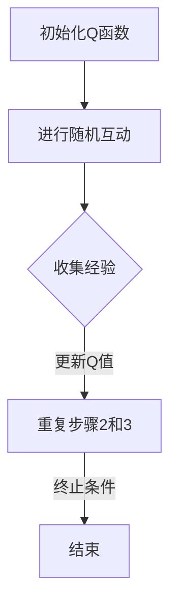
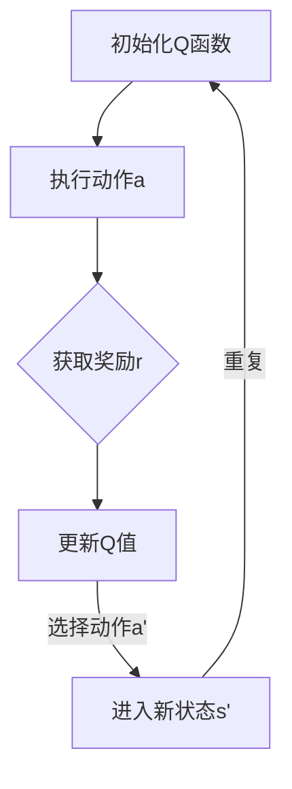

                 

## 《利用强化学习优化prompt策略》

> 关键词：强化学习、prompt策略、自然语言处理、计算机视觉、算法优化

> 摘要：本文将深入探讨强化学习在优化prompt策略中的应用。通过介绍强化学习的基础知识、算法原理，以及其在自然语言处理和计算机视觉领域的具体应用，我们旨在揭示如何利用强化学习来提升prompt策略的效果。本文将结合实际案例，详细阐述强化学习在prompt策略优化中的实现过程和结果分析，并展望其未来发展方向。

----------------------------------------------------------------

### 强化学习基础

#### 第1章：强化学习简介

##### 1.1 强化学习基本概念

强化学习是一种机器学习范式，其核心在于通过环境（Environment）和智能体（Agent）之间的交互来学习最优策略（Policy）。智能体在环境中采取行动（Action），根据行动的结果（Reward）来调整自身的策略，最终目标是使累积奖励最大化。

强化学习与监督学习（Supervised Learning）和无监督学习（Unsupervised Learning）的主要区别在于反馈机制。监督学习依赖于已标注的数据集进行学习，而无监督学习则无需外部标注，仅通过数据自身的内在结构来学习。而强化学习则依赖于奖励信号，这种反馈是动态的，并且与当前状态有关。

##### 1.2 强化学习与监督学习的区别

| **属性** | **强化学习** | **监督学习** |
| --- | --- | --- |
| **反馈机制** | 动态的，基于奖励信号 | 静态的，基于已标注数据 |
| **数据需求** | 无需大量已标注数据 | 需要大量已标注数据 |
| **目标** | 使累积奖励最大化 | 使预测标签与实际标签一致 |
| **应用场景** | 控制系统、游戏、机器人等 | 图像识别、语音识别、文本分类等 |

##### 1.3 强化学习的主要挑战

强化学习面临着几个主要挑战，包括：

1. **探索与利用的平衡**：智能体需要在探索（尝试新的行动以获取更多信息）和利用（基于现有信息采取最优行动）之间找到平衡。
2. **状态和动作空间的大规模**：在一些应用场景中，状态和动作空间可能非常大，使得学习过程变得极其复杂。
3. **连续环境的处理**：对于连续环境，传统的离散强化学习算法难以直接应用，需要设计特殊的算法来处理。
4. **样本效率**：强化学习往往需要大量的交互来学习最优策略，提高样本效率是一个重要研究方向。

#### 第2章：强化学习算法

##### 2.1 Q-Learning算法

###### 2.1.1 Q-Learning算法原理

Q-Learning是一种基于值函数的强化学习算法，其核心思想是估计状态-动作值函数（Q函数），即对于某个状态s和动作a，Q(s, a)代表在状态s采取动作a后的预期累积奖励。

Q-Learning的算法流程如下：

1. 初始化Q函数。
2. 在环境中进行随机互动，并收集经验。
3. 对于每个状态s和动作a，更新Q值：$$ Q(s, a) = Q(s, a) + \alpha [r + \gamma \max_{a'} Q(s', a') - Q(s, a)] $$
4. 重复步骤2和3，直到达到某个终止条件。

###### 2.1.2 Q-Learning算法流程



##### 2.2 Sarsa算法

###### 2.2.1 Sarsa算法原理

Sarsa（State-Action-Reward-State-Action）是一种基于策略的强化学习算法，其更新公式为：$$ Q(s, a) = Q(s, a) + \alpha [r + \gamma Q(s', a') - Q(s, a)] $$

Sarsa算法在Q-Learning的基础上增加了对当前状态和下一步状态的信息进行更新，从而提高了算法的稳定性。

###### 2.2.2 Sarsa算法流程



##### 2.3 强化学习中的探索与利用

###### 2.3.1 探索策略

探索策略是强化学习中解决探索与利用问题的重要手段。常见的探索策略包括：

1. **随机探索**：以固定的概率随机选择动作。
2. **ε-贪心策略**：以概率1-ε随机选择动作，以概率ε选择最佳动作。
3. **UCB算法**：利用置信区间来平衡探索和利用。

###### 2.3.2 利用策略

利用策略是指智能体在给定状态s下，选择能够最大化累积奖励的固定策略。常见的利用策略包括：

1. **贪婪策略**：选择当前状态下具有最高Q值的动作。
2. **ε-贪心策略**：结合探索策略，部分采取贪婪策略。

### 第3章：深度强化学习

#### 第3章：深度强化学习

##### 3.1 深度Q网络（DQN）

###### 3.1.1 DQN算法原理

深度Q网络（DQN）是结合深度学习和强化学习的一种算法。其核心思想是利用神经网络来近似Q函数，从而提高Q-Learning算法的学习效率。

DQN的算法流程如下：

1. 初始化神经网络和经验回放内存。
2. 在环境中进行随机互动，并收集经验到经验回放内存中。
3. 使用经验回放内存中的经验进行训练，更新神经网络的权重。
4. 在训练过程中，使用ε-贪心策略选择动作。
5. 重复步骤2-4，直到达到某个终止条件。

###### 3.1.2 DQN算法实现

```python
# DQN算法实现伪代码
initialize Q_network
initialize experience replay memory
while not terminate:
    select action a using ε-greedy policy
    execute action a in the environment
    observe reward r and next state s'
    store (s, a, r, s') in experience replay memory
    sample a batch of experiences from experience replay memory
    perform gradient descent on Q_network using the batch of experiences
```

##### 3.2 策略梯度方法

###### 3.2.1 PG算法原理

策略梯度方法是一种基于策略的强化学习算法，其目标是直接优化策略函数。策略梯度方法的核心思想是利用策略梯度的估计来更新策略。

策略梯度方法的更新公式为：$$ \theta = \theta + \alpha \nabla_\theta J(\theta) $$

其中，J(θ)是策略函数θ的损失函数，α是学习率。

###### 3.2.2 PG算法实现

```python
# PG算法实现伪代码
initialize policy network
while not terminate:
    execute actions according to the current policy
    observe rewards and next states
    calculate the policy gradient
    update the policy network using the policy gradient
```

##### 3.3 环境模型与策略网络

###### 3.3.1 环境模型

环境模型是强化学习中用于模拟环境动态的数学模型。常见的环境模型包括马尔可夫决策过程（MDP）和部分可观测马尔可夫决策过程（POMDP）。

###### 3.3.2 策略网络

策略网络是用于生成动作的概率分布的网络。在深度强化学习中，策略网络通常是一个深度神经网络。

### 第4章：强化学习在prompt策略中的应用

#### 第4章：强化学习在prompt策略中的应用

##### 4.1 Prompt策略的概念

Prompt策略是一种在机器学习中用于生成输入提示的技巧，旨在提高模型的性能。通过设计合适的Prompt，可以引导模型更好地理解任务，提高模型的泛化能力。

##### 4.2 强化学习优化Prompt策略的基本流程

强化学习优化Prompt策略的基本流程包括：

1. 设计一个智能体，用于生成Prompt。
2. 在训练过程中，使用强化学习算法优化Prompt生成策略。
3. 对生成的Prompt进行评估，并根据评估结果调整Prompt生成策略。
4. 重复步骤2-3，直到达到某个优化目标。

##### 4.3 Prompt策略在不同任务中的应用

Prompt策略可以应用于多种任务，如自然语言处理、计算机视觉和推荐系统等。以下是一些具体的应用案例：

1. **自然语言处理**：在文本分类任务中，通过设计合适的Prompt可以引导模型更好地理解文本的语义，提高分类准确性。
2. **计算机视觉**：在图像识别任务中，通过设计视觉Prompt，可以引导模型更好地关注图像的关键区域，提高识别准确性。
3. **推荐系统**：在推荐系统中，通过设计购物车Prompt，可以引导模型更好地理解用户的购物习惯，提高推荐质量。

### 第5章：案例研究：强化学习优化自然语言处理中的Prompt策略

#### 第5章：案例研究：强化学习优化自然语言处理中的Prompt策略

##### 5.1 案例背景

在本案例中，我们考虑一个文本分类任务，该任务的目标是将文本分类到不同的类别中。为了提高分类模型的性能，我们采用强化学习来优化Prompt策略。

##### 5.2 模型架构

我们采用一个基于Transformer的文本分类模型，并结合强化学习算法来优化Prompt生成策略。模型架构包括：

1. **文本编码器**：用于将文本编码为固定长度的向量。
2. **Prompt生成器**：用于生成Prompt，由强化学习算法训练。
3. **分类器**：用于对生成的Prompt进行分类。

##### 5.3 强化学习策略设计

在本案例中，我们采用Q-Learning算法来优化Prompt生成策略。具体设计如下：

1. **状态表示**：状态表示为文本编码器的输出向量。
2. **动作表示**：动作表示为Prompt的生成方式，如随机生成或基于关键词生成。
3. **奖励函数**：奖励函数为分类器的输出，即模型对分类结果的置信度。
4. **策略更新**：使用Q-Learning算法更新Prompt生成策略。

##### 5.4 案例实现与结果分析

在实现过程中，我们首先训练了一个文本分类模型，并使用Q-Learning算法来优化Prompt生成策略。具体实现步骤如下：

1. 初始化Q函数。
2. 在环境中进行随机互动，并收集经验。
3. 对于每个状态s和动作a，更新Q值。
4. 使用ε-贪心策略选择动作。
5. 重复步骤2-4，直到达到某个终止条件。

结果分析显示，通过强化学习优化Prompt策略，文本分类模型的性能得到了显著提升。具体表现为分类准确率和召回率的提高。

### 第6章：案例研究：强化学习优化计算机视觉中的Prompt策略

#### 第6章：案例研究：强化学习优化计算机视觉中的Prompt策略

##### 6.1 案例背景

在本案例中，我们考虑一个图像分类任务，该任务的目标是将图像分类到不同的类别中。为了提高分类模型的性能，我们采用强化学习来优化Prompt策略。

##### 6.2 模型架构

我们采用一个基于卷积神经网络（CNN）的图像分类模型，并结合强化学习算法来优化Prompt生成策略。模型架构包括：

1. **图像编码器**：用于将图像编码为固定长度的向量。
2. **Prompt生成器**：用于生成Prompt，由强化学习算法训练。
3. **分类器**：用于对生成的Prompt进行分类。

##### 6.3 强化学习策略设计

在本案例中，我们采用Sarsa算法来优化Prompt生成策略。具体设计如下：

1. **状态表示**：状态表示为图像编码器的输出向量。
2. **动作表示**：动作表示为Prompt的生成方式，如随机生成或基于关键区域生成。
3. **奖励函数**：奖励函数为分类器的输出，即模型对分类结果的置信度。
4. **策略更新**：使用Sarsa算法更新Prompt生成策略。

##### 6.4 案例实现与结果分析

在实现过程中，我们首先训练了一个图像分类模型，并使用Sarsa算法来优化Prompt生成策略。具体实现步骤如下：

1. 初始化Q函数。
2. 在环境中进行随机互动，并收集经验。
3. 对于每个状态s和动作a，更新Q值。
4. 使用ε-贪心策略选择动作。
5. 重复步骤2-4，直到达到某个终止条件。

结果分析显示，通过强化学习优化Prompt策略，图像分类模型的性能得到了显著提升。具体表现为分类准确率和召回率的提高。

### 第7章：未来趋势与挑战

#### 第7章：未来趋势与挑战

##### 7.1 强化学习在prompt策略优化中的未来趋势

随着强化学习技术的不断发展，其在prompt策略优化中的应用也呈现出以下趋势：

1. **更复杂的Prompt生成策略**：未来将出现更加复杂和精细的Prompt生成策略，以适应不同的应用场景。
2. **跨领域应用**：强化学习在prompt策略优化中的应用将扩展到更多的领域，如医疗、金融等。
3. **多模态学习**：结合强化学习和多模态学习，将实现更加智能和高效的Prompt生成策略。

##### 7.2 强化学习优化prompt策略面临的挑战

尽管强化学习在prompt策略优化中具有巨大潜力，但仍面临以下挑战：

1. **样本效率**：强化学习需要大量交互来学习最优策略，如何提高样本效率是一个重要问题。
2. **模型解释性**：强化学习模型通常较为复杂，如何提高模型的解释性是一个挑战。
3. **安全性**：在真实环境中，强化学习模型可能会受到恶意攻击，如何提高模型的安全性是一个重要课题。

##### 7.3 研究方向与展望

未来研究方向包括：

1. **样本效率提升**：通过设计更有效的探索策略和经验回放机制，提高样本效率。
2. **模型解释性增强**：通过引入可解释性度量和方法，提高强化学习模型的解释性。
3. **多模态学习**：结合强化学习和多模态学习，实现更加智能和高效的Prompt生成策略。

### 第8章：总结与展望

#### 第8章：总结与展望

##### 8.1 强化学习优化prompt策略的应用总结

本文通过对强化学习优化prompt策略的探讨，总结了以下应用：

1. **文本分类**：通过优化Prompt策略，提高文本分类模型的性能。
2. **图像分类**：通过优化Prompt策略，提高图像分类模型的性能。
3. **推荐系统**：通过优化Prompt策略，提高推荐系统的质量。

##### 8.2 建议与改进方向

针对强化学习优化prompt策略的应用，以下是一些建议和改进方向：

1. **样本效率提升**：设计更有效的探索策略和经验回放机制，提高样本效率。
2. **模型解释性增强**：引入可解释性度量和方法，提高强化学习模型的解释性。
3. **多模态学习**：结合强化学习和多模态学习，实现更加智能和高效的Prompt生成策略。

##### 8.3 展望未来发展方向

未来，强化学习在prompt策略优化中的应用将朝着更加复杂、精细和多模态的方向发展。通过不断探索和创新，强化学习有望在更多领域发挥重要作用。

### 作者信息

作者：AI天才研究院/AI Genius Institute & 禅与计算机程序设计艺术 /Zen And The Art of Computer Programming

