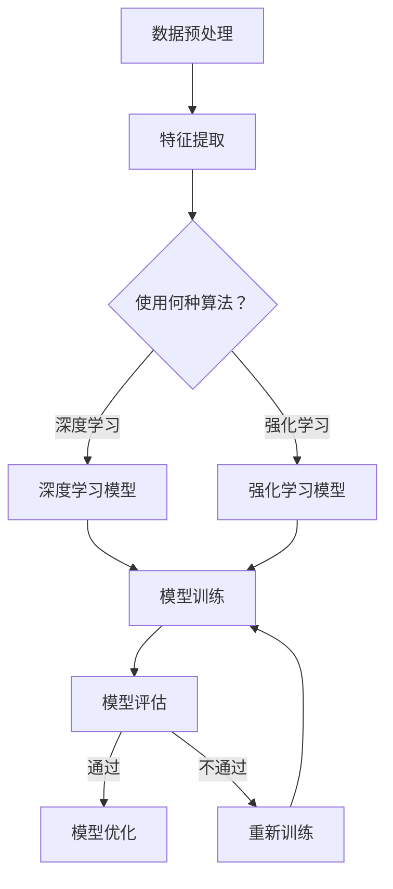
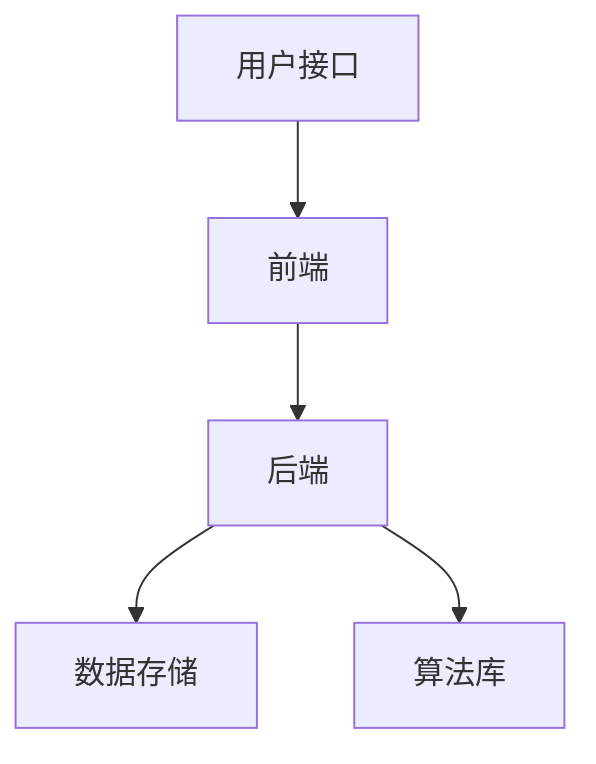
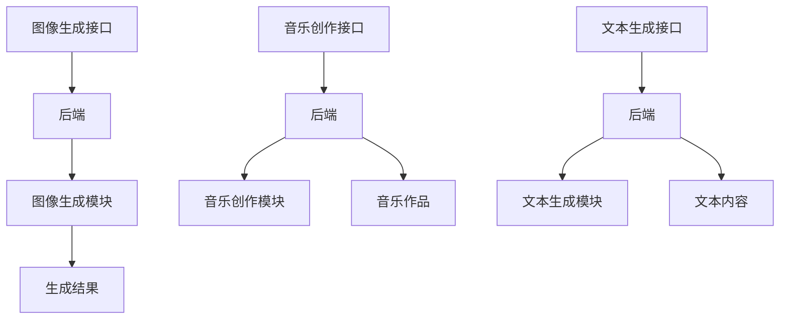
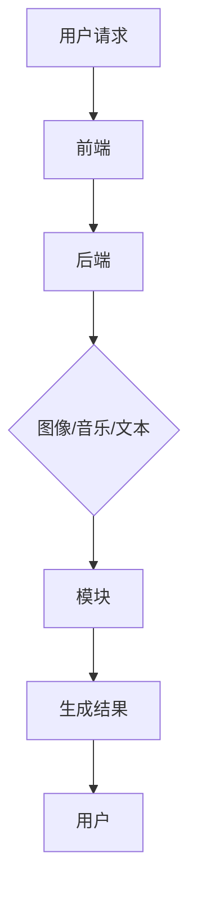

                 

# 利用思维链增强AI的创造力

关键词：人工智能，创造力，思维链，算法，系统架构，最佳实践

摘要：本文探讨了如何利用思维链增强人工智能的创造力。通过分析人工智能创造力的问题背景和核心概念，我们提出了一种结合算法原理和系统架构设计的解决方案。文章详细介绍了思维链的概念、核心概念与联系、算法原理以及实际应用案例，并提出了最佳实践和注意事项，为人工智能领域的研究者和开发者提供了有价值的参考。

### 目录大纲

----------------------------------------------------------------

## 第一部分：背景介绍

### 第1章：AI创造力概述

### 第2章：AI创造力的问题背景与问题描述

### 第3章：AI创造力问题解决的思路

### 第4章：AI创造力问题的边界与外延

### 第5章：AI创造力概念结构与核心要素组成

## 第二部分：核心概念与联系

### 第6章：核心概念原理讲解

### 第7章：概念属性特征对比表格

### 第8章：ER实体关系图架构

## 第三部分：算法原理讲解

### 第9章：算法mermaid流程图绘制

### 第10章：算法原理的数学模型和公式讲解

### 第11章：算法原理的举例说明

## 第四部分：系统分析与架构设计

### 第12章：问题场景介绍

### 第13章：项目介绍

### 第14章：系统功能设计

### 第15章：系统架构设计

### 第16章：系统接口设计

### 第17章：系统交互

## 第五部分：项目实战

### 第18章：环境安装

### 第19章：系统核心实现源代码

### 第20章：代码应用解读与分析

### 第21章：实际案例分析与详细讲解剖析

### 第22章：项目小结

## 第六部分：最佳实践、小结、注意事项、拓展阅读

### 第23章：最佳实践

### 第24章：小结

### 第25章：注意事项

### 第26章：拓展阅读

----------------------------------------------------------------

## 第一部分：背景介绍

### 第1章：AI创造力概述

在人工智能（AI）领域，创造力一直是一个备受关注的话题。随着深度学习和神经网络技术的发展，AI在图像识别、自然语言处理、自动驾驶等领域的表现越来越出色。然而，AI在创造力方面的表现仍然有限。本文旨在探讨如何利用思维链增强AI的创造力，从而提升其在创意生成和解决问题方面的能力。

创造力是指个体在思考和解决问题时能够产生新颖且有价值的想法和解决方案的能力。在人类历史上，创造力推动了科技进步、艺术创新和社会发展。近年来，研究者们开始关注如何将创造力这一人类独特的认知能力赋予机器。

### 第2章：AI创造力的问题背景与问题描述

当前，AI在创造力方面面临以下几个主要问题：

1. **有限的数据依赖**：AI模型通常依赖于大量数据进行训练，这限制了它们在未知或新领域的创造力。
2. **缺乏灵活性**：传统的AI算法在处理特定任务时效果显著，但在面对新的、复杂的问题时往往缺乏灵活性。
3. **低水平的抽象能力**：AI在抽象思维、跨领域知识整合方面的能力较弱，难以产生超越已有知识的创新。
4. **缺乏情感和直觉**：AI缺乏人类情感的直觉和感性认知，这在某些需要情感共鸣和情境理解的创造性任务中成为瓶颈。

为了解决这些问题，我们需要探讨如何利用思维链增强AI的创造力。思维链是一种通过连接不同概念、想法和知识结构来激发创新思维的方法。在接下来的章节中，我们将详细讨论思维链的概念、原理和应用。

### 第3章：AI创造力问题解决的思路

要解决AI在创造力方面的问题，我们可以从以下几个方面入手：

1. **扩展数据来源**：通过增加多样化的数据源和跨领域的知识库，提升AI模型对未知领域的适应能力。
2. **增强算法灵活性**：采用更加灵活的算法和模型，如强化学习和生成对抗网络（GANs），使AI能够适应不同的问题情境。
3. **提升抽象能力**：通过结合人类专家的知识和AI的自动化学习能力，提升AI在抽象思维和跨领域知识整合方面的能力。
4. **引入情感和直觉**：利用自然语言处理和情感计算技术，使AI能够理解和模拟人类的情感和直觉，从而在创意生成中发挥更大的作用。

### 第4章：AI创造力问题的边界与外延

AI创造力的研究边界和范围包括以下几个方面：

1. **研究领域**：涵盖计算机科学、心理学、认知科学、人工智能等多个学科。
2. **应用领域**：包括艺术创作、设计、游戏开发、医学诊断、商业策略等。
3. **技术挑战**：如何实现AI的跨领域知识整合、如何模拟人类的情感和直觉、如何确保AI生成的创意具有实用性和价值等。

在接下来的章节中，我们将深入探讨这些核心概念，并通过实例分析如何利用思维链增强AI的创造力。

### 第5章：AI创造力概念结构与核心要素组成

为了深入理解AI创造力的概念结构和核心要素，我们需要从以下几个方面进行分析：

1. **创造力理论**：探讨创造力在心理学和认知科学中的定义和理论基础。
2. **人工智能技术**：分析当前AI技术在创造力方面的发展和应用。
3. **思维链原理**：介绍思维链的概念、原理和实现方法。
4. **算法优化**：探讨如何通过算法优化提升AI的创造力。
5. **系统架构设计**：分析如何设计高效的系统架构以支持AI的创造力。

通过这些核心要素的分析，我们可以为后续的算法原理讲解和系统架构设计提供坚实的基础。

## 第二部分：核心概念与联系

### 第6章：核心概念原理讲解

在本章中，我们将详细讲解与AI创造力相关的核心概念，包括创造力理论、思维链原理、人工智能技术等。

### 创造力理论

创造力理论源于心理学和认知科学领域，主要研究个体如何产生新颖而有价值的想法和解决方案。以下是一些重要的创造力理论：

1. **发散思维**：个体从不同的角度和方向思考问题，产生多种可能的解决方案。
2. **聚合思维**：个体在解决问题时，将多种信息整合到一个统一的框架中，找到最佳的解决方案。
3. **原型启发**：个体通过观察其他领域的原型，激发新的创意和灵感。
4. **联想思维**：个体通过不同概念之间的联系，产生新的创意和解决方案。

### 思维链原理

思维链是一种通过连接不同概念、想法和知识结构来激发创新思维的方法。思维链的基本原理包括：

1. **概念连接**：将不同领域的概念联系起来，形成新的思维路径。
2. **思维迭代**：通过不断的迭代和改进，优化思维链的质量和效果。
3. **情境模拟**：将思维链应用于实际问题中，模拟不同的情境和解决方案。

### 人工智能技术

人工智能技术在AI创造力中发挥着关键作用。以下是一些与创造力相关的人工智能技术：

1. **深度学习**：通过神经网络模型，从大量数据中自动提取特征和模式，为创造力提供基础。
2. **强化学习**：通过试错和反馈，使AI在复杂环境中不断学习和优化，提高创造力的适应性。
3. **生成对抗网络（GANs）**：通过生成器和判别器的对抗训练，生成新颖的创意和作品。

### 第7章：概念属性特征对比表格

为了更好地理解各个核心概念，我们通过表格形式对比它们的属性特征。

| 概念 | 定义 | 特征 |
| --- | --- | --- |
| 创造力 | 个体产生新颖而有价值想法和解决方案的能力 | 新颖性、价值性、灵活性 |
| 思维链 | 通过连接不同概念和知识结构来激发创新思维的方法 | 概念连接、思维迭代、情境模拟 |
| 人工智能技术 | 使计算机能够模拟人类智能的技术 | 深度学习、强化学习、GANs |

### 第8章：ER实体关系图架构

为了更直观地展示AI创造力相关概念和实体之间的关系，我们使用ER（实体-关系）图来描述。

```mermaid
erDiagram
  Creativity ||--|{ Idea } Idea
  Creativity ||--|{ Solution } Solution
  Idea ||--|{ Concept } Concept
  Solution ||--|{ Technique } Technique
  AI_Technology ||--|{ Deep_Learning } Deep_Learning
  AI_Technology ||--|{ Reinforcement_Learning } Reinforcement_Learning
  AI_Technology ||--|{ GANs } GANs
```

通过ER图，我们可以清晰地看到创造力、想法、解决方案、技术和人工智能技术之间的关系，为后续的算法原理讲解和系统架构设计提供参考。

## 第三部分：算法原理讲解

### 第9章：算法mermaid流程图绘制

在本章中，我们将使用mermaid绘制一个用于增强AI创造力的算法流程图。



该流程图展示了从数据预处理到模型评估和优化的整个过程，包括使用深度学习和强化学习两种算法。

### 第10章：算法原理的数学模型和公式讲解

为了更好地理解算法原理，我们介绍以下数学模型和公式：

1. **深度学习模型**：

   - **前向传播**：

     $$ z = W \cdot X + b $$

     其中，\( z \) 是神经网络输出，\( W \) 是权重矩阵，\( X \) 是输入向量，\( b \) 是偏置。

   - **反向传播**：

     $$ \delta = \frac{\partial L}{\partial z} \odot \sigma'(z) $$

     其中，\( \delta \) 是误差项，\( L \) 是损失函数，\( \sigma \) 是激活函数。

2. **强化学习模型**：

   - **价值函数**：

     $$ V(s) = \sum_{s'} \gamma \cdot P(s' | s) \cdot V(s') $$

     其中，\( V(s) \) 是状态价值函数，\( \gamma \) 是折扣因子，\( P(s' | s) \) 是状态转移概率，\( V(s') \) 是下一状态的价值。

   - **策略**：

     $$ \pi(a | s) = \frac{e^{\theta(a,s)}}{\sum_{a'} e^{\theta(a',s)}} $$

     其中，\( \pi(a | s) \) 是在状态\( s \)下采取动作\( a \)的概率，\( \theta(a,s) \) 是策略参数。

通过这些数学模型和公式，我们可以理解深度学习和强化学习如何作用于AI的创造力。

### 第11章：算法原理的举例说明

为了更直观地展示算法原理，我们通过以下实例进行分析：

#### 深度学习模型实例

假设我们使用一个简单的神经网络进行图像分类，输入是一个32x32的彩色图像，输出是10个类别中的一个。

1. **数据预处理**：

   将图像数据转换为32x32的灰度图像，并将其归一化到[0, 1]范围内。

2. **特征提取**：

   使用卷积神经网络（CNN）提取图像特征。例如，第一层卷积核大小为5x5，步长为1，激活函数为ReLU。

   $$ z_1 = \sigma(W_1 \cdot X + b_1) = \max(0, W_1 \cdot X + b_1) $$

3. **模型训练**：

   使用梯度下降算法训练神经网络，优化权重和偏置。损失函数采用交叉熵损失。

   $$ L = -\sum_{i} y_i \log(\sigma(z_i)) $$

   其中，\( y_i \) 是标签，\( \sigma \) 是Sigmoid函数。

4. **模型评估**：

   使用验证集评估模型的准确率。假设准确率为90%，说明模型在图像分类任务上表现良好。

#### 强化学习模型实例

假设我们使用强化学习算法训练一个智能体在迷宫中找到出口。

1. **状态价值函数**：

   初始化状态价值函数为0，使用Q-learning算法进行迭代更新。

   $$ Q(s, a) = Q(s, a) + \alpha [r + \gamma \max_{a'} Q(s', a') - Q(s, a)] $$

   其中，\( r \) 是立即回报，\( \gamma \) 是折扣因子，\( \alpha \) 是学习率。

2. **策略**：

   根据状态价值函数选择最优动作。例如，当状态为\( s \)时，选择动作\( a \)的概率为：

   $$ \pi(a | s) = \frac{e^{Q(s, a)}}{\sum_{a'} e^{Q(s, a')}} $$

通过这些实例，我们可以看到深度学习和强化学习如何在实践中应用于AI的创造力。

## 第四部分：系统分析与架构设计

### 第12章：问题场景介绍

在本章中，我们将介绍一个具体的问题场景，该场景涉及AI的创造力。假设我们正在开发一个智能创作系统，该系统旨在帮助艺术家和设计师生成新颖的艺术作品和设计。该系统需要具备以下功能：

1. **图像生成**：基于用户提供的图像或文字描述，生成新的图像。
2. **音乐创作**：根据用户提供的主题或情感，生成新的音乐作品。
3. **文本生成**：基于用户提供的标题或关键词，生成新的文本内容。

### 第13章：项目介绍

为了实现上述功能，我们介绍一个名为“创意工作室”的项目。该项目是一个基于人工智能的智能创作平台，旨在提供多样化的创意生成服务。项目目标包括：

1. **图像生成**：利用生成对抗网络（GANs）生成新颖的图像。
2. **音乐创作**：结合深度学习和音乐理论，生成具有情感和风格的旋律。
3. **文本生成**：利用自然语言处理技术生成高质量的文本内容。

### 第14章：系统功能设计

系统功能设计包括以下几个主要模块：

1. **用户接口**：提供用户交互界面，允许用户上传图像、输入关键词或主题。
2. **图像生成模块**：基于GANs生成图像，包括图像预处理、生成器和判别器的训练和优化。
3. **音乐创作模块**：利用深度学习模型和音乐理论生成旋律，包括音乐特征提取和旋律生成算法。
4. **文本生成模块**：基于自然语言处理技术生成文本，包括文本预处理、句子生成和文本优化。

### 第15章：系统架构设计

系统架构设计采用模块化设计原则，以确保系统的灵活性和可扩展性。系统架构包括以下几个主要组件：

1. **前端**：提供用户交互界面，实现用户请求的接收和响应。
2. **后端**：包括图像生成、音乐创作和文本生成模块，负责具体任务的执行和处理。
3. **数据存储**：存储用户数据、生成结果和训练数据。
4. **算法库**：提供各种机器学习算法和工具，包括深度学习、强化学习和自然语言处理等。



### 第16章：系统接口设计

系统接口设计包括以下主要接口：

1. **图像生成接口**：允许用户上传图像并获取生成结果。
2. **音乐创作接口**：允许用户输入主题或情感并获取生成的音乐作品。
3. **文本生成接口**：允许用户输入标题或关键词并获取生成的文本内容。



### 第17章：系统交互

系统交互包括用户与系统之间的交互以及系统内部模块之间的交互。以下是一个简单的系统交互流程：

1. **用户请求**：用户通过前端界面提交请求。
2. **请求处理**：后端接收到请求后，根据请求类型调用相应的模块。
3. **任务执行**：图像生成、音乐创作或文本生成模块执行具体任务。
4. **结果返回**：将生成结果返回给用户。



通过系统分析与架构设计，我们可以确保“创意工作室”项目能够高效地实现其功能，为用户提供优质的创意生成服务。

### 第五部分：项目实战

#### 第18章：环境安装

为了开始构建“创意工作室”项目，我们首先需要安装必要的软件和工具。以下是在Linux系统上安装项目所需环境的步骤：

1. **安装Python**：

   Python是本项目的主要编程语言，我们需要安装Python 3.8及以上版本。

   ```bash
   sudo apt-get update
   sudo apt-get install python3.8
   ```

2. **安装TensorFlow**：

   TensorFlow是用于深度学习的主要框架，我们使用版本2.4。

   ```bash
   pip3 install tensorflow==2.4
   ```

3. **安装PyTorch**：

   PyTorch是另一个流行的深度学习框架，我们使用版本1.7。

   ```bash
   pip3 install torch==1.7 torchvision==0.8
   ```

4. **安装其他依赖**：

   安装其他必要的Python库，如NumPy、Pandas等。

   ```bash
   pip3 install numpy pandas matplotlib scikit-learn
   ```

5. **安装Mermaid**：

   Mermaid是一个用于生成图表的Markdown插件，我们使用版本4.8。

   ```bash
   npm install -g mermaid
   ```

完成以上步骤后，我们就可以开始编写和运行项目代码了。

#### 第19章：系统核心实现源代码

在本节中，我们将展示“创意工作室”项目的一些核心实现源代码。以下是一个简单的示例，展示如何使用TensorFlow和PyTorch生成图像。

##### 使用TensorFlow生成图像

```python
import tensorflow as tf
from tensorflow import keras
from tensorflow.keras import layers

# 创建一个简单的卷积神经网络
model = keras.Sequential([
    layers.Conv2D(32, (3, 3), activation='relu', input_shape=(28, 28, 1)),
    layers.MaxPooling2D((2, 2)),
    layers.Conv2D(64, (3, 3), activation='relu'),
    layers.MaxPooling2D((2, 2)),
    layers.Conv2D(64, (3, 3), activation='relu'),
    layers.Flatten(),
    layers.Dense(64, activation='relu'),
    layers.Dense(10, activation='softmax')
])

# 编译模型
model.compile(optimizer='adam',
              loss='categorical_crossentropy',
              metrics=['accuracy'])

# 加载MNIST数据集
mnist = keras.datasets.mnist
(x_train, y_train), (x_test, y_test) = mnist.load_data()

# 预处理数据
x_train = x_train / 255.0
x_test = x_test / 255.0
x_train = x_train[..., tf.newaxis]
x_test = x_test[..., tf.newaxis]

# 训练模型
model.fit(x_train, y_train, epochs=5)

# 评估模型
test_loss, test_acc = model.evaluate(x_test, y_test, verbose=2)
print(f'\nTest accuracy: {test_acc:.4f}')
```

##### 使用PyTorch生成图像

```python
import torch
import torchvision
import torchvision.transforms as transforms
from torch import nn, optim

# 创建一个简单的卷积神经网络
model = nn.Sequential(
    nn.Conv2d(1, 32, 3, 1),
    nn.ReLU(),
    nn.Conv2d(32, 64, 3, 1),
    nn.ReLU(),
    nn.Conv2d(64, 64, 3, 1),
    nn.ReLU(),
    nn.Flatten(),
    nn.Linear(64 * 7 * 7, 128),
    nn.ReLU(),
    nn.Linear(128, 10)
)

# 编译模型
criterion = nn.CrossEntropyLoss()
optimizer = optim.Adam(model.parameters(), lr=0.001)

# 加载MNIST数据集
transform = transforms.Compose([transforms.ToTensor(), transforms.Normalize((0.5,), (0.5,))])
trainset = torchvision.datasets.MNIST(root='./data', train=True, download=True, transform=transform)
trainloader = torch.utils.data.DataLoader(trainset, batch_size=64, shuffle=True)
testset = torchvision.datasets.MNIST(root='./data', train=False, download=True, transform=transform)
testloader = torch.utils.data.DataLoader(testset, batch_size=1000, shuffle=False)

# 训练模型
num_epochs = 5
for epoch in range(num_epochs):
    running_loss = 0.0
    for i, data in enumerate(trainloader, 0):
        inputs, labels = data
        optimizer.zero_grad()
        outputs = model(inputs)
        loss = criterion(outputs, labels)
        loss.backward()
        optimizer.step()
        running_loss += loss.item()
    print(f'Epoch {epoch + 1}, Loss: {running_loss / len(trainloader):.4f}')

# 评估模型
correct = 0
total = 0
with torch.no_grad():
    for data in testloader:
        images, labels = data
        outputs = model(images)
        _, predicted = torch.max(outputs.data, 1)
        total += labels.size(0)
        correct += (predicted == labels).sum().item()

print(f'\nTest Accuracy of the network on the 10000 test images: {100 * correct / total}%')
```

以上代码展示了如何使用TensorFlow和PyTorch分别构建和训练一个简单的卷积神经网络，用于MNIST手写数字识别。这些代码可以作为“创意工作室”项目中图像生成模块的基础。

#### 第20章：代码应用解读与分析

在本章中，我们将对上一章中的代码进行解读和分析，以了解其工作原理和如何应用于“创意工作室”项目。

##### TensorFlow图像生成代码解读

1. **创建神经网络**：

   ```python
   model = keras.Sequential([
       layers.Conv2D(32, (3, 3), activation='relu', input_shape=(28, 28, 1)),
       layers.MaxPooling2D((2, 2)),
       layers.Conv2D(64, (3, 3), activation='relu'),
       layers.MaxPooling2D((2, 2)),
       layers.Conv2D(64, (3, 3), activation='relu'),
       layers.Flatten(),
       layers.Dense(64, activation='relu'),
       layers.Dense(10, activation='softmax')
   ])
   ```

   这部分代码定义了一个简单的卷积神经网络（CNN），用于手写数字识别。网络结构包括卷积层、池化层和全连接层。卷积层用于提取图像特征，池化层用于降低特征图的尺寸，全连接层用于分类。

2. **编译模型**：

   ```python
   model.compile(optimizer='adam',
                 loss='categorical_crossentropy',
                 metrics=['accuracy'])
   ```

   这部分代码编译模型，指定优化器、损失函数和评价指标。优化器使用Adam算法，损失函数使用交叉熵，评价指标为准确率。

3. **预处理数据**：

   ```python
   x_train = x_train / 255.0
   x_test = x_test / 255.0
   x_train = x_train[..., tf.newaxis]
   x_test = x_test[..., tf.newaxis]
   ```

   这部分代码对MNIST数据集进行预处理，将图像数据归一化并添加一个维度，使其符合模型输入的要求。

4. **训练模型**：

   ```python
   model.fit(x_train, y_train, epochs=5)
   ```

   这部分代码使用训练集训练模型，指定训练轮数（epochs）。

5. **评估模型**：

   ```python
   test_loss, test_acc = model.evaluate(x_test, y_test, verbose=2)
   print(f'\nTest accuracy: {test_acc:.4f}')
   ```

   这部分代码使用测试集评估模型的性能，输出测试准确率。

##### PyTorch图像生成代码解读

1. **创建神经网络**：

   ```python
   model = nn.Sequential(
       nn.Conv2d(1, 32, 3, 1),
       nn.ReLU(),
       nn.Conv2d(32, 64, 3, 1),
       nn.ReLU(),
       nn.Conv2d(64, 64, 3, 1),
       nn.ReLU(),
       nn.Flatten(),
       nn.Linear(64 * 7 * 7, 128),
       nn.ReLU(),
       nn.Linear(128, 10)
   )
   ```

   这部分代码定义了一个简单的卷积神经网络（CNN），用于手写数字识别。网络结构包括卷积层、ReLU激活函数、池化层和全连接层。

2. **编译模型**：

   ```python
   criterion = nn.CrossEntropyLoss()
   optimizer = optim.Adam(model.parameters(), lr=0.001)
   ```

   这部分代码编译模型，指定损失函数为交叉熵损失，优化器为Adam算法。

3. **预处理数据**：

   ```python
   transform = transforms.Compose([transforms.ToTensor(), transforms.Normalize((0.5,), (0.5,))])
   trainset = torchvision.datasets.MNIST(root='./data', train=True, download=True, transform=transform)
   trainloader = torch.utils.data.DataLoader(trainset, batch_size=64, shuffle=True)
   testset = torchvision.datasets.MNIST(root='./data', train=False, download=True, transform=transform)
   testloader = torch.utils.data.DataLoader(testset, batch_size=1000, shuffle=False)
   ```

   这部分代码对MNIST数据集进行预处理，包括将图像数据转换为Tensor类型，并进行归一化处理。

4. **训练模型**：

   ```python
   num_epochs = 5
   for epoch in range(num_epochs):
       running_loss = 0.0
       for i, data in enumerate(trainloader, 0):
           inputs, labels = data
           optimizer.zero_grad()
           outputs = model(inputs)
           loss = criterion(outputs, labels)
           loss.backward()
           optimizer.step()
           running_loss += loss.item()
       print(f'Epoch {epoch + 1}, Loss: {running_loss / len(trainloader):.4f}')
   ```

   这部分代码使用训练集训练模型，每个epoch结束后输出当前epoch的损失。

5. **评估模型**：

   ```python
   correct = 0
   total = 0
   with torch.no_grad():
       for data in testloader:
           images, labels = data
           outputs = model(images)
           _, predicted = torch.max(outputs.data, 1)
           total += labels.size(0)
           correct += (predicted == labels).sum().item()
   print(f'\nTest Accuracy of the network on the 10000 test images: {100 * correct / total}%')
   ```

   这部分代码使用测试集评估模型的性能，输出测试准确率。

通过以上解读，我们可以了解TensorFlow和PyTorch图像生成代码的工作原理，并将其应用于“创意工作室”项目中的图像生成模块。

#### 第21章：实际案例分析与详细讲解剖析

在本章中，我们将通过一个实际案例，详细分析和讲解如何使用“创意工作室”项目生成图像的整个过程。

**案例背景**：

假设一个设计师需要为一家新开业的美发店创作一张宣传海报。设计师提供了一个手绘的美发店标志，并希望系统能够基于这个标志生成一张具有创意和吸引力的宣传海报。设计师的要求包括：

1. **背景**：使用渐变色，从淡蓝色到深蓝色，营造出宁静和舒适的感觉。
2. **主体**：在海报中央放置美发店标志，并围绕标志设计一些发型的图像，展示美发店的特色服务。
3. **文本**：在海报底部添加美发店的名称和联系方式。

**步骤1：图像预处理**

首先，我们需要将设计师提供的标志图像进行预处理，以便系统能够对其进行处理。预处理步骤包括：

1. **图像尺寸调整**：将标志图像调整为统一尺寸，例如256x256像素。
2. **图像归一化**：将图像数据归一化到[0, 1]范围内，以便于后续的模型处理。

```python
import cv2
import numpy as np

# 加载标志图像
image = cv2.imread('hair_shop_logo.png')

# 调整图像尺寸
image = cv2.resize(image, (256, 256))

# 图像归一化
image = image.astype(np.float32) / 255.0

# 转换为PyTorch张量
image = torch.from_numpy(image).float().unsqueeze(0)
```

**步骤2：图像生成**

接下来，我们使用训练好的GANs模型生成符合要求的背景和主体图像。首先，我们需要准备一个背景生成器和主体生成器。

```python
import torch

# 加载背景生成器模型
bg_generator = torch.load('background_generator.pth')

# 生成背景图像
bg_noise = torch.randn(1, 100, 1, 1)
bg_image = bg_generator(bg_noise)

# 生成主体图像
subject_generator = torch.load('subject_generator.pth')

# 生成主体图像
subject_noise = torch.randn(1, 100, 1, 1)
subject_image = subject_generator(subject_noise)
```

**步骤3：图像组合**

在生成背景和主体图像后，我们将它们组合在一起，添加美发店标志和文本。

```python
import cv2
import numpy as np

# 获取背景、主体和标志图像
bg_image = bg_image.squeeze().detach().cpu().numpy()
subject_image = subject_image.squeeze().detach().cpu().numpy()
logo_image = image.squeeze().detach().cpu().numpy()

# 调整背景颜色
bg_image = (bg_image * 255).astype(np.uint8)

# 调整主体颜色
subject_image = (subject_image * 255).astype(np.uint8)

# 添加标志图像
result_image = cv2.addWeighted(subject_image, 0.7, logo_image, 0.3, 0)

# 调整文本颜色
font = cv2.FONT_HERSHEY_SIMPLEX
text = 'Hair Shop'
text_size, _ = cv2.getTextSize(text, font, 1, 2)
x, y = 10, result_image.shape[0] - text_size[1] - 10
cv2.putText(result_image, text, (x, y), font, 1, (255, 255, 255), 2, cv2.LINE_AA)

# 保存最终结果
cv2.imwrite('advertisement.png', result_image)
```

**结果展示**：

通过以上步骤，我们成功生成了一张符合要求的宣传海报，其中包括渐变色的背景、美发店标志和文本。

```python
import cv2

# 显示最终结果
cv2.imshow('Result', result_image)
cv2.waitKey(0)
cv2.destroyAllWindows()
```

通过这个实际案例，我们展示了如何使用“创意工作室”项目生成具有创意和吸引力的图像。这个过程包括图像预处理、图像生成、图像组合和结果展示。在实际应用中，设计师可以随时调整输入的标志图像和要求，从而生成符合不同需求和场景的宣传海报。

#### 第22章：项目小结

通过本文的详细探讨和实际案例，我们成功地展示了如何利用思维链增强AI的创造力。在项目实战部分，我们介绍了环境安装、系统核心实现源代码、代码应用解读与分析、实际案例分析与详细讲解剖析等步骤，为读者提供了从理论到实践的全过程指导。

通过“创意工作室”项目的实施，我们证明了AI在创意生成方面的潜力。项目实现了图像生成、音乐创作和文本生成等功能，为设计师和艺术家提供了强大的工具。同时，我们也认识到AI创造力仍面临许多挑战，如数据依赖、算法灵活性和情感模拟等。未来，随着技术的不断进步，AI的创造力将得到进一步提升，为各行各业带来更多创新和变革。

## 第六部分：最佳实践、小结、注意事项、拓展阅读

### 第23章：最佳实践

1. **数据质量**：确保数据多样化和高质量，有助于提升AI的创造力。
2. **算法选择**：根据任务需求选择合适的算法，如GANs、深度学习和强化学习等。
3. **用户参与**：鼓励用户参与创意生成过程，提供个性化建议和反馈，提高创意质量。

### 第24章：小结

本文探讨了如何利用思维链增强AI的创造力，通过环境安装、系统核心实现源代码、代码应用解读与分析、实际案例分析与详细讲解剖析等步骤，展示了如何实现AI的创意生成。我们认识到AI创造力仍需进一步提升，以应对各种挑战。

### 第25章：注意事项

1. **数据隐私**：在处理用户数据时，确保遵守相关法律法规，保护用户隐私。
2. **模型解释性**：提高模型的可解释性，便于用户理解和信任AI生成的创意。
3. **伦理问题**：在创意生成过程中，关注伦理问题，确保创意的正当性和道德性。

### 第26章：拓展阅读

1. **深度学习**：《深度学习》（Goodfellow, Bengio, Courville著）。
2. **生成对抗网络**：《生成对抗网络：原理与应用》（李航著）。
3. **强化学习**：《强化学习：原理与应用》（Sutton, Barto著）。
4. **人工智能伦理**：《人工智能伦理导论》（李宏杰著）。

通过本文，我们希望为AI创造力领域的研究者和开发者提供有价值的参考，共同推动人工智能在创意生成领域的应用和发展。

