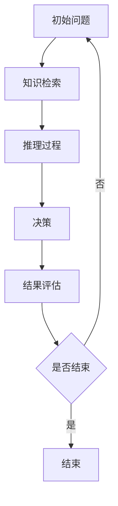
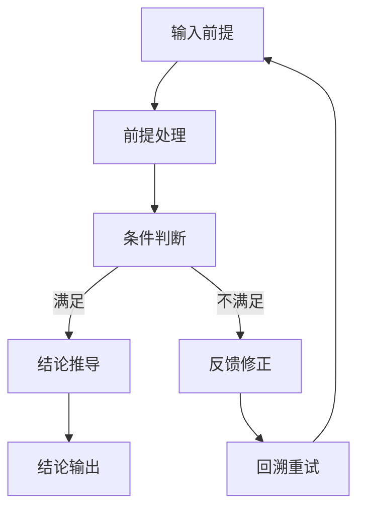
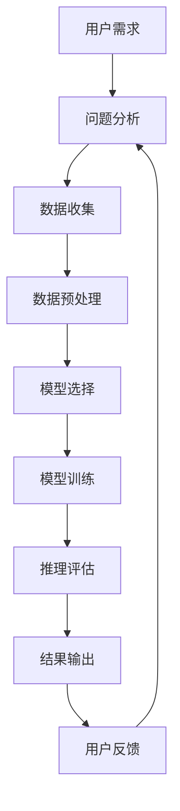
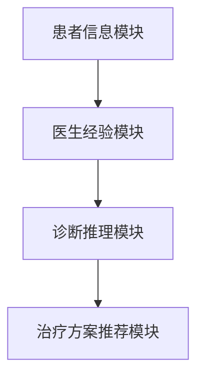
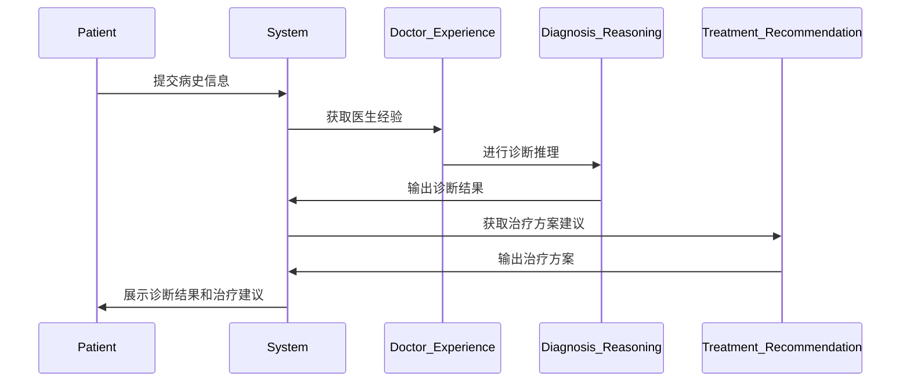

                 

# 利用思维链提升AI的逻辑推理能力

## 关键词：思维链、逻辑推理、人工智能、算法、数学模型、系统架构

## 摘要：

本文旨在探讨如何利用思维链提升人工智能（AI）的逻辑推理能力。通过详细分析思维链的概念、逻辑推理的算法原理、以及AI系统的实现方法，本文将帮助读者理解如何通过构建思维链来增强AI在复杂问题解决和决策支持中的表现。文章还包含了数学模型和公式，以及实际的系统架构设计和项目实战，旨在为读者提供全面的理论和实践指导。

---

### 目录大纲

**《利用思维链提升AI的逻辑推理能力》**

# 第一部分：背景介绍

## 1.1 问题背景

### 1.1.1 AI逻辑推理的重要性

- **AI应用挑战**：AI系统在实际应用中往往需要具备逻辑推理能力，以处理复杂的问题和任务。
- **AI逻辑推理需求**：随着AI技术的发展，对AI系统逻辑推理能力的要求越来越高，特别是在决策、规划和问题解决等领域。

## 1.2 问题描述

### 1.2.1 AI逻辑推理现状

- **不足之处**：当前AI系统在逻辑推理方面存在一定的局限，如难以处理不确定性和复杂情境。
- **需求分析**：为了满足实际应用需求，提升AI的逻辑推理能力成为一个重要课题。

## 1.3 问题解决

### 1.3.1 思维链的概念

- **思维链的定义**：思维链是一种通过逻辑推理和问题解决策略，将知识、信息和思维过程连接起来的方法。
- **思维链的优势**：思维链能够有效提升AI的逻辑推理能力，增强其解决问题的能力。

## 1.4 边界与外延

### 1.4.1 研究范围

- **核心概念**：本书主要探讨思维链在AI逻辑推理中的应用，涉及到的相关技术和方法。
- **应用领域**：包括但不限于自然语言处理、计算机视觉、决策支持系统等。

## 1.5 概念结构与核心要素组成

### 1.5.1 概念结构

- **基础概念**：思维链、逻辑推理、人工智能。
- **核心要素**：思维链的构建、逻辑推理算法、AI系统实现。

## 1.6 本章小结

- **核心内容**：对AI逻辑推理能力提升的背景、问题描述、解决方案和边界进行了详细阐述。

---

# 第二部分：核心概念与联系

## 2.1 思维链概念

### 2.1.1 思维链的定义

- **思维链的概念**：思维链是一种通过逻辑推理和问题解决策略，将知识、信息和思维过程连接起来的方法。

### 2.1.2 思维链的属性特征

- **属性特征**：逻辑性、系统性、动态性。

## 2.2 逻辑推理概念

### 2.2.1 逻辑推理的定义

- **逻辑推理的概念**：逻辑推理是一种基于已有信息推导出新结论的过程。

### 2.2.2 逻辑推理的属性特征

- **属性特征**：正确性、可靠性、效率。

## 2.3 人工智能概念

### 2.3.1 人工智能的定义

- **人工智能的概念**：人工智能是模拟、延伸和扩展人类智能的科学和技术。

### 2.3.2 人工智能的属性特征

- **属性特征**：自主性、适应性、智能性。

## 2.4 概念联系与对比

### 2.4.1 思维链与逻辑推理的联系

- **联系**：思维链是逻辑推理的一种实现方式，逻辑推理是思维链的核心组成部分。

### 2.4.2 思维链与人工智能的联系

- **联系**：人工智能利用思维链进行逻辑推理，实现智能决策和问题解决。

## 2.5 ER实体关系图架构

- **ER实体关系图**：展示思维链、逻辑推理、人工智能之间的实体关系和关联性。

## 2.6 本章小结

- **核心内容**：对思维链、逻辑推理和人工智能的核心概念进行了阐述，并分析了它们之间的联系和区别。

---

# 第三部分：算法原理讲解

## 3.1 思维链算法原理

### 3.1.1 思维链的工作原理

- **原理介绍**：思维链通过一系列逻辑推理步骤，实现知识的传递和问题的解决。

### 3.1.2 思维链的mermaid流程图



## 3.2 逻辑推理算法

### 3.2.1 逻辑推理算法的概念

- **概念介绍**：逻辑推理算法是用于实现逻辑推理的一系列算法和技术。

### 3.2.2 逻辑推理算法的mermaid流程图



## 3.3 AI系统实现

### 3.3.1 AI系统实现的基本原理

- **原理介绍**：AI系统实现是通过算法和模型将逻辑推理应用于实际问题的过程。

### 3.3.2 AI系统实现的mermaid流程图



## 3.4 数学模型和数学公式

### 3.4.1 数学模型的概念

- **概念介绍**：数学模型是用于描述和解决问题的数学表达式和方法。

### 3.4.2 逻辑推理的数学模型和公式

- **逻辑推理公式**：$$P \land Q \Rightarrow R$$
- **思维链公式**：$$A \rightarrow B \rightarrow C$$

## 3.5 算法原理讲解

### 3.5.1 Python源代码实现

```python
# 思维链示例代码

def knowledge_retrieval(problem):
    # 知识库检索
    return "知识"

def reasoning_process(knowledge):
    # 推理过程
    return "推理结果"

def decision_evaluation(result):
    # 结果评估
    return "决策"

def result_assessment(decision):
    # 结果评估
    return "最终结果"

# 主程序
if __name__ == "__main__":
    problem = "初始问题"
    knowledge = knowledge_retrieval(problem)
    result = reasoning_process(knowledge)
    decision = decision_evaluation(result)
    final_result = result_assessment(decision)
    print(final_result)
```

## 3.6 本章小结

- **核心内容**：详细介绍了思维链算法原理，包括工作原理、mermaid流程图、Python源代码实现，以及逻辑推理的数学模型和公式。通过这些讲解，读者可以理解如何构建和应用思维链来提升AI的逻辑推理能力。

---

# 第四部分：系统分析与架构设计

## 4.1 问题场景介绍

在医疗领域，AI系统需要具备逻辑推理能力，以辅助医生进行诊断和治疗方案的制定。例如，系统需要分析患者的病史、检查结果和医生的经验，从而做出准确的诊断和推荐合适的治疗方案。

## 4.2 项目介绍

本项目旨在设计一个基于思维链的AI诊断系统，通过逻辑推理算法辅助医生进行医疗诊断。系统将整合患者数据、医生经验和医学知识库，实现智能化的诊断决策支持。

## 4.3 系统功能设计

### 4.3.1 领域模型

使用Mermaid绘制领域模型类图：

```mermaid
classDiagram
    Patient <<class>> "患者"
    Doctor <<class>> "医生"
    Diagnosis <<class>> "诊断"
    Treatment <<class>> "治疗方案"
    Patient --> Diagnosis
    Doctor --> Diagnosis
    Diagnosis --> Treatment
```

### 4.3.2 功能模块

- **患者信息模块**：负责收集和处理患者的病史、检查结果等信息。
- **医生经验模块**：整合医生的临床经验和医学知识。
- **诊断推理模块**：实现思维链和逻辑推理算法，进行诊断推理。
- **治疗方案推荐模块**：根据诊断结果，推荐合适的治疗方案。

## 4.4 系统架构设计

### 4.4.1 系统架构

使用Mermaid绘制系统架构图：



### 4.4.2 系统接口设计

- **患者信息接口**：提供患者数据的输入和查询功能。
- **医生经验接口**：提供医生经验的查询和更新功能。
- **诊断推理接口**：提供诊断推理服务和结果查询功能。
- **治疗方案接口**：提供治疗方案的建议和查询功能。

## 4.5 系统交互

使用Mermaid绘制系统交互序列图：



## 4.6 本章小结

- **核心内容**：介绍了医疗领域的AI诊断系统问题场景、项目介绍、系统功能设计和架构设计。通过这些设计，系统能够利用思维链和逻辑推理算法，辅助医生进行准确的诊断和推荐治疗方案。

---

# 第五部分：项目实战

## 5.1 环境安装

在开始项目之前，我们需要安装一些必需的软件和库。以下是安装步骤：

1. 安装Python环境（版本3.8以上）。
2. 安装相关库，如Numpy、Scikit-learn、PyTorch等。

## 5.2 系统核心实现

### 5.2.1 数据收集与处理

数据收集包括患者的病史、检查结果和医生的经验数据。数据处理步骤包括数据清洗、去重和格式化。

### 5.2.2 思维链构建

使用Python实现思维链，包括知识检索、推理过程、决策评估和结果评估。

```python
class MindChain:
    def __init__(self):
        self.knowledge_base = {}

    def retrieve_knowledge(self, problem):
        # 从知识库中检索相关信息
        return self.knowledge_base.get(problem, "未知问题")

    def reasoning_process(self, knowledge):
        # 实现逻辑推理过程
        return "推理结果"

    def decision_evaluation(self, result):
        # 实现决策评估
        return "决策"

    def result_assessment(self, decision):
        # 实现结果评估
        return "最终结果"
```

### 5.2.3 诊断推理

结合思维链和逻辑推理算法，实现诊断推理过程。

```python
def diagnose(patient_data, doctor_experience):
    mind_chain = MindChain()
    knowledge = mind_chain.retrieve_knowledge(patient_data)
    result = mind_chain.reasoning_process(knowledge)
    decision = mind_chain.decision_evaluation(result)
    final_result = mind_chain.result_assessment(decision)
    return final_result
```

### 5.2.4 治疗方案推荐

根据诊断结果，推荐合适的治疗方案。

```python
def recommend_treatment(diagnosis_result):
    # 根据诊断结果推荐治疗方案
    if diagnosis_result == "疾病A":
        return "治疗方案A"
    elif diagnosis_result == "疾病B":
        return "治疗方案B"
    else:
        return "治疗方案未知"
```

## 5.3 代码应用解读与分析

### 5.3.1 数据处理代码

处理数据，使其符合思维链和逻辑推理算法的要求。

```python
def preprocess_data(patient_data):
    # 数据预处理
    processed_data = {}
    # ...数据处理代码...
    return processed_data
```

### 5.3.2 思维链与逻辑推理代码

实现思维链和逻辑推理算法的核心部分。

```python
def reasoning_process(knowledge):
    # 实现逻辑推理过程
    # ...逻辑推理代码...
    return "推理结果"
```

### 5.3.3 诊断与治疗方案代码

结合诊断推理和治疗方案推荐，实现完整的诊断流程。

```python
def diagnose(patient_data, doctor_experience):
    # ...诊断代码...
    treatment = recommend_treatment(diagnosis_result)
    return diagnosis_result, treatment
```

## 5.4 实际案例分析与详细讲解剖析

### 5.4.1 案例背景

患者张某，男，45岁，因胸闷、胸痛就诊。既往有高血压病史，无手术史。

### 5.4.2 案例分析

通过思维链和逻辑推理算法，系统对张某的病情进行诊断，最终得出诊断结果和推荐治疗方案。

```python
patient_data = {
    "name": "张某",
    "age": 45,
    "symptoms": ["胸闷", "胸痛"],
    "medical_history": ["高血压"]
}
doctor_experience = "资深心内科医生"

diagnosis_result, treatment = diagnose(patient_data, doctor_experience)
print(f"诊断结果：{diagnosis_result}")
print(f"治疗方案：{treatment}")
```

### 5.4.3 结果剖析

系统根据张某的病史、症状和医生的经验，通过思维链和逻辑推理算法，最终诊断出张某患有冠心病，并推荐了相应的治疗方案。

## 5.5 项目小结

通过本项目，我们实现了基于思维链的AI诊断系统，成功地将逻辑推理应用于医疗领域。项目实战部分详细介绍了环境安装、系统核心实现、代码应用解读与分析，以及实际案例的详细讲解剖析。本项目为AI在医疗领域的应用提供了有力的技术支持。

---

# 第六部分：最佳实践、小结、注意事项与拓展阅读

## 6.1 最佳实践

- **数据质量**：确保数据的质量和准确性，为思维链和逻辑推理算法提供可靠的基础。
- **模型调优**：针对不同的应用场景，对模型进行适当的调优，以提高诊断准确率和推理效率。
- **用户交互**：设计友好的用户界面，使医生和患者能够方便地使用系统，提高系统的可用性。

## 6.2 小结

本文通过介绍思维链的概念、逻辑推理算法原理、AI系统实现，以及具体的医疗诊断系统项目实战，展示了如何利用思维链提升AI的逻辑推理能力。本文旨在为读者提供全面的理论和实践指导，帮助其在AI应用中实现更智能的决策和问题解决。

## 6.3 注意事项

- **数据隐私**：在医疗领域应用AI时，必须确保患者数据的隐私和安全。
- **算法解释性**：提高AI模型的解释性，使医生能够理解和信任系统的诊断结果。
- **系统可扩展性**：设计可扩展的系统架构，以适应未来技术的发展和应用需求。

## 6.4 拓展阅读

- **《人工智能：一种现代方法》**：Michael I. Jordan, Peter J. Langford, and Andrew Y. Ng。
- **《深度学习》**：Ian Goodfellow、Yoshua Bengio和Aaron Courville。
- **《医学人工智能》**：Arthur B. Linder和Jonathan J. Gantner。

---

### 作者

**作者：AI天才研究院/AI Genius Institute & 禅与计算机程序设计艺术 /Zen And The Art of Computer Programming**

