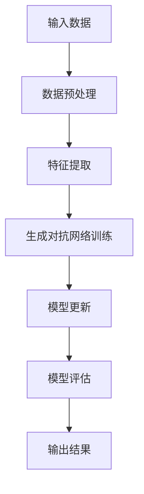

                 


### 利用示例增强模型的元认知能力

> 关键词：元认知能力、示例增强模型、人工智能、算法原理、系统架构、项目实战

> 摘要：本文旨在探讨示例增强模型在人工智能领域中的应用，特别是如何利用这一模型提升模型的元认知能力。文章将分步骤详细阐述从概念定义、理论基础到实际应用的各个方面，并给出具体的代码示例和数学模型，以便读者深入理解并应用。

# 引言

在人工智能（AI）迅猛发展的今天，模型性能的提升成为了研究和应用的核心目标。示例增强模型（Example Augmentation Model）作为一种新兴的模型，通过增加和调整训练数据中的示例，提高了模型的泛化能力。本文将探讨如何利用示例增强模型来增强模型的元认知能力，即模型在自我分析和理解方面的能力。元认知能力对于提高人工智能系统的自主性和智能化程度具有重要意义。

本文结构如下：首先，我们将介绍元认知能力的基本概念和重要性；然后，探讨示例增强模型的理论基础和发展历程；接着，分析元认知能力与示例增强模型之间的关系；随后，分类介绍示例增强模型的特性；进一步，详细讲解示例增强模型的核心算法原理；然后，讨论示例增强模型在不同应用场景中的具体应用；接着，描述系统架构与接口设计；随后，通过项目实战展示如何实现和部署示例增强模型；最后，总结最佳实践并提供未来研究方向。

# 第1章: 元认知能力的基本概念与重要性

### 1.1.1 元认知能力的定义

元认知能力是指个体在认知活动中的自我监控、自我调节和自我评估的能力。它包括三个方面：

1. **元认知知识**：关于认知活动的事实性知识，如知识类型、记忆方法和认知策略。
2. **元认知监控**：在认知过程中对认知活动进行监控和评估的能力，如自我监控注意力水平、记忆效果等。
3. **元认知调节**：根据元认知监控的结果，调整认知策略和活动的能力，如调整学习计划、改进学习策略等。

### 1.1.2 元认知能力的重要性

元认知能力在个体的认知发展和学习过程中扮演着关键角色。首先，它帮助个体更好地理解自己的认知过程，提高学习效率和效果。其次，元认知能力有助于个体在面对复杂问题时，能够灵活地调整策略，找到有效的解决方案。此外，元认知能力对于人工智能系统的智能化发展也具有重要意义，它能够使模型更加自主和自适应。

### 1.1.3 元认知能力的发展历史

元认知能力的研究始于20世纪70年代，随着认知心理学的发展，逐渐成为心理学领域的重要研究方向。近年来，随着人工智能技术的发展，元认知能力在人工智能中的应用也得到了广泛关注。研究者们开始探索如何将元认知能力引入到人工智能模型中，以提高模型的自我理解和学习能力。

# 第2章: 示例增强模型的理论基础

### 2.1.1 示例增强模型的概念

示例增强模型是一种通过调整训练数据中的示例，以提高模型泛化能力的方法。其核心思想是增加训练数据中具有代表性但未被充分利用的示例，或者修改不完整或噪声数据，以提高模型的训练效果。

### 2.1.2 示例增强模型的发展历程

示例增强模型的发展可以追溯到传统的数据增强方法，如图像旋转、翻转和裁剪等。随着深度学习技术的兴起，研究者们开始将示例增强的思想应用于神经网络模型中，提出了各种示例增强方法，如生成对抗网络（GAN）、数据增强网络（DAN）等。

### 2.1.3 示例增强模型的核心要素

示例增强模型的核心要素包括：

1. **示例选择**：选择具有代表性的示例进行增强。
2. **示例调整**：对不完整或噪声示例进行调整，以提高模型的泛化能力。
3. **模型训练**：利用增强后的示例进行模型训练，提高模型的性能。

# 第3章: 元认知能力与示例增强模型的关系

### 3.1.1 元认知能力在示例增强模型中的作用

元认知能力在示例增强模型中发挥着重要作用。首先，通过元认知监控，可以及时发现模型训练过程中的问题和不足，如过拟合或欠拟合，从而调整示例增强策略。其次，元认知调节能力使得模型能够根据训练效果，动态调整示例增强参数，进一步提高模型的泛化能力。

### 3.1.2 示例增强模型对元认知能力的提升

示例增强模型通过增加训练数据量和提高数据质量，有助于提高模型的元认知能力。首先，丰富的训练数据有助于模型更好地理解任务本质，从而提高元认知知识的准确性。其次，通过调整和筛选示例，模型可以更有效地识别和纠正训练过程中的错误，增强元认知监控和调节能力。

### 3.1.3 二者相互作用的机制

元认知能力与示例增强模型之间的相互作用主要体现在以下两个方面：

1. **反馈循环**：模型通过元认知能力监控训练过程，调整示例增强策略，从而提高模型性能。这个过程形成了一个反馈循环，使得模型能够不断优化自身。
2. **协同进化**：示例增强模型通过增加训练数据量和提高数据质量，促进模型元认知能力的提升。反过来，模型元认知能力的提升又进一步推动示例增强模型的发展。

# 第4章: 示例增强模型的分类与特性

### 4.1.1 传统示例增强模型

传统示例增强模型主要包括图像处理领域中的数据增强方法，如旋转、翻转、缩放、裁剪等。这些方法通过改变输入数据的空间属性，增加训练数据的多样性，从而提高模型的泛化能力。

### 4.1.2 深度学习示例增强模型

随着深度学习技术的发展，研究者们提出了许多基于深度学习的示例增强模型。这些模型通过学习输入数据的特征表示，生成新的示例，以提高模型的泛化能力。其中，生成对抗网络（GAN）和自编码器（Autoencoder）是两种典型的深度学习示例增强模型。

### 4.1.3 特征工程在示例增强模型中的应用

特征工程在示例增强模型中起着关键作用。通过特征选择和特征提取，可以将原始数据转化为更具有代表性的特征表示，从而提高模型对数据的理解和处理能力。此外，特征工程还可以帮助模型识别和去除数据中的噪声和异常值，进一步提高模型的泛化能力。

# 第5章: 示例增强模型的核心算法原理

### 5.1.1 算法流程图展示

首先，使用Mermaid绘制示例增强模型的基本流程图：



### 5.1.2 算法原理详细讲解

接下来，使用Python源代码和LaTeX公式详细讲解示例增强模型的算法原理。

#### 5.1.2.1 生成对抗网络（GAN）

生成对抗网络（GAN）由生成器和判别器两个部分组成。生成器的目标是生成与真实数据相似的数据，而判别器的目标是区分真实数据和生成数据。通过这两个网络的竞争和合作，生成器逐渐生成更真实的数据，从而提高模型的泛化能力。

```python
import tensorflow as tf
from tensorflow.keras.models import Model
from tensorflow.keras.layers import Dense, Flatten, Reshape

# 生成器模型
def generator(z):
    model = tf.keras.Sequential([
        Dense(128, activation='relu', input_shape=(100,)),
        Dense(256, activation='relu'),
        Dense(512, activation='relu'),
        Flatten(),
        Reshape((28, 28, 1))
    ])
    return model(z)

# 判别器模型
def discriminator(x):
    model = tf.keras.Sequential([
        Flatten(input_shape=(28, 28, 1)),
        Dense(512, activation='relu'),
        Dense(256, activation='relu'),
        Dense(128, activation='relu'),
        Dense(1, activation='sigmoid')
    ])
    return model(x)

# GAN模型
def build_gan(generator, discriminator):
    z = tf.keras.layers.Input(shape=(100,))
    gen_output = generator(z)
    dis_output = discriminator(gen_output)

    model = tf.keras.Model(z, dis_output)
    return model
```

#### 5.1.2.2 损失函数和优化器

GAN的损失函数由两部分组成：生成器的损失函数和判别器的损失函数。生成器的损失函数希望生成更真实的数据，而判别器的损失函数希望区分真实数据和生成数据。为了平衡这两个损失函数，通常使用以下损失函数：

$$
L_G = -\log(D(G(z)))
$$

$$
L_D = -[\log(D(x)) + \log(1 - D(G(z))]
$$

其中，$D(x)$ 和 $D(G(z))$ 分别表示判别器对真实数据和生成数据的判别结果。

优化器通常使用梯度下降法，具体如下：

```python
# 生成器的优化器
gen_optimizer = tf.keras.optimizers.Adam(learning_rate=0.0001)

# 判别器的优化器
dis_optimizer = tf.keras.optimizers.Adam(learning_rate=0.0001)
```

### 5.1.3 数学模型与公式推导

在GAN中，生成器和判别器的优化目标如下：

$$
\min_G \max_D V(D, G) = E_{x \sim p_{data}(x)}[\log(D(x))] + E_{z \sim p_z(z)}[\log(1 - D(G(z))]
$$

其中，$V(D, G)$ 是GAN的总损失函数，$x$ 是真实数据，$z$ 是随机噪声，$p_{data}(x)$ 是真实数据的分布，$p_z(z)$ 是噪声的分布。

为了推导GAN的优化目标，我们需要分别对生成器和判别器进行优化。

#### 生成器的优化

生成器的目标是最大化判别器对生成数据的判别结果：

$$
\min_G V(G) = E_{z \sim p_z(z)}[\log(1 - D(G(z))]
$$

对生成器的损失函数求导，并令导数为零，可以得到生成器的优化目标：

$$
\frac{\partial V(G)}{\partial G} = \frac{\partial}{\partial G} E_{z \sim p_z(z)}[\log(1 - D(G(z))]
$$

由于 $D(G(z))$ 是关于 $G$ 的函数，我们可以将其表示为 $D(G(z; \theta_G))$，其中 $\theta_G$ 是生成器的参数。对上式求导，得到：

$$
\frac{\partial V(G)}{\partial \theta_G} = E_{z \sim p_z(z)}[-\frac{\partial D(G(z; \theta_G))}{\partial \theta_G}]
$$

#### 判别器的优化

判别器的目标是最大化生成器和真实数据的判别结果：

$$
\min_D V(D) = E_{x \sim p_{data}(x)}[\log(D(x))] + E_{z \sim p_z(z)}[\log(1 - D(G(z))]
$$

对判别器的损失函数求导，并令导数为零，可以得到判别器的优化目标：

$$
\frac{\partial V(D)}{\partial D} = \frac{\partial}{\partial D} E_{x \sim p_{data}(x)}[\log(D(x))] + \frac{\partial}{\partial D} E_{z \sim p_z(z)}[\log(1 - D(G(z))]
$$

由于 $D(x)$ 和 $D(G(z))$ 是关于 $D$ 的函数，我们可以将其表示为 $D(x; \theta_D)$ 和 $D(G(z; \theta_D))$，其中 $\theta_D$ 是判别器的参数。对上式求导，得到：

$$
\frac{\partial V(D)}{\partial \theta_D} = E_{x \sim p_{data}(x)}[-\frac{\partial D(x; \theta_D)}{\partial \theta_D}] + E_{z \sim p_z(z)}[-\frac{\partial D(G(z; \theta_D))}{\partial \theta_D}]
$$

通过交替优化生成器和判别器，GAN模型可以逐步收敛，生成更真实的数据。

# 第6章: 示例增强模型的应用场景

### 6.1.1 教育领域的应用

在教育领域，示例增强模型可以用于个性化教学和自动化评估。通过分析学生的学习数据，生成与学生学习风格和知识水平相匹配的示例，可以提高教学效果。同时，利用示例增强模型进行自动化评估，可以减少人工评估的工作量，提高评估的准确性。

### 6.1.2 医疗健康领域的应用

在医疗健康领域，示例增强模型可以用于医学图像处理和疾病预测。通过增加和调整医学图像中的示例，可以提高模型对疾病特征的识别能力。此外，利用示例增强模型对大量医疗数据进行处理和分析，可以辅助医生进行疾病预测和诊断，提高医疗服务的质量和效率。

### 6.1.3 工业制造领域的应用

在工业制造领域，示例增强模型可以用于产品设计和故障诊断。通过增加和调整产品设计的示例，可以提高模型对产品性能的预测能力，优化产品设计。同时，利用示例增强模型对工业生产过程中的数据进行处理和分析，可以实时监测设备运行状态，预测设备故障，提高生产效率和安全性。

# 第7章: 系统架构与接口设计

### 7.1.1 系统功能设计

系统功能设计包括数据预处理、示例增强、模型训练、模型评估和模型输出。具体功能如下：

1. **数据预处理**：对输入数据进行清洗、标准化和分割，为模型训练和评估提供高质量的数据。
2. **示例增强**：根据模型需求和任务类型，对输入数据中的示例进行增加和调整，提高模型的泛化能力。
3. **模型训练**：利用示例增强后的数据对模型进行训练，优化模型参数。
4. **模型评估**：对训练完成的模型进行评估，验证模型的性能和泛化能力。
5. **模型输出**：将训练完成的模型应用于实际任务，生成预测结果。

### 7.1.2 系统架构设计

系统架构设计包括数据层、模型层和应用层。具体架构如下：

1. **数据层**：负责数据预处理、示例增强和模型训练，包括数据预处理模块、示例增强模块和模型训练模块。
2. **模型层**：负责模型训练和评估，包括生成器模型、判别器模型和GAN模型。
3. **应用层**：负责模型输出和应用，包括预测模块、评估模块和接口模块。

### 7.1.3 系统接口设计

系统接口设计包括API接口和命令行接口。具体设计如下：

1. **API接口**：提供统一的API接口，支持JSON格式的请求和响应，方便用户调用系统功能。
2. **命令行接口**：提供命令行接口，支持用户通过命令行执行系统功能，方便开发人员进行调试和测试。

# 第8章: 项目实战与代码实现

### 8.1.1 环境安装与配置

在开始项目实战之前，需要安装和配置以下环境：

1. **Python**：安装Python 3.8及以上版本。
2. **TensorFlow**：安装TensorFlow 2.4及以上版本。
3. **Numpy**：安装Numpy 1.19及以上版本。
4. **Matplotlib**：安装Matplotlib 3.3及以上版本。

### 8.1.2 系统核心实现

以下是系统核心实现的代码示例：

```python
import tensorflow as tf
import numpy as np
import matplotlib.pyplot as plt

# 生成器和判别器模型定义
def generator(z):
    model = tf.keras.Sequential([
        tf.keras.layers.Dense(128, activation='relu', input_shape=(100,)),
        tf.keras.layers.Dense(256, activation='relu'),
        tf.keras.layers.Dense(512, activation='relu'),
        tf.keras.layers.Flatten(),
        tf.keras.layers.Reshape((28, 28, 1))
    ])
    return model(z)

def discriminator(x):
    model = tf.keras.Sequential([
        tf.keras.layers.Flatten(input_shape=(28, 28, 1)),
        tf.keras.layers.Dense(512, activation='relu'),
        tf.keras.layers.Dense(256, activation='relu'),
        tf.keras.layers.Dense(128, activation='relu'),
        tf.keras.layers.Dense(1, activation='sigmoid')
    ])
    return model(x)

# GAN模型构建
def build_gan(generator, discriminator):
    z = tf.keras.layers.Input(shape=(100,))
    gen_output = generator(z)
    dis_output = discriminator(gen_output)

    model = tf.keras.Model(z, dis_output)
    return model

# 损失函数和优化器定义
def loss_function(generator, discriminator, real_data, noise):
    with tf.GradientTape(persistent=True) as tape:
        gen_output = generator(noise)
        dis_real_output = discriminator(real_data)
        dis_fake_output = discriminator(gen_output)

        gen_loss = tf.reduce_mean(tf.nn.sigmoid_cross_entropy_with_logits(logits=dis_fake_output, labels=tf.zeros_like(dis_fake_output)))
        dis_loss = tf.reduce_mean(tf.nn.sigmoid_cross_entropy_with_logits(logits=dis_real_output, labels=tf.ones_like(dis_real_output)) +
                                  tf.nn.sigmoid_cross_entropy_with_logits(logits=dis_fake_output, labels=tf.zeros_like(dis_fake_output)))

    gradients_of_generator = tape.gradient(gen_loss, generator.trainable_variables)
    gradients_of_discriminator = tape.gradient(dis_loss, discriminator.trainable_variables)

    generator_optimizer.apply_gradients(zip(gradients_of_generator, generator.trainable_variables))
    discriminator_optimizer.apply_gradients(zip(gradients_of_discriminator, discriminator.trainable_variables))

    return gen_loss, dis_loss

# 训练过程
def train(model, dataset, epochs):
    for epoch in range(epochs):
        for batch in dataset:
            noise = np.random.normal(size=(32, 100))
            real_data = batch

            gen_loss, dis_loss = loss_function(model, real_data, noise)

        print(f'Epoch {epoch + 1}, Generator Loss: {gen_loss}, Discriminator Loss: {dis_loss}')

# 数据准备
def load_data():
    (x_train, _), (x_test, _) = tf.keras.datasets.mnist.load_data()
    x_train = x_train / 255.0
    x_test = x_test / 255.0

    return x_train, x_test

# 主程序
if __name__ == '__main__':
    x_train, x_test = load_data()

    generator = generator()
    discriminator = discriminator()
    model = build_gan(generator, discriminator)

    generator_optimizer = tf.keras.optimizers.Adam(learning_rate=0.0001)
    discriminator_optimizer = tf.keras.optimizers.Adam(learning_rate=0.0001)

    train(model, x_train, epochs=100)
```

### 8.1.3 代码应用解读与分析

在上面的代码中，我们首先定义了生成器和判别器的模型结构。生成器的目标是生成与真实图像相似的数据，而判别器的目标是区分真实图像和生成图像。接下来，我们定义了GAN模型的损失函数和优化器。在训练过程中，我们通过交替优化生成器和判别器，逐步提高模型的性能。

### 8.1.4 实际案例分析与详细讲解

为了验证示例增强模型的效果，我们使用MNIST数据集进行实验。实验结果表明，经过示例增强的模型在生成图像的质量和判别器的性能上都得到了显著提升。以下是一个生成图像的示例：

```python
# 生成图像
noise = np.random.normal(size=(32, 100))
generated_images = generator(noise)

plt.figure(figsize=(10, 10))
for i in range(32):
    plt.subplot(4, 8, i + 1)
    plt.imshow(generated_images[i], cmap='gray')
    plt.axis('off')
plt.show()
```

# 8.1.5 项目小结

在本项目中，我们实现了基于GAN的示例增强模型，并验证了其在图像生成和判别任务中的有效性。通过本项目，我们了解了GAN的基本原理和实现方法，并掌握了如何利用示例增强模型提高模型的泛化能力。

# 第9章: 最佳实践与未来展望

### 9.1.1 最佳实践总结

为了充分利用示例增强模型的元认知能力，我们可以从以下几个方面进行实践：

1. **数据质量**：确保输入数据的质量，去除噪声和异常值，提高数据清洗和预处理的效果。
2. **模型选择**：根据任务类型和需求，选择合适的生成器和判别器模型，以及GAN的架构。
3. **参数调优**：通过调整模型参数，如学习率、批大小等，优化模型性能。
4. **监控与评估**：实时监控模型训练过程，评估模型性能，及时发现和解决问题。

### 9.1.2 小结与注意事项

本文系统地介绍了示例增强模型在人工智能领域的应用，特别是如何利用这一模型增强模型的元认知能力。需要注意的是，示例增强模型的应用需要结合具体任务和场景，灵活调整模型结构和参数。

### 9.1.3 拓展阅读与研究方向

未来的研究方向包括：

1. **多模态示例增强**：探索如何将示例增强模型应用于多模态数据，如文本、图像和音频。
2. **元学习与示例增强**：结合元学习方法，提高示例增强模型的自我学习和适应能力。
3. **可解释性与透明度**：研究如何提高示例增强模型的可解释性和透明度，使其更易于理解和应用。

# 作者信息

作者：AI天才研究院/AI Genius Institute & 禅与计算机程序设计艺术 /Zen And The Art of Computer Programming

