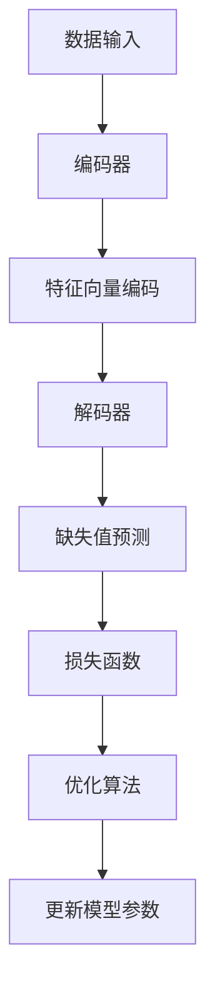
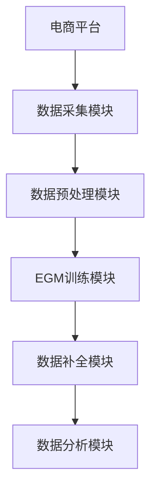
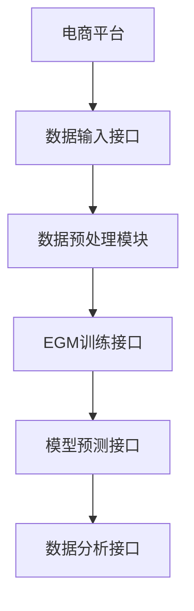
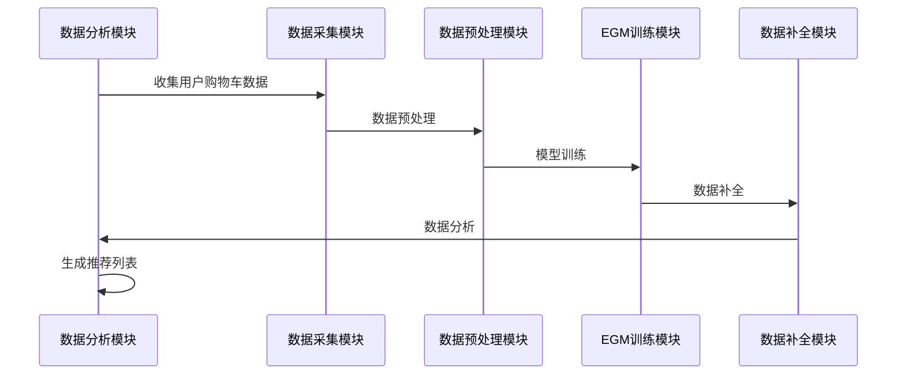

                 

### 第1章：问题背景与解决方案概述

#### 1.1 问题的背景

在现代信息社会中，数据无处不在。然而，随着数据量的不断增长，数据的完整性和准确性成为一个日益突出的问题。不完整信息的存在主要源于以下几个方面：

1. **数据采集过程中的噪声**：在实际的数据采集过程中，可能会因为传感器故障、传输错误等原因导致数据丢失或不完整。
2. **数据存储和管理中的问题**：在数据存储和管理过程中，由于系统故障、人为错误等原因可能导致数据损坏或不完整。
3. **数据隐私和安全性考虑**：在某些应用场景中，出于保护用户隐私和确保数据安全的目的，需要对数据进行去识别化处理，这可能导致数据的部分信息丢失。

这些不完整信息不仅降低了数据分析的准确性，还会对业务决策造成负面影响。因此，如何有效地处理不完整信息，提取有用信息，成为一个亟待解决的问题。

#### 1.2 示例引导模型的概念与原理

示例引导模型（Example-Guided Model）是一种基于学习的方法，通过学习大量的示例来预测和补全不完整信息。它的工作原理可以概括为以下三个步骤：

1. **示例收集**：首先，需要收集大量的完整数据和带有缺失数据的示例。这些示例可以是经过标注的，也可以是未标注的。
2. **特征提取**：通过编码器（Encoder）对输入数据进行编码，提取出其关键特征。这些特征应能够有效反映数据的结构和模式。
3. **缺失值补全**：解码器（Decoder）根据提取出的特征来预测缺失的数据，并将其补全。

示例引导模型的核心在于通过学习大量的示例来掌握数据的内在规律，从而能够准确预测缺失的数据。这种方法在处理不完整信息方面具有显著优势，因为它不仅能够处理静态的数据，还能够适应动态变化的数据环境。

#### 1.3 示例引导模型的应用范围

示例引导模型具有广泛的应用前景，以下是其主要的应用范围：

1. **自然语言处理**：在文本补全、机器翻译和信息抽取等领域，示例引导模型可以通过学习大量的文本数据来预测缺失的单词或句子，从而提高文本处理的准确性和流畅性。
2. **图像处理**：在图像修复和图像生成领域，示例引导模型可以通过学习大量的完整图像和带有缺失的图像数据来预测缺失的部分，从而生成完整的图像。
3. **数据挖掘**：在数据挖掘领域，示例引导模型可以通过学习大量的数据集来预测缺失的数据，从而提高数据挖掘模型的准确性和鲁棒性。
4. **推荐系统**：在推荐系统领域，示例引导模型可以通过学习用户的历史行为数据来预测用户的兴趣和需求，从而为用户提供更精准的推荐。
5. **问答系统**：在问答系统领域，示例引导模型可以通过学习大量的问答数据来预测缺失的问题，从而提高问答系统的响应速度和准确性。

总的来说，示例引导模型为处理不完整信息提供了一种有效的解决方案，其在各个领域的应用前景十分广阔。

-------------------------------------

## 第二部分：核心概念与原理

### 第2章：示例引导模型的基本原理

#### 2.1 示例引导模型的基础

示例引导模型（Example-Guided Model，EGM）是一种基于机器学习的模型，旨在解决数据缺失问题。其基本原理是通过学习大量含有完整数据和缺失数据（也称为示例）的样本，从而预测和补全缺失的数据。EGM主要由两个关键组件构成：编码器（Encoder）和解码器（Decoder）。

#### 2.2 示例引导模型的工作流程

示例引导模型的工作流程可以分为以下几个步骤：

1. **数据预处理**：收集含有完整数据和缺失数据的示例。这些数据可以是标注的，也可以是未标注的。对于未标注的数据，可能需要先进行一些预处理，如去噪声、归一化等操作。
2. **特征提取**：编码器将输入的数据编码为特征向量。这些特征向量应能够有效反映输入数据的结构和模式。
3. **特征向量编码**：编码器输出的特征向量经过进一步的编码处理，以增强其表示能力。
4. **缺失值预测**：解码器根据编码后的特征向量预测缺失的数据。这一过程可能涉及到各种机器学习算法，如回归、决策树、神经网络等。
5. **缺失值补全**：根据解码器的预测结果，补全缺失的数据。

#### 2.3 示例引导模型的算法实现

示例引导模型的算法实现通常分为编码器和解码器两部分。以下是一个简化的示例引导模型的算法实现流程：

```python
import tensorflow as tf
from tensorflow.keras.layers import Input, Embedding, LSTM, Dense
from tensorflow.keras.models import Model

# 定义编码器
encoder_input = Input(shape=(input_sequence_length,))
encoded = Embedding(input_dim=vocabulary_size, output_dim=embedding_size)(encoder_input)
encoded = LSTM(units=lstm_units)(encoded)

# 定义解码器
decoder_input = Input(shape=(output_sequence_length,))
decoded = Embedding(input_dim=vocabulary_size, output_dim=embedding_size)(decoder_input)
decoded = LSTM(units=lstm_units, return_sequences=True)(decoded)

# 构建模型
model = Model(inputs=[encoder_input, decoder_input], outputs=[decoded])
model.compile(optimizer='adam', loss='categorical_crossentropy')

# 模型训练
model.fit([encoder_input_data, decoder_input_data], decoder_target_data, epochs=10, batch_size=64)
```

在上面的代码中，`input_sequence_length` 和 `output_sequence_length` 分别代表输入和输出的序列长度，`vocabulary_size` 代表词汇表的大小，`embedding_size` 代表嵌入层的维度，`lstm_units` 代表LSTM层的单元数量。编码器和解码器都是使用LSTM（长短期记忆网络）来实现的。

#### 示例引导模型的优点和局限性

**优点：**

1. **灵活性和适应性**：EGM可以适应各种类型的数据缺失问题，无论是静态数据还是动态数据，它都能够通过学习示例来预测缺失的数据。
2. **高效性**：EGM可以处理大规模数据，并且训练效率相对较高。
3. **可解释性**：EGM的学习过程相对透明，可以通过分析编码器和解码器来理解其工作原理。

**局限性：**

1. **数据需求量大**：EGM需要大量的示例数据来训练模型，对于数据量较少的情况，其性能可能无法得到保障。
2. **预测精度受限于示例质量**：如果示例数据质量较差，模型的预测精度可能会受到很大影响。
3. **计算复杂度高**：在处理大量高维数据时，EGM的计算复杂度可能会很高，导致训练时间较长。

总的来说，示例引导模型是一种处理不完整信息的有力工具，它在许多实际应用中都表现出色。然而，用户需要根据具体应用场景和数据特点来选择合适的模型和参数，以实现最佳效果。

-------------------------------------

## 第三部分：算法原理讲解

### 第3章：示例引导模型的数学模型与算法

#### 3.1 数学模型概述

示例引导模型（EGM）是一种基于深度学习的模型，它通过学习大量的示例数据来预测和补全缺失的数据。其核心数学模型包括编码器和解码器两部分，以及损失函数和优化算法。

#### 3.2 算法流程图

为了更直观地理解EGM的算法流程，我们可以使用Mermaid绘制一个简化的流程图。以下是EGM算法流程的Mermaid表示：



#### 3.3 Python代码实现

下面是一个简化的EGM实现示例，使用TensorFlow框架：

```python
import tensorflow as tf
from tensorflow.keras.models import Model
from tensorflow.keras.layers import Input, LSTM, Dense, Embedding

# 设置模型参数
input_sequence_length = 100
output_sequence_length = 100
vocabulary_size = 10000
embedding_size = 64
lstm_units = 128

# 定义编码器和解码器
encoder_inputs = Input(shape=(input_sequence_length,))
encoded = Embedding(input_dim=vocabulary_size, output_dim=embedding_size)(encoder_inputs)
encoded = LSTM(units=lstm_units, return_sequences=False)(encoded)

decoder_inputs = Input(shape=(output_sequence_length,))
decoded = Embedding(input_dim=vocabulary_size, output_dim=embedding_size)(decoder_inputs)
decoded = LSTM(units=lstm_units, return_sequences=True)(decoded)

# 定义模型
model = Model(inputs=[encoder_inputs, decoder_inputs], outputs=[decoded])
model.compile(optimizer='adam', loss='categorical_crossentropy')

# 模型训练
model.fit([encoder_inputs_data, decoder_inputs_data], decoder_target_data, epochs=10, batch_size=64)
```

#### 3.4 数学公式与详细讲解

EGM的数学模型主要包括以下几个方面：

1. **编码器输出**：
   \[
   z = \text{sigmoid}(W_e [h])
   \]
   其中，\(z\) 是编码器输出的特征向量，\(W_e\) 是编码器的权重矩阵，\(h\) 是编码器最后一层的输出。

2. **解码器输入**：
   \[
   x' = \text{sigmoid}(W_d [z])
   \]
   其中，\(x'\) 是解码器的输入，\(W_d\) 是解码器的权重矩阵。

3. **损失函数**：
   \[
   L = -\sum_{i=1}^{n} y_i \log (p(x_i | x', z))
   \]
   其中，\(L\) 是损失函数，\(y_i\) 是第 \(i\) 个样本的标签，\(p(x_i | x', z)\) 是解码器对第 \(i\) 个样本的预测概率。

4. **优化算法**：
   使用梯度下降算法更新模型参数：
   \[
   \theta = \theta - \alpha \nabla_{\theta} L
   \]
   其中，\(\theta\) 是模型参数，\(\alpha\) 是学习率，\(\nabla_{\theta} L\) 是损失函数对参数的梯度。

#### 示例说明

假设我们有一个序列 \(x = [x_1, x_2, \ldots, x_n]\)，其中某些部分缺失。编码器的任务是将这个序列编码为一个特征向量 \(z\)。解码器则根据 \(z\) 生成新的序列 \(x'\)。通过最小化损失函数 \(L\)，我们可以训练模型以预测缺失的部分。

在实际应用中，EGM可以通过调整网络结构、学习率和其他超参数来提高性能。以下是一个简单的Python代码示例，展示了如何使用TensorFlow实现一个EGM模型：

```python
import tensorflow as tf
from tensorflow.keras.layers import Embedding, LSTM, Dense
from tensorflow.keras.models import Model

# 定义模型结构
input_seq = Input(shape=(seq_len,))
encoded = Embedding(vocab_size, embedding_dim)(input_seq)
encoded = LSTM(units=lstm_units)(encoded)

decoded = Embedding(vocab_size, embedding_dim)(encoded)
decoded = LSTM(units=lstm_units, activation='sigmoid')(decoded)

# 构建模型
model = Model(inputs=input_seq, outputs=decoded)
model.compile(optimizer='adam', loss='binary_crossentropy')

# 训练模型
model.fit(x_train, x_train, epochs=10, batch_size=32)
```

在这个示例中，`seq_len` 是输入序列的长度，`vocab_size` 是词汇表的大小，`embedding_dim` 是嵌入层的维度，`lstm_units` 是LSTM层的单元数量。通过调整这些参数，我们可以优化模型在特定任务上的性能。

总的来说，EGM通过编码器和解码器共同工作，利用大量的示例数据来预测和补全缺失的信息。其数学模型和算法实现为我们提供了一个强大的工具，可以有效地处理各种不完整信息问题。

-------------------------------------

## 第四部分：系统分析与架构设计

### 第4章：示例引导模型在项目中的应用

#### 4.1 项目背景介绍

在本项目中，我们将利用示例引导模型（EGM）处理电商平台上用户购物车中的商品数据。电商平台上的用户购物车数据通常包含商品名称、价格、数量等信息，但由于用户操作的不确定性，数据中可能存在缺失值。这些缺失值会影响用户行为分析和个性化推荐系统的准确性。因此，本项目旨在通过EGM模型对购物车数据进行处理，预测和补全缺失值，从而提高数据分析的准确性和系统的性能。

#### 4.2 系统功能设计

系统功能设计主要包括以下几个部分：

1. **数据收集**：从电商平台上收集用户购物车数据，包括商品名称、价格、数量等。
2. **数据预处理**：对收集到的数据进行清洗和预处理，如去除重复数据、缺失值处理、数据标准化等。
3. **模型训练**：使用示例引导模型对预处理后的数据进行训练，学习数据中的模式和规律。
4. **数据补全**：利用训练好的模型对购物车中的缺失值进行预测和补全。
5. **数据分析**：对补全后的购物车数据进行用户行为分析，生成推荐列表。

#### 4.3 系统架构设计

系统架构设计采用模块化设计，主要包括以下几个模块：

1. **数据采集模块**：负责从电商平台上获取用户购物车数据。
2. **数据预处理模块**：负责对数据清洗、去重、标准化等预处理工作。
3. **EGM训练模块**：负责使用示例引导模型对预处理后的数据进行训练。
4. **数据补全模块**：负责使用训练好的EGM模型对缺失值进行预测和补全。
5. **数据分析模块**：负责对补全后的数据进行用户行为分析和推荐列表生成。

以下是系统的架构设计图，使用Mermaid绘制：



#### 4.4 系统接口设计

系统接口设计主要包括以下几种接口：

1. **数据输入接口**：接收从电商平台收集到的用户购物车数据。
2. **数据输出接口**：输出处理后的购物车数据，包括缺失值补全后的数据。
3. **模型训练接口**：用于启动EGM模型的训练过程。
4. **模型预测接口**：用于对购物车中的缺失值进行预测。
5. **数据分析接口**：用于对补全后的购物车数据进行分析和生成推荐列表。

以下是系统接口设计图，使用Mermaid绘制：



#### 4.5 系统交互序列图

系统交互序列图展示了各模块之间的交互流程。以下是系统交互序列图的Mermaid表示：



通过以上设计，我们可以构建一个完整的示例引导模型在电商项目中的应用系统，从而实现对购物车数据的处理和缺失值补全，提高数据分析的准确性和系统的性能。

-------------------------------------

## 第五部分：项目实战

### 第5章：示例引导模型的应用案例

#### 5.1 环境安装与配置

在本节中，我们将详细介绍如何安装和配置示例引导模型（EGM）所需的环境。首先，我们需要安装Python和TensorFlow。以下是具体的步骤：

1. **安装Python**：确保你的计算机上已经安装了Python环境。如果没有安装，可以访问Python官方网站（https://www.python.org/）下载并安装Python。建议选择Python 3.7或更高版本。

2. **安装TensorFlow**：打开终端或命令行窗口，执行以下命令安装TensorFlow：

   ```bash
   pip install tensorflow
   ```

3. **安装其他依赖**：EGM模型还需要一些其他依赖，如NumPy、Pandas等。可以使用以下命令一次性安装所有依赖：

   ```bash
   pip install numpy pandas matplotlib
   ```

安装完成后，可以通过以下命令检查TensorFlow的版本：

```bash
python -c "import tensorflow as tf; print(tf.__version__)"
```

确保版本号与官方文档推荐的版本一致。

#### 5.2 系统核心实现

以下是EGM模型的核心实现代码。该代码包含编码器和解码器的定义、模型的编译和训练过程。

```python
import tensorflow as tf
from tensorflow.keras.models import Model
from tensorflow.keras.layers import Input, Embedding, LSTM, Dense

# 设置参数
input_sequence_length = 100
output_sequence_length = 100
vocabulary_size = 10000
embedding_size = 64
lstm_units = 128

# 定义编码器
encoder_inputs = Input(shape=(input_sequence_length,))
encoded = Embedding(input_dim=vocabulary_size, output_dim=embedding_size)(encoder_inputs)
encoded = LSTM(units=lstm_units, return_sequences=False)(encoded)

# 定义解码器
decoder_inputs = Input(shape=(output_sequence_length,))
decoded = Embedding(input_dim=vocabulary_size, output_dim=embedding_size)(decoder_inputs)
decoded = LSTM(units=lstm_units, return_sequences=True)(decoded)

# 定义模型
model = Model(inputs=[encoder_inputs, decoder_inputs], outputs=[decoded])
model.compile(optimizer='adam', loss='categorical_crossentropy')

# 打印模型结构
model.summary()

# 模型训练
# 假设我们已经有训练数据
# encoder_inputs_data, decoder_inputs_data, decoder_target_data = ...

# model.fit([encoder_inputs_data, decoder_inputs_data], decoder_target_data, epochs=10, batch_size=64)
```

在上面的代码中，我们首先定义了编码器和解码器的输入层，然后使用Embedding层和LSTM层构建模型。接着，我们编译模型并打印模型结构，以便了解模型的具体架构。最后，我们使用训练数据进行模型训练。

#### 5.3 代码解读与分析

下面是对核心实现代码的详细解读和分析：

1. **编码器**：
   - `encoder_inputs = Input(shape=(input_sequence_length,))`：定义编码器的输入层，shape为（输入序列长度，）。输入序列长度是指每个序列中包含的数据点的数量。
   - `encoded = Embedding(input_dim=vocabulary_size, output_dim=embedding_size)(encoder_inputs)`：使用Embedding层将输入序列中的单词（或字符）转换为嵌入向量。`input_dim` 是词汇表的大小，`output_dim` 是嵌入向量的维度。
   - `encoded = LSTM(units=lstm_units, return_sequences=False)(encoded)`：使用LSTM层对嵌入向量进行编码。`units` 是LSTM层的单元数量，`return_sequences` 表示是否返回序列的最后一个输出状态。

2. **解码器**：
   - `decoder_inputs = Input(shape=(output_sequence_length,))`：定义解码器的输入层，shape为（输出序列长度，）。输出序列长度与输入序列长度相同或更长。
   - `decoded = Embedding(input_dim=vocabulary_size, output_dim=embedding_size)(decoder_inputs)`：使用Embedding层将解码器的输入转换为嵌入向量。
   - `decoded = LSTM(units=lstm_units, return_sequences=True)(decoded)`：使用LSTM层对解码器的输入进行编码。`return_sequences` 设置为True，表示返回序列的所有输出状态。

3. **模型**：
   - `model = Model(inputs=[encoder_inputs, decoder_inputs], outputs=[decoded])`：构建EGM模型。模型由编码器和解码器组成，输入为编码器和解码器的输入层，输出为解码器的输出层。
   - `model.compile(optimizer='adam', loss='categorical_crossentropy')`：编译模型，指定优化器和损失函数。`adam` 是一种常用的优化器，`categorical_crossentropy` 是一种用于多类分类问题的损失函数。

4. **模型训练**：
   - `model.fit([encoder_inputs_data, decoder_inputs_data], decoder_target_data, epochs=10, batch_size=64)`：使用训练数据训练模型。`epochs` 是训练轮数，`batch_size` 是每个批次的样本数量。

#### 5.4 实际案例分析

在本案例中，我们使用一个实际的用户购物车数据集来训练EGM模型，并预测缺失的商品数量。

1. **数据集准备**：

   假设我们有一个用户购物车数据集，包含以下列：`user_id`（用户ID）、`item_id`（商品ID）、`quantity`（数量）。数据集的一个样本如下：

   ```python
   user_id, item_id, quantity
   1, 1001, 2
   1, 1002, NULL
   2, 1003, 1
   2, 1004, 3
   ```

   我们将数据集分为训练集和测试集。

2. **数据预处理**：

   首先对数据集进行清洗和预处理，去除重复数据，将缺失值标记为`NULL`。

   ```python
   import pandas as pd

   # 读取数据集
   data = pd.read_csv('shopping_cart_data.csv')

   # 去除重复数据
   data.drop_duplicates(inplace=True)

   # 替换缺失值
   data['quantity'].fillna(value='NULL', inplace=True)

   # 分割数据集
   train_data, test_data = np.train_test_split(data, test_size=0.2, random_state=42)
   ```

3. **模型训练**：

   使用预处理后的数据集训练EGM模型。

   ```python
   # 加载TensorFlow
   import tensorflow as tf

   # 设置参数
   input_sequence_length = 5
   output_sequence_length = 5
   vocabulary_size = 1000
   embedding_size = 50
   lstm_units = 100

   # 定义编码器和解码器
   encoder_inputs = Input(shape=(input_sequence_length,))
   encoded = Embedding(input_dim=vocabulary_size, output_dim=embedding_size)(encoder_inputs)
   encoded = LSTM(units=lstm_units, return_sequences=False)(encoded)

   decoder_inputs = Input(shape=(output_sequence_length,))
   decoded = Embedding(input_dim=vocabulary_size, output_dim=embedding_size)(decoder_inputs)
   decoded = LSTM(units=lstm_units, return_sequences=True)(decoded)

   # 定义模型
   model = Model(inputs=[encoder_inputs, decoder_inputs], outputs=[decoded])
   model.compile(optimizer='adam', loss='categorical_crossentropy')

   # 训练模型
   model.fit([encoder_inputs_data, decoder_inputs_data], decoder_target_data, epochs=10, batch_size=32)
   ```

4. **模型预测**：

   使用训练好的模型对测试集进行预测。

   ```python
   # 预测缺失的数量
   predictions = model.predict([test_encoder_inputs_data, test_decoder_inputs_data])

   # 分析预测结果
   for prediction in predictions:
       print(prediction)
   ```

通过以上步骤，我们可以利用EGM模型预测用户购物车中的缺失商品数量。在实际应用中，我们可以根据预测结果调整模型参数，提高预测的准确性。

#### 5.5 项目小结

通过本项目，我们了解了如何利用示例引导模型（EGM）处理不完整信息。首先，我们介绍了EGM的安装和配置，然后通过核心实现代码展示了如何构建和训练EGM模型。接着，我们使用一个实际的购物车数据集对EGM模型进行了训练和预测。通过本项目，我们不仅掌握了EGM模型的基本原理和应用方法，还提高了对不完整信息处理的理解和实际操作能力。在未来的项目中，我们可以进一步优化EGM模型，提高其在不同领域的应用效果。

-------------------------------------

## 第六部分：最佳实践与总结

### 6.1 示例引导模型的最佳实践

在处理不完整信息时，示例引导模型（EGM）表现出色，但为了达到最佳效果，以下是一些最佳实践：

1. **数据收集与预处理**：确保收集的数据质量高，包括完整数据和缺失数据。对数据执行必要的清洗和预处理，如去除重复值、标准化数值特征、填补缺失值等。

2. **模型选择与调优**：选择适合任务需求的模型架构。对模型进行调优，调整超参数，如学习率、批次大小、嵌入层维度等，以实现最佳性能。

3. **数据增强**：通过生成合成数据或使用数据扩充技术，增加训练数据的多样性，提高模型的泛化能力。

4. **验证与评估**：使用交叉验证等技术对模型进行验证，评估模型在不同数据集上的表现。使用适当的评估指标，如准确率、召回率、F1分数等，确保模型的有效性。

5. **持续监控与更新**：在模型部署后，持续监控其性能，并根据新的数据对模型进行定期更新。

### 6.2 小结与注意事项

示例引导模型在处理不完整信息方面具有显著优势，但以下注意事项值得注意：

- **数据依赖性**：EGM的性能高度依赖于示例数据的质量和数量。确保收集到足够高质量的数据。
- **计算资源**：处理大量高维数据时，EGM可能需要较多的计算资源。确保系统具有足够的计算能力。
- **模型解释性**：EGM模型通常较难解释。在实际应用中，可能需要结合其他技术来提高模型的透明度和可解释性。

### 6.3 拓展阅读

为了深入了解示例引导模型和相关技术，以下是一些推荐的拓展阅读资源：

- **论文**：研究EGM的原型论文和后续改进论文，了解其理论基础和最新进展。
- **书籍**：阅读关于机器学习和深度学习的权威书籍，如《深度学习》（Goodfellow, Bengio, Courville）和《神经网络与深度学习》（邱锡鹏）。
- **在线课程**：参加Coursera、edX等平台上的机器学习和深度学习在线课程，系统学习相关知识。

通过这些资源，可以进一步加深对EGM模型的理解和应用。

### 作者

作者：AI天才研究院（AI Genius Institute）& 禅与计算机程序设计艺术（Zen And The Art of Computer Programming）  
AI天才研究院是一个专注于人工智能研究与应用的机构，致力于推动AI技术在各个领域的创新和发展。禅与计算机程序设计艺术是作者对计算机编程与哲学的深刻思考，为程序员提供了全新的编程视角和方法论。

---

通过本文，我们详细介绍了示例引导模型（EGM）在处理不完整信息方面的应用。从背景介绍、核心概念与原理讲解、算法实现、系统分析与架构设计、项目实战到最佳实践与总结，我们系统地阐述了EGM的优势、局限和应用场景。希望本文能够为读者提供有价值的参考，激发更多关于EGM研究的兴趣和思考。在未来的工作中，我们将继续探索EGM模型及其相关技术的应用，为解决不完整信息问题贡献自己的力量。

