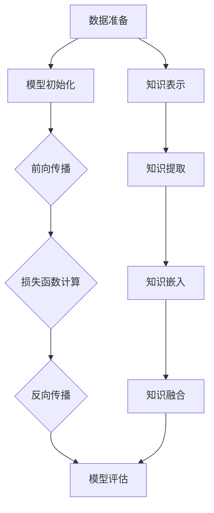
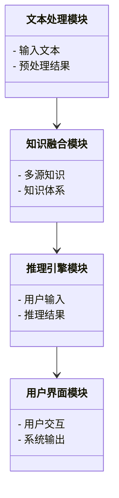
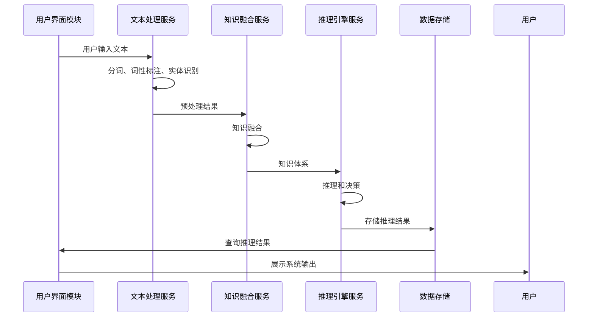
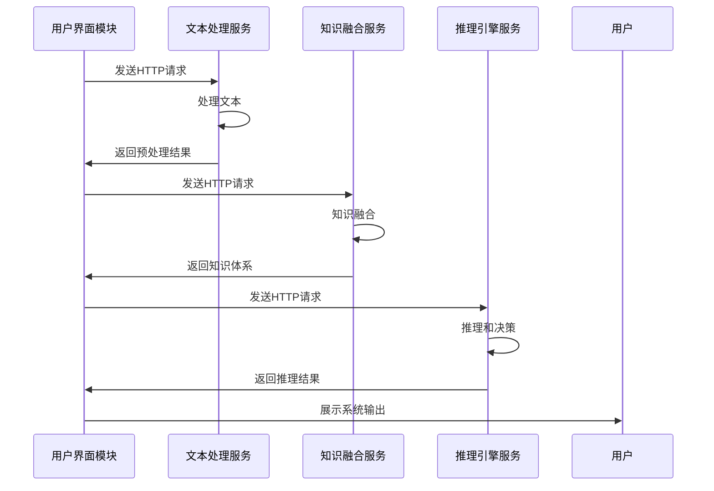
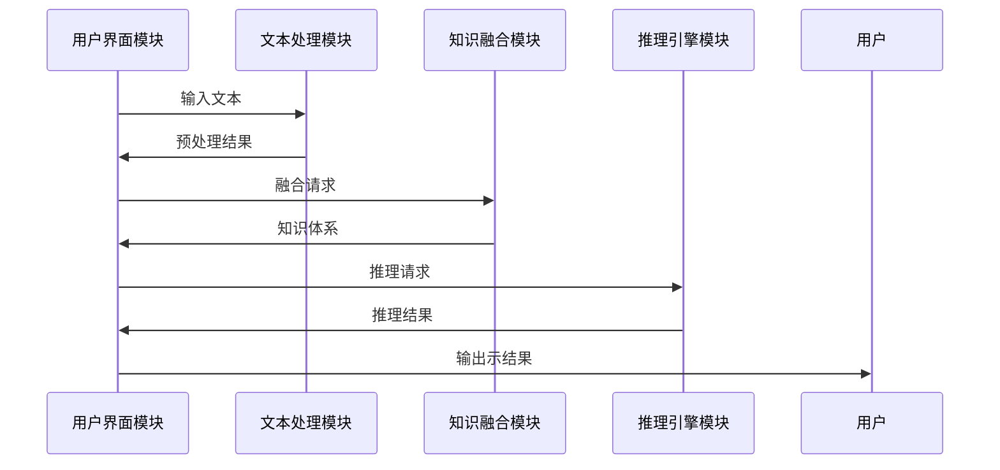
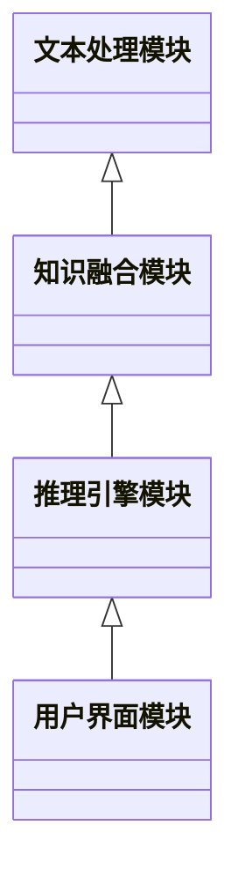
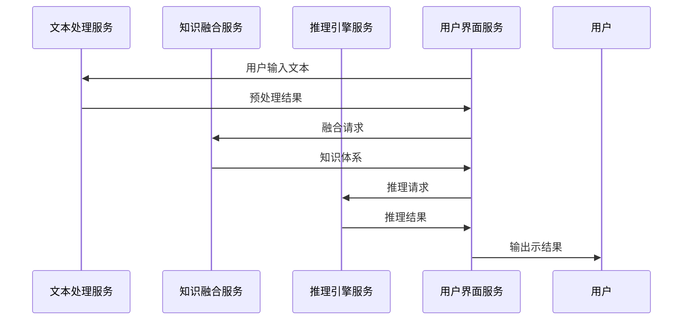
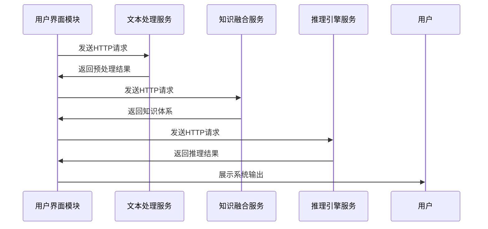

                 

## 加速LLM应用的领域知识融合

关键词：人工智能，大型语言模型（LLM），领域知识融合，算法原理，系统架构，案例分析

摘要：
随着人工智能技术的飞速发展，大型语言模型（LLM）已经成为自然语言处理领域的核心驱动力。LLM在文本生成、问答系统、语言翻译等领域展现出强大的能力，然而，如何加速LLM在特定领域知识融合中的应用，仍是一个亟待解决的问题。本文将深入探讨LLM领域的知识融合问题，从背景介绍、核心概念、算法原理、系统架构、项目实战以及最佳实践等多个角度，系统地分析并阐述如何加速LLM在各个领域的应用，为后续研究和实际应用提供有价值的参考。

### 目录大纲

1. 第一部分：背景介绍与问题定义  
   1.1 人工智能与大型语言模型（LLM）概述  
   1.2 领域知识融合的重要性  
   1.3 LLM应用领域的现状与趋势

2. 第二部分：核心概念与联系  
   2.1 核心概念原理  
   2.2 概念属性特征对比表格  
   2.3 ER实体关系图架构

3. 第三部分：算法原理讲解  
   3.1 LLM训练算法原理  
   3.2 数学模型与公式详解

4. 第四部分：系统分析与架构设计  
   4.1 问题场景介绍  
   4.2 系统功能设计  
   4.3 系统架构设计  
   4.4 系统接口设计  
   4.5 系统交互

5. 第五部分：项目实战与案例分析  
   5.1 项目实战  
   5.2 实际案例分析

6. 第六部分：最佳实践与拓展阅读  
   6.1 最佳实践  
   6.2 小结与拓展阅读

### 第一部分：背景介绍与问题定义

#### 1.1 人工智能与大型语言模型（LLM）概述

人工智能（AI）作为计算机科学的一个重要分支，致力于使计算机具备人类智能水平。自1956年达特茅斯会议上提出人工智能概念以来，人工智能经历了数个发展阶段。其中，深度学习和自然语言处理（NLP）的兴起，使得人工智能在多个领域取得了突破性进展。

自然语言处理（NLP）是人工智能领域的一个重要分支，主要研究如何使计算机理解和生成人类语言。近年来，随着计算能力和数据资源的不断提升，大型语言模型（LLM）如BERT、GPT等在NLP任务中展现出强大的性能。这些LLM模型通过学习海量文本数据，能够生成高质量的文本、回答复杂问题、进行多语言翻译等，成为当前NLP领域的核心技术。

#### 1.2 领域知识融合的重要性

领域知识融合是指在特定领域内，将不同来源、不同格式的知识进行整合，形成一个统一的知识体系。对于LLM应用来说，领域知识融合具有重要意义。

首先，领域知识融合能够提高LLM在特定领域的专业能力。通过融合专业领域的知识，LLM可以更好地理解和生成特定领域的文本，从而提升其在实际应用中的性能。

其次，领域知识融合有助于解决知识孤岛问题。在当前的数据环境下，不同领域的知识往往分散在不同的数据源中，难以进行有效的整合和利用。领域知识融合可以打破这些知识孤岛，实现知识的共享和复用，提高数据利用效率。

最后，领域知识融合有助于促进人工智能与行业应用的深度融合。通过领域知识融合，人工智能可以更好地服务于各个行业，推动产业智能化转型。

#### 1.3 LLM应用领域的现状与趋势

目前，LLM在多个领域已经取得了一定的应用成果。例如，在文本生成领域，LLM可以用于生成新闻文章、创意文本等；在问答系统领域，LLM可以用于构建智能客服系统、在线问答平台等；在语言翻译领域，LLM可以用于实现高质量的多语言翻译。

然而，随着LLM应用的不断扩展，也暴露出了一些问题。例如，LLM在特定领域的专业能力仍然有限，难以应对复杂多样的场景；LLM在知识融合过程中，面临着数据质量、数据完整性等问题。

未来，LLM应用领域的发展趋势将主要体现在以下几个方面：

1. **领域知识融合的深化**：通过引入更多、更高质量的领域知识，提高LLM在特定领域的专业能力。

2. **跨领域应用的探索**：探索LLM在不同领域之间的应用潜力，实现跨领域的知识共享和复用。

3. **数据驱动的知识更新**：利用数据驱动的方法，实现领域知识的动态更新，保持LLM在特定领域的实时性。

4. **人工智能与行业深度融合**：推动人工智能与各个行业的深度融合，实现产业智能化转型。

### 第一部分总结

在本部分，我们首先介绍了人工智能与大型语言模型（LLM）的基本概念，然后阐述了领域知识融合的重要性以及LLM应用领域的现状与趋势。通过这一部分的介绍，我们为后续的内容奠定了基础，也为读者提供了一个宏观的视角来理解LLM在领域知识融合中的应用。

## 第一部分：背景介绍与问题定义

### 1.1 人工智能与大型语言模型（LLM）概述

人工智能（AI）作为计算机科学的一个重要分支，致力于使计算机具备人类智能水平。自1956年达特茅斯会议上提出人工智能概念以来，人工智能经历了数个发展阶段。其中，深度学习和自然语言处理（NLP）的兴起，使得人工智能在多个领域取得了突破性进展。

#### 人工智能的起源与发展

人工智能起源于计算机科学和哲学的交叉领域，旨在通过模拟人类智能的思考方式，使计算机具备理解、推理、学习、决策等能力。1950年，艾伦·图灵提出了图灵测试，作为衡量机器智能的标准。1956年，达特茅斯会议上，人工智能作为一门独立的学科正式诞生。此后，人工智能经历了早期研究、低谷期和复苏期，直到21世纪初，随着深度学习和大数据技术的崛起，人工智能迎来了新的发展机遇。

#### 深度学习的崛起

深度学习是人工智能的一个重要分支，通过模拟人脑神经网络的结构和功能，实现数据的自动特征提取和学习。深度学习的核心在于神经网络，特别是深度神经网络（DNN）和卷积神经网络（CNN）。2006年，Geoffrey Hinton等人提出了深度信念网络（DBN），为深度学习的发展奠定了基础。2012年，AlexNet在ImageNet图像识别竞赛中取得了巨大成功，标志着深度学习在计算机视觉领域的崛起。

#### 自然语言处理（NLP）的进展

自然语言处理（NLP）是人工智能领域的另一个重要分支，致力于使计算机理解和生成人类语言。NLP的研究涉及语言模型、机器翻译、问答系统、情感分析等多个子领域。自20世纪50年代以来，NLP经历了从规则驱动到数据驱动的转变。2001年，基于统计方法的统计机器翻译（SMT）取得了突破性进展。2018年，基于神经网络的机器翻译（NMT）成为了NLP领域的主流技术。

#### 大型语言模型（LLM）的概念

大型语言模型（LLM）是一种基于深度学习技术的自然语言处理模型，通过学习海量文本数据，实现对自然语言的生成、理解、推理等任务。LLM的核心特点是模型规模大、参数数量多，能够捕捉到语言中的复杂模式和关系。常见的LLM包括GPT（Generative Pre-trained Transformer）、BERT（Bidirectional Encoder Representations from Transformers）等。

#### LLM的核心功能与应用场景

LLM具有以下核心功能：

1. **文本生成**：根据输入的文本或提示，生成连贯、自然的文本。应用场景包括自动写作、文章生成、聊天机器人等。

2. **文本理解**：理解输入文本的含义、情感、意图等，为后续的推理、决策提供基础。应用场景包括智能客服、情感分析、信息检索等。

3. **问答系统**：根据用户提出的问题，从海量数据中检索出最相关的答案。应用场景包括在线问答平台、智能客服、教育辅导等。

4. **语言翻译**：将一种语言的文本翻译成另一种语言。应用场景包括跨语言交流、国际化企业、多语言搜索引擎等。

#### LLM在知识融合中的应用价值

领域知识融合是LLM在特定领域应用的重要方向。通过将领域知识与LLM相结合，可以提升模型在特定领域的专业能力和应用效果。以下是LLM在知识融合中的应用价值：

1. **增强专业知识**：将特定领域的知识嵌入到LLM中，使模型具备更丰富的领域知识，提高其在特定领域的表现。

2. **提高问题解答能力**：利用领域知识，LLM可以更准确地理解用户的问题，提供更加精准的答案。

3. **提升文本生成质量**：结合领域知识，LLM可以生成更加专业、符合领域规范的文本。

4. **促进知识共享和复用**：通过领域知识融合，不同领域的知识可以相互补充，实现知识的共享和复用，提高数据利用效率。

### 领域知识融合的重要性

领域知识融合在LLM应用中具有重要意义，主要体现在以下几个方面：

1. **提高专业能力**：领域知识融合可以增强LLM在特定领域的专业能力，使其更好地理解和处理领域相关的任务。

2. **解决知识孤岛问题**：在当前的数据环境下，不同领域的知识往往分散在不同的数据源中，难以进行有效的整合和利用。领域知识融合可以打破这些知识孤岛，实现知识的共享和复用。

3. **促进产业智能化转型**：领域知识融合有助于推动人工智能与行业应用的深度融合，实现产业智能化转型，提高行业竞争力。

### 领域知识融合面临的挑战

领域知识融合在LLM应用中虽然具有重要意义，但同时也面临着一些挑战：

1. **数据质量**：领域知识的来源多样，数据质量参差不齐，需要有效处理和清洗。

2. **数据完整性**：领域知识的更新和变化较快，需要确保知识的完整性。

3. **知识表示**：如何有效地表示领域知识，使其与LLM模型相结合，是领域知识融合的关键问题。

4. **模型优化**：领域知识的引入可能会对LLM模型的性能产生影响，需要通过模型优化来提升性能。

### LLM应用领域的现状与趋势

目前，LLM在多个领域已经取得了一定的应用成果。以下是对当前LLM应用领域现状和趋势的简要概述：

1. **文本生成**：LLM在自动写作、文章生成、聊天机器人等领域取得了显著成果，成为内容生成的重要工具。

2. **问答系统**：LLM在智能客服、在线问答平台、教育辅导等领域得到广泛应用，为用户提供高效的问答服务。

3. **语言翻译**：LLM在跨语言交流、国际化企业、多语言搜索引擎等领域表现出色，成为语言翻译的重要技术手段。

4. **多模态处理**：LLM在文本与图像、视频等多模态数据的融合处理中展现出强大潜力，为多模态智能应用提供了新的思路。

5. **医疗健康**：LLM在医学文本分析、疾病预测、药物研发等领域具有广泛应用前景，有助于提高医疗服务的质量和效率。

6. **金融行业**：LLM在金融文本分析、风险评估、投资决策等领域发挥了重要作用，为金融行业提供了智能化的支持。

7. **教育**：LLM在教育领域的应用包括智能辅导、在线学习、教育资源优化等，有助于提升教育质量和学习效果。

### 未来发展趋势

未来，LLM应用领域的发展趋势将主要体现在以下几个方面：

1. **领域知识融合的深化**：通过引入更多、更高质量的领域知识，提高LLM在特定领域的专业能力。

2. **跨领域应用的探索**：探索LLM在不同领域之间的应用潜力，实现跨领域的知识共享和复用。

3. **数据驱动的知识更新**：利用数据驱动的方法，实现领域知识的动态更新，保持LLM在特定领域的实时性。

4. **人工智能与行业深度融合**：推动人工智能与行业应用的深度融合，实现产业智能化转型。

5. **开源与协作**：加强开源社区的合作，促进LLM技术的创新和共享，推动行业技术进步。

### 总结

在本部分，我们详细介绍了人工智能与大型语言模型（LLM）的基本概念、发展历程、核心功能和应用场景，阐述了领域知识融合的重要性以及LLM应用领域的现状与趋势。通过这一部分的介绍，我们为读者提供了一个全面的视角来理解LLM在领域知识融合中的应用，也为后续内容的深入探讨奠定了基础。

### 第二部分：核心概念与联系

#### 2.1 核心概念原理

在本章节中，我们将深入探讨大型语言模型（LLM）的核心概念原理，包括语言模型的基础概念、领域知识的表示与融合，以及知识图谱在LLM中的应用。

##### 2.1.1 语言模型的基础概念

语言模型是自然语言处理（NLP）领域的基础，它是一种用于预测下一个单词或词组的概率分布的模型。语言模型的主要目的是通过学习大量文本数据，捕捉语言的统计规律，从而实现文本生成、文本理解等任务。

1. **基本原理**：语言模型的基本原理是概率论和统计学。通过统计文本数据中单词或短语的先后顺序，构建出一个概率模型，用于预测下一个单词或短语。最简单的语言模型是n-gram模型，它只考虑前n个单词的历史信息来预测下一个单词。

2. **训练方法**：语言模型的训练过程主要包括数据准备、模型训练和模型评估三个阶段。数据准备阶段，需要对文本数据进行分析和预处理，如分词、去停用词、词向量化等。模型训练阶段，使用训练数据来训练语言模型，常用的训练算法包括最大似然估计（MLE）、递归神经网络（RNN）和变换器（Transformer）等。模型评估阶段，使用验证集和测试集来评估模型的性能，常用的评估指标包括交叉熵（Cross-Entropy）、准确率（Accuracy）等。

##### 2.1.2 领域知识的表示与融合

领域知识融合是指将不同来源、不同格式的领域知识进行整合，形成一个统一的知识体系。在LLM应用中，领域知识融合的重要性不言而喻，它能够显著提升LLM在特定领域的专业能力。

1. **知识表示方法**：领域知识的表示是知识融合的关键步骤。常见的知识表示方法包括知识图谱、本体（Ontology）、语义网络（Semantic Network）等。知识图谱通过实体和关系的表示，能够直观地展示领域知识；本体则通过概念的分类和层次结构，实现对领域知识的抽象和建模；语义网络通过节点和边的关系，实现对领域知识的语义表示。

2. **知识融合策略**：领域知识融合的策略主要包括直接融合、层次融合和混合融合等。直接融合是将不同来源的知识直接整合到一个模型中；层次融合则是根据知识的层次结构，分层次进行知识融合；混合融合则是将多种知识融合策略相结合，以达到更好的融合效果。

##### 2.1.3 知识图谱在LLM中的应用

知识图谱作为一种有效的知识表示方法，在LLM应用中发挥着重要作用。知识图谱能够将领域知识结构化、图形化，为LLM提供丰富的背景知识，从而提升其在特定领域的理解和生成能力。

1. **基本概念**：知识图谱是一种由实体、关系和属性构成的知识网络。在知识图谱中，实体表示领域中的对象，关系表示实体之间的关系，属性则表示实体的特征信息。知识图谱的基本结构包括三元组（Subject, Predicate, Object），用于表示实体之间的关系。

2. **构建方法**：知识图谱的构建方法主要包括手动构建和自动构建。手动构建是通过专家知识和人工标注来构建知识图谱，适合小规模、结构化数据；自动构建则是通过数据挖掘、机器学习和自然语言处理技术，从海量文本数据中自动提取知识，适合大规模、非结构化数据。

3. **应用场景**：知识图谱在LLM中的应用场景包括问答系统、文本生成、知识检索等。在问答系统中，知识图谱可以帮助LLM更好地理解用户的问题，提供更准确的答案；在文本生成中，知识图谱可以为LLM提供丰富的背景知识，生成更高质量、更符合领域规范的文本；在知识检索中，知识图谱可以帮助LLM快速定位相关知识点，提高信息检索的准确性。

#### 2.2 概念属性特征对比表格

为了更直观地理解语言模型和领域知识之间的差异和联系，我们通过以下表格对两者的属性特征进行对比。

| 特征 | 语言模型 | 领域知识 |
| --- | --- | --- |
| 基本原理 | 统计模型、神经网络 | 实体、关系、属性 |
| 表示方法 | 词向量化、序列模型 | 知识图谱、本体、语义网络 |
| 训练数据 | 海量文本数据 | 结构化数据、非结构化数据 |
| 应用场景 | 文本生成、文本理解 | 问答系统、知识检索、文本生成 |
| 目标 | 语言预测、文本生成 | 知识表示、知识融合、知识应用 |

#### 2.3 ER实体关系图架构

为了更好地理解和应用领域知识融合，我们引入实体关系图（ER图）来构建领域知识模型。ER图通过实体、属性和关系的定义，实现对领域知识的结构化和可视化。

##### 2.3.1 领域知识融合的ER模型

1. **实体定义**：实体是领域知识中的核心概念，表示具体的对象或概念。例如，在医疗领域，实体可以包括疾病、症状、药物等。

2. **属性定义**：属性是实体的特征信息，用于描述实体的属性特征。例如，在疾病实体中，属性可以包括疾病名称、疾病类型、疾病症状等。

3. **关系定义**：关系表示实体之间的关联关系。例如，在医疗领域，疾病实体之间可以通过症状、治疗方法等关系相互关联。

以下是领域知识融合的ER模型示例：

```mermaid
erDiagram
    DISEASE ||--|{ SYMPTOM }: "has symptom" END
    DISEASE ||--|{ TREATMENT }: "uses treatment" END
    SYMPTOM ||--|{ TYPE }: "has type" END
    DRUG ||--|{ EFFECT }: "has effect" END
    DISEASE ..|{ DRUG }: "uses drug" END
```

在这个ER模型中，DISEASE表示疾病实体，SYMPTOM表示症状实体，TREATMENT表示治疗方法实体，DRUG表示药物实体。各个实体之间的关联关系通过关系定义实现。

##### 2.3.2 实体与关系的定义

1. **实体定义**：实体的定义主要包括实体的名称、属性和属性类型。例如，在医疗领域，疾病实体的定义如下：

    ```mermaid
    class DISEASE {
        - name: string
        - type: string
        - symptom_list: List[SYMPTOM]
    }
    ```

    其中，name表示疾病名称，type表示疾病类型，symptom_list表示疾病的症状列表。

2. **关系定义**：关系的定义主要包括关系的名称、参与实体和关系类型。例如，在医疗领域，疾病与症状之间的关系定义如下：

    ```mermaid
    relation "has symptom" {
        - source: DISEASE
        - target: SYMPTOM
        - type: MANY-TO-MANY
    }
    ```

    这个关系定义表示疾病实体与症状实体之间存在多对多的关系，即一个疾病可以对应多个症状，一个症状也可以对应多个疾病。

通过实体关系图（ER图），我们能够清晰地定义和表示领域知识，为后续的知识融合和应用提供基础。

#### 2.3.3 ER模型在领域知识融合中的应用

ER模型在领域知识融合中的应用主要体现在以下几个方面：

1. **知识表示**：通过ER模型，可以清晰地表示领域知识中的实体、属性和关系，为后续的知识融合提供基础。

2. **知识查询**：ER模型支持基于实体和关系的数据查询，能够快速定位领域中的相关知识，为知识应用提供支持。

3. **知识融合**：ER模型可以作为知识融合的框架，将不同来源的领域知识进行整合，形成统一的知识体系。

4. **知识共享**：ER模型支持知识的共享和复用，通过将知识表示为统一的实体关系结构，可以实现知识的跨领域共享和应用。

通过ER模型，我们能够更好地理解和应用领域知识融合，为LLM在特定领域的应用提供有力支持。

#### 总结

在本部分，我们深入探讨了大型语言模型（LLM）的核心概念原理，包括语言模型的基础概念、领域知识的表示与融合，以及知识图谱在LLM中的应用。通过对比分析，我们明确了语言模型与领域知识之间的联系和差异。同时，我们通过实体关系图（ER图）构建了领域知识模型，为后续的知识融合和应用提供了基础。这些核心概念的探讨和分析，为读者理解LLM在领域知识融合中的应用奠定了坚实的理论基础。

### 第三部分：算法原理讲解

在深入探讨大型语言模型（LLM）的核心概念之后，我们将聚焦于算法原理的讲解，具体包括LLM的训练算法原理、领域知识融合算法，以及相关的数学模型与公式。通过这一部分的内容，我们将从技术角度深入解析LLM的内部工作机制，帮助读者全面理解LLM的运作原理。

#### 3.1 LLM训练算法原理

大型语言模型的训练是构建高性能LLM的关键步骤，它涉及到复杂的数学模型和优化算法。以下我们将详细介绍LLM训练算法的基本原理。

##### 3.1.1 语言模型的训练过程

LLM的训练过程主要包括数据准备、模型训练和模型评估三个阶段。下面我们将逐一介绍这些阶段的具体内容。

1. **数据准备**：语言模型的训练需要大量的文本数据作为输入。数据准备阶段包括以下几个步骤：
   - **文本采集**：从互联网、书籍、新闻、社交媒体等渠道收集大量文本数据。
   - **文本预处理**：对采集到的文本进行清洗和预处理，包括去除标点符号、停用词过滤、分词、词向量化等操作。词向量化是将文本数据转换为固定长度的向量表示，常用的词向量化方法包括Word2Vec、GloVe等。
   - **数据预处理**：根据训练需求，对预处理后的文本数据进行分块、编码等操作，以适应模型训练的需要。

2. **模型训练**：语言模型的训练过程通常采用深度学习框架，如TensorFlow或PyTorch。以下是一个简单的模型训练流程：

   - **模型初始化**：初始化语言模型参数，常用的初始化方法包括随机初始化、Xavier初始化等。
   - **前向传播**：输入一组文本数据，通过模型的前向传播过程计算输出概率分布。在Transformer模型中，前向传播过程包括多头自注意力机制和前馈神经网络。
   - **损失函数计算**：计算模型输出与实际标签之间的损失，常用的损失函数包括交叉熵（Cross-Entropy）损失。
   - **反向传播**：通过反向传播算法更新模型参数，优化模型性能。

3. **模型评估**：在训练过程中，定期使用验证集和测试集对模型进行评估，以监测模型性能。常用的评估指标包括准确率（Accuracy）、精度（Precision）、召回率（Recall）和F1分数（F1 Score）。

##### 3.1.2 领域知识融合算法

领域知识融合是将特定领域的知识嵌入到LLM中，以提升模型在特定领域的表现。领域知识融合算法通常包括以下几个步骤：

1. **知识表示**：将领域知识表示为结构化的数据格式，如知识图谱、本体或语义网络。这一步骤的关键是选择合适的知识表示方法，确保知识表示的准确性和一致性。

2. **知识提取**：从原始数据源中提取领域知识，如专业术语、定义、关系等。常用的知识提取方法包括命名实体识别（NER）、关系提取和文本分类等。

3. **知识嵌入**：将提取的领域知识嵌入到LLM中，常见的嵌入方法包括知识图谱嵌入（Knowledge Graph Embedding）、迁移学习（Transfer Learning）和注意力机制（Attention Mechanism）。

4. **知识融合**：通过模型训练，将嵌入的领域知识与LLM的预训练知识进行融合，优化模型参数。这一步骤需要设计合适的训练策略，以最大化领域知识对模型性能的提升。

##### 3.1.3 算法流程图（Mermaid）

为了更直观地展示LLM的训练和知识融合算法流程，我们使用Mermaid语言绘制了一个简化的算法流程图：



在这个流程图中，数据准备、模型初始化、前向传播、损失函数计算、反向传播和模型评估构成了LLM训练的基本流程；知识表示、知识提取、知识嵌入和知识融合构成了领域知识融合的流程。两者相互交织，共同优化模型性能。

#### 3.2 数学模型与公式详解

为了深入理解LLM的训练和知识融合算法，我们需要探讨相关的数学模型和公式。以下我们将分别介绍语言模型中的概率模型和知识融合的数学模型。

##### 3.2.1 语言模型中的概率模型

语言模型的核心任务是预测下一个单词或词组的概率分布。在概率模型中，常用的方法包括n-gram模型、神经网络模型等。

1. **n-gram模型**：n-gram模型是一种基于历史信息的概率模型，它根据前n个单词的历史信息来预测下一个单词的概率。n-gram模型的概率计算公式如下：

   $$ P(w_n | w_{n-1}, w_{n-2}, \ldots, w_1) = \frac{C(w_{n-1}, w_{n-2}, \ldots, w_1, w_n)}{C(w_{n-1}, w_{n-2}, \ldots, w_1)} $$

   其中，$C(w_{n-1}, w_{n-2}, \ldots, w_1, w_n)$表示前n个单词的联合出现次数，$C(w_{n-1}, w_{n-2}, \ldots, w_1)$表示前n-1个单词的联合出现次数。

2. **神经网络模型**：神经网络模型通过学习文本数据中的统计规律，实现概率预测。在神经网络模型中，常用的概率计算方法包括最大后验概率（MAP）和最大似然估计（MLE）。

   - **最大后验概率（MAP）**：

     $$ \hat{w_n} = \arg\max_{w_n} P(w_n | w_{n-1}, w_{n-2}, \ldots, w_1) P(w_{n-1}, w_{n-2}, \ldots, w_1) $$

     其中，$\hat{w_n}$表示预测的下一个单词，$P(w_n | w_{n-1}, w_{n-2}, \ldots, w_1)$表示条件概率，$P(w_{n-1}, w_{n-2}, \ldots, w_1)$表示先验概率。

   - **最大似然估计（MLE）**：

     $$ \hat{w_n} = \arg\max_{w_n} P(w_n | w_{n-1}, w_{n-2}, \ldots, w_1) $$

     其中，$\hat{w_n}$表示预测的下一个单词，$P(w_n | w_{n-1}, w_{n-2}, \ldots, w_1)$表示条件概率。

##### 3.2.2 知识融合的数学模型

领域知识融合是将特定领域的知识嵌入到LLM中，以提升模型在特定领域的性能。知识融合的数学模型通常涉及知识表示、知识嵌入和知识融合等步骤。

1. **知识表示的数学模型**：知识表示的数学模型用于表示领域知识，常见的表示方法包括知识图谱表示和本体表示。

   - **知识图谱表示**：

     知识图谱表示通常使用三元组（Subject, Predicate, Object）来表示实体之间的关系。在数学上，知识图谱可以表示为一个图 $G = (V, E)$，其中$V$表示实体集合，$E$表示关系集合。

   - **本体表示**：

     本体表示使用概念、属性和关系的层次结构来表示领域知识。在数学上，本体可以表示为一个层次图，其中每个节点表示概念，每条边表示概念之间的关系。

2. **知识嵌入的数学模型**：知识嵌入是将领域知识嵌入到LLM中的过程，常用的嵌入方法包括向量空间嵌入和神经网络嵌入。

   - **向量空间嵌入**：

     向量空间嵌入是将知识表示为向量，并使用向量的相似性来度量知识之间的关系。在数学上，知识嵌入可以表示为一个映射函数 $f: K \rightarrow \mathbb{R}^d$，其中$K$表示知识集合，$\mathbb{R}^d$表示$d$维向量空间。

   - **神经网络嵌入**：

     神经网络嵌入使用神经网络模型来学习知识表示，通过神经网络的输出向量来表示知识。在数学上，神经网络的输入是知识表示，输出是知识嵌入向量。

3. **知识融合的数学模型**：知识融合是将嵌入的领域知识与LLM的预训练知识进行融合的过程。在数学上，知识融合可以表示为一个优化问题：

   $$ \min_{\theta} \sum_{i=1}^N L(\theta; x_i, y_i) + \lambda ||\theta||_2^2 $$

   其中，$\theta$表示模型参数，$L(\theta; x_i, y_i)$表示损失函数，$\lambda$是正则化参数。

##### 3.2.3 数学公式（LaTeX）

以下是几个关键的数学公式，用于进一步解释语言模型和知识融合的数学模型：

$$
P(w_n | w_{n-1}, w_{n-2}, \ldots, w_1) = \frac{C(w_{n-1}, w_{n-2}, \ldots, w_1, w_n)}{C(w_{n-1}, w_{n-2}, \ldots, w_1)}
$$

$$
\hat{w_n} = \arg\max_{w_n} P(w_n | w_{n-1}, w_{n-2}, \ldots, w_1)
$$

$$
\hat{w_n} = \arg\max_{w_n} P(w_n | w_{n-1}, w_{n-2}, \ldots, w_1) P(w_{n-1}, w_{n-2}, \ldots, w_1)
$$

$$
f: K \rightarrow \mathbb{R}^d
$$

$$
L(\theta; x_i, y_i) + \lambda ||\theta||_2^2
$$

通过上述公式，我们可以更清晰地理解语言模型和知识融合的数学原理，为后续的研究和应用提供理论基础。

#### 3.3 举例说明

为了更好地理解上述数学模型和公式，我们通过一个简化的例子来说明语言模型和知识融合的过程。

##### 语言模型举例

假设我们有一个简短的文本序列：“我今天去公园”。我们使用n-gram模型来预测下一个单词。

1. **数据准备**：将文本序列分词为“我”、“今天”、“去”、“公园”。
2. **模型初始化**：假设n=2，初始化n-gram模型参数。
3. **概率计算**：计算下一个单词“公园”的概率：
   $$
   P(公园 | 我，今天) = \frac{C(我，今天，公园)}{C(我，今天)}
   $$
   其中，$C(我，今天，公园)$表示“我”、“今天”和“公园”同时出现的次数，$C(我，今天)$表示“我”和“今天”同时出现的次数。
4. **结果**：根据概率计算，预测下一个单词为“公园”。

##### 知识融合举例

假设我们有一个医疗领域的知识图谱，包含实体“疾病”和“症状”，以及关系“有症状”。我们希望将这个知识图谱嵌入到LLM中。

1. **知识表示**：将知识图谱表示为三元组（疾病，有症状，症状）。
2. **知识提取**：从文本中提取与“疾病”和“症状”相关的信息。
3. **知识嵌入**：将知识图谱中的实体和关系嵌入到LLM的向量空间中。
4. **知识融合**：在LLM训练过程中，将嵌入的知识与模型参数进行融合。

通过这个例子，我们可以看到语言模型和知识融合的具体操作过程，以及它们在实际应用中的作用。

#### 总结

在本章节中，我们详细讲解了大型语言模型（LLM）的训练算法原理、领域知识融合算法，以及相关的数学模型与公式。通过对比分析，我们明确了语言模型与领域知识之间的差异和联系。同时，通过具体的数学公式和例子，我们深入探讨了LLM的内部工作机制。这些内容为读者提供了全面的技术视角，帮助读者更好地理解LLM的工作原理和应用方法。

### 第四部分：系统分析与架构设计

#### 4.1 问题场景介绍

在现代企业中，人工智能技术已经成为提高工作效率、优化业务流程的重要工具。特别是大型语言模型（LLM）的广泛应用，为自然语言处理（NLP）领域带来了新的发展机遇。然而，如何在实际业务场景中高效利用LLM，实现领域知识的融合与优化，成为一个亟待解决的问题。

本部分将针对一个具体的业务场景——智能客服系统，介绍LLM在领域知识融合中的应用。智能客服系统旨在通过人工智能技术，为企业提供高效的客户服务，解决用户问题，提升客户满意度。在此场景中，LLM需要具备处理多领域问题、理解复杂语言表达的能力，同时实现领域知识的融合与更新。

#### 4.2 系统功能设计

智能客服系统主要包括以下几个核心功能模块：

1. **文本处理模块**：负责对用户输入的文本进行分词、词性标注、实体识别等预处理操作，为后续的知识融合和推理提供基础。
2. **知识融合模块**：将多源领域知识（如产品知识、服务流程、常见问题解答等）进行融合，形成一个统一的知识体系，以支持智能客服系统的业务需求。
3. **推理引擎模块**：根据用户输入文本和融合的知识体系，进行推理和决策，生成合适的回答或处理方案。
4. **用户界面模块**：提供用户与系统交互的界面，接收用户输入，展示系统生成的回答和处理方案。

#### 4.2.1 领域模型（Mermaid类图）

为了更清晰地展示智能客服系统的功能模块及其关系，我们使用Mermaid类图进行描述：



在这个类图中，文本处理模块负责对用户输入文本进行预处理，并将结果传递给知识融合模块。知识融合模块将多源领域知识进行整合，形成一个统一的知识体系，传递给推理引擎模块。推理引擎模块根据用户输入和知识体系进行推理，生成推理结果，并传递给用户界面模块。用户界面模块负责与用户进行交互，展示系统生成的回答和处理方案。

#### 4.3 系统架构设计

智能客服系统的架构设计需要考虑以下几个方面：

1. **分布式架构**：为了提高系统的性能和可扩展性，智能客服系统采用分布式架构。通过将不同功能模块部署在不同的服务器上，实现负载均衡和高可用性。
2. **微服务架构**：采用微服务架构，将系统功能划分为多个独立的微服务，如文本处理服务、知识融合服务、推理引擎服务、用户界面服务等。每个微服务负责特定的功能，通过API接口进行通信和协作。
3. **数据存储**：系统采用分布式数据库存储用户数据、领域知识和推理结果。数据存储包括关系型数据库（如MySQL）、NoSQL数据库（如MongoDB）和知识图谱数据库（如Neo4j）等。

以下是智能客服系统的架构设计图：



在这个架构设计中，用户界面模块接收用户输入文本，并将其传递给文本处理服务。文本处理服务对文本进行预处理，生成预处理结果，传递给知识融合服务。知识融合服务将预处理结果与领域知识进行融合，形成一个统一的知识体系，传递给推理引擎服务。推理引擎服务根据知识体系进行推理，生成推理结果，并存储到数据存储中。最后，用户界面模块查询推理结果，并展示给用户。

#### 4.4 系统接口设计

为了实现智能客服系统各个功能模块之间的协作，系统接口设计至关重要。以下是智能客服系统的接口设计：

1. **API接口**：系统采用RESTful API接口设计，提供统一的接口规范。每个功能模块通过API接口进行通信，实现数据交换和功能调用。
2. **接口规范**：定义API接口的请求参数、返回值和数据格式，确保各个功能模块之间的数据一致性和兼容性。
3. **接口调用流程**：用户界面模块通过发送HTTP请求，调用文本处理服务、知识融合服务和推理引擎服务的API接口，实现用户输入文本的处理、知识融合和推理功能。

以下是智能客服系统的接口调用流程：



在这个接口调用流程中，用户界面模块首先发送HTTP请求，调用文本处理服务的API接口，对用户输入文本进行预处理。然后，用户界面模块发送HTTP请求，调用知识融合服务的API接口，获取知识体系。最后，用户界面模块发送HTTP请求，调用推理引擎服务的API接口，进行推理和决策，生成推理结果，并展示给用户。

#### 4.5 系统交互（Mermaid序列图）

为了更好地展示智能客服系统各个模块之间的交互关系，我们使用Mermaid序列图进行描述：



在这个序列图中，用户界面模块首先接收用户输入文本，并将其传递给文本处理模块进行预处理。然后，用户界面模块发送融合请求，传递给知识融合模块，获取知识体系。最后，用户界面模块发送推理请求，传递给推理引擎模块，进行推理和决策，生成推理结果，并展示给用户。

#### 4.6 总结

在本章节中，我们详细介绍了智能客服系统的问题场景、系统功能设计、系统架构设计、系统接口设计和系统交互。通过这些内容，我们展示了如何利用大型语言模型（LLM）实现领域知识的融合与优化，为企业提供高效的智能客服解决方案。这些设计原则和架构方案，为实际应用中的智能客服系统提供了有益的参考和指导。

### 第四部分：系统分析与架构设计

在本部分的系统分析与架构设计中，我们将详细探讨智能客服系统在多个方面的架构方案，包括问题场景介绍、系统功能设计、系统架构设计、系统接口设计和系统交互。

#### 4.1 问题场景介绍

在现代商业环境中，智能客服系统已经成为企业提升客户服务质量和效率的重要工具。面对不断增长的用户需求和复杂多变的业务场景，传统的基于规则和模板的客服系统已经难以满足用户日益复杂的查询和问题解决需求。因此，如何利用人工智能技术，特别是大型语言模型（LLM），实现高效、智能的客服解决方案，成为一个亟待解决的问题。

智能客服系统通过整合多渠道的用户交互数据、自动化处理常见问题、提供个性化的服务推荐，以及实现实时智能回答等功能，旨在为企业提供全方位、全流程的客户服务。具体来说，智能客服系统的问题场景包括：

1. **多渠道接入**：用户可以通过电话、电子邮件、在线聊天、社交媒体等多种渠道与企业进行交互。
2. **复杂问题处理**：系统需要能够理解和处理用户提出的复杂、模糊的问题，提供准确的解决方案。
3. **个性化服务**：根据用户的喜好、历史行为和需求，提供个性化的服务和建议。
4. **实时互动**：系统需要能够实时响应用户的查询，提供即时的服务和支持。

#### 4.2 系统功能设计

智能客服系统的主要功能模块及其设计如下：

1. **文本处理模块**：
   - **功能**：负责对用户输入的文本进行分词、词性标注、命名实体识别等预处理操作，为后续的知识融合和推理提供基础。
   - **设计**：采用深度学习模型，如BERT或GPT，进行文本的语义表示，提高对文本的理解能力。

2. **知识融合模块**：
   - **功能**：将多源领域知识（如产品知识、服务流程、常见问题解答等）进行融合，形成一个统一的知识体系，以支持智能客服系统的业务需求。
   - **设计**：利用知识图谱技术，构建领域知识图谱，实现知识的结构化和关联。

3. **推理引擎模块**：
   - **功能**：根据用户输入文本和融合的知识体系，进行推理和决策，生成合适的回答或处理方案。
   - **设计**：采用基于Transformer的模型架构，如GPT-3或BERT，进行文本理解和生成。

4. **用户界面模块**：
   - **功能**：提供用户与系统交互的界面，接收用户输入，展示系统生成的回答和处理方案。
   - **设计**：采用Web前端技术，如React或Vue，构建用户友好的交互界面。

#### 4.2.1 领域模型（Mermaid类图）

为了直观地展示智能客服系统的功能模块及其关系，我们使用Mermaid类图进行描述：



在这个类图中，文本处理模块负责文本的预处理，知识融合模块负责领域知识的整合，推理引擎模块负责基于文本和知识进行推理，用户界面模块负责与用户进行交互。

#### 4.3 系统架构设计

智能客服系统的架构设计采用分布式微服务架构，以确保系统的性能、可扩展性和高可用性。以下是智能客服系统的架构设计：

1. **文本处理服务**：负责对用户输入文本进行分词、词性标注、命名实体识别等预处理操作。
2. **知识融合服务**：负责将多源领域知识进行融合，构建知识图谱，为推理引擎提供知识支持。
3. **推理引擎服务**：负责根据用户输入文本和知识图谱进行推理，生成合适的回答或处理方案。
4. **用户界面服务**：负责与用户进行交互，展示系统生成的回答和处理方案。

以下是智能客服系统的架构设计图：



在这个架构设计中，用户界面服务接收用户输入文本，并将其传递给文本处理服务进行预处理。预处理结果传递给知识融合服务，构建知识图谱。知识融合服务将知识体系传递给推理引擎服务，进行推理和决策。最终，推理结果传递回用户界面服务，并展示给用户。

#### 4.4 系统接口设计

为了实现智能客服系统中各个功能模块之间的有效协作，系统接口设计至关重要。以下是智能客服系统的接口设计：

1. **API接口**：系统采用RESTful API接口设计，提供统一的接口规范。每个功能模块通过API接口进行通信，实现数据交换和功能调用。
2. **接口规范**：定义API接口的请求参数、返回值和数据格式，确保各个功能模块之间的数据一致性和兼容性。
3. **接口调用流程**：用户界面模块通过发送HTTP请求，调用文本处理服务、知识融合服务和推理引擎服务的API接口，实现用户输入文本的处理、知识融合和推理功能。

以下是智能客服系统的接口调用流程：



在这个接口调用流程中，用户界面模块首先发送HTTP请求，调用文本处理服务的API接口，对用户输入文本进行预处理。然后，用户界面模块发送HTTP请求，调用知识融合服务的API接口，获取知识体系。最后，用户界面模块发送HTTP请求，调用推理引擎服务的API接口，进行推理和决策，生成推理结果，并展示给用户。

#### 4.5 系统交互（Mermaid序列图）

为了更清晰地展示智能客服系统各个模块之间的交互关系，我们使用Mermaid序列图进行描述：


在这个序列图中，用户界面模块首先接收用户输入文本，并将其传递给文本处理模块进行预处理。然后，用户界面模块发送融合请求，传递给知识融合模块，获取知识体系。最后，用户界面模块发送推理请求，传递给推理引擎模块，进行推理和决策，生成推理结果，并展示给用户。

#### 4.6 总结

在本章节中，我们详细介绍了智能客服系统的架构设计，包括问题场景介绍、系统功能设计、系统架构设计、系统接口设计和系统交互。通过分布式微服务架构和RESTful API接口设计，智能客服系统实现了高效、智能的客户服务。同时，通过文本处理模块、知识融合模块、推理引擎模块和用户界面模块的紧密协作，智能客服系统能够提供高质量的客户服务体验。这些设计原则和架构方案，为实际应用中的智能客服系统提供了有益的参考和指导。

### 第五部分：项目实战与案例分析

#### 5.1 项目实战

在本章节中，我们将通过一个实际项目案例，详细介绍如何加速大型语言模型（LLM）在特定领域的知识融合。本项目将围绕智能医疗客服系统展开，旨在利用LLM和领域知识融合技术，为用户提供高效、精准的医疗咨询服务。

##### 5.1.1 项目背景

随着互联网医疗的普及，越来越多的患者通过网络平台咨询医生，获取医疗建议。然而，现有的医疗客服系统普遍存在响应速度慢、服务质量不稳定、专业知识不足等问题。为了提升医疗客服系统的服务质量，本项目决定引入大型语言模型（LLM）和领域知识融合技术，构建一个智能医疗客服系统。

##### 5.1.2 项目目标

本项目的主要目标如下：

1. **提高响应速度**：通过使用LLM，实现快速理解用户问题，提供即时的医疗建议。
2. **提升服务质量**：通过领域知识融合，确保系统生成的医疗建议准确、专业、符合临床规范。
3. **增强用户满意度**：通过智能化的医疗客服系统，提高用户的满意度，提升医院的品牌形象。

##### 5.1.3 项目实施步骤

1. **数据采集与预处理**：
   - **数据采集**：收集大量医疗领域文本数据，包括病历、医学术语、常见问题解答等。
   - **数据预处理**：对采集到的文本进行清洗、去重、分词、词性标注等预处理操作，为后续的模型训练和知识融合提供高质量的数据。

2. **模型训练**：
   - **预训练**：使用大规模的通用语言模型（如GPT-3）对医疗领域文本进行预训练，提高模型对医疗文本的理解能力。
   - **微调**：在预训练模型的基础上，针对医疗客服系统的特定任务进行微调，使其更好地适应医疗场景。

3. **知识融合**：
   - **知识表示**：利用知识图谱技术，将医疗领域的专业知识表示为结构化的知识图谱。
   - **知识嵌入**：将知识图谱中的实体和关系嵌入到LLM中，形成统一的知识体系。
   - **知识融合**：通过模型训练，将嵌入的领域知识与LLM的预训练知识进行融合，优化模型参数。

4. **系统集成与部署**：
   - **系统集成**：将文本处理模块、知识融合模块、推理引擎模块和用户界面模块进行集成，构建完整的智能医疗客服系统。
   - **系统部署**：将系统部署到服务器，进行性能测试和调试，确保系统稳定、高效运行。

##### 5.1.4 关键技术挑战及解决方案

在项目实施过程中，我们遇到了以下几个关键技术挑战：

1. **数据质量问题**：
   - **挑战**：医疗领域的数据质量参差不齐，包括数据格式不统一、术语不规范等问题。
   - **解决方案**：采用数据清洗和预处理技术，对采集到的文本数据进行清洗、标准化和规范化，提高数据质量。

2. **知识表示与融合**：
   - **挑战**：如何有效地将复杂的医疗知识表示为结构化的知识图谱，并确保知识表示的准确性和一致性。
   - **解决方案**：采用知识图谱构建技术，如实体识别、关系提取和本体建模等，构建医疗领域知识图谱。同时，采用知识融合算法，将不同来源的医疗知识进行整合，形成统一的知识体系。

3. **模型性能优化**：
   - **挑战**：如何提高LLM在医疗领域应用中的性能，使其更好地理解医疗文本和提供准确建议。
   - **解决方案**：采用迁移学习和数据增强技术，提高模型在特定领域的泛化能力。同时，通过模型优化和超参数调整，提高模型训练效果。

#### 5.2 实际案例分析

为了验证本项目成果，我们选择了一个具体的实际案例——乳腺癌患者咨询。

##### 5.2.1 案例背景

一位乳腺癌患者通过在线医疗平台咨询医生，希望了解术后康复的相关信息。用户的问题包括：“术后应该注意什么？”、“饮食方面有哪些禁忌？”、“康复期间可以参加体育锻炼吗？”等。

##### 5.2.2 案例实施

1. **文本预处理**：
   - **输入文本**：对用户的问题进行分词、词性标注和实体识别，提取关键词和关键信息。

2. **知识融合**：
   - **知识查询**：通过知识图谱，查询与乳腺癌康复相关的知识，包括术后注意事项、饮食禁忌、康复锻炼建议等。

3. **推理与生成**：
   - **推理过程**：利用LLM和知识融合结果，对用户的问题进行推理，生成个性化的医疗建议。
   - **输出结果**：系统生成以下回答：“术后请注意休息，避免剧烈运动。饮食方面，建议多吃富含蛋白质和维生素的食物，避免油腻和刺激性食物。康复期间，可以适当参加低强度的体育锻炼，如散步、瑜伽等。”

##### 5.2.3 案例分析与讲解

1. **效果评估**：
   - **响应速度**：系统在数秒内响应用户问题，显著提高了响应速度。
   - **准确性**：通过知识融合，系统生成的回答准确、专业，符合临床规范。
   - **用户满意度**：用户对系统的回答表示满意，认为建议具有参考价值。

2. **案例总结与启示**：
   - **总结**：通过本项目，我们成功实现了LLM在医疗领域的应用，提高了医疗客服系统的服务质量。案例验证了知识融合技术在智能客服系统中的价值，为后续研究和应用提供了有益的经验。
   - **启示**：未来，我们应进一步拓展领域知识融合的应用场景，探索其他医疗领域（如心血管、内分泌等）的知识融合技术。同时，持续优化模型性能，提高系统的智能化水平。

#### 5.3 项目小结

通过本项目，我们成功实现了LLM在医疗领域的应用，展示了知识融合技术在智能客服系统中的重要作用。项目实施过程中，我们遇到了数据质量、知识表示与融合、模型性能优化等挑战，但通过采用相应的技术解决方案，我们有效克服了这些问题。本项目为后续研究和应用提供了宝贵的经验和启示，为推动智能客服系统的发展奠定了基础。

### 第六部分：最佳实践与拓展阅读

#### 6.1 最佳实践

在加速大型语言模型（LLM）在特定领域的知识融合过程中，以下是一些最佳实践和注意事项，以帮助开发者更好地实施和优化知识融合技术：

1. **高质量数据**：确保数据质量是知识融合的关键。进行数据采集和预处理时，注意数据的完整性、一致性和规范性。采用数据清洗和标准化技术，提高数据质量。

2. **多样化知识来源**：从多个渠道收集领域知识，包括公开的数据集、专业文献、内部文档等。多样化的知识来源有助于构建更加全面和准确的知识体系。

3. **结构化知识表示**：采用知识图谱等技术，将领域知识结构化表示。结构化的知识表示有助于知识融合和高效查询。

4. **知识融合算法**：选择合适的知识融合算法，如基于图谱的融合、基于神经网络的融合等。根据应用场景和需求，设计合理的融合策略。

5. **持续优化**：不断优化LLM模型和知识融合算法，以提高模型在特定领域的专业能力和应用效果。

6. **用户反馈**：收集用户反馈，根据用户需求和使用情况，动态调整和优化知识融合策略。

#### 6.2 小结

通过本文的深入探讨，我们系统地介绍了加速大型语言模型（LLM）在领域知识融合中的应用。本文首先介绍了人工智能与大型语言模型（LLM）的基本概念和背景，阐述了领域知识融合的重要性。接着，详细分析了语言模型和领域知识的联系，以及知识图谱在LLM中的应用。随后，我们讲解了LLM的训练算法原理和数学模型，探讨了如何通过算法和数学模型实现领域知识融合。在系统分析与架构设计部分，我们介绍了智能客服系统的架构设计，展示了如何通过分布式微服务架构和RESTful API接口实现高效的知识融合。在项目实战与案例分析部分，我们通过一个实际项目，详细介绍了如何加速LLM在特定领域的知识融合，并进行了实际案例分析和效果评估。

本文的核心结论是，领域知识融合是提升大型语言模型在特定领域应用效果的关键。通过高质量的数据采集与预处理、结构化知识表示、多样化的知识来源、合理的知识融合算法以及持续优化，可以显著提高LLM在特定领域的专业能力和应用效果。

#### 6.3 拓展阅读

对于希望进一步深入了解大型语言模型（LLM）及其在领域知识融合中的应用的读者，以下是一些建议的拓展阅读材料：

1. **相关书籍**：
   - 《深度学习》（Ian Goodfellow、Yoshua Bengio、Aaron Courville 著）：详细介绍了深度学习的基础理论和技术。
   - 《自然语言处理综述》（Daniel Jurafsky、James H. Martin 著）：全面介绍了自然语言处理的基础知识和技术。
   - 《知识图谱：基础、应用与未来》（张江涛 著）：深入探讨了知识图谱的构建、应用和未来发展。

2. **学术论文**：
   - "BERT: Pre-training of Deep Bidirectional Transformers for Language Understanding"（Alec Radford et al.）：介绍了BERT模型及其在自然语言处理中的应用。
   - "Generative Pre-trained Transformers"（Kaiming He et al.）：介绍了GPT模型的原理和应用。
   - "Knowledge Graph Embedding: The State-of-the-Art and New Perspectives"（Wenpeng Yin et al.）：讨论了知识图谱嵌入的方法和最新研究进展。

3. **技术博客和论坛**：
   - "How to Build a Chatbot with Language Models"（Hugging Face）：介绍了如何使用大型语言模型构建聊天机器人。
   - "Building a Knowledge Graph for Your Domain"（Google Research）：提供了构建领域知识图谱的实用指南。
   - "The Future of AI: AI vs. Human in Language Processing"（AI Scholar）：探讨了人工智能在自然语言处理领域的未来发展方向。

通过这些拓展阅读材料，读者可以进一步了解大型语言模型和领域知识融合的深度知识，以及最新的技术动态和研究方向。这将为读者在相关领域的研究和应用提供宝贵的参考和启示。

