                 

### 动态prompt生成基础

#### 第1章：问题背景与核心概念

##### 1.1 动态prompt生成概述

##### 1.1.1 问题背景

在人工智能领域，特别是在自然语言处理（NLP）、计算机视觉（CV）和机器翻译（MT）等任务中，传统的prompt设计面临着一些挑战。这些挑战包括如何让模型更好地理解和处理多变的任务需求，以及如何提高模型的灵活性和适应性。动态prompt生成技术正是为了解决这些问题而提出的。

##### 1.1.2 动态prompt定义

动态prompt生成指的是在执行任务时，根据任务的实时需求和输入内容，动态地生成适合的prompt。与传统prompt设计不同，动态prompt可以在任务执行过程中进行调整和优化，从而更好地满足具体任务的特定需求。

##### 1.1.3 动态prompt生成的重要性

动态prompt生成的重要性主要体现在以下几个方面：

1. **提高模型适应性**：动态prompt可以根据任务需求的变化，实时调整模型的行为，从而提高模型的适应性。
2. **提升任务效果**：通过动态调整prompt，可以更好地引导模型学习，提高任务的效果。
3. **增强用户体验**：动态prompt生成可以根据用户的实时反馈，动态调整模型的输出，从而提供更个性化的服务。

##### 1.2 核心概念与联系

##### 1.2.1 prompt设计的基本要素

一个有效的prompt设计通常需要包含以下几个基本要素：

1. **任务需求**：明确任务的目标和要求，这是设计prompt的基础。
2. **上下文信息**：提供与任务相关的上下文信息，帮助模型更好地理解任务。
3. **输入数据**：包括文本、图像或其他形式的数据，作为模型的输入。
4. **反馈机制**：用于评估模型输出的正确性和质量，以便进行进一步的调整。

##### 1.2.2 prompt的类型与用途

根据用途的不同，prompt可以分为以下几种类型：

1. **引导性prompt**：提供明确的任务指导，帮助模型理解任务的目标。
2. **辅助性prompt**：提供额外的上下文信息，辅助模型完成任务。
3. **评估性prompt**：用于评估模型输出的质量，为后续调整提供依据。

##### 1.2.3 动态prompt与传统prompt的对比

| 对比项         | 动态prompt           | 传统prompt           |
| -------------- | -------------------- | -------------------- |
| 适应性         | 动态调整            | 固定不变            |
| 灵活性         | 高灵活度            | 较低灵活度          |
| 实时性         | 实时生成和调整      | 预先设计            |
| 用户体验       | 更个性化            | 较少个性化          |

##### 1.3 动态prompt生成原理

##### 1.3.1 动态prompt生成机制

动态prompt生成机制主要包括以下几个步骤：

1. **任务识别**：根据输入数据，识别当前的任务类型和需求。
2. **上下文构建**：根据任务需求，构建与任务相关的上下文信息。
3. **prompt生成**：基于上下文信息，生成适合的prompt。
4. **模型调整**：根据生成的prompt，调整模型的行为。

##### 1.3.2 动态prompt生成的关键算法

动态prompt生成的关键算法包括：

1. **序列生成模型**：如生成式对抗网络（GAN）、变分自编码器（VAE）等。
2. **图神经网络**：如图卷积网络（GCN）、图注意力网络（GAT）等。
3. **强化学习**：通过奖励机制，动态调整prompt的生成过程。

##### 1.4 动态prompt生成的应用场景

##### 1.4.1 自然语言处理

在自然语言处理领域，动态prompt生成可以用于文本生成、文本分类、问答系统等任务。

##### 1.4.2 计算机视觉

在计算机视觉领域，动态prompt生成可以用于图像分类、图像分割、图像生成等任务。

##### 1.4.3 机器翻译

在机器翻译领域，动态prompt生成可以用于提高翻译质量，实现更准确的翻译结果。

##### 1.5 动态prompt生成的发展趋势

##### 1.5.1 技术进步与挑战

随着深度学习技术的不断发展，动态prompt生成的技术也在不断进步。然而，如何提高模型的适应性、实时性和效果仍然是当前面临的挑战。

##### 1.5.2 未来发展方向

未来的发展可能会集中在以下几个方面：

1. **多模态融合**：结合多种数据类型，实现更强大的动态prompt生成。
2. **知识增强**：利用外部知识库，提高模型的理解能力和泛化能力。
3. **可解释性**：提高动态prompt生成过程的可解释性，便于理解和优化。

---

通过以上分析，我们可以看到动态prompt生成技术在多变的LLM任务中具有重要的作用。接下来，我们将进一步探讨动态prompt生成技术的原理和应用，以期为读者提供更深入的见解。在下一章中，我们将详细分析动态prompt生成技术的原理，包括其基本概念、数学模型和关键算法。

#### 第2章：动态prompt生成技术原理

##### 2.1 基本概念

在深入探讨动态prompt生成技术之前，我们需要首先了解几个关键概念。

##### 2.1.1 语言模型

语言模型（Language Model，LM）是自然语言处理中的一个核心概念，它用于预测一段文本的下一个单词或字符。在动态prompt生成中，语言模型起着至关重要的作用。常见的语言模型有基于统计的方法（如N-gram模型）和基于神经网络的模型（如BERT、GPT等）。

##### 2.1.2 数据预处理

数据预处理是动态prompt生成的重要步骤。它包括数据清洗、数据增强、数据标注等操作，旨在提高数据的质量和多样性。良好的数据预处理可以显著提升动态prompt生成模型的效果。

##### 2.1.3 常用算法与技术

在动态prompt生成中，常用的算法和技术包括：

1. **生成式对抗网络（GAN）**：通过生成器和判别器的对抗训练，生成高质量的prompt。
2. **变分自编码器（VAE）**：通过编码器和解码器，将数据映射到低维空间，生成多样化的prompt。
3. **图神经网络（GNN）**：通过图结构，对数据进行编码和解码，生成结构化的prompt。
4. **强化学习（RL）**：通过奖励机制，动态调整prompt的生成过程，优化模型的行为。

##### 2.2 数学模型与公式

动态prompt生成的数学模型通常涉及概率模型和优化算法。以下是一些常用的数学模型和公式。

##### 2.2.1 语言模型数学模型

语言模型的核心是概率模型，通常使用以下公式表示：

\[ P(\text{word}_i | \text{word}_{i-1}, \ldots, \text{word}_1) = \prod_{i=1}^n P(\text{word}_i | \text{word}_{i-1}, \ldots, \text{word}_1) \]

其中，\( P(\text{word}_i | \text{word}_{i-1}, \ldots, \text{word}_1) \) 表示在给定前一个单词序列的情况下，当前单词的概率。

##### 2.2.2 损失函数与优化算法

在动态prompt生成中，常用的损失函数包括交叉熵损失和对比损失。优化算法则通常使用梯度下降和Adam等优化器。

交叉熵损失函数的公式为：

\[ L = -\sum_{i=1}^n \text{word}_i \log P(\text{word}_i) \]

其中，\( \text{word}_i \) 表示模型预测的单词，\( P(\text{word}_i) \) 表示该单词的概率。

##### 2.3 动态prompt生成算法解析

动态prompt生成算法可以分为基于序列模型、基于图神经网络和基于强化学习三种类型。以下是对这三种算法的详细解析。

##### 2.3.1 基于序列模型的动态prompt生成

基于序列模型的动态prompt生成通常使用语言模型来预测下一个单词。常见的序列模型包括RNN、LSTM和GRU等。以下是一个基于LSTM的动态prompt生成算法的mermaid流程图：

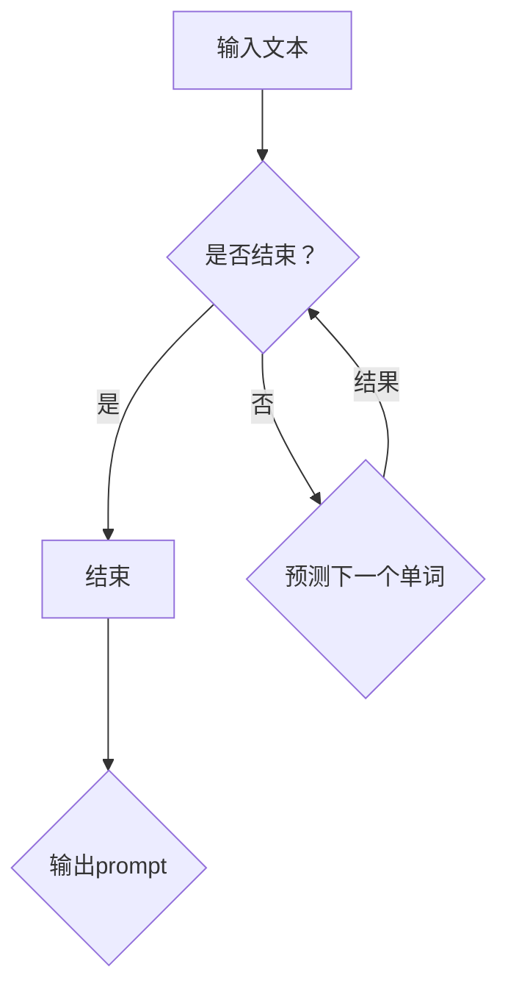

在这个流程图中，A表示输入文本，B是判断是否结束的节点，D是预测下一个单词的节点，E是输出prompt的节点。

##### 2.3.2 基于图神经网络的动态prompt生成

基于图神经网络的动态prompt生成通常使用图结构来表示数据。图神经网络（GNN）可以处理复杂的关系和结构化数据。以下是一个基于图卷积网络（GCN）的动态prompt生成算法的mermaid流程图：

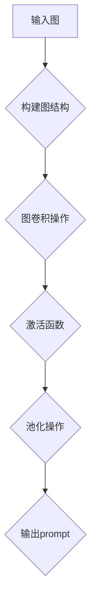

在这个流程图中，A表示输入图，B是构建图结构的节点，C是进行图卷积操作的节点，D是应用激活函数的节点，E是进行池化操作的节点，F是输出prompt的节点。

##### 2.3.3 基于强化学习的动态prompt生成

基于强化学习的动态prompt生成通过奖励机制来调整prompt的生成过程。强化学习的主要目标是使agent（智能体）在环境中采取最优的行动，以实现最大化的奖励。以下是一个基于强化学习的动态prompt生成算法的mermaid流程图：

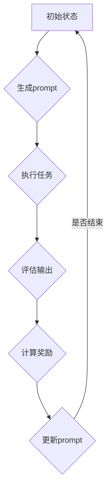

在这个流程图中，A是初始状态的节点，B是生成prompt的节点，C是执行任务的节点，D是评估输出的节点，E是计算奖励的节点，F是更新prompt的节点。

##### 2.4 动态prompt生成实践

##### 2.4.1 环境配置与数据集准备

在实践动态prompt生成之前，我们需要配置合适的环境并准备数据集。以下是一个基本的步骤：

1. **安装依赖**：安装Python、TensorFlow、PyTorch等依赖库。
2. **数据集准备**：收集和整理相关的数据集，并进行预处理，如文本清洗、数据增强等。

##### 2.4.2 算法实现与性能分析

在实现动态prompt生成算法后，我们需要进行性能分析，以评估算法的效果。以下是一个基本的步骤：

1. **模型训练**：使用准备好的数据集，对动态prompt生成模型进行训练。
2. **模型评估**：使用验证集或测试集，对模型进行评估，计算各项性能指标，如准确性、召回率、F1分数等。
3. **优化策略**：根据评估结果，调整模型参数和算法策略，以提高性能。

---

通过本章的讲解，我们了解了动态prompt生成技术的基本概念、数学模型和关键算法。在下一章中，我们将探讨动态prompt生成在多变的LLM任务中的应用，分析其在不同领域的实际应用效果。

#### 第3章：动态prompt生成在多变的LLM任务中的应用

##### 3.1 多变的LLM任务概述

在自然语言处理领域，大型语言模型（Large Language Models，LLM）的应用日益广泛。这些模型能够处理各种语言任务，如文本生成、文本分类、问答系统等。然而，随着任务需求的不断变化，传统的prompt设计方法逐渐暴露出其局限性。为了应对这种变化，动态prompt生成技术应运而生。

##### 3.1.1 LLM任务多样性

LLM任务的多样性体现在以下几个方面：

1. **任务类型**：包括文本生成、文本分类、命名实体识别、情感分析、机器翻译等。
2. **数据来源**：涉及多种数据类型，如文本、图像、音频等。
3. **任务复杂度**：从简单的二分类任务到复杂的问答系统和对话系统。

##### 3.1.2 动态prompt在LLM任务中的应用

动态prompt生成技术在LLM任务中的应用主要体现在以下几个方面：

1. **提高模型适应性**：动态prompt可以根据任务的实时需求进行调整，从而提高模型的适应性。
2. **优化任务效果**：通过动态调整prompt，可以更好地引导模型学习，提高任务的效果。
3. **增强用户体验**：动态prompt生成可以根据用户的实时反馈，动态调整模型的输出，从而提供更个性化的服务。

##### 3.2 动态prompt在文本生成中的应用

文本生成是LLM任务中的一个重要应用场景，包括摘要生成、文章生成、对话系统等。动态prompt生成在文本生成中的应用主要体现在以下几个方面：

1. **摘要生成**：动态prompt可以根据文章的内容和摘要的要求，生成高质量的摘要。
2. **文章生成**：动态prompt可以根据主题和文体要求，生成符合预期的文章。
3. **对话系统**：动态prompt可以根据对话上下文，生成自然流畅的对话回答。

##### 3.2.1 文本摘要

文本摘要是指从一篇较长的文本中提取出关键信息，生成一个简洁的摘要。动态prompt在文本摘要中的应用可以分为以下几种情况：

1. **全文摘要**：根据全文的内容和摘要的要求，动态生成一个全文的摘要。
2. **段落摘要**：针对文本中的每个段落，动态生成一个摘要，再将这些摘要合并成全文摘要。

以下是一个基于动态prompt生成的文本摘要的mermaid流程图：

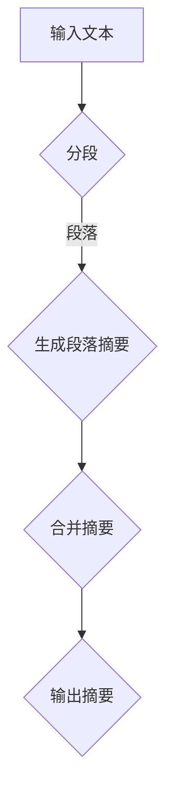

在这个流程图中，A表示输入文本，B是分段的操作，C是生成段落摘要的节点，D是合并摘要的节点，E是输出摘要的节点。

##### 3.2.2 文本分类

文本分类是指将文本数据分为预定义的类别。动态prompt在文本分类中的应用主要体现在以下几个方面：

1. **类别调整**：根据新的类别需求，动态调整分类模型。
2. **数据增强**：根据分类任务的需求，动态生成额外的训练数据。
3. **分类效果优化**：通过动态调整prompt，优化分类模型的分类效果。

以下是一个基于动态prompt生成的文本分类的mermaid流程图：

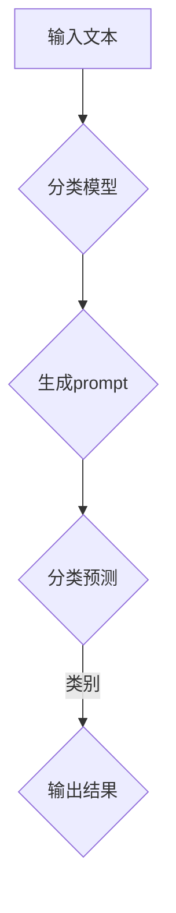

在这个流程图中，A表示输入文本，B是分类模型的节点，C是生成prompt的节点，D是分类预测的节点，E是输出结果的节点。

##### 3.2.3 文本生成与问答

文本生成与问答是LLM任务中的典型应用。动态prompt生成技术在文本生成与问答中的应用主要体现在以下几个方面：

1. **问题理解**：动态prompt可以根据用户提出的问题，生成相应的回答。
2. **回答优化**：根据回答的质量和用户反馈，动态调整回答的内容。
3. **多轮对话**：在多轮对话中，动态prompt可以根据对话历史，生成更自然、连贯的对话回答。

以下是一个基于动态prompt生成的文本生成与问答的mermaid流程图：

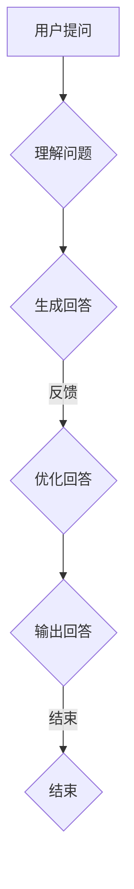

在这个流程图中，A表示用户提问，B是理解问题的节点，C是生成回答的节点，D是优化回答的节点，E是输出回答的节点，F是结束的节点。

##### 3.3 动态prompt在图像生成中的应用

图像生成是计算机视觉领域的一个重要任务，包括图像修复、图像合成、风格迁移等。动态prompt生成技术在图像生成中的应用主要体现在以下几个方面：

1. **图像风格**：动态prompt可以根据用户的要求，生成特定风格的图像。
2. **图像内容**：动态prompt可以根据文本描述，生成符合描述的图像内容。
3. **图像优化**：动态prompt可以根据图像质量的要求，优化图像的生成过程。

以下是一个基于动态prompt生成的图像生成的mermaid流程图：

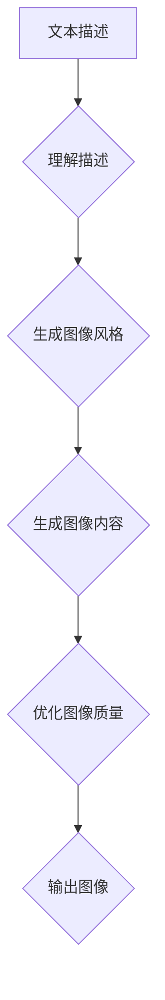

在这个流程图中，A表示文本描述，B是理解描述的节点，C是生成图像风格的节点，D是生成图像内容的节点，E是优化图像质量的节点，F是输出图像的节点。

##### 3.3.1 图像分类

图像分类是指将图像分为预定义的类别。动态prompt在图像分类中的应用主要体现在以下几个方面：

1. **类别调整**：根据新的类别需求，动态调整分类模型。
2. **数据增强**：根据分类任务的需求，动态生成额外的训练数据。
3. **分类效果优化**：通过动态调整prompt，优化分类模型的分类效果。

以下是一个基于动态prompt生成的图像分类的mermaid流程图：

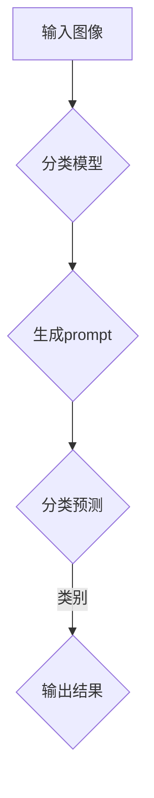

在这个流程图中，A表示输入图像，B是分类模型的节点，C是生成prompt的节点，D是分类预测的节点，E是输出结果的节点。

##### 3.3.2 图像分割

图像分割是指将图像划分为不同的区域。动态prompt在图像分割中的应用主要体现在以下几个方面：

1. **分割算法**：动态prompt可以根据图像的内容和分割的要求，选择合适的分割算法。
2. **分割效果优化**：动态prompt可以根据分割的结果和用户反馈，优化分割效果。
3. **多模态分割**：动态prompt可以结合文本描述，实现多模态的图像分割。

以下是一个基于动态prompt生成的图像分割的mermaid流程图：

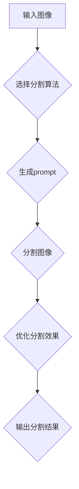

在这个流程图中，A表示输入图像，B是选择分割算法的节点，C是生成prompt的节点，D是分割图像的节点，E是优化分割效果的节点，F是输出分割结果的节点。

##### 3.3.3 图像生成

图像生成是指根据特定的需求，生成符合预期的图像。动态prompt在图像生成中的应用主要体现在以下几个方面：

1. **图像风格**：动态prompt可以根据用户的要求，生成特定风格的图像。
2. **图像内容**：动态prompt可以根据文本描述，生成符合描述的图像内容。
3. **图像优化**：动态prompt可以根据图像质量的要求，优化图像的生成过程。

以下是一个基于动态prompt生成的图像生成的mermaid流程图：


在这个流程图中，A表示文本描述，B是理解描述的节点，C是生成图像风格的节点，D是生成图像内容的节点，E是优化图像质量的节点，F是输出图像的节点。

##### 3.4 动态prompt在机器翻译中的应用

机器翻译是将一种语言的文本翻译成另一种语言。动态prompt生成技术在机器翻译中的应用主要体现在以下几个方面：

1. **源语言理解**：动态prompt可以根据源语言的文本，生成对应的翻译提示。
2. **目标语言生成**：动态prompt可以根据目标语言的要求，生成符合语法和语义的翻译结果。
3. **翻译效果优化**：动态prompt可以根据翻译结果的反馈，优化翻译效果。

以下是一个基于动态prompt生成的机器翻译的mermaid流程图：

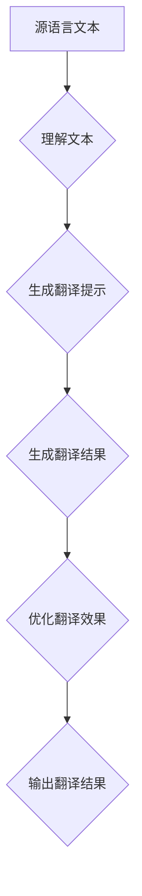

在这个流程图中，A表示源语言文本，B是理解文本的节点，C是生成翻译提示的节点，D是生成翻译结果的节点，E是优化翻译效果的节点，F是输出翻译结果的节点。

##### 3.4.1 翻译模型

翻译模型是机器翻译的核心组成部分。动态prompt生成技术在翻译模型中的应用主要体现在以下几个方面：

1. **模型选择**：动态prompt可以根据翻译任务的需求，选择合适的翻译模型。
2. **模型优化**：动态prompt可以根据翻译结果和用户反馈，优化翻译模型的性能。
3. **多语言翻译**：动态prompt可以支持多种语言的翻译，实现跨语言的动态翻译。

以下是一个基于动态prompt生成的翻译模型的mermaid流程图：

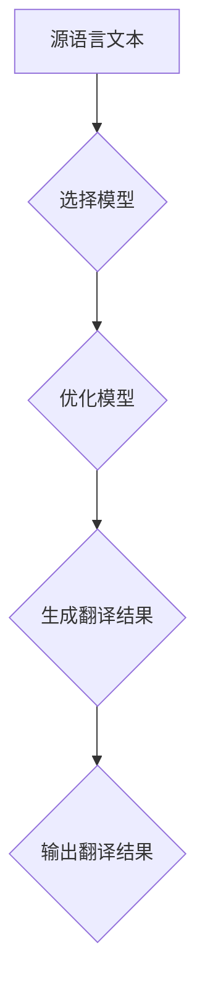

在这个流程图中，A表示源语言文本，B是选择模型的节点，C是优化模型的节点，D是生成翻译结果的节点，E是输出翻译结果的节点。

##### 3.4.2 动态prompt在机器翻译中的作用

动态prompt在机器翻译中的作用主要体现在以下几个方面：

1. **提高翻译质量**：动态prompt可以根据源语言文本的上下文，生成更准确的翻译结果。
2. **增强翻译灵活性**：动态prompt可以根据用户的需求，调整翻译模型的行为，实现更灵活的翻译。
3. **优化用户体验**：动态prompt可以根据用户的反馈，动态调整翻译结果，提供更个性化的服务。

##### 3.4.3 翻译质量评估

翻译质量评估是衡量机器翻译效果的重要指标。动态prompt生成技术在翻译质量评估中的应用主要体现在以下几个方面：

1. **评估指标**：动态prompt可以根据评估需求，选择合适的评估指标，如BLEU、METEOR等。
2. **评估方法**：动态prompt可以结合自动化评估和人工评估，提高评估的准确性。
3. **评估优化**：动态prompt可以根据评估结果，优化翻译模型和翻译策略，提高翻译质量。

以下是一个基于动态prompt生成的翻译质量评估的mermaid流程图：

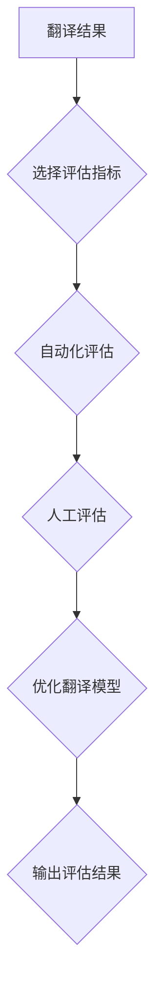

在这个流程图中，A表示翻译结果，B是选择评估指标的节点，C是自动化评估的节点，D是人工评估的节点，E是优化翻译模型的节点，F是输出评估结果的节点。

---

通过本章的讲解，我们详细探讨了动态prompt生成在多变的LLM任务中的应用，包括文本生成、图像生成、机器翻译等。在下一章中，我们将进一步探讨动态prompt生成在特定领域中的应用，分析其在医疗、教育和金融等领域的实际应用效果。

#### 第4章：动态prompt生成在特定领域中的应用

##### 4.1 医疗领域

医疗领域是一个高度专业化和信息密集的领域，动态prompt生成技术在医疗文本生成和医学图像分析中展现了其强大的应用潜力。

##### 4.1.1 医学文本生成

医学文本生成包括病历生成、诊断报告生成等任务。动态prompt生成在医学文本生成中的应用主要体现在以下几个方面：

1. **病历生成**：动态prompt可以根据患者的病史、检查结果和医生的建议，生成详细的病历。
2. **诊断报告生成**：动态prompt可以根据医生的诊断和检查结果，生成专业的诊断报告。
3. **患者教育材料**：动态prompt可以生成针对患者健康教育的内容，帮助患者更好地理解疾病和治疗方案。

以下是一个基于动态prompt生成的医学文本生成的mermaid流程图：

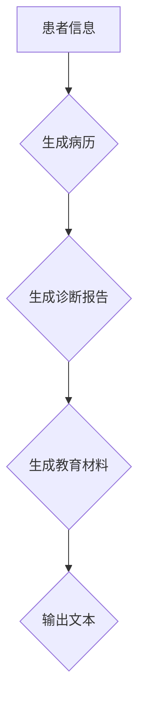

在这个流程图中，A表示患者信息，B是生成病历的节点，C是生成诊断报告的节点，D是生成教育材料的节点，E是输出文本的节点。

##### 4.1.2 医学图像分析

医学图像分析包括X光、CT、MRI等图像的解读和分析。动态prompt生成在医学图像分析中的应用主要体现在以下几个方面：

1. **图像分类**：动态prompt可以根据图像的特征，分类图像的类型。
2. **病变检测**：动态prompt可以根据医学知识库，检测图像中的病变区域。
3. **辅助诊断**：动态prompt可以生成辅助诊断建议，帮助医生做出更准确的诊断。

以下是一个基于动态prompt生成的医学图像分析的mermaid流程图：

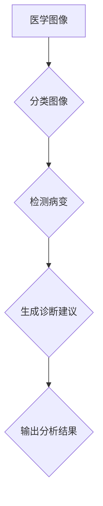

在这个流程图中，A表示医学图像，B是分类图像的节点，C是检测病变的节点，D是生成诊断建议的节点，E是输出分析结果的节点。

##### 4.2 教育领域

教育领域是一个关注个性化和高效学习的领域，动态prompt生成技术在学生问答系统和课程内容生成中发挥了重要作用。

##### 4.2.1 学生问答系统

学生问答系统旨在帮助学生解答学习中遇到的问题。动态prompt生成在学生问答系统中的应用主要体现在以下几个方面：

1. **问题理解**：动态prompt可以根据学生提出的问题，理解问题的核心。
2. **答案生成**：动态prompt可以根据问题理解的结果，生成详细的答案。
3. **互动反馈**：动态prompt可以生成互动式的问题，促进学生的学习。

以下是一个基于动态prompt生成的学生问答系统的mermaid流程图：

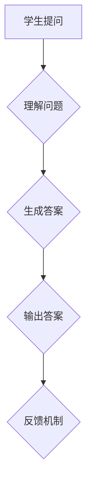

在这个流程图中，A表示学生提问，B是理解问题的节点，C是生成答案的节点，D是输出答案的节点，E是反馈机制的节点。

##### 4.2.2 课程内容生成

课程内容生成旨在生成个性化的学习材料，以适应不同学生的学习需求。动态prompt生成在课程内容生成中的应用主要体现在以下几个方面：

1. **内容规划**：动态prompt可以根据课程目标和学生学习进度，规划课程内容。
2. **材料生成**：动态prompt可以根据课程内容，生成相应的教学材料，如图文、视频、习题等。
3. **互动设计**：动态prompt可以生成互动式的内容，提高学生的学习兴趣。

以下是一个基于动态prompt生成的课程内容生成的mermaid流程图：

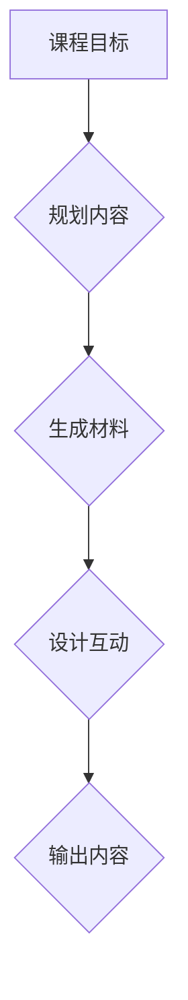

在这个流程图中，A表示课程目标，B是规划内容的节点，C是生成材料的节点，D是设计互动的节点，E是输出内容的节点。

##### 4.3 金融领域

金融领域是一个数据密集和信息敏感的领域，动态prompt生成技术在金融报告生成和金融风险预测中有着广泛的应用。

##### 4.3.1 金融报告生成

金融报告生成包括财务报表、市场分析报告等。动态prompt生成在金融报告生成中的应用主要体现在以下几个方面：

1. **数据整合**：动态prompt可以根据不同的数据源，整合生成报告所需的数据。
2. **报告生成**：动态prompt可以根据数据整合的结果，生成高质量的金融报告。
3. **数据可视化**：动态prompt可以生成直观的数据可视化图表，提高报告的可读性。

以下是一个基于动态prompt生成的金融报告生成的mermaid流程图：

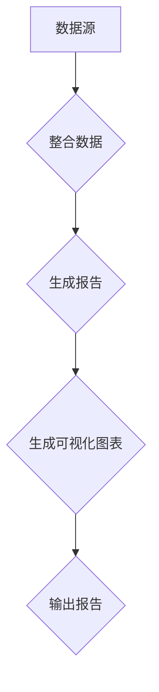

在这个流程图中，A表示数据源，B是整合数据的节点，C是生成报告的节点，D是生成可视化图表的节点，E是输出报告的节点。

##### 4.3.2 金融风险预测

金融风险预测包括信用评分、市场风险预测等。动态prompt生成在金融风险预测中的应用主要体现在以下几个方面：

1. **数据预处理**：动态prompt可以根据预测任务的需求，预处理金融数据。
2. **风险模型**：动态prompt可以根据预处理的金融数据，构建风险预测模型。
3. **风险评估**：动态prompt可以根据风险预测模型，评估金融产品的风险。

以下是一个基于动态prompt生成的金融风险预测的mermaid流程图：

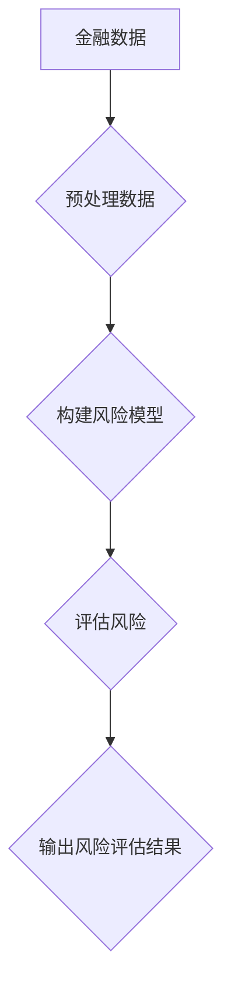

在这个流程图中，A表示金融数据，B是预处理数据的节点，C是构建风险模型的节点，D是评估风险的节点，E是输出风险评估结果的节点。

---

通过本章的讲解，我们详细探讨了动态prompt生成在医疗、教育和金融等领域的应用。这些应用展示了动态prompt生成技术在应对多样化任务需求方面的强大能力。在下一章中，我们将通过具体案例，进一步分析动态prompt生成技术的实际应用效果。

#### 第5章：动态prompt生成实践案例分析

##### 5.1 案例一：动态prompt在新闻摘要中的应用

新闻摘要是对一篇较长的新闻文章进行简短的概括，帮助读者快速了解新闻的主要内容。动态prompt在新闻摘要中的应用可以有效提高摘要的生成质量和效率。

##### 5.1.1 案例背景

某新闻网站希望利用动态prompt生成技术，为其用户提供个性化的新闻摘要服务。用户可以根据自己的兴趣选择新闻类别，系统将根据用户的兴趣和新闻内容，生成高质量的新闻摘要。

##### 5.1.2 案例分析

1. **数据集准备**：收集大量新闻数据，并进行预处理，如文本清洗、分词、去停用词等操作。
2. **动态prompt生成**：使用基于序列模型的动态prompt生成算法，根据用户选择的新闻类别和新闻内容，生成适合的prompt。例如，如果用户选择的是体育新闻，则prompt中可以包含“体育赛事结果”和“运动员表现”等关键词。
3. **摘要生成**：使用训练好的语言模型，根据动态prompt生成新闻摘要。摘要生成过程中，可以使用文本生成算法，如GPT-3，来生成高质量的摘要。
4. **用户反馈**：收集用户对摘要的反馈，并根据反馈动态调整prompt，以提高摘要的质量。

以下是一个基于动态prompt生成的新闻摘要的mermaid流程图：

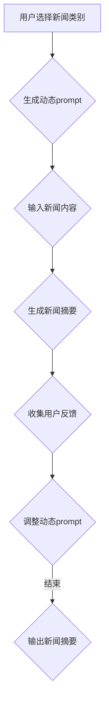

在这个流程图中，A表示用户选择新闻类别，B是生成动态prompt的节点，C是输入新闻内容的节点，D是生成新闻摘要的节点，E是收集用户反馈的节点，F是调整动态prompt的节点，G是输出新闻摘要的节点。

##### 5.1.3 案例总结

通过动态prompt生成技术，该新闻网站能够为用户提供高质量的个性化新闻摘要，提高了用户的阅读体验。同时，动态prompt生成技术也为网站提供了实时调整摘要质量的能力，从而不断优化摘要生成的效果。

##### 5.2 案例二：动态prompt在医学文本生成中的应用

医学文本生成在医疗领域具有广泛的应用，如病历生成、诊断报告生成等。动态prompt生成技术可以有效提高医学文本的生成质量和准确性。

##### 5.2.1 案例背景

某医疗机构希望利用动态prompt生成技术，为其医生提供自动化病历生成和诊断报告生成服务。医生可以根据患者的病情和检查结果，生成详细的病历和诊断报告。

##### 5.2.2 案例分析

1. **数据集准备**：收集大量医学文本数据，包括病历、诊断报告、医学文献等，并进行预处理，如文本清洗、实体识别等操作。
2. **动态prompt生成**：使用基于图神经网络的动态prompt生成算法，根据患者的病情和检查结果，生成适合的prompt。例如，如果患者患有某种疾病，则prompt中可以包含“疾病名称”、“治疗方法”和“注意事项”等关键词。
3. **文本生成**：使用训练好的语言模型，如BERT或GPT，根据动态prompt生成医学文本。在文本生成过程中，可以使用模板匹配和规则匹配等方法，确保生成的文本符合医学规范。
4. **质量评估**：对生成的医学文本进行质量评估，包括文本的准确性、完整性和可读性。根据评估结果，动态调整prompt，以提高文本生成质量。

以下是一个基于动态prompt生成的医学文本生成的mermaid流程图：

```mermaid
graph TD
A[患者信息] --> B{生成动态prompt}
B --> C{输入医学知识库}
C --> D{生成医学文本}
D --> E{评估文本质量}
E --> F{调整动态prompt}
F -->|结束| G{输出医学文本}
```

在这个流程图中，A表示患者信息，B是生成动态prompt的节点，C是输入医学知识库的节点，D是生成医学文本的节点，E是评估文本质量的节点，F是调整动态prompt的节点，G是输出医学文本的节点。

##### 5.2.3 案例总结

通过动态prompt生成技术，该医疗机构能够为医生提供自动化病历生成和诊断报告生成服务，提高了医疗工作效率。同时，动态prompt生成技术也为医疗机构提供了实时调整文本生成质量的能力，从而不断优化医学文本生成的效果。

---

通过以上两个案例，我们可以看到动态prompt生成技术在新闻摘要生成和医学文本生成等实际应用中，发挥了重要作用。动态prompt生成技术不仅提高了文本生成的质量和效率，还提供了实时调整和优化的能力，为用户提供了更好的服务体验。

#### 第6章：动态prompt生成最佳实践与优化策略

##### 6.1 最佳实践

在动态prompt生成领域，最佳实践对于提高生成质量和效率至关重要。以下是一些关键的最佳实践：

##### 6.1.1 prompt设计的技巧

1. **明确任务目标**：在生成prompt之前，明确任务的目标和要求，这是设计prompt的基础。
2. **上下文信息丰富**：提供与任务相关的上下文信息，帮助模型更好地理解任务。
3. **输入数据多样化**：使用多样化的输入数据，以提高模型的泛化能力。
4. **反馈机制有效**：设计有效的反馈机制，用于评估模型输出的正确性和质量，以便进行进一步的调整。

##### 6.1.2 数据集的选择与处理

1. **数据集质量**：选择高质量的、多样化的数据集，以提高模型的学习效果。
2. **数据预处理**：对数据集进行预处理，包括文本清洗、分词、去停用词、实体识别等操作，以提高数据的质量和一致性。
3. **数据增强**：通过数据增强方法，如数据复制、数据合成、数据旋转等，增加数据集的多样性，提高模型的适应性。

##### 6.1.3 模型优化策略

1. **模型选择**：根据任务的需求，选择合适的模型。例如，对于长文本生成任务，可以使用GPT-3等大型语言模型。
2. **超参数调优**：通过超参数调优，如学习率、批次大小、正则化参数等，优化模型的性能。
3. **训练策略**：采用有效的训练策略，如学习率衰减、批量归一化、数据增强等，提高模型的训练效果。

##### 6.2 优化策略

在动态prompt生成过程中，优化策略对于提高生成质量和效率至关重要。以下是一些关键的优化策略：

##### 6.2.1 模型结构优化

1. **神经网络结构**：设计复杂的神经网络结构，如Transformer、BERT等，以提高模型的表示能力。
2. **多模态融合**：结合多种数据类型，如文本、图像、音频等，实现更强大的动态prompt生成。
3. **注意力机制**：引入注意力机制，如Self-Attention、Multi-Head Attention等，提高模型对输入数据的理解和处理能力。

##### 6.2.2 损失函数优化

1. **交叉熵损失函数**：使用交叉熵损失函数，以最小化预测标签和真实标签之间的差异。
2. **对比损失函数**：使用对比损失函数，如对比损失（Contrastive Loss）或对抗性损失（Adversarial Loss），提高模型的区分能力。
3. **加权损失函数**：根据任务的需求，设计加权的损失函数，以平衡不同类型损失的重要性。

##### 6.2.3 训练策略优化

1. **动态学习率**：采用动态学习率策略，如学习率衰减、指数衰减等，以提高模型的收敛速度。
2. **数据增强**：在训练过程中，采用数据增强策略，如数据复制、数据合成、数据旋转等，增加数据集的多样性。
3. **并行训练**：利用并行计算技术，如多GPU训练、分布式训练等，提高训练速度。

---

通过以上最佳实践和优化策略，我们可以显著提高动态prompt生成的质量和效率。在下一章中，我们将展望动态prompt生成技术的未来发展趋势和潜在挑战。

#### 第7章：动态prompt生成未来展望

##### 7.1 技术发展趋势

随着深度学习技术的不断进步，动态prompt生成技术也在快速发展。未来的发展趋势主要体现在以下几个方面：

##### 7.1.1 基于深度学习的动态prompt生成

深度学习技术的快速发展为动态prompt生成提供了强大的支持。未来，基于深度学习的动态prompt生成技术将继续优化和改进，以提高模型的效果和适应性。例如，通过引入新的神经网络架构，如Transformer-XL、GPT-4等，进一步扩展模型的表示能力和计算效率。

##### 7.1.2 基于知识增强的动态prompt生成

知识增强（Knowledge Augmentation）技术将为动态prompt生成提供新的思路。通过将外部知识库（如百科全书、专业数据库等）与模型训练过程相结合，可以显著提高模型的理解能力和泛化能力。未来的研究可能会集中在如何有效地融合外部知识和内部模型表示，实现更强大的动态prompt生成。

##### 7.1.3 基于多模态融合的动态prompt生成

多模态融合（Multimodal Fusion）技术是当前的研究热点。通过结合多种数据类型（如文本、图像、音频等），可以实现更丰富的信息表示和更高的任务效果。未来，基于多模态融合的动态prompt生成技术将不断发展，以实现更智能、更灵活的动态prompt生成。

##### 7.2 挑战与机遇

尽管动态prompt生成技术在多个领域取得了显著成果，但仍然面临一些挑战。以下是一些主要的挑战和机遇：

##### 7.2.1 数据隐私保护

在动态prompt生成过程中，大量的数据被用于模型训练和优化。如何保护用户隐私，防止数据泄露，是一个亟待解决的问题。未来的研究可能会集中在隐私保护技术（如差分隐私、联邦学习等）在动态prompt生成中的应用，以实现数据隐私和安全。

##### 7.2.2 伦理与法律问题

动态prompt生成技术可能会引发一系列伦理和法律问题。例如，如何确保模型生成的文本内容符合道德规范和法律法规，如何防止模型被滥用等。未来，需要制定相应的伦理和法律框架，以规范动态prompt生成技术的应用和发展。

##### 7.2.3 模型可解释性

动态prompt生成模型的黑箱特性使得其可解释性成为一个重要的研究课题。如何提高模型的可解释性，使其行为更加透明，以便于用户理解和信任，是一个重要的挑战。未来的研究可能会集中在开发可解释性模型和工具，以提高动态prompt生成技术的可解释性和可信度。

##### 7.3 未来研究方向

基于当前的技术发展趋势和面临的挑战，以下是一些未来研究的方向：

##### 7.3.1 深度强化学习

深度强化学习（Deep Reinforcement Learning）技术在动态prompt生成中具有巨大潜力。通过将强化学习与深度学习相结合，可以训练出更加智能和适应性强的动态prompt生成模型。未来的研究可能会集中在如何有效地整合深度强化学习与动态prompt生成技术，实现更高效的任务执行。

##### 7.3.2 多模态动态prompt生成

多模态动态prompt生成技术将结合多种数据类型，实现更丰富和智能的prompt生成。未来的研究可能会集中在开发新的多模态融合算法，提高模型在多种数据类型上的表示能力和任务效果。

##### 7.3.3 自适应动态prompt生成

自适应动态prompt生成技术可以根据用户的需求和上下文环境，动态调整prompt的生成过程。未来的研究可能会集中在如何设计自适应机制，实现更加智能和个性化的动态prompt生成。

##### 7.3.4 知识增强动态prompt生成

知识增强动态prompt生成技术将结合外部知识库和内部模型表示，提高模型的理解能力和泛化能力。未来的研究可能会集中在如何有效地融合外部知识和内部模型，实现更强大的动态prompt生成。

---

通过本章的展望，我们可以看到动态prompt生成技术在未来有着广阔的发展前景。尽管面临一些挑战，但随着技术的不断进步和研究的深入，动态prompt生成技术有望在多个领域发挥更大的作用，为人工智能的发展做出重要贡献。

---

# 动态prompt生成：适应多变的LLM任务

关键词：动态prompt、自然语言处理、机器学习、计算机视觉、机器翻译

摘要：本文详细介绍了动态prompt生成技术的基础概念、技术原理及其在不同领域的应用。通过分析动态prompt生成在文本生成、图像生成、机器翻译等任务中的应用案例，展示了其在提高模型适应性、优化任务效果和增强用户体验方面的优势。同时，本文还探讨了动态prompt生成的最佳实践和优化策略，以及未来可能的研究方向，为读者提供了全面的了解和深入的见解。

作者：AI天才研究院/AI Genius Institute & 禅与计算机程序设计艺术 /Zen And The Art of Computer Programming

---

在本文中，我们首先探讨了动态prompt生成的基础概念，包括问题背景、核心概念和重要性。接着，我们深入分析了动态prompt生成技术的基本概念、数学模型和关键算法。通过基于序列模型、图神经网络和强化学习的算法解析，我们详细介绍了动态prompt生成的原理和实践方法。

随后，本文探讨了动态prompt生成在多变的LLM任务中的应用，包括文本生成、图像生成、机器翻译等，并分析了其在医疗、教育和金融等特定领域中的应用效果。为了更好地理解动态prompt生成的实际应用，我们通过两个具体案例——新闻摘要生成和医学文本生成，展示了动态prompt生成技术的应用和效果。

在最佳实践与优化策略部分，我们提出了动态prompt设计的技巧、数据集的选择与处理、模型优化策略等最佳实践，以及模型结构优化、损失函数优化、训练策略优化等优化策略，为动态prompt生成技术的应用提供了实用的指导。

最后，本文展望了动态prompt生成技术的未来发展趋势，包括基于深度学习的动态prompt生成、基于知识增强的动态prompt生成和基于多模态融合的动态prompt生成等。同时，我们也讨论了数据隐私保护、伦理与法律问题、模型可解释性等面临的挑战，并提出了未来研究的方向。

通过本文的探讨，我们可以看到动态prompt生成技术在多变的LLM任务中具有广泛的应用前景。随着技术的不断进步和应用场景的拓展，动态prompt生成技术将在人工智能领域发挥越来越重要的作用。我们期待未来的研究能够解决当前的挑战，推动动态prompt生成技术实现更大的突破，为人工智能的发展做出更大的贡献。

