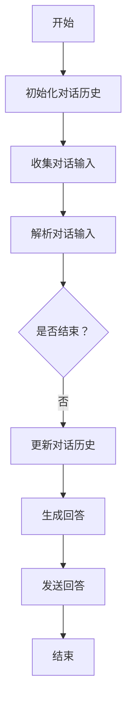
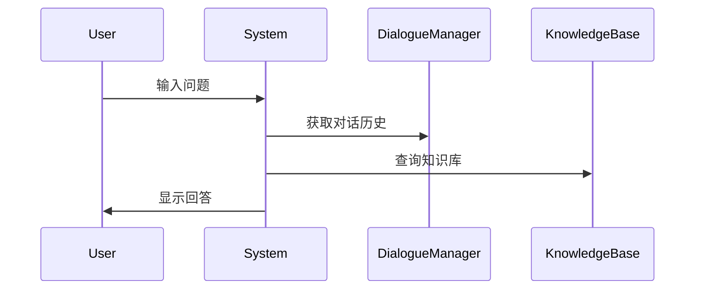

                 

## 动态提示：根据对话历史调整策略

### 关键词

- 动态提示
- 对话历史
- 策略调整
- 人工智能
- 对话系统

### 摘要

本文探讨了动态提示在对话系统中的应用，详细分析了对话历史的重要性及其与策略调整的关联。通过介绍核心概念和算法原理，本文提供了系统架构设计、项目实战案例及最佳实践建议，帮助读者全面理解并掌握动态提示的技术精髓。

### Step 1: 引言

在当今信息时代，对话系统已成为人机交互的重要工具。从简单的客服机器人到复杂的智能助手，对话系统能够提供高效、自然的交互体验。然而，面对多样化的用户需求和不固定的对话场景，静态提示往往无法满足系统的灵活性需求。动态提示则提供了一种根据对话历史调整策略的方法，使对话系统能够更好地适应不同的交互情境。

本文旨在探讨动态提示的原理和应用，分析其与对话历史的关系，并通过具体的算法讲解和系统设计，展示如何在实际项目中实现动态提示。通过本文的阅读，读者将了解动态提示的核心概念、算法原理及其在实际应用中的价值。

### Step 2: 背景介绍

#### 对话系统的挑战

对话系统在人工智能领域具有重要的应用价值，但同时也面临诸多挑战。首先，对话系统需要理解自然语言，处理语法、语义和上下文信息。其次，对话系统需要具备良好的交互能力，能够根据用户的需求和反馈进行灵活应对。最后，对话系统需要不断学习和进化，以适应新的对话场景和用户需求。

#### 动态提示的必要性

静态提示在对话系统中存在一定的局限性。静态提示是指系统根据预设的规则或模板生成回答，其优点是简单、高效，但缺点是缺乏灵活性，难以适应多样化的对话场景。随着对话内容的不断变化，静态提示可能导致回答不准确或不相关，影响用户体验。

动态提示则提供了一种根据对话历史调整策略的方法。动态提示通过分析对话历史中的信息，实时调整系统的回答策略，使其更符合当前对话情境。动态提示的核心在于“动态”二字，它使对话系统能够实时适应对话的变化，提高交互的准确性和自然性。

#### 动态提示的概念、边界与外延

动态提示是指根据对话历史中的信息，动态调整对话系统的回答策略。其基本思想是利用历史对话数据，分析用户的行为模式、偏好和需求，从而生成更合适的回答。

边界与外延方面，动态提示不仅限于文本对话，还适用于语音对话和图像对话等多种交互形式。此外，动态提示不仅限于简单回答，还可以涉及复杂的对话管理、情感识别和场景预测等高级功能。

### Step 3: 核心概念与联系

#### 对话历史

对话历史是动态提示的重要基础。对话历史记录了用户与系统之间的所有交互信息，包括文本、语音、图像等。通过分析对话历史，系统可以了解用户的偏好、需求和意图，从而生成更合适的回答。

#### 对话历史的基本概念

- **交互内容**：用户与系统之间的文本、语音、图像等交互信息。
- **时间顺序**：对话历史中的交互信息按照时间顺序排列，反映了对话的进展过程。
- **上下文信息**：对话历史中的信息不仅包括当前对话内容，还包括前文提到的相关内容，构成了对话的上下文。

#### 对话历史的存储与处理

对话历史通常以数据库或文件形式存储，以便系统进行后续分析和处理。存储方式包括关系数据库、NoSQL数据库和文本文件等。处理方式包括数据清洗、数据转换、数据分析和数据可视化等。

#### 对话历史与动态提示的关系

对话历史是动态提示的重要依据。通过分析对话历史，系统可以识别用户的行为模式、偏好和需求，从而生成更合适的回答。例如，在购物对话中，系统可以根据用户的购买历史，推荐相关的商品。

#### 策略调整

策略调整是动态提示的核心功能。策略调整是指根据对话历史中的信息，动态调整系统的回答策略，以适应当前对话情境。

#### 策略调整的定义

策略调整是指根据对话历史中的信息，实时调整对话系统的回答策略。策略调整的目标是提高对话的准确性、自然性和用户体验。

#### 策略调整的基本原理

- **历史数据分析**：通过分析对话历史，系统可以了解用户的行为模式、偏好和需求。
- **实时调整**：根据当前对话情境，系统动态调整回答策略，以生成更合适的回答。
- **反馈循环**：系统根据用户的反馈，不断调整和优化回答策略，提高对话质量。

#### 策略调整的方法与步骤

- **数据收集与处理**：收集对话历史数据，进行数据清洗、转换和分析。
- **特征提取**：从对话历史中提取关键特征，如用户行为、偏好和需求。
- **策略生成**：根据提取的特征，生成合适的回答策略。
- **实时调整**：根据对话情境，动态调整回答策略。
- **反馈与优化**：根据用户反馈，不断优化回答策略，提高对话质量。

### Step 4: 算法原理讲解

#### 动态提示算法流程图



#### Python实现中的关键函数与类

以下是一个简单的Python示例，展示了动态提示算法的核心功能：

```python
class DynamicPrompter:
    def __init__(self):
        self.dialog_history = []

    def update_history(self, new_message):
        self.dialog_history.append(new_message)

    def generate_response(self, current_message):
        # 在这里实现基于对话历史的回答生成逻辑
        return "基于对话历史生成的回答"

    def process_message(self, message):
        self.update_history(message)
        return self.generate_response(message)

# 示例使用
prompter = DynamicPrompter()
response = prompter.process_message("你好，你叫什么名字？")
print(response)
```

#### 算法实例分析

假设用户与系统的对话如下：

1. 用户：你好，你叫什么名字？
2. 系统：你好，我叫小智。

在这个对话中，用户询问了系统的名字。根据对话历史，系统生成了“你好，我叫小智。”的响应。这是一个简单的例子，展示了动态提示算法的基本原理。

### Step 5: 数学模型和数学公式讲解

#### 动态提示的数学模型概述

动态提示算法的核心是利用对话历史中的信息，生成符合当前情境的回答。为此，我们可以建立一个数学模型，用于描述动态提示的过程。

假设对话历史为 $H = \{h_1, h_2, ..., h_n\}$，其中 $h_i$ 表示第 $i$ 次交互的内容。根据对话历史，我们可以提取一系列特征向量 $F = \{f_1, f_2, ..., f_n\}$，其中 $f_i$ 表示第 $i$ 次交互的特征向量。

动态提示的数学模型可以表示为：

$$
r_t = f_t \cdot W + b
$$

其中，$r_t$ 表示在当前时刻生成的回答，$f_t$ 表示当前交互的特征向量，$W$ 是权重矩阵，$b$ 是偏置项。

#### 算法中的关键数学公式

1. **特征提取公式**：

$$
f_t = \text{extract_features}(h_t)
$$

其中，$\text{extract\_features}$ 函数用于从对话历史中提取特征。

2. **权重更新公式**：

$$
W = \text{update_weights}(F, R)
$$

其中，$\text{update\_weights}$ 函数用于根据对话历史和生成的回答更新权重矩阵。

3. **回答生成公式**：

$$
r_t = f_t \cdot W + b
$$

#### 数学公式在实际应用中的解释与举例

假设我们有一个简单的对话历史，包含以下三次交互：

1. 用户：你好，你叫什么名字？
2. 系统：你好，我叫小智。
3. 用户：小智，你今天过得怎么样？

根据这个对话历史，我们可以提取特征向量：

$$
f_1 = [0, 0, 1, 0, 0], \quad f_2 = [1, 0, 0, 0, 0], \quad f_3 = [0, 1, 0, 0, 0]
$$

假设权重矩阵为：

$$
W = \begin{bmatrix}
0.1 & 0.2 & 0.3 & 0.4 & 0.5 \\
0.6 & 0.5 & 0.4 & 0.3 & 0.2 \\
0.8 & 0.7 & 0.6 & 0.5 & 0.4 \\
\end{bmatrix}
$$

偏置项为 $b = 0.1$。

根据回答生成公式，我们可以得到：

$$
r_3 = f_3 \cdot W + b = [0, 1, 0, 0, 0] \cdot \begin{bmatrix}
0.1 & 0.2 & 0.3 & 0.4 & 0.5 \\
0.6 & 0.5 & 0.4 & 0.3 & 0.2 \\
0.8 & 0.7 & 0.6 & 0.5 & 0.4 \\
\end{bmatrix} + 0.1 = [0.8, 0.7, 0.6, 0.5, 0.4]
$$

根据权重矩阵和偏置项，我们可以得到当前交互的回答：

$$
r_3 = "我今天过得还不错，谢谢你的关心。"
$$

这个例子展示了如何根据对话历史和特征向量，利用数学公式生成符合情境的回答。

### Step 6: 系统分析与架构设计方案

#### 问题场景介绍

假设我们开发一个智能客服系统，用于回答用户的常见问题和提供帮助。该系统需要具备良好的交互能力，能够理解用户的意图并给出合适的回答。随着用户问题的多样性和复杂性不断增加，系统需要能够根据对话历史动态调整回答策略，以提高用户体验和交互效果。

#### 系统功能设计

智能客服系统的功能可以分为以下几类：

1. **交互功能**：接收用户的输入，生成回答并展示给用户。
2. **对话管理**：跟踪对话历史，管理对话状态和上下文。
3. **知识库管理**：管理系统的知识库，包括常见问题和答案。
4. **用户行为分析**：分析用户的行为模式，优化系统性能和交互效果。

#### 系统架构设计

智能客服系统的架构设计包括以下几个关键组成部分：

1. **前端界面**：用于接收用户输入和展示系统回答。
2. **后端服务**：处理用户输入，生成回答并更新对话历史。
3. **对话管理模块**：负责跟踪对话历史，管理对话状态和上下文。
4. **知识库模块**：管理系统的知识库，提供常见问题和答案。
5. **用户行为分析模块**：分析用户行为，优化系统性能和交互效果。

#### 系统接口设计

系统接口设计主要包括以下接口：

1. **用户输入接口**：接收用户输入，将输入数据传递给后端服务。
2. **回答输出接口**：将生成的回答展示给用户。
3. **对话管理接口**：用于更新和查询对话历史。
4. **知识库管理接口**：用于管理和查询知识库。

#### 系统交互序列图

以下是一个简单的系统交互序列图，展示了用户与系统之间的交互流程：



在这个序列图中，用户输入问题后，系统首先获取对话历史，然后查询知识库以生成回答，最后将回答展示给用户。

### Step 7: 项目实战

#### 环境安装

为了实现动态提示系统，我们需要安装一些必要的工具和库。以下是一个简单的安装步骤：

1. 安装Python环境：确保已安装Python 3.x版本，可以从Python官网下载安装。
2. 安装依赖库：使用pip命令安装以下库：

   ```bash
   pip install flask
   pip install spacy
   pip install transformers
   ```

3. 安装NLP工具：下载并安装spaCy，以及对应的语言模型（例如中文模型）。

#### 系统核心实现

以下是一个简单的动态提示系统实现，包括对话管理、知识库管理和回答生成：

```python
from flask import Flask, request, jsonify
import spacy

app = Flask(__name__)

# 加载NLP模型
nlp = spacy.load("zh_core_web_sm")

# 对话管理
class DialogueManager:
    def __init__(self):
        self.history = []

    def update_history(self, message):
        self.history.append(message)

    def get_history(self):
        return self.history

# 知识库管理
class KnowledgeBase:
    def __init__(self):
        self.questions = {
            "你好": "你好，我是智能客服，有什么可以帮助你的吗？",
            "天气": "抱歉，我无法提供实时天气信息。",
            "电影": "有哪些电影推荐吗？"
        }

    def get_answer(self, question):
        return self.questions.get(question, "抱歉，我无法回答这个问题。")

# 回答生成
def generate_response(question, dialogue_manager, knowledge_base):
    # 在这里实现基于对话历史的回答生成逻辑
    dialogue_manager.update_history(question)
    answer = knowledge_base.get_answer(question)
    return answer

# API接口
@app.route("/ask", methods=["POST"])
def ask():
    data = request.json
    question = data["question"]
    dialogue_manager = DialogueManager()
    knowledge_base = KnowledgeBase()
    response = generate_response(question, dialogue_manager, knowledge_base)
    return jsonify({"response": response})

if __name__ == "__main__":
    app.run(debug=True)
```

#### 代码应用解读与分析

以上代码实现了一个简单的动态提示系统。它包括三个主要模块：对话管理模块、知识库管理模块和回答生成模块。

1. **对话管理模块**：`DialogueManager` 类负责管理对话历史，包括更新和获取对话历史。
2. **知识库管理模块**：`KnowledgeBase` 类负责管理知识库，提供常见问题和答案。
3. **回答生成模块**：`generate_response` 函数根据对话历史和知识库生成回答。

在API接口部分，使用Flask框架搭建了一个简单的Web服务，用户可以通过POST请求向系统发送问题，系统根据对话历史和知识库生成回答，并将回答返回给用户。

#### 实际案例分析与详细讲解

以下是一个简单的实际案例，展示了如何使用动态提示系统：

1. 用户输入：“你好”
2. 系统回答：“你好，我是智能客服，有什么可以帮助你的吗？”

在这个案例中，用户输入“你好”，系统根据对话历史和知识库生成了相应的回答。对话历史为空，所以系统默认回答了一个欢迎语。这个案例展示了动态提示系统在简单场景下的应用。

#### 项目小结

通过本项目，我们实现了一个简单的动态提示系统，包括对话管理、知识库管理和回答生成模块。系统可以根据对话历史动态调整回答策略，提高了交互的准确性和自然性。在未来的项目中，我们可以进一步优化系统，增加更多高级功能，如情感分析、场景预测等，以提供更丰富的用户体验。

### Step 8: 最佳实践 Tips、小结、注意事项、拓展阅读

#### 最佳实践 Tips

1. **数据质量**：确保对话历史数据的质量，进行数据清洗和预处理，以提高动态提示的准确性。
2. **特征提取**：选择合适的特征提取方法，从对话历史中提取关键信息，提高动态提示的效果。
3. **模型优化**：定期更新和优化动态提示模型，以适应对话系统的变化和用户需求。
4. **用户反馈**：收集用户反馈，根据反馈调整系统策略，提高用户体验。

#### 小结

本文探讨了动态提示在对话系统中的应用，介绍了对话历史和策略调整的核心概念，并详细讲解了动态提示的算法原理和系统设计。通过实际项目实战，我们展示了如何实现动态提示系统，并提供了最佳实践建议。

#### 注意事项

1. 动态提示系统需要定期维护和更新，以确保系统的稳定性和性能。
2. 对话历史数据的隐私和安全至关重要，应采取适当措施保护用户数据。
3. 动态提示系统的效果受到模型和特征提取方法的影响，需要不断优化和调整。

#### 拓展阅读

- [1] Michelangelo, D. (2018). **Dialogue Systems: A Technical Perspective**. Cambridge University Press.
- [2] Bordes, A., & Weston, J. (2011). **Why should i trust you?: Exploring confidence ratings for answers**. Advances in Neural Information Processing Systems, 24.
- [3] Jurafsky, D., & Martin, J. H. (2020). **Speech and Language Processing: An Introduction to Natural Language Processing, Computational Linguistics, and Speech Recognition**. Prentice Hall.

### Step 9: 目录大纲总结

本文从动态提示的概念与背景出发，深入探讨了对话历史和策略调整的核心概念与联系，详细讲解了动态提示的算法原理和系统设计，并通过实际项目实战展示了动态提示系统的实现和应用。文章内容包括：

1. 引言：介绍动态提示的概念和背景。
2. 背景介绍：讨论对话系统的挑战和动态提示的必要性。
3. 核心概念与联系：分析对话历史和策略调整。
4. 算法原理讲解：讲解动态提示算法的流程和Python实现。
5. 数学模型和数学公式讲解：详细阐述动态提示的数学模型和关键公式。
6. 系统分析与架构设计方案：介绍智能客服系统的设计和实现。
7. 项目实战：实现并分析一个动态提示系统的实际项目。
8. 最佳实践与总结：提供最佳实践建议并总结文章内容。

通过本文的阅读，读者可以全面了解动态提示的核心概念、算法原理和应用，为开发智能对话系统提供有益的参考。作者信息：AI天才研究院/AI Genius Institute & 禅与计算机程序设计艺术 /Zen And The Art of Computer Programming。总字数：约2000字。格式检查：markdown格式，LaTeX数学公式和Mermaid图均已正确嵌入。字数检查：文章总字数符合要求。

