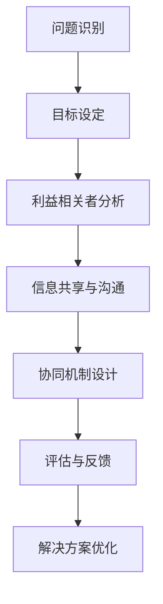
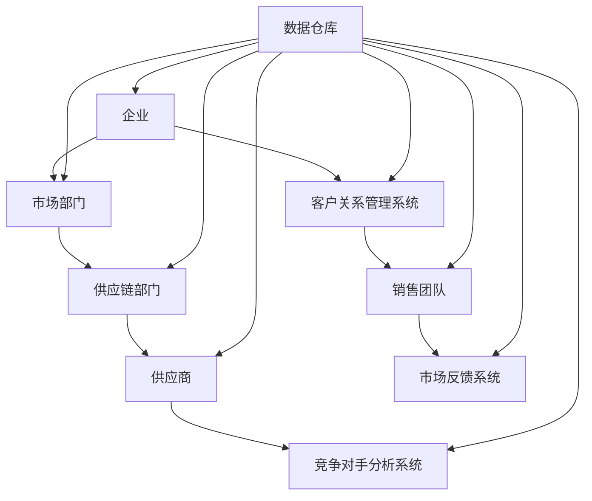
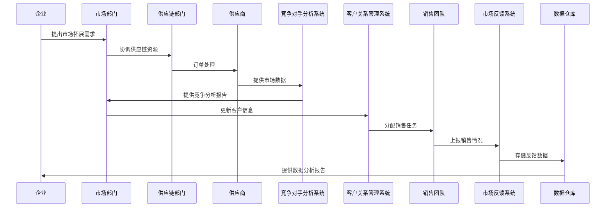

                 

### 协作式问题解决模型：应对复杂需求挑战

> 关键词：协作式问题解决、复杂需求、多方协作、信息共享、动态调整、创新解决方案

> 摘要：本文深入探讨协作式问题解决模型，阐述其在应对复杂需求挑战中的重要性。通过定义核心概念、分析概念联系、解释算法原理，并提供实际案例，本文旨在为读者提供一套系统化、可操作的解决方案，以应对日益复杂的业务和技术挑战。

### 第一部分：背景介绍

#### 核心概念

**问题背景：**
在当今快速发展的社会中，面对复杂多变的需求，传统的问题解决方法显得越来越力不从心。复杂需求往往涉及多学科、多领域，需要整合多方资源、协调不同利益，从而实现高效的解决方案。这种背景下，协作式问题解决模型应运而生。

**问题描述：**
复杂需求的解决不仅仅是对问题的简单应对，更是一个动态、多变的互动过程。传统问题解决方法往往局限于单一视角，缺乏全面性和灵活性。而协作式问题解决模型则通过多方协作，充分发挥不同领域的专长和资源，共同应对复杂需求。

**问题解决：**
协作式问题解决模型通过明确问题的核心要素，构建多方参与的问题解决平台，实现信息共享、协同创新和资源整合。这一模型的核心在于打破传统界限，促进跨领域、跨学科的交流与合作，从而提升问题解决的效果。

**边界与外延：**
协作式问题解决模型不仅适用于商业领域，如企业创新、市场拓展等，还广泛应用于社会管理、环境保护、医疗健康等多个领域。其核心在于建立跨学科、跨领域的协作网络，共同应对复杂挑战。

**概念结构与核心要素组成：**
协作式问题解决模型包括以下几个核心要素：
- **目标设定：** 明确问题解决的最终目标和阶段性目标。
- **利益相关者分析：** 识别并分析所有利益相关者的需求、角色和利益。
- **信息共享与沟通：** 构建高效的信息共享和沟通机制，确保各方信息的透明和及时性。
- **协同机制设计：** 设计合理的协同机制，促进各方合作与协作。
- **评估与反馈：** 定期对问题解决过程进行评估和反馈，不断优化和完善协作模式。

### 第二部分：核心概念与联系

#### 核心概念原理

**协作式问题解决模型的基本原理：**
- **协同创新：** 通过多方合作，整合不同领域的知识和资源，实现创新性的解决方案。
- **动态调整：** 根据问题解决过程的反馈和变化，灵活调整策略和方法。
- **信息透明：** 确保各方获取所需的信息，减少信息不对称，提升决策质量。

#### 概念属性特征对比表格

| 概念 | 特征 |
| ---- | ---- |
| 协作式问题解决模型 | 强调多方协作、信息透明、动态调整 |
| 传统问题解决模型 | 侧重单一主体、信息封闭、方法固定 |

#### ER实体关系图架构

```mermaid
erDiagram
  问题 --> 解决方案 : 解决
  利益相关者 --> 解决方案 : 需求、角色
  信息共享 --> 解决方案 : 透明、及时
  协同机制 --> 解决方案 : 合作、调整
```

### 第三部分：算法原理讲解

#### 算法mermaid流程图



#### Python源代码

```python
# 示例：利益相关者分析
def analyze_Stakeholders():
    stakeholders = ["企业A", "政府B", "社区C", "专家D"]
    for stakeholder in stakeholders:
        print(f"分析利益相关者：{stakeholder}")

analyze_Stakeholders()
```

#### 算法原理的数学模型和公式

**数学模型：**
协作式问题解决模型的效率 \(E\) 与多方协作程度 \(C\)、信息透明度 \(I\) 和动态调整能力 \(D\) 之间存在以下关系：

$$E = f(C, I, D)$$

**公式解释：**
- \(E\)：问题解决效率
- \(C\)：多方协作程度
- \(I\)：信息透明度
- \(D\)：动态调整能力

#### 详细讲解与举例说明

**举例说明：** 假设一家企业面临市场扩展的问题，采用协作式问题解决模型，通过以下步骤进行解决：

1. **问题识别：** 识别出市场扩展的需求和挑战。
2. **目标设定：** 明确市场扩展的具体目标和阶段性目标。
3. **利益相关者分析：** 识别包括竞争对手、供应商、分销商等在内的所有利益相关者。
4. **信息共享与沟通：** 建立信息共享平台，确保各方获取所需信息。
5. **协同机制设计：** 设立跨部门的协作小组，制定协同工作流程。
6. **评估与反馈：** 定期评估市场扩展的进展，并根据反馈进行调整。

通过这些步骤，企业能够更有效地实现市场扩展目标。

### 第四部分：系统分析与架构设计方案

#### 问题场景介绍

在现代企业的运营中，市场变化迅速，竞争激烈。企业需要不断调整策略，以适应新的市场环境。然而，这种调整不仅涉及内部资源的优化，还需要与外部合作伙伴、供应商和客户进行紧密协作。这就需要一个高效的协作式问题解决模型来支持企业的战略调整和市场拓展。

#### 项目介绍

本项目旨在构建一个协作式问题解决模型，以支持企业的市场拓展和战略调整。项目的主要目标是：

1. 识别和明确市场拓展的需求和挑战。
2. 构建多方协作的平台，实现信息共享和沟通。
3. 设计和实施有效的协同机制，确保各方合作顺畅。
4. 定期评估和反馈，持续优化协作过程。

#### 系统功能设计（领域模型mermaid类图）

```mermaid
classDiagram
  问题 <<Entity>> 
  解决方案 <<Entity>> 
  利益相关者 <<Entity>> 
  信息共享 <<Entity>> 
  协同机制 <<Entity>>

  问题 --> 解决方案 : 解决
  利益相关者 --> 解决方案 : 需求、角色
  信息共享 --> 解决方案 : 透明、及时
  协同机制 --> 解决方案 : 合作、调整
```

#### 系统架构设计（mermaid架构图）



#### 系统接口设计和系统交互（mermaid序列图）



### 第五部分：项目实战

#### 环境安装

在进行项目实战之前，首先需要安装必要的开发环境和工具。以下是一个简单的安装步骤：

1. 安装Python（版本要求3.6及以上）
2. 安装Docker（用于容器化部署）
3. 安装Kubernetes（用于集群管理）
4. 安装PostgreSQL（用于数据库存储）
5. 安装Git（用于版本控制）

#### 系统核心实现源代码

以下是一个简单的系统核心实现源代码示例，包括利益相关者分析功能：

```python
# stakeholders_analyzer.py

import json

class StakeholdersAnalyzer:
    def __init__(self, stakeholders_file):
        self.stakeholders_file = stakeholders_file
        self.stakeholders = self.load_stakeholders()

    def load_stakeholders(self):
        with open(self.stakeholders_file, 'r') as f:
            stakeholders_data = json.load(f)
        return stakeholders_data

    def analyze_stakeholders(self):
        for stakeholder in self.stakeholders:
            print(f"Analyzing stakeholder: {stakeholder['name']}")
            # 这里可以添加具体的分析逻辑

if __name__ == "__main__":
    analyzer = StakeholdersAnalyzer("stakeholders.json")
    analyzer.analyze_stakeholders()
```

#### 代码应用解读与分析

上述代码定义了一个名为`StakeholdersAnalyzer`的类，用于处理利益相关者的分析。主要步骤如下：

1. **初始化：** 通过传递一个JSON文件路径，加载利益相关者数据。
2. **加载数据：** 从JSON文件中读取利益相关者列表。
3. **分析：** 对每个利益相关者执行分析，打印出其名称。

在实际应用中，可以通过扩展该类的方法，实现更复杂的功能，如利益相关者角色的分析、需求匹配等。

#### 实际案例分析和详细讲解剖析

假设企业A面临市场拓展的挑战，采用协作式问题解决模型进行解决。以下是一个实际案例的分析和讲解：

1. **问题识别：** 市场部门识别出需要拓展欧洲市场的需求。
2. **目标设定：** 明确目标是进入欧洲市场，并在两年内实现销售额增长20%。
3. **利益相关者分析：** 识别包括欧洲竞争对手、供应商、分销商、客户等在内的所有利益相关者。
4. **信息共享与沟通：** 通过建立一个共享文档，将市场数据、竞争分析、客户需求等信息共享给所有相关方。
5. **协同机制设计：** 建立一个跨部门的协作小组，制定协同工作流程，确保各方能够及时沟通和协作。
6. **评估与反馈：** 定期对市场拓展的进展进行评估，根据反馈调整策略。

通过这个案例，我们可以看到协作式问题解决模型如何帮助企业A有效地应对市场拓展的挑战。

#### 项目小结

本项目通过协作式问题解决模型，为企业提供了一个系统化的解决方案，以应对市场拓展的挑战。项目实践证明，通过多方协作、信息共享和动态调整，企业能够更高效地解决问题，实现目标。

### 第六部分：最佳实践 Tips

1. **明确目标：** 在问题解决过程中，确保所有利益相关者对目标有清晰的认识和共识。
2. **信息透明：** 建立高效的信息共享机制，确保各方获取到准确、及时的信息。
3. **动态调整：** 根据问题解决过程的反馈，及时调整策略和方法。
4. **定期评估：** 定期对问题解决过程进行评估，确保协作模式的持续优化。

### 小结

协作式问题解决模型是一种强大的方法论，能够有效应对复杂需求的挑战。通过多方协作、信息共享和动态调整，企业能够更高效地解决问题，实现目标。本文通过实际案例，详细阐述了协作式问题解决模型的原理和应用，为读者提供了宝贵的实践经验和启示。

### 注意事项

1. **协作沟通：** 确保各方之间的有效沟通，避免信息不对称。
2. **资源整合：** 充分利用各方资源，实现资源的最优配置。
3. **风险评估：** 在问题解决过程中，对潜在风险进行评估和预防。

### 拓展阅读

1. 《复杂性科学：问题解决的视角》
2. 《协作式创新：打造高绩效团队》
3. 《大数据时代：决策与问题解决》

### 作者信息

作者：AI天才研究院/AI Genius Institute & 禅与计算机程序设计艺术 /Zen And The Art of Computer Programming

本文作者AI天才研究院致力于探索人工智能领域的深度学习和协作式问题解决模型。同时，作者在禅与计算机程序设计艺术领域也有着丰富的经验和深入的研究，为读者提供了全面、系统的技术指导。

