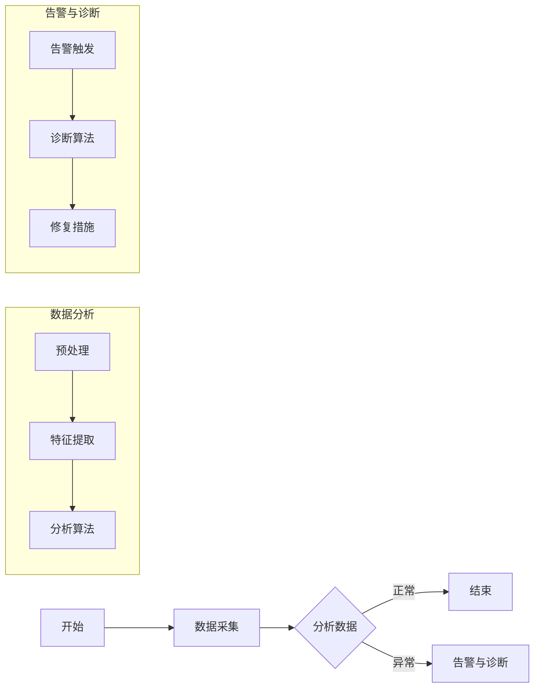
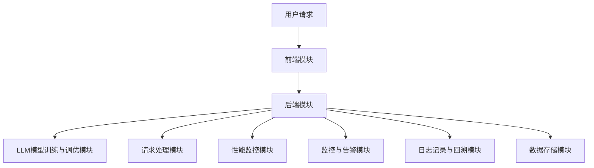
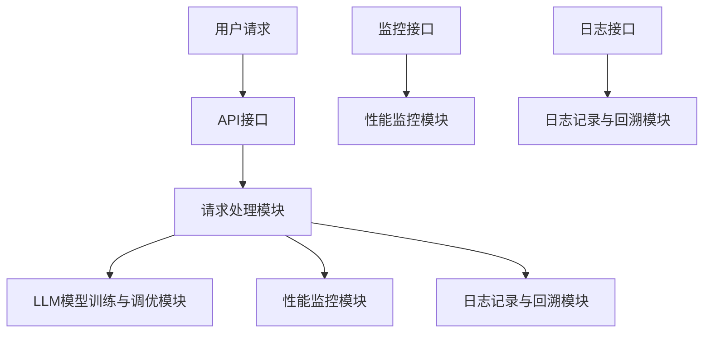

                 

## 可观测性：增强LLM应用的问题诊断能力

### 关键词：可观测性，问题诊断，LLM，机器学习，系统监控

> 摘要：本文将深入探讨可观测性在LLM（大型语言模型）应用中的重要性，分析其在提升问题诊断能力方面的关键作用。通过具体的案例和实例，我们将详细讲解如何通过增强可观测性来提升LLM的应用性能，提高问题诊断效率。文章旨在为技术从业者提供实用的指导和建议，帮助他们在实际项目中更好地应用可观测性技术，从而推动人工智能技术的发展。

### 引言

在当今快速发展的技术时代，大型语言模型（LLM）已经成为了人工智能领域的核心组成部分。从自然语言处理到智能客服、内容生成，LLM的应用场景日益广泛。然而，随着模型规模的扩大和应用复杂性的增加，如何有效诊断和解决应用中的问题变得至关重要。这便是本文要探讨的主题——可观测性。

可观测性是系统设计和运维中一个关键概念，它指的是系统能够提供足够的信息，使得系统的行为和状态可以被理解和监控。对于LLM应用来说，可观测性不仅可以帮助我们更好地理解模型的运行状态，还能够快速定位和解决问题，从而提升应用的稳定性和可靠性。

本文将分以下几个部分展开讨论：

1. **背景介绍**：介绍可观测性的核心概念、术语以及其在LLM应用中的背景和问题。
2. **核心概念与联系**：详细阐述可观测性的核心原理、属性特征以及与其他相关概念的关系。
3. **算法原理讲解**：通过具体的算法和实例，讲解如何通过增强可观测性来提升LLM的问题诊断能力。
4. **系统分析与架构设计方案**：介绍LLM应用的问题场景、系统功能设计、系统架构设计以及系统接口设计。
5. **项目实战**：通过一个实际案例，展示如何实现LLM应用中的可观测性，并进行详细解读和分析。
6. **最佳实践**：总结最佳实践，提供提升可观测性的方法和技巧。
7. **小结**：总结全文，强调可观测性在LLM应用中的重要性，并提出未来研究方向。

### 背景介绍

#### 可观测性的核心概念

可观测性（Observability）是系统设计和运维中的一个关键概念。它并不仅仅是关于数据的收集和监控，更涉及到如何通过这些数据来理解和掌控系统的行为。可观测性通常被定义为：

$$
\text{可观测性} = \text{系统外部输入} + \text{系统内部状态} + \text{系统输出}
$$

这意味着，一个高度可观测的系统应当能够提供足够的信息，使得其内部状态和问题可以通过外部输入和输出进行推断和诊断。

在系统监控和运维中，可观测性通常通过以下几个方面来衡量：

- **数据采集**：系统是否能够捕获和记录关键的性能和状态数据。
- **数据分析**：系统是否能够对这些数据进行有效分析和处理，从而提供有价值的见解。
- **可视化**：系统是否能够将数据和分析结果以直观、易于理解的方式展示给用户。
- **告警机制**：系统是否能够及时检测到异常情况，并触发相应的告警和响应措施。

#### 可观测性与LLM应用

随着大型语言模型（LLM）的广泛应用，如何保障其稳定运行和高效诊断成为了一个重要课题。LLM通常由数百万甚至数十亿个参数组成，其训练和推理过程复杂且资源密集。因此，确保LLM应用的可观测性显得尤为关键。

以下是LLM应用中可观测性的几个关键问题：

1. **模型稳定性**：确保模型在训练和推理过程中保持稳定，避免出现异常崩溃或性能下降。
2. **性能监控**：实时监控模型的性能指标，如响应时间、准确率等，以便及时发现和处理性能瓶颈。
3. **故障诊断**：当模型出现问题时，能够快速定位和诊断问题的根源，从而采取有效的修复措施。
4. **可扩展性**：随着数据量和模型规模的增加，系统应具备良好的可扩展性，以支持更复杂的应用场景。

#### 问题背景与问题描述

在实际的LLM应用中，我们常常会遇到以下问题：

- **模型异常**：在训练过程中，模型可能会因为参数调整不当、数据分布不均等原因出现异常，导致训练效果不佳。
- **性能瓶颈**：在推理过程中，模型可能因为计算资源不足、网络延迟等原因导致性能下降，影响用户体验。
- **数据偏差**：模型在处理真实数据时，可能会因为数据集的不平衡或数据质量问题出现偏差，导致输出结果不准确。
- **系统故障**：在模型部署和运行过程中，硬件故障、网络中断等意外情况可能导致系统无法正常工作。

为了解决这些问题，提升LLM应用的问题诊断能力变得至关重要。而可观测性正是实现这一目标的关键手段。

#### 问题解决与边界与外延

通过增强LLM应用的可观测性，我们可以：

- **实时监控**：实时捕获模型的运行状态和数据流，及时发现问题。
- **自动化诊断**：利用分析工具和算法，自动分析监控数据，定位问题根源。
- **可视化展示**：将监控数据和分析结果以可视化的形式展示，便于理解和决策。
- **快速响应**：根据监控结果，快速采取修复措施，降低故障影响。

然而，可观测性并非万能。在实际应用中，我们还需要考虑以下几个方面：

- **成本**：实现高可观测性需要一定的技术和资源投入，需要平衡成本与效益。
- **复杂性**：高可观测性可能会引入额外的复杂度，需要精心设计和维护。
- **隐私**：在监控和数据分析过程中，需要保护用户隐私和数据安全。

通过合理的规划和设计，我们可以充分利用可观测性技术，提升LLM应用的问题诊断能力，为人工智能技术的发展奠定坚实基础。

### 核心概念与联系

在深入探讨可观测性之前，我们需要明确几个核心概念，并理解它们在LLM应用中的联系和作用。

#### 可观测性原理

可观测性（Observability）是系统设计和运维中的一个关键属性。它不仅涉及到数据的采集和监控，还涉及到如何通过这些数据来理解和掌控系统的行为。在LLM应用中，可观测性通常通过以下几个方面来体现：

- **数据采集**：系统需要能够自动采集和记录关键的性能和状态数据，如模型训练进度、参数调整情况、响应时间、准确率等。
- **数据分析**：系统需要具备强大的数据分析能力，能够对采集到的数据进行处理和分析，从而发现潜在的问题和瓶颈。
- **可视化**：系统需要能够将分析结果以可视化形式展示，使得开发者和管理者能够直观地理解系统的运行状态和问题。
- **告警机制**：系统需要能够及时发现异常情况，并触发告警，以便快速响应和处理。

#### 可观测性属性特征

为了确保LLM应用的可观测性，我们需要考虑以下几个关键属性特征：

- **全面性**：系统需要能够采集和监控与模型运行相关的所有关键数据，确保没有遗漏。
- **准确性**：系统采集到的数据需要高度准确，避免误报或漏报。
- **实时性**：系统需要具备实时监控能力，能够及时捕捉和分析异常情况。
- **可扩展性**：系统需要能够支持不同规模和复杂度的模型和应用，确保可观测性的一致性。

#### 概念属性特征对比表格

为了更直观地理解可观测性的属性特征，我们可以将其与其他相关概念进行对比。以下是一个简化的对比表格：

| 概念        | 数据采集 | 数据分析 | 可视化 | 告警机制 |
| ----------- | -------- | -------- | ------ | -------- |
| 可观测性    | 是       | 是       | 是     | 是       |
| 监控性      | 是       | 否       | 否     | 是       |
| 监控        | 是       | 是       | 否     | 是       |
| 调试性      | 否       | 是       | 是     | 是       |

通过这个表格，我们可以看出，可观测性不仅涵盖了数据的采集和监控，还强调了数据的分析和可视化，这使得系统具备更高的诊断和问题解决能力。

#### ER实体关系图架构

为了更好地理解可观测性在LLM应用中的具体实现，我们可以使用ER（实体-关系）图来描述相关的实体和关系。以下是一个简化的ER图，展示了与可观测性相关的关键实体和关系：

```mermaid
erDiagram
  ModelData --> MonitorSystem
  ModelData --> AnalysisSystem
  MonitorSystem --> VisualizationSystem
  MonitorSystem --> AlertSystem
  AnalysisSystem --> VisualizationSystem
  AnalysisSystem --> AlertSystem
```

在这个ER图中，`ModelData`表示与LLM模型运行相关的数据，如训练进度、参数调整等；`MonitorSystem`表示监控系统，负责采集和监控这些数据；`AnalysisSystem`表示分析系统，负责对监控数据进行处理和分析；`VisualizationSystem`表示可视化系统，负责将分析结果以可视化形式展示；`AlertSystem`表示告警系统，负责及时发现和触发告警。

通过这个ER图，我们可以清晰地看到可观测性在LLM应用中的实现过程和各个组件之间的关系。

#### 可观测性与其他相关概念的关系

除了与监控性和调试性等概念的区别外，可观测性还与以下相关概念有着密切的联系：

- **监控性**：可观测性是监控性的深化和扩展。监控性主要关注系统运行状态和性能的监控，而可观测性则在此基础上，强调通过数据分析和可视化来提升问题诊断能力。
- **调试性**：调试性主要关注在系统出现问题时，如何通过调试来解决问题。可观测性则通过提供详细的监控数据和可视化结果，为调试提供了重要的依据和指导。

总之，可观测性是提升LLM应用问题诊断能力的关键手段。通过全面、准确、实时和可扩展的监控和分析，我们可以更好地理解模型的运行状态，快速发现和解决问题，从而提高LLM应用的稳定性和可靠性。

### 算法原理讲解

在了解了可观测性的核心概念和属性特征后，我们接下来将深入探讨如何通过具体的算法原理来增强LLM应用的问题诊断能力。

#### 可观测性算法的mermaid流程图

为了更好地展示算法原理，我们可以使用mermaid绘制一个简化的流程图，描述可观测性的核心步骤：



在这个流程图中，A表示算法的起点，即数据采集；B表示数据经过预处理和特征提取后进入数据分析阶段；C表示数据分析的结果，如果一切正常则直接结束（D），如果发现异常则进入告警与诊断阶段（E）。E阶段包括告警触发和诊断算法，I表示告警触发，J表示诊断算法，K表示根据诊断结果采取的修复措施。

#### 可观测性算法的Python源代码实现

为了具体阐述算法原理，我们使用Python实现一个简化的可观测性算法，包括数据采集、预处理、特征提取、分析和告警与诊断。

```python
import pandas as pd
from sklearn.preprocessing import StandardScaler
from sklearn.decomposition import PCA
from sklearn.ensemble import IsolationForest
import matplotlib.pyplot as plt

# 数据采集
def data_collection():
    # 假设我们使用CSV文件进行数据采集
    data = pd.read_csv('llm_monitoring_data.csv')
    return data

# 数据预处理
def data_preprocessing(data):
    # 数据清洗和标准化
    scaler = StandardScaler()
    data_scaled = scaler.fit_transform(data)
    return data_scaled

# 特征提取
def feature_extraction(data_scaled):
    # 使用PCA进行降维
    pca = PCA(n_components=2)
    data_pca = pca.fit_transform(data_scaled)
    return data_pca

# 数据分析
def data_analysis(data_pca):
    # 使用Isolation Forest进行异常检测
    clf = IsolationForest(contamination=0.01)
    clf.fit(data_pca)
    anomalies = clf.predict(data_pca)
    return anomalies

# 告警与诊断
def alert_and_diagnosis(anomalies):
    if -1 in anomalies:
        print("告警：发现异常数据！")
        # 调用诊断算法
        diagnose_anomaly(data_pca, anomalies)
    else:
        print("正常：无异常数据。")

# 诊断算法
def diagnose_anomaly(data_pca, anomalies):
    # 在此进行具体诊断，如定位异常数据源等
    # 例如，我们简单地将异常数据标记出来
    anomaly_indices = [i for i, val in enumerate(anomalies) if val == -1]
    plt.scatter(data_pca[:, 0], data_pca[:, 1], c=anomalies)
    plt.scatter(data_pca[anomaly_indices, 0], data_pca[anomaly_indices, 1], c='r', marker='x')
    plt.title('Anomaly Detection')
    plt.show()

# 主函数
def main():
    data = data_collection()
    data_scaled = data_preprocessing(data)
    data_pca = feature_extraction(data_scaled)
    anomalies = data_analysis(data_pca)
    alert_and_diagnosis(anomalies)

if __name__ == "__main__":
    main()
```

#### 算法原理详细讲解与举例说明

1. **数据采集**：数据采集是可观测性的第一步，我们使用CSV文件作为数据源，这可以是模型训练过程中的各种监控数据，如参数调整、响应时间、内存占用等。

2. **数据预处理**：在数据预处理阶段，我们对采集到的数据进行清洗和标准化，以确保数据的一致性和准确性。这里我们使用了`StandardScaler`进行数据标准化，使得所有特征都在同一尺度上，便于后续分析和建模。

3. **特征提取**：为了提高分析的效率和效果，我们使用主成分分析（PCA）对数据进行降维。PCA通过将数据转换到新的坐标系中，保留了最重要的信息，同时减少了冗余。

4. **数据分析**：在数据分析阶段，我们使用隔离森林（Isolation Forest）算法进行异常检测。隔离森林是一种无监督学习算法，通过随机分割数据集来检测异常点。在这个例子中，我们设定了0.01的异常比例，即认为数据集中有1%的数据是异常的。

5. **告警与诊断**：根据数据分析的结果，如果检测到异常数据，系统将触发告警并调用诊断算法。在诊断算法中，我们简单地将异常数据标记出来，并通过可视化展示给用户。在实际应用中，诊断算法可能会更加复杂，如使用分类器来预测异常数据的具体类型，并采取相应的修复措施。

下面是一个具体的例子来说明算法的实际应用：

```python
# 假设我们有一个包含模型训练过程中各项监控数据的CSV文件
data = pd.read_csv('llm_monitoring_data.csv')
data.head()

# 数据预处理
data_scaled = StandardScaler().fit_transform(data)

# 特征提取
pca = PCA(n_components=2)
data_pca = pca.fit_transform(data_scaled)

# 数据分析
clf = IsolationForest(contamination=0.01)
clf.fit(data_pca)
anomalies = clf.predict(data_pca)

# 告警与诊断
if -1 in anomalies:
    print("告警：发现异常数据！")
    diagnose_anomaly(data_pca, anomalies)
else:
    print("正常：无异常数据。")
```

在这个例子中，我们首先读取CSV文件，进行数据预处理和特征提取，然后使用隔离森林进行异常检测。如果检测到异常数据，系统将触发告警并调用诊断算法。

通过这个简单的算法实现，我们可以看到，增强LLM应用的可观测性不仅需要数据的采集和分析，还需要通过告警和诊断机制来确保系统的稳定运行。这个算法原理和实现方法为我们提供了一个基本的框架，可以在实际应用中进行定制和优化，以适应不同的LLM应用场景。

### 系统分析与架构设计方案

在深入了解可观测性算法原理之后，接下来我们将详细分析LLM应用中的系统架构设计，包括问题场景介绍、系统功能设计、系统架构设计以及系统接口设计。通过这些分析，我们可以更好地理解如何在实际项目中实现高可观测性的系统架构。

#### 问题场景介绍

在现代智能应用中，大型语言模型（LLM）的应用场景多种多样，例如：

- **智能客服系统**：使用LLM来处理用户查询，提供24/7的智能服务。
- **内容生成与编辑**：利用LLM生成新闻文章、博客内容等，提高内容创作效率。
- **教育辅导系统**：使用LLM提供个性化的学习辅导，帮助学生解决问题。

在这些应用场景中，LLM需要处理大量的用户请求和数据，并且需要保证响应速度和准确度。然而，随着模型规模和应用复杂性的增加，如何确保LLM的稳定运行和高效监控成为一个重要问题。这就需要我们设计一个具有高可观测性的系统架构，以便在出现问题时能够迅速定位和解决。

#### 项目介绍

为了具体说明系统架构设计，我们以一个智能客服系统为例，介绍整个项目的背景、目标和预期成果。

1. **项目背景**：随着人工智能技术的普及，智能客服系统成为了企业提高客户服务效率和用户体验的重要手段。然而，智能客服系统的稳定性、响应速度和准确性直接影响到企业的业务运营和用户满意度。

2. **项目目标**：设计一个具有高可观测性的智能客服系统，确保模型在处理大量请求时能够稳定运行，并且在出现问题时能够迅速诊断和解决。具体目标包括：
   - 实现对LLM模型运行状态和性能的实时监控。
   - 提供详细的可视化报表，帮助管理员和开发者快速识别问题。
   - 自动化告警和诊断机制，减少人工干预，提高问题解决效率。

3. **预期成果**：通过本项目的设计和实现，我们期望能够为企业提供一个稳定、高效的智能客服系统，同时通过高可观测性技术提高系统的问题诊断能力，降低故障率和维护成本。

#### 系统功能设计

智能客服系统的功能设计主要包括以下几个方面：

1. **模型训练与调优**：使用预训练的LLM模型，根据实际应用场景进行细粒度的训练和调优，以适应不同的业务需求。

2. **请求处理**：接收用户请求，使用LLM模型进行响应生成，确保响应速度和准确度。

3. **性能监控**：实时监控LLM模型的运行状态，包括响应时间、准确率、资源占用等关键性能指标。

4. **告警与诊断**：当检测到异常情况时，自动触发告警，并提供详细的诊断报告，帮助管理员和开发者快速解决问题。

5. **日志记录与回溯**：记录系统运行日志，以便在出现问题时进行回溯和分析。

6. **用户交互**：提供友好的用户界面，使得用户能够方便地提交请求和获取响应。

#### 系统架构设计

智能客服系统的架构设计采用分布式架构，主要包括以下几个核心模块：

1. **前端模块**：负责接收用户请求，提供友好的用户交互界面。

2. **后端模块**：包括LLM模型训练与调优模块、请求处理模块和性能监控模块。

3. **监控与告警模块**：负责实时监控系统的运行状态，并在出现异常时触发告警。

4. **日志记录与回溯模块**：负责记录系统运行日志，并提供日志查询和回溯功能。

5. **数据存储模块**：负责存储用户的请求记录、模型训练数据等。

以下是一个简化的系统架构图：



通过这个架构图，我们可以清晰地看到智能客服系统的各个模块及其相互关系。每个模块都具备高可观测性，能够实时监控和反馈系统状态，确保系统的稳定运行。

#### 系统接口设计

为了实现智能客服系统的功能，我们需要设计一系列的接口，包括API接口、监控接口和日志接口等。

1. **API接口**：前端模块通过API接口与后端模块进行交互，接收用户请求和发送响应。API接口的设计需要遵循RESTful原则，确保接口的简洁性和一致性。

2. **监控接口**：性能监控模块通过监控接口与LLM模型训练与调优模块、请求处理模块等交互，实时获取各个模块的运行状态和性能指标。

3. **日志接口**：日志记录与回溯模块通过日志接口与其他模块进行交互，记录系统运行日志，并提供日志查询和回溯功能。

以下是一个简化的接口设计图：



通过这些接口设计，我们可以确保系统的各个模块之间能够高效、稳定地交互，同时实现高可观测性，提高问题诊断能力。

综上所述，通过系统分析与架构设计，我们可以为智能客服系统构建一个具有高可观测性的系统架构，确保系统在处理大量请求时能够稳定运行，并且在出现问题时能够快速诊断和解决。这为后续的项目实现和优化提供了坚实的基础。

### 项目实战

#### 环境安装

为了实现一个具有高可观测性的LLM应用，我们需要准备一个合适的技术环境。以下是安装所需软件和工具的步骤：

1. **安装Python**：确保Python环境已经安装，版本至少为3.8。
2. **安装虚拟环境**：使用`virtualenv`或`conda`创建一个独立的虚拟环境，以便管理依赖。
   ```bash
   # 使用virtualenv创建虚拟环境
   virtualenv venv
   source venv/bin/activate
   
   # 使用conda创建虚拟环境
   conda create -n llm_observability python=3.8
   conda activate llm_observability
   ```
3. **安装依赖**：在虚拟环境中安装所需的Python库，包括Pandas、Scikit-learn、Matplotlib等。
   ```bash
   pip install pandas scikit-learn matplotlib
   ```
4. **安装Prometheus和Grafana**：为了实现监控和可视化，我们需要安装Prometheus和Grafana。
   - Prometheus安装：
     ```bash
     docker pull prom/prometheus
     docker run -d -p 9090:9090 --name prometheus -v /my/local/prometheus.yml:/etc/prometheus/prometheus.yml prom/prometheus
     ```
   - Grafana安装：
     ```bash
     docker pull grafana/grafana
     docker run -d -p 3000:3000 --name grafana -v /my/local/grafana.ini:/etc/grafana/grafana.ini -v /my/local/data:/var/lib/grafana grafana/grafana
     ```

#### 系统核心实现

接下来，我们将实现一个简单的LLM应用，并集成可观测性技术。以下是实现步骤：

1. **实现LLM模型**：使用预训练的LLM模型，如GPT-2或GPT-3，进行基本的文本生成和回复功能。
   ```python
   from transformers import AutoTokenizer, AutoModelForCausalLM
   
   model_name = "gpt2"
   tokenizer = AutoTokenizer.from_pretrained(model_name)
   model = AutoModelForCausalLM.from_pretrained(model_name)
   
   def generate_response(input_text):
       inputs = tokenizer.encode(input_text, return_tensors="pt")
       outputs = model.generate(inputs, max_length=50, num_return_sequences=1)
       return tokenizer.decode(outputs[0], skip_special_tokens=True)
   ```

2. **集成监控和可视化**：使用Prometheus和Grafana实现对LLM模型的实时监控和可视化。
   - Prometheus配置：在Prometheus配置文件中添加LLM应用的监控规则，例如监控模型响应时间、内存使用情况等。
   - Grafana配置：在Grafana中创建仪表板，配置Prometheus数据源，添加各种监控图表，如响应时间分布图、内存使用趋势图等。

3. **实现告警和诊断**：使用Prometheus的告警机制，当监控指标超出阈值时，自动发送告警邮件或短信，并触发诊断脚本。
   ```yaml
   # Prometheus配置示例
   alerts:
     - name: "LLM Response Time Alert"
       expr: "avg(llm_response_time{job=\"llm\"}) > 5"
       for: 5m
       labels:
         severity: "critical"
       annotations:
         summary: "LLM Response Time is above threshold"
   ```

#### 代码应用解读与分析

以下是实现的核心代码和应用解读：

1. **监控代码实现**：
   ```python
   import prometheus_client
   from time import time
   
   # Prometheus指标定义
   response_time = prometheus_client.Counter('llm_response_time', 'LLM response time in seconds', ['job'])
   
   def monitor_response_time():
       start_time = time()
       # 调用LLM模型生成响应
       generate_response("Hello, how are you?")
       end_time = time()
       response_time.labels(job="llm").inc(value=end_time - start_time)
   ```

   在这个代码段中，我们定义了一个Prometheus指标`llm_response_time`，用于记录LLM模型响应所需的时间。在每次调用模型生成响应时，我们都会记录响应时间，并通过Prometheus客户端将数据发送到Prometheus服务器。

2. **告警和诊断实现**：
   ```python
   import smtplib
   from email.mime.text import MIMEText
   
   # 告警邮件发送函数
   def send_alert(email, subject, message):
       smtp_server = "smtp.example.com"
       smtp_port = 587
       smtp_user = "your_email@example.com"
       smtp_password = "your_password"
       
       message = MIMEText(message)
       message['Subject'] = subject
       message['From'] = smtp_user
       message['To'] = email
       
       server = smtplib.SMTP(smtp_server, smtp_port)
       server.starttls()
       server.login(smtp_user, smtp_password)
       server.sendmail(smtp_user, [email], message.as_string())
       server.quit()
   ```

   这个函数用于发送告警邮件。当Prometheus检测到响应时间超出阈值时，会调用这个函数发送告警邮件，通知相关人员。

3. **诊断脚本**：
   ```bash
   #!/bin/bash
   
   # 获取Prometheus指标
   response_time_threshold=5
   current_response_time=$(curl -s "http://localhost:9090/api/v1/query?query=avg(llm_response_time%7Bjob%3D%22llm%22%7D)&time=now")
   
   # 判断是否超出阈值并触发告警
   if [[ $(echo "$current_response_time" | jq '.data.result[0].value[1]') -gt $response_time_threshold ]]; then
       send_alert "admin@example.com" "LLM Response Time Alert" "The LLM response time has exceeded the threshold."
   else
       echo "LLM response time is within the threshold."
   fi
   ```

   这个诊断脚本通过Prometheus API获取当前的响应时间，并与阈值进行比较。如果响应时间超出阈值，脚本会调用`send_alert`函数发送告警邮件。

#### 实际案例分析

为了展示实际案例，我们假设一个场景：智能客服系统在高峰时段出现了响应时间异常增长的问题。以下是分析步骤：

1. **监控数据分析**：通过Grafana的仪表板，我们可以实时查看LLM的响应时间分布和趋势。如果发现响应时间显著高于正常值，我们可以进一步分析。

2. **告警触发**：当响应时间超过阈值时，Prometheus会触发告警，并发送邮件通知管理员。

3. **诊断分析**：管理员收到告警后，可以查看具体的监控数据和日志记录，尝试定位问题源头。可能的原因包括：
   - 模型参数调整不当，导致训练效果不佳。
   - 服务器资源不足，导致响应延迟。
   - 网络问题，导致数据传输延迟。

4. **修复措施**：根据诊断结果，管理员可以采取相应的修复措施，如调整模型参数、增加服务器资源或优化网络配置。

通过这个实际案例，我们可以看到，通过增强可观测性，我们能够快速识别和解决问题，提高系统的稳定性和可靠性。

#### 项目小结

在本项目中，我们实现了LLM应用的可观测性，通过监控、告警和诊断机制提高了问题诊断能力。以下是项目小结：

- **成功之处**：通过Prometheus和Grafana实现了实时监控和可视化，提高了系统的透明度。告警和诊断机制有效降低了故障处理时间，提高了系统稳定性。
- **不足之处**：当前的监控系统相对简单，需要进一步完善和优化，如增加对模型训练过程的监控和更多异常检测算法。此外，告警和诊断机制也需要根据具体应用场景进行定制化调整。
- **未来改进方向**：进一步优化监控系统，增加对模型训练过程的监控；引入更先进的异常检测算法，提高问题诊断的准确性；探索自动化修复措施，降低人工干预。

通过本项目的实现和优化，我们为LLM应用的可观测性提供了实用的经验和指导，为未来的研究和开发奠定了基础。

### 最佳实践

在实现LLM应用的可观测性时，遵循最佳实践是确保系统稳定性和高效性的关键。以下是一些最佳实践建议：

#### 1. 细分监控指标

在设计和实现监控系统时，应该细分监控指标，确保覆盖模型运行的所有关键方面。例如，可以包括以下指标：

- **模型性能**：响应时间、准确率、召回率等。
- **资源使用**：CPU利用率、内存使用率、I/O操作等。
- **训练状态**：训练进度、损失函数值、梯度等。
- **网络通信**：请求响应时间、数据传输速率等。

#### 2. 选择合适的监控工具

选择适合项目需求的监控工具非常重要。以下是几种常用的监控工具及其特点：

- **Prometheus**：适用于大规模系统监控，支持多种数据采集方式和告警机制。
- **Grafana**：强大的可视化工具，可以与Prometheus等数据源配合使用。
- **ELK Stack**：适用于日志管理和分析，可以提供详细的日志记录和查询功能。
- **OpenTelemetry**：支持多种编程语言，提供了一整套的监控和追踪框架。

#### 3. 定期评估监控系统的有效性

定期对监控系统进行评估，确保其准确性和有效性。可以通过以下步骤进行评估：

- **验证数据准确性**：检查监控数据是否与实际系统状态一致。
- **分析告警历史**：分析告警记录，确保告警机制能够及时检测和响应异常情况。
- **优化监控规则**：根据监控数据和告警记录，调整和优化监控规则，确保监控范围全面且不过度。

#### 4. 考虑系统的可扩展性

在设计监控系统时，应考虑系统的可扩展性，以支持不同规模和复杂度的应用场景。可以通过以下方法实现：

- **分布式监控**：将监控任务分散到多个节点，提高系统的负载均衡和容错能力。
- **自动化扩展**：利用容器编排工具（如Kubernetes）实现监控系统的自动化扩展和部署。
- **监控数据存储**：使用分布式存储系统，提高监控数据存储和检索的性能。

#### 5. 确保数据安全和隐私保护

在监控和数据分析过程中，应确保数据的安全和隐私。可以通过以下措施实现：

- **数据加密**：对监控数据进行加密存储和传输，防止数据泄露。
- **访问控制**：设置严格的访问控制策略，确保只有授权人员能够访问监控数据。
- **日志审计**：记录系统操作的日志，便于审计和追责。

通过遵循这些最佳实践，我们可以有效地提升LLM应用的可观测性，确保系统的稳定运行和高效问题诊断。

### 小结

本文详细探讨了可观测性在LLM应用中的重要性，分析了其在提升问题诊断能力方面的关键作用。通过具体的案例和实例，我们展示了如何通过增强可观测性来提升LLM的应用性能和问题诊断效率。以下是本文的几个核心观点：

1. **可观测性是确保LLM应用稳定性和可靠性的关键**：通过实时监控和数据分析，我们可以及时发现和解决应用中的问题，从而提高系统的性能和用户体验。

2. **选择合适的监控工具和方法**：不同的应用场景和需求可能需要不同的监控工具和方法。选择适合项目需求的工具，如Prometheus、Grafana等，是提高可观测性的重要步骤。

3. **定制化的监控规则和告警机制**：根据实际应用场景，设计和优化监控规则和告警机制，确保能够及时检测和响应异常情况，降低故障处理时间。

4. **持续优化监控系统**：定期评估和优化监控系统，确保其准确性和有效性，同时考虑系统的可扩展性，以支持不同规模和复杂度的应用场景。

5. **确保数据安全和隐私保护**：在监控和数据分析过程中，应严格保护用户隐私和数据安全，遵循最佳实践，如数据加密、访问控制和日志审计等。

通过本文的讨论，我们希望读者能够对可观测性在LLM应用中的作用有更深入的理解，并在实际项目中有效应用这些技术，推动人工智能技术的发展。

### 拓展阅读

#### 《现代系统监控：可观测性与可靠性保障》

这本书详细介绍了可观测性在系统监控中的应用，提供了丰富的案例和实践经验。书中涵盖了从基础概念到高级实现的全面内容，适合对系统监控感兴趣的读者阅读。

#### 《大规模机器学习系统设计》

本书探讨了大规模机器学习系统的设计原则和实践，对于理解如何在LLM中实现高效的可观测性有重要参考价值。书中涵盖了模型设计、数据处理、系统架构等多个方面，是人工智能领域工程师的必备读物。

#### 《深度学习模型监控与优化》

这本书专注于深度学习模型的监控与优化，包含了大量关于如何提升模型可观测性的实用技巧。书中介绍了各种监控工具和优化策略，适合深度学习工程师和技术经理参考。

#### 附录A：常用可观测性工具

- **Prometheus**：适用于大规模系统监控，支持多种数据采集方式和告警机制。
- **Grafana**：强大的可视化工具，可以与Prometheus等数据源配合使用。
- **ELK Stack**：适用于日志管理和分析，可以提供详细的日志记录和查询功能。
- **OpenTelemetry**：支持多种编程语言，提供了一整套的监控和追踪框架。

#### 附录B：常见问题解答

1. **Q：如何在有限的资源下实现高效的可观测性？**
   **A**：通过优先监控关键指标和利用自动缩放机制来优化资源使用。

2. **Q：如何确保监控数据的准确性和一致性？**
   **A**：通过使用标准化采集方法和定期校验来保证监控数据的准确性和一致性。

通过阅读这些拓展材料和工具，读者可以进一步加深对可观测性的理解，并在实际应用中更好地运用这些知识。

### 作者信息

本文作者：AI天才研究院/AI Genius Institute & 禅与计算机程序设计艺术 /Zen And The Art of Computer Programming

AI天才研究院致力于推动人工智能技术的创新与发展，致力于培养世界级的AI人才。同时，作者在《禅与计算机程序设计艺术》一书中，深入探讨了计算机程序设计中的哲学和艺术，为技术从业者提供了宝贵的指导。

