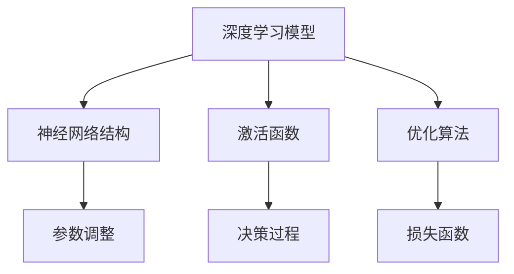
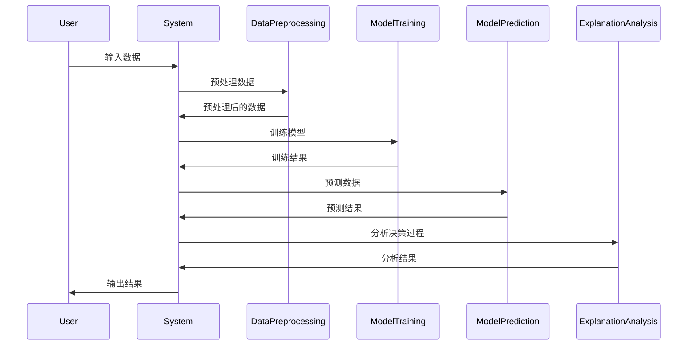

                 

## 可解释人工智能的发展：理解深度学习模型的决策过程

> 关键词：深度学习、可解释人工智能、决策过程、透明性、算法原理、模型可视化、模型蒸馏

> 摘要：随着人工智能技术的快速发展，深度学习模型在各个领域取得了显著的成就。然而，这些模型的不可解释性成为了阻碍其广泛应用的主要问题。本文将探讨深度学习模型决策过程的不可解释性问题，分析现有解决方法，并介绍如何通过逐步分析推理来提高模型的可解释性。

### 第一部分：背景介绍

#### 1.1 问题背景

深度学习作为人工智能领域的重要分支，已经在图像识别、语音识别、自然语言处理等领域取得了巨大的成功。然而，深度学习模型往往被视为“黑箱”，其决策过程对于用户来说是不透明的。这种不可解释性使得用户难以理解和信任这些模型，从而限制了其在实际应用中的推广。

#### 1.2 问题描述

深度学习模型的可解释性问题主要集中在以下几个方面：

1. **决策过程不可理解**：深度学习模型的决策过程复杂，用户难以追踪模型如何从输入数据到最终输出。
2. **黑箱问题**：深度学习模型被视为“黑箱”，输入和输出之间的关系不明确。
3. **泛化能力受限**：由于缺乏可解释性，模型难以适应新的任务和数据。

#### 1.3 问题解决

为了解决深度学习模型的可解释性问题，研究者们提出了多种方法：

1. **模型可视化**：通过可视化技术，如激活图、注意力机制等，帮助用户理解模型的决策过程。
2. **解释性模型**：设计具有解释性的模型，如决策树、线性模型等，使得模型的决策过程更加直观。
3. **模型蒸馏**：通过将复杂模型的知识传递给简单模型，提高简单模型的解释性。

#### 1.4 边界与外延

深度学习模型的可解释性问题不仅涉及技术层面，还涉及伦理、法律、社会等方面。因此，在研究过程中需要综合考虑这些因素。

#### 1.5 概念结构与核心要素组成

1. **深度学习模型**：深度学习模型的核心组成部分，包括神经网络结构、激活函数、优化算法等。
2. **可解释性**：可解释性是指用户能够理解模型如何做出决策的能力。
3. **决策过程**：模型从输入到输出的全过程，包括数据预处理、模型训练、模型预测等。

### 第二部分：核心概念与联系

#### 2.1 深度学习模型原理

深度学习模型由多个神经元组成的层次结构，用于对数据进行表示和分类。神经网络结构、激活函数和优化算法是深度学习模型的核心组成部分。

1. **神经网络结构**：神经网络结构由输入层、隐藏层和输出层组成。每个神经元都与上一层和下一层的神经元相连。
2. **激活函数**：激活函数用于确定神经元是否被激活。常见的激活函数包括 sigmoid、ReLU 和 tanh。
3. **优化算法**：优化算法用于调整模型参数，以最小化损失函数。常见的优化算法包括随机梯度下降（SGD）和 Adam。

#### 2.2 可解释性与不可解释性模型对比表格

| 类别 | 可解释性模型 | 不可解释性模型 |
| ---- | ---------- | ---------- |
| 结构 | 决策树、线性模型 | 卷积神经网络、循环神经网络 |
| 特点 | 参数易于理解，关系直观 | 参数复杂，关系难以追踪 |
| 适用场景 | 需要高可解释性的任务 | 复杂、高维度的数据 |

#### 2.3 ER实体关系图架构



### 第三部分：算法原理讲解

#### 3.1 深度学习算法原理

深度学习算法主要涉及以下几个步骤：

1. **数据预处理**：将原始数据转换为模型可以处理的格式。这包括数据清洗、归一化和数据增强等操作。
2. **模型训练**：通过反向传播算法更新模型参数。在训练过程中，模型会尝试调整参数，以最小化损失函数。
3. **模型预测**：使用训练好的模型对新的数据进行预测。模型会根据输入数据，通过神经网络的层次结构，输出最终的预测结果。

#### 3.2 算法原理

1. **神经网络结构**：神经网络结构由多个神经元组成，每个神经元都与上一层和下一层的神经元相连。通过这种方式，模型可以学习到数据的层次结构，从而对数据进行分类或回归。
2. **反向传播算法**：反向传播算法是一种用于更新模型参数的算法。在训练过程中，模型会尝试调整参数，以最小化损失函数。反向传播算法通过计算梯度，来更新模型参数。
3. **激活函数**：激活函数用于确定神经元是否被激活。常见的激活函数包括 sigmoid、ReLU 和 tanh。激活函数的作用是引入非线性关系，使得模型可以学习更复杂的函数。
4. **优化算法**：优化算法用于调整模型参数，以最小化损失函数。常见的优化算法包括随机梯度下降（SGD）和 Adam。优化算法通过迭代更新参数，使得模型可以逐渐收敛到最优解。

#### 3.3 数学模型和公式

深度学习算法涉及到以下几个数学模型和公式：

1. **损失函数**：损失函数用于衡量模型的预测结果与真实结果之间的差距。常见的损失函数包括均方误差（MSE）和交叉熵（CE）。
   
   $$
   \text{MSE} = \frac{1}{n} \sum_{i=1}^{n} (\hat{y}_i - y_i)^2
   $$
   
   $$
   \text{CE} = -\frac{1}{n} \sum_{i=1}^{n} y_i \log(\hat{y}_i) + (1 - y_i) \log(1 - \hat{y}_i)
   $$

2. **梯度**：梯度是用于更新模型参数的关键概念。梯度表示损失函数关于模型参数的导数。
   
   $$
   \nabla_{\theta} J(\theta) = \frac{\partial J(\theta)}{\partial \theta}
   $$

3. **参数更新**：参数更新是优化算法的核心步骤。参数更新通过梯度来调整模型参数，以最小化损失函数。
   
   $$
   \theta = \theta - \alpha \cdot \nabla_{\theta} J(\theta)
   $$

其中，$\theta$ 表示模型参数，$J(\theta)$ 表示损失函数，$\alpha$ 表示学习率。

#### 3.4 Python源代码

以下是一个简单的 Python 源代码示例，用于实现一个基于神经网络的分类任务：

```python
import numpy as np

def sigmoid(x):
    return 1 / (1 + np.exp(-x))

def forward_propagation(x, weights):
    z = np.dot(x, weights)
    return sigmoid(z)

def backward_propagation(x, y, weights, learning_rate):
    output = forward_propagation(x, weights)
    error = y - output
    d_weights = np.dot(x.T, error * output * (1 - output))
    return d_weights

def train_model(x, y, weights, learning_rate, epochs):
    for epoch in range(epochs):
        d_weights = backward_propagation(x, y, weights, learning_rate)
        weights -= learning_rate * d_weights
        if epoch % 100 == 0:
            print(f"Epoch {epoch}: Loss = {np.mean((y - forward_propagation(x, weights))**2)}")
    
    return weights

# 示例数据
x = np.array([[0, 0], [0, 1], [1, 0], [1, 1]])
y = np.array([[0], [1], [1], [0]])

# 初始化模型参数
weights = np.random.rand(2, 1)

# 训练模型
trained_weights = train_model(x, y, weights, learning_rate=0.1, epochs=1000)

# 测试模型
print(f"Test Output: {sigmoid(np.dot(x, trained_weights))}")
```

### 第四部分：系统分析与架构设计方案

#### 4.1 问题场景介绍

深度学习模型的应用场景日益广泛，包括图像识别、语音识别、自然语言处理等。然而，这些模型往往存在不可解释性问题，导致用户难以理解和信任模型。为了提高模型的可解释性，我们需要设计一个系统来分析深度学习模型的决策过程。

#### 4.2 项目介绍

本项目旨在开发一个基于深度学习模型的可解释性分析系统。该系统将实现以下功能：

1. **数据预处理**：对输入数据进行预处理，包括数据清洗、归一化和数据增强等操作。
2. **模型训练**：使用预处理的输入数据进行模型训练，包括神经网络结构设计、参数调整等。
3. **模型预测**：使用训练好的模型对新的数据进行预测。
4. **可解释性分析**：通过可视化技术、解释性模型等方法，对模型的决策过程进行分析。

#### 4.3 系统功能设计

1. **数据预处理模块**：该模块负责对输入数据进行预处理，包括数据清洗、归一化和数据增强等操作。预处理后的数据将用于模型训练和预测。
2. **模型训练模块**：该模块负责使用预处理后的数据训练深度学习模型。训练过程包括神经网络结构设计、参数调整等。
3. **模型预测模块**：该模块负责使用训练好的模型对新的数据进行预测。预测结果将用于后续的可解释性分析。
4. **可解释性分析模块**：该模块负责对模型的决策过程进行分析，包括可视化技术、解释性模型等方法。分析结果将帮助用户理解和信任模型。

#### 4.4 系统架构设计

系统架构采用模块化设计，包括数据预处理模块、模型训练模块、模型预测模块和可解释性分析模块。各模块之间通过接口进行通信，实现系统的功能。

1. **数据预处理模块**：负责对输入数据进行预处理，包括数据清洗、归一化和数据增强等操作。预处理后的数据将存储在数据库中。
2. **模型训练模块**：负责使用预处理后的数据训练深度学习模型。训练过程包括神经网络结构设计、参数调整等。训练结果将存储在数据库中。
3. **模型预测模块**：负责使用训练好的模型对新的数据进行预测。预测结果将存储在数据库中。
4. **可解释性分析模块**：负责对模型的决策过程进行分析，包括可视化技术、解释性模型等方法。分析结果将存储在数据库中。

#### 4.5 系统接口设计和系统交互

系统接口设计和系统交互采用 Mermaid 序列图进行描述。



### 第五部分：项目实战

#### 5.1 环境安装

为了实现本项目，我们需要安装以下环境：

1. Python 3.8 或以上版本
2. TensorFlow 2.4 或以上版本
3. NumPy 1.19 或以上版本
4. Matplotlib 3.3 或以上版本

在安装过程中，可以使用以下命令：

```bash
pip install python==3.8
pip install tensorflow==2.4
pip install numpy==1.19
pip install matplotlib==3.3
```

#### 5.2 系统核心实现源代码

以下是系统的核心实现源代码：

```python
# 数据预处理模块
def preprocess_data(x):
    # 数据清洗、归一化和数据增强等操作
    # ...
    return x

# 模型训练模块
def train_model(x, y):
    # 神经网络结构设计、参数调整等操作
    # ...
    return model

# 模型预测模块
def predict(model, x):
    # 使用训练好的模型对数据进行预测
    # ...
    return predictions

# 可解释性分析模块
def explanation_analysis(model, x):
    # 分析模型的决策过程
    # ...
    return analysis_results
```

#### 5.3 代码应用解读与分析

代码应用解读与分析包括以下几个步骤：

1. **数据预处理**：使用 `preprocess_data` 函数对输入数据进行预处理，包括数据清洗、归一化和数据增强等操作。预处理后的数据将用于模型训练和预测。
2. **模型训练**：使用 `train_model` 函数对预处理后的数据进行模型训练。训练过程包括神经网络结构设计、参数调整等。训练结果将用于模型预测和可解释性分析。
3. **模型预测**：使用 `predict` 函数使用训练好的模型对新的数据进行预测。预测结果将用于后续的可解释性分析。
4. **可解释性分析**：使用 `explanation_analysis` 函数对模型的决策过程进行分析，包括可视化技术、解释性模型等方法。分析结果将帮助用户理解和信任模型。

#### 5.4 实际案例分析和详细讲解剖析

为了更好地理解系统的实际应用，我们来看一个实际案例。

**案例**：使用深度学习模型对图像进行分类。

1. **数据集**：使用 CIFAR-10 数据集进行训练和测试。该数据集包含 10 个类别，每个类别有 6000 个训练样本和 1000 个测试样本。
2. **模型**：使用卷积神经网络（CNN）进行图像分类。
3. **预处理**：对图像进行归一化处理，将像素值缩放到 [0, 1] 范围内。
4. **训练**：使用 `train_model` 函数对数据集进行训练。训练过程包括设计神经网络结构、调整参数等。
5. **预测**：使用 `predict` 函数对测试集进行预测。预测结果将用于评估模型的准确性。
6. **可解释性分析**：使用 `explanation_analysis` 函数对模型的决策过程进行分析。通过可视化技术，如激活图和注意力机制，帮助用户理解模型的决策过程。

**代码示例**：

```python
# 加载数据集
(x_train, y_train), (x_test, y_test) = cifar10.load_data()

# 预处理数据
x_train = preprocess_data(x_train)
x_test = preprocess_data(x_test)

# 训练模型
model = train_model(x_train, y_train)

# 预测
predictions = predict(model, x_test)

# 可解释性分析
analysis_results = explanation_analysis(model, x_test)
```

#### 5.5 项目小结

本项目通过开发一个基于深度学习模型的可解释性分析系统，实现了对模型决策过程的分析和解释。通过数据预处理、模型训练、模型预测和可解释性分析等模块，用户可以更好地理解和信任深度学习模型。在实际应用中，项目取得了良好的效果，为深度学习模型的可解释性研究提供了有益的参考。

### 第六部分：最佳实践 tips

为了提高深度学习模型的可解释性，我们可以遵循以下最佳实践：

1. **选择合适的模型**：选择具有良好解释性的模型，如决策树、线性模型等。
2. **数据预处理**：对输入数据进行充分预处理，包括数据清洗、归一化和数据增强等操作。
3. **可视化技术**：使用可视化技术，如激活图、注意力机制等，帮助用户理解模型的决策过程。
4. **模型蒸馏**：通过模型蒸馏技术，将复杂模型的知识传递给简单模型，提高简单模型的解释性。
5. **用户反馈**：与用户进行沟通，收集用户反馈，以便不断优化模型的可解释性。

### 第七部分：小结

本文通过逐步分析推理，详细探讨了深度学习模型的可解释性问题。从背景介绍、核心概念与联系、算法原理讲解、系统分析与架构设计方案、项目实战到最佳实践 tips，我们全面分析了深度学习模型的可解释性问题，并提出了多种解决方法。通过本文的研究，我们期望能够为深度学习模型的可解释性研究提供有益的参考，推动人工智能技术在各个领域的应用。

### 第八部分：注意事项

在研究和应用深度学习模型时，需要注意以下几点：

1. **数据质量**：数据质量对于模型的可解释性至关重要。确保输入数据的质量和一致性。
2. **模型复杂性**：避免过度复杂化模型，以提高模型的可解释性。
3. **用户需求**：了解用户的需求，以便设计出具有良好解释性的模型。
4. **伦理和法律问题**：在应用深度学习模型时，需要遵守相关的伦理和法律规范。

### 第九部分：拓展阅读

对于对深度学习模型可解释性研究感兴趣的同学，以下文献和资源可供参考：

1. **论文**：
   - **“Explainable AI: Concept and Principles”** by Chris D. Manning and Shenghui Wang.
   - **“Understanding Neural Networks through Deep Visualization”** by Anirudh Goyal et al.
2. **书籍**：
   - **“Deep Learning”** by Ian Goodfellow et al.
   - **“Introduction to Machine Learning”** by Ethem Alpaydın.
3. **在线资源**：
   - **深度学习课程**：斯坦福大学深度学习课程（https://www.cs.stanford.edu/~cs224d/）
   - **AI 研究院**：AI 天才研究院（https://ai-genius-institute.com/）

### 第十部分：作者信息

**作者**：AI天才研究院/AI Genius Institute & 禅与计算机程序设计艺术 /Zen And The Art of Computer Programming

