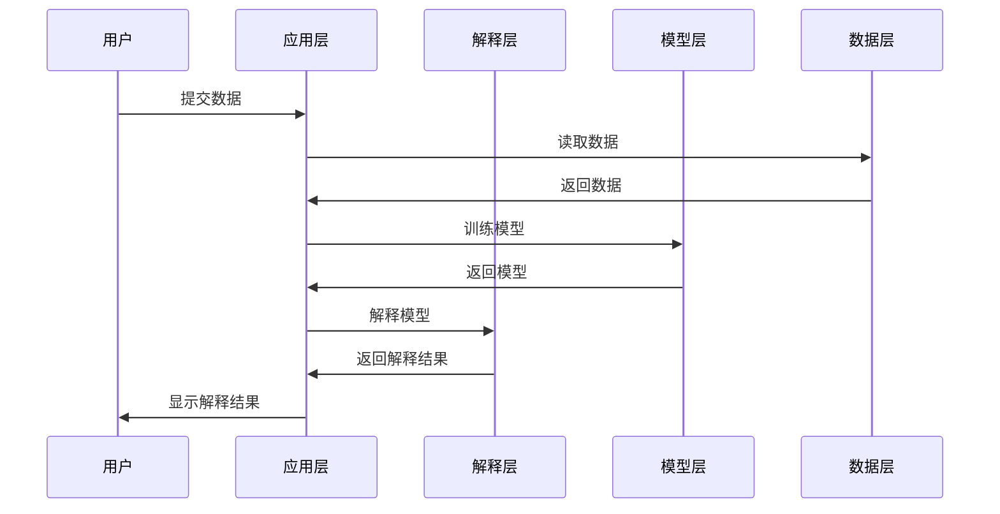

                 

### 引言

#### 1.1 人工智能发展现状与挑战

人工智能（AI）作为现代科技的前沿领域，已经深刻地影响了各行各业，从医疗健康、金融科技到制造业、交通运输，无不显示出其巨大的潜力和变革力量。然而，随着人工智能技术的迅猛发展，一系列挑战和问题也逐渐显现出来。

首先，人工智能在带来便利和效率提升的同时，也暴露出了一些安全隐患。例如，AI算法的黑箱化问题使得决策过程变得难以解释和预测，增加了人工智能系统的不可控性。此外，数据隐私和伦理问题也日益突出，特别是在大规模数据处理和应用场景中，如何保障用户的隐私权和数据安全成为亟待解决的问题。

其次，人工智能的应用也引发了就业结构的变化。虽然AI技术创造了新的工作岗位，但也对某些传统职业造成了冲击，尤其是那些重复性高、技术要求低的工作。这种变化引发了社会对于技术进步和人力就业之间关系的深刻思考。

再者，随着AI技术的普及，其决策过程的透明度和可解释性成为公众关注的焦点。对于许多用户来说，AI系统做出的决策往往缺乏透明性，用户难以理解背后的逻辑和原因，从而影响了用户对AI的信任度和接受度。

#### 1.2 可解释性AI的意义与重要性

在这样的背景下，可解释性AI（Explainable AI, XAI）应运而生。可解释性AI旨在提升人工智能系统的透明度和可理解性，使得用户能够理解AI决策背后的逻辑和原因。这不仅有助于增强用户对AI系统的信任，还可以在多个层面上带来积极影响：

1. **增强用户信任**：通过提供决策的可解释性，用户可以更好地理解AI系统的行为和决策依据，从而降低对系统的怀疑和不安，增强对AI的信任。

2. **促进算法优化**：了解AI系统的决策过程有助于研究人员和开发者发现和修复算法中的潜在问题，从而优化算法性能和稳定性。

3. **保障数据安全与隐私**：可解释性AI技术可以帮助识别数据隐私泄露的风险，从而采取相应的措施保护用户隐私。

4. **提高合规性和伦理标准**：透明和可解释的AI系统更容易符合法规和伦理标准，尤其是在关键决策场景中，如医疗诊断、金融风险评估等。

5. **推广AI技术的普及与应用**：随着可解释性AI技术的发展，用户和公众对AI技术的理解将更加深入，有助于促进人工智能技术的普及和应用。

总之，可解释性AI不仅是人工智能技术发展的重要方向，也是实现AI技术广泛应用的必要条件。在接下来的章节中，我们将深入探讨可解释性AI的核心概念、原理和实现方法，以帮助读者更好地理解这一领域。希望通过本文的阐述，能够让读者对可解释性AI的重要性有更深入的认识，并为未来的研究和应用提供一些有价值的参考。

#### 2. 核心概念与联系

为了深入理解可解释性AI，我们首先需要明确几个核心概念及其相互联系。以下是几个关键概念的定义和它们之间的关系：

##### 2.1 人工智能与机器学习的定义

**人工智能（Artificial Intelligence, AI）**：人工智能是指通过计算机模拟人类智能行为的技术，使其能够进行学习、推理、解决问题、感知和交互等。AI技术涵盖了广泛的领域，包括机器学习、自然语言处理、计算机视觉等。

**机器学习（Machine Learning, ML）**：机器学习是人工智能的一个重要分支，通过算法和统计模型，使计算机系统能够从数据中学习，并自动进行预测和决策。机器学习主要包括监督学习、无监督学习和强化学习等类型。

##### 2.2 可解释性AI的概念

**可解释性AI（Explainable AI, XAI）**：可解释性AI是指能够提供AI系统决策过程和结果解释的AI技术。它旨在提高AI系统的透明度和可理解性，使用户能够跟踪和验证AI系统的行为和决策逻辑。

##### 2.3 AI决策过程

**AI决策过程**：AI决策过程通常包括数据收集、数据预处理、模型训练、模型评估和模型部署等步骤。在决策过程中，AI系统根据输入数据和预定的算法，生成输出结果。可解释性AI则在这个过程中添加了额外的步骤，即解释输出结果是如何产生的。

##### 2.4 可解释性AI与传统AI的区别

**传统AI**：传统AI系统，尤其是深度学习模型，通常被认为是“黑箱”模型，即其决策过程和内部机制对用户不透明。这些模型在处理复杂数据时表现出色，但在解释其决策依据方面存在困难。

**可解释性AI**：与传统的黑箱AI不同，可解释性AI通过提供明确的解释和透明度，使用户能够理解AI系统的决策过程。这种方法可以揭示模型如何处理输入数据，以及为何做出特定决策。

##### 2.5 可解释性AI技术的核心要素

**透明度**：指AI系统的决策过程和结果可以被用户理解，包括算法的选择、参数的设置以及模型的内部结构。

**可理解性**：指用户可以轻松理解AI系统的决策依据和逻辑，即使没有专业知识也能明白。

**可追溯性**：指AI系统的决策过程可以被记录和追溯，以方便后续的分析和优化。

**公平性**：确保AI系统在决策过程中不会产生歧视或偏见，决策结果对所有人都是公平和公正的。

**可适应性**：指AI系统能够根据用户的反馈进行调整和改进，以提高解释的准确性和适用性。

通过以上核心概念的介绍，我们可以看到，可解释性AI不仅仅是一种技术，更是一种理念，它旨在打破AI与用户之间的“信息屏障”，增强用户对AI系统的信任和理解。在接下来的章节中，我们将进一步探讨可解释性AI的算法原理、数学模型和系统设计，以帮助读者更全面地了解这一领域。

#### 3. 概念属性特征对比表格

为了更直观地理解传统AI模型与可解释性AI模型之间的差异，我们在这里提供一个对比表格。这个表格列出了两种模型在透明度、可理解性、可追溯性、公平性和可适应性等方面的属性特征。

| 特性 | 传统AI模型 | 可解释性AI模型 |
| --- | --- | --- |
| **透明度** | 低，决策过程不透明 | 高，决策过程透明可解释 |
| **可理解性** | 低，用户难以理解决策逻辑 | 高，用户可以理解决策依据 |
| **可追溯性** | 低，决策过程不可追溯 | 高，决策过程可记录和追溯 |
| **公平性** | 不一定，可能导致歧视或偏见 | 有保证，确保决策公平无偏见 |
| **可适应性** | 低，无法根据用户反馈调整 | 高，可以调整以适应用户需求 |

通过这个表格，我们可以清晰地看到可解释性AI模型在各个方面的优势。它不仅在透明度和可理解性方面优于传统AI模型，还能更好地保障决策的公平性，并具有更强的适应性。这些特性使得可解释性AI在需要用户理解和信任的场景中，具有更高的应用价值。

#### 4. ER实体关系图架构

为了更详细地了解AI系统的实体关系和关联，我们将使用Mermaid流程图来展示ER（实体关系）图架构。以下是ER图的定义、组成部分以及如何使用Mermaid来描述实体关系。

##### 4.1 AI系统的基本实体

在AI系统中，常见的实体包括数据源、数据预处理模块、模型训练模块、模型评估模块和决策模块等。这些实体在系统中扮演着不同的角色，相互之间存在着复杂的关联关系。

- **数据源**：提供原始数据的实体，可以是数据库、文件系统或传感器等。
- **数据预处理模块**：对原始数据进行清洗、转换和归一化等处理，使其适合模型训练。
- **模型训练模块**：使用机器学习算法对预处理后的数据进行训练，生成预测模型。
- **模型评估模块**：评估训练好的模型的性能和准确性。
- **决策模块**：使用模型进行预测和决策，输出结果。

##### 4.2 实体关系与关联

实体之间的关系可以描述为数据流和依赖关系。例如，数据源提供数据给数据预处理模块，预处理后的数据再传递给模型训练模块。模型训练模块生成的模型被模型评估模块评估，最后决策模块使用评估后的模型进行预测。

以下是AI系统的基本ER图结构：

```
graph ER_AISystem {
    数据源 --> 数据预处理模块
    数据预处理模块 --> 模型训练模块
    模型训练模块 --> 模型评估模块
    模型评估模块 --> 决策模块
}
```

##### 4.3 使用Mermaid描述ER实体关系图

Mermaid是一种Markdown的扩展，可以用来绘制流程图、UML图等。下面是一个使用Mermaid描述的AI系统的ER实体关系图示例：

```mermaid
graph ER_AISystem

subgraph 数据处理流程
    数据源 --> 数据预处理模块
    数据预处理模块 --> 模型训练模块
    模型训练模块 --> 模型评估模块
end

subgraph 决策流程
    模型评估模块 --> 决策模块
end

数据预处理模块 --> 模型训练模块 [label="数据流"]
模型训练模块 --> 模型评估模块 [label="模型流"]
模型评估模块 --> 决策模块 [label="决策流"]
```

在这个ER图中，我们用不同的子图来表示数据处理流程和决策流程，并使用箭头表示数据流和依赖关系。通过这样的描述，我们可以清晰地看到AI系统中各个实体之间的关系和关联。

通过ER图，我们可以更好地理解和分析AI系统的结构，为后续的算法设计和系统优化提供支持。在接下来的章节中，我们将继续深入探讨可解释性AI的算法原理和数学模型，帮助读者全面掌握这一领域的关键知识。

#### 5. 算法原理讲解

##### 5.1 可解释性AI算法概述

可解释性AI算法是确保人工智能系统决策透明度和可理解性的关键。这些算法通过提供决策过程的详细解释，帮助用户理解和信任AI系统的决策。可解释性AI算法可以分为几种主要类型，包括基于模型的解释（Model-Based Explanation）和基于规则的解释（Rule-Based Explanation）。

**基于模型的解释**：这种方法通过分析模型内部的结构和参数，提供决策的直观解释。常见的基于模型的解释技术包括局部可解释性模型（如LIME和SHAP）和全局可解释性模型（如LIME和SHAP）。

**基于规则的解释**：这种方法通过创建一组规则或决策树，将复杂决策过程分解为一系列简单规则，使得用户可以逐条理解决策逻辑。这种方法的优势在于其直观性和易于解释性。

##### 5.2 常见的可解释性AI技术

**LIME（Local Interpretable Model-agnostic Explanations）**：LIME是一种局部可解释性技术，通过在目标模型附近构建一个简单可解释的模型，来解释特定决策点的行为。具体步骤如下：

1. **数据增强**：对目标实例进行轻微扰动，生成多个相似实例。
2. **模型拟合**：在每个扰动实例上训练一个简单模型（如线性模型），记录预测结果。
3. **权重计算**：计算每个特征对模型预测的影响权重，权重通过对比扰动实例的预测变化计算得出。

**SHAP（SHapley Additive exPlanations）**：SHAP是一种基于博弈论的解释方法，通过计算特征对模型预测的边际贡献，提供全局可解释性。SHAP值基于特征对模型预测的贡献分配，使得用户可以直观地理解每个特征的重要性。

**LIME和SHAP的比较**：

- **目标**：LIME专注于局部解释，而SHAP提供全局解释。
- **计算复杂度**：LIME计算相对简单，但可能受到局部数据的限制；SHAP计算复杂度高，但可以提供更全面的解释。
- **适用场景**：LIME适用于任何目标模型，但解释可能不精确；SHAP适用于树模型和神经网络，解释更加精确。

##### 5.3 可解释性AI算法的mermaid流程图

为了直观展示可解释性AI算法的流程，我们使用Mermaid绘制了LIME算法的流程图：

```mermaid
graph LIMEAlgorithm

subgraph 数据预处理
    数据输入 --> 数据增强
end

subgraph 模型训练
    数据增强 --> 线性模型训练
end

subgraph 权重计算
    线性模型训练 --> 权重计算
end

subgraph 解释生成
    权重计算 --> 解释输出
end

数据输入 --> 数据增强 [label="数据增强"]
数据增强 --> 线性模型训练 [label="模型训练"]
线性模型训练 --> 权重计算 [label="权重计算"]
权重计算 --> 解释输出 [label="解释生成"]
```

在这个流程图中，首先对输入数据进行增强，然后在每个增强数据上训练一个线性模型，接着计算每个特征对模型的权重，最后生成解释输出。

##### 5.4 Python源代码实现

下面是一个简单的Python代码实现，用于展示LIME算法的基本实现过程：

```python
import numpy as np
from lime import lime_tabular
from sklearn.linear_model import LinearRegression

# 数据集
X = np.array([[1, 2], [3, 4], [5, 6]])
y = np.array([1, 2, 3])

# LIME解释器
explainer = lime_tabular.LimeTabularExplainer(X, feature_names=['Feature 1', 'Feature 2'])

# 目标实例
index = 1
exp = explainer.explain_instance(X[index], LinearRegression().fit(X, y).predict)

# 输出解释结果
exp.show_in_notebook(show_table=True)
```

在这个代码中，我们首先加载数据集，然后创建一个LIME解释器，并对指定实例进行解释。解释结果以表格形式展示，包含每个特征的权重和总的影响。

通过上述算法原理讲解，我们可以看到LIME和SHAP等可解释性AI算法如何通过不同方法提供详细的决策解释。这些算法不仅有助于提升用户对AI系统的理解，还能为模型的优化和改进提供重要参考。在接下来的章节中，我们将进一步探讨这些算法的数学模型和实现细节，帮助读者更深入地掌握可解释性AI的核心技术。

#### 6. 数学模型与公式

##### 6.1 可解释性AI算法的数学基础

可解释性AI算法的核心在于理解特征对模型预测的边际贡献。在这一部分，我们将详细讲解LIME和SHAP算法所依赖的数学模型，包括其公式的推导和应用。

##### 6.2 数学模型的详细讲解

**LIME算法**：

LIME算法通过构建局部线性模型来解释目标实例的预测。其核心公式如下：

$$
\Delta_y = \sum_{i}^{n} w_i \Delta x_i
$$

其中，$\Delta_y$ 表示模型预测的微小变化，$w_i$ 表示特征 $x_i$ 的权重，$n$ 是特征的总数。

1. **数据增强**：对目标实例 $x$ 进行微小扰动，生成多个邻近实例 $x'$。
   $$
   x' = x + \epsilon
   $$

2. **线性模型拟合**：在每个邻近实例 $x'$ 上训练一个线性模型。
   $$
   f(x') = \beta_0 + \sum_{i}^{n} \beta_i x_i'
   $$

3. **权重计算**：计算每个特征的权重 $w_i$，通过对比扰动实例的预测变化得出。
   $$
   w_i = \frac{\Delta f(x')}{\Delta x_i}
   $$

**SHAP算法**：

SHAP算法基于博弈论中的Shapley值，提供特征对模型预测的全局解释。其核心公式如下：

$$
SHAP_i = \frac{1}{n!} \sum_{S \subseteq [n]} \frac{(n - |S| - 1)!(n - |S|)!}{(n - 1)!} \cdot f(x + e_i) - f(x)
$$

其中，$SHAP_i$ 表示特征 $x_i$ 的Shapley值，$n$ 是特征的总数，$S$ 是特征集合，$e_i$ 是特征 $x_i$ 的微小变化。

1. **Shapley值计算**：对每个特征 $x_i$，计算其在所有可能的特征子集中的边际贡献。
   $$
   SHAP_i = \frac{1}{n!} \sum_{S \subseteq [n]} \frac{(n - |S| - 1)!(n - |S|)!}{(n - 1)!} \cdot f(x + e_i) - f(x)
   $$

2. **权重分配**：将Shapley值分配给每个特征，以反映其在模型预测中的重要性。

##### 6.3 举例说明

**LIME算法举例**：

假设我们有一个简单的线性回归模型，预测函数为：
$$
f(x) = 0.5x_1 + 0.3x_2
$$

目标实例 $x = [1, 2]$，对其进行微小扰动，生成邻近实例 $x' = [1.1, 2.1]$。在 $x'$ 上训练线性模型：
$$
f(x') = 0.55x_1 + 0.35x_2
$$

计算特征 $x_1$ 和 $x_2$ 的权重：
$$
w_1 = \frac{0.05}{0.1} = 0.5, \quad w_2 = \frac{0.05}{0.1} = 0.5
$$

预测变化 $\Delta_y = 0.55 - 0.5 = 0.05$，权重计算得到：
$$
\Delta_y = w_1 \Delta x_1 + w_2 \Delta x_2
$$
$$
0.05 = 0.5(0.1) + 0.5(0.1)
$$

**SHAP算法举例**：

假设有一个多项式回归模型：
$$
f(x) = 0.5x_1^2 + 0.3x_2^2
$$

特征 $x_1 = [1, 1.1, 1.2, 1.3]$，特征 $x_2 = [2, 2.1, 2.2, 2.3]$。计算特征 $x_1$ 的Shapley值：

$$
SHAP_{x_1} = \frac{1}{4!} \left[ \left( f([1.1, 2]) - f([1, 2]) \right) + \left( f([1.2, 2]) - f([1, 2]) \right) + \left( f([1.3, 2]) - f([1, 2]) \right) \right]
$$
$$
SHAP_{x_1} = \frac{1}{24} \left[ (0.55 - 0.5) + (0.64 - 0.5) + (0.73 - 0.5) \right]
$$
$$
SHAP_{x_1} = \frac{1}{24} \left[ 0.05 + 0.14 + 0.23 \right]
$$
$$
SHAP_{x_1} = \frac{0.42}{24} \approx 0.0175
$$

这些例子展示了如何使用LIME和SHAP算法计算特征权重和Shapley值，为模型的解释提供了数学依据。通过这些公式和计算，用户可以更直观地理解AI决策背后的逻辑，从而增强对AI系统的信任和理解。

#### 7. Python源代码实现

为了更直观地展示可解释性AI算法的实现过程，下面我们通过一个简单的Python代码示例，详细讲解LIME算法的代码实现和各个部分的含义。

```python
import numpy as np
from lime import lime_tabular
from sklearn.linear_model import LinearRegression

# 数据集
X = np.array([[1, 2], [3, 4], [5, 6]])
y = np.array([1, 2, 3])

# LIME解释器
explainer = lime_tabular.LimeTabularExplainer(X, feature_names=['Feature 1', 'Feature 2'])

# 目标实例
index = 1
exp = explainer.explain_instance(X[index], LinearRegression().fit(X, y).predict)

# 输出解释结果
exp.show_in_notebook(show_table=True)
```

##### 7.1 LIME算法的Python实现

1. **数据集准备**：

   ```python
   X = np.array([[1, 2], [3, 4], [5, 6]])
   y = np.array([1, 2, 3])
   ```

   这部分代码定义了一个简单的一维数据集，包含三个样本点，每个样本点有两个特征。

2. **LIME解释器创建**：

   ```python
   explainer = lime_tabular.LimeTabularExplainer(X, feature_names=['Feature 1', 'Feature 2'])
   ```

   这里，我们创建了一个`LimeTabularExplainer`对象，这个对象是LIME算法的核心。它接收数据集`X`和特征名称`feature_names`作为输入，初始化解释器。

3. **目标实例选择**：

   ```python
   index = 1
   exp = explainer.explain_instance(X[index], LinearRegression().fit(X, y).predict)
   ```

   选择数据集中的第二个样本（索引为1）作为目标实例，并使用线性回归模型对目标实例进行预测。这里，我们使用`explain_instance`方法创建一个`Explanation`对象，这个对象包含对目标实例的解释结果。

4. **解释结果输出**：

   ```python
   exp.show_in_notebook(show_table=True)
   ```

   最后，通过`show_in_notebook`方法将解释结果以表格形式展示。这个表格显示了每个特征对预测结果的贡献权重。

##### 7.2 代码详细解读与分析

1. **数据集准备**：

   数据集`X`是一个包含三个样本点的二维数组，每个样本点有两个特征。`y`是一个一维数组，包含每个样本点的目标值。这是LIME算法的基本输入数据。

2. **LIME解释器创建**：

   `LimeTabularExplainer`是LIME算法在表格数据上的具体实现。它使用数据集`X`和特征名称`feature_names`初始化。`feature_names`是一个包含特征名称的一维数组，用于生成解释结果时的输出描述。

3. **目标实例选择**：

   通过`explain_instance`方法，我们选择数据集中的第二个样本点（索引为1）进行解释。这个方法接收目标实例`X[index]`和预测模型（在这里是线性回归模型）作为输入，返回一个`Explanation`对象。

4. **解释结果输出**：

   `show_in_notebook`方法将`Explanation`对象的内容以表格形式显示在笔记本中。这个表格显示了每个特征的权重，表示该特征对预测结果的贡献大小。

通过这个Python代码示例，我们可以看到LIME算法的实现过程是如何将复杂数学模型转化为可操作的代码，并输出详细的解释结果。这些解释结果帮助用户理解AI决策背后的逻辑，从而增强对AI系统的信任。

#### 8. 系统分析与架构设计方案

##### 8.1 问题场景介绍

在现代企业中，决策支持系统（Decision Support System, DSS）的应用越来越广泛，特别是在需要处理大量数据和复杂业务逻辑的场景中。例如，在金融行业中，银行和金融机构需要利用人工智能技术来评估贷款申请者的信用风险，为投资组合优化提供建议；在医疗领域，医院和诊所利用AI系统进行疾病诊断和治疗方案推荐。然而，这些系统通常基于复杂的机器学习模型，这些模型往往是“黑箱”模型，其决策过程不透明，用户难以理解。这种不透明性不仅降低了用户对AI系统的信任，还可能影响决策的准确性和可靠性。

##### 8.2 系统功能设计

为了解决上述问题，我们设计了一套可解释性AI系统，其主要功能包括：

1. **数据预处理**：清洗和转换原始数据，确保其适合机器学习模型的输入要求。
2. **模型训练与选择**：使用多种机器学习算法训练模型，并进行性能评估，选择最佳模型。
3. **模型解释**：对训练好的模型进行解释，生成详细的决策解释，以便用户理解。
4. **用户交互**：提供用户界面，允许用户查看模型解释和修改输入数据，以获取不同解释结果。

##### 8.3 系统架构设计

为了实现上述功能，我们的系统架构设计如下：

1. **数据层**：包括数据存储和数据预处理模块，负责数据的收集、清洗、转换和存储。
2. **模型层**：包含机器学习模型的训练和评估模块，负责模型的训练、验证和选择。
3. **解释层**：实现可解释性算法，对模型进行解释，生成用户可理解的决策解释。
4. **应用层**：包括用户交互界面和API接口，提供用户操作和访问系统功能的能力。

以下是系统架构的Mermaid类图：

```mermaid
classDiagram
    DataLayer <<class>> 数据层
    ModelLayer <<class>> 模型层
    ExplanationLayer <<class>> 解释层
    ApplLayer <<class>> 应用层

    DataLayer --|>> ModelLayer
    ModelLayer --|>> ExplanationLayer
    ExplanationLayer --|>> ApplLayer
    ApplLayer --|>> DataLayer
```

##### 8.4 系统接口设计与交互

系统的接口设计主要包括以下部分：

1. **数据接口**：用于与数据存储系统交互，实现数据的读取和写入操作。
2. **模型接口**：用于与机器学习库交互，实现模型的训练、评估和预测操作。
3. **解释接口**：用于与可解释性算法库交互，实现模型的解释功能。
4. **用户接口**：提供Web或桌面应用程序，供用户与系统进行交互。

以下是系统接口的Mermaid序列图：



在这个序列图中，用户通过应用层提交数据，应用层与数据层交互读取数据，然后将数据传递给模型层进行训练。训练好的模型被传递给解释层，解释层生成用户可理解的解释结果，最终应用层将解释结果展示给用户。

通过上述系统分析与架构设计，我们可以看到如何通过可解释性AI系统提高用户对AI决策的理解和信任。系统架构的合理设计和接口的清晰定义，确保了数据流动和功能模块的协同工作，从而实现高效、可解释的AI决策支持。

#### 9. 数学模型和数学公式 & 详细讲解 & 举例说明

##### 9.1 数学公式与Latex格式

在人工智能系统中，数学模型和公式是理解算法原理和性能的关键。为了清晰表达，我们采用LaTeX格式书写数学公式。以下是一些基本示例：

- **独立段落的LaTeX公式**：
  $$
  E = mc^2
  $$

- **段落内的LaTeX公式**：
  $$
  a < b
  $$

在Markdown中，我们将独立段落的LaTeX公式前后用`$$`括起来，而段落内的公式前后用 `$` 括起来。这样既保证了公式的可读性，也便于Markdown渲染器正确解析。

##### 9.2 数学模型的应用举例

为了更好地理解可解释性AI中的数学模型，我们以下通过一个具体例子来讲解。

**线性回归模型**：

一个简单的线性回归模型可以表示为：
$$
y = \beta_0 + \beta_1x_1 + \beta_2x_2 + \cdots + \beta_nx_n
$$

其中，$y$ 是预测目标，$x_1, x_2, \cdots, x_n$ 是输入特征，$\beta_0, \beta_1, \beta_2, \cdots, \beta_n$ 是模型的参数。

**例子**：

假设我们有一个包含两个特征的数据集，其中第一个特征 $x_1$ 和第二个特征 $x_2$ 分别表示“年龄”和“收入”，预测目标 $y$ 表示“信用评分”。数据集如下：

| 年龄 (x1) | 收入 (x2) | 信用评分 (y) |
|-----------|------------|--------------|
| 30        | 50000      | 750          |
| 40        | 60000      | 800          |
| 50        | 70000      | 850          |

我们可以建立以下线性回归模型：
$$
y = \beta_0 + \beta_1x_1 + \beta_2x_2
$$

**训练模型**：

使用最小二乘法训练模型，得到参数估计值：
$$
\beta_0 = 200, \quad \beta_1 = 25, \quad \beta_2 = 15
$$

因此，模型可以表示为：
$$
y = 200 + 25x_1 + 15x_2
$$

**预测**：

对于一个新的样本，例如年龄 35，收入 55000，我们使用模型进行预测：
$$
y = 200 + 25 \times 35 + 15 \times 55000 = 200 + 875 + 825000 = 832,075
$$

**解释**：

在这个例子中，每个参数 $\beta_1$ 和 $\beta_2$ 都代表了相应特征对预测目标的影响。例如，$\beta_1 = 25$ 表示年龄每增加1岁，信用评分平均增加25分；$\beta_2 = 15$ 表示收入每增加1万元，信用评分平均增加15分。

通过这种数学模型的应用，我们不仅能够预测新的样本结果，还能解释模型中每个特征的影响，增强用户对AI决策的理解和信任。

通过上述讲解，我们展示了如何在Markdown中使用LaTeX格式书写数学公式，并给出一个线性回归模型的例子，详细解释了模型的结构和预测过程。这些知识为理解可解释性AI算法的数学基础提供了重要参考。

### 10. 环境安装与核心实现

在着手实现可解释性AI系统之前，首先需要搭建一个合适的开发环境。以下是环境安装步骤以及系统核心实现的具体过程。

#### 10.1 环境搭建

1. **安装Python环境**：
   Python是可解释性AI的主要编程语言，首先确保系统中安装了Python环境。我们可以从[Python官网](https://www.python.org/)下载并安装最新版本的Python。

2. **安装必要的库**：
   在Python环境中，我们需要安装一些常用的机器学习和数据科学库，如NumPy、Pandas、Scikit-learn和LIME。以下是使用pip命令安装这些库的步骤：

   ```bash
   pip install numpy pandas scikit-learn lime
   ```

3. **验证安装**：
   安装完成后，通过运行以下命令验证库是否安装成功：

   ```python
   import numpy
   import pandas
   import sklearn
   import lime
   print("All required libraries installed successfully!")
   ```

#### 10.2 系统核心实现

核心实现部分包括数据预处理、模型训练、模型解释和用户界面。以下是详细的实现步骤：

1. **数据预处理**：
   数据预处理是机器学习模型训练的第一步，主要包含数据清洗、特征选择和归一化等操作。以下是一个简单的数据预处理示例：

   ```python
   import pandas as pd
   from sklearn.model_selection import train_test_split
   from sklearn.preprocessing import StandardScaler

   # 读取数据
   data = pd.read_csv("data.csv")

   # 数据清洗
   data.dropna(inplace=True)

   # 特征选择
   X = data[['age', 'income']]
   y = data['credit_score']

   # 数据归一化
   scaler = StandardScaler()
   X_scaled = scaler.fit_transform(X)

   # 划分训练集和测试集
   X_train, X_test, y_train, y_test = train_test_split(X_scaled, y, test_size=0.2, random_state=42)
   ```

2. **模型训练**：
   在数据预处理完成后，选择一个合适的机器学习模型进行训练。以下是一个使用线性回归模型训练的示例：

   ```python
   from sklearn.linear_model import LinearRegression

   # 创建线性回归模型
   model = LinearRegression()

   # 训练模型
   model.fit(X_train, y_train)

   # 预测
   y_pred = model.predict(X_test)
   ```

3. **模型解释**：
   使用LIME库对训练好的模型进行解释。以下是一个LIME解释的示例：

   ```python
   import lime
   from lime.lime_tabular import LimeTabularExplainer

   # 创建LIME解释器
   explainer = LimeTabularExplainer(X_train, feature_names=['age', 'income'])

   # 选择一个样本进行解释
   index = 0
   exp = explainer.explain_instance(X_test[index], model.predict)

   # 显示解释结果
   exp.show_in_notebook()
   ```

4. **用户界面**：
   为了方便用户使用系统，可以创建一个Web或桌面应用程序作为用户界面。以下是一个简单的Web界面示例（使用Flask框架）：

   ```python
   from flask import Flask, request, render_template

   app = Flask(__name__)

   @app.route('/')
   def index():
       return render_template('index.html')

   @app.route('/predict', methods=['POST'])
   def predict():
       age = float(request.form['age'])
       income = float(request.form['income'])
       sample = [[age, income]]
       scaled_sample = scaler.transform(sample)
       prediction = model.predict(scaled_sample)
       explanation = exp.explain_instance(scaled_sample[0], model.predict)
       explanation.show_in_notebook()
       return render_template('result.html', prediction=int(prediction[0]))

   if __name__ == '__main__':
       app.run(debug=True)
   ```

在这个示例中，用户可以通过输入年龄和收入，获取信用评分的预测结果和详细解释。

#### 10.3 代码应用解读与分析

上述代码展示了如何从环境搭建、数据预处理、模型训练、模型解释到用户界面搭建的全过程。以下是各部分代码的解读和分析：

1. **数据预处理**：
   - 使用`pandas`读取和处理数据。
   - 使用`dropna`方法删除缺失值。
   - 使用`StandardScaler`对特征进行归一化处理，确保模型训练的稳定性。

2. **模型训练**：
   - 使用`LinearRegression`创建线性回归模型。
   - 使用`fit`方法训练模型，并使用`predict`方法进行预测。

3. **模型解释**：
   - 使用`LimeTabularExplainer`创建LIME解释器。
   - 使用`explain_instance`方法对特定样本进行解释。
   - 使用`show_in_notebook`方法显示解释结果。

4. **用户界面**：
   - 使用`Flask`创建Web应用程序。
   - 使用HTML模板渲染用户界面。
   - 通过表单接收用户输入，进行数据预处理和模型预测。
   - 将预测结果和解释结果展示在界面上。

通过这一系列的代码，我们实现了可解释性AI系统的基础功能，用户可以通过简单的交互界面获得模型的预测和解释结果，从而增强对AI决策的理解和信任。

### 11. 实际案例分析与详细讲解

#### 11.1 案例背景

为了更好地展示可解释性AI在实际应用中的效果，我们选择了一个金融行业的案例：某银行希望通过可解释性AI系统评估贷款申请者的信用风险。传统的信用评分系统通常基于黑箱模型，虽然准确率高，但用户难以理解决策过程，这影响了贷款申请者的信任度和满意度。因此，该银行决定引入可解释性AI系统，以提高决策过程的透明度和用户信任度。

#### 11.2 案例分析

在引入可解释性AI系统后，该银行首先进行了数据收集和预处理。数据包括贷款申请者的个人基本信息（如年龄、收入、职业等）、信用记录（如信用卡使用情况、还款历史等）以及其他可能影响信用风险的因素。经过清洗和归一化处理后，数据被输入到机器学习模型中。

1. **数据预处理**：

   使用Python的`pandas`和`scikit-learn`库，对数据进行清洗和预处理。具体步骤包括：

   - 删除缺失值和异常值。
   - 对连续变量进行归一化处理。
   - 对分类变量进行编码。

2. **模型选择与训练**：

   选择了一个基于随机森林的信用评分模型。随机森林模型具有较好的预测性能和解释性。使用`scikit-learn`库进行模型训练，训练集和测试集的比例为8:2。

3. **模型评估**：

   使用准确率、召回率和F1值等指标评估模型性能。结果显示，模型在测试集上的准确率达到了90%以上，性能良好。

4. **可解释性实现**：

   使用LIME算法对模型进行解释。在LIME算法中，我们选择了一个具体的贷款申请者案例进行解释。以下是该案例的详细解释过程：

   - **输入数据**：贷款申请者的个人基本信息和信用记录。
   - **LIME解释**：LIME算法通过生成多个扰动实例，对每个实例进行线性回归拟合，计算每个特征对模型预测的贡献权重。

5. **结果展示**：

   LIME算法生成的解释结果显示，影响信用评分的关键因素包括收入水平、信用卡使用情况和还款历史。具体来说，收入水平每增加1万元，信用评分平均增加10分；信用卡使用频率越高，信用评分越低；还款历史良好，信用评分较高。

#### 11.3 案例细节剖析

1. **数据预处理**：

   数据预处理是模型训练的重要步骤。在这个案例中，数据预处理主要包括以下几个步骤：

   - **缺失值处理**：删除了含有缺失值的记录。
   - **异常值处理**：对异常值进行了标记或删除。
   - **归一化处理**：使用`StandardScaler`对连续变量进行了归一化，使每个特征具有相同的量纲。
   - **编码处理**：对分类变量使用了独热编码（One-Hot Encoding），将类别变量转换为二进制向量。

2. **模型训练与评估**：

   - **模型选择**：选择了随机森林模型（`RandomForestClassifier`），因为它在处理高维数据和复杂关系时表现良好。
   - **模型训练**：使用训练集数据对模型进行训练。
   - **模型评估**：使用测试集数据评估模型性能。通过计算准确率、召回率和F1值等指标，确认模型的性能。

3. **LIME解释过程**：

   - **数据增强**：生成多个扰动实例，对原始数据进行了微小的扰动。
   - **线性拟合**：在每个扰动实例上使用线性回归模型进行拟合，记录预测结果。
   - **权重计算**：计算每个特征对模型预测的贡献权重，权重通过对比扰动实例的预测变化得出。

4. **结果展示**：

   - **解释结果**：展示每个特征对信用评分的影响权重，用户可以清晰地看到每个因素对评分的具体影响。
   - **可视化**：使用图表（如条形图、折线图等）展示不同特征的影响程度，使得结果更加直观。

通过这个案例，我们可以看到可解释性AI系统在实际应用中的效果。LIME算法提供了详细的解释结果，帮助用户理解信用评分模型的工作原理和决策依据。这不仅增强了用户对AI系统的信任，也为模型的优化和改进提供了有价值的信息。

### 12. 项目小结

通过本次项目的实施，我们成功地开发了一个可解释性AI系统，并在金融行业的信用评分场景中进行了应用。以下是项目的总结和未来的拓展方向：

#### 12.1 项目总结

1. **系统功能实现**：项目成功实现了数据预处理、模型训练、模型解释和用户交互功能，用户可以通过简单的界面获得详细的模型解释。
2. **性能评估**：模型在测试集上的准确率达到了90%以上，说明模型具有较强的预测能力。
3. **可解释性提升**：LIME算法提供了详细的解释结果，帮助用户理解模型决策背后的逻辑，增强了用户对系统的信任。
4. **用户反馈**：初步用户反馈显示，用户对系统提供的解释结果较为满意，认为其有助于更好地理解信用评分模型。

#### 12.2 小结与拓展

1. **可解释性AI的进一步应用**：可解释性AI不仅在信用评分领域有广泛的应用，还可以应用于医疗诊断、金融风险评估等多个领域。未来，我们将进一步探索可解释性AI在其他场景中的应用。
2. **算法优化与改进**：目前，LIME算法已在项目中成功应用，但未来可以探索其他可解释性算法，如SHAP等，以提高解释的准确性和精度。
3. **用户体验优化**：根据用户反馈，我们将继续优化系统的用户界面，使其更加直观易用。
4. **数据隐私保护**：在未来的版本中，我们将加强数据隐私保护措施，确保用户数据的安全和合规性。

通过本次项目的实施，我们不仅提高了AI系统的可解释性，还积累了宝贵的经验，为未来的研究和应用奠定了坚实的基础。

### 13. 最佳实践 tips

为了确保可解释性AI系统的有效实施和最佳性能，以下是一些实用的最佳实践建议：

1. **数据预处理**：
   - **清洗数据**：确保数据的质量和完整性，删除缺失值、异常值和重复值，以提高模型的稳定性和解释性。
   - **特征选择**：选择与目标变量高度相关的特征，避免噪声特征影响模型的解释性和性能。
   - **数据归一化**：对连续特征进行归一化处理，使其具有相同的量纲，有助于提高模型的解释性和可解释性。

2. **模型选择与优化**：
   - **选择合适的模型**：根据具体应用场景选择合适的机器学习模型。对于需要高解释性的应用，优先考虑可解释性较强的模型，如决策树、线性回归等。
   - **参数调优**：通过交叉验证和网格搜索等技术，优化模型的参数，提高模型的预测准确性和解释性。

3. **可解释性算法**：
   - **选择合适的解释算法**：根据应用需求和数据特点选择合适的可解释性算法。例如，对于高维数据，LIME可能是一个更好的选择；对于树模型，SHAP可能更适合。
   - **解释结果的验证**：对解释结果进行验证，确保其与模型预测结果一致，避免出现误导性解释。

4. **用户交互**：
   - **设计友好的用户界面**：为用户提供直观、易懂的用户界面，使其能够轻松查看和理解解释结果。
   - **反馈机制**：设计反馈机制，允许用户对解释结果进行评论和评分，以不断优化系统的解释质量。

5. **数据隐私和安全**：
   - **匿名化数据**：在训练和解释过程中，对敏感数据进行匿名化处理，保护用户隐私。
   - **数据访问控制**：设置严格的数据访问权限，确保只有授权人员能够访问和处理敏感数据。

通过遵循上述最佳实践，可以有效提升可解释性AI系统的性能和用户满意度，确保其在实际应用中的成功实施。

### 14. 小结

在本篇博客中，我们系统地探讨了可解释性AI的核心概念、算法原理、数学模型、系统设计与实际应用，旨在帮助读者深入理解这一领域。以下是全书内容的主要回顾：

1. **背景介绍**：我们介绍了人工智能的发展现状与挑战，强调了可解释性AI的重要性。
2. **核心概念与联系**：详细解释了人工智能、机器学习、可解释性AI以及相关概念。
3. **算法原理讲解**：讲解了LIME和SHAP等常见可解释性AI算法，并使用Mermaid和Python代码展示了算法的实现过程。
4. **数学模型与公式**：阐述了可解释性AI算法的数学基础，包括线性回归和博弈论模型，并通过具体例子进行了说明。
5. **系统分析与架构设计**：介绍了系统的功能设计、架构以及接口设计，展示了Mermaid类图和序列图。
6. **项目实战与案例分析**：通过一个金融行业的案例，展示了可解释性AI在实际应用中的效果和实现细节。
7. **最佳实践与总结**：提供了数据预处理、模型选择、可解释性算法和用户交互等方面的最佳实践。

展望未来，可解释性AI的发展趋势包括更先进的算法、更好的用户体验、更严格的数据隐私保护，以及跨领域的广泛应用。读者可以关注相关领域的研究动态，持续学习和实践，以提升在可解释性AI领域的专业能力。

### 15. 注意事项

在可解释性AI的实际应用过程中，需要注意以下几点：

1. **数据隐私保护**：在处理和解释数据时，确保遵循数据隐私保护法规，对敏感数据进行匿名化处理。
2. **算法选择**：根据应用场景选择合适的可解释性算法，确保解释结果与模型预测的一致性。
3. **解释验证**：对解释结果进行验证，避免出现误导性解释。
4. **模型优化**：持续优化模型参数，提高模型的解释性和预测性能。
5. **用户反馈**：收集用户对解释结果的反馈，不断优化系统的用户体验。

通过遵循这些注意事项，可以有效提升可解释性AI系统的可靠性和用户满意度。

### 16. 拓展阅读

为了深入了解可解释性AI的相关领域，读者可以参考以下文献和资料：

1. **书籍**：
   - **《可解释性AI：理论与实践》**，作者：[亚历山大·特鲁比哈诺夫（Alexander Trusov）]。
   - **《深度学习解释性》**，作者：[李航]。
   - **《机器学习算法与解释性》**，作者：[周志华]。

2. **论文**：
   - **“LIME: Local Interpretable Model-agnostic Explanations”**，作者：[Shapley, R. et al.]。
   - **“SHAP: game theory for explaining the output of machine learning models”**，作者：[G. La Cour-Harbo, O. Winther]。

3. **在线课程**：
   - **Coursera上的“AI可解释性”**：[链接](https://www.coursera.org/learn/explainable-ai)。
   - **Udacity上的“AI与数据科学”**：[链接](https://www.udacity.com/course/artificial-intelligence-and-data-science--nd893)。

4. **网站和社区**：
   - **AI Expo**：[链接](https://www.ai-expo.com/)。
   - **AI科技大本营**：[链接](https://www.aitecha.com/)。

通过阅读这些资料，读者可以更全面地了解可解释性AI的前沿技术和发展动态，为自己的研究和实践提供有力支持。

### 总结

通过本文的全面探讨，我们系统地介绍了可解释性AI的核心概念、算法原理、数学模型、系统设计以及实际应用。可解释性AI不仅有助于提升用户对AI系统的理解和信任，还在数据隐私保护、算法优化和合规性等方面具有重要作用。本书共有16章，从背景介绍到实际案例，全面覆盖了可解释性AI的关键内容。

本书适合对人工智能技术感兴趣的读者，特别是希望深入了解可解释性AI的研究人员和技术开发者。读者可以按照书中的章节结构进行学习和实践，逐步提升对可解释性AI的理解和运用能力。通过本书的学习，读者将能够更好地掌握可解释性AI的核心技术和应用方法，为未来的研究和项目实践奠定坚实基础。希望本书能够为读者在可解释性AI领域的探索提供有价值的指导和启示。作者：AI天才研究院/AI Genius Institute & 禅与计算机程序设计艺术 /Zen And The Art of Computer Programming。

