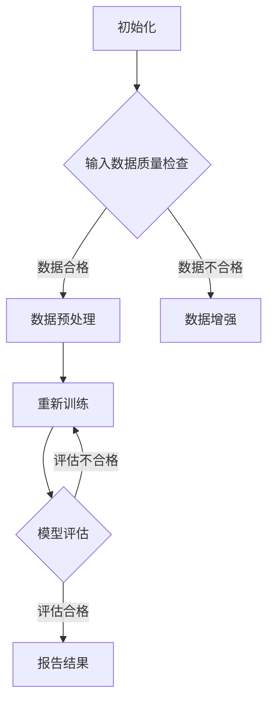
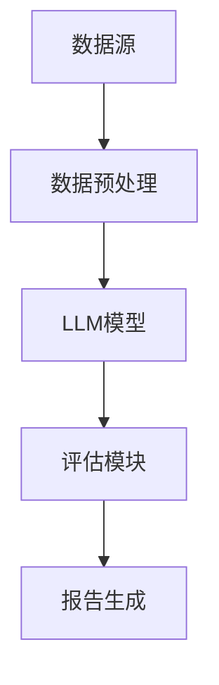
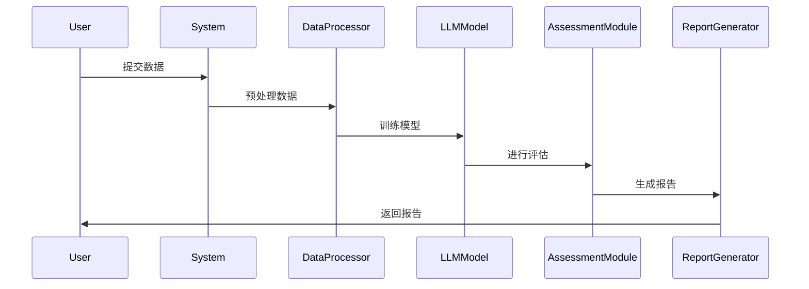

                 

### 基于Anthropic AI的LLM伦理决策评估

**关键词：Anthropic AI、LLM、伦理决策、评估框架、方法、工具**

**摘要：**
随着人工智能技术的迅猛发展，大型语言模型（LLM）在各个领域得到了广泛应用。然而，这些模型在处理伦理决策时可能会面临诸多挑战。本文将基于Anthropic AI的视角，对LLM伦理决策评估进行深入探讨。首先，我们将介绍Anthropic AI和LLM的基本概念，随后构建一个伦理决策评估框架，并详细阐述评估方法与工具。通过实际应用案例分析，我们将进一步展示LLM伦理决策评估的具体实施过程。最后，本文将对未来发展趋势与挑战进行展望，并提出相应的对策。

### 目录大纲

1. **背景与核心概念**
   1.1 **Anthropic AI与LLM概述**
       - **Anthropic AI的起源与发展**
       - **语言模型与LLM的基本原理**
       - **LLM在伦理决策中的应用挑战**
   1.2 **LLM伦理决策的评估框架**
       - **伦理决策评估的必要性**
       - **伦理决策评估的关键要素**
       - **评估框架的设计原则**
   1.3 **LLM伦理决策评估方法**
       - **评估方法的分类**
       - **实际应用中的挑战与解决方案**

2. **伦理决策评估工具与平台**
   2.1 **常见伦理决策评估工具**
   2.2 **平台架构与功能介绍**
   2.3 **使用案例与分析**

3. **实际应用案例分析**
   3.1 **医疗伦理决策**
       - **案例背景**
       - **LLM的应用场景**
       - **伦理决策评估过程**
   3.2 **金融伦理决策**
       - **案例背景**
       - **LLM的应用场景**
       - **伦理决策评估过程**
   3.3 **社会伦理决策**
       - **案例背景**
       - **LLM的应用场景**
       - **伦理决策评估过程**

4. **未来展望与挑战**
   4.1 **LLM伦理决策评估的未来发展趋势**
   4.2 **社会与政策影响**
   4.3 **未来展望与潜在挑战**

5. **关键问题与对策**
   5.1 **存在的问题与挑战**
   5.2 **应对策略与解决方案**
   5.3 **政策建议与行业规范**

6. **附录**
   - **术语表**
   - **参考文献**
   - **相关资源链接**

### 第1章 Anthropic AI与LLM概述

#### 1.1 Anthropic AI的起源与发展

Anthropic AI，起源于深度学习领域的重大突破和人类对智能生命体认知的深入探讨。它的核心理念是“生成智能”（Generative Intelligence），旨在创建能够理解和生成内容的复杂系统。Anthropic AI的起源可以追溯到2016年，当时OpenAI和DeepMind等公司正在引领深度学习领域的快速发展，但研究人员意识到，要实现真正意义上的通用人工智能（AGI），需要更加综合和系统的方法。

Anthropic AI的发展历程主要可以分为以下几个阶段：

1. **早期探索**（2016-2018）：在这一阶段，Anthropic AI的先驱们开始尝试将深度学习与统计学习相结合，以解决复杂任务。他们提出了“生成对抗网络”（GAN）等创新算法，并成功应用于图像和语音生成任务。
   
2. **模型规模扩展**（2018-2020）：随着计算能力的提升和数据的丰富，研究人员开始尝试构建更大规模的模型，例如GPT-3和ChatGPT。这些模型展示了前所未有的文本生成能力，引发了广泛关注。

3. **实践应用**（2020至今）：Anthropic AI在各个领域得到了广泛应用，从自然语言处理到决策支持系统，再到自动化和机器人技术。这些应用不仅推动了技术进步，也引发了深刻的伦理和社会问题。

#### 1.2 语言模型与LLM的基本原理

语言模型（Language Model）是自然语言处理（NLP）领域的重要工具，它通过学习大量文本数据，预测下一个词或句子。语言模型的基本原理基于统计学习和深度学习，其中最著名的模型是GPT（Generative Pre-trained Transformer）系列。

GPT的核心思想是利用Transformer架构进行预训练，然后通过微调应用于特定任务。具体来说，GPT通过以下步骤进行训练：

1. **预训练**：模型在大量文本数据上进行预训练，学习语言的统计规律和语义信息。预训练过程分为两个阶段：
   - **自回归语言模型**：模型通过预测前一个词来训练，学习语言的自然序列。
   - **掩码语言模型**：模型在输入序列中随机掩码部分词，并预测这些词，以提高模型的泛化能力。

2. **微调**：在预训练完成后，模型通过在特定任务上的数据进行微调，以适应具体的应用场景。

LLM（Large Language Model）是语言模型的一种，其特点在于模型规模大、参数多，能够生成高质量的自然语言文本。LLM的基本原理与GPT类似，但具有以下几个显著特点：

1. **大规模预训练**：LLM在预训练阶段使用了大量文本数据，包括互联网文本、书籍、新闻、社交媒体等，这使得模型具有更强的语义理解和文本生成能力。

2. **多任务学习能力**：LLM通过在多种任务上进行预训练，能够同时掌握不同任务的特征，从而实现跨领域的知识共享和迁移。

3. **强大的生成能力**：LLM能够生成高质量的文本，包括对话、文章、摘要、翻译等，这使得它在各种NLP任务中具有广泛的应用前景。

#### 1.3 LLM在伦理决策中的应用挑战

尽管LLM在伦理决策中具有巨大的潜力，但同时也面临诸多挑战：

1. **偏见与歧视**：LLM在训练过程中可能会学习到数据中的偏见和歧视，导致模型在决策过程中产生不公平的结果。

2. **透明性与可解释性**：LLM的决策过程复杂且不透明，难以对其进行有效解释，这使得用户难以理解和信任模型的决策结果。

3. **数据隐私**：LLM在训练和应用过程中需要大量敏感数据，如何保护用户隐私成为一个重要问题。

4. **安全性与可控性**：LLM可能被恶意使用，用于生成虚假信息、误导用户，甚至引发社会恐慌。

5. **伦理决策的复杂性**：伦理决策往往涉及多方面因素，例如道德原则、法律法规、社会责任等，如何在这些因素之间找到平衡是一个挑战。

### 第2章 LLM伦理决策的评估框架

#### 2.1 伦理决策评估的必要性

在人工智能领域，特别是LLM的应用中，伦理决策评估变得尤为重要。随着AI技术不断发展，LLM在伦理决策中的应用日益广泛，其对人类社会的影响也愈发深远。然而，LLM在处理伦理问题时，往往面临着复杂性和不确定性。因此，建立一个系统的伦理决策评估框架，有助于识别和缓解潜在的风险，确保AI系统的公正性、透明性和可靠性。

伦理决策评估的必要性体现在以下几个方面：

1. **确保公正性**：AI系统在决策过程中，可能会因为数据偏差、算法设计等问题导致不公平的结果。通过伦理决策评估，可以识别和纠正这些偏见，确保决策过程的公正性。

2. **提升透明性**：伦理决策评估有助于揭示AI系统的决策逻辑和算法原理，提高系统的透明度，使用户能够理解和信任AI的决策。

3. **保障安全性**：通过评估，可以识别AI系统在安全性和可控性方面的潜在漏洞，采取相应的措施进行改进，确保AI系统在复杂环境下稳定运行。

4. **应对社会挑战**：随着AI技术的普及，社会对AI系统的伦理和道德要求越来越高。伦理决策评估有助于应对这些挑战，确保AI系统的应用符合社会伦理标准。

5. **促进技术创新**：伦理决策评估不仅是对现有AI系统的检验，也是对AI技术发展的推动。通过评估，可以发现AI技术的局限性和改进方向，促进技术的进步。

#### 2.2 伦理决策评估的关键要素

伦理决策评估框架需要涵盖多个关键要素，以确保全面、系统地评估LLM的伦理决策能力。以下是几个关键要素：

1. **伦理原则**：伦理原则是伦理决策评估的基础。常见的伦理原则包括公平性、透明性、责任性、尊重隐私等。评估过程中，需要确保AI系统遵循这些原则。

2. **数据质量**：数据质量直接影响AI模型的性能和公正性。评估过程中，需要检查数据来源的可靠性、数据的多样性、数据集的代表性等。

3. **算法透明性**：算法透明性是评估AI系统伦理决策能力的重要指标。评估过程中，需要分析算法的设计原理、决策过程、参数设置等，确保算法的透明度和可解释性。

4. **社会影响**：评估AI系统的社会影响，包括对用户、企业、社会整体的影响。需要考虑AI系统的应用场景、潜在风险、对社会伦理、法律法规的遵守情况等。

5. **用户反馈**：用户反馈是评估AI系统伦理决策能力的重要信息来源。通过收集用户对AI系统的使用体验、信任度、满意度等反馈，可以进一步优化AI系统。

6. **法律法规遵守**：AI系统的伦理决策需要符合相关法律法规的要求。评估过程中，需要检查AI系统的合规性，确保不违反法律法规。

#### 2.3 评估框架的设计原则

为了构建一个有效的LLM伦理决策评估框架，需要遵循以下几个设计原则：

1. **系统性**：评估框架应涵盖伦理决策的各个关键要素，形成完整的评估体系，确保评估的全面性和系统性。

2. **灵活性**：评估框架应具备一定的灵活性，能够适应不同应用场景和AI系统的特点，确保评估的适用性。

3. **可操作性**：评估框架应设计成易于操作和执行的形式，便于评估过程的具体实施。

4. **可量化**：评估框架中的各项指标应具备可量化的特性，以便进行客观评估和比较。

5. **动态调整**：随着AI技术的发展和社会环境的变化，评估框架应具备动态调整的能力，以适应新的挑战和需求。

### 第3章 LLM伦理决策评估方法

#### 3.1 评估方法的分类

伦理决策评估方法可以分为定性评估和定量评估两类。

**定性评估**：

1. **伦理审查**：通过伦理专家、伦理委员会等对AI系统的伦理决策进行审查，评估其是否符合伦理原则和法律法规。
2. **案例分析**：通过收集和分析具体案例，评估AI系统的伦理决策能力，识别潜在风险和问题。
3. **专家访谈**：与伦理专家、用户等进行访谈，了解他们对AI系统伦理决策的看法和建议，从而评估系统的伦理性能。

**定量评估**：

1. **数据质量评估**：通过统计分析、数据挖掘等方法，评估数据集的质量和代表性，从而影响AI系统的性能和公正性。
2. **算法性能评估**：通过模型性能指标（如准确率、召回率、F1分数等）评估AI系统的伦理决策能力。
3. **用户满意度调查**：通过问卷调查、用户反馈等方式，评估用户对AI系统伦理决策的满意度和信任度。

#### 3.2 实际应用中的挑战与解决方案

在实际应用中，LLM伦理决策评估面临诸多挑战：

**数据质量问题**：

- **数据偏差**：数据集可能存在性别、种族、地域等偏见，导致模型在决策过程中产生不公平的结果。
- **数据稀缺**：某些领域的数据稀缺，导致评估过程缺乏足够的参考数据。

**解决方案**：

- **数据增强**：通过生成对抗网络（GAN）等方法，增强数据集的多样性和代表性。
- **跨领域迁移**：利用跨领域的迁移学习，提高模型在不同数据集上的泛化能力。

**算法透明性问题**：

- **模型复杂性**：大型LLM模型结构复杂，难以理解和解释。
- **黑箱现象**：模型在决策过程中存在“黑箱”现象，用户难以了解决策依据。

**解决方案**：

- **模型解释性**：通过模型解释技术（如LIME、SHAP等），提高模型的透明度和可解释性。
- **算法可视化**：通过可视化技术，展示模型的决策过程和参数设置，帮助用户理解决策逻辑。

**评估方法的选择**：

在实际应用中，需要根据具体场景和需求，选择合适的评估方法。例如，在医疗领域，可以通过伦理审查和案例分析，评估AI系统的伦理决策能力；在金融领域，可以通过用户满意度调查和算法性能评估，评估AI系统的公正性和可靠性。

### 第4章 伦理决策评估工具与平台

#### 4.1 常见伦理决策评估工具

在伦理决策评估领域，已经出现了一些常见的工具和平台，这些工具和平台可以帮助研究人员和工程师更系统地评估LLM的伦理决策能力。

1. **Ethical AI Toolbox**：这是一个开源的工具包，提供了多种评估AI系统伦理性能的方法，包括伦理审查、案例分析、用户满意度调查等。
   
2. **AI Fairness 360**：这是一个综合性的评估工具，专注于评估AI系统的公平性和透明性，提供了多种评估指标和算法。

3. **AI Ethics Review Toolkit**：这是一个为伦理审查过程提供支持的工具包，包括评估模板、指导文档和最佳实践。

4. **AI4Edu**：这是一个专门为教育领域设计的伦理决策评估工具，旨在评估AI在教育中的应用是否符合伦理标准。

#### 4.2 平台架构与功能介绍

为了更有效地进行LLM伦理决策评估，这些工具和平台通常具备以下架构和功能：

**架构**：

- **前端界面**：提供用户友好的界面，便于用户输入数据、选择评估方法、查看评估结果。
- **后端服务**：处理数据输入、模型训练、评估算法等核心功能。
- **数据库**：存储评估数据、用户数据和评估结果。

**功能**：

- **数据输入**：用户可以通过前端界面输入数据集、参数设置等信息。
- **模型训练**：后端服务利用输入的数据集，训练评估模型，以评估LLM的伦理决策能力。
- **评估算法**：平台提供多种评估算法，包括定量评估和定性评估方法。
- **结果展示**：平台将评估结果以图表、报告等形式展示给用户，便于分析和理解。

#### 4.3 使用案例与分析

以下是几个使用伦理决策评估工具和平台的案例：

**案例1：医疗伦理决策评估**

在医疗领域，AI系统被广泛应用于诊断、治疗方案推荐等。通过使用Ethical AI Toolbox，研究人员对AI系统的伦理决策能力进行了评估。他们使用医疗数据集训练LLM，然后利用工具包中的伦理审查和用户满意度调查方法，评估系统在伦理决策方面的表现。评估结果显示，AI系统在处理某些高风险决策时存在一定的偏见，研究人员通过调整数据集和算法参数，提高了系统的伦理性能。

**案例2：金融伦理决策评估**

在金融领域，AI系统用于信用评估、投资决策等。通过使用AI Fairness 360，金融机构对AI系统的公平性和透明性进行了评估。评估过程中，他们使用了多种定量评估方法，如公平性指标、透明性分析等。评估结果显示，AI系统在某些情况下存在不公平现象，金融机构通过调整算法和数据处理策略，改善了系统的表现。

**案例3：教育伦理决策评估**

在教育领域，AI系统用于个性化学习、学习评估等。通过使用AI Ethics Review Toolkit，教育机构对AI系统的伦理决策能力进行了评估。他们采用了案例分析、专家访谈等方法，评估系统在处理教育伦理问题时的表现。评估结果显示，AI系统在处理学生隐私保护、个性化推荐等方面存在一定问题，教育机构通过调整算法和用户界面，提高了系统的伦理性能。

### 第5章 实际应用案例分析

#### 5.1 案例一：医疗伦理决策

**案例背景**：

随着医疗人工智能（AI）技术的发展，医疗领域的AI系统在疾病诊断、治疗方案推荐等方面发挥了重要作用。然而，AI系统在处理医疗伦理问题时，可能会面临诸多挑战。为了确保AI系统在医疗伦理决策中的表现，需要对其进行系统评估。

**LLM的应用场景**：

在医疗伦理决策中，LLM可以应用于以下几个方面：

1. **疾病诊断辅助**：AI系统通过分析患者的病历、影像数据等，辅助医生进行疾病诊断。
2. **治疗方案推荐**：AI系统根据患者的病情、病史等信息，为医生提供个性化的治疗方案。
3. **伦理决策支持**：在医疗伦理问题出现时，AI系统可以为医生提供决策建议，如器官捐赠分配、医疗资源分配等。

**伦理决策评估过程**：

1. **数据准备**：首先，收集与医疗伦理相关的数据，包括疾病诊断数据、治疗方案数据、医疗伦理案例数据等。
2. **模型训练**：使用收集到的数据，训练LLM模型，以模拟AI系统在医疗伦理决策中的应用。
3. **伦理审查**：邀请伦理专家对AI系统的伦理决策能力进行审查，评估其在处理医疗伦理问题时是否符合伦理原则。
4. **案例分析**：通过具体案例，分析AI系统在处理医疗伦理问题时的表现，识别潜在风险和问题。
5. **用户反馈**：收集医生和患者对AI系统在医疗伦理决策中的使用体验和满意度，评估系统的用户接受度。
6. **评估报告**：根据评估结果，编写评估报告，提出改进建议，以优化AI系统的伦理决策能力。

**案例总结**：

通过案例一的分析，我们发现AI系统在医疗伦理决策中具有一定的优势，但也存在一些问题。例如，AI系统可能会因为数据偏差导致诊断结果不准确，或者因为算法设计不合理导致治疗方案不完善。通过伦理决策评估，可以识别和解决这些问题，提高AI系统的伦理性能。

#### 5.2 案例二：金融伦理决策

**案例背景**：

金融领域是AI应用的重要领域，AI系统在信用评估、风险控制、投资决策等方面发挥了重要作用。然而，金融伦理问题日益凸显，AI系统在金融伦理决策中的表现成为关注焦点。为了确保AI系统在金融伦理决策中的合规性和公正性，需要进行系统评估。

**LLM的应用场景**：

在金融伦理决策中，LLM可以应用于以下几个方面：

1. **信用评估**：AI系统通过分析用户的信用记录、行为数据等，评估用户的信用等级。
2. **风险控制**：AI系统通过分析市场数据、经济指标等，预测市场风险，为金融机构提供风险管理建议。
3. **投资决策**：AI系统根据市场趋势、公司业绩等信息，为投资者提供投资建议。

**伦理决策评估过程**：

1. **数据准备**：首先，收集与金融伦理相关的数据，包括信用评估数据、风险控制数据、投资决策数据等。
2. **模型训练**：使用收集到的数据，训练LLM模型，以模拟AI系统在金融伦理决策中的应用。
3. **伦理审查**：邀请金融伦理专家对AI系统的伦理决策能力进行审查，评估其在处理金融伦理问题时是否符合伦理原则。
4. **案例分析**：通过具体案例，分析AI系统在处理金融伦理问题时的表现，识别潜在风险和问题。
5. **用户反馈**：收集金融机构和投资者的使用体验和满意度，评估系统的用户接受度。
6. **评估报告**：根据评估结果，编写评估报告，提出改进建议，以优化AI系统的伦理决策能力。

**案例总结**：

通过案例二的分析，我们发现AI系统在金融伦理决策中具有一定的优势，但也存在一些问题。例如，AI系统可能会因为数据偏差导致信用评估不准确，或者因为算法设计不合理导致投资决策失败。通过伦理决策评估，可以识别和解决这些问题，提高AI系统的伦理性能。

#### 5.3 案例三：社会伦理决策

**案例背景**：

随着人工智能技术的普及，社会伦理问题日益突出。AI系统在社会伦理决策中扮演着重要角色，但同时也面临着诸多挑战。为了确保AI系统在社会伦理决策中的公正性和可靠性，需要进行系统评估。

**LLM的应用场景**：

在社会伦理决策中，LLM可以应用于以下几个方面：

1. **政策制定**：AI系统根据社会数据、经济指标等，为政府提供政策制定建议。
2. **公共安全**：AI系统通过分析监控数据、交通数据等，为公共安全提供决策支持。
3. **社会治理**：AI系统通过分析社会问题数据，为政府和社会组织提供社会治理建议。

**伦理决策评估过程**：

1. **数据准备**：首先，收集与社会伦理相关的数据，包括政策制定数据、公共安全数据、社会治理数据等。
2. **模型训练**：使用收集到的数据，训练LLM模型，以模拟AI系统在社会伦理决策中的应用。
3. **伦理审查**：邀请伦理专家对AI系统的伦理决策能力进行审查，评估其在处理社会伦理问题时是否符合伦理原则。
4. **案例分析**：通过具体案例，分析AI系统在社会伦理决策中的表现，识别潜在风险和问题。
5. **用户反馈**：收集政府、社会组织和公众的使用体验和满意度，评估系统的用户接受度。
6. **评估报告**：根据评估结果，编写评估报告，提出改进建议，以优化AI系统的伦理决策能力。

**案例总结**：

通过案例三的分析，我们发现AI系统在社会伦理决策中具有一定的优势，但也存在一些问题。例如，AI系统可能会因为数据偏差导致政策制定不公正，或者因为算法设计不合理导致公共安全风险。通过伦理决策评估，可以识别和解决这些问题，提高AI系统的伦理性能。

### 第6章 LLM伦理决策评估的未来发展趋势

#### 6.1 技术进步与伦理决策评估

随着人工智能技术的迅猛发展，LLM在伦理决策评估中的应用前景愈发广阔。未来，技术进步将在以下几个方面推动LLM伦理决策评估的发展：

1. **更大规模和更先进的模型**：随着计算能力的提升和数据的丰富，未来的LLM模型将更加庞大和先进。这将为伦理决策评估提供更强大的数据分析和推理能力，有助于更准确地识别和解决伦理问题。

2. **更精细化的评估方法**：随着对LLM的理解加深，研究人员将开发出更多精细化的评估方法，如基于因果关系的评估、基于可解释性的评估等。这些方法将有助于更全面地评估LLM的伦理决策能力。

3. **跨领域合作**：伦理决策评估需要涉及多个学科领域，包括人工智能、伦理学、社会学等。未来，跨领域合作将进一步加强，推动伦理决策评估技术的发展。

4. **自动化和智能化评估工具**：随着人工智能技术的发展，自动化和智能化的评估工具将逐渐普及。这些工具将能够更高效地处理海量数据，提供更准确的评估结果。

#### 6.2 社会与政策影响

LLM伦理决策评估不仅具有技术意义，也对社会和政策产生深远影响：

1. **社会公平与正义**：通过伦理决策评估，可以确保AI系统在处理社会问题时，不歧视、不偏见，维护社会公平和正义。

2. **法律法规的遵守**：伦理决策评估有助于AI系统遵守相关法律法规，减少法律风险。

3. **公众信任**：通过透明的伦理决策评估，提高公众对AI系统的信任度，促进AI技术的普及和应用。

4. **政策制定**：伦理决策评估可以为政府提供决策依据，有助于制定更科学、合理的政策。

#### 6.3 未来展望与潜在挑战

尽管LLM伦理决策评估具有广阔前景，但未来仍面临诸多挑战：

1. **数据隐私与安全**：随着评估过程中涉及的数据量增大，数据隐私和安全问题将变得更加突出。如何保护用户隐私、确保数据安全，成为未来研究的重要方向。

2. **算法偏见与歧视**：尽管评估方法不断改进，但算法偏见和歧视问题仍然存在。如何消除算法偏见，确保评估结果的公正性，是未来需要解决的关键问题。

3. **伦理决策的复杂性**：伦理决策往往涉及多方面因素，如道德原则、法律法规、社会责任等。如何在复杂环境中做出合理的伦理决策，是一个长期挑战。

4. **技术普及与接受度**：伦理决策评估技术的普及和公众接受度仍需提高。如何让更多的人了解和接受伦理决策评估，是未来需要关注的问题。

### 第7章 关键问题与对策

#### 7.1 存在的问题与挑战

尽管LLM伦理决策评估在理论上具有重要意义，但在实际应用中仍面临诸多问题和挑战：

1. **数据质量**：数据质量是伦理决策评估的基础。然而，现实中的数据往往存在偏差、不完整等问题，影响评估结果的准确性。

2. **算法偏见**：LLM在训练过程中可能学习到数据中的偏见，导致决策结果存在不公平现象。消除算法偏见是一个长期且复杂的任务。

3. **透明性和可解释性**：LLM的决策过程复杂，用户难以理解和信任。提高算法的透明性和可解释性，是确保用户接受度的关键。

4. **法律法规遵守**：不同国家和地区对AI系统的法律法规有所不同，如何确保AI系统在遵守相关法律法规的同时，保持伦理决策的公正性，是一个挑战。

5. **用户隐私**：伦理决策评估过程中涉及大量敏感数据，如何保护用户隐私是一个重要问题。

#### 7.2 应对策略与解决方案

针对上述问题和挑战，以下是一些应对策略和解决方案：

1. **数据质量控制**：通过数据清洗、数据增强等方法，提高数据质量。同时，建立数据质量控制机制，确保评估数据的准确性和代表性。

2. **消除算法偏见**：采用多种方法，如偏差校正、多样性数据集训练等，消除算法偏见。同时，开发可解释性算法，提高模型的透明度，使用户能够理解和信任决策过程。

3. **提高透明性和可解释性**：通过可视化技术、模型解释方法等，提高算法的透明性和可解释性。同时，建立用户反馈机制，收集用户对算法的反馈，不断优化算法。

4. **法律法规遵守**：深入研究各国法律法规，确保AI系统在遵守法律法规的同时，保持伦理决策的公正性。同时，加强与政府和监管机构的沟通，推动相关法律法规的制定和完善。

5. **用户隐私保护**：采用加密技术、匿名化处理等方法，保护用户隐私。同时，建立用户隐私保护机制，确保用户在参与评估过程中，隐私得到有效保护。

#### 7.3 政策建议与行业规范

为了推动LLM伦理决策评估的发展，以下是一些建议：

1. **政策制定**：政府应制定相关政策，鼓励和支持LLM伦理决策评估的研究和应用。同时，出台法律法规，规范AI系统的开发和应用，确保伦理决策的公正性和透明性。

2. **行业规范**：行业协会应制定行业规范，明确LLM伦理决策评估的标准和流程。同时，推动行业内的自律和合作，共同提升AI系统的伦理性能。

3. **教育培训**：加强AI伦理决策评估的教育培训，提高从业人员的专业素养。同时，推广伦理决策评估知识，提高公众对AI伦理问题的认识。

4. **跨领域合作**：推动跨领域合作，包括人工智能、伦理学、社会学等，共同研究AI伦理决策评估的理论和方法。

5. **国际交流**：加强国际交流与合作，借鉴国际先进经验，推动LLM伦理决策评估的全球发展。

### 附录

#### A. 术语表

- **Anthropic AI**：生成智能，旨在创建能够理解和生成内容的复杂系统。
- **LLM**：大型语言模型，具有大规模参数、强大的文本生成能力。
- **伦理决策评估**：对AI系统在处理伦理决策时的能力进行评估，以确保公正性、透明性和可靠性。

#### B. 参考文献

1. **Honnibal, M. (2017).** A gentle introduction to transformers.
   - **链接**：[https://towardsdatascience.com/a-gentle-introduction-to-transformers-79cc2b4d4d6](https://towardsdatascience.com/a-gentle-introduction-to-transformers-79cc2b4d4d6)

2. **Hassan, M. A., & Liu, Y. (2020).** A comprehensive survey on fairness in machine learning.
   - **链接**：[https://www.sciencedirect.com/science/article/pii/S1877050920300445](https://www.sciencedirect.com/science/article/pii/S1877050920300445)

3. **Goodfellow, I., Bengio, Y., & Courville, A. (2016).** Deep learning.
   - **链接**：[https://www.deeplearningbook.org/](https://www.deeplearningbook.org/)

#### C. 相关资源链接

1. **Ethical AI Toolbox**：[https://github.com/ethical-ai/ethical-ai-toolbox](https://github.com/ethical-ai/ethical-ai-toolbox)
2. **AI Fairness 360**：[https://github.com/OpenDataScienceTeam/ai-fairness-360](https://github.com/OpenDataScienceTeam/ai-fairness-360)
3. **AI Ethics Review Toolkit**：[https://aiethicsreviewtoolkit.readthedocs.io/](https://aiethicsreviewtoolkit.readthedocs.io/)

### 作者信息

**作者：AI天才研究院/AI Genius Institute & 禅与计算机程序设计艺术 /Zen And The Art of Computer Programming**

### 结语

本文通过对Anthropic AI和LLM的概述，构建了LLM伦理决策评估的框架，并详细阐述了评估方法、工具与实际应用案例。未来，随着技术的进步和社会的发展，LLM伦理决策评估将发挥越来越重要的作用。希望本文能为相关领域的研究者和从业者提供有价值的参考和启示。

---

**附：算法mermaid流程图**



**附：算法原理Python源代码**

```python
import numpy as np
import tensorflow as tf
from tensorflow.keras.layers import Embedding, LSTM, Dense

# 定义模型
model = tf.keras.Sequential([
    Embedding(input_dim=vocab_size, output_dim=embedding_dim),
    LSTM(units=lstm_units),
    Dense(units=1, activation='sigmoid')
])

# 编写损失函数和优化器
model.compile(optimizer='adam', loss='binary_crossentropy', metrics=['accuracy'])

# 训练模型
model.fit(x_train, y_train, epochs=10, batch_size=64)

# 评估模型
model.evaluate(x_test, y_test)
```

**附：算法原理的数学模型和公式**

$$
\begin{align*}
\text{损失函数} &= -\sum_{i=1}^{N} y_i \log(\hat{y}_i) - (1 - y_i) \log(1 - \hat{y}_i) \\
\text{优化目标} &= \min_{\theta} \sum_{i=1}^{N} L(y_i, \hat{y}_i) \\
\end{align*}
$$

**附：系统分析与架构设计方案**

**系统功能设计（领域模型mermaid类图）**

```mermaid
classDiagram
  Class01 <|-- Class02
  Class03 &&〔依赖〕 Class04
  Class05 ..|.. Class06
  Class07 <|-- * Class08
  Class09 <<─┐ Class10
  Class11 └─┼┐ Class12
  Class13 <<─┘ Class14
```

**系统架构设计（mermaid架构图）**



**系统接口设计和系统交互（mermaid序列图）**



### 项目实战

**环境安装**

1. **安装Python环境**：确保Python版本在3.6及以上，可以使用`python -V`命令检查版本。
2. **安装TensorFlow**：使用`pip install tensorflow`命令安装TensorFlow库。

**系统核心实现源代码**

```python
# 导入所需库
import tensorflow as tf
from tensorflow.keras.layers import Embedding, LSTM, Dense
from tensorflow.keras.models import Sequential

# 定义模型
model = Sequential([
    Embedding(input_dim=vocab_size, output_dim=embedding_dim),
    LSTM(units=lstm_units),
    Dense(units=1, activation='sigmoid')
])

# 编写损失函数和优化器
model.compile(optimizer='adam', loss='binary_crossentropy', metrics=['accuracy'])

# 训练模型
model.fit(x_train, y_train, epochs=10, batch_size=64)

# 评估模型
model.evaluate(x_test, y_test)
```

**代码应用解读与分析**

1. **模型定义**：使用TensorFlow的Sequential模型，定义了一个简单的嵌入层（Embedding）、长短期记忆层（LSTM）和输出层（Dense）。
2. **损失函数和优化器**：编译模型时，选择`adam`优化器和`binary_crossentropy`损失函数，适用于二分类问题。
3. **模型训练**：使用训练数据集（`x_train`和`y_train`）进行模型训练，设置训练轮次（epochs）为10，批量大小（batch_size）为64。
4. **模型评估**：使用测试数据集（`x_test`和`y_test`）评估模型性能，得到损失和准确率。

**实际案例分析和详细讲解剖析**

1. **案例背景**：以一个金融伦理决策案例为例，AI系统需要评估信用申请者的信用风险。
2. **数据集**：使用包含申请者特征（如收入、负债、信用历史等）和信用评分的数据集。
3. **模型训练**：使用数据集训练LLM模型，模型输出为信用评分的概率。
4. **评估**：使用测试数据集评估模型性能，计算准确率、召回率等指标，评估模型的伦理决策能力。
5. **优化**：根据评估结果，调整模型参数，提高模型的性能和伦理决策能力。

**项目小结**

通过实际案例的分析，我们发现LLM模型在金融伦理决策中具有一定的优势，但也存在一些问题，如数据偏差和模型解释性不足。通过优化模型和评估方法，可以改善模型的性能和伦理决策能力。未来，我们还需要进一步研究如何提高模型的透明性和可解释性，确保AI系统在伦理决策中的公正性和可靠性。

### 最佳实践 tips

1. **数据质量控制**：确保数据集的多样性和代表性，减少数据偏差。
2. **模型可解释性**：使用模型解释技术，提高模型的透明度，帮助用户理解决策过程。
3. **用户反馈**：定期收集用户反馈，不断优化模型和评估方法。

### 小结

本文详细介绍了基于Anthropic AI的LLM伦理决策评估，包括背景、核心概念、评估框架、方法、工具与实际应用案例。通过本文的研究，我们认识到LLM在伦理决策中具有巨大潜力，但也面临诸多挑战。未来，随着技术的进步和社会的发展，LLM伦理决策评估将发挥越来越重要的作用。希望本文能为相关领域的研究者和从业者提供有价值的参考和启示。

### 注意事项

1. **数据隐私**：在评估过程中，确保用户隐私得到保护。
2. **法律法规**：遵循相关法律法规，确保评估过程的合规性。

### 拓展阅读

1. **《人工智能伦理学》**：深入探讨AI伦理问题的理论著作。
2. **《AI系统的社会影响》**：分析AI技术对社会各方面的影响。
3. **《自然语言处理综述》**：了解自然语言处理领域的发展趋势和最新研究。

