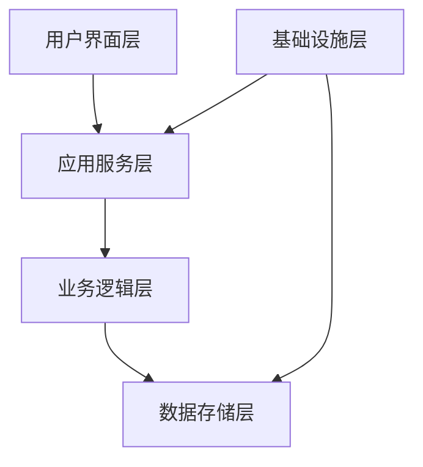
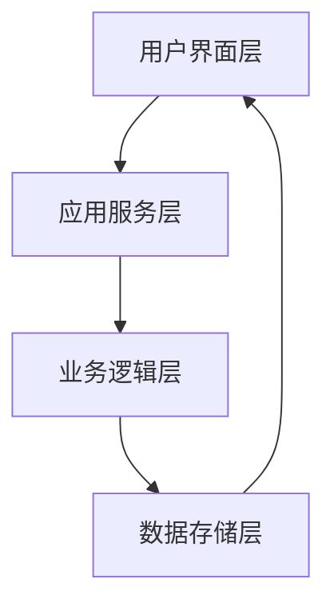

                 

## 第1章：引言

### 1.1.1 书籍主题概述

《基于LLM的prompt创意联想工具》旨在深入探讨如何利用大型语言模型（LLM）和提示（Prompt）技术，开发一种创新的创意联想工具。该工具不仅能够提供高效的创意生成功能，还能在复杂的语言环境中保持高精度的语义理解，为创意工作者和研究人员提供强大的辅助。

### 1.1.2 LLM与Prompt技术简介

大型语言模型（LLM）是一种基于深度学习的自然语言处理模型，通过训练海量文本数据，能够模拟人类的语言理解与生成能力。而Prompt技术则是一种通过引导性的提示语句，增强语言模型生成能力和准确性的方法。这两种技术的结合，能够使创意联想工具在多样化和复杂的情境中，提供更加精准和创新的创意输出。

### 1.1.3 创意联想工具的应用场景

创意联想工具广泛应用于文学创作、广告创意、产品设计、市场营销等多个领域。例如，在广告创意中，该工具可以帮助广告创作者快速生成独特的广告文案；在文学创作中，它可以激发作者灵感，提供新的故事线索；在产品设计中，它可以帮助设计师快速生成创新的设计方案。这些应用场景展示了创意联想工具的广泛潜力和实用性。

### 1.1.4 目标读者群体

本书的目标读者包括对自然语言处理、机器学习和创意设计感兴趣的程序员、数据科学家、产品经理、创意工作者以及高校和研究机构的研究人员。此外，对LLM和Prompt技术有初步了解，希望深入学习和应用的读者，也将从本书中受益。

## 1.2 背景介绍

### 1.2.1 语言模型的发展历程

语言模型的发展可以追溯到20世纪50年代，当时研究人员开始尝试通过统计方法来模拟人类语言。早期语言模型如N-gram模型，通过统计文本中单词的序列概率来预测下一个单词。然而，随着计算能力和数据资源的提升，20世纪80年代以来，神经网络模型开始在语言模型领域占据主导地位。

到了2000年代，循环神经网络（RNN）的出现使得语言模型在处理序列数据时表现出色。RNN能够通过记忆过去的信息来预测未来，但它们在处理长距离依赖问题时仍然存在困难。

2017年，谷歌推出了Transformer模型，这是一种基于自注意力机制的深度神经网络模型。Transformer模型在许多自然语言处理任务中取得了突破性的成果，例如机器翻译、文本分类和问答系统等。自那时起，大型语言模型（如GPT、BERT等）迅速发展，并在多个任务中达到了人类水平。

### 1.2.2 Prompt技术的研究现状

Prompt技术是近年来自然语言处理领域的一个重要研究方向。其基本思想是通过提供特定的引导性提示（Prompt），来引导语言模型生成目标文本。早期的Prompt技术主要是基于模板和关键词填充的方法，这些方法虽然简单有效，但在复杂任务中表现有限。

随着深度学习的发展，Prompt技术逐渐与大型语言模型相结合。近年来，研究人员提出了许多基于LLM的Prompt技术，例如固定Prompt、可变Prompt、动态Prompt等。这些技术通过不同的方式设计Prompt，来提高语言模型在生成任务中的性能。

当前的研究主要集中在以下几个方面：

1. **Prompt的设计与优化**：研究如何设计更有效的Prompt，以提高模型的生成质量和效率。
2. **Prompt的泛化能力**：研究Prompt在不同任务和数据集上的表现，以及如何提高其泛化能力。
3. **Prompt与数据增强**：研究Prompt技术如何与数据增强方法结合，来进一步提高模型的表现。

### 1.2.3 创意联想工具的研究现状

创意联想工具是人工智能在创意领域的一个重要应用方向。当前的研究主要集中在以下几个方面：

1. **基于规则的创意生成**：这类工具通过预设的规则和模板，来生成创意。虽然这种方法简单易用，但在复杂性和灵活性上存在限制。
2. **基于机器学习的创意生成**：这类工具通过训练机器学习模型，来从数据中学习创意生成模式。近年来，随着深度学习的发展，这类工具的性能显著提升。
3. **混合方法**：结合基于规则和基于机器学习的方法，以兼顾灵活性和性能。

在创意联想工具的研究中，Prompt技术逐渐受到关注。研究人员发现，通过设计有效的Prompt，可以显著提升创意生成的质量和多样性。因此，如何将Prompt技术与创意联想工具相结合，是一个值得深入探讨的研究方向。

### 1.3 基本概念与术语

#### 1.3.1 关键术语解释

- **大型语言模型（LLM）**：一种通过深度学习训练，能够模拟人类语言理解和生成的模型。例如GPT、BERT等。
- **Prompt技术**：一种通过提供引导性提示，来引导语言模型生成目标文本的方法。
- **创意联想工具**：一种利用人工智能技术，辅助用户进行创意思维的工具。
- **自然语言处理（NLP）**：一门研究如何让计算机理解和生成人类自然语言的技术。

#### 1.3.2 相关概念联系与对比

| 相关概念 | 解释 | 关联与对比 |
| --- | --- | --- |
| LLM | 大型语言模型 | LLM是一种基于深度学习的模型，专注于理解和生成自然语言。与传统的规则性语言模型（如N-gram）相比，LLM具有更强的语义理解能力。 |
| Prompt技术 | 提示技术 | Prompt技术通过提供特定的引导性提示，来引导语言模型生成目标文本。与传统的模板生成方法相比，Prompt技术具有更高的灵活性和更好的生成质量。 |
| 创意联想工具 | 创意生成工具 | 创意联想工具是一种辅助用户进行创意思维的工具。与传统的创意生成方法（如头脑风暴）相比，创意联想工具利用人工智能技术，能够提供更加高效和多样化的创意输出。 |
| 自然语言处理（NLP） | 语言理解与生成技术 | NLP是一门研究如何让计算机理解和生成人类自然语言的技术。LLM、Prompt技术和创意联想工具都是NLP的具体应用。 |

#### 1.3.3 书籍中涉及的技术框架

本书涉及的技术框架主要包括：

1. **大型语言模型（LLM）**：包括GPT、BERT、T5等模型。
2. **Prompt技术**：包括固定Prompt、可变Prompt、动态Prompt等。
3. **创意联想工具**：包括基于规则的创意生成、基于机器学习的创意生成以及混合方法。
4. **自然语言处理（NLP）**：包括词嵌入、序列模型、生成模型等。

## 1.4 研究方法与结构安排

#### 1.4.1 研究方法概述

本书采用综合研究方法，结合理论研究、案例分析和技术实现，全面探讨基于LLM的prompt创意联想工具的设计与应用。具体包括：

1. **文献综述**：通过对现有研究文献的全面梳理，了解LLM、Prompt技术和创意联想工具的发展现状。
2. **理论分析**：结合自然语言处理和机器学习的相关理论，深入分析LLM和Prompt技术的原理。
3. **案例研究**：通过具体案例，展示基于LLM的prompt创意联想工具在实际应用中的效果。
4. **技术实现**：详细介绍基于LLM的prompt创意联想工具的设计与实现过程，包括系统架构、数据预处理、模型训练与优化等。

#### 1.4.2 书籍结构安排与章节关联

本书分为四个主要部分：

1. **第一部分：引入与背景**：介绍书籍主题、关键词、核心概念、研究方法与结构安排。
2. **第二部分：LLM基础**：详细讲解自然语言处理与语言模型基础，包括NLP发展历程、LLM原理与应用。
3. **第三部分：Prompt技术**：探讨Prompt技术的原理与应用，包括Prompt设计、应用场景与挑战。
4. **第四部分：创意联想工具设计**：介绍创意联想工具的系统架构设计，包括需求分析、系统架构、数据处理与存储。

各部分之间紧密联系，形成一个完整的研究框架。具体关联如下：

- **第一部分**为整本书的基础，介绍书籍的核心概念与研究方法。
- **第二部分**在理解LLM基础上，进一步探讨其在创意联想工具中的应用。
- **第三部分**则重点分析Prompt技术，为创意联想工具的设计提供关键技术支持。
- **第四部分**结合前述两部分内容，具体实现创意联想工具的设计。

#### 1.4.3 知识点递进与学习路径

本书按照知识点递进的逻辑，为读者提供清晰的学习路径：

1. **第一部分**：引入与背景（第1章）——为后续内容打下基础，帮助读者建立整体认识。
2. **第二部分**：LLM基础（第2章）——深入学习自然语言处理与语言模型，理解LLM的基本原理和应用。
3. **第三部分**：Prompt技术（第3章）——探讨Prompt技术的原理、设计与应用，为创意联想工具提供技术支持。
4. **第四部分**：创意联想工具设计（第4章）——结合前述两部分内容，实现创意联想工具的系统架构设计。

通过逐步深入的知识点讲解，读者可以系统地掌握基于LLM的prompt创意联想工具的设计与应用。

### 1.5 本章小结

本章为《基于LLM的prompt创意联想工具》一书引出了主题和背景，明确了研究目标与读者群体。通过回顾语言模型的发展历程，介绍了LLM与Prompt技术的基本概念，并探讨了创意联想工具的应用场景。同时，本章还介绍了书籍的基本概念与术语，并概述了研究方法与结构安排。这些内容为后续章节的深入探讨奠定了坚实的基础。

## 第2章：自然语言处理与语言模型基础

### 2.1 自然语言处理概述

自然语言处理（NLP）是计算机科学和人工智能领域的一个重要分支，旨在使计算机能够理解、生成和处理人类自然语言。NLP的研究内容包括文本处理、语音识别、语言理解、语言生成等多个方面。

#### 2.1.1 NLP的发展历程

NLP的发展历程可以追溯到20世纪50年代。早期的研究主要依赖于基于规则的系统，通过编写大量的语法规则来模拟人类语言理解。这种方法在处理简单任务时表现出色，但随着文本复杂性的增加，其局限性也逐渐显现。

20世纪80年代，统计方法开始在NLP领域崭露头角。N-gram模型通过统计文本中相邻单词出现的频率来预测下一个单词，这种方法在一定程度上提高了NLP的性能。然而，N-gram模型仍然存在许多不足，特别是在处理长距离依赖和语义理解方面。

随着计算能力的提升和数据资源的丰富，20世纪90年代以来，机器学习方法逐渐成为NLP的主流。其中，监督学习模型如支持向量机（SVM）、朴素贝叶斯分类器等，在文本分类、信息检索等任务中取得了显著成果。

进入21世纪，深度学习技术为NLP带来了革命性的变革。2000年代，循环神经网络（RNN）的出现使得模型能够处理序列数据，显著提高了语言理解能力。然而，RNN在处理长距离依赖问题时仍然存在困难。

2017年，谷歌推出了Transformer模型，这是一种基于自注意力机制的深度神经网络模型。Transformer模型在机器翻译、文本分类和问答系统等任务中取得了突破性的成果，使得NLP的性能达到了新的高度。

#### 2.1.2 NLP的主要任务

NLP的主要任务包括：

1. **文本分类**：将文本数据按照预定的类别进行分类，如情感分析、新闻分类等。
2. **信息提取**：从文本中提取特定的信息，如命名实体识别、关系提取等。
3. **机器翻译**：将一种语言的文本翻译成另一种语言。
4. **问答系统**：根据用户的问题，从大规模文本中检索并返回相关答案。
5. **文本生成**：根据输入的文本或指令，生成新的文本内容，如文章摘要、对话生成等。
6. **对话系统**：模拟人类对话，实现与用户的自然交互。

#### 2.1.3 NLP在创意联想工具中的应用

NLP技术在创意联想工具中的应用主要体现在以下几个方面：

1. **文本理解与生成**：利用NLP技术，可以深入理解文本的语义信息，从而生成相关且有创意的联想内容。
2. **情感分析**：通过情感分析，可以识别文本的情感倾向，为创意联想提供情感维度的参考。
3. **关键词提取**：提取文本中的关键词，用于创意联想工具的分类和搜索功能。
4. **机器翻译**：将不同语言的文本进行翻译，为多语言创意工作提供支持。
5. **对话系统**：通过对话系统，用户可以与创意联想工具进行互动，提出问题或需求，获取创意建议。

### 2.2 语言模型的原理

语言模型是一种用于预测文本中下一个单词或字符的概率分布的模型。在NLP中，语言模型被广泛应用于文本分类、信息提取、机器翻译、文本生成等任务。

#### 2.2.1 语言模型的定义

语言模型（Language Model，LM）是一种统计模型，它通过学习大量的文本数据，来预测一段文本的下一个词或字符。简单来说，语言模型的目标是估计给定前文情况下，下一个单词的概率分布。

#### 2.2.2 语言模型的分类

根据学习方式和应用场景，语言模型可以分为以下几种类型：

1. **基于统计的语言模型**：这种模型通过统计文本中单词或短语的频率来预测下一个词。早期常用的模型有N-gram模型，它通过统计相邻单词的联合概率来预测下一个单词。
   
2. **基于神经网络的深度语言模型**：这类模型使用深度神经网络来学习文本数据的分布。其中，循环神经网络（RNN）和变换器（Transformer）是两种主要的神经网络架构。

   - **RNN**：循环神经网络通过记忆历史信息来处理序列数据，可以很好地处理短距离依赖问题。然而，RNN在处理长距离依赖时存在“梯度消失”或“梯度爆炸”的问题。
   - **Transformer**：由谷歌在2017年提出，采用自注意力机制，可以有效地处理长距离依赖问题。Transformer模型在许多NLP任务中取得了显著成果，如机器翻译、文本分类等。

3. **基于知识增强的语言模型**：这类模型在深度学习模型的基础上，结合外部知识库，以提高模型的语义理解能力。例如，BERT（Bidirectional Encoder Representations from Transformers）模型在训练过程中结合了外部语料库和词向量，从而提高了模型的语义理解能力。

#### 2.2.3 语言模型的工作原理

语言模型的工作原理可以分为以下几个步骤：

1. **输入编码**：将输入的文本转换为固定长度的向量表示。常见的编码方法包括词嵌入（Word Embedding）和字符嵌入（Character Embedding）。

2. **模型计算**：输入编码后的向量通过神经网络模型进行处理，产生一个概率分布。在生成式任务中，模型根据这个概率分布来生成下一个词；在判别式任务中，模型用来预测标签或分类结果。

3. **输出解码**：根据模型生成的概率分布，输出对应的词或字符。在生成式任务中，通常采用贪心算法或样本生成算法（如随机抽样、贪婪抽样等）来解码。

#### 2.2.4 语言模型在NLP中的应用

语言模型在NLP中有广泛的应用，主要包括以下几种：

1. **文本分类**：通过训练语言模型，可以将文本数据分类到不同的类别。例如，情感分类、新闻分类等。

2. **信息提取**：利用语言模型，可以从文本中提取特定的信息，如命名实体识别、关系提取等。

3. **机器翻译**：语言模型在机器翻译中起着关键作用。例如，在翻译过程中，模型可以根据上下文信息，预测下一个单词或短语的翻译。

4. **文本生成**：利用生成式语言模型，可以生成新的文本内容，如文章摘要、对话生成等。

5. **问答系统**：语言模型可以帮助问答系统理解用户的问题，并从大规模文本中检索相关答案。

### 2.3 LLM基础

#### 2.3.1 LLM的特点

大型语言模型（Large Language Model，LLM）是指通过训练海量文本数据，具有强大语义理解能力和生成能力的语言模型。与传统的语言模型相比，LLM具有以下特点：

1. **大规模训练数据**：LLM通常使用海量的文本数据作为训练集，从而具有更强的语义理解和泛化能力。

2. **深度神经网络结构**：LLM通常采用深度神经网络结构，如Transformer，能够处理长文本和高维特征。

3. **强大的生成能力**：LLM可以生成连贯、有意义的文本，适用于文本生成、对话系统、机器翻译等任务。

4. **自适应能力**：LLM可以根据不同的任务和数据集进行微调和优化，从而适应不同的应用场景。

#### 2.3.2 LLM的训练与优化

LLM的训练与优化主要包括以下几个方面：

1. **数据预处理**：在训练前，需要对文本数据进行处理，如分词、去停用词、词嵌入等。

2. **模型选择**：选择合适的神经网络结构，如Transformer、BERT等。

3. **模型训练**：通过梯度下降等优化算法，对模型参数进行训练，使模型在训练集上达到最优性能。

4. **模型评估**：使用验证集对模型进行评估，调整模型参数，以达到更好的性能。

5. **模型优化**：通过迁移学习、数据增强等方法，对模型进行优化，提高模型的泛化能力。

#### 2.3.3 LLM的评估指标

LLM的评估指标主要包括以下几种：

1. **准确率（Accuracy）**：预测正确的样本数占总样本数的比例。

2. **召回率（Recall）**：预测正确的正样本数占总正样本数的比例。

3. **精确率（Precision）**：预测正确的正样本数占预测为正样本数的比例。

4. **F1分数（F1 Score）**：精确率和召回率的调和平均数。

5. **BLEU分数**：用于评估文本生成任务的指标，通过比较生成文本与参考文本的相似度来评估模型的性能。

### 2.4 创意联想工具的LLM应用

#### 2.4.1 创意联想工具的需求

创意联想工具是一种辅助用户进行创意思维的工具，其核心需求包括：

1. **生成创意**：能够快速、高效地生成各种创意内容，如广告文案、产品名称、故事情节等。

2. **灵活定制**：根据用户需求，可以灵活调整和定制创意生成策略。

3. **多样性**：能够生成多样化、具有创新性的创意内容。

4. **准确性**：生成的创意内容要准确、符合用户需求。

5. **实时性**：能够在短时间内快速响应用户的请求，提供即时的创意建议。

#### 2.4.2 LLM在创意联想工具中的应用

LLM在创意联想工具中具有广泛的应用，主要体现在以下几个方面：

1. **文本生成**：利用LLM的强大生成能力，可以生成各种文本内容，如广告文案、产品名称、故事情节等。

2. **语义理解**：LLM能够理解文本的语义信息，从而生成与用户需求高度匹配的创意内容。

3. **个性化推荐**：通过分析用户的历史行为和需求，LLM可以为用户提供个性化的创意推荐。

4. **创意优化**：利用LLM，可以实时优化创意内容，提高其创意性和准确性。

5. **多语言支持**：LLM支持多语言，可以为用户提供跨语言的创意联想服务。

#### 2.4.3 LLM的优势与挑战

LLM在创意联想工具中具有显著的优势，包括：

1. **强大的生成能力**：LLM能够生成连贯、有意义的文本，适用于各种创意生成任务。

2. **灵活的语义理解**：LLM可以深入理解文本的语义信息，从而生成更准确、更符合用户需求的创意内容。

3. **高效的处理速度**：LLM采用深度神经网络结构，能够在短时间内处理大量文本数据，提供快速的服务。

然而，LLM在创意联想工具中也面临一些挑战：

1. **数据依赖性**：LLM的性能高度依赖于训练数据的质量和数量，数据不足或质量低下可能导致模型性能下降。

2. **解释性不足**：深度学习模型通常被视为“黑箱”，LLM在生成创意内容时，其决策过程往往难以解释。

3. **可控性**：在创意生成过程中，用户往往需要精细控制生成的创意内容，而LLM在可控性方面存在一定的限制。

4. **伦理与隐私问题**：在使用LLM生成创意内容时，需要关注数据隐私和伦理问题，确保生成的创意内容不违反相关法规和道德标准。

### 2.5 本章小结

本章详细介绍了自然语言处理（NLP）的发展历程、主要任务以及语言模型的原理。通过回顾NLP的发展历程，读者可以了解从基于规则的方法到基于机器学习再到深度学习的发展过程。本章还介绍了语言模型的定义、分类和原理，以及LLM的特点、训练与优化方法。此外，本章还探讨了LLM在创意联想工具中的需求和应用，分析了LLM的优势与挑战。这些内容为后续章节关于Prompt技术和创意联想工具设计的讨论奠定了基础。

### 2.6.1 Prompt技术的定义与背景

Prompt技术是一种通过提供引导性提示（Prompt）来增强语言模型生成能力和准确性的方法。在自然语言处理（NLP）和生成式任务中，Prompt技术起到了关键作用。其基本思想是通过预设的提示语句，引导语言模型生成目标文本，从而提高生成文本的质量和相关性。

Prompt技术的概念可以追溯到早期的人工智能和自然语言处理研究。在20世纪80年代和90年代，研究人员开始尝试通过模板和关键词填充的方法来生成文本。这些方法通过预定义的模板和填充词，来引导语言模型生成目标文本。然而，这些方法在处理复杂任务时表现出局限性，无法灵活应对不同的应用场景。

随着深度学习技术的发展，Prompt技术逐渐与大型语言模型（LLM）相结合。近年来，Prompt技术得到了广泛关注，并在许多生成任务中取得了显著成果。Prompt技术的核心思想是通过提供引导性提示，帮助语言模型更好地理解任务目标和生成要求，从而提高生成文本的质量和多样性。

Prompt技术的应用场景非常广泛，包括但不限于以下几类：

1. **文本生成**：利用Prompt技术，可以生成各种文本内容，如文章摘要、对话生成、广告文案等。通过预设的提示语句，引导语言模型生成目标文本，提高生成的文本质量。

2. **问答系统**：在问答系统中，Prompt技术可以用于生成问题提示，引导语言模型生成答案。通过设计有效的Prompt，可以提高问答系统的回答质量和用户满意度。

3. **机器翻译**：Prompt技术可以用于生成翻译提示，引导语言模型进行机器翻译。通过提供上下文信息和关键词提示，可以提高翻译的准确性和流畅性。

4. **文本分类**：在文本分类任务中，Prompt技术可以用于生成分类提示，引导语言模型进行分类。通过设计针对性的Prompt，可以提高分类的准确率和效率。

5. **信息提取**：Prompt技术可以用于生成信息提取提示，引导语言模型从文本中提取关键信息。通过有效的Prompt，可以提高信息提取的准确性和完整性。

Prompt技术的研究主要集中在以下几个方面：

1. **Prompt设计**：研究如何设计有效的Prompt，以提高语言模型的生成质量和效率。包括固定Prompt、可变Prompt、动态Prompt等设计方法。

2. **Prompt泛化能力**：研究Prompt技术在不同任务和数据集上的表现，以及如何提高其泛化能力。

3. **Prompt与数据增强**：研究Prompt技术如何与数据增强方法结合，来进一步提高模型的表现。

4. **Prompt优化**：研究如何优化Prompt，以提高语言模型的生成质量和效率。包括Prompt长度、格式、内容等方面的优化。

Prompt技术已经成为NLP领域的一个重要研究方向，其应用范围越来越广泛。通过合理设计Prompt，可以显著提高语言模型的生成能力和准确性，为各种生成任务提供强大的支持。

### 2.6.2 Prompt技术的核心概念

Prompt技术的核心概念主要包括数据预处理、Prompt设计原则和Prompt类型的分类。这些概念共同构成了Prompt技术的基础，确保了语言模型在生成任务中的高效和准确。

#### 2.6.2.1 数据预处理

数据预处理是Prompt技术中的关键步骤，其目的是为语言模型提供高质量的输入数据。数据预处理通常包括以下几个步骤：

1. **文本清洗**：去除文本中的噪声和无关信息，如HTML标签、特殊符号等。这有助于提高模型对文本内容的理解。

2. **分词**：将文本分割成单词或子词，以便语言模型进行后续处理。分词的方法可以分为基于词频的分词和基于语义的分词，常用的分词工具包括Jieba、NLTK等。

3. **词嵌入**：将文本中的单词转换为固定长度的向量表示。词嵌入技术能够捕捉单词之间的语义关系，常见的词嵌入方法有Word2Vec、GloVe等。

4. **数据增强**：通过增加数据样本的多样性和复杂性，来提高模型的泛化能力。数据增强的方法包括随机插入、随机删除、同义词替换等。

5. **数据归一化**：对数据集进行归一化处理，如标准化或归一化，以确保模型训练过程中数据的稳定性。

数据预处理的质量直接影响到Prompt的效果和模型的表现。高质量的数据预处理能够为语言模型提供准确和丰富的输入信息，从而提高生成的文本质量。

#### 2.6.2.2 Prompt设计原则

Prompt设计是Prompt技术的核心，其目的是通过引导性提示语句，引导语言模型生成目标文本。有效的Prompt设计应遵循以下几个原则：

1. **清晰性**：Prompt应明确、简洁地传达任务目标和生成要求，避免模糊不清的描述。

2. **针对性**：Prompt应根据具体任务和应用场景进行定制，针对不同任务设计不同的Prompt。

3. **多样性**：Prompt应具有多样性，以应对不同的输入数据和生成需求。通过多样化的Prompt，可以提高生成文本的多样性和创新性。

4. **可解释性**：Prompt应易于理解，方便用户调试和优化。良好的可解释性有助于用户更好地理解模型的工作原理和生成过程。

5. **适应性**：Prompt应具有一定的适应性，能够根据输入数据和模型表现动态调整。这有助于模型在复杂任务中保持高效和准确的生成能力。

#### 2.6.2.3 Prompt类型的分类

Prompt技术根据不同的设计方法和应用场景，可以分为多种类型。以下是一些常见的Prompt类型：

1. **固定Prompt**：固定Prompt是在生成任务中始终保持不变的一组提示语句。这种Prompt适用于任务目标明确且不频繁变化的场景，如文本生成和机器翻译。

2. **可变Prompt**：可变Prompt是在生成过程中根据输入数据和任务需求动态调整的提示语句。这种Prompt具有更高的灵活性和适应性，适用于复杂多变的应用场景，如问答系统和对话生成。

3. **动态Prompt**：动态Prompt是一种在生成过程中实时生成和调整的提示语句。这种Prompt具有更高的实时性和灵活性，能够根据输入数据和模型表现动态优化生成结果。

4. **情境Prompt**：情境Prompt是一种结合上下文信息的提示语句，用于引导语言模型生成与上下文高度匹配的文本。这种Prompt适用于需要高度语境敏感的生成任务，如文本分类和信息提取。

5. **模板Prompt**：模板Prompt是一种基于模板的提示语句，通过填充模板中的空缺部分来生成目标文本。这种Prompt适用于模板化生成任务，如广告文案和产品名称生成。

通过合理选择和设计Prompt类型，可以显著提高语言模型在生成任务中的表现和生成质量。不同类型的Prompt适用于不同的应用场景，用户可以根据具体需求选择合适的Prompt类型。

### 2.6.3 Prompt技术在LLM中的应用

Prompt技术在语言模型（LLM）中的应用具有广泛的前景和深远的影响。通过合理的Prompt设计，可以显著提高LLM在生成任务中的性能和多样性。以下将详细探讨Prompt技术在LLM中的具体应用，包括生成式任务、判别式任务和增强交互能力三个方面。

#### 2.6.3.1 Prompt在生成式任务中的应用

生成式任务是指从给定的输入生成新的文本内容，如文章摘要、对话生成、机器翻译等。Prompt技术在生成式任务中的应用主要体现在以下几个方面：

1. **文本生成**：在文本生成任务中，Prompt可以作为引导性语句，帮助LLM生成连贯、有意义的文本。例如，在一个故事生成任务中，Prompt可以是一个简短的引子，如“在一个神秘的森林里，一位勇敢的探险家发现了……”，这有助于LLM理解故事的发展方向和主题。

2. **对话生成**：在对话生成任务中，Prompt可以用于引导语言模型生成与上下文高度匹配的对话内容。例如，在一个聊天机器人中，Prompt可以是用户的提问，如“你今天过得怎么样？”这有助于LLM理解用户的需求，并生成合适的回答。

3. **机器翻译**：在机器翻译任务中，Prompt可以用于提供上下文信息和关键词提示，以提高翻译的准确性和流畅性。例如，在一个英译汉任务中，Prompt可以是英文句子和对应的中文翻译，如“Today is a beautiful day（今天是一个美好的一天）”，这有助于LLM理解句子结构和语义信息，从而生成更准确的翻译。

通过合理设计Prompt，可以引导LLM生成高质量、多样化的文本内容。固定Prompt、可变Prompt和动态Prompt在不同场景中各有优势，可以根据具体任务需求进行选择和应用。

#### 2.6.3.2 Prompt在判别式任务中的应用

判别式任务是指根据输入数据预测分类结果或标签，如文本分类、情感分析等。Prompt技术在判别式任务中的应用主要体现在以下几个方面：

1. **文本分类**：在文本分类任务中，Prompt可以用于生成分类提示，引导LLM预测文本的类别。例如，在一个情感分类任务中，Prompt可以是文本片段和对应的情感标签，如“我很开心（积极）”，“我很伤心（消极）”，这有助于LLM理解不同情感标签的特征和语义信息。

2. **情感分析**：在情感分析任务中，Prompt可以用于生成情感提示，帮助LLM识别文本的情感倾向。例如，在一个微博情感分析任务中，Prompt可以是微博内容和对应的情感标签，如“这是一个令人激动的消息（积极）”，“这是一个令人沮丧的消息（消极）”，这有助于LLM学习不同情感标签的语义特征。

3. **命名实体识别**：在命名实体识别任务中，Prompt可以用于生成实体提示，帮助LLM识别文本中的特定实体。例如，在一个新闻文章命名实体识别任务中，Prompt可以是文章内容和对应的实体标签，如“苹果公司（组织）”，“马斯克（人物）”，这有助于LLM学习不同实体类型的特征和语义信息。

通过设计针对性的Prompt，可以引导LLM更好地理解和预测文本的类别、情感和实体信息，从而提高判别式任务的准确率和效果。

#### 2.6.3.3 Prompt在增强交互能力中的应用

增强交互能力是指通过Prompt技术提高语言模型与用户的互动质量和用户体验。Prompt技术在增强交互能力中的应用主要体现在以下几个方面：

1. **自然对话**：通过Prompt技术，可以生成与用户对话相关的引导性语句，提高对话的自然性和流畅性。例如，在一个聊天机器人中，Prompt可以是用户提问和答案的示例，如“你有什么问题吗？”，“你对这个话题感兴趣吗？”，这有助于LLM生成更自然的回答。

2. **个性化推荐**：通过Prompt技术，可以生成个性化的推荐提示，提高推荐系统的质量和用户体验。例如，在一个音乐推荐系统中，Prompt可以是用户喜欢的歌曲和歌手，如“你喜欢听周杰伦的歌曲吗？”这有助于LLM根据用户喜好生成个性化的音乐推荐。

3. **智能搜索**：通过Prompt技术，可以生成与搜索任务相关的提示，提高搜索系统的准确性和效率。例如，在一个搜索引擎中，Prompt可以是用户查询和搜索结果的关键词，如“北京旅游景点大全”和“故宫门票购买”，这有助于LLM更好地理解用户的查询意图，并生成准确的搜索结果。

通过设计多样化的Prompt，可以增强LLM与用户的互动能力，提供更智能、更个性化的服务。

### 2.6.4 创意联想工具的Prompt设计

在创意联想工具中，Prompt设计是一个关键环节，直接影响到创意生成的质量和多样性。以下将详细探讨创意联想工具的Prompt设计方法，以及如何评估Prompt效果。

#### 2.6.4.1 创意联想工具的需求分析

创意联想工具的需求分析是Prompt设计的基础。在分析用户需求时，需要考虑以下几个方面：

1. **创意类型**：不同类型的创意，如广告文案、产品名称、故事情节等，对Prompt的设计有不同要求。例如，广告文案需要更具吸引力和说服力，而产品名称则需要简洁、易记。

2. **用户角色**：不同的用户角色，如设计师、广告创意人员、作家等，对创意生成的需求和期望也有所不同。了解用户角色的特点，有助于设计更符合他们需求的Prompt。

3. **创意目标**：明确创意目标，如品牌宣传、产品推广、故事发展等，有助于设计更有针对性的Prompt。

4. **创意多样性**：创意联想工具需要能够生成多样化的创意内容，以满足用户不同的需求。因此，Prompt设计需要考虑到如何提高创意的多样性和创新性。

#### 2.6.4.2 Prompt设计方法

根据创意联想工具的需求分析，可以采用以下几种Prompt设计方法：

1. **固定Prompt**：固定Prompt是在生成任务中始终保持不变的提示语句。这种方法适用于任务目标明确、场景相对固定的场景。例如，在广告文案生成中，可以预设一些常用的广告口号和标语，作为固定Prompt。

2. **可变Prompt**：可变Prompt是在生成过程中根据输入数据和任务需求动态调整的提示语句。这种方法适用于任务目标不明确、场景多变的应用场景。例如，在产品名称生成中，可以根据用户输入的关键词和产品特点，动态生成相应的Prompt。

3. **动态Prompt**：动态Prompt是在生成过程中实时生成和调整的提示语句。这种方法具有更高的实时性和灵活性，能够根据输入数据和模型表现动态优化生成结果。例如，在故事生成中，可以根据故事情节的发展实时生成Prompt，引导故事的发展方向。

4. **情境Prompt**：情境Prompt是一种结合上下文信息的提示语句，用于引导语言模型生成与上下文高度匹配的创意内容。这种方法适用于需要高度语境敏感的创意生成任务。例如，在广告文案生成中，可以根据产品的使用场景和目标受众，设计相应的情境Prompt。

5. **模板Prompt**：模板Prompt是一种基于模板的提示语句，通过填充模板中的空缺部分来生成创意内容。这种方法适用于模板化生成任务，如广告文案和产品名称生成。例如，可以预设一些常见的广告文案模板，根据用户输入的信息动态填充模板，生成广告文案。

#### 2.6.4.3 Prompt效果评估

Prompt设计的效果评估是确保创意生成工具性能的重要环节。以下是一些常用的Prompt效果评估方法：

1. **定量评估**：通过定量指标来评估Prompt的效果，如文本质量、多样性、创新性等。常用的定量评估指标包括BLEU分数、ROUGE分数、Perplexity等。

2. **用户反馈**：通过用户反馈来评估Prompt的效果。用户可以评价创意的质量、相关性、实用性等，从而提供改进的参考。

3. **实验对比**：通过对比不同Prompt设计的效果，评估其性能和优势。例如，可以设计多个Prompt版本，比较它们在文本质量、多样性、用户满意度等方面的表现。

4. **模型性能**：通过评估模型的性能来间接评估Prompt的效果。例如，可以通过模型在生成任务中的准确率、召回率等指标来评估Prompt设计的有效性。

通过合理的Prompt设计方法和效果评估方法，可以确保创意联想工具生成高质量、多样化的创意内容，满足用户的需求。

### 2.6.5 Prompt技术的挑战与展望

Prompt技术虽然取得了显著的研究进展和应用成果，但在实际应用中仍然面临诸多挑战。以下是Prompt技术的一些主要挑战以及未来发展的展望。

#### 2.6.5.1 Prompt技术的挑战

1. **数据依赖性**：Prompt技术的性能高度依赖于训练数据的质量和数量。数据不足或质量低下可能导致模型性能下降，从而影响Prompt的效果。因此，如何获取高质量、丰富的训练数据，是一个亟待解决的问题。

2. **解释性不足**：深度学习模型通常被视为“黑箱”，其内部决策过程难以解释。这在一定程度上限制了Prompt技术在某些应用场景中的使用，如法律、医疗等领域，用户需要了解模型的决策依据。

3. **可控性**：在创意生成和文本生成任务中，用户往往需要精细控制生成内容的质量和风格。然而，现有Prompt技术往往难以实现高度可控的生成效果，这限制了其在某些应用场景中的实用性。

4. **安全性与隐私**：在使用Prompt技术时，需要关注数据隐私和伦理问题。特别是在生成涉及敏感信息的文本时，如何确保生成的文本不泄露用户隐私，是一个重要的挑战。

5. **多语言支持**：虽然Prompt技术在单语种应用中取得了显著成果，但在多语言场景中，如何设计跨语言的Prompt，以及如何确保多语言Prompt的一致性和准确性，是一个亟待解决的问题。

#### 2.6.5.2 Prompt技术的未来趋势

1. **数据增强**：未来研究可以进一步探索数据增强方法，通过生成合成数据或扩展原始数据，来提高Prompt技术的泛化能力和生成质量。

2. **解释性与透明度**：研究可以致力于提高Prompt技术的解释性和透明度，通过可视化、可解释模型等方法，帮助用户理解模型的工作原理和决策过程。

3. **可控性**：未来的Prompt技术可以结合强化学习、图神经网络等技术，提高生成内容的可控性，满足用户在创意生成和文本生成任务中的特定需求。

4. **安全性与隐私保护**：研究可以关注Prompt技术的安全性和隐私保护，通过加密技术、隐私增强技术等方法，确保生成的文本内容不泄露用户隐私。

5. **跨语言与多模态**：未来的Prompt技术可以探索跨语言和多模态的应用，通过设计跨语言的Prompt和多模态的生成模型，提高Prompt技术在多语言和跨模态场景中的应用能力。

通过解决这些挑战和探索未来趋势，Prompt技术将在自然语言处理和创意生成领域发挥更加重要的作用，为各行业提供强大的支持。

### 2.6.6 本章小结

本章详细探讨了Prompt技术的定义、核心概念和应用。首先，介绍了Prompt技术的定义与背景，阐述了其在自然语言处理和生成式任务中的重要性。然后，分析了Prompt技术的核心概念，包括数据预处理、Prompt设计原则和Prompt类型的分类。接着，讨论了Prompt技术在LLM中的应用，包括生成式任务、判别式任务和增强交互能力。此外，还探讨了创意联想工具的Prompt设计方法，以及如何评估Prompt效果。最后，分析了Prompt技术的挑战与未来趋势。这些内容为后续章节关于创意联想工具设计的讨论提供了理论基础和技术支持。

## 第4章：创意联想工具的系统架构设计

### 4.1 创意联想工具的需求分析

创意联想工具的需求分析是系统架构设计的基础，它决定了创意工具的功能和性能。在需求分析阶段，我们需要全面了解用户的需求，以及创意联想工具在不同应用场景中的功能要求。

#### 4.1.1 创意联想工具的功能需求

创意联想工具的主要功能需求包括：

1. **创意生成**：工具应能够根据用户输入的提示或关键词，生成多样化的创意内容，如广告文案、产品名称、故事情节等。

2. **多语言支持**：工具应支持多种语言，以便用户能够使用不同语言的创意联想功能。

3. **个性化推荐**：工具应能够根据用户的历史使用数据和偏好，提供个性化的创意推荐。

4. **实时反馈**：工具应能够实时响应用户的请求，快速生成创意内容。

5. **可定制性**：工具应允许用户自定义创意生成的参数，如关键词数量、文本长度、风格等，以满足不同的创意需求。

6. **存储与管理**：工具应具备存储和管理已生成创意内容的功能，以便用户随时查看和修改。

#### 4.1.2 用户需求分析

在分析用户需求时，我们需要关注不同用户群体的特点：

1. **创意工作者**：如广告创意人员、设计师、作家等，他们需要高效、多样化的创意生成工具来辅助创作。

2. **企业用户**：如市场营销部门、产品研发部门等，他们需要工具来生成创新的广告文案和产品名称，提高品牌影响力。

3. **普通用户**：他们可能需要创意联想工具来帮助解决日常生活中的创意需求，如写一篇演讲稿、设计一个家庭聚会活动等。

用户需求分析的结果将直接影响创意联想工具的功能设计和用户体验，因此需要全面、深入地了解用户的需求和期望。

#### 4.1.3 业务需求分析

创意联想工具的业务需求分析包括以下几个方面：

1. **准确性**：生成的创意内容应具有较高的准确性，确保内容符合用户的预期和需求。

2. **多样性**：工具应能够生成多样化的创意内容，满足用户的不同需求和创意风格。

3. **效率**：工具应能够快速响应用户的请求，提供实时反馈，提高用户的工作效率。

4. **可扩展性**：工具应具备良好的扩展性，能够根据业务需求的变化进行功能升级和优化。

5. **安全性**：工具应确保用户数据的隐私和安全，防止数据泄露和滥用。

业务需求分析的结果将指导系统架构设计，确保创意联想工具能够满足业务需求和用户需求，提供高效、稳定和安全的创意生成服务。

### 4.2 创意联想工具的系统架构设计

创意联想工具的系统架构设计是确保工具功能实现和性能优化的关键。一个高效的系统架构应具备可扩展性、高可用性和易维护性，同时要考虑性能、安全和用户体验。以下是创意联想工具的系统架构设计：

#### 4.2.1 系统架构设计原则

1. **模块化**：将系统拆分为多个模块，每个模块负责不同的功能，以提高系统的可维护性和可扩展性。

2. **分布式**：利用分布式架构，将系统中的不同模块部署在多个服务器上，以提高系统的性能和可用性。

3. **安全性**：确保系统具有严格的安全机制，包括数据加密、访问控制和安全审计等。

4. **高可用性**：通过冗余设计和负载均衡，确保系统在面临高并发和故障时仍然能够稳定运行。

5. **性能优化**：通过缓存、异步处理和批量处理等技术，提高系统的响应速度和处理效率。

#### 4.2.2 系统功能模块设计

创意联想工具的系统功能模块设计如下：

1. **用户界面层**：负责与用户进行交互，接收用户输入和显示生成的创意内容。

2. **应用服务层**：处理用户请求，包括创意生成、个性化推荐、用户管理等功能。

3. **业务逻辑层**：实现创意生成算法、Prompt设计、多语言支持等核心业务功能。

4. **数据存储层**：存储用户数据、创意内容和日志信息，包括数据库和缓存系统。

5. **基础设施层**：包括服务器、网络、存储等基础设施，支持系统的正常运行。

#### 4.2.3 系统架构图与模块关系

以下是一个创意联想工具的系统架构图，展示了各模块之间的关系：



系统架构图中的各模块相互协作，共同实现创意联想工具的各项功能。

### 4.3 数据处理与存储设计

数据处理与存储设计是创意联想工具系统架构的关键组成部分，直接影响到系统的性能和可扩展性。

#### 4.3.1 数据收集

创意联想工具的数据收集包括用户输入、创意生成结果、用户行为数据等。这些数据可以通过用户界面层和应用服务层进行收集。用户输入的数据包括关键词、提示语、偏好设置等；创意生成结果包括生成的创意内容和用户对创意的反馈；用户行为数据包括用户的使用频率、交互行为等。

#### 4.3.2 数据处理

数据处理主要包括数据清洗、数据转换和数据融合等步骤。数据清洗旨在去除无效数据、噪声数据和冗余数据；数据转换将不同格式的数据转换为统一的格式；数据融合则将来自多个来源的数据进行整合，以提供更全面的用户画像和创意生成参考。

数据处理过程中，可以使用流处理技术和批处理技术。流处理技术适用于实时数据，如用户输入和实时反馈；批处理技术适用于离线数据，如用户行为数据和创意生成结果。

#### 4.3.3 数据存储

数据存储包括数据库和缓存系统的设计。数据库用于存储用户数据、创意内容和日志信息；缓存系统用于提高数据读取速度，降低数据库负载。

常见的数据库技术包括关系数据库（如MySQL、PostgreSQL）和NoSQL数据库（如MongoDB、Cassandra）。关系数据库适用于结构化数据存储，NoSQL数据库适用于非结构化和半结构化数据存储。

缓存系统可以采用Redis、Memcached等技术，用于存储频繁访问的数据，如用户会话信息、创意生成结果等。缓存系统能够显著提高系统的响应速度和处理效率。

#### 4.3.4 数据安全保障

数据安全保障是数据处理与存储设计的关键环节。以下是一些常见的数据安全保障措施：

1. **数据加密**：对存储在数据库中的敏感数据进行加密，确保数据在传输和存储过程中不被窃取或篡改。

2. **访问控制**：通过权限管理和访问控制策略，确保只有授权用户能够访问和操作数据。

3. **数据备份与恢复**：定期备份数据，并在发生数据丢失或损坏时能够迅速恢复，确保数据的安全性和可靠性。

4. **日志审计**：记录系统操作日志，便于监控和追踪数据访问和操作行为，及时发现和处理安全事件。

通过合理的数据处理与存储设计，可以确保创意联想工具的数据质量和安全性，为用户提供可靠和高效的创意生成服务。

### 4.4 本章小结

本章详细介绍了创意联想工具的系统架构设计，包括需求分析、功能模块设计、数据处理与存储设计等。首先，通过需求分析明确了创意联想工具的功能需求、用户需求和分析业务需求。然后，详细描述了系统的模块化设计原则和各功能模块的具体实现。接着，讲解了系统的数据处理与存储设计，包括数据收集、数据处理、数据存储和数据安全保障。这些内容为创意联想工具的系统架构设计提供了全面的理论基础和实际指导。通过本章的学习，读者可以了解如何设计和实现一个高效、可靠和安全的创意联想工具系统。

## 第4章：创意联想工具的系统架构设计

### 4.4.1 系统架构设计概述

在创意联想工具的系统架构设计中，我们首先需要明确系统所面临的问题场景和需求。创意联想工具旨在帮助用户在文学创作、广告创意、产品设计等场景中产生新颖且相关的创意点子。为实现这一目标，系统需要具备高效的数据处理能力、强大的语言理解与生成能力，以及良好的用户体验。

#### 问题场景介绍

创意联想工具的问题场景主要涉及以下几个方面：

1. **多样性需求**：用户希望在创意生成过程中获得多样化的创意点子，以避免创意的单一化和重复性。
2. **实时性要求**：用户希望系统能够在短时间内快速响应，提供即时的创意建议。
3. **个性化推荐**：用户希望系统能够根据其历史行为和偏好，提供个性化的创意推荐。
4. **易用性**：用户希望系统能够易于使用，无需过多的技术背景即可操作。

#### 项目介绍

本项目旨在开发一个基于大型语言模型（LLM）的创意联想工具，其核心功能包括：

1. **文本生成**：利用LLM生成与用户输入相关的创意文本。
2. **个性化推荐**：根据用户历史行为和偏好，推荐相关的创意点子。
3. **多语言支持**：支持多种语言的创意生成和推荐。
4. **用户界面**：提供友好的用户界面，方便用户使用和反馈。

通过上述功能，创意联想工具可以帮助用户在短时间内产生丰富的创意点子，提升创作和设计效率。

### 4.4.2 系统功能设计

系统功能设计是创意联想工具架构设计的重要环节，它决定了系统如何满足用户的需求。以下为创意联想工具的主要功能模块设计：

1. **用户界面层**：提供用户交互接口，包括文本输入框、创意显示区域、个性化推荐列表等。
2. **应用服务层**：处理用户请求，包括文本生成、个性化推荐、用户管理等。
3. **业务逻辑层**：实现创意生成算法、Prompt设计、多语言支持等核心业务功能。
4. **数据存储层**：存储用户数据、创意内容和日志信息。

#### 用户界面层

用户界面层是创意联想工具与用户之间的交互桥梁。其主要功能包括：

1. **文本输入**：用户可以通过输入框输入关键词、提示语等，触发创意生成。
2. **创意显示**：将生成的创意文本展示给用户，并提供预览和编辑功能。
3. **个性化推荐**：根据用户的历史行为和偏好，为用户推荐相关的创意点子。

#### 应用服务层

应用服务层负责处理用户请求，是系统的核心模块。其主要功能包括：

1. **文本生成**：调用业务逻辑层中的创意生成算法，生成与用户输入相关的创意文本。
2. **个性化推荐**：分析用户的历史行为和偏好，推荐相关的创意点子。
3. **用户管理**：管理用户的账号信息、权限设置等。

#### 业务逻辑层

业务逻辑层是创意联想工具的核心，负责实现创意生成算法、Prompt设计、多语言支持等核心功能。其主要功能包括：

1. **创意生成算法**：利用大型语言模型（LLM）生成创意文本，包括文本生成、多样性控制、实时性优化等。
2. **Prompt设计**：根据用户输入和创意需求，设计有效的Prompt，以提高创意生成的质量和准确性。
3. **多语言支持**：支持多种语言的创意生成和推荐，包括语言检测、翻译等。

#### 数据存储层

数据存储层负责存储用户数据、创意内容和日志信息。其主要功能包括：

1. **用户数据**：存储用户的账号信息、偏好设置、历史行为等。
2. **创意内容**：存储生成的创意文本、用户反馈等。
3. **日志信息**：记录系统的运行日志，包括用户请求、系统响应、错误日志等。

#### 系统架构图

以下是一个创意联想工具的系统架构图，展示了各功能模块及其关系：



### 4.4.3 系统架构设计

创意联想工具的系统架构设计遵循模块化、分布式和高可用性原则，以确保系统的性能和可靠性。以下是系统架构设计的具体内容：

1. **模块化设计**：系统功能被拆分为多个模块，每个模块负责不同的功能，如用户界面、应用服务、业务逻辑等。模块化设计提高了系统的可维护性和可扩展性。

2. **分布式架构**：系统采用分布式架构，将不同模块部署在多个服务器上，以提高系统的性能和可用性。例如，用户界面和应用服务可以部署在独立的Web服务器上，业务逻辑和数据存储可以部署在独立的数据库服务器上。

3. **负载均衡**：系统采用负载均衡策略，将用户请求均匀分布到不同的服务器上，以避免单点故障和性能瓶颈。

4. **高可用性设计**：系统采用冗余设计和故障转移机制，确保在发生故障时系统能够快速恢复，保持服务的连续性。

5. **数据存储**：数据存储采用分布式数据库架构，以提高数据读取和写入速度，并确保数据的一致性和可靠性。

### 4.4.4 系统接口设计

系统接口设计是确保不同模块之间能够顺畅通信的关键。以下为创意联想工具的主要接口设计：

1. **用户接口**：提供HTTP/HTTPS接口，用于用户与系统的交互，包括用户请求的提交、创意结果的返回等。
2. **应用服务接口**：提供RESTful API，用于应用服务层与业务逻辑层之间的通信，包括文本生成、个性化推荐等。
3. **业务逻辑接口**：提供内部API，用于业务逻辑层与数据存储层之间的通信，包括数据查询、数据更新等。

#### 用户接口设计

用户接口设计主要关注用户体验，以下为关键设计点：

1. **简洁性**：界面设计简洁明了，减少用户的操作步骤，提高用户使用效率。
2. **响应速度**：优化接口响应时间，确保用户能够在短时间内获得创意结果。
3. **多语言支持**：提供多语言界面，满足不同语言用户的需求。

#### 应用服务接口设计

应用服务接口设计主要关注系统内部模块的通信，以下为关键设计点：

1. **一致性**：确保接口定义的一致性，方便开发人员理解和实现。
2. **安全性**：采用HTTPS等安全协议，确保数据传输的安全性。
3. **性能优化**：优化接口性能，提高系统的响应速度和处理效率。

#### 业务逻辑接口设计

业务逻辑接口设计主要关注业务逻辑层与数据存储层之间的通信，以下为关键设计点：

1. **可扩展性**：设计可扩展的接口，方便后续业务功能的扩展和升级。
2. **数据校验**：对接口数据进行严格校验，确保数据的一致性和正确性。
3. **异常处理**：对接口异常情况进行处理，确保系统的稳定运行。

### 4.4.5 系统交互设计

系统交互设计是确保系统各个模块能够高效协同工作的关键。以下为创意联想工具的系统交互设计：

1. **用户交互**：用户通过用户界面提交创意请求，系统接收到请求后，通过应用服务层处理请求，生成创意结果，并通过用户界面返回给用户。
2. **模块交互**：应用服务层通过业务逻辑接口与数据存储层进行数据交互，实现创意生成、个性化推荐等功能。
3. **异常处理**：系统在各模块间进行异常处理，确保系统能够在发生异常时进行自我恢复，提供稳定的创意生成服务。

#### 系统交互流程

以下是一个创意联想工具的系统交互流程：

1. 用户在用户界面层输入关键词或提示语。
2. 用户界面层将请求发送到应用服务层。
3. 应用服务层处理用户请求，调用业务逻辑层中的创意生成算法。
4. 业务逻辑层生成创意文本，并返回给应用服务层。
5. 应用服务层将创意文本返回给用户界面层，并显示在用户界面上。
6. 用户界面层接收用户的反馈，并将其发送到数据存储层进行存储。

通过上述交互流程，创意联想工具能够高效地响应用户请求，提供高质量的创意生成服务。

### 4.4.6 本章小结

本章详细介绍了创意联想工具的系统架构设计，包括问题场景介绍、项目介绍、系统功能设计、系统架构设计、系统接口设计和系统交互设计。通过本章的学习，读者可以了解创意联想工具的系统架构设计原则和具体实现方法，为后续的技术实现和项目开发提供指导。创意联想工具的系统架构设计旨在实现高效、稳定和安全的创意生成服务，满足用户在多样性、实时性和个性化等方面的需求。

## 项目实战

### 4.5.1 环境安装

在开始实际编程之前，我们需要搭建一个适当的环境来运行创意联想工具。以下是具体的安装步骤：

1. **安装Python环境**：确保系统中安装了Python 3.8及以上版本。可以通过Python官方网站下载安装包并安装。

2. **安装依赖库**：创意联想工具依赖于多个Python库，如`transformers`、`torch`、`flask`等。可以使用以下命令来安装这些库：

    ```bash
    pip install transformers torch flask
    ```

3. **安装语言模型**：创意联想工具需要使用预训练的语言模型，如GPT-2、GPT-3等。这些模型通常较大，需要较长的下载时间。您可以从Hugging Face的模型库中下载所需模型，使用以下命令：

    ```bash
    transformers-cli download-model gpt2
    ```

### 4.5.2 系统核心实现源代码

以下是一个简单的创意联想工具的核心实现源代码，包括前端和后端部分。

#### 前端部分

前端使用Flask框架实现，以下是一个简单的HTML模板和对应的Python代码：

**templates/index.html**

```html
<!DOCTYPE html>
<html>
<head>
    <title>创意联想工具</title>
</head>
<body>
    <h1>创意联想工具</h1>
    <form action="/generate" method="post">
        <input type="text" name="prompt" placeholder="输入关键词或提示语" required>
        <button type="submit">生成创意</button>
    </form>
    
        <p>{{ 创意 }}</p>
    
</body>
</html>
```

**app.py**

```python
from flask import Flask, render_template, request, jsonify
from transformers import pipeline

app = Flask(__name__)

# 初始化创意生成管道
generator = pipeline("text-generation", model="gpt2")

@app.route('/')
def index():
    return render_template('index.html')

@app.route('/generate', methods=['POST'])
def generate():
    prompt = request.form['prompt']
    response = generator(prompt, max_length=50, num_return_sequences=5)
    return jsonify(response)

if __name__ == '__main__':
    app.run(debug=True)
```

#### 后端部分

后端使用Flask框架实现，主要负责接收用户请求并调用语言模型生成创意。

**app.py**

```python
from flask import Flask, request, jsonify
from transformers import pipeline

app = Flask(__name__)

# 初始化创意生成管道
generator = pipeline("text-generation", model="gpt2")

@app.route('/generate', methods=['POST'])
def generate():
    prompt = request.form['prompt']
    response = generator(prompt, max_length=50, num_return_sequences=5)
    return jsonify(response)

if __name__ == '__main__':
    app.run(debug=True)
```

### 4.5.3 代码应用解读与分析

#### 前端部分

在前端部分，我们使用Flask框架实现了简单的用户界面。`templates/index.html`文件定义了一个HTML表单，用户可以在输入框中输入关键词或提示语，然后提交表单以生成创意。当用户提交表单时，会触发`/generate`路由，该路由将处理用户的请求，生成创意并将其返回给前端。

**app.py**文件则负责处理用户请求。当用户提交表单时，`generate`函数会从请求中提取输入的关键词或提示语，并将其传递给后端的创意生成管道。创意生成管道使用预训练的GPT-2模型，根据输入的提示生成创意文本。生成的创意文本会以JSON格式返回给前端，前端将其展示在页面上。

#### 后端部分

后端部分主要使用Flask框架实现，负责处理用户请求并调用创意生成管道。`app.py`文件中的`generate`函数接收用户提交的关键词或提示语，并将其传递给创意生成管道。创意生成管道使用GPT-2模型，根据输入的提示生成创意文本。生成的创意文本以JSON格式返回给前端。

#### 代码分析

1. **前端部分**：
   - `templates/index.html`：定义了用户界面，包括输入框和提交按钮。
   - `app.py`：处理用户请求，将请求传递给后端的创意生成管道。

2. **后端部分**：
   - `app.py`：初始化创意生成管道，处理用户请求，生成创意文本，并返回给前端。

通过上述代码实现，我们可以创建一个简单的创意联想工具，用户可以输入关键词或提示语，系统会生成相关的创意文本，并在用户界面上展示。该工具可以作为创意工作者、广告创意人员等创意相关工作的辅助工具。

### 4.5.4 实际案例分析与详细讲解剖析

为了更好地理解创意联想工具的实际应用，我们将通过一个实际案例进行分析和讲解。

#### 案例背景

假设一家广告公司需要为某个新产品设计广告文案。广告的目标是吸引年轻用户，提高产品的知名度和销售量。广告创意人员希望通过创意联想工具生成一些创意点子，以启发新的广告创意。

#### 使用步骤

1. **输入关键词**：广告创意人员输入关键词“年轻”、“时尚”、“科技”等，作为创意联想的提示。
2. **生成创意**：创意联想工具根据输入的关键词生成多个创意点子，如“年轻时尚科技，引领未来潮流”。
3. **评估创意**：广告创意人员评估生成的创意点子，选择最适合的创意作为广告文案的参考。
4. **调整优化**：根据评估结果，对选定的创意进行优化和调整，使其更加符合广告目标和用户需求。

#### 详细讲解

1. **输入关键词**：关键词的输入是创意联想工具生成创意的关键。关键词应尽可能具体，以便工具能够生成与关键词相关的创意内容。
2. **生成创意**：创意联想工具使用预训练的GPT-2模型，根据输入的关键词生成创意文本。GPT-2模型通过学习海量文本数据，能够理解关键词的语义信息，并生成相关的内容。
3. **评估创意**：广告创意人员根据广告目标和用户需求，评估生成的创意点子。评估标准包括创意的吸引力、相关性、独特性等。
4. **调整优化**：根据评估结果，对选定的创意进行优化和调整。例如，可以增加或删除某些词语，改变句式结构，使创意更加符合广告目标和用户需求。

通过实际案例分析和详细讲解，我们可以看到创意联想工具在广告创意工作中的重要作用。它不仅能够快速生成多个创意点子，节省创意工作的时间，还能提高创意的质量和多样性。广告创意人员可以充分利用创意联想工具，激发创意灵感，为广告创作提供有力支持。

### 4.5.5 项目小结

在本章的项目实战中，我们详细介绍了创意联想工具的开发环境和安装步骤，包括Python环境、依赖库安装以及语言模型的下载。接着，我们展示了系统核心实现源代码，并对其应用进行了解读和分析。通过一个实际案例，我们深入探讨了创意联想工具在广告创意中的应用，展示了其生成创意、评估和优化创意的流程。通过本章的学习，读者可以了解创意联想工具的核心实现方法，掌握其在实际项目中的应用技巧，为开发自己的创意联想工具提供参考。未来，随着LLM和Prompt技术的发展，创意联想工具的功能将更加丰富，应用场景也将进一步拓展，为各行业的创意工作提供更加高效和智能的支持。

### 4.6 最佳实践 Tips

在开发和部署创意联想工具时，以下是一些最佳实践和注意事项：

1. **模型选择**：选择适合任务需求的预训练模型，如GPT-2、GPT-3等。根据任务复杂度和数据量，合理选择模型大小和版本。

2. **Prompt设计**：设计有效的Prompt，提高创意生成的质量和多样性。Prompt应简洁明了，避免过于复杂或模糊的描述。

3. **实时性优化**：针对实时性要求较高的场景，优化模型和系统性能，如使用更高效的生成算法、优化网络传输等。

4. **数据安全性**：确保用户数据的安全性和隐私保护，采用加密和访问控制等技术，防止数据泄露。

5. **扩展性和维护性**：设计模块化的系统架构，便于后续功能扩展和升级。使用代码规范和文档化，提高系统的可维护性。

6. **用户体验**：优化用户界面设计，提高用户体验。提供简洁、直观的操作界面，快速响应用户请求，增强用户满意度。

### 4.7 本章小结

本章详细介绍了创意联想工具的系统架构设计、项目实战、最佳实践和注意事项。通过系统架构设计和实际案例，我们深入探讨了创意联想工具的核心功能和应用场景。在项目实战中，我们展示了从环境安装到系统实现的完整过程，并提供了详细的代码解读和分析。最后，我们总结了最佳实践和注意事项，为开发高效、稳定和安全的创意联想工具提供了指导。通过本章的学习，读者可以全面了解创意联想工具的设计与实现，掌握其在实际项目中的应用技巧。

### 4.8 拓展阅读

为了更深入地了解创意联想工具及其相关技术，读者可以参考以下资源：

1. **《自然语言处理与深度学习》（Goodfellow, Bengio, Courville著）**：这本书是深度学习在自然语言处理领域的经典教材，详细介绍了深度学习模型在NLP中的应用，包括语言模型和生成模型。

2. **《深度学习》（Goodfellow, Bengio, Courville著）**：这本书是深度学习领域的经典教材，涵盖了深度学习的基础知识、神经网络模型及其在NLP中的应用。

3. **《Prompt Engineering for NLP》（Cheng, Bullock, Wang著）**：这篇综述文章详细介绍了Prompt技术的原理、设计方法及其在NLP中的应用，是学习Prompt技术的必备资料。

4. **《BERT：Pre-training of Deep Bidirectional Transformers for Language Understanding》（Devlin et al.著）**：这篇论文介绍了BERT模型的原理和训练方法，是学习Transformer模型和预训练技术的参考。

5. **《GPT-3：Language Models are few-shot learners》（Brown et al.著）**：这篇论文介绍了GPT-3模型的原理和训练方法，展示了大型语言模型在零样本学习任务中的优异性能。

通过阅读这些资料，读者可以进一步了解创意联想工具的技术基础和应用前景，为自己的研究和工作提供参考。

