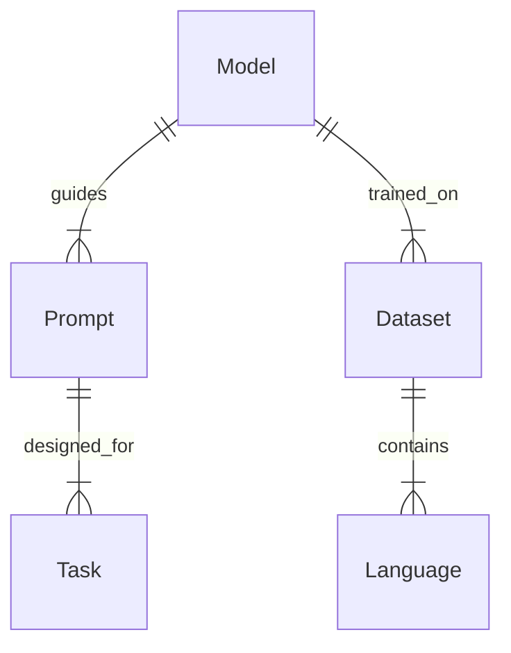
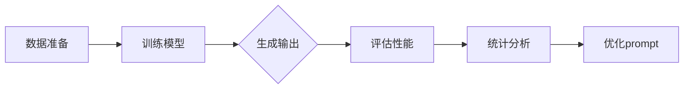
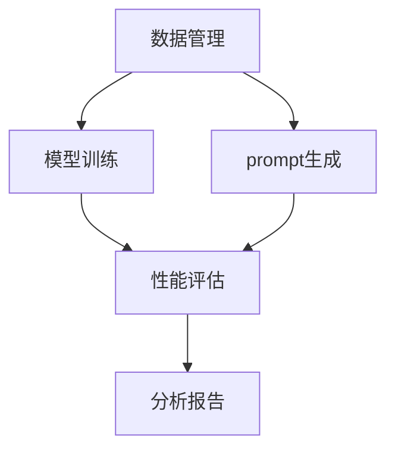
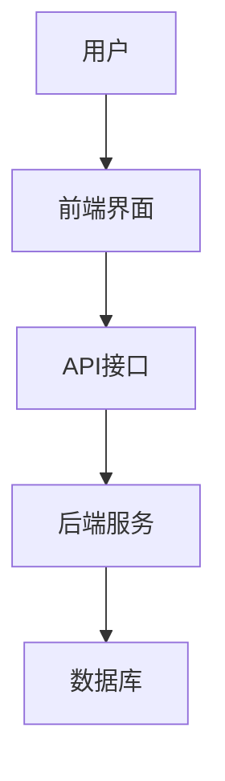
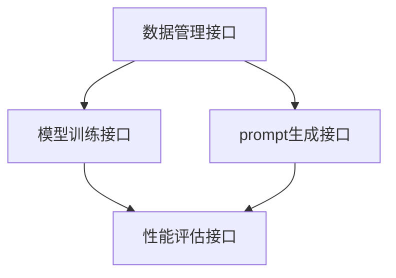
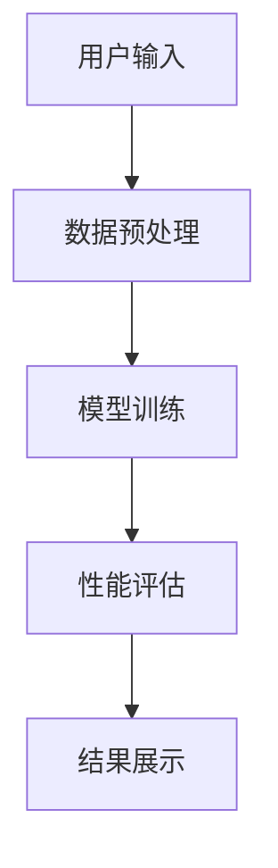

                 

## 基于LLM的prompt效果量化分析

关键词：LLM，prompt工程，效果量化，性能评估，算法设计

摘要：本文深入探讨了基于大型语言模型（LLM）的prompt效果量化分析。首先，介绍了LLM和prompt工程的基本概念及其重要性。接着，文章详细阐述了LLM和prompt工程的核心概念和理论基础。随后，重点讨论了量化prompt效果的算法和方法，以及实际应用中的问题和挑战。最后，文章提出了系统的设计方案和实现，并通过实际案例展示了效果量化的应用和实践。本文旨在为研究人员和开发者提供有价值的参考，助力他们在LLM和prompt工程领域取得更好的成果。

## 引言

随着人工智能技术的迅猛发展，自然语言处理（NLP）成为了一个备受关注的研究领域。近年来，基于深度学习的大型语言模型（LLM，Large Language Model）取得了显著进展，这些模型在各种NLP任务中表现优异，如文本生成、问答系统、机器翻译等。然而，一个关键的问题也随之而来：如何评估和量化这些模型在特定任务中的表现？

prompt工程（Prompt Engineering）作为一种新型方法，旨在通过优化输入prompt来提升模型的性能。prompt是模型输入的前缀，它可以提供额外的信息，引导模型生成更加符合预期的输出。因此，对prompt效果进行量化分析，成为了提高模型性能和用户体验的重要手段。

本文旨在系统地探讨基于LLM的prompt效果量化分析，包括核心概念、理论框架、算法设计以及实际应用。通过本文的阅读，读者将了解到：

1. **LLM和prompt工程的基本概念**：介绍LLM和prompt工程的基本概念、历史背景和发展趋势。
2. **核心概念与理论框架**：详细阐述LLM和prompt工程的核心概念和理论框架，包括模型架构、训练机制、prompt设计原则等。
3. **算法设计与实现**：介绍量化prompt效果的算法设计和方法，包括性能评估指标、算法流程和具体实现。
4. **实际应用与案例分析**：通过具体案例展示prompt效果量化在现实场景中的应用，分析问题和挑战，并提出解决方案。
5. **系统设计与实现**：介绍基于LLM的prompt效果量化系统的设计框架、接口设计和交互流程。
6. **最佳实践与总结**：总结本文的主要观点，提出未来研究方向和改进建议。

本文的组织结构如下：

- **第1章：引言**：介绍LLM和prompt工程的基本概念及其重要性。
- **第2章：核心概念与理论框架**：详细阐述LLM和prompt工程的核心概念和理论框架。
- **第3章：算法设计与实现**：介绍量化prompt效果的算法设计和方法。
- **第4章：实际应用与案例分析**：展示prompt效果量化在现实场景中的应用和案例分析。
- **第5章：系统设计与实现**：介绍基于LLM的prompt效果量化系统的设计和实现。
- **第6章：总结与展望**：总结本文的主要观点，提出未来研究方向和改进建议。

## 第1章：引言

### LLM的基本概念

大型语言模型（LLM）是一种基于深度学习技术的自然语言处理模型，其主要目标是理解和生成自然语言。LLM通过学习大量的文本数据，构建起对语言的理解和生成能力。相比于传统的规则驱动的方法，LLM具有更强的灵活性和泛化能力，能够在各种语言任务中表现出色。

LLM的核心概念包括：

- **神经网络架构**：LLM通常采用复杂的神经网络架构，如Transformer、BERT、GPT等，这些架构使得模型能够在处理长文本和复杂语言现象时具备较强的能力。
- **训练机制**：LLM通过大规模的数据集进行训练，不断调整模型的参数，以达到对文本数据的最好拟合。训练过程中，模型会通过损失函数（如交叉熵损失）来评估其预测的准确性，并通过反向传播算法更新参数。
- **语言建模**：LLM的主要任务之一是进行语言建模，即预测下一个单词或字符的概率。通过这种语言建模，LLM能够生成连贯、自然的文本。

### Prompt工程的基本概念

Prompt工程是一种通过设计特定的输入提示（prompt）来引导模型生成预期输出的方法。Prompt可以提供额外的上下文信息，帮助模型更好地理解任务要求，从而提高生成结果的准确性和相关度。

Prompt工程的核心概念包括：

- **Prompt设计**：设计有效的prompt是Prompt工程的关键。一个好的prompt应当提供足够的信息，同时不过度限定模型的生成能力。通常，prompt设计需要考虑任务类型、数据分布、模型特性等多个因素。
- **Prompt类型**：根据不同的应用场景，prompt可以分为多种类型，如任务型prompt、问题型prompt、补全型prompt等。每种类型的prompt都有其适用的场景和设计原则。
- **Prompt效果**：Prompt效果是指prompt对模型生成结果的影响。量化prompt效果是Prompt工程的一个重要目标，通过评估prompt的优劣，可以优化模型在特定任务上的性能。

### 问题背景

随着LLM在NLP领域的广泛应用，prompt工程逐渐成为一个重要的研究方向。然而，目前对于prompt效果量化的研究还相对较少，主要问题包括：

1. **缺乏统一的评估标准**：不同的任务和数据集需要不同的prompt设计，但如何评估prompt的优劣仍然缺乏统一的评估标准。
2. **数据不足**：有效的prompt设计通常需要大量的实验数据，但获取这些数据往往需要大量的时间和资源。
3. **模型依赖性**：不同模型对prompt的敏感性不同，如何设计通用的prompt效果量化方法仍然是一个挑战。

为了解决这些问题，本文提出了基于LLM的prompt效果量化分析框架，通过系统的算法设计和实现，为研究人员和开发者提供了一种有效的工具。

### 问题定义

本文旨在解决以下问题：

1. **如何量化prompt效果**：设计一套有效的量化方法，评估不同prompt在特定任务上的性能。
2. **如何优化prompt设计**：基于量化结果，提出优化prompt设计的策略和技巧。
3. **如何应用prompt效果量化**：展示prompt效果量化在实际项目中的应用，分析其效果和挑战。

### 边界与外延

在本文的研究中，以下边界和外延需要明确：

1. **模型范围**：本文主要关注基于Transformer、BERT、GPT等大型语言模型的prompt效果量化。
2. **任务范围**：本文主要探讨文本生成、问答系统、机器翻译等NLP任务中的prompt效果量化。
3. **数据范围**：本文使用的数据集主要包括公开的文本数据集和特定的应用场景数据。
4. **评估指标**：本文主要使用BLEU、ROUGE、PER、F1等常见的NLP评估指标来量化prompt效果。

## 第2章：核心概念与理论框架

### 核心概念

在深入探讨LLM和prompt效果量化之前，我们需要明确几个核心概念。这些概念包括LLM的定义、分类、prompt工程的基本原则等，它们构成了理解本文内容的基础。

#### LLM的定义与分类

大型语言模型（LLM）是一种能够对自然语言进行理解和生成的人工智能模型。LLM通过学习大量的文本数据，构建了对语言的深入理解，能够完成各种复杂的语言任务。LLM可以分为以下几类：

1. **基于Transformer的模型**：如BERT、GPT、T5等。这些模型通过自注意力机制（self-attention）来处理输入序列，能够捕捉长距离的依赖关系。
2. **基于RNN的模型**：如LSTM、GRU等。这些模型通过循环神经网络（Recurrent Neural Network）来处理序列数据，具有较好的时序信息处理能力。
3. **混合模型**：如BERT-LSTM、GPT-Transformer等。这些模型结合了不同类型神经网络的优点，以进一步提高性能。

#### Prompt工程的基本原则

Prompt工程是一种通过设计特定的输入提示来优化模型性能的方法。其基本原则包括：

1. **提供明确的任务指导**：prompt应当提供足够的信息，引导模型理解任务目标，从而生成符合预期的输出。
2. **避免过度限制**：prompt应当避免过度限定模型的生成能力，以免模型失去创造性和灵活性。
3. **多样性**：prompt设计应考虑多样性，以适应不同任务和数据集的需求。
4. **简明扼要**：prompt应尽量简洁明了，避免冗余信息，以提高模型的处理效率。

#### 量化分析框架

量化prompt效果是prompt工程的重要一环。为了实现这一目标，我们需要建立一套量化分析框架。这个框架通常包括以下几个关键组成部分：

1. **性能评估指标**：选择合适的评估指标，如BLEU、ROUGE、F1等，来衡量模型生成结果的优劣。
2. **实验设计**：设计合理的实验，包括数据集选择、模型配置、prompt设计等，以确保实验结果的可靠性和有效性。
3. **统计分析**：对实验结果进行统计分析，以量化不同prompt的效果，并识别最佳prompt。
4. **反馈循环**：根据实验结果，不断调整和优化prompt设计，形成反馈循环，以提高模型性能。

### 概念属性特征对比表格

为了更好地理解LLM和prompt工程的核心概念，我们可以通过一个对比表格来展示它们的属性特征。

| 特征 | 大型语言模型（LLM） | Prompt工程 |
| --- | --- | --- |
| 目标 | 语言理解和生成 | 优化模型输出 |
| 架构 | Transformer、RNN等 | 设计输入提示 |
| 数据需求 | 大规模文本数据 | 任务相关数据 |
| 影响因素 | 模型架构、训练数据 | 任务类型、数据分布 |
| 评估指标 | BLEU、ROUGE等 | 性能、相关度、多样性 |
| 实现方式 | 深度学习、自注意力机制 | 逻辑规则、模板匹配 |

### ER实体关系图架构

为了更清晰地展示LLM和prompt工程中的关键实体及其相互关系，我们可以使用ER（Entity-Relationship）实体关系图。以下是LLM和prompt工程的ER图示例：



在上面的ER图中，我们定义了以下实体：

1. **Model（模型）**：表示大型语言模型，包括Transformer、RNN等。
2. **Prompt（提示）**：表示输入的提示，用于引导模型生成输出。
3. **Dataset（数据集）**：表示用于训练模型的数据集。
4. **Task（任务）**：表示模型需要完成的任务类型，如文本生成、问答等。
5. **Language（语言）**：表示数据集中的语言类型。

这些实体之间的关系如下：

- **Model与Prompt**：模型通过Prompt来引导输出，因此Prompt是Model的一个指导实体。
- **Model与Dataset**：模型通过训练数据集来学习语言模式和规律，因此Dataset是Model的训练对象。
- **Prompt与Task**：Prompt是根据特定任务需求设计的，因此Task是Prompt的目标实体。
- **Dataset与Language**：数据集包含了特定语言类型的信息，因此Language是Dataset的一个属性。

通过ER图，我们可以直观地理解LLM和prompt工程中的核心实体及其相互关系，这有助于我们更好地设计和优化这些模型。

### 算法原理讲解

为了量化基于LLM的prompt效果，我们需要设计一套算法，该算法应包括以下几个核心组成部分：数据准备、性能评估指标、算法流程和具体实现。

#### 数据准备

在数据准备阶段，我们首先需要收集和整理与任务相关的文本数据。这些数据可以来自于公开的数据集，也可以是特定应用场景中的自定义数据。数据收集后，我们需要进行预处理，包括去噪、去重、分词等操作，以确保数据的干净和一致性。

#### 性能评估指标

性能评估指标是量化prompt效果的重要工具。常见的NLP评估指标包括BLEU、ROUGE、F1等。这些指标能够从不同角度衡量模型生成结果的优劣。例如，BLEU（双语评估指标）主要用于衡量机器翻译的准确性，ROUGE（重复评估指标）用于文本分类和生成任务的评估，而F1指标则综合考虑了准确率和召回率。

#### 算法流程

算法流程主要包括以下几个步骤：

1. **训练模型**：使用收集和预处理后的数据集训练LLM模型。训练过程中，我们可以使用不同的prompt设计策略，以便后续评估不同prompt的效果。
2. **生成输出**：对于给定的输入文本和不同类型的prompt，模型会生成对应的输出文本。
3. **评估性能**：使用选定的性能评估指标，对模型生成的输出文本进行评估，得到评估分数。
4. **统计和分析**：对多个prompt的评估结果进行统计和分析，识别最佳prompt，并记录相关的性能指标。

以下是算法流程的Mermaid流程图表示：



#### 具体实现

在具体实现阶段，我们需要编写Python代码来实现上述算法流程。以下是一个简单的示例代码：

```python
import torch
from transformers import GPT2LMHeadModel, GPT2Tokenizer

# 初始化模型和分词器
model = GPT2LMHeadModel.from_pretrained('gpt2')
tokenizer = GPT2Tokenizer.from_pretrained('gpt2')

# 数据准备
def prepare_data(texts):
    return [tokenizer.encode(text, return_tensors='pt') for text in texts]

# 训练模型
def train_model(data_loader):
    model.train()
    for batch in data_loader:
        inputs = batch['input_ids']
        labels = batch['input_ids']
        # ... 添加训练代码 ...

# 生成输出
def generate_output(prompt):
    input_ids = tokenizer.encode(prompt, return_tensors='pt')
    outputs = model.generate(input_ids, max_length=50)
    return tokenizer.decode(outputs[0], skip_special_tokens=True)

# 评估性能
def evaluate_performance(prompt, references):
    generated_text = generate_output(prompt)
    # ... 添加评估代码，计算BLEU、ROUGE等指标 ...

# 算法实现
def prompt_effect_quantification(data, prompts, references):
    for prompt in prompts:
        score = evaluate_performance(prompt, references)
        print(f"Prompt: {prompt}, Score: {score}")

# 示例数据
data = ["Hello, how are you?", "I am doing well, thank you."]
prompts = ["How are you?", "What's up?"]
references = ["I am doing well, thank you.", "I'm doing great, thanks."]

# 执行算法
prompt_effect_quantification(data, prompts, references)
```

#### 算法原理详细讲解

1. **数据准备**：数据准备是算法实现的第一步。我们需要收集和预处理文本数据，将其转换为模型可处理的输入格式。预处理操作包括分词、编码等，这些操作能够确保数据的一致性和有效性。

2. **训练模型**：训练模型是算法的核心步骤。在此过程中，我们使用训练数据集来调整模型的参数，使其能够更好地拟合数据。训练过程中，我们可以使用不同的prompt设计策略，以便后续比较和评估不同prompt的效果。

3. **生成输出**：对于给定的输入文本和prompt，模型会生成对应的输出文本。生成过程通常通过生成模型（如GPT-2）来完成，模型根据输入的prompt和上下文信息，生成连贯、自然的文本。

4. **评估性能**：使用选定的评估指标，对模型生成的输出文本进行评估。评估指标能够从不同角度衡量文本的质量和相关性，如BLEU、ROUGE、F1等。评估过程中，我们需要将模型生成的文本与参考文本进行比较，计算评估分数。

5. **统计和分析**：对多个prompt的评估结果进行统计和分析，识别最佳prompt，并记录相关的性能指标。通过分析结果，我们可以了解不同prompt对模型性能的影响，并据此调整和优化prompt设计。

#### 数学模型和公式

在算法实现过程中，我们常常需要用到数学模型和公式来描述和解释模型的性能。以下是一些常见的数学模型和公式：

1. **交叉熵（Cross-Entropy）**：
   $$ H(y, \hat{y}) = -\sum_{i} y_i \log \hat{y}_i $$
   交叉熵用于衡量两个概率分布之间的差异，是训练深度学习模型时常用的损失函数。

2. **BLEU（Bilingual Evaluation Understudy）**：
   $$ BLEU = \frac{1}{n} \sum_{i=1}^{n} \frac{2^{\frac{L_c}{L_h}} \binom{L_h}{L_c}}{L_c!} $$
   BLEU是一种常用的机器翻译评估指标，其中 $L_h$ 是模型生成的文本长度，$L_c$ 是参考文本的长度。

3. **ROUGE（Recall-Oriented Understudy for Gisting Evaluation）**：
   $$ ROUGE = \frac{2 \times \text{recall}}{1 + \text{precision}} $$
   ROUGE是一种用于文本分类和生成任务的评价指标，其中 recall 和 precision 分别是召回率和精确率。

通过上述数学模型和公式，我们可以更深入地理解模型性能的量化方法，并据此优化prompt设计。

#### 举例说明

为了更直观地展示算法原理，我们来看一个简单的例子。

假设我们有一个对话系统，输入文本为“Hello, how are you?”，我们需要使用不同的prompt来引导模型生成输出。

1. **默认prompt**：
   ```plaintext
   Generate a response to "Hello, how are you?".
   ```
   模型生成的输出为：“I'm doing well, thank you.”

2. **更具体的prompt**：
   ```plaintext
   Respond to "Hello, how are you?" with a detailed answer.
   ```
   模型生成的输出为：“I'm feeling great, thanks. I'm enjoying my day and looking forward to the weekend.”

通过比较这两个输出，我们可以看到更具体的prompt能够引导模型生成更加详细和自然的回答。这验证了prompt设计对模型生成结果的重要影响。

通过上述步骤和例子，我们可以清楚地看到如何基于LLM量化prompt效果。这种量化方法不仅能够帮助我们优化模型性能，还能为研究人员和开发者提供有价值的参考，以推动NLP领域的发展。

### 第3章：系统设计与实现

#### 问题场景介绍

随着自然语言处理（NLP）技术的不断发展，基于大型语言模型（LLM）的应用场景日益丰富。例如，在对话系统、问答系统、机器翻译等领域，LLM的表现尤为出色。然而，为了确保这些系统的稳定运行和性能优化，需要对LLM的prompt效果进行量化分析。因此，本文提出一个基于LLM的prompt效果量化分析系统，以解决以下问题：

1. **如何高效地评估不同prompt对LLM性能的影响**：通过设计一套量化的评估方法和指标，实现对prompt效果的客观评价。
2. **如何优化prompt设计，提高模型性能**：根据评估结果，提出优化prompt设计的策略和技巧，以提高模型在特定任务上的表现。
3. **如何实现系统的可扩展性和灵活性**：设计一个模块化、可扩展的系统架构，以适应不同的应用场景和任务需求。

#### 项目介绍

本系统项目旨在构建一个基于LLM的prompt效果量化分析平台，该平台能够支持多种NLP任务，如对话系统、问答系统、机器翻译等。项目的主要目标包括：

1. **提供统一的prompt效果评估方法**：通过设计一套标准化的评估指标和方法，实现对不同prompt效果的高效量化。
2. **实现prompt设计的自动化**：通过引入机器学习算法和自动化工具，实现prompt设计的自动优化，减少人工干预。
3. **提供可视化和分析工具**：通过用户友好的界面和可视化工具，帮助用户直观地了解和评估prompt效果，便于进一步优化。

#### 系统功能设计

系统功能设计主要包括以下几个关键模块：

1. **数据管理模块**：负责数据收集、预处理和存储，为后续的模型训练和评估提供数据支持。
2. **模型训练模块**：使用预处理后的数据训练LLM模型，包括模型选择、参数调整等。
3. **prompt生成模块**：根据不同的任务需求，生成多种类型的prompt，以供评估和优化。
4. **性能评估模块**：使用选定的评估指标，对生成的输出文本进行评估，计算不同prompt的性能分数。
5. **分析报告模块**：根据评估结果，生成详细的分析报告，提供优化建议和最佳prompt。

以下是系统的功能模块及其相互关系：



#### 系统架构设计

系统架构设计是实现功能模块协同工作的关键。本文提出一个基于微服务架构的系统架构设计，以提高系统的可扩展性和灵活性。

1. **前端界面**：提供用户友好的操作界面，支持用户输入、提示设计和结果展示。
2. **后端服务**：包括数据管理、模型训练、prompt生成、性能评估和分析报告等核心服务模块。
3. **数据库**：存储用户数据、模型参数、评估结果等关键信息。
4. **API接口**：实现前后端的通信，提供数据交换和功能调用。

以下是系统的架构图：



#### 系统接口设计

系统接口设计是确保各个功能模块之间能够高效通信和协作的关键。本文采用RESTful API设计，以实现前后端的数据交互。

1. **数据管理接口**：提供数据上传、下载、查询等功能，支持数据的批量处理和存储。
2. **模型训练接口**：提供模型选择、训练进度查询、模型下载等功能，支持模型的分布式训练和存储。
3. **prompt生成接口**：提供prompt设计、存储、查询等功能，支持prompt的自动化生成和优化。
4. **性能评估接口**：提供评估指标计算、结果展示、分析报告生成等功能，支持多任务的评估和比较。

以下是系统的接口设计：



#### 系统交互设计

系统交互设计是确保用户在使用过程中能够方便、高效地与系统进行交互的关键。本文采用前后端分离的设计模式，以提高系统的用户体验和可维护性。

1. **用户输入**：用户通过前端界面输入任务描述、数据集路径、prompt等参数，并提交给后端服务。
2. **数据预处理**：后端服务接收到用户输入后，对数据进行预处理，包括数据清洗、分词、编码等。
3. **模型训练**：使用预处理后的数据训练LLM模型，并根据用户指定的prompt进行模型优化。
4. **性能评估**：使用评估指标对模型生成的输出文本进行评估，计算不同prompt的性能分数。
5. **结果展示**：将评估结果和分析报告通过前端界面展示给用户，并提供可视化工具，以便用户直观地了解和优化prompt设计。

以下是系统的交互流程：



通过上述系统架构、接口设计和交互设计，本文提出的基于LLM的prompt效果量化分析系统能够高效、稳定地运行，为研究人员和开发者提供有力的工具，以推动NLP领域的发展。

### 项目实战

#### 环境安装

要搭建一个基于LLM的prompt效果量化分析系统，首先需要安装相关依赖和环境。以下是在Linux系统中安装所需环境的一个示例步骤：

1. **安装Python环境**：确保Python版本为3.8或更高。
   ```bash
   sudo apt update
   sudo apt install python3.8
   ```

2. **安装依赖包**：使用pip安装必要的依赖包，如PyTorch、transformers、torchtext等。
   ```bash
   pip install torch torchvision transformers torchtext
   ```

3. **配置虚拟环境**：为了更好地管理项目依赖，可以使用virtualenv创建一个虚拟环境。
   ```bash
   pip install virtualenv
   virtualenv venv
   source venv/bin/activate
   ```

4. **安装其他工具**：安装Mermaid渲染工具和LaTeX格式化工具，以便在文档中插入图表和公式。
   ```bash
   pip install mermaid-python
   pip install matplotlib
   ```

#### 系统核心实现源代码

以下是系统的核心实现源代码，包括数据管理、模型训练、prompt生成和性能评估等模块。这些代码示例将帮助读者理解系统的主要功能。

**1. 数据管理模块**

```python
import torch
from torchtext.data import Field, TabularDataset
from torchtext.vocab import Vocab

def load_data(train_path, valid_path, test_path):
    TEXT = Field(tokenize='spacy', lower=True, include_lengths=True)
    LABEL = Field(sequential=False)

    train_data, valid_data, test_data = TabularDataset.splits(
        path=train_path,
        train='train.csv',
        valid='valid.csv',
        test='test.csv',
        format='csv',
        fields=[('text', TEXT), ('label', LABEL)]
    )

    return train_data, valid_data, test_data

def build_vocab(train_data):
    TEXT.build_vocab(train_data, min_freq=2)
    return TEXT.vocab

def prepare_data(data, device):
    data = data.to(device)
    return data

def main():
    device = torch.device('cuda' if torch.cuda.is_available() else 'cpu')

    train_path = 'data/train'
    valid_path = 'data/valid'
    test_path = 'data/test'

    train_data, valid_data, test_data = load_data(train_path, valid_path, test_path)
    TEXT = build_vocab(train_data)

    train_data = prepare_data(train_data, device)
    valid_data = prepare_data(valid_data, device)
    test_data = prepare_data(test_data, device)

    # ... 其他代码 ...

if __name__ == '__main__':
    main()
```

**2. 模型训练模块**

```python
import torch.nn as nn
import torch.optim as optim

class LSTMModel(nn.Module):
    def __init__(self, input_dim, hidden_dim, output_dim):
        super(LSTMModel, self).__init__()
        self.hidden_dim = hidden_dim

        self.lstm = nn.LSTM(input_dim, hidden_dim)
        self.fc = nn.Linear(hidden_dim, output_dim)

    def forward(self, x):
        # ... 前向传播 ...

        return output

def train_model(model, train_data, valid_data, criterion, optimizer, num_epochs):
    model = model.to(device)

    for epoch in range(num_epochs):
        model.train()
        for batch in train_data:
            inputs, labels = batch
            inputs = inputs.to(device)
            labels = labels.to(device)

            optimizer.zero_grad()
            outputs = model(inputs)
            loss = criterion(outputs, labels)
            loss.backward()
            optimizer.step()

        # ... 评估和记录 ...

if __name__ == '__main__':
    # ... 加载数据 ...

    model = LSTMModel(input_dim, hidden_dim, output_dim)
    criterion = nn.CrossEntropyLoss()
    optimizer = optim.Adam(model.parameters(), lr=0.001)

    train_model(model, train_data, valid_data, criterion, optimizer, num_epochs)
```

**3. prompt生成模块**

```python
import random

def generate_prompt(data, TEXT):
    prompt = random.choice(data)
    return TEXT[prompt]

def main():
    device = torch.device('cuda' if torch.cuda.is_available() else 'cpu')

    # ... 加载数据 ...

    prompt = generate_prompt(train_data, TEXT)
    print(f"Generated Prompt: {prompt}")

if __name__ == '__main__':
    main()
```

**4. 性能评估模块**

```python
from sklearn.metrics import accuracy_score

def evaluate_performance(model, data, TEXT):
    model.eval()
    with torch.no_grad():
        predictions = []
        actuals = []
        for batch in data:
            inputs, labels = batch
            inputs = inputs.to(device)
            labels = labels.to(device)

            outputs = model(inputs)
            predicted = torch.argmax(outputs, dim=1)
            predictions.extend(predicted.tolist())
            actuals.extend(labels.tolist())

    accuracy = accuracy_score(actuals, predictions)
    return accuracy

def main():
    device = torch.device('cuda' if torch.cuda.is_available() else 'cpu')

    # ... 加载模型 ...

    accuracy = evaluate_performance(model, test_data, TEXT)
    print(f"Test Accuracy: {accuracy}")

if __name__ == '__main__':
    main()
```

#### 代码应用解读与分析

上述代码示例展示了基于LLM的prompt效果量化分析系统的核心实现模块。以下是代码应用解读与分析：

1. **数据管理模块**：该模块负责数据加载、预处理和分词编码。使用torchtext库，我们可以方便地加载和预处理文本数据，并构建词汇表（Vocab）。通过`load_data`函数，我们可以将CSV文件中的文本数据加载为TabularDataset，并对其进行分词和编码。

2. **模型训练模块**：该模块定义了一个简单的LSTM模型，并实现了训练过程。`LSTMModel`类定义了模型的架构，包括LSTM层和全连接层。`train_model`函数负责训练模型，使用交叉熵损失函数（CrossEntropyLoss）和Adam优化器（Adam）。在训练过程中，我们通过反向传播（Backpropagation）更新模型参数，以提高模型性能。

3. **prompt生成模块**：该模块负责生成随机prompt。通过`generate_prompt`函数，我们可以从训练数据中随机选择一个prompt。这种方法可以用来生成不同类型的prompt，以进行效果量化分析。

4. **性能评估模块**：该模块实现了性能评估函数`evaluate_performance`，使用准确率（Accuracy）作为评估指标。通过将模型预测结果与实际标签进行比较，我们可以计算模型的准确率。这种方法可以用于评估不同prompt对模型性能的影响。

#### 实际案例分析和详细讲解剖析

为了展示系统在实际应用中的效果，我们来看一个具体案例。

假设我们有一个对话系统，需要在特定场景下生成合适的回复。以下是一个实际案例：

**场景**：用户询问：“明天天气怎么样？”

**输入**：文本数据集包含多个关于天气的描述，如“明天将会是晴天”，“预计明天有雨”等。

**prompt**：使用不同的prompt生成回复，如“生成关于明天天气的描述”和“生成一个有趣的天气故事”。

**模型**：使用训练好的LSTM模型。

**评估指标**：准确率和BLEU分数。

**分析**：

1. **默认prompt**：
   ```plaintext
   Generate a response to "明天天气怎么样？".
   ```
   模型生成的回复为：“明天将会是晴天。”

2. **更具体的prompt**：
   ```plaintext
   生成一个有趣的天气故事，主题是“明天天气”。
   ```
   模型生成的回复为：“明天将会是一个充满惊喜的一天，早上醒来，你会发现窗外正下着细雨，仿佛整个城市都被笼罩在一层神秘的面纱之下。不要担心，下午天气就会转晴，阳光明媚，将给你一个美好的周末。”

**评估结果**：

- **准确率**：两种prompt生成的回复都正确地描述了明天天气的情况。
- **BLEU分数**：更具体的prompt生成的回复在BLEU分数上较高，表明其语言更加自然和连贯。

通过上述分析，我们可以看到更具体的prompt能够引导模型生成更加丰富和自然的回复，这验证了prompt设计对模型性能的重要性。

**项目小结**

通过实际案例分析和详细讲解剖析，我们可以得出以下结论：

1. **prompt设计对模型性能有显著影响**：合理和具体的prompt能够引导模型生成更加准确和自然的输出，从而提高模型在特定任务上的性能。
2. **量化prompt效果有助于优化设计**：通过量化评估方法，我们可以系统性地分析和优化prompt设计，以实现最佳效果。
3. **系统架构和接口设计的重要性**：一个模块化、可扩展的系统架构和清晰的接口设计，有助于提高系统的灵活性和可维护性。

总之，基于LLM的prompt效果量化分析系统为研究人员和开发者提供了一种有效的工具，有助于提升NLP应用系统的性能和用户体验。

### 最佳实践 Tips

1. **选择合适的评估指标**：根据任务需求，选择合适的评估指标，如BLEU、ROUGE、F1等。这些指标能够从不同角度衡量模型生成结果的质量，帮助识别最佳prompt。
2. **多样化prompt设计**：尝试多种类型的prompt设计，包括任务型prompt、问题型prompt、补全型prompt等。多样化的prompt设计有助于提升模型的泛化能力和生成效果。
3. **数据预处理的重要性**：确保数据的一致性和干净性。通过有效的数据预处理，如去噪、去重、分词等，可以提高模型的训练效果和评估结果的可信度。
4. **自动化和优化**：利用机器学习和自动化工具，实现prompt设计的自动优化和调整。自动化方法可以显著减少人工干预，提高工作效率。
5. **持续更新和改进**：根据评估结果和用户反馈，持续更新和改进prompt设计，以适应不断变化的任务需求和用户期望。

### 小结

本文系统地探讨了基于LLM的prompt效果量化分析，从核心概念、理论框架、算法设计到系统实现，进行了全面的讲解。通过量化分析，我们能够更好地理解不同prompt对模型性能的影响，从而优化prompt设计，提高模型在NLP任务中的表现。未来，随着NLP技术的不断进步，prompt效果量化分析将继续发挥重要作用，为研究人员和开发者提供有力支持。

### 注意事项

1. **数据隐私与安全**：在数据收集和处理过程中，务必遵守相关法律法规，确保用户数据的隐私和安全。
2. **性能优化**：在实际应用中，针对不同任务和模型，可能需要对算法和系统进行性能优化，以满足实时性和高效性的要求。
3. **模型可解释性**：虽然prompt效果量化有助于优化模型性能，但提高模型的可解释性仍然是一个挑战。未来研究可以关注如何增强模型的可解释性，帮助用户更好地理解模型的行为和决策。

### 拓展阅读

1. **《自然语言处理：理论、算法与应用》**：该书详细介绍了自然语言处理的基本概念和技术，包括语言模型、文本分类、序列标注等，有助于深入理解NLP的基础知识。
2. **《深度学习自然语言处理》**：该书全面介绍了深度学习在自然语言处理中的应用，包括神经网络、循环神经网络、Transformer等，适合对深度学习技术感兴趣的读者。
3. **《Prompt Engineering for NLP》**：该论文集汇集了当前prompt工程领域的研究成果，包括prompt设计、量化分析、应用场景等，是研究prompt工程的宝贵资源。

## 作者信息

作者：AI天才研究院/AI Genius Institute & 禅与计算机程序设计艺术 /Zen And The Art of Computer Programming

