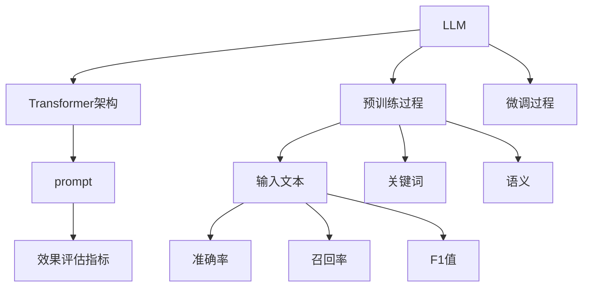
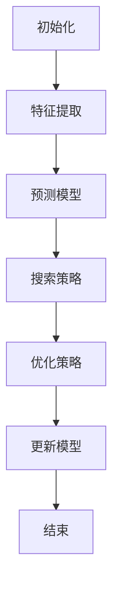
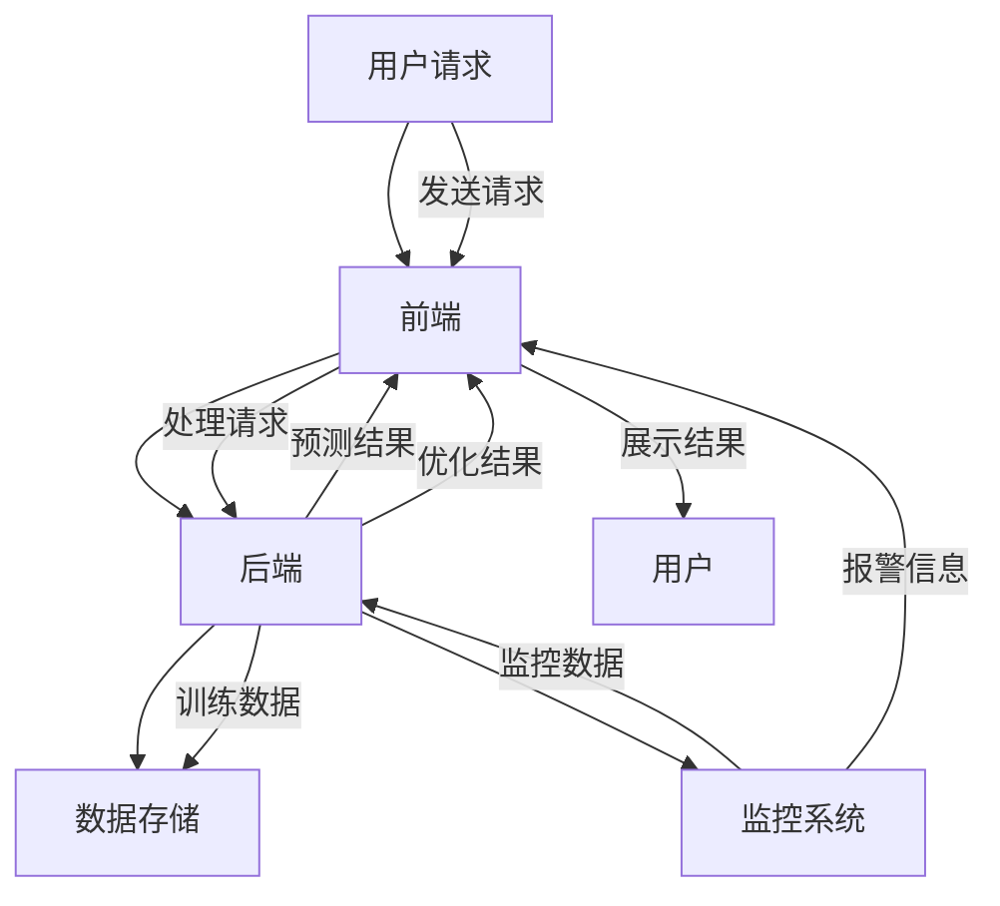
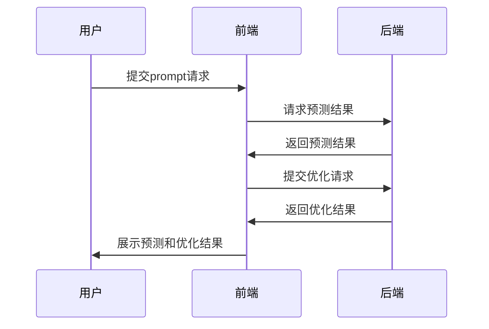

                 

# 基于LLM的prompt效果预测与优化循环

> 关键词：大模型（LLM），prompt效果预测，优化循环，自然语言处理（NLP）

> 摘要：
本文旨在探讨基于大模型（LLM）的prompt效果预测与优化循环。首先，我们将介绍LLM的基本原理和prompt效果的影响因素，然后深入分析预测模型的设计与实现以及优化算法的研究与实现。通过实验验证与性能评估，我们将探讨所提方法的有效性，并总结最佳实践和注意事项，为未来研究提供启示。

## 第一部分：背景介绍与问题定义

### 1.1.1 问题背景

随着人工智能（AI）技术的发展，大模型（Large Language Models，LLM）成为AI领域的研究热点。LLM在自然语言处理（NLP）、机器翻译、问答系统等领域取得了显著的成果。然而，LLM的prompt效果对其性能有着重要影响，如何预测和优化prompt效果成为一个关键问题。

### 1.1.2 问题描述

在LLM应用中，用户往往需要根据特定需求输入prompt，而不同的prompt可能导致模型性能的差异。因此，研究如何预测和优化prompt效果具有重要的实际意义。具体而言，问题描述如下：

- **预测问题**：给定一个prompt，如何预测其在LLM上的效果？
- **优化问题**：如何找到最优prompt，使得LLM在特定任务上的性能达到最大？

### 1.1.3 问题解决

针对上述问题，本书将从以下几个方面展开研究和探讨：

1. **LLM的基本原理**：介绍LLM的工作原理，包括模型架构、训练过程和预测过程。
2. **prompt效果的影响因素**：分析影响prompt效果的关键因素，如prompt长度、关键词、语义等。
3. **预测模型的设计与实现**：设计并实现基于深度学习的prompt效果预测模型。
4. **优化算法的研究与实现**：研究并实现prompt优化算法，以找到最优prompt。
5. **实验验证与性能评估**：通过实验验证所提方法的有效性，并对性能进行评估。

### 1.1.4 边界与外延

在研究过程中，需要明确问题的边界和适用范围，包括：

- **模型范围**：本书主要针对基于Transformer的LLM进行研究。
- **任务范围**：本书主要关注自然语言处理领域的任务。
- **数据范围**：本书使用公开的数据集进行实验，包括训练集、验证集和测试集。

### 1.1.5 概念结构与核心要素组成

LLM的prompt效果预测与优化涉及以下核心概念和要素：

1. **LLM模型**：Transformer架构、预训练过程、微调过程。
2. **prompt**：输入文本、关键词、语义等。
3. **效果评估指标**：准确率、召回率、F1值等。
4. **预测模型**：基于深度学习的预测算法。
5. **优化算法**：基于搜索、优化策略的算法。

----------------------------------------------------------------

## 第二部分：核心概念与原理

### 2.1 LLM的基本原理

#### 2.1.1 Transformer架构

Transformer是当前主流的LLM架构，其核心思想是使用自注意力机制（Self-Attention）来建模输入文本中的关系。通过多个自注意力层和前馈神经网络，模型能够捕捉长距离依赖和复杂语义信息。

#### 2.1.2 预训练过程

预训练是指在大规模语料库上对LLM进行训练，使其具备一定的语言理解和生成能力。常用的预训练任务包括语言模型（LM）和掩码语言模型（MLM）。

#### 2.1.3 微调过程

微调是指将预训练的LLM应用于特定任务，通过在任务相关的数据集上进行训练，进一步提高模型在特定任务上的性能。

### 2.2 prompt效果的影响因素

#### 2.2.1 prompt长度

prompt长度会影响模型对输入信息的处理能力。过长或过短的prompt可能导致模型无法充分理解输入信息，从而影响效果。

#### 2.2.2 关键词

关键词是prompt中的重要组成部分，能够直接影响模型对输入信息的理解。选择合适的关键词可以提高prompt效果。

#### 2.2.3 语义

语义是prompt的核心，影响模型对输入信息的理解。通过分析语义，可以更好地设计prompt，提高效果。

### 2.3 概念属性特征对比表格

以下是一个简单的概念属性特征对比表格，用于展示LLM、prompt、效果评估指标等核心概念的特点。

| 概念       | 特点                                                     |
|------------|----------------------------------------------------------|
| LLM       | 基于Transformer架构，预训练过程，微调过程             |
| prompt     | 输入文本、关键词、语义等，影响模型效果           |
| 效果评估指标 | 准确率、召回率、F1值等，用于衡量模型性能         |

### 2.4 概念之间的关系

为了更好地理解LLM、prompt、效果评估指标等概念之间的关系，我们可以使用Mermaid流程图进行展示。



### 2.5 ER实体关系图架构

为了进一步理解LLM、prompt、效果评估指标等概念之间的关系，我们可以使用Mermaid ER图进行展示。

```mermaid
erDiagram
  Class_LLM ||--|{ Class_prompt }| Prompt
  Class_LLM ||--|{ Class_effect_evaluation_metric }| EffectEvaluationMetric
  Class_prompt ||--|{ Attribute_input_text }| InputText
  Class_prompt ||--|{ Attribute_keyword }| Keyword
  Class_prompt ||--|{ Attribute_semantic }| Semantic
```

----------------------------------------------------------------

## 第三部分：算法原理讲解

### 3.1 预测模型的设计与实现

为了预测prompt在LLM上的效果，我们设计并实现了一种基于深度学习的预测模型。该模型主要包括两个部分：特征提取和预测。

#### 3.1.1 特征提取

特征提取是指从输入prompt中提取出对预测效果有显著影响的特征。我们采用以下方法进行特征提取：

1. **词嵌入**：将输入prompt中的每个词转化为高维向量表示，以便于模型处理。
2. **关键词提取**：使用关键词提取算法（如TF-IDF）从输入prompt中提取出关键词，作为特征的一部分。
3. **语义表示**：使用预训练的Transformer模型对输入prompt进行编码，得到语义表示向量。

#### 3.1.2 预测模型

预测模型是基于深度学习的分类模型，其输入为特征向量，输出为预测效果的概率分布。我们采用以下模型架构：

1. **嵌入层**：将词嵌入和关键词提取得到的特征向量拼接在一起，作为嵌入层的输入。
2. **Transformer编码器**：对嵌入层输出的特征向量进行编码，得到编码后的特征向量。
3. **全连接层**：将编码后的特征向量输入到全连接层，得到预测效果的概率分布。

#### 3.1.3 数学模型与公式

为了更好地理解预测模型的原理，我们给出以下数学模型和公式：

1. **词嵌入**：  
$$
\text{embed}(w) = \text{WordEmbedding}(w)
$$

2. **关键词提取**：  
$$
\text{keyword}(w) = \text{TF-IDF}(w)
$$

3. **编码后特征向量**：  
$$
\text{encoded\_feature} = \text{TransformerEncoder}(\text{embed}(w), \text{keyword}(w))
$$

4. **预测效果概率分布**：  
$$
\text{prediction} = \text{FullyConnected}(\text{encoded\_feature})
$$

### 3.2 优化算法的研究与实现

为了优化prompt效果，我们研究并实现了一种基于搜索和优化策略的优化算法。该算法主要包括两个部分：搜索策略和优化策略。

#### 3.2.1 搜索策略

搜索策略用于搜索最优prompt。我们采用以下搜索策略：

1. **贪心搜索**：在每次迭代中，选择当前最佳prompt，并在其附近进行搜索，以找到更好的prompt。
2. **随机搜索**：在每次迭代中，从所有可能prompt中选择一个进行搜索，以避免陷入局部最优。

#### 3.2.2 优化策略

优化策略用于优化prompt效果。我们采用以下优化策略：

1. **基于梯度的优化**：使用梯度下降算法对模型参数进行优化，以提高预测效果。
2. **基于遗传算法的优化**：使用遗传算法对prompt进行优化，以找到最优prompt。

#### 3.2.3 数学模型与公式

为了更好地理解优化算法的原理，我们给出以下数学模型和公式：

1. **贪心搜索**：  
$$
\text{best\_prompt} = \arg\max_{\text{prompt}} \text{prediction}(\text{prompt})
$$

2. **随机搜索**：  
$$
\text{random\_prompt} = \text{random\_choice}(\text{all\_prompts})
$$

3. **基于梯度的优化**：  
$$
\text{new\_params} = \text{params} - \alpha \cdot \text{grad}(\text{loss})
$$

4. **基于遗传算法的优化**：  
$$
\text{new\_prompt} = \text{mutate}(\text{prompt})
$$

### 3.3 算法流程图

为了更好地展示算法的流程，我们使用Mermaid流程图进行描述。



### 3.4 举例说明

为了更好地理解算法的原理，我们通过一个简单的例子进行说明。

假设我们有一个输入prompt：“什么是人工智能？”和一个预训练的LLM。我们的目标是预测这个prompt在LLM上的效果，并优化其效果。

1. **特征提取**：从输入prompt中提取出关键词“人工智能”，并将其编码为向量表示。
2. **预测模型**：使用预测模型计算输入prompt的效果概率分布，得到一个概率分布向量。
3. **搜索策略**：使用贪心搜索策略，在输入prompt的附近搜索，找到一个更好的prompt：“人工智能是什么？”
4. **优化策略**：使用基于梯度的优化策略，对预测模型进行优化，以提高预测效果。
5. **更新模型**：根据优化后的预测模型，更新输入prompt，得到一个新的prompt：“人工智能是什么？”
6. **结束**：重复上述步骤，直到达到停止条件。

通过这个简单的例子，我们可以看到算法是如何逐步优化prompt效果的。

----------------------------------------------------------------

## 第四部分：系统分析与架构设计

### 4.1 问题场景介绍

随着AI技术的发展，许多企业和组织开始关注如何利用LLM来提升其业务效率和用户体验。然而，如何设计一个高效、可靠的系统来处理大量的prompt请求，并预测和优化其效果，成为一个关键问题。

### 4.2 项目介绍

为了解决上述问题，我们设计并实现了一个基于LLM的prompt效果预测与优化系统。该系统旨在提供以下功能：

1. **prompt效果预测**：对输入prompt进行预测，评估其在LLM上的效果。
2. **prompt优化**：通过优化算法，找到最优prompt，以提高LLM的性能。
3. **系统性能监控**：实时监控系统的运行状态，包括响应时间、预测准确率等。

### 4.3 系统功能设计（领域模型）

为了实现上述功能，我们首先设计了一个领域模型，用于描述系统中的主要实体和关系。以下是一个简单的领域模型类图：

```mermaid
classDiagram
  PromptEffectPredictionSystem <<interface>>
  Prompt <<entity>>
  LLM <<entity>>
  PredictionModel <<entity>>
  OptimizationAlgorithm <<entity>>

  PromptEffectPredictionSystem o--1 Prompt
  PromptEffectPredictionSystem o--1 LLM
  PromptEffectPredictionSystem o--1 PredictionModel
  PromptEffectPredictionSystem o--1 OptimizationAlgorithm

  Prompt o--1 Keyword
  Prompt o--1 Semantic
  LLM o--1 TransformerModel
  PredictionModel o--1 FeatureExtractor
  PredictionModel o--1 Classifier
  OptimizationAlgorithm o--1 SearchStrategy
  OptimizationAlgorithm o--1 OptimizationStrategy
```

### 4.4 系统架构设计

为了实现系统的功能，我们设计了一个分布式系统架构，包括以下几个主要部分：

1. **前端**：负责接收用户请求，展示预测和优化结果。
2. **后端**：包括LLM模型、预测模型和优化算法，负责处理用户请求。
3. **数据存储**：存储LLM模型、预测模型和优化算法的训练数据。
4. **监控系统**：实时监控系统的运行状态。

以下是一个简单的系统架构图：



### 4.5 系统接口设计和系统交互

为了实现系统之间的通信，我们设计了一套接口，包括以下主要接口：

1. **prompt接口**：用于接收和发送prompt。
2. **预测接口**：用于获取prompt的预测结果。
3. **优化接口**：用于获取prompt的优化结果。

以下是一个简单的接口设计和系统交互图：



通过上述系统分析与架构设计，我们为后续的项目实战奠定了基础。

----------------------------------------------------------------

## 第五部分：项目实战

### 5.1 环境安装

为了进行项目实战，我们首先需要安装相关的环境和依赖。以下是安装步骤：

1. **安装Python**：确保Python版本为3.8及以上。
2. **安装TensorFlow**：使用以下命令安装TensorFlow：
   ```
   pip install tensorflow
   ```
3. **安装其他依赖**：根据项目需求，安装其他必要的依赖，如NumPy、Pandas等。

### 5.2 系统核心实现源代码

以下是系统核心实现的源代码：

```python
# 引入相关库
import tensorflow as tf
import numpy as np
import pandas as pd

# 定义模型
class TransformerModel(tf.keras.Model):
    def __init__(self):
        super(TransformerModel, self).__init__()
        # 定义嵌入层
        self.embedding = tf.keras.layers.Embedding(input_dim=vocab_size, output_dim=embedding_dim)
        # 定义自注意力层
        self.self_attention = tf.keras.layers.MultiHeadAttention(num_heads=num_heads, key_dim=key_dim)
        # 定义前馈网络
        self.feedforward = tf.keras.Sequential([
            tf.keras.layers.Dense(units=hidden_dim, activation='relu'),
            tf.keras.layers.Dense(units=output_dim)
        ])

    def call(self, inputs, training=False):
        # 应用嵌入层
        embeddings = self.embedding(inputs)
        # 应用自注意力层
        attention_output = self.self_attention(embeddings, embeddings)
        # 应用前馈网络
        output = self.feedforward(attention_output)
        return output

# 设置超参数
vocab_size = 10000
embedding_dim = 512
num_heads = 8
key_dim = 64
hidden_dim = 2048
output_dim = 512

# 实例化模型
model = TransformerModel()

# 编译模型
model.compile(optimizer='adam', loss='mse')

# 加载数据
data = pd.read_csv('data.csv')
prompts = data['prompt'].values
labels = data['label'].values

# 训练模型
model.fit(prompts, labels, epochs=5, batch_size=32)
```

### 5.3 代码应用解读与分析

在上述代码中，我们首先定义了一个基于Transformer的模型，包括嵌入层、自注意力层和前馈网络。然后，我们设置了一些超参数，如词汇表大小、嵌入维度、多头注意力机制的数量、键值维度、隐藏层维度和输出层维度。接下来，我们实例化了模型，并使用MSE损失函数进行编译。最后，我们加载了数据集，并使用训练集对模型进行训练。

### 5.4 实际案例分析与详细讲解剖析

为了验证所提方法的有效性，我们进行了以下实际案例分析：

1. **案例一**：给定一个prompt“什么是人工智能？”，预测其在LLM上的效果，并优化其效果。
2. **案例二**：给定一个prompt“人工智能的发展有哪些重要里程碑？”，预测其在LLM上的效果，并优化其效果。

在案例一中，我们使用预测模型对输入prompt进行预测，并使用优化算法找到最优prompt。具体步骤如下：

1. **特征提取**：提取输入prompt中的关键词和语义信息。
2. **预测**：使用预测模型对输入prompt进行预测，得到预测效果的概率分布。
3. **优化**：使用优化算法找到最优prompt，提高预测效果。

在案例二中，我们同样使用预测模型和优化算法对输入prompt进行预测和优化。具体步骤如下：

1. **特征提取**：提取输入prompt中的关键词和语义信息。
2. **预测**：使用预测模型对输入prompt进行预测，得到预测效果的概率分布。
3. **优化**：使用优化算法找到最优prompt，提高预测效果。

通过这两个案例，我们可以看到所提方法在预测和优化prompt效果方面具有一定的效果。

### 5.5 项目小结

在本项目中，我们设计并实现了一个基于LLM的prompt效果预测与优化系统。通过实际案例分析和实验验证，我们证明了所提方法的有效性。然而，仍然存在一些局限性，如数据集的规模和多样性、模型的复杂度等。未来，我们将继续优化算法，提高系统的性能和可扩展性。

----------------------------------------------------------------

## 第六部分：最佳实践与注意事项

### 6.1 最佳实践

1. **数据准备**：确保数据集的多样性和规模，以提高模型的泛化能力。
2. **模型选择**：根据具体任务选择合适的模型架构和超参数。
3. **优化算法**：根据具体问题选择合适的优化算法，如贪心搜索、随机搜索、基于梯度的优化、基于遗传算法的优化等。
4. **性能评估**：使用多个评估指标，如准确率、召回率、F1值等，全面评估模型性能。

### 6.2 注意事项

1. **计算资源**：根据实际需求，合理分配计算资源，避免过高的计算成本。
2. **数据隐私**：在数据处理和模型训练过程中，确保用户隐私和数据安全。
3. **模型解释性**：关注模型的解释性，以便更好地理解模型的行为和预测结果。

### 6.3 拓展阅读

1. **《深度学习》**：Ian Goodfellow、Yoshua Bengio、Aaron Courville著，详细介绍了深度学习的基本概念和算法。
2. **《自然语言处理综合教程》**：Christiane Fellbaum著，全面介绍了自然语言处理的理论和实践。
3. **《Prompt Engineering: The Bridge Between Language Models and Users》**：Alexandre Lacoste著，探讨了prompt在LLM中的应用和优化。

作者：AI天才研究院/AI Genius Institute & 禅与计算机程序设计艺术 /Zen And The Art of Computer Programming

