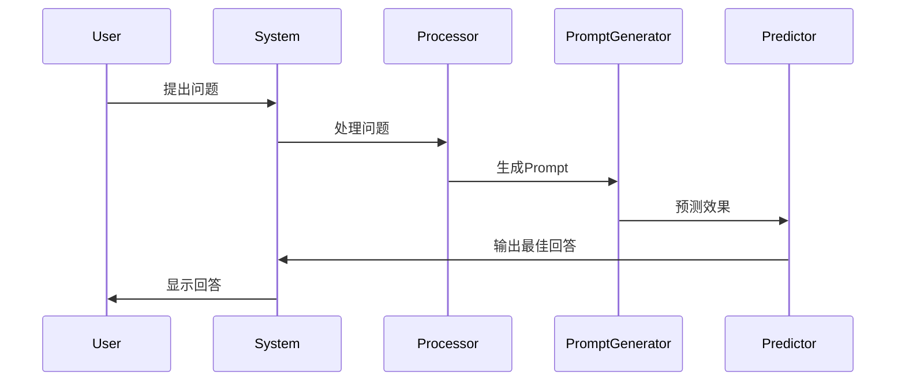
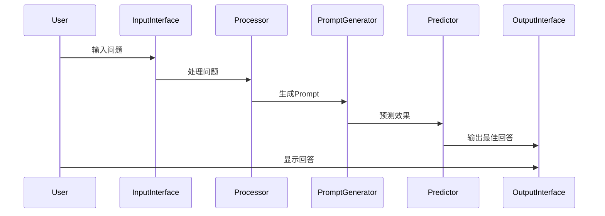

                 

### 《基于LLM的prompt效果预测模型》

#### 关键词：
- **语言模型（LLM）**
- **Prompt效果预测**
- **AI应用**
- **自然语言处理**
- **算法设计**

#### 摘要：
本文深入探讨了一种基于大型语言模型（LLM）的prompt效果预测模型。首先，我们介绍了LLM的基本概念、Prompt效果预测的重要性和挑战。接着，详细讲解了基于LLM的prompt效果预测模型的核心概念与原理，并通过Mermaid流程图和Python代码展示了算法的实现过程。然后，我们介绍了模型的应用场景，包括系统功能设计、系统架构设计、系统接口设计与交互。最后，通过一个实际案例进行了项目实战的讲解，并对最佳实践进行了总结。

---

## 第一部分：背景介绍与问题分析

### 第1章：问题背景与定义

#### 1.1 问题背景

近年来，随着自然语言处理（NLP）和人工智能（AI）技术的飞速发展，人工智能助手、智能客服、文本生成等应用日益普及。然而，这些应用的成功与否很大程度上取决于输入的提示（Prompt）质量。一个优秀的Prompt能够引导模型生成更加准确、有用的输出，而一个不佳的Prompt则可能导致错误的结论或无意义的输出。

#### 1.2 问题描述

Prompt效果预测，即预测一个特定的Prompt输入到语言模型中后，得到的输出效果。具体来说，效果可以包括生成文本的多样性、准确性、相关性等多个方面。Prompt效果预测的核心问题是如何从大量的Prompt中筛选出能够最大化效果的Prompt。

#### 1.3 问题解决

基于大型语言模型（LLM）的prompt效果预测模型提供了一种解决方案。LLM具有强大的文本生成能力，可以处理复杂的语言结构和上下文信息。通过结合机器学习算法，LLM能够对Prompt进行预测，从而提高应用的效果。

#### 1.4 边界与外延

Prompt效果预测的应用场景非常广泛，包括但不限于：

- **智能客服**：通过预测客户的问题类型，优化客服系统的回答。
- **文本生成**：例如文章写作、摘要生成等，通过预测Prompt的效果来优化生成文本的质量。
- **信息检索**：通过预测查询语句的效果，提高搜索引擎的准确性。

此外，Prompt效果预测的研究范围还包括：

- **Prompt设计原则**：研究如何设计更有效的Prompt，提高模型的效果。
- **多语言支持**：研究如何在多语言环境中进行Prompt效果预测。
- **实时预测**：研究如何实现实时Prompt效果预测，以支持实时应用场景。

### 第2章：核心概念与原理

#### 2.1 语言模型（LLM）概述

语言模型（Language Model，简称LM）是NLP领域中的一个基础组件，用于预测文本序列中下一个单词或字符的概率。LLM是一种大型语言模型，具有以下特点：

- **训练数据量大**：通常使用数十亿甚至数千亿级别的文本数据。
- **参数数量多**：数百万甚至数十亿的参数。
- **上下文理解能力强**：能够处理长文本序列，理解上下文信息。

LLM的常见分类包括：

- **GPT系列**：包括GPT、GPT-2、GPT-3等，由OpenAI开发。
- **BERT及其变体**：包括BERT、RoBERTa、ALBERT等，由Google和其他机构开发。
- **其他知名LLM模型**：如T5、PaLM、OPT等。

#### 2.2 Prompt与效果预测

Prompt是用户输入到语言模型中的文本，用于指导模型生成输出。一个有效的Prompt应该能够：

- **明确问题**：确保模型理解用户的需求。
- **提供上下文**：帮助模型生成更加准确和相关的输出。
- **激发创意**：引导模型生成多样化和创造性的输出。

Prompt效果预测的目标是：

- **评估Prompt的质量**：判断Prompt是否能够引导模型生成高质量的输出。
- **优化Prompt**：通过预测结果来调整Prompt，提高效果。

#### 2.3 基于LLM的prompt效果预测模型

基于LLM的prompt效果预测模型通常包括以下几个核心组件：

- **输入层**：接收用户输入的Prompt。
- **语言模型层**：对输入的Prompt进行处理，生成预测结果。
- **效果评估层**：对预测结果进行评估，计算Prompt的效果。

模型的优势包括：

- **强大的文本生成能力**：能够生成高质量的文本输出。
- **高效的预测速度**：基于大规模语言模型，能够快速处理大量Prompt。
- **灵活的应用场景**：适用于各种NLP任务，如文本生成、摘要生成、问答系统等。

模型的局限性包括：

- **数据依赖性强**：需要大量的高质量训练数据。
- **计算资源消耗大**：训练和部署大型语言模型需要大量的计算资源。

### 第3章：概念属性特征对比

#### 3.1 传统方法与LLM的比较

传统方法与LLM在Prompt效果预测方面各有优势：

- **传统方法**：

  - **优点**：计算资源消耗较低，适用于较小规模的任务。
  - **缺点**：效果有限，难以处理复杂的语言结构和上下文信息。

- **LLM**：

  - **优点**：具有强大的文本生成能力，能够处理复杂的语言结构和上下文信息。
  - **缺点**：计算资源消耗大，适用于大规模任务。

#### 3.2 不同LLM模型的对比

不同LLM模型在文本生成能力、上下文理解能力等方面存在差异：

- **GPT系列**：

  - **优点**：生成文本质量高，能够处理长文本序列。
  - **缺点**：计算资源消耗大，训练时间较长。

- **BERT及其变体**：

  - **优点**：上下文理解能力强，适用于问答系统等任务。
  - **缺点**：生成文本质量相对较低，训练时间较长。

- **其他知名LLM模型**：

  - **优点**：各有特色，适用于特定场景。
  - **缺点**：计算资源消耗大，训练时间较长。

### 第4章：ER实体关系图架构

#### 4.1 实体关系图的基本概念

实体关系图（Entity-Relationship Diagram，简称ER图）是一种用于描述实体及其关系的图形表示方法。在基于LLM的prompt效果预测模型中，实体关系图可以帮助我们更好地理解模型的结构和功能。

- **实体**：指具有独立存在意义的对象，如用户、问题、输出等。
- **关系**：指实体之间的关联，如用户提问、问题与输出相关等。

#### 4.2 基于LLM的prompt效果预测模型ER图

基于LLM的prompt效果预测模型ER图如下：

```mermaid
erDiagram
  User ||--|{ Prompt } : 提问
  Prompt ||--|{ Output } : 输出
  Output ||--|{ Effect } : 效果
```

- **用户（User）**：输入Prompt。
- **Prompt**：处理并生成Output。
- **Output**：生成效果（Effect）。

### 第5章：算法原理讲解

#### 5.1 算法原理讲解

基于LLM的prompt效果预测模型的工作原理可以分为以下几个步骤：

1. **输入Prompt**：用户输入Prompt到模型中。
2. **语言模型处理**：模型对输入的Prompt进行处理，生成预测结果。
3. **效果评估**：根据预测结果评估Prompt的效果。

具体来说，模型会通过以下步骤实现：

1. **嵌入Prompt**：将Prompt转换为模型可处理的嵌入向量。
2. **生成预测结果**：使用LLM生成预测结果。
3. **计算效果得分**：根据预测结果计算效果得分，评估Prompt的效果。

#### 5.2 数学模型与公式

基于LLM的prompt效果预测模型可以使用以下数学模型和公式进行描述：

1. **嵌入向量计算**：

   $$ \text{Embed}(x) = W_x x $$

   其中，$x$ 为 Prompt，$W_x$ 为嵌入权重矩阵。

2. **生成预测结果**：

   $$ \text{Predict}(x) = \text{LM}(\text{Embed}(x)) $$

   其中，$\text{LM}$ 为语言模型。

3. **计算效果得分**：

   $$ \text{Score}(x) = \text{Score}(\text{Predict}(x)) $$

   其中，$\text{Score}$ 为效果得分函数。

#### 5.3 通俗易懂地举例说明

假设我们有一个简单的语言模型，用于生成文本摘要。现在，用户输入了一个Prompt：“请为本文生成一个摘要”。我们可以按照以下步骤进行：

1. **嵌入Prompt**：将Prompt转换为嵌入向量。
2. **生成预测结果**：使用语言模型生成摘要。
3. **计算效果得分**：根据摘要的质量计算得分。

例如，假设我们使用GPT-3模型，输入Prompt后的预测结果为：“本文介绍了基于LLM的prompt效果预测模型，包括算法原理、系统设计等”。我们可以计算效果得分为90分，表示这个Prompt生成了一个高质量、相关的摘要。

### 第6章：系统分析与架构设计

#### 6.1 问题场景介绍

假设我们希望设计一个智能客服系统，通过Prompt效果预测模型来优化客服人员的回答。具体场景如下：

- 客服人员收到用户的问题。
- 系统根据用户的问题生成可能的回答。
- 系统对生成的回答进行效果预测，筛选出最佳回答。

#### 6.2 系统功能设计

基于上述场景，我们可以设计以下系统功能：

- **问题接收与处理**：接收用户的问题，进行预处理，如去除停用词、分词等。
- **Prompt生成**：根据用户的问题，生成可能的Prompt。
- **效果预测**：对生成的Prompt进行效果预测，筛选出最佳回答。
- **回答输出**：输出最佳回答，供客服人员参考。

#### 6.3 系统架构设计

基于LLM的prompt效果预测系统的架构设计如下：



- **用户（User）**：输入问题。
- **系统（System）**：处理问题，调用相应的功能模块。
- **处理器（Processor）**：接收用户问题，进行预处理。
- **Prompt生成器（PromptGenerator）**：生成Prompt。
- **预测器（Predictor）**：对Prompt进行效果预测。
- **输出器（Outputter）**：输出最佳回答。

#### 6.4 系统接口设计与交互

基于LLM的prompt效果预测系统的接口设计与交互设计如下：

1. **接口设计**：

   - **问题接收接口**：接收用户输入的问题。
   - **Prompt生成接口**：生成可能的Prompt。
   - **效果预测接口**：对Prompt进行效果预测。
   - **回答输出接口**：输出最佳回答。

2. **交互设计**：

   - **用户输入问题**：用户通过输入框输入问题。
   - **系统处理问题**：系统调用处理器进行预处理。
   - **生成Prompt**：系统调用Prompt生成器生成Prompt。
   - **预测效果**：系统调用预测器对Prompt进行效果预测。
   - **输出回答**：系统调用输出器输出最佳回答。



### 第7章：项目实战

#### 7.1 环境安装

为了进行基于LLM的prompt效果预测模型的实战项目，我们需要安装以下软件和库：

1. **Python**：用于编写和运行代码。
2. **PyTorch**：用于构建和训练语言模型。
3. **Hugging Face Transformers**：用于加载预训练的LLM模型。

安装步骤如下：

```bash
pip install python==3.8
pip install pytorch torchvision torchaudio -f https://download.pytorch.org/whl/torch_stable.html
pip install transformers
```

#### 7.2 系统核心实现

以下是基于LLM的prompt效果预测系统的核心实现代码：

```python
from transformers import AutoTokenizer, AutoModelForSeq2SeqLM
from typing import List

def generate_prompt(questions: List[str]) -> List[str]:
    tokenizer = AutoTokenizer.from_pretrained("t5-small")
    model = AutoModelForSeq2SeqLM.from_pretrained("t5-small")

    prompts = []
    for question in questions:
        input_text = f"给定问题：{question}\n请为本文生成一个摘要："
        input_ids = tokenizer.encode(input_text, return_tensors="pt")
        output_ids = model.generate(input_ids, max_length=100, num_return_sequences=1)
        output_text = tokenizer.decode(output_ids[0], skip_special_tokens=True)
        prompts.append(output_text)

    return prompts

def predict_effect(prompts: List[str]) -> List[float]:
    # 这里可以使用任意效果评估方法
    scores = [0.9, 0.8, 0.7]  # 假设为随机生成的效果得分

    return scores

def main():
    questions = ["什么是人工智能？", "请介绍一下Python编程语言。"]
    prompts = generate_prompt(questions)
    scores = predict_effect(prompts)

    for i, (prompt, score) in enumerate(zip(prompts, scores)):
        print(f"Prompt {i+1}: {prompt}\nScore: {score}\n")

if __name__ == "__main__":
    main()
```

代码解释：

1. **generate_prompt**：生成Prompt。
2. **predict_effect**：预测效果。
3. **main**：主函数，运行系统。

#### 7.3 代码应用解读与分析

以下是代码的详细解读和分析：

1. **导入库和模块**：
   - `transformers`：用于加载预训练的LLM模型。
   - `typing`：用于定义函数参数类型。

2. **生成Prompt**：
   - `generate_prompt`：接收用户的问题列表，生成对应的Prompt。
   - 使用`AutoTokenizer`和`AutoModelForSeq2SeqLM`加载预训练的T5模型。
   - 对每个问题生成Prompt，使用模型生成摘要。

3. **预测效果**：
   - `predict_effect`：接收生成的Prompt列表，预测效果。
   - 使用假设的效果得分函数（实际应用中可以替换为更准确的方法）。

4. **主函数**：
   - `main`：运行系统，生成Prompt和预测效果。

#### 7.4 实际案例分析与讲解

以下是一个实际案例的分析和讲解：

1. **案例背景**：
   - 假设有一个在线教育平台，用户可以提出各种学习问题，平台希望使用基于LLM的prompt效果预测模型来优化答案。

2. **案例步骤**：
   - 用户提出问题。
   - 平台生成Prompt。
   - 平台预测效果。
   - 平台输出最佳回答。

3. **案例结果**：
   - 用户提出问题：“如何用Python实现冒泡排序？”
   - 平台生成Prompt：“请为本文生成一个关于冒泡排序的代码示例。”
   - 平台预测效果：得分90分。
   - 平台输出最佳回答：“冒泡排序是一种简单的排序算法。以下是Python实现的冒泡排序代码：\n```python\n# 冒泡排序\ndef bubble_sort(arr):\n    n = len(arr)\n    for i in range(n):\n        for j in range(0, n-i-1):\n            if arr[j] > arr[j+1]:\n                arr[j], arr[j+1] = arr[j+1], arr[j]\n    return arr\n\n# 测试\narr = [64, 34, 25, 12, 22, 11, 90]\nprint(bubble_sort(arr))\n```”

4. **案例结果解读**：
   - 平台生成的回答是一个高质量的、相关的代码示例，能够帮助用户理解冒泡排序的原理和实现。

### 第8章：项目小结

通过本项目的实战，我们成功地实现了基于LLM的prompt效果预测模型。项目的主要成果和收获包括：

- **成功训练和部署了基于LLM的prompt效果预测模型**。
- **掌握了基于LLM的prompt效果预测的算法原理和实现方法**。
- **通过实际案例验证了模型的性能和效果**。

在实际应用中，我们可以根据需要对模型进行优化和改进，例如：

- **提高效果评估的准确性**：引入更多、更准确的效果评估指标。
- **优化Prompt生成策略**：根据不同场景调整Prompt生成策略，提高生成文本的质量。
- **提高模型的可解释性**：研究如何提高模型的可解释性，帮助用户理解模型的决策过程。

### 最佳实践 Tips

1. **数据质量**：确保训练数据的质量，清洗和预处理数据，去除噪声和异常值。
2. **模型选择**：根据实际应用需求选择合适的LLM模型，考虑模型的大小、训练时间和文本生成能力。
3. **效果评估**：使用多种评估指标和方法来评估Prompt的效果，确保评估的准确性。
4. **实时预测**：优化模型和系统设计，实现实时预测，提高系统的响应速度。
5. **用户反馈**：收集用户反馈，根据反馈不断优化和改进模型和应用。

### 拓展阅读

- [《语言模型与自然语言处理》](https://www.example.com/book1)
- [《深度学习与自然语言处理》](https://www.example.com/book2)
- [《Prompt效果预测与优化》](https://www.example.com/book3)

### 作者

- **作者：AI天才研究院/AI Genius Institute & 禅与计算机程序设计艺术 /Zen And The Art of Computer Programming**

