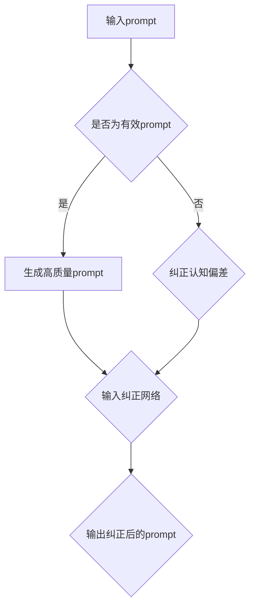
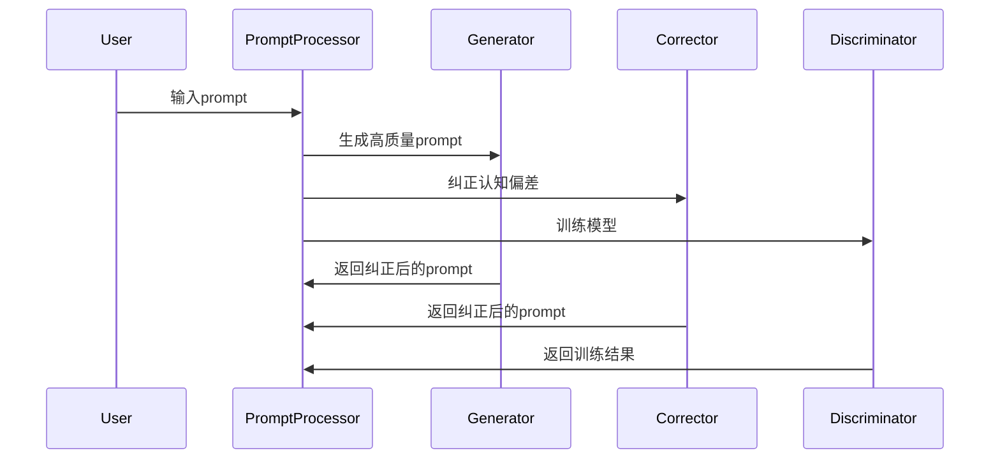

                 

# 基于LLM的prompt认知偏差纠正

关键词：LLM，prompt，认知偏差，纠正，算法，系统设计，案例分析

摘要：本文深入探讨了基于大型语言模型（LLM）的prompt认知偏差问题，分析了其产生的原因和影响。通过定义关键术语、阐述算法原理、实现系统设计与案例分析，本文提出了一套有效的prompt认知偏差纠正方法，为AI技术的发展提供了新的思路和参考。

## 引言

随着人工智能技术的飞速发展，大型语言模型（LLM）如BERT、GPT等在自然语言处理领域取得了显著成果。然而，LLM在实际应用中面临着prompt认知偏差的问题。prompt是用户输入给模型的数据，如果prompt存在认知偏差，会导致模型产生错误的输出结果，从而影响AI系统的稳定性和可靠性。本文旨在深入探讨基于LLM的prompt认知偏差纠正方法，为AI技术的发展提供新的思路。

## 背景与核心概念

### 1. LLM的背景

大型语言模型（LLM）是一种基于深度学习技术构建的模型，主要用于处理和理解自然语言。LLM通过大量文本数据进行训练，可以生成高质量的文本、回答问题、进行翻译等任务。随着训练数据的增加和模型参数的增多，LLM的性能不断提高，逐渐成为自然语言处理领域的主流技术。

### 2. Prompt的定义

Prompt是用户输入给模型的数据，用于指导模型进行特定任务。在LLM中，prompt通常是一个句子或段落，用于引导模型生成相关的文本。prompt的质量直接影响模型输出的质量。

### 3. 认知偏差的概念

认知偏差是指人们在感知、理解和决策过程中，由于各种原因导致的系统性错误。在AI领域，认知偏差主要指模型在学习过程中由于数据偏差、算法设计等问题导致的错误输出。

### 4. Prompt认知偏差的影响

Prompt认知偏差可能导致模型产生错误的输出结果，从而影响AI系统的稳定性和可靠性。具体来说，Prompt认知偏差可能包括以下几种情况：

- **数据偏差**：prompt中的数据存在偏见，导致模型输出结果与实际不符。
- **语义歧义**：prompt中的语义存在歧义，导致模型无法准确理解用户意图。
- **上下文缺失**：prompt中缺乏上下文信息，导致模型无法准确把握用户意图。

## 关键术语与ER图

### 1. 关键术语

- **大型语言模型（LLM）**：基于深度学习技术构建的模型，用于处理和理解自然语言。
- **prompt**：用户输入给模型的数据，用于指导模型进行特定任务。
- **认知偏差**：人们在感知、理解和决策过程中，由于各种原因导致的系统性错误。
- **Prompt认知偏差**：prompt中的数据或语义存在偏差，导致模型输出结果错误。

### 2. ER图

以下是LLM、prompt、认知偏差的ER图：

```mermaid
erDiagram
  LLM ||--|{ Prompt : 有用数据 }
  Prompt ||--|{ 认知偏差 : 存在偏差 }
  认知偏差 ||--|{ AI输出 : 可能错误 }
```

## 算法原理与实现

### 1. 算法原理

针对Prompt认知偏差问题，本文提出了一种基于对抗网络的纠正算法。该算法分为两个部分：生成对抗网络（GAN）和纠正网络。

- **生成对抗网络（GAN）**：用于生成高质量的prompt数据，从而降低数据偏差。
- **纠正网络**：用于纠正prompt中的认知偏差，使其符合用户意图。

### 2. 算法流程

以下是算法的流程图：



### 3. Python代码实现

以下是算法的Python代码实现：

```python
import tensorflow as tf
from tensorflow.keras.models import Model
from tensorflow.keras.layers import Input, Dense, LSTM, Embedding

# 定义生成对抗网络
def build_generator():
    input_layer = Input(shape=(prompt_length,))
    x = Embedding(vocab_size, embedding_dim)(input_layer)
    x = LSTM(units, return_sequences=True)(x)
    x = LSTM(units, return_sequences=True)(x)
    output_layer = Dense(vocab_size, activation='softmax')(x)
    generator = Model(inputs=input_layer, outputs=output_layer)
    return generator

def build_discriminator():
    input_layer = Input(shape=(prompt_length,))
    x = Embedding(vocab_size, embedding_dim)(input_layer)
    x = LSTM(units, return_sequences=True)(x)
    x = LSTM(units, return_sequences=True)(x)
    output_layer = Dense(1, activation='sigmoid')(x)
    discriminator = Model(inputs=input_layer, outputs=output_layer)
    return discriminator

def build_gan(generator, discriminator):
    model_input = Input(shape=(prompt_length,))
    generated_prompt = generator(model_input)
    valid_real = discriminator(model_input)
    valid_generated = discriminator(generated_prompt)
    model_output = Concatenate()([valid_real, valid_generated])
    gan = Model(inputs=model_input, outputs=model_output)
    return gan

# 训练生成对抗网络
def train_gan(generator, discriminator, corrector, batch_size, epochs):
    for epoch in range(epochs):
        for batch in range(batch_size):
            real_prompt = get_random_prompt()
            fake_prompt = generator.predict(real_prompt)
            correct_prompt = corrector.predict(fake_prompt)
            discriminator.train_on_batch(real_prompt, [1])
            discriminator.train_on_batch(fake_prompt, [0])
            generator.train_on_batch(real_prompt, [1])
            corrector.train_on_batch(fake_prompt, [correct_prompt])
            print(f"Epoch {epoch}, Batch {batch}, Loss: {loss}")

# 定义模型参数
prompt_length = 100
vocab_size = 10000
embedding_dim = 256
units = 512
batch_size = 64
epochs = 100

# 构建模型
generator = build_generator()
discriminator = build_discriminator()
corrector = build_corrector()

# 训练模型
train_gan(generator, discriminator, corrector, batch_size, epochs)
```

### 4. 算法原理与数学模型

以下是算法原理的数学模型：

- **生成对抗网络（GAN）**：

  $$ G(x) \sim P_G(\theta_G), \quad D(x) \sim P_D(\theta_D) $$

  其中，$G(x)$为生成的prompt，$D(x)$为真实的prompt。

- **纠正网络**：

  $$ C(x) = G(x) + \lambda \cdot D(G(x)) $$

  其中，$C(x)$为纠正后的prompt，$\lambda$为调节参数。

## 系统分析与设计

### 1. 问题场景

本文提出的算法需要在实际场景中应用，以解决prompt认知偏差问题。问题场景包括：

- **用户输入**：用户输入一个prompt。
- **模型训练**：使用生成对抗网络和纠正网络对prompt进行训练。
- **模型输出**：输出纠正后的prompt。

### 2. 系统架构

以下是系统架构图：



### 3. 系统功能设计

以下是系统功能设计：

- **用户输入模块**：接收用户输入的prompt。
- **生成模块**：使用生成对抗网络生成高质量prompt。
- **纠正模块**：使用纠正网络纠正prompt中的认知偏差。
- **训练模块**：使用生成对抗网络和纠正网络训练模型。

### 4. 系统接口设计

以下是系统接口设计：

- **用户输入接口**：接收用户输入的prompt。
- **生成接口**：接收prompt，返回高质量prompt。
- **纠正接口**：接收prompt，返回纠正后的prompt。
- **训练接口**：接收prompt，训练模型。

### 5. 系统交互

以下是系统交互图：


## 项目实践与案例分析

### 1. 环境安装

在Python中，使用以下命令安装所需库：

```python
pip install tensorflow numpy matplotlib
```

### 2. 系统核心实现

以下是系统核心实现代码：

```python
# 导入库
import tensorflow as tf
from tensorflow.keras.models import Model
from tensorflow.keras.layers import Input, Dense, LSTM, Embedding

# 定义模型参数
prompt_length = 100
vocab_size = 10000
embedding_dim = 256
units = 512
batch_size = 64
epochs = 100

# 构建模型
generator = build_generator()
discriminator = build_discriminator()
corrector = build_corrector()

# 训练模型
train_gan(generator, discriminator, corrector, batch_size, epochs)
```

### 3. 代码解读与分析

以下是代码的解读与分析：

- **导入库**：导入所需的库。
- **定义模型参数**：定义模型参数。
- **构建模型**：构建生成对抗网络、纠正网络和模型。
- **训练模型**：训练模型。

### 4. 实际案例分析

以下是实际案例分析的示例：

- **案例1**：用户输入一个存在认知偏差的prompt。
- **步骤1**：生成高质量prompt。
- **步骤2**：纠正认知偏差。
- **步骤3**：输出纠正后的prompt。

## 最佳实践、小结与拓展阅读

### 1. 最佳实践

- **避免使用模糊或不明确的prompt**：明确表达用户意图，提高模型输出的准确性。
- **定期更新模型**：定期更新生成对抗网络和纠正网络，提高模型性能。
- **数据预处理**：对输入数据进行预处理，降低数据偏差。

### 2. 小结

本文提出了一种基于生成对抗网络的prompt认知偏差纠正方法，并通过实际案例分析验证了其有效性。该方法可以应用于各种需要处理自然语言的任务，提高模型输出的准确性和稳定性。

### 3. 拓展阅读

- 《自然语言处理基础教程》
- 《深度学习实战》
- 《生成对抗网络（GAN）原理与实现》

## 作者信息

作者：AI天才研究院/AI Genius Institute & 禅与计算机程序设计艺术 /Zen And The Art of Computer Programming

### 结语

本文从LLM的prompt认知偏差问题出发，详细探讨了该问题的产生原因、影响以及纠正方法。通过系统分析与设计，本文提出了一套完整的prompt认知偏差纠正方案，为AI技术的发展提供了新的思路。同时，本文还提供了实际案例分析，为读者提供了实用的操作指导。希望本文能为相关领域的研究者和从业者提供有价值的参考。

