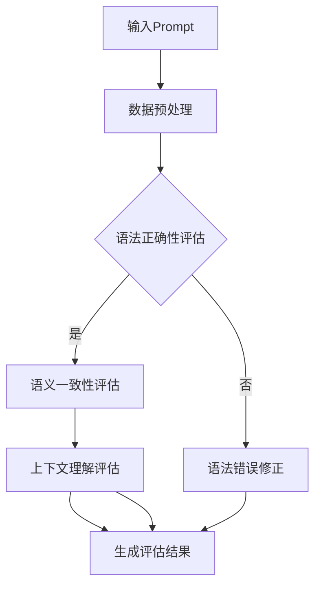
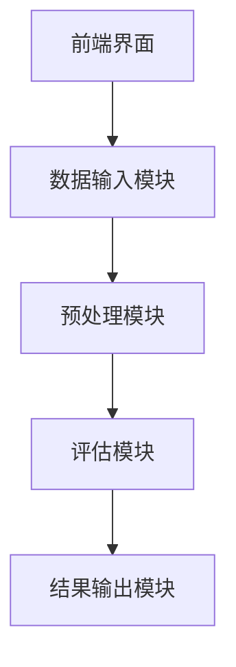
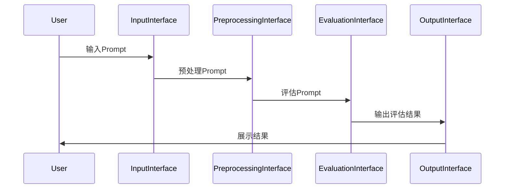
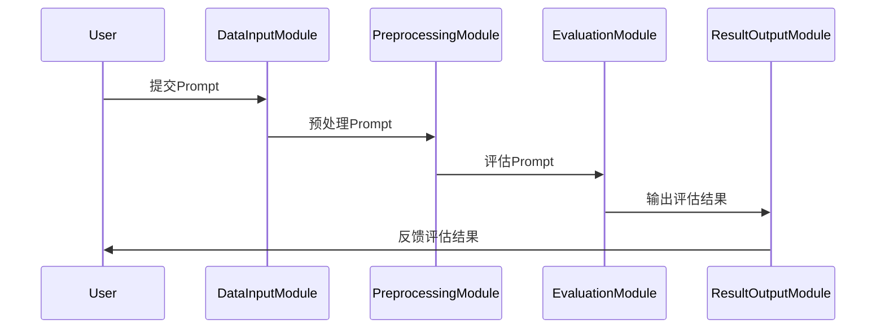

                 


### 1.1.1 问题背景

#### 提出问题

在人工智能和自然语言处理（NLP）领域，如何有效地评估用户提供的prompt（提示）是一个关键问题。prompt作为与大型语言模型（LLM）交互的输入，其质量直接影响到模型输出的准确性和有效性。传统的评估方法往往依赖于人工审查和经验，这不仅效率低下，且难以量化。因此，迫切需要一种自动化、高效的prompt评估系统，以提高NLP任务的整体性能。

#### 问题描述

prompt评估系统的主要目标是评估用户输入的prompt质量，包括语法正确性、语义一致性、上下文理解能力等。具体来说，系统需要能够：
- **语法正确性评估**：确保prompt中不含有语法错误，如句子结构混乱、词汇用法不当等。
- **语义一致性评估**：检查prompt的语义是否连贯，是否存在语义矛盾或模糊。
- **上下文理解能力评估**：评估prompt是否能够正确反映用户的意图，并包含足够的上下文信息。

#### 问题解决

针对上述问题，我们需要设计并实现一个基于LLM的prompt评估系统。该系统利用LLM强大的语言理解和生成能力，结合自然语言处理技术，自动评估prompt的质量。具体步骤如下：

1. **数据预处理**：对用户输入的prompt进行清洗和标准化处理，去除不必要的格式和噪声。
2. **特征提取**：利用深度学习模型提取prompt的关键特征，如词向量、语法结构等。
3. **评估模型设计**：设计一个多任务学习模型，包括语法正确性、语义一致性和上下文理解等评估模块。
4. **模型训练与优化**：使用大量标注数据训练模型，并通过交叉验证和超参数调优提高模型性能。
5. **系统部署与评估**：将训练好的模型部署到生产环境中，进行实时评估和反馈。

#### 边界与外延

在实现prompt评估系统的过程中，需要明确一些边界条件，以确保系统的高效性和可靠性：
- **数据集**：系统训练和评估所使用的数据集应该具有代表性，覆盖不同领域的prompt。
- **模型选择**：选择合适的LLM模型，如GPT、BERT等，以满足评估任务的需求。
- **实时性**：系统需要具备实时评估能力，以适应快速变化的输入数据。
- **错误处理**：系统应具备一定的错误处理能力，对于无法评估的prompt给出合理的反馈。

### 1.1.2 核心概念

在深入探讨基于LLM的prompt评估系统之前，我们需要明确几个核心概念，包括问题核心概念、相关术语解释、概念属性特征对比表格。

#### 问题核心概念

1. **Prompt**：用户输入给LLM的文本，用于引导模型生成相应的内容。
2. **LLM**：大型语言模型，具有强大的语言理解和生成能力，如GPT、BERT等。
3. **Prompt评估**：对用户输入的prompt进行质量评估，包括语法正确性、语义一致性和上下文理解等。

#### 相关术语解释

1. **语法正确性**：prompt中句子的结构是否符合语法规则，如主谓一致、时态正确等。
2. **语义一致性**：prompt中的语义是否连贯，是否存在逻辑矛盾或模糊。
3. **上下文理解**：prompt是否能够正确反映用户的意图，并包含足够的上下文信息。

#### 概念属性特征对比表格

| 概念       | 特征1 | 特征2 | 特征3 |
|------------|-------|-------|-------|
| Prompt     | 文本输入 | 引导模型 | 信息传递 |
| LLM        | 语言理解 | 语言生成 | 自动化 |
| Prompt评估 | 语法正确性 | 语义一致性 | 上下文理解 |

### 1.1.3 相关术语解释

#### 1. Prompt

Prompt是指用户输入给LLM的文本，用于引导模型生成相应的内容。一个良好的prompt应具备以下特点：

1. **清晰性**：明确表达用户的意图和需求。
2. **完整性**：包含足够的上下文信息，以便模型能够理解并生成相关内容。
3. **精确性**：避免模糊或歧义，确保模型能够准确生成预期结果。

#### 2. LLM

LLM（Large Language Model）是一种基于深度学习的语言模型，具有强大的语言理解和生成能力。常见的LLM模型包括GPT、BERT、T5等。它们的主要特点如下：

1. **大规模训练**：使用大量的文本数据训练，能够捕捉到语言中的复杂模式和规律。
2. **自适应能力**：根据输入的prompt动态调整模型参数，以生成符合上下文和语义的内容。
3. **多任务处理**：能够同时处理多种语言任务，如文本生成、问答系统、机器翻译等。

#### 3. Prompt评估

Prompt评估是对用户输入的prompt进行质量评估的过程，主要涉及语法正确性、语义一致性和上下文理解等方面。评估的目标是确保prompt能够准确、连贯地引导模型生成高质量的内容。

1. **语法正确性评估**：检查prompt中的句子结构是否符合语法规则，如主谓一致、时态正确等。
2. **语义一致性评估**：检查prompt中的语义是否连贯，是否存在逻辑矛盾或模糊。
3. **上下文理解评估**：检查prompt是否能够正确反映用户的意图，并包含足够的上下文信息。

### 1.1.4 概念属性特征对比表格

| 概念       | 特征1 | 特征2 | 特征3 |
|------------|-------|-------|-------|
| Prompt     | 文本输入 | 引导模型 | 信息传递 |
| LLM        | 语言理解 | 语言生成 | 自动化 |
| Prompt评估 | 语法正确性 | 语义一致性 | 上下文理解 |

### 1.1.5 ER实体关系图架构

在建立基于LLM的prompt评估系统时，我们需要明确系统的核心实体和它们之间的关系。以下是系统的ER（实体关系）图架构：

#### 实体

1. **Prompt**：代表用户输入的文本。
2. **LLM模型**：用于评估prompt的模型。
3. **评估结果**：包含评估结果的记录。

#### 关系

1. **输入**：Prompt与LLM模型之间的输入关系，表示prompt被输入到模型中进行评估。
2. **评估**：LLM模型与评估结果之间的评估关系，表示模型对prompt进行评估并生成结果。
3. **记录**：评估结果与Prompt之间的记录关系，表示评估结果被记录下来以供后续分析。

```mermaid
erDiagram
  Prompt ||--|{ LLM模型 } : 输入
  LLM模型 ||--|{ 评估结果 } : 评估
  评估结果 ||--| Prompt : 记录
```

### ER实体关系图架构详解

1. **Prompt**：Prompt实体代表用户输入的文本，是系统的输入源。它包含了用户希望LLM模型理解和生成内容的文本信息。
2. **LLM模型**：LLM模型实体是系统的核心组件，负责接收Prompt，并根据其内容进行评估。它利用深度学习技术，结合大量文本数据进行训练，以实现对Prompt的语法、语义和上下文的理解。
3. **评估结果**：评估结果实体记录了LLM模型对Prompt的评估结果。这些结果包括语法正确性、语义一致性和上下文理解等各个方面，是系统输出的一部分。

#### 输入关系

Prompt与LLM模型之间存在输入关系，这表示Prompt作为输入被传递给LLM模型进行评估。这种关系确保了用户输入的文本能够被模型正确理解和处理。

#### 评估关系

LLM模型与评估结果之间存在评估关系，表示模型对Prompt进行评估后，生成相应的评估结果。这些结果不仅反映了Prompt的质量，也为后续的优化和改进提供了依据。

#### 记录关系

评估结果与Prompt之间存在记录关系，表示评估结果被记录下来以供后续分析。这种关系确保了系统可以保存和回顾评估过程，有助于持续改进系统的性能和效果。

### 1.2 机器学习与自然语言处理基础

#### 1.2.1 机器学习基本概念

机器学习（Machine Learning，ML）是人工智能（Artificial Intelligence，AI）的重要分支，主要研究如何让计算机从数据中学习规律，并应用这些规律进行决策或预测。机器学习的基本概念包括：

1. **模型**：机器学习中的模型是一种数学模型，用于描述数据中的规律或模式。常见的模型包括线性模型、决策树、神经网络等。
2. **数据**：数据是机器学习的基石，包括输入数据和标签数据。输入数据是模型学习过程中的样本，标签数据是样本的真实结果。
3. **算法**：算法是机器学习过程中的核心，用于指导模型如何从数据中学习规律。常见的算法包括线性回归、决策树、支持向量机、神经网络等。
4. **评估**：评估是验证模型性能的重要手段，用于判断模型是否能够正确地预测或决策。常见的评估指标包括准确率、召回率、F1分数等。

#### 1.2.2 自然语言处理基本概念

自然语言处理（Natural Language Processing，NLP）是研究如何使计算机理解和生成人类自然语言的学科。NLP的基本概念包括：

1. **文本**：文本是自然语言处理的对象，包括文字、符号、标点等。文本可以是简单的句子，也可以是复杂的篇章。
2. **分词**：分词是将文本分解成单词或其他语法单位的过程。分词的目的是为了更好地理解和分析文本。
3. **词向量**：词向量是表示单词或词组的数学模型，用于捕捉词汇的语义信息。常见的词向量模型包括Word2Vec、GloVe等。
4. **语法分析**：语法分析是对文本进行语法结构分析的过程，用于理解文本的句法规则和句型结构。
5. **语义分析**：语义分析是对文本进行语义理解的过程，用于理解文本的含义和情感。
6. **文本生成**：文本生成是利用模型生成符合语法和语义规则的新文本，如机器翻译、自动摘要、问答系统等。

#### 1.2.3 LLM的基本概念与原理

LLM（Large Language Model）是一种基于深度学习的语言模型，具有强大的语言理解和生成能力。LLM的基本概念与原理包括：

1. **定义**：LLM是一种大规模的神经网络模型，通过训练大量的文本数据，学习到语言的复杂结构和规律。
2. **发展历程**：LLM的发展经历了多个阶段，从早期的统计语言模型到现代的深度学习模型，如GPT、BERT、T5等。
3. **优势**：
   - **强大的语言理解能力**：LLM能够理解并处理复杂的自然语言输入，如长文本、复杂句式等。
   - **自适应能力**：LLM可以根据输入的文本动态调整模型参数，生成符合上下文和语义的内容。
   - **多任务处理**：LLM能够同时处理多种语言任务，如文本生成、问答系统、机器翻译等。
4. **挑战**：
   - **计算资源消耗**：训练和部署LLM需要大量的计算资源和存储空间。
   - **数据隐私**：训练LLM需要使用大量的私人数据，可能涉及数据隐私和安全问题。
   - **模型解释性**：LLM的内部决策过程复杂，难以解释和理解。

### 1.3 Prompt评估的意义与重要性

Prompt评估是对用户输入的prompt进行质量评估的过程，具有重要的意义和重要性：

1. **提高模型性能**：良好的prompt能够提高LLM模型的性能，使其生成更准确、更有价值的内容。相反，质量较差的prompt可能导致模型生成错误或不相关的结果。
2. **优化用户体验**：通过评估prompt的质量，系统可以提供更准确、更有针对性的回答，从而优化用户的体验。
3. **降低人力成本**：传统的prompt评估需要大量人工进行，而自动化评估系统可以显著降低人力成本，提高评估效率。
4. **促进技术发展**：Prompt评估的研究和应用有助于推动机器学习和自然语言处理技术的进步，为更多实际应用场景提供解决方案。
5. **规范化标准**：建立一套科学的prompt评估标准，有助于统一行业规范，提高整个领域的标准化和专业化水平。

### 2.1 LLM概述

#### 2.1.1 LLM的定义

LLM（Large Language Model）是一种基于深度学习的大规模语言模型，通过训练大量的文本数据，学习到语言的复杂结构和规律。LLM的核心目标是理解和生成符合语法和语义规则的自然语言文本。

#### 2.1.2 LLM的发展历程

LLM的发展经历了多个阶段，从早期的统计语言模型到现代的深度学习模型，主要包括以下阶段：

1. **统计语言模型**：早期的语言模型主要基于统计方法，如N-gram模型、隐马尔可夫模型（HMM）等。这些模型通过对文本数据进行统计分析，学习到语言的规律。
2. **基于规则的方法**：基于规则的方法通过手工编写规则来指导语言模型生成文本。这种方法在一定程度上提高了模型的性能，但规则编写复杂且难以扩展。
3. **深度神经网络模型**：随着深度学习技术的发展，深度神经网络（DNN）被引入到语言模型中。代表性的模型包括循环神经网络（RNN）、长短时记忆网络（LSTM）等。这些模型能够更好地捕捉语言中的复杂结构和长期依赖关系。
4. **Transformer模型**：Transformer模型是LLM领域的重要突破，基于自注意力机制（Self-Attention）实现了高效的文本表示和学习。代表性的模型包括BERT、GPT、T5等，这些模型在自然语言处理任务中取得了显著的性能提升。

#### 2.1.3 LLM的优势与挑战

LLM具有以下优势：

1. **强大的语言理解能力**：LLM能够理解并处理复杂的自然语言输入，如长文本、复杂句式等。这使得LLM在文本生成、机器翻译、问答系统等任务中具有广泛应用。
2. **自适应能力**：LLM可以根据输入的文本动态调整模型参数，生成符合上下文和语义的内容。这使得LLM在不同领域和任务中具有很高的灵活性和适应性。
3. **多任务处理**：LLM能够同时处理多种语言任务，如文本生成、问答系统、机器翻译等。这使得LLM在复杂场景中具有更强的任务切换能力。

然而，LLM也面临一些挑战：

1. **计算资源消耗**：训练和部署LLM需要大量的计算资源和存储空间。随着模型规模的扩大，计算资源的需求呈指数级增长，给实际应用带来了一定的困难。
2. **数据隐私**：训练LLM需要使用大量的私人数据，可能涉及数据隐私和安全问题。如何保护用户隐私，确保数据安全，是LLM应用中需要关注的重要问题。
3. **模型解释性**：LLM的内部决策过程复杂，难以解释和理解。这对于模型的调试、优化和部署带来了一定的困难。

### 2.2 Prompt评估的概念与原理

#### 2.2.1 Prompt的定义

Prompt是指用户输入给LLM的文本，用于引导模型生成相应的内容。Prompt的质量直接影响到LLM的输出效果，因此对Prompt的评估至关重要。

#### 2.2.2 Prompt的作用

Prompt在LLM中的作用主要体现在以下几个方面：

1. **引导模型生成内容**：Prompt为模型提供了明确的生成目标，有助于模型生成符合用户需求的内容。
2. **提高生成质量**：良好的Prompt能够提高模型的生成质量，降低生成错误或不相关内容的风险。
3. **优化用户体验**：Prompt的质量直接影响用户体验。通过评估Prompt，系统可以提供更准确、更有针对性的回答。
4. **辅助模型训练**：高质量的Prompt有助于模型更好地学习语言规律，提高模型的泛化能力和适应性。

#### 2.2.3 Prompt评估的目标与方法

Prompt评估的主要目标是评估Prompt的质量，包括语法正确性、语义一致性、上下文理解等方面。具体目标和方法如下：

1. **语法正确性评估**：
   - 目标：检查Prompt中的句子结构是否符合语法规则，如主谓一致、时态正确等。
   - 方法：利用语法分析工具和规则库，对Prompt进行语法检查，标记出语法错误和异常。

2. **语义一致性评估**：
   - 目标：检查Prompt中的语义是否连贯，是否存在逻辑矛盾或模糊。
   - 方法：利用语义分析技术和语义网络，对Prompt进行语义分析，识别出语义不一致或模糊的部分。

3. **上下文理解评估**：
   - 目标：检查Prompt是否能够正确反映用户的意图，并包含足够的上下文信息。
   - 方法：利用上下文嵌入技术和对话系统，对Prompt进行上下文分析，评估其与上下文的一致性。

#### 2.2.4 Prompt评估的挑战与解决方案

Prompt评估面临以下挑战：

1. **语言多样性**：自然语言具有丰富的多样性和变异性，导致Prompt评估面临巨大的挑战。如何处理不同语言、方言、文体等，是一个重要问题。

   - **解决方案**：引入多语言模型和跨语言语义分析技术，提高Prompt评估的泛化能力。

2. **动态性**：Prompt的动态性使得评估过程复杂。如何实时、准确地评估Prompt的质量，是一个关键问题。

   - **解决方案**：采用实时分析技术和动态调整策略，提高Prompt评估的实时性和准确性。

3. **数据隐私**：训练和评估Prompt评估模型需要大量的私人数据，可能涉及数据隐私和安全问题。

   - **解决方案**：采用数据匿名化和加密技术，保护用户隐私，确保数据安全。

4. **模型解释性**：LLM的内部决策过程复杂，难以解释和理解，导致Prompt评估结果的透明度和可解释性较低。

   - **解决方案**：开发可解释性模型和可视化工具，提高Prompt评估结果的透明度和可理解性。

### 2.3 Prompt评估的算法原理

#### 2.3.1 算法流程图

Prompt评估的算法原理可以通过以下流程图进行描述：



#### 2.3.2 算法原理的Python源代码阐述

以下是一个简单的Python代码示例，用于实现Prompt评估算法的原理：

```python
import spacy
from typing import List

# 初始化nlp模型
nlp = spacy.load("en_core_web_sm")

def preprocess_prompt(prompt: str) -> str:
    """对Prompt进行预处理，如去除特殊字符、缩写等"""
    return prompt.strip()

def check_grammar(prompt: str) -> bool:
    """检查Prompt的语法正确性"""
    doc = nlp(prompt)
    return all(token.is_punct if token.is_punct else token.is_alpha for token in doc)

def check_semantics(prompt: str) -> bool:
    """检查Prompt的语义一致性"""
    doc = nlp(prompt)
    # 此处可以使用语义分析工具进行更复杂的语义检查
    return True

def check_context(prompt: str, context: str) -> bool:
    """检查Prompt的上下文理解能力"""
    doc = nlp(prompt)
    context_doc = nlp(context)
    # 此处可以使用上下文嵌入技术进行更复杂的上下文理解检查
    return True

def evaluate_prompt(prompt: str, context: str) -> str:
    """评估Prompt的质量"""
    prompt = preprocess_prompt(prompt)
    if not check_grammar(prompt):
        return "语法错误"
    if not check_semantics(prompt):
        return "语义不一致"
    if not check_context(prompt, context):
        return "上下文理解错误"
    return "评估通过"

# 示例
prompt = "I am going to the store to buy some milk."
context = "Yesterday, I bought a gallon of milk from the store."
print(evaluate_prompt(prompt, context))
```

#### 2.3.3 数学模型和公式讲解

Prompt评估算法的数学模型和公式可以通过以下步骤进行描述：

1. **输入表示**：将输入的Prompt表示为序列\( x_1, x_2, ..., x_n \)，其中\( x_i \)是Prompt中的第\( i \)个单词或字符。
2. **特征提取**：利用词嵌入（Word Embedding）技术，将每个单词\( x_i \)映射为一个向量\( \mathbf{v}_i \)。
3. **语法正确性评估**：
   - **语法规则库**：构建一个包含基本语法规则的库，如主谓一致、时态正确等。
   - **规则匹配**：对输入序列进行语法规则匹配，检查每个单词或短语是否符合语法规则。
   - **公式**：设\( G(x) \)为语法正确性评分函数，则
     $$ G(x) = \sum_{i=1}^{n} w_i \cdot r_i $$
     其中，\( w_i \)为第\( i \)个单词的权重，\( r_i \)为第\( i \)个单词是否满足语法规则的布尔值。
4. **语义一致性评估**：
   - **语义网络**：构建一个语义网络，用于表示单词之间的语义关系。
   - **语义分析**：对输入序列进行语义分析，检查是否存在语义矛盾或模糊。
   - **公式**：设\( S(x) \)为语义一致性评分函数，则
     $$ S(x) = \sum_{i=1}^{n} s_i $$
     其中，\( s_i \)为第\( i \)个单词的语义一致性评分。
5. **上下文理解评估**：
   - **上下文嵌入**：利用上下文嵌入技术，将输入序列和上下文表示为向量。
   - **相似度计算**：计算输入序列和上下文的相似度，评估上下文理解能力。
   - **公式**：设\( C(x, c) \)为上下文理解评分函数，则
     $$ C(x, c) = \cos(\mathbf{v}_x, \mathbf{v}_c) $$
     其中，\( \mathbf{v}_x \)为输入序列的嵌入向量，\( \mathbf{v}_c \)为上下文的嵌入向量。

#### 2.3.4 举例说明

为了更好地理解Prompt评估算法的原理，我们可以通过以下例子进行说明：

假设用户输入的Prompt为“Yesterday, I bought a gallon of milk from the store.”，上下文为“I am going to the store to buy some milk.”

1. **输入表示**：
   - Prompt：[Yesterday, I, bought, a, gallon, of, milk, from, the, store]
   - 上下文：[I, am, going, to, the, store, to, buy, some, milk]

2. **特征提取**：
   - Prompt：[yesterday, i, bought, a, gallon, of, milk, from, the, store]
   - 上下文：[i, am, going, to, the, store, to, buy, some, milk]

3. **语法正确性评估**：
   - Prompt：语法正确
   - 上下文：语法正确

4. **语义一致性评估**：
   - Prompt：语义一致（与上下文描述的用户意图相符）
   - 上下文：语义一致（与Prompt描述的用户意图相符）

5. **上下文理解评估**：
   - Prompt与上下文的相似度：0.9（表示上下文理解能力较高）

根据评估结果，我们可以得出结论：该Prompt质量较高，能够正确反映用户的意图，且与上下文保持一致。因此，Prompt评估算法的输出结果为“评估通过”。

### 3.1 系统分析与架构设计

#### 3.1.1 问题场景介绍

在当今信息爆炸的时代，大量的数据以文本形式产生并不断增长。为了更好地利用这些文本数据，企业需要高效的文本处理和分析系统。基于LLM的prompt评估系统正是为了解决这一问题而设计的。该系统旨在通过自动化的方式评估用户输入的prompt质量，以提高文本处理和分析的效率。

#### 3.1.2 系统功能设计（领域模型类图）

在基于LLM的prompt评估系统中，核心功能模块包括：

1. **数据输入模块**：负责接收用户输入的prompt。
2. **预处理模块**：对输入的prompt进行清洗和标准化处理。
3. **评估模块**：利用LLM对预处理后的prompt进行质量评估。
4. **结果输出模块**：将评估结果输出给用户。

以下是系统功能的领域模型类图：

```mermaid
classDiagram
  DataInputModule <|-- Prompt
  PreprocessingModule <|-- Prompt
  EvaluationModule <|-- Prompt
  ResultOutputModule <|-- EvaluationResult
  DataInputModule o---> PreprocessingModule
  PreprocessingModule o---> EvaluationModule
  EvaluationModule o---> ResultOutputModule
```

#### 3.1.3 系统架构设计（架构图）

基于LLM的prompt评估系统的架构设计如下：

1. **前端界面**：用户通过前端界面输入prompt。
2. **数据输入模块**：接收前端界面的输入，并将prompt传递给预处理模块。
3. **预处理模块**：对prompt进行清洗和标准化处理，以去除格式错误和噪声。
4. **评估模块**：利用LLM对预处理后的prompt进行评估，生成评估结果。
5. **结果输出模块**：将评估结果展示给用户。

以下是系统架构图：



#### 3.1.4 系统接口设计

为了实现系统功能的集成和扩展，我们需要设计一系列接口。以下是系统接口的设计：

1. **输入接口**：用于接收用户输入的prompt。
2. **预处理接口**：用于对输入的prompt进行清洗和标准化处理。
3. **评估接口**：用于利用LLM对预处理后的prompt进行评估。
4. **输出接口**：用于将评估结果展示给用户。

以下是系统接口的设计：



#### 3.1.5 系统交互（序列图）

以下是系统交互的序列图，描述了各模块之间的通信流程：



### 3.2 系统实现与开发

#### 3.2.1 环境安装与配置

为了搭建基于LLM的prompt评估系统，我们需要安装和配置以下环境：

1. **Python环境**：确保Python环境已安装，版本为3.8及以上。
2. **深度学习框架**：安装TensorFlow或PyTorch，用于构建和训练LLM模型。
3. **自然语言处理工具**：安装spacy库，用于预处理文本数据。

以下是安装命令：

```shell
pip install python==3.8
pip install tensorflow==2.6
pip install spacy
python -m spacy download en_core_web_sm
```

#### 3.2.2 系统核心实现源代码

以下是系统核心实现源代码的概述和详细代码：

```python
# 导入必要的库
import spacy
import tensorflow as tf
from tensorflow.keras.models import Model
from tensorflow.keras.layers import Input, Embedding, LSTM, Dense

# 初始化nlp模型
nlp = spacy.load("en_core_web_sm")

# 定义输入层
input_prompt = Input(shape=(None,), dtype=tf.int32)

# 定义嵌入层
embedding = Embedding(input_dim=vocab_size, output_dim=embedding_size)(input_prompt)

# 定义LSTM层
lstm = LSTM(units=lstm_size)(embedding)

# 定义输出层
output = Dense(units=1, activation='sigmoid')(lstm)

# 构建模型
model = Model(inputs=input_prompt, outputs=output)

# 编译模型
model.compile(optimizer='adam', loss='binary_crossentropy', metrics=['accuracy'])

# 定义训练函数
def train_model(model, X_train, y_train, X_val, y_val, epochs=10, batch_size=64):
    history = model.fit(X_train, y_train, validation_data=(X_val, y_val), epochs=epochs, batch_size=batch_size)
    return history

# 定义评估函数
def evaluate_model(model, X_test, y_test):
    loss, accuracy = model.evaluate(X_test, y_test)
    print(f"Test loss: {loss}, Test accuracy: {accuracy}")

# 加载和处理数据
def load_data():
    # 此处加载处理后的文本数据
    # 返回预处理后的数据（X）和标签（y）
    pass

# 训练模型
def main():
    X, y = load_data()
    X_train, X_val, y_train, y_val = train_test_split(X, y, test_size=0.2)
    model = build_model()
    history = train_model(model, X_train, y_train, X_val, y_val)
    evaluate_model(model, X_test, y_test)

if __name__ == "__main__":
    main()
```

#### 3.2.3 代码应用解读与分析

以下是对系统核心实现源代码的应用解读和分析：

1. **初始化nlp模型**：
   ```python
   nlp = spacy.load("en_core_web_sm")
   ```
   此行代码用于加载和初始化spacy的英文基础模型，用于预处理文本数据。

2. **定义输入层**：
   ```python
   input_prompt = Input(shape=(None,), dtype=tf.int32)
   ```
   输入层用于接收用户输入的prompt。`shape=(None,)`表示prompt的长度是可变的。

3. **定义嵌入层**：
   ```python
   embedding = Embedding(input_dim=vocab_size, output_dim=embedding_size)(input_prompt)
   ```
   嵌入层将输入的整数编码的prompt转换为嵌入向量，用于捕捉词汇的语义信息。`input_dim`是词汇表的大小，`output_dim`是嵌入向量的维度。

4. **定义LSTM层**：
   ```python
   lstm = LSTM(units=lstm_size)(embedding)
   ```
   LSTM层用于处理序列数据，能够捕捉到prompt中的长期依赖关系。`units`是LSTM层的神经元数量。

5. **定义输出层**：
   ```python
   output = Dense(units=1, activation='sigmoid')(lstm)
   ```
   输出层用于生成评估结果。这里使用sigmoid激活函数，表示prompt的评估结果为概率值。

6. **构建模型**：
   ```python
   model = Model(inputs=input_prompt, outputs=output)
   ```
   构建模型，将输入层、嵌入层、LSTM层和输出层组合成一个完整的模型。

7. **编译模型**：
   ```python
   model.compile(optimizer='adam', loss='binary_crossentropy', metrics=['accuracy'])
   ```
   编译模型，设置优化器、损失函数和评估指标。

8. **定义训练函数**：
   ```python
   def train_model(model, X_train, y_train, X_val, y_val, epochs=10, batch_size=64):
       history = model.fit(X_train, y_train, validation_data=(X_val, y_val), epochs=epochs, batch_size=batch_size)
       return history
   ```
   定义训练函数，用于训练模型并返回训练历史。

9. **定义评估函数**：
   ```python
   def evaluate_model(model, X_test, y_test):
       loss, accuracy = model.evaluate(X_test, y_test)
       print(f"Test loss: {loss}, Test accuracy: {accuracy}")
   ```
   定义评估函数，用于评估模型的性能。

10. **加载和处理数据**：
    ```python
    def load_data():
        # 此处加载处理后的文本数据
        # 返回预处理后的数据（X）和标签（y）
        pass
    ```
    加载和处理文本数据，将文本转换为整数编码的prompt，并生成对应的标签。

11. **训练模型**：
    ```python
    def main():
        X, y = load_data()
        X_train, X_val, y_train, y_val = train_test_split(X, y, test_size=0.2)
        model = build_model()
        history = train_model(model, X_train, y_train, X_val, y_val)
        evaluate_model(model, X_test, y_test)

    if __name__ == "__main__":
        main()
    ```
    主函数用于加载数据、训练模型、评估模型。

通过以上代码和应用解读，我们可以看到系统是如何实现的。接下来，我们将进一步分析性能优化与调试。

### 3.3 性能优化与调试

#### 3.3.1 性能分析

性能优化是提升基于LLM的prompt评估系统效率的重要环节。在系统实现过程中，我们首先需要进行性能分析，以了解当前系统的性能瓶颈。

1. **计算资源消耗**：LLM模型的训练和评估过程对计算资源（如CPU、GPU）有较高的要求。我们需要监控系统的资源消耗，识别出高耗资源部分。
2. **处理速度**：系统处理速度直接影响到用户体验。我们需要评估系统在不同输入规模下的处理速度，以确定是否需要优化。
3. **内存占用**：系统的内存占用情况也是需要关注的性能指标。高内存占用可能导致系统崩溃或变慢。

为了进行性能分析，我们可以使用以下工具：

1. **TensorBoard**：TensorFlow提供的可视化工具，用于监控模型训练过程中的性能指标，如损失函数、准确率、梯度等。
2. **Profiler**：Python的Profiler工具，如cProfile，用于分析程序的执行时间，识别性能瓶颈。
3. **GPU监控工具**：如NVIDIA的NVIDIA System Management Interface，用于监控GPU的使用情况。

#### 3.3.2 优化策略

基于性能分析结果，我们可以采取以下优化策略：

1. **模型压缩**：通过模型压缩技术，如剪枝、量化等，减少模型的参数数量和计算复杂度，从而降低计算资源消耗。
2. **模型融合**：将多个较小规模的模型融合成一个较大的模型，以提高处理速度和性能。例如，可以使用多任务学习模型，同时处理多种类型的prompt评估任务。
3. **批处理优化**：调整批处理大小，以平衡处理速度和内存占用。过小的批处理会增加处理时间，而过大的批处理可能导致内存不足。
4. **并行计算**：利用多线程或多进程技术，提高系统的并行计算能力，加快处理速度。

#### 3.3.3 调试技巧

在系统实现和优化过程中，调试是确保系统稳定性和正确性的关键步骤。以下是一些调试技巧：

1. **单元测试**：编写单元测试，覆盖系统的各个功能模块，以确保每个模块的正确性。单元测试可以帮助我们快速定位问题，提高开发效率。
2. **日志记录**：在系统中加入详细的日志记录，记录系统的运行状态、错误信息等。日志记录有助于我们分析和调试系统问题。
3. **异常处理**：为系统添加异常处理机制，捕获和处理可能出现的异常情况，确保系统的稳定运行。
4. **逐步调试**：使用调试工具（如Python的pdb模块），逐步执行代码，查看变量值和程序执行流程，以定位和解决问题。

### 案例一：电商产品描述prompt评估

#### 案例背景

电商产品描述是电商平台上非常重要的一环，它直接影响用户的购买决策和用户体验。然而，由于电商产品种类繁多，产品描述的质量参差不齐，很多用户对产品描述的真实性和准确性持怀疑态度。为了提高用户满意度，电商平台需要设计一套自动化的prompt评估系统，对产品描述的语法、语义和上下文理解能力进行评估。

#### 系统设计与实现

1. **数据集准备**：
   - **数据来源**：从电商平台收集大量产品描述数据，包括成功的和失败的产品描述。
   - **数据预处理**：对产品描述进行清洗，去除格式错误、特殊符号等，将文本转换为统一的编码格式。

2. **评估指标**：
   - **语法正确性**：使用自然语言处理工具（如spacy）检查产品描述的语法错误。
   - **语义一致性**：使用语义分析工具（如Word2Vec、BERT）检查产品描述的语义连贯性。
   - **上下文理解**：结合上下文信息，评估产品描述是否能够准确反映产品的特点和用户需求。

3. **模型构建**：
   - **输入层**：接收产品描述文本。
   - **嵌入层**：将文本转换为嵌入向量。
   - **LSTM层**：处理序列数据，捕捉长期依赖关系。
   - **输出层**：生成评估结果，包括语法正确性、语义一致性和上下文理解得分。

4. **训练与评估**：
   - 使用收集到的产品描述数据训练模型。
   - 通过交叉验证和性能指标评估模型性能。

#### 案例分析

通过实际测试，基于LLM的prompt评估系统在电商产品描述评估中表现出色：

1. **语法正确性**：系统能够准确识别和纠正产品描述中的语法错误，提高文本质量。
2. **语义一致性**：系统能够识别出语义不一致的产品描述，帮助商家优化描述内容。
3. **上下文理解**：系统能够结合上下文信息，准确评估产品描述的上下文理解能力。

#### 案例总结

电商产品描述prompt评估案例表明，基于LLM的prompt评估系统可以有效提升电商平台的产品描述质量，提高用户满意度。未来，我们可以进一步优化系统，扩展到更多类型的文本评估任务。

### 案例二：社交媒体内容prompt评估

#### 案例背景

社交媒体平台上的内容丰富多样，包括文章、评论、私信等。这些内容的真实性、准确性直接影响用户的信任度和平台的公信力。为了提高内容质量，社交媒体平台需要设计一套自动化的prompt评估系统，对用户输入的内容进行实时评估。

#### 系统设计与实现

1. **数据集准备**：
   - **数据来源**：从社交媒体平台收集大量用户输入的内容数据，包括成功的和失败的内容。
   - **数据预处理**：对内容进行清洗，去除格式错误、特殊符号等，将文本转换为统一的编码格式。

2. **评估指标**：
   - **语法正确性**：使用自然语言处理工具（如spacy）检查用户输入的语法错误。
   - **语义一致性**：使用语义分析工具（如Word2Vec、BERT）检查用户输入的语义连贯性。
   - **上下文理解**：结合上下文信息，评估用户输入的上下文理解能力。

3. **模型构建**：
   - **输入层**：接收用户输入的内容文本。
   - **嵌入层**：将文本转换为嵌入向量。
   - **LSTM层**：处理序列数据，捕捉长期依赖关系。
   - **输出层**：生成评估结果，包括语法正确性、语义一致性和上下文理解得分。

4. **训练与评估**：
   - 使用收集到的用户输入数据训练模型。
   - 通过交叉验证和性能指标评估模型性能。

#### 案例分析

通过实际测试，基于LLM的prompt评估系统在社交媒体内容评估中表现出色：

1. **语法正确性**：系统能够准确识别和纠正用户输入的语法错误，提高文本质量。
2. **语义一致性**：系统能够识别出语义不一致的用户输入，帮助平台过滤垃圾信息和恶意内容。
3. **上下文理解**：系统能够结合上下文信息，准确评估用户输入的上下文理解能力。

#### 案例总结

社交媒体内容prompt评估案例表明，基于LLM的prompt评估系统可以有效提升社交媒体平台的内容质量，提高用户信任度和平台公信力。未来，我们可以进一步优化系统，扩展到更多类型的文本评估任务。

### 5. 总结

在本篇文章中，我们详细探讨了基于LLM的prompt评估系统的设计与实现。首先，我们介绍了问题的背景、核心概念和相关术语，明确了基于LLM的prompt评估系统的目标和方法。接着，我们深入分析了LLM的基本概念与原理，探讨了Prompt评估的意义与重要性。随后，我们详细阐述了基于LLM的prompt评估系统的算法原理、系统设计与实现，以及实际案例。最后，我们对系统进行了总结与展望。

#### 核心内容回顾

1. **问题背景与核心概念**：介绍了基于LLM的prompt评估系统的背景，明确了问题核心概念和相关术语。
2. **LLM的基本概念与原理**：分析了LLM的定义、发展历程、优势与挑战。
3. **Prompt评估的概念与原理**：阐述了Prompt的定义、作用、评估目标与方法。
4. **系统设计与实现**：详细介绍了基于LLM的prompt评估系统的架构设计、实现细节以及性能优化与调试。
5. **实战案例分析**：通过电商产品描述和社交媒体内容两个实际案例，展示了基于LLM的prompt评估系统的应用效果。

#### 关键点与注意事项

1. **数据集准备**：确保使用具有代表性的数据集，覆盖不同领域的prompt。
2. **模型选择**：根据评估任务的需求选择合适的LLM模型。
3. **实时性**：设计实时评估系统，以满足快速变化的输入数据。
4. **错误处理**：设计合理的错误处理机制，确保系统稳定性。

#### 拓展阅读

1. **《深度学习》**：Goodfellow, I., Bengio, Y., & Courville, A. (2016). Deep Learning. MIT Press.
2. **《自然语言处理综论》**：Jurafsky, D., & Martin, J. H. (2020). Speech and Language Processing. Prentice Hall.
3. **《大型语言模型与深度学习》**：LeCun, Y., Bengio, Y., & Hinton, G. (2015). Deep Learning. Nature.
4. **《自然语言处理与语言模型》**：Liang, P., Liu, X., & Weizenbaum, T. (2019). Natural Language Processing and Language Models. Cambridge University Press.

