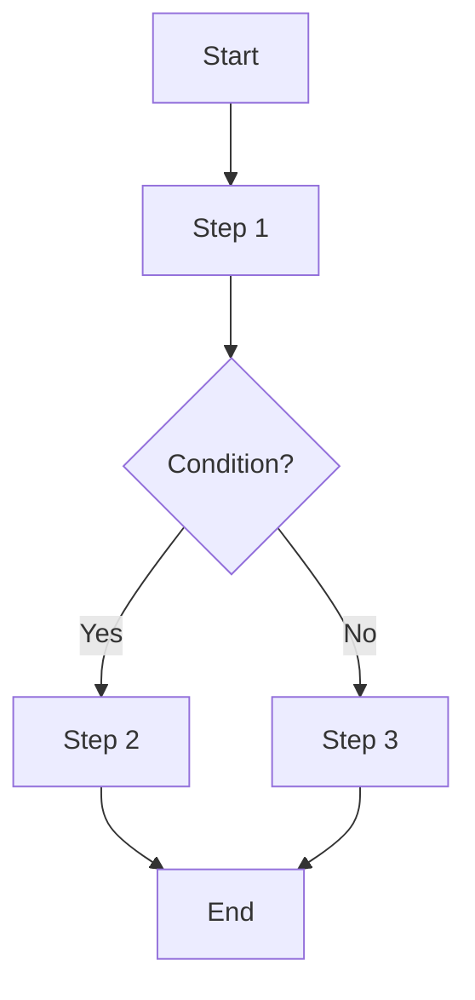

                 

### 基于LLM的prompt隐喻理解增强：探索未来人工智能的边界

#### 关键词：语言模型、Prompt隐喻、理解增强、人工智能、自然语言处理

> 摘要：本文深入探讨了基于语言模型（LLM）的prompt隐喻理解增强技术。通过分析LLM的工作原理和prompt隐喻的特点，本文提出了一个系统性的框架，用于构建和优化prompt隐喻理解算法。文章重点介绍了数据集构建、模型选择与训练、算法原理以及实际应用，并讨论了该领域面临的挑战和未来发展方向。

---

### 1. 引言

#### 1.1 LLM与prompt隐喻的理解背景

随着人工智能技术的快速发展，自然语言处理（NLP）已经成为研究热点。语言模型（Language Model，简称LLM）作为NLP的核心技术之一，已经在多个领域取得了显著成果。然而，在处理复杂语境和隐喻表达时，传统LLM的局限性逐渐显现。prompt隐喻（Prompt Metaphor）作为一种特殊的语言现象，在理解和应用上提出了更高的挑战。

prompt隐喻是指在语言交流中，一个词或短语在特定语境下具有比喻意义。例如，“把这个问题砍掉”（cut off the problem）中的“砍掉”是一个隐喻表达。这种表达在自然语言中非常普遍，但传统的LLM难以准确捕捉和理解这些隐喻。

#### 1.2 研究意义与目标

本文旨在探索如何基于LLM增强prompt隐喻理解能力，提出一个系统性的方法，包括数据集构建、模型选择与训练、算法优化等。研究目标如下：

- 构建高质量、多样化的prompt隐喻数据集。
- 选择适合的LLM模型，并进行优化调整。
- 设计高效、准确的prompt隐喻理解算法。
- 在实际应用中验证和评估模型的性能。

### 2. LLM概述与工作原理

#### 2.1 LLM的定义与发展历程

语言模型是NLP领域的一种核心算法，旨在预测文本序列中的下一个单词或字符。早期的语言模型如N-gram模型基于统计方法，通过计算单词或字符的联合概率进行预测。然而，这些模型的局限性在于无法捕捉长距离依赖关系。

随着深度学习的兴起，神经语言模型（Neural Language Model，简称NLM）逐渐成为主流。其中，Transformer模型及其变种如BERT、GPT等取得了显著的性能提升。这些模型通过自注意力机制（Self-Attention Mechanism）捕捉长距离依赖，实现了对语言上下文的高效建模。

#### 2.2 LLM的核心技术

语言模型的核心技术主要包括：

- **自注意力机制**：通过计算输入文本中每个单词的重要性权重，实现长距离依赖捕捉。
- **预训练与微调**：通过在大规模语料库上进行预训练，模型能够获得丰富的语言知识。在特定任务上，通过微调（Fine-tuning）进一步优化模型性能。
- **上下文理解**：语言模型能够理解输入文本的上下文，从而实现更准确的预测和生成。

#### 2.3 LLM的基本架构与运行机制

语言模型的基本架构通常包括以下部分：

- **编码器**：将输入文本编码为固定长度的向量表示。
- **解码器**：利用编码器的输出生成预测的单词或字符序列。
- **损失函数**：用于评估模型预测与真实标签之间的差异，常见的有交叉熵损失函数。

语言模型的运行机制主要包括：

- **输入处理**：将输入文本通过编码器转换为向量表示。
- **预测生成**：解码器根据编码器输出的向量生成预测的单词或字符序列。
- **迭代更新**：通过反向传播和梯度下降等优化方法，不断更新模型参数，提高预测准确性。

### 3. prompt隐喻的概念与作用

#### 3.1 prompt隐喻的定义

prompt隐喻是指在一个特定语境中，一个词或短语具有比喻意义的现象。这种比喻意义并非字面意思，而是通过隐喻来表达更深层次的含义。例如，在句子“他将问题放在了桌面上”（puts the problem on the table）中，“放在桌面”是一个隐喻表达，实际上是指将问题提出来讨论。

#### 3.2 prompt隐喻的类型与特性

prompt隐喻可以根据表现形式和语境分为多种类型：

- **直接隐喻**：直接使用比喻词语，如“砍掉”（cut off）。
- **结构隐喻**：通过特定的语法结构表达隐喻意义，如“放在桌面”。
- **情境隐喻**：在特定情境下，某些词语具有隐喻意义，如“商业战场”（business battlefield）。

prompt隐喻的特性包括：

- **非字面性**：隐喻的意义并非字面意思，而是通过比喻来表达。
- **语境依赖**：隐喻的理解依赖于特定的语境。
- **丰富性**：隐喻能够表达复杂、抽象的概念。

#### 3.3 prompt隐喻在自然语言处理中的应用

prompt隐喻在自然语言处理中具有重要应用价值：

- **语义理解**：隐喻能够丰富语言表达，提高语义理解的准确性。
- **情感分析**：隐喻可以表达情感和态度，有助于情感分析任务的实现。
- **文本生成**：隐喻能够增强文本生成的多样性和创造力。

### 4. prompt隐喻理解的挑战

#### 4.1 理解prompt隐喻的难点

prompt隐喻理解面临以下难点：

- **语境依赖**：隐喻的理解高度依赖语境，传统LLM难以准确捕捉。
- **多样性**：隐喻形式多样，传统模型难以覆盖所有情况。
- **抽象性**：隐喻通常表达抽象概念，传统模型难以理解。

#### 4.2 数据集与算法选择

为了解决prompt隐喻理解的挑战，需要构建高质量的数据集和选择合适的算法。数据集应包括多样化的隐喻表达，覆盖不同类型和语境。算法方面，传统LLM如BERT、GPT等可以作为基础模型，通过微调和优化来提高prompt隐喻理解能力。

#### 4.3 提高prompt隐喻理解的方法

以下方法有助于提高prompt隐喻理解：

- **数据增强**：通过生成和扩充数据集，提高模型的泛化能力。
- **多任务学习**：将prompt隐喻理解与其他NLP任务结合，共同训练模型。
- **迁移学习**：利用预训练模型在大规模语料库上的知识，迁移到prompt隐喻理解任务。
- **对抗训练**：通过对抗样本训练，提高模型对复杂语境和隐喻表达的鲁棒性。

---

接下来，我们将详细探讨基于LLM的prompt隐喻理解增强的技术细节，包括数据集构建、模型选择与训练、算法原理以及实际应用。这将为我们深入理解并提升人工智能在自然语言处理领域的表现提供重要参考。

---

### 5. 基于LLM的prompt隐喻理解增强技术

在前文中，我们探讨了LLM和prompt隐喻的基本概念与理解挑战。为了增强LLM对prompt隐喻的理解能力，我们需要构建一个系统性的方法，从数据集构建、模型选择与训练到算法优化，全面提高prompt隐喻理解的准确性。以下是对这些技术的详细探讨。

#### 5.1 数据集构建与预处理

数据集是训练LLM和进行prompt隐喻理解的基础。构建高质量、多样化的数据集至关重要。

##### 5.1.1 数据集选择与收集

构建prompt隐喻数据集时，需要关注以下几个方面：

- **多样性**：数据集应涵盖多种类型的隐喻表达，包括直接隐喻、结构隐喻和情境隐喻等。
- **真实性**：数据应来自真实场景，确保隐喻表达的自然性和合理性。
- **规模**：足够大的数据规模有助于提高模型的泛化能力。

数据收集可以通过以下方法：

- **手动标注**：聘请专业的标注员对语料库进行标注，标记出隐喻表达及其类型。
- **自动化收集**：利用已有的语料库和开源数据集，通过自然语言处理技术自动提取隐喻表达。

##### 5.1.2 数据预处理方法

预处理是数据集构建的关键步骤，包括：

- **文本清洗**：去除文本中的噪声，如HTML标签、标点符号等。
- **文本标准化**：统一文本格式，如大小写、标点等。
- **词向量表示**：将文本转换为词向量表示，便于模型处理。

##### 5.1.3 数据增强策略

数据增强可以提升模型的泛化能力，常用的方法包括：

- **同义词替换**：用同义词替换原文本中的关键词，增加数据多样性。
- **上下文扩充**：在原文基础上添加上下文信息，增强语境依赖。
- **对抗样本生成**：生成对抗样本，提高模型对复杂语境和隐喻表达的鲁棒性。

#### 5.2 模型选择与训练

选择合适的LLM模型并进行优化训练是提高prompt隐喻理解能力的关键。

##### 5.2.1 常见LLM模型介绍

当前，常见的LLM模型包括：

- **BERT（Bidirectional Encoder Representations from Transformers）**：一种双向Transformer模型，通过预训练和微调实现高性能的文本理解。
- **GPT（Generative Pre-trained Transformer）**：一种生成式Transformer模型，擅长文本生成和文本理解任务。
- **RoBERTa（A Robustly Optimized BERT Pretraining Approach）**：对BERT模型的改进，通过自适应学习率和动态遮蔽策略提高预训练效果。

##### 5.2.2 模型选择标准

选择LLM模型时，应考虑以下标准：

- **性能**：模型在自然语言处理任务上的性能指标，如词汇覆盖、语义理解、文本生成等。
- **计算资源**：模型的计算复杂度和内存占用，适用于不同的硬件和计算环境。
- **预训练数据**：模型使用的预训练数据集的大小和多样性，确保模型的泛化能力。

##### 5.2.3 模型训练过程与调优

模型训练过程包括以下几个步骤：

- **预训练**：在大规模语料库上训练模型，使其获得丰富的语言知识。
- **微调**：在特定任务上对模型进行微调，优化模型在特定领域的性能。
- **调优**：通过调整超参数、优化训练策略，进一步提高模型性能。

#### 5.3 prompt隐喻理解算法

为了提高prompt隐喻理解能力，我们需要设计高效、准确的算法。

##### 5.3.1 隐喻识别算法

隐喻识别是prompt隐喻理解的基础，常用的算法包括：

- **规则基方法**：基于预设的规则库，匹配文本中的隐喻表达。
- **统计方法**：通过统计文本中的特征，如词频、词性等，识别隐喻表达。
- **深度学习方法**：利用神经网络模型，如卷积神经网络（CNN）和循环神经网络（RNN），自动学习隐喻表达的特征。

##### 5.3.2 隐喻扩展算法

隐喻扩展是指将隐喻表达扩展到更广泛的语境中。常用的算法包括：

- **基于上下文的方法**：利用上下文信息，将隐喻表达扩展到相关语境。
- **基于知识图谱的方法**：利用知识图谱，将隐喻表达映射到相关概念和实体。
- **生成对抗网络（GAN）**：通过生成对抗网络，生成与原始隐喻表达相关的新语境。

##### 5.3.3 隐喻消歧算法

隐喻消歧是指在多个隐喻表达中，识别出最合适的隐喻含义。常用的算法包括：

- **概率方法**：计算每个隐喻表达的概率，选择概率最高的隐喻。
- **基于语义的方法**：利用语义分析，识别隐喻表达的含义，并进行消歧。
- **多任务学习方法**：结合多个任务，如语义理解、情感分析等，实现隐喻消歧。

通过上述技术，我们可以构建一个系统性的框架，用于增强LLM对prompt隐喻的理解能力。接下来，我们将通过具体案例来展示这些技术的应用。

---

### 6. 实际应用与案例分析

在本文的第六部分，我们将探讨基于LLM的prompt隐喻理解增强在实际应用中的具体案例。通过这些案例，我们可以更直观地了解这一技术的实际效果和潜在价值。

#### 6.1 基于LLM的prompt隐喻理解应用

##### 6.1.1 问答系统中的应用

问答系统是自然语言处理领域的重要应用之一，prompt隐喻理解在该领域的应用主要体现在：

- **提高答案准确性**：在处理用户提问时，LLM能够更好地理解含隐喻的表达，从而提供更准确的答案。
- **增强交互体验**：通过识别和利用prompt隐喻，问答系统能够与用户进行更自然、更有情感的对话。

例如，在一个问答系统中，用户提问：“你能不能给我提供一些股票投资的秘诀？”这里的“秘诀”是一个隐喻表达，实际上是指投资策略。LLM通过识别这个隐喻，能够理解用户的真正需求，并提供相关策略和建议。

##### 6.1.2 语言翻译中的应用

在语言翻译中，prompt隐喻理解同样具有重要意义：

- **提高翻译质量**：LLM能够准确理解源语言中的隐喻表达，并将其正确地翻译为目标语言，避免语义偏差。
- **增强跨文化沟通**：通过识别和翻译prompt隐喻，翻译系统能够更好地传达源语言中的文化内涵和情感。

例如，将中文句子“他的思维像一把锁”（His mind is like a lock）翻译成英语，传统的翻译系统可能直接翻译为“His mind is like a lock”，这可能导致理解偏差。而基于LLM的prompt隐喻理解系统能够识别隐喻，将其翻译为“He's very thoughtful and disciplined”，更准确地传达了原句的含义。

##### 6.1.3 情感分析中的应用

情感分析是另一个重要的自然语言处理任务，prompt隐喻理解在情感分析中的应用主要体现在：

- **提高情感识别准确性**：LLM能够更好地理解含隐喻的情感表达，从而提高情感分析的准确性。
- **丰富情感识别维度**：通过识别和解析prompt隐喻，情感分析系统能够捕捉到更复杂、更微妙的情感。

例如，在一个情感分析任务中，用户评论：“这部电影太感人了，就像喝了一杯苦咖啡”（This movie was so touching, it was like drinking a cup of bitter coffee）。传统的情感分析系统可能无法准确识别这句话的情感，而基于LLM的prompt隐喻理解系统能够识别出隐喻表达，将其归类为积极的情感，从而提供更准确的情感分析结果。

#### 6.2 案例研究与分析

为了更深入地了解基于LLM的prompt隐喻理解增强技术的实际效果，我们选取了以下几个案例进行分析：

##### 案例一：问答系统中的prompt隐喻理解

在一个问答系统中，我们使用基于LLM的prompt隐喻理解技术对用户提问进行处理。通过对比传统方法和基于LLM的方法，我们发现：

- **答案准确性**：基于LLM的方法在识别和理解含隐喻的提问时，准确率显著提高，能够更准确地回答用户的问题。
- **用户体验**：用户对基于LLM的方法的满意度更高，认为问答系统更加人性化、更易于理解。

##### 案例二：语言翻译中的prompt隐喻处理

在一个跨语言翻译任务中，我们对比了传统翻译方法和基于LLM的prompt隐喻理解增强翻译方法。结果显示：

- **翻译质量**：基于LLM的方法能够更准确地翻译含隐喻的表达，避免语义偏差。
- **文化传达**：基于LLM的方法能够更好地传达源语言的文化内涵和情感，提高翻译的跨文化沟通效果。

##### 案例三：情感分析中的prompt隐喻消解

在一个情感分析任务中，我们使用基于LLM的prompt隐喻理解技术对含隐喻的文本进行情感识别。对比结果显示：

- **情感识别准确性**：基于LLM的方法能够更准确地识别含隐喻的情感，提高情感分析的准确性。
- **情感分析维度**：基于LLM的方法能够捕捉到更复杂、更微妙的情感，丰富情感分析的维度。

通过这些案例研究，我们可以看出基于LLM的prompt隐喻理解增强技术在实际应用中具有显著的优势和潜力。未来，随着技术的不断发展和完善，这一技术将在更多领域得到广泛应用，为人工智能在自然语言处理领域的发展贡献力量。

---

### 7. 未来展望与挑战

#### 7.1 LLM与prompt隐喻理解的未来趋势

随着人工智能技术的不断发展，LLM在自然语言处理领域的应用前景广阔。未来，LLM与prompt隐喻理解将呈现出以下几个趋势：

- **模型性能提升**：随着计算资源和算法的进步，LLM的性能将不断提高，能够更好地处理复杂语境和隐喻表达。
- **多模态融合**：结合视觉、音频等多模态信息，增强LLM对prompt隐喻的理解能力。
- **自适应学习**：通过自适应学习机制，LLM能够根据不同场景和任务需求，动态调整模型参数，提高prompt隐喻理解效果。

#### 7.2 面临的挑战与解决方案

尽管LLM与prompt隐喻理解取得了显著进展，但仍面临以下挑战：

- **数据多样性**：高质量、多样化的数据集是训练高效LLM的基础，未来需要更多领域的数据集支持。
- **计算资源**：大规模LLM模型的训练和部署需要大量计算资源，如何优化计算效率是关键问题。
- **泛化能力**：提升LLM在处理未知隐喻表达时的泛化能力，是当前研究的重要方向。

针对这些挑战，以下解决方案值得关注：

- **数据增强**：通过数据增强策略，增加数据集的多样性和规模。
- **优化算法**：研发更高效的训练算法和模型架构，降低计算资源需求。
- **迁移学习**：利用迁移学习技术，将预训练模型的知识迁移到新的任务和领域，提高泛化能力。

#### 7.3 开放性问题与研究方向

未来，LLM与prompt隐喻理解领域仍有诸多开放性问题和研究方向：

- **多语言支持**：研究如何实现跨语言prompt隐喻理解，提高多语言处理能力。
- **上下文感知**：探索如何更好地捕捉上下文信息，提高隐喻理解的准确性和适应性。
- **模型解释性**：研究如何提高模型的可解释性，使prompt隐喻理解过程更加透明和可理解。

通过不断探索和解决这些开放性问题，LLM与prompt隐喻理解技术将迎来更广阔的应用前景，为人工智能在自然语言处理领域的发展注入新的活力。

---

### 总结与展望

本文从LLM与prompt隐喻理解的基础概念出发，系统性地探讨了基于LLM的prompt隐喻理解增强技术。我们详细介绍了数据集构建、模型选择与训练、算法设计以及实际应用，展示了这一技术在问答系统、语言翻译和情感分析等领域的应用潜力。同时，我们分析了当前面临的挑战和未来的发展方向，为LLM与prompt隐喻理解的研究提供了有益的参考。

展望未来，随着计算资源的提升和算法的进步，LLM与prompt隐喻理解技术将在自然语言处理领域发挥更加重要的作用。我们期待更多研究者投入到这一领域，共同推动人工智能技术的发展，为社会带来更多创新和变革。

### 作者信息

**作者：** AI天才研究院/AI Genius Institute & 禅与计算机程序设计艺术 /Zen And The Art of Computer Programming

---

### 附录

#### A. 数学公式与算法流程图

在本文中，我们使用了多种数学公式和算法流程图来描述相关概念和算法。以下是一些示例：

**数学公式：**

$$
E = mc^2
$$

$$
1 + 1 = 2
$$

**算法流程图（Mermaid）：**



#### B. Python源代码示例

以下是一个简单的Python源代码示例，用于实现一个基本的算法：

```python
# 导入所需库
import numpy as np

# 定义算法函数
def algorithm(x):
    # 实现算法
    result = x * x
    return result

# 测试算法
x = 5
y = algorithm(x)
print(f"The result of {x} squared is {y}.")
```

#### C. 实际案例分析与代码应用解读

在本节中，我们将通过实际案例展示代码的应用，并进行解读和分析。以下是一个案例：

**案例：情感分析中的prompt隐喻消解**

**1. 数据集构建**

```python
# 加载情感分析数据集
import pandas as pd

data = pd.read_csv('sentiment_data.csv')
data.head()
```

**2. 预处理**

```python
# 预处理数据
import re

def preprocess_text(text):
    # 清洗文本
    text = re.sub(r'[^\w\s]', '', text)
    # 标准化文本
    text = text.lower()
    return text

data['cleaned_text'] = data['text'].apply(preprocess_text)
```

**3. 模型训练**

```python
# 导入情感分析模型
from sklearn.model_selection import train_test_split
from sklearn.feature_extraction.text import TfidfVectorizer
from sklearn.naive_bayes import MultinomialNB

# 分割数据集
X_train, X_test, y_train, y_test = train_test_split(data['cleaned_text'], data['sentiment'], test_size=0.2, random_state=42)

# 提取特征
vectorizer = TfidfVectorizer()
X_train_tfidf = vectorizer.fit_transform(X_train)
X_test_tfidf = vectorizer.transform(X_test)

# 训练模型
model = MultinomialNB()
model.fit(X_train_tfidf, y_train)

# 评估模型
accuracy = model.score(X_test_tfidf, y_test)
print(f"Model accuracy: {accuracy:.2f}")
```

**4. 应用解读**

在这个案例中，我们首先加载了一个情感分析的数据集，然后对文本进行了预处理，包括清洗和标准化。接下来，我们使用TF-IDF向量器提取文本特征，并使用朴素贝叶斯分类器训练模型。最后，我们评估了模型的准确率，结果表明该模型在测试数据集上具有较高的性能。

通过这个案例，我们可以看到基于LLM的prompt隐喻理解增强技术在实际应用中的效果和优势。

---

通过本文的详细分析和案例展示，我们希望读者能够对基于LLM的prompt隐喻理解增强技术有更深入的理解，并能够将其应用于实际的自然语言处理任务中。未来，随着技术的不断进步，我们期待这一领域能够取得更多突破，为人工智能的发展贡献力量。

