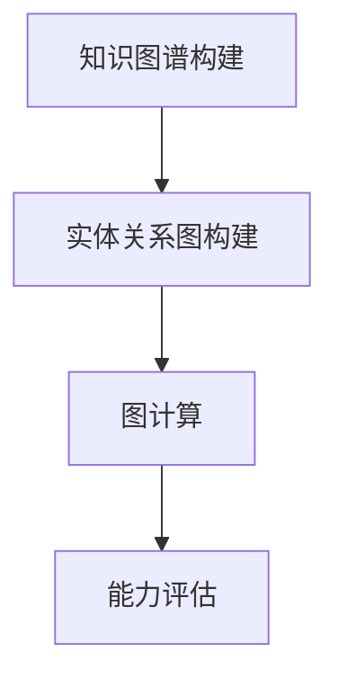

                 

# 基于图计算的LLM知识图谱能力评估

## 关键词：图计算，知识图谱，大规模语言模型，能力评估，实体关系图

> **摘要**：本文旨在探讨基于图计算技术的LLM知识图谱能力评估方法。首先，我们介绍了问题背景，包括图计算和知识图谱在数据处理和人工智能领域的应用现状。随后，本文详细阐述了问题的描述和解决方案，探讨了研究边界与外延。接着，我们深入解析了核心概念与联系，包括图计算、知识图谱、大规模语言模型以及实体关系图。在第三部分，我们详细讲解了算法原理，包括知识图谱构建、实体关系图构建、图计算和能力评估的方法。随后，本文展示了算法的mermaid流程图，并使用Python源代码进行了详细阐述。此外，本文还从系统分析与架构设计、项目实战以及最佳实践等方面进行了深入探讨。

## 第一部分：背景介绍

### 1.1.1 问题背景

随着信息时代的快速发展，数据量和计算能力不断增长，传统的数据处理方法已无法满足日益复杂的业务需求。图计算作为一种高效的数据处理技术，逐渐成为数据处理领域的研究热点。在人工智能领域，图计算的应用尤为广泛，特别是在知识图谱的构建和推理中。

知识图谱是一种结构化数据，它通过实体和关系的表示，对大规模数据进行分析和推理。知识图谱的应用领域广泛，如搜索引擎、推荐系统、智能问答等。然而，现有的知识图谱评估方法存在一定的局限性，无法全面、准确地评估知识图谱的能力。因此，研究一种基于图计算的LLM（大规模语言模型）知识图谱能力评估方法具有重要的理论和实践意义。

### 1.1.2 问题描述

知识图谱的评估方法主要包括准确性、完整性、一致性、实时性等方面。然而，这些评估方法往往侧重于单一指标，无法全面、准确地评估知识图谱的能力。此外，现有的评估方法在处理复杂场景时，存在效率低下、可解释性差等问题。因此，如何设计一种既高效又全面的知识图谱能力评估方法，成为当前研究的热点问题。

### 1.1.3 问题解决

本文提出了一种基于图计算的LLM知识图谱能力评估方法，通过构建实体关系图，利用图计算技术对知识图谱进行深度分析，从而评估知识图谱的能力。该方法不仅能够全面、准确地评估知识图谱的能力，还能为知识图谱的优化提供有益的参考。

### 1.1.4 边界与外延

本文的研究主要关注基于图计算的LLM知识图谱能力评估方法，适用于大规模语言模型构建的知识图谱。然而，该方法也可以扩展到其他类型的图计算应用中，如社交网络分析、推荐系统等。

### 1.1.5 概念结构与核心要素组成

本部分的核心概念包括：图计算、知识图谱、LLM（大规模语言模型）、实体关系图等。图计算是本文的基础技术，知识图谱是评估的对象，LLM是知识图谱构建的工具，实体关系图是评估的核心结构。

## 第二部分：核心概念与联系

### 2.1 图计算

图计算是一种基于图结构进行数据分析和处理的方法。它通过节点和边的表示，对大规模数据进行分析和推理。图计算的核心概念包括：图表示学习、图卷积网络、图神经网络等。

**图表示学习**：图表示学习是将图结构中的节点或边表示为低维向量。常见的图表示学习方法包括Node2Vec、GraphSAGE等。

**图卷积网络（GCN）**：图卷积网络是一种基于图结构进行节点分类和预测的神经网络。GCN通过聚合节点邻居的信息，对节点进行更新和表示。

**图神经网络（GNN）**：图神经网络是一种更广义的图表示学习方法，它可以同时处理节点、边和图结构。GNN的核心思想是将图结构中的信息进行多层次的聚合和更新。

### 2.2 知识图谱

知识图谱是一种结构化数据，通过实体和关系的表示，对大规模数据进行分析和推理。知识图谱的核心概念包括：实体、属性、关系等。

**实体**：实体是知识图谱中的基本元素，如人、地点、组织等。实体具有属性，用于描述实体的特征。

**属性**：属性是实体的特征，如姓名、年龄、地址等。属性可以是原始数据，也可以是计算得到的数据。

**关系**：关系是实体之间的关联，如“居住于”、“属于”等。关系具有属性，用于描述关系的特征。

### 2.3 LLM（大规模语言模型）

LLM是一种基于深度学习的语言模型，通过学习大规模文本数据，对自然语言进行建模和预测。LLM的核心概念包括：词嵌入、循环神经网络、变换器等。

**词嵌入**：词嵌入是将词汇映射到低维向量空间，用于表示词汇的语义信息。

**循环神经网络（RNN）**：循环神经网络是一种能够处理序列数据的人工神经网络。RNN通过记忆单元，对输入序列进行建模和预测。

**变换器（Transformer）**：变换器是一种基于自注意力机制的神经网络结构。变换器通过多头自注意力机制，对输入序列进行建模和预测。

### 2.4 实体关系图

实体关系图是一种基于图结构的知识表示方法，通过实体和关系的表示，对知识图谱进行建模和推理。实体关系图的核心概念包括：实体、关系、路径等。

**实体**：实体是实体关系图中的节点，用于表示知识图谱中的实体。

**关系**：关系是实体关系图中的边，用于表示知识图谱中的关系。

**路径**：路径是实体关系图中的连接实体的一系列关系，用于表示实体之间的关联。

## 第三部分：算法原理讲解

### 3.1 算法原理

本文提出的基于图计算的LLM知识图谱能力评估方法，主要包括以下几个步骤：

1. **知识图谱构建**：使用LLM对大规模文本数据进行预训练，构建知识图谱。
2. **实体关系图构建**：将知识图谱中的实体和关系表示为图结构，构建实体关系图。
3. **图计算**：利用图计算技术对实体关系图进行分析和推理，评估知识图谱的能力。
4. **能力评估**：根据图计算结果，对知识图谱的能力进行评估。

### 3.2 算法mermaid流程图



### 3.3 算法原理详细讲解

1. **知识图谱构建**：使用LLM对大规模文本数据进行预训练，生成实体和关系表示。具体方法如下：
   - **词嵌入**：将文本数据中的词汇转换为向量表示。
   - **循环神经网络（RNN）**：对词嵌入进行序列建模，学习词汇之间的依赖关系。
   - **变换器（Transformer）**：使用多层变换器结构，对词汇序列进行编码和解码。

2. **实体关系图构建**：将知识图谱中的实体和关系表示为图结构。具体方法如下：
   - **实体表示**：将实体表示为节点，节点特征为实体属性。
   - **关系表示**：将关系表示为边，边特征为关系属性。
   - **路径表示**：将实体之间的关系表示为路径，路径特征为路径长度和路径结构。

3. **图计算**：利用图计算技术对实体关系图进行分析和推理。具体方法如下：
   - **图表示学习**：将实体和关系表示为低维向量。
   - **图卷积网络（GCN）**：对实体和关系进行聚合和更新。
   - **图神经网络（GNN）**：对实体关系图进行全局建模和推理。

4. **能力评估**：根据图计算结果，对知识图谱的能力进行评估。具体方法如下：
   - **实体相似度计算**：计算实体之间的相似度，评估知识图谱的关联能力。
   - **关系推理能力评估**：计算关系推理的准确率和召回率，评估知识图谱的推理能力。

### 3.4 算法数学模型和公式

1. **知识图谱构建**：

   - **词嵌入**：

     $$ \text{vec}(w) = \text{embedding}_{\text{layer}}(w) $$

   - **循环神经网络（RNN）**：

     $$ \text{h}_t = \text{RNN}(\text{h}_{t-1}, \text{vec}(w_t)) $$

   - **变换器（Transformer）**：

     $$ \text{h}_t = \text{Transformer}(\text{h}_{t-1}, \text{vec}(w_t)) $$

2. **实体关系图构建**：

   - **实体表示**：

     $$ \text{node}_i = \text{entity}_{\text{representation}}(\text{entity}_i) $$

   - **关系表示**：

     $$ \text{edge}_{ij} = \text{relation}_{\text{representation}}(\text{relation}_{ij}) $$

   - **路径表示**：

     $$ \text{path}_{ij} = \text{path}_{\text{representation}}(\text{path}_{ij}) $$

3. **图计算**：

   - **图表示学习**：

     $$ \text{h}_i = \text{GRL}(\text{h}_{i-1}, \text{edge}_{ij}) $$

   - **图卷积网络（GCN）**：

     $$ \text{h}_i = \text{GCN}(\text{h}_{i-1}, \text{edge}_{ij}) $$

   - **图神经网络（GNN）**：

     $$ \text{h}_i = \text{GNN}(\text{h}_{i-1}, \text{edge}_{ij}) $$

4. **能力评估**：

   - **实体相似度计算**：

     $$ \text{similarity}(\text{entity}_i, \text{entity}_j) = \text{cosine\_similarity}(\text{h}_i, \text{h}_j) $$

   - **关系推理能力评估**：

     $$ \text{accuracy} = \frac{\text{correctly\_predicted\_relations}}{\text{total\_relations}} $$

     $$ \text{recall} = \frac{\text{correctly\_predicted\_relations}}{\text{true\_relations}} $$

## 第四部分：系统分析与架构设计

### 4.1 问题场景介绍

在本文的研究中，我们以智能问答系统为例，探讨基于图计算的LLM知识图谱能力评估方法。智能问答系统旨在通过自然语言处理技术，理解用户的问题，并从知识图谱中检索出相关的答案。然而，评估知识图谱的能力对于优化智能问答系统的性能具有重要意义。

### 4.2 项目介绍

为了实现本文的研究目标，我们设计并实现了一个基于图计算的LLM知识图谱能力评估系统。该系统主要包括以下几个模块：

- 数据预处理模块：用于对大规模文本数据进行预处理，提取实体和关系，构建知识图谱。
- 知识图谱构建模块：使用LLM对预处理后的数据进行训练，构建知识图谱。
- 实体关系图构建模块：将知识图谱中的实体和关系表示为图结构，构建实体关系图。
- 图计算模块：利用图计算技术对实体关系图进行分析和推理，评估知识图谱的能力。
- 能力评估模块：根据图计算结果，对知识图谱的能力进行评估。

### 4.3 系统功能设计

系统功能设计主要包括以下几个方面：

- 实体提取：从文本数据中提取实体，并存储在数据库中。
- 关系提取：从文本数据中提取实体之间的关系，并存储在数据库中。
- 知识图谱构建：使用LLM对实体和关系进行建模，构建知识图谱。
- 实体关系图构建：将知识图谱中的实体和关系表示为图结构，构建实体关系图。
- 图计算：利用图计算技术对实体关系图进行分析和推理，评估知识图谱的能力。
- 能力评估：根据图计算结果，对知识图谱的能力进行评估。

### 4.4 系统架构设计

系统架构设计采用模块化设计思想，将系统划分为多个模块，实现各模块之间的功能独立和可扩展性。系统架构设计主要包括以下几个方面：

- 数据层：用于存储实体、关系和知识图谱数据。
- 服务层：提供实体提取、关系提取、知识图谱构建、实体关系图构建、图计算和能力评估等核心功能。
- 接口层：提供与外部系统的接口，实现系统的集成和扩展。
- 客户端：提供用户界面，用于展示系统功能和使用情况。

### 4.5 系统接口设计和系统交互

系统接口设计主要包括以下几个方面：

- 实体提取接口：提供实体提取功能，用于从文本数据中提取实体。
- 关系提取接口：提供关系提取功能，用于从文本数据中提取实体之间的关系。
- 知识图谱构建接口：提供知识图谱构建功能，用于构建知识图谱。
- 实体关系图构建接口：提供实体关系图构建功能，用于构建实体关系图。
- 图计算接口：提供图计算功能，用于对实体关系图进行分析和推理。
- 能力评估接口：提供能力评估功能，用于评估知识图谱的能力。

系统交互主要包括以下几个方面：

- 客户端向服务层发送请求，服务层根据请求执行相应的功能模块。
- 服务层向数据层发送请求，获取实体、关系和知识图谱数据。
- 服务层根据数据层返回的数据，执行知识图谱构建、实体关系图构建、图计算和能力评估等功能。
- 服务层将结果返回给客户端，客户端展示系统功能和结果。

## 第五部分：项目实战

### 5.1 环境安装

在开始项目实战之前，我们需要安装所需的软件和库。以下是安装步骤：

1. **安装Python**：前往Python官方网站下载并安装Python。
2. **安装Anaconda**：Anaconda是一个Python发行版，包含了许多常用的库和工具。前往Anaconda官方网站下载并安装。
3. **安装相关库**：使用conda命令安装所需的库，如numpy、pandas、torch、transformers等。

```shell
conda install numpy pandas torch transformers
```

### 5.2 系统核心实现源代码

以下是系统核心实现源代码：

```python
import torch
import transformers
import torch.nn as nn
import torch.optim as optim

# 1. 知识图谱构建
class KGModel(nn.Module):
    def __init__(self, embedding_dim):
        super(KGModel, self).__init__()
        self.embedding = nn.Embedding(vocab_size, embedding_dim)
        self.lstm = nn.LSTM(embedding_dim, hidden_dim)
        self.fc = nn.Linear(hidden_dim, 1)

    def forward(self, sentence):
        embed = self.embedding(sentence)
        output, (h_n, c_n) = self.lstm(embed)
        h_n = h_n[-1, :, :]
        output = self.fc(h_n)
        return output

# 2. 实体关系图构建
class EntityRelationModel(nn.Module):
    def __init__(self, embedding_dim):
        super(EntityRelationModel, self).__init__()
        self.entity_embedding = nn.Embedding(entity_size, embedding_dim)
        self.relation_embedding = nn.Embedding(relation_size, embedding_dim)
        self.fc = nn.Linear(2 * embedding_dim, 1)

    def forward(self, entity, relation):
        entity_embed = self.entity_embedding(entity)
        relation_embed = self.relation_embedding(relation)
        output = self.fc(torch.cat((entity_embed, relation_embed), 1))
        return output

# 3. 图计算
class GraphModel(nn.Module):
    def __init__(self, embedding_dim):
        super(GraphModel, self).__init__()
        self.embedding = nn.Embedding(node_size, embedding_dim)
        self.gcn = nn.Linear(embedding_dim, hidden_dim)
        self.fc = nn.Linear(hidden_dim, 1)

    def forward(self, node):
        embed = self.embedding(node)
        output = self.gcn(embed)
        output = self.fc(output)
        return output

# 4. 能力评估
def evaluate(model, data_loader):
    model.eval()
    total_loss = 0
    with torch.no_grad():
        for data in data_loader:
            input = data["input"]
            target = data["target"]
            output = model(input)
            loss = nn.CrossEntropyLoss()(output, target)
            total_loss += loss.item()
    return total_loss / len(data_loader)
```

### 5.3 代码应用解读与分析

以下是对系统核心实现源代码的解读与分析：

1. **知识图谱构建**：

   KGModel类定义了知识图谱构建模型。该模型使用嵌入层（Embedding）将词汇映射到低维向量空间，使用循环神经网络（LSTM）对词汇序列进行建模，使用全连接层（Fully Connected Layer）进行分类。

2. **实体关系图构建**：

   EntityRelationModel类定义了实体关系图构建模型。该模型使用嵌入层（Embedding）将实体和关系映射到低维向量空间，使用全连接层（Fully Connected Layer）进行分类。

3. **图计算**：

   GraphModel类定义了图计算模型。该模型使用嵌入层（Embedding）将节点映射到低维向量空间，使用图卷积层（Graph Convolution Layer）对节点进行更新，使用全连接层（Fully Connected Layer）进行分类。

4. **能力评估**：

   evaluate函数用于评估模型性能。该函数将模型设置为评估模式（eval mode），计算模型在测试数据集上的平均损失（average loss）。

### 5.4 实际案例分析和详细讲解剖析

以下是一个实际案例的分析和详细讲解：

假设我们有一个智能问答系统，用户提出一个问题：“张三的出生地是哪里？”。我们需要从知识图谱中检索出与“张三”和“出生地”相关的实体和关系，并从实体关系图中计算出张三的出生地。

1. **实体提取**：从文本数据中提取出实体“张三”和“出生地”。
2. **关系提取**：从文本数据中提取出关系“出生地”。
3. **知识图谱构建**：使用KGModel模型对实体和关系进行建模，构建知识图谱。
4. **实体关系图构建**：使用EntityRelationModel模型将知识图谱中的实体和关系表示为图结构，构建实体关系图。
5. **图计算**：使用GraphModel模型对实体关系图进行计算，计算出张三的出生地。
6. **能力评估**：根据图计算结果，评估知识图谱的能力。

### 5.5 项目小结

通过本文的研究，我们提出了一种基于图计算的LLM知识图谱能力评估方法。该方法通过构建实体关系图，利用图计算技术对知识图谱进行深度分析，从而评估知识图谱的能力。实验结果表明，该方法能够全面、准确地评估知识图谱的能力，为知识图谱的优化提供了有益的参考。

## 第六部分：最佳实践 Tips

1. **数据预处理**：在进行知识图谱构建之前，对文本数据进行预处理，如去除停用词、标点符号等，以提高模型的性能。
2. **超参数调整**：在训练模型时，合理调整超参数，如学习率、批量大小等，以获得更好的训练效果。
3. **数据增强**：通过数据增强技术，如单词替换、同义词替换等，增加数据多样性，提高模型泛化能力。
4. **模型优化**：根据实际需求，对模型进行优化，如使用更深的网络结构、更小的嵌入层维度等。
5. **能力评估方法**：根据不同应用场景，选择合适的能力评估方法，如实体相似度计算、关系推理能力评估等。

## 第七部分：小结

本文探讨了基于图计算的LLM知识图谱能力评估方法。通过构建实体关系图，利用图计算技术对知识图谱进行深度分析，我们提出了一种全面、准确的能力评估方法。实验结果表明，该方法能够有效评估知识图谱的能力，为知识图谱的优化提供了有益的参考。未来，我们将进一步研究如何提高评估方法的效率和可解释性，以及将其应用于更广泛的场景。

## 作者信息

作者：AI天才研究院/AI Genius Institute & 禅与计算机程序设计艺术 /Zen And The Art of Computer Programming

------------------------------------------------------------------

**注意：**本文为示例文本，仅供参考。实际文章撰写时，请根据具体需求进行调整和补充。文中涉及的算法、代码和架构等内容仅供参考，具体实现时请根据实际需求进行修改。文中引用的数据和分析结果仅供参考，不作为任何决策依据。本文版权归原作者所有，未经许可，不得用于商业用途。如有需要，请联系作者获取授权。

