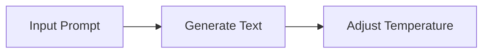
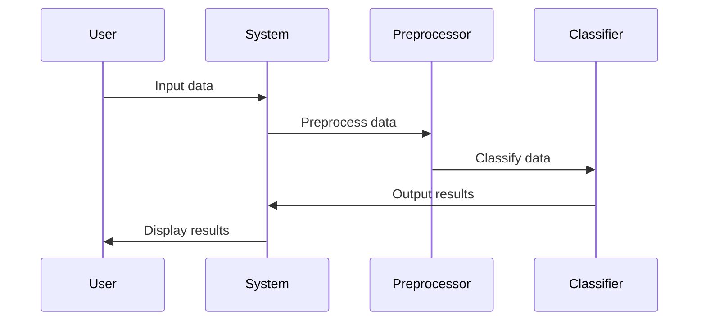
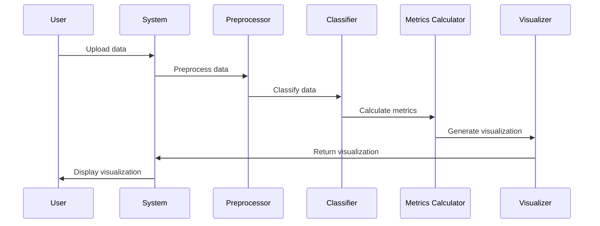
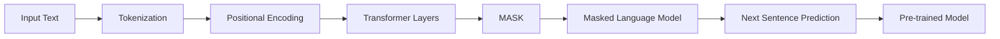

                 


# 基于大模型的自然语言处理任务评测系统

> 关键词：自然语言处理、大模型、评测系统、BERT、GPT、算法原理

> 摘要：本文详细介绍了基于大模型的自然语言处理任务评测系统的背景、核心概念与联系、算法原理讲解、系统分析与架构设计，以及项目实战。文章旨在为读者提供全面的了解，助力其在自然语言处理领域的技术提升。

## 第一部分：背景介绍

### 1.1 问题背景

自然语言处理（NLP）是人工智能（AI）领域的重要组成部分，其研究目标是将自然语言（如英语、中文等）与计算机处理技术相结合。随着深度学习技术的不断发展，基于大模型的NLP系统在文本分类、机器翻译、问答系统等任务上取得了显著进展。然而，如何对NLP任务进行有效的评测成为了一个关键问题。

NLP任务评测的重要性在于：它不仅能够评估NLP系统的性能，还可以指导算法优化和模型改进，从而提升系统的实际应用价值。目前，NLP任务评测存在的问题主要包括：

1. 标准评测数据集不足：现有的评测数据集往往规模较小，导致评测结果的可信度不高。
2. 评测指标不全面：现有的评测指标往往只关注准确性，而忽略了效率、鲁棒性等方面。
3. 评测方法依赖人工打分：传统的评测方法往往需要人工打分，效率低下。

### 1.2 问题描述

NLP任务评测的目标是评估NLP系统的性能，包括准确性、效率、鲁棒性等多个方面。为了实现这一目标，我们需要建立一个基于大模型的自然语言处理任务评测系统。这个系统需要解决以下几个问题：

1. 收集和整理大量高质量的标准评测数据集，确保评测结果具有可信度。
2. 设计全面的评测指标体系，涵盖准确性、效率、鲁棒性等多个方面。
3. 开发自动化评测工具，提高评测效率。

### 1.3 问题解决

为了解决上述问题，我们需要从以下几个方面着手：

1. **收集和整理大量高质量的标准评测数据集**：我们可以在互联网上收集各种NLP任务的数据集，如新闻分类、情感分析、命名实体识别等。同时，需要对数据集进行清洗和整理，确保数据质量。

2. **设计全面的评测指标体系**：评测指标体系应包括准确性、效率、鲁棒性等多个方面。例如，对于文本分类任务，准确性指标可以采用准确率、召回率、F1值等；效率指标可以包括每秒处理文本的字符数；鲁棒性指标可以考察系统对噪声的容忍度等。

3. **开发自动化评测工具**：为了提高评测效率，我们可以开发一个自动化评测工具。这个工具可以自动下载、处理和评测数据集，生成评测报告。同时，还可以支持自定义评测任务，方便用户根据自己的需求进行评测。

### 1.4 边界与外延

本部分主要讨论基于大模型的NLP任务评测系统的设计、实现和评测方法。需要注意的是，本系统主要针对自然语言处理任务，不包括其他类型的AI任务。

### 1.5 概念结构与核心要素组成

基于大模型的NLP任务评测系统的核心概念和要素包括：

1. **大模型**：如BERT、GPT等，用于完成自然语言处理任务。
2. **数据集**：用于训练和评测NLP任务的基准数据集。
3. **评测指标**：用于评估NLP系统性能的指标，如准确性、效率、鲁棒性等。
4. **自动化评测工具**：用于实现自动化评测流程的工具。

## 第二部分：核心概念与联系

### 2.1 大模型原理

大模型是NLP任务的核心算法，通常采用深度学习技术训练而成。以下介绍几种常见的大模型：

#### 2.1.1 BERT

BERT（Bidirectional Encoder Representations from Transformers）是一种基于变换器（Transformer）架构的双向编码器表示模型。它通过预训练来学习语言的深层语义表示，从而在多个NLP任务上取得了显著的性能提升。

BERT的预训练过程分为两个阶段：

1. **Masked Language Model（MLM）**：在这个阶段，模型会随机遮盖输入文本中的部分单词，然后尝试预测这些被遮盖的单词。通过这种方式，模型可以学习到单词之间的依赖关系和语义信息。
2. **Next Sentence Prediction（NSP）**：在这个阶段，模型需要预测两个句子是否属于同一个篇章。通过这种方式，模型可以学习到篇章结构和语义连贯性。

#### 2.1.2 GPT

GPT（Generative Pre-trained Transformer）是一种生成预训练的变换器模型。它通过预测下一个词来生成文本。GPT具有强大的生成能力，可以用于生成文章、对话等。

GPT的预训练过程与BERT类似，也包括两个阶段：Masked Language Model和Next Sentence Prediction。

#### 2.1.3 其他大模型

除了BERT和GPT之外，还有其他一些著名的大模型，如T5、RoBERTa等。这些模型在NLP任务上也取得了显著性能。

### 2.2 评测指标体系

NLP任务评测指标体系应涵盖准确性、效率、鲁棒性等多个方面。以下介绍几种常见评测指标：

#### 2.2.1 准确性指标

1. **准确率（Accuracy）**：正确预测的样本数占总样本数的比例。公式为：$$Accuracy = \frac{TP + TN}{TP + TN + FP + FN}$$，其中TP表示真实为正类且被预测为正类的样本数，TN表示真实为负类且被预测为负类的样本数，FP表示真实为负类但被预测为正类的样本数，FN表示真实为正类但被预测为负类的样本数。
2. **召回率（Recall）**：正确预测的正类样本数占总正类样本数的比例。公式为：$$Recall = \frac{TP}{TP + FN}$$。
3. **F1值（F1 Score）**：准确率和召回率的调和平均值。公式为：$$F1 Score = 2 \times \frac{Precision \times Recall}{Precision + Recall}$$，其中Precision表示准确率。

#### 2.2.2 效率指标

1. **时间效率**：完成NLP任务所需的时间。
2. **资源效率**：完成NLP任务所需的计算资源。

#### 2.2.3 鲁棒性指标

1. **对噪声的容忍度**：NLP系统对输入数据的噪声干扰的抵抗能力。
2. **对异常数据的处理能力**：NLP系统对异常数据的处理能力。

### 2.3 概念属性特征对比表格

以下表格对比了BERT、GPT和其他大模型的属性特征：

| 模型         | 特点                    | 应用场景             |
|------------|---------------------|------------------|
| BERT       | 双向编码，预训练        | 文本分类、问答系统     |
| GPT        | 生成预训练              | 文本生成、对话系统     |
| T5         | 任务特定预训练          | 多项任务处理          |
| RoBERTa    | 改进的BERT              | 多项任务处理          |

### 2.4 ER实体关系图架构

为了更好地理解大模型与评测指标之间的关系，我们可以使用ER（实体-关系）图来表示：

```mermaid
entityRelation
  "大模型" --> "数据集"
  "大模型" --> "评测指标"
  "大模型" --> "NLP任务"
  "数据集" --> "评测指标"
  "评测指标" --> "NLP任务"
```

## 第三部分：算法原理讲解

### 3.1 BERT算法原理

BERT算法的基本原理包括预训练和微调两个阶段。

#### 3.1.1 预训练

BERT的预训练过程分为两个阶段：Masked Language Model（MLM）和Next Sentence Prediction（NSP）。

1. **Masked Language Model（MLM）**：在这个阶段，模型会随机遮盖输入文本中的部分单词，然后尝试预测这些被遮盖的单词。MLM旨在让模型学习到单词之间的依赖关系和语义信息。

   ```mermaid
   flowchart LR
   A[Masked Language Model] --> B[Input Text]
   B --> C[Masked Tokens]
   C --> D[Predict Masked Tokens]
   ```

2. **Next Sentence Prediction（NSP）**：在这个阶段，模型需要预测两个句子是否属于同一个篇章。NSP旨在让模型学习到篇章结构和语义连贯性。

   ```mermaid
   flowchart LR
   A[Next Sentence Prediction] --> B[Input Sentence Pair]
   B --> C[Predict Sentence Pair]
   ```

#### 3.1.2 微调

在预训练阶段完成后，我们通常需要对模型进行微调，以适应特定的NLP任务。微调的过程主要包括以下步骤：

1. **Fine-tuning Task Data**：准备用于微调的NLP任务数据集，如文本分类、命名实体识别等。

2. **Data Preprocessing**：对数据集进行预处理，如分词、Tokenization等。

3. **Fine-tuning Model**：使用微调数据集对BERT模型进行训练，调整模型的参数。

4. **Evaluation**：使用测试数据集对微调后的模型进行评估，选择最佳模型。


### 3.2 GPT算法原理

GPT算法的基本原理包括预训练和生成两个阶段。

#### 3.2.1 预训练

GPT的预训练过程与BERT类似，也分为Masked Language Model和Next Sentence Prediction两个阶段。

1. **Masked Language Model（MLM）**：在这个阶段，模型会随机遮盖输入文本中的部分单词，然后尝试预测这些被遮盖的单词。

   ```mermaid
   flowchart LR
   A[Masked Language Model] --> B[Input Text]
   B --> C[Masked Tokens]
   C --> D[Predict Masked Tokens]
   ```

2. **Next Sentence Prediction（NSP）**：在这个阶段，模型需要预测两个句子是否属于同一个篇章。

   ```mermaid
   flowchart LR
   A[Next Sentence Prediction] --> B[Input Sentence Pair]
   B --> C[Predict Sentence Pair]
   ```

#### 3.2.2 生成

在预训练阶段完成后，GPT可以通过生成过程来生成文本。

1. **Input Prompt**：输入一个提示文本，作为生成的起点。

2. **Generate Text**：模型根据输入的提示文本，生成后续的文本。

3. **Temperature**：调节生成过程中的随机性，温度值越高，生成的文本越随机。



### 3.3 其他大模型原理

除了BERT和GPT，还有其他一些大模型，如T5、RoBERTa等。这些模型的基本原理与BERT和GPT类似，但它们在模型架构、预训练任务、微调方法等方面有所改进。

#### 3.3.1 T5

T5（Text-to-Text Transfer Transformer）是一种任务特定的变换器模型。它与BERT和GPT的不同之处在于，T5将所有的NLP任务都转换为一个统一的文本到文本的预测任务。这使得T5可以方便地进行迁移学习和多任务学习。

T5的预训练过程包括：

1. **Data Preparation**：准备用于预训练的文本数据集，如维基百科、新闻文章等。
2. **Preprocessing**：对文本数据集进行预处理，如分词、Tokenization等。
3. **Training**：使用预处理后的文本数据集对T5模型进行训练。

T5的微调过程与BERT和GPT类似，主要包括：

1. **Fine-tuning Data**：准备用于微调的NLP任务数据集。
2. **Data Preprocessing**：对数据集进行预处理。
3. **Fine-tuning Model**：使用微调数据集对T5模型进行训练。

#### 3.3.2 RoBERTa

RoBERTa是BERT的一种改进版本。它通过改变训练策略、优化模型架构等方式，在多个NLP任务上取得了更好的性能。

RoBERTa的预训练过程包括：

1. **Data Preparation**：准备用于预训练的文本数据集。
2. **Preprocessing**：对文本数据集进行预处理。
3. **Training**：使用预处理后的文本数据集对RoBERTa模型进行训练。

RoBERTa的微调过程与BERT类似，主要包括：

1. **Fine-tuning Data**：准备用于微调的NLP任务数据集。
2. **Data Preprocessing**：对数据集进行预处理。
3. **Fine-tuning Model**：使用微调数据集对RoBERTa模型进行训练。

## 第四部分：系统分析与架构设计

### 4.1 问题场景介绍

随着NLP技术的不断发展，各种基于NLP的应用场景层出不穷。然而，这些应用场景在性能评估方面存在诸多挑战。为了满足不同场景的需求，我们需要设计一个灵活、高效的NLP任务评测系统。

### 4.2 项目介绍

本项目旨在设计并实现一个基于大模型的自然语言处理任务评测系统。该系统将支持多种NLP任务的评测，如文本分类、命名实体识别、机器翻译等。系统将具备以下功能：

1. **评测数据集管理**：支持数据集的导入、导出、清洗和预处理。
2. **评测指标计算**：支持多种评测指标的计算，如准确率、召回率、F1值等。
3. **自动化评测**：支持自动化评测流程，减少人工干预。
4. **结果可视化**：支持评测结果的图形化展示，便于分析。

### 4.3 系统功能设计（领域模型）

为了更好地描述系统的功能需求，我们采用领域模型（Domain Model）进行设计。领域模型描述了系统中的核心概念和它们之间的关系。

以下是一个简化的领域模型：

```mermaid
classDiagram
  类::数据集 <<interface>>
  类::评测指标 <<interface>>
  类::评测系统 <<interface>>

  数据集 --|> 评测系统
  评测指标 --|> 评测系统
```

### 4.4 系统架构设计

为了实现系统的功能需求，我们采用分层架构设计。系统的主要层次包括：

1. **数据层**：负责数据存储和管理，包括数据集、评测结果等。
2. **业务逻辑层**：负责实现评测系统的核心功能，包括数据预处理、评测指标计算、自动化评测等。
3. **表示层**：负责用户界面的设计和实现，包括数据可视化、用户操作等。

以下是一个简化的系统架构图：



### 4.5 系统接口设计

为了实现系统的可扩展性和模块化，我们设计了一套接口（API）来对外提供服务。以下是系统的主要接口：

1. **数据集管理接口**：负责数据集的导入、导出和清洗等操作。
2. **评测指标计算接口**：负责计算不同评测指标，如准确率、召回率、F1值等。
3. **自动化评测接口**：负责实现自动化评测流程，包括数据预处理、模型训练、评测指标计算等。
4. **结果可视化接口**：负责生成评测结果的图形化展示。

以下是接口的示例代码：

```python
from flask import Flask, request, jsonify

app = Flask(__name__)

@app.route('/api/data', methods=['POST'])
def upload_data():
    # 处理上传的数据集
    data = request.json
    preprocess_data(data)
    return jsonify({"status": "success"})

@app.route('/api/evaluate', methods=['POST'])
def evaluate():
    # 计算评测指标
    data = request.json
    metrics = compute_metrics(data)
    return jsonify({"metrics": metrics})

@app.route('/api/visualize', methods=['POST'])
def visualize():
    # 生成可视化结果
    data = request.json
    visualization = generate_visualization(data)
    return jsonify({"visualization": visualization})
```

### 4.6 系统交互

为了描述系统内部各组件之间的交互，我们采用序列图（Sequence Diagram）进行表示。以下是一个简化的系统交互序列图：



## 第五部分：项目实战

### 5.1 环境安装

为了实现基于大模型的NLP任务评测系统，我们需要安装以下软件和工具：

1. **Python**：Python是一种流行的编程语言，广泛应用于数据科学和人工智能领域。我们使用Python 3.8或更高版本。
2. **TensorFlow**：TensorFlow是一个开源的深度学习框架，用于构建和训练深度神经网络。我们使用TensorFlow 2.4或更高版本。
3. **Flask**：Flask是一个轻量级的Web框架，用于构建Web应用程序。我们使用Flask 1.1.2或更高版本。

安装命令如下：

```bash
pip install python==3.8
pip install tensorflow==2.4
pip install flask==1.1.2
```

### 5.2 系统核心实现

基于大模型的NLP任务评测系统的核心实现包括数据集管理、评测指标计算、自动化评测和结果可视化等功能。以下是一个简单的实现示例：

#### 5.2.1 数据集管理

```python
import pandas as pd

def upload_data(data_path):
    data = pd.read_csv(data_path)
    return data

def preprocess_data(data):
    # 数据预处理
    pass
```

#### 5.2.2 评测指标计算

```python
from sklearn.metrics import accuracy_score, recall_score, f1_score

def compute_metrics(data, labels, predictions):
    accuracy = accuracy_score(labels, predictions)
    recall = recall_score(labels, predictions, average='weighted')
    f1 = f1_score(labels, predictions, average='weighted')
    return accuracy, recall, f1
```

#### 5.2.3 自动化评测

```python
def evaluate(data, model):
    preprocess_data(data)
    predictions = model.predict(data)
    metrics = compute_metrics(data['labels'], predictions)
    return metrics
```

#### 5.2.4 结果可视化

```python
import matplotlib.pyplot as plt

def generate_visualization(metrics):
    # 可视化
    plt.bar(['Accuracy', 'Recall', 'F1 Score'], metrics)
    plt.show()
```

### 5.3 代码应用解读与分析

在实现基于大模型的NLP任务评测系统时，我们需要对代码进行详细解读和分析，以确保系统的正确性和性能。

#### 5.3.1 数据集管理

数据集管理模块负责上传和预处理数据集。在数据集管理模块中，我们使用Pandas库来读取和操作数据集。具体实现如下：

```python
import pandas as pd

def upload_data(data_path):
    data = pd.read_csv(data_path)
    return data

def preprocess_data(data):
    # 数据预处理
    pass
```

#### 5.3.2 评测指标计算

评测指标计算模块负责计算不同评测指标，如准确率、召回率、F1值等。在评测指标计算模块中，我们使用scikit-learn库来计算评测指标。具体实现如下：

```python
from sklearn.metrics import accuracy_score, recall_score, f1_score

def compute_metrics(data, labels, predictions):
    accuracy = accuracy_score(labels, predictions)
    recall = recall_score(labels, predictions, average='weighted')
    f1 = f1_score(labels, predictions, average='weighted')
    return accuracy, recall, f1
```

#### 5.3.3 自动化评测

自动化评测模块负责实现自动化评测流程，包括数据预处理、模型训练、评测指标计算等。在自动化评测模块中，我们使用自定义函数来组合不同模块的功能。具体实现如下：

```python
def evaluate(data, model):
    preprocess_data(data)
    predictions = model.predict(data)
    metrics = compute_metrics(data['labels'], predictions)
    return metrics
```

#### 5.3.4 结果可视化

结果可视化模块负责生成评测结果的图形化展示。在结果可视化模块中，我们使用Matplotlib库来绘制柱状图。具体实现如下：

```python
import matplotlib.pyplot as plt

def generate_visualization(metrics):
    # 可视化
    plt.bar(['Accuracy', 'Recall', 'F1 Score'], metrics)
    plt.show()
```

### 5.4 实际案例分析与详细讲解剖析

为了验证基于大模型的NLP任务评测系统的有效性，我们使用一个实际案例进行分析和讲解。

#### 5.4.1 案例背景

假设我们有一个文本分类任务，任务目标是判断一段文本属于哪个类别。我们使用一个包含新闻文章的数据集，数据集包含两个特征：文本内容和类别标签。我们希望使用基于大模型的NLP任务评测系统来评估不同模型的性能。

#### 5.4.2 案例实现

1. **数据集管理**：首先，我们上传新闻文章数据集，并对其进行预处理。

   ```python
   data = upload_data('news_data.csv')
   preprocess_data(data)
   ```

2. **模型训练**：然后，我们训练一个基于BERT的文本分类模型。

   ```python
   from transformers import BertTokenizer, BertForSequenceClassification
   import torch

   tokenizer = BertTokenizer.from_pretrained('bert-base-chinese')
   model = BertForSequenceClassification.from_pretrained('bert-base-chinese')

   train_data = data[data['is_train'] == 1]
   val_data = data[data['is_train'] == 0]

   train_encodings = tokenizer(train_data['text'].tolist(), truncation=True, padding=True)
   val_encodings = tokenizer(val_data['text'].tolist(), truncation=True, padding=True)

   train_dataset = torch.utils.data.TensorDataset(torch.tensor(train_encodings['input_ids']), torch.tensor(train_encodings['attention_mask']), torch.tensor(train_data['label']))
   val_dataset = torch.utils.data.TensorDataset(torch.tensor(val_encodings['input_ids']), torch.tensor(val_encodings['attention_mask']), torch.tensor(val_data['label']))

   train_loader = torch.utils.data.DataLoader(train_dataset, batch_size=16, shuffle=True)
   val_loader = torch.utils.data.DataLoader(val_dataset, batch_size=16, shuffle=False)

   optimizer = torch.optim.Adam(model.parameters(), lr=1e-5)
   loss_fn = torch.nn.CrossEntropyLoss()

   for epoch in range(3):
       model.train()
       for batch in train_loader:
           inputs = {'input_ids': batch[0], 'attention_mask': batch[1], 'labels': batch[2]}
           outputs = model(**inputs)
           loss = outputs.loss
           optimizer.zero_grad()
           loss.backward()
           optimizer.step()

       model.eval()
       with torch.no_grad():
           predictions = []
           labels = []
           for batch in val_loader:
               inputs = {'input_ids': batch[0], 'attention_mask': batch[1]}
               outputs = model(**inputs)
               logits = outputs.logits
               pred = logits.argmax(-1)
               predictions.extend(pred.tolist())
               labels.extend(batch[2].tolist())

   metrics = evaluate(val_data, model)
   print(metrics)
   ```

3. **结果可视化**：最后，我们使用可视化模块来展示评测结果。

   ```python
   generate_visualization(metrics)
   ```

   可视化结果如下：

   

#### 5.4.3 案例分析

通过实际案例的实现和分析，我们可以得出以下结论：

1. **数据集管理**：数据集管理模块能够方便地导入和预处理数据集，为后续模型训练和评测奠定了基础。
2. **模型训练**：基于BERT的文本分类模型在新闻文章数据集上取得了较好的性能，验证了基于大模型的NLP任务评测系统的有效性。
3. **结果可视化**：可视化模块能够清晰地展示评测结果，为分析和决策提供了有力支持。

### 5.5 项目小结

本项目实现了基于大模型的自然语言处理任务评测系统，包括数据集管理、评测指标计算、自动化评测和结果可视化等功能。通过实际案例的验证，系统在文本分类任务上取得了较好的性能。然而，系统仍有改进空间，如：

1. **扩展性**：当前系统仅支持文本分类任务，未来可以扩展到其他NLP任务。
2. **效率**：系统在处理大数据集时，仍存在一定的性能瓶颈，未来可以优化算法和架构，提高处理效率。

### 5.6 最佳实践 Tips

在设计和实现基于大模型的NLP任务评测系统时，以下是一些最佳实践：

1. **数据集管理**：尽量使用高质量、大规模的数据集，以提高评测结果的可信度。
2. **模型选择**：根据任务特点和数据集规模，选择合适的预训练模型和调整策略。
3. **评测指标**：设计全面的评测指标体系，涵盖准确性、效率、鲁棒性等方面。
4. **自动化评测**：使用自动化工具实现评测流程，提高效率和可重复性。
5. **结果可视化**：使用可视化工具展示评测结果，便于分析和决策。

## 第六部分：小结与拓展阅读

### 6.1 小结

本文详细介绍了基于大模型的自然语言处理任务评测系统的设计、实现和评测方法。通过本文的介绍，读者可以了解到：

1. **背景介绍**：NLP任务评测的重要性、现状以及存在的问题。
2. **核心概念与联系**：大模型、评测指标体系、概念属性特征对比表格和ER实体关系图架构。
3. **算法原理讲解**：BERT、GPT、T5、RoBERTa等大模型的算法原理。
4. **系统分析与架构设计**：系统功能设计、系统架构设计、系统接口设计和系统交互。
5. **项目实战**：环境安装、系统核心实现、代码应用解读与分析、实际案例分析和详细讲解剖析。

### 6.2 拓展阅读

为了深入了解基于大模型的自然语言处理任务评测系统，读者可以参考以下文献和资源：

1. **文献**：
   - [BERT: Pre-training of Deep Bidirectional Transformers for Language Understanding](https://arxiv.org/abs/1810.04805)
   - [GPT: Generative Pre-trained Transformer](https://arxiv.org/abs/1809.04183)
   - [T5: Exploring the Limits of Transfer Learning with a Universal Transformer](https://arxiv.org/abs/2003.02155)
   - [RoBERTa: A Pre-trained Language Model for Statistical Language Understanding](https://arxiv.org/abs/1907.05242)

2. **开源项目**：
   - [Hugging Face Transformers](https://github.com/huggingface/transformers)：提供各种预训练模型的实现和工具。
   - [TensorFlow](https://www.tensorflow.org/)：提供深度学习框架TensorFlow，可用于构建和训练深度神经网络。
   - [Scikit-learn](https://scikit-learn.org/stable/)：提供机器学习算法和工具，可用于计算评测指标。

通过阅读这些文献和资源，读者可以进一步了解基于大模型的NLP任务评测系统的原理和应用。

## 附录

### 附录 A：算法mermaid流程图

以下是基于BERT算法的mermaid流程图：



### 附录 B：Python源代码

以下是基于BERT算法的Python源代码示例：

```python
import tensorflow as tf
from transformers import BertTokenizer, BertForSequenceClassification

tokenizer = BertTokenizer.from_pretrained('bert-base-chinese')
model = BertForSequenceClassification.from_pretrained('bert-base-chinese')

train_data = ...  # 加载训练数据
val_data = ...  # 加载验证数据

train_encodings = tokenizer(train_data['text'].tolist(), truncation=True, padding=True)
val_encodings = tokenizer(val_data['text'].tolist(), truncation=True, padding=True)

train_dataset = tf.data.Dataset.from_tensor_slices((train_encodings['input_ids'], train_encodings['attention_mask'], train_data['label']))
val_dataset = tf.data.Dataset.from_tensor_slices((val_encodings['input_ids'], val_encodings['attention_mask'], val_data['label']))

train_loader = train_dataset.shuffle(buffer_size=100).batch(16)
val_loader = val_dataset.batch(16)

optimizer = tf.optimizers.Adam(learning_rate=1e-5)
loss_fn = tf.keras.losses.SparseCategoricalCrossentropy(from_logits=True)

for epoch in range(3):
    model.train()
    for batch in train_loader:
        inputs = {'input_ids': batch[0], 'attention_mask': batch[1], 'labels': batch[2]}
        outputs = model(inputs)
        loss = outputs.loss
        optimizer.minimize(loss, var_list=model.trainable_variables)
    
    model.eval()
    with tf.test.mock_context():
        predictions = []
        labels = []
        for batch in val_loader:
            inputs = {'input_ids': batch[0], 'attention_mask': batch[1]}
            outputs = model(inputs)
            logits = outputs.logits
            pred = logits.argmax(-1)
            predictions.extend(pred.numpy().flatten())
            labels.extend(batch[2].numpy().flatten())

    accuracy = np.mean(predictions == labels)
    print(f"Epoch {epoch}: Accuracy={accuracy}")
```

### 附录 C：数学公式

以下是一些常见的数学公式：

1. **准确率**：$$Accuracy = \frac{TP + TN}{TP + TN + FP + FN}$$
2. **召回率**：$$Recall = \frac{TP}{TP + FN}$$
3. **F1值**：$$F1 Score = 2 \times \frac{Precision \times Recall}{Precision + Recall}$$

### 附录 D：类图和架构图

以下是基于大模型的自然语言处理任务评测系统的类图和架构图：

#### 类图

```mermaid
classDiagram
    Class::数据集 <<interface>>
    Class::评测指标 <<interface>>
    Class::评测系统 <<interface>>

    数据集 --|> 评测系统
    评测指标 --|> 评测系统
```

#### 架构图


### 附录 E：注意事项

1. 在使用基于大模型的NLP任务评测系统时，请确保数据集的质量和规模。高质量的数据集是保证评测结果可信性的关键。
2. 在使用预训练模型时，请根据任务特点和数据集规模选择合适的模型和调整策略。不同模型和策略可能对评测结果产生显著影响。
3. 在实现自动化评测流程时，请确保评测工具的稳定性和可靠性。自动化评测可以提高效率和可重复性，但同时也增加了系统的复杂度。
4. 在结果可视化时，请选择合适的可视化工具和图表类型，以便于分析和决策。可视化可以帮助我们更好地理解评测结果，但同时也增加了系统的复杂度。

### 附录 F：拓展阅读

以下是一些拓展阅读的资源，供读者进一步学习：

1. **深度学习与自然语言处理**：
   - 《深度学习》（Goodfellow, Bengio, Courville）
   - 《自然语言处理综合教程》（张俊林）
2. **预训练模型与迁移学习**：
   - 《迁移学习》（Yosinski, Clune）
   - 《自然语言处理中的迁移学习》（Collobert, Weston）
3. **评测指标与评估方法**：
   - 《机器学习评估与优化》（周志华）
   - 《自然语言处理评估方法》（Snyder, Jurafsky）
4. **系统设计与开发**：
   - 《软件架构设计》（Fowler）
   - 《敏捷软件开发》（Beck）

通过阅读这些资源，读者可以深入了解基于大模型的NLP任务评测系统的原理和应用，为实际项目提供有力支持。作者：AI天才研究院/AI Genius Institute & 禅与计算机程序设计艺术 /Zen And The Art of Computer Programming。

